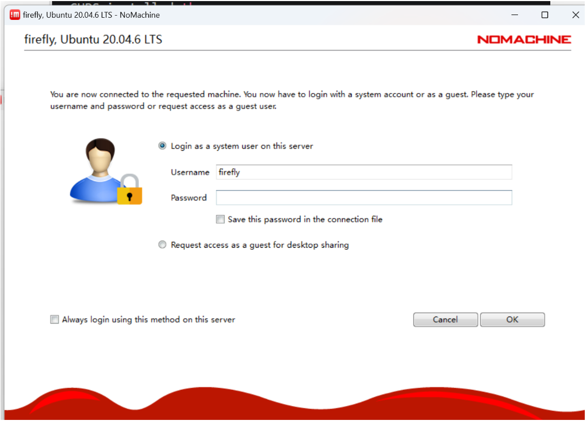
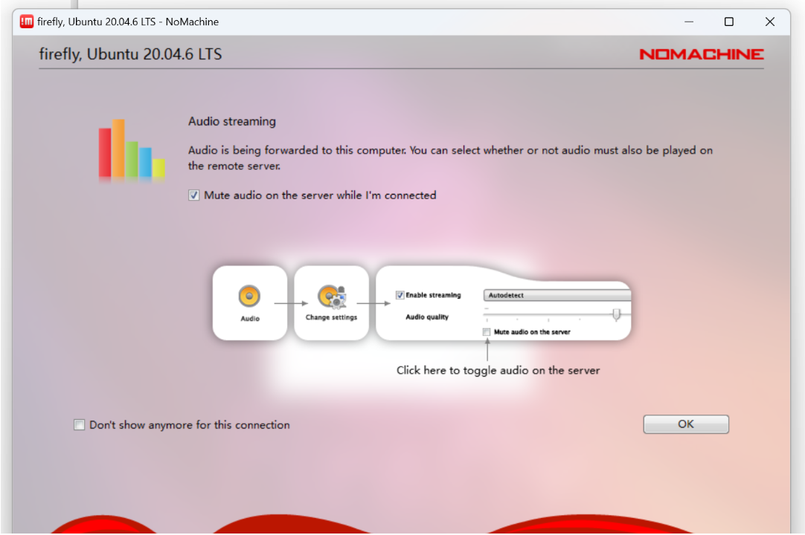
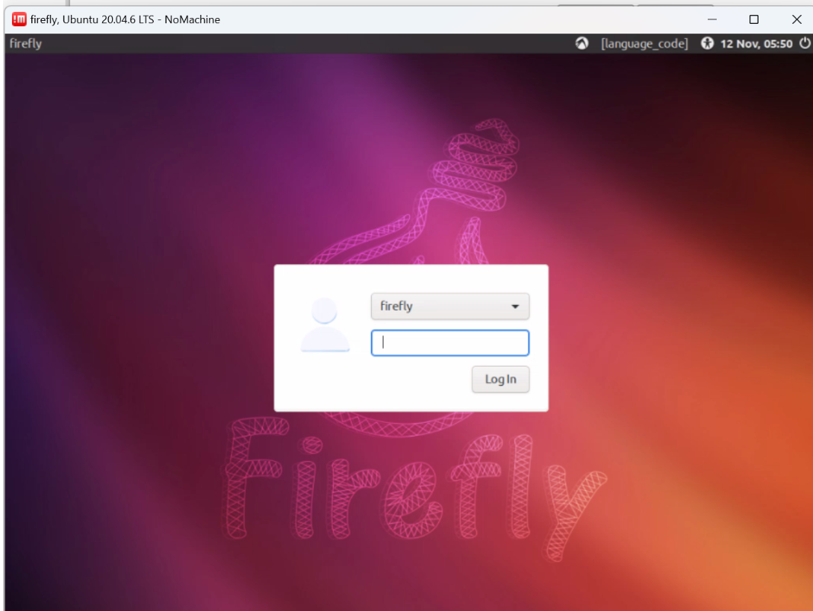

首先去官网下载对应的版本：
windows版本的下载教程在这里就省略了，很简单常规

这里说说ubuntu版本的：
下载完包以后，把安装包传入到linux当中:


我这里下载了nomachine_9.2.18_3_arm64.deb，根据自己的架构、系统选择对应的即可。

然后允许下面的这句指令安装：
```bash
sudo dpkg -i nomachine_9.2.18_3_arm64.deb
```


这样就安装完成了，有警告不用管。

然后打开客户端，我这里是windows版本的，该软件默认会自动搜索，所以连ip信息都不需要看，就很方便


然后双击要连接的对象即可：



输入用户名和密码


遇到这些提示信息，一律OK跳过，觉得烦可以点不再提醒


然后就可以正常连接上了：



