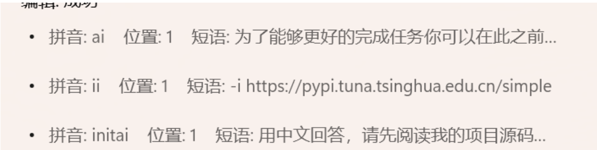
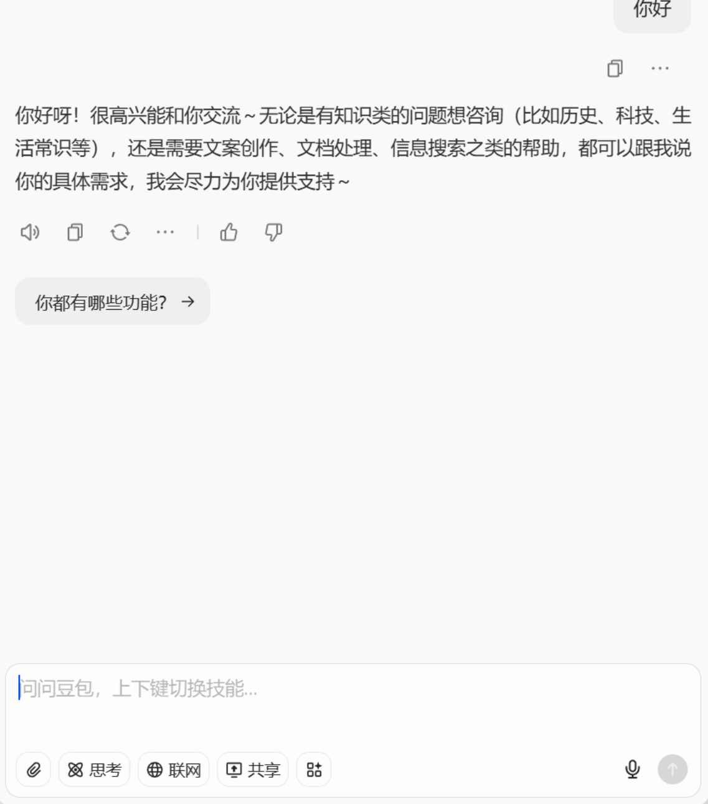
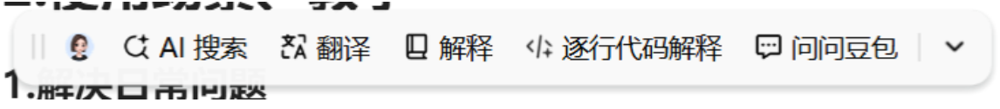
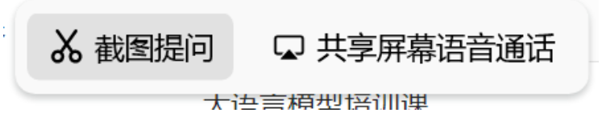
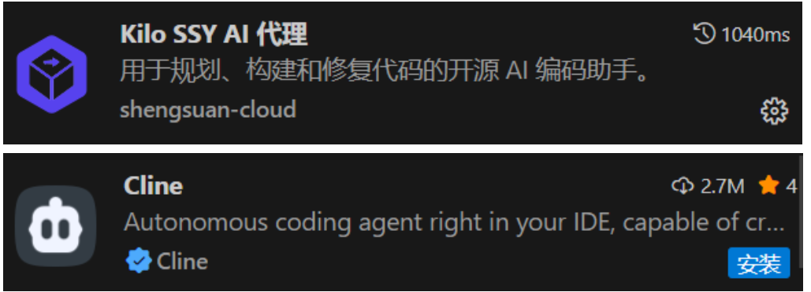
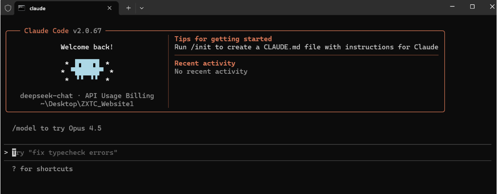

# 大语言模型培训课_ZXZC25
### 1.大语言模型介绍

##### 个人常用大模型：
- 豆包：日常使用
- Deepseek：国内性价比最高  api调用
- Gemini：国外性价比最高 谷歌公司 Gemini2.5 有学生专享  有每个账号每日免费api调用
- ChatGPT：国外多模态较强
- ChatGLM：国内体验较好

##### 大模型基础知识：

**基本理解**  
1.大语言模型的回复本质是猜测,根据上文计算下文的概率从而吐字回答。  大 ：数据量比较大  训练：是一个从量变到质变  648B    8B  4B
2.大语言模型不擅长解决数学问题、物理问题。
3.大语言模型更擅长解决自小问题，问题越小，解决能力/正确率越高。
4.如何让大模型的回复能力更强：给予更多的信息，解决更小的问题。

**常用提示词**
1.为了能够更好的完成任务你可以在此之前先问我几个问题，用中文来回答，若有代码输出别省略代码；执行任务过程中有问题随时问我


2.用中文回答，请先阅读我的项目源码随后再来听取我的问题


==我个人很常用，甚至为它设置了专门的输入词==
ai：为了能够更好的完成任务你可以在此之前先问我几个问题，用中文来回答，若有代码输出别省略代码；执行任务过程中有问题随时问我

initai:用中文回答，请先阅读我的项目源码随后再来听取我的问题



**API_KEY**
```
一、先搞懂 API：就像餐厅的 “服务员”

你可以把API想象成餐厅里的 “服务员”。

比如你想吃一份番茄炒蛋，不会直接冲进后厨找厨师（相当于直接操作 AI 模型 / 底层程序），而是通过服务员传递需求 —— 你告诉服务员 “要一份番茄炒蛋”，服务员再把需求传给厨师，厨师做好后，服务员又把菜端到你面前。

API 就是这个 “服务员”，它是两个程序 / 系统之间沟通的 “桥梁”，帮我们屏蔽掉复杂的底层逻辑（比如 AI 模型的训练、部署），只需要按规矩提需求，就能拿到想要的结果。


二、API 调用：就是 “找服务员下单” 的动作

API 调用就是你（自己写的小程序）给 API 这个 “服务员” 发指令、提需求的过程。

比如你想让 AI 帮你写一段祝福语，你的程序就会通过 API 接口，把 “写一段生日祝福语” 这个需求传给 AI 服务商的系统，这整个动作就叫 API 调用。


三、APIKey：你的 “用餐身份凭证”
 
APIKey可以理解成你在这家 “餐厅” 的专属身份卡 / 取餐码。

一方面，餐厅要确认你是 “合法顾客”（有使用权限），不是随便来蹭服务的；另一方面，还要用它来统计你的 “消费”（比如调用次数、消耗的资源），避免有人恶意频繁下单搞垮后厨。

没有 APIKey，你的程序就没法和 AI 服务商的系统建立连接，API 调用也会直接失败。

```

远程使用大语言模型的时候  需要一个地址和钥匙   地址：肯德基    钥匙：KEY  密钥


在各大 大语言模型官网可以获得api_key、api调用教程。


API获得方式：
1.官网
2.第三方  硅基流动
3.私人卖家   反代理  淘宝 闲鱼  时长卡/次数卡


##### 大模型使用方式：
###### 1.网页端使用
优点：使用简单，基本免费

缺点：功能较少

使用场景：解决日常问题、部分coding、AI-PPT等


###### 2.AI客户端：豆包
优点：调用方便，即用即走。

缺点：客户端挂后台，消耗电脑占用资源

使用场景：日常解决问题



###### 3.Vscode-AI插件
优点：可以直接让ai编辑文件、执行命令行

缺点：需要api-key  花钱

使用场景：AI-coding、AI-md


###### 4.CLI 命令行
优点：AI-coding很强悍  在命令行的环境

缺点：需要api-key、话少，不利于学习

使用场景：AI-coding、AI-md


## 2.使用场景、教学
##### 1.解决日常问题
使用豆包客户端进行日常问题的回答，即用即走，支持截图


个人设置快捷键：
ALT+F2   弹出对话框

ALT+F3   截图提问



场景一：当代码遇到报错时，进行划词提问

场景二：当阅读文章遇到不懂的地方时，进行划词提问

场景三：当记不住某个功能的代码/某个命令时，进行弹窗提问

场景四：当遇到看不懂的图片时，进行截图提问


##### 2.AI-coding
这里主要介绍两个工具，大家根据自己的喜好进行使用。
1.VScode插件：Kilo code、Cline


对应的配置、使用教程可在B站搜索


2.AI-CLI工具:Claude code 、 Genimi CLI

对应的配置、使用教程可在B站搜索


案例演示：
使用AI编程工具帮我们制作一款贪吃蛇游戏。
prompt:帮我使用Python编写一款贪吃蛇游戏，要求有基本的UI界面、分值、以及尽可能优美的视觉画面、游戏效果等等。


##### 3.AI-PPT
建议使用网页在线端，一方面是基本免费，另一方面是网页可以用到质量较高的模型。

AI制作PPT的原理：让AI根据你的想法生成SVG代码，随后再将其复制到PPT中，转化为形状，随后再进行微调等操作。


案例演示：把现在的这个文档制作成PPT版本。


第一步：给你列PPT的大纲

循环：
	第二步：给你做某一页PPT 用SVG实现，给我完整的SVG代码
	
	第三步：导入PPT，微调


##### 4.AI-md
让ai给你生成markdown文件，建议使用vscode插件/AI-CLI工具。


