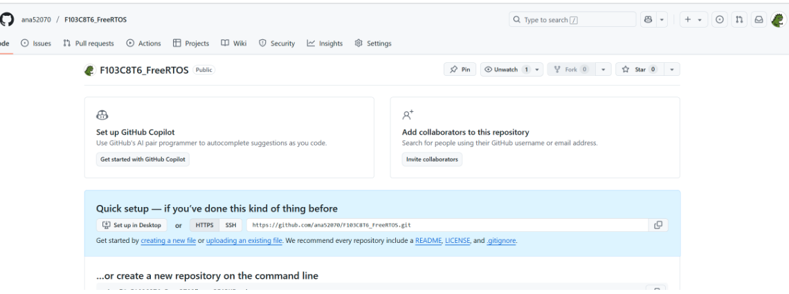
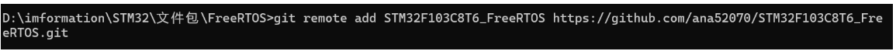
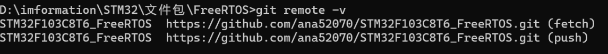
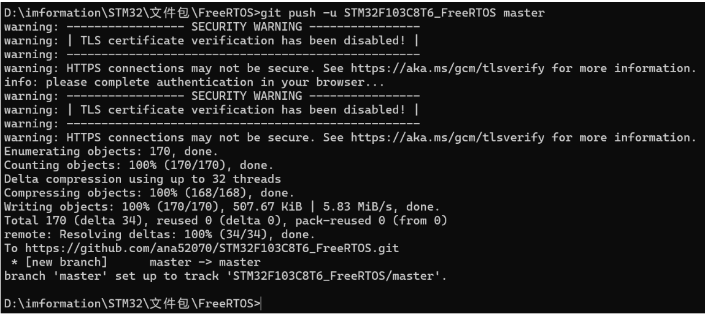

# Git入门学习
## 新建代码仓库

```bash
git config --global user.name "your_username"	#你的用户名

git config --global user.email "your_email"	#你的邮箱

git config --global init.defaultBranch master

git config -l	#查看当前git的配置

git init		#初始化代码仓库(需在所需要的文件夹下执行)

rm -rf .git		#删库(linux环境下)
Remove-Item -Recurse -Force .git	#删库(windows环境下)
```


## 学会提交代码

```bash
#add:保存代码至缓存区

git add src/status_interfaces/package.xml	#指定路径添加

git add src		#添加一整个文件夹

git add .		#添加当前目录下的文件夹

git reset	#清除缓存区代码

git add src

git commit -m  #将缓存区的代码提交至Github
```


## 学会使用Git忽略文件

在仓库目录下新建一个.gitgnore文件


```bash
git add .gitignore	#添加gitignore到缓存区

git commit -m "添加git忽略文件"

git add .

git commit -m "这里写提交的备注信息"

git log 	#查看日志信息
```


## 查看修改

```bash
git status

git diff	#查看修改情况
```


## 远程仓库

在本地仓库完成 `git commit` 操作后，若要将本地提交的内容推送到 GitHub 上，可按以下步骤操作：

### 1. 创建 GitHub 仓库

首先，你要登录 GitHub 账号，点击右上角的 “+” 号，选择 “New repository” 来创建一个新的远程仓库。在创建过程中，你可以设置仓库的名称、描述等信息。创建完成后，会得到一个远程仓库的 URL，格式通常为 `https://github.com/yourusername/your-repository-name.git` 或者使用 SSH 协议的 `git@github.com:yourusername/your-repository-name.git`。


### 2. 将本地仓库与 GitHub 远程仓库关联

打开本地仓库所在的文件夹，在命令行中执行以下命令，将本地仓库与远程仓库关联起来：

```bash
git remote add origin <远程仓库的 URL>
```

这里的 `origin` 是远程仓库的默认名称，你可以根据需要修改。


### 3. 验证远程仓库关联

你可以使用以下命令验证本地仓库是否已经成功关联到远程仓库：

```bash
git remote -v
```

该命令会显示本地仓库关联的远程仓库的详细信息。



### 4. 将本地提交推送到 GitHub

若你使用的是 HTTPS 协议的远程仓库地址，执行以下命令：

```bash
git push -u origin <分支名>
```

若使用的是 SSH 协议，同样执行上述命令。其中，`-u` 选项会将本地分支与远程分支进行关联，之后再推送时就可以直接使用 `git push` 命令；`<分支名>` 通常是 `main` 或 `master`，具体取决于你的仓库设置。



### 示例代码

下面是一个完整的示例，假设你的远程仓库地址是 `https://github.com/yourusername/your-repository-name.git`，本地分支名为 `main`：

```bash
# 关联远程仓库
git remote add origin https://github.com/yourusername/your-repository-name.git

# 推送本地提交到远程仓库
git push -u origin main
```

### 注意事项

- **分支同步**：确保本地分支和远程分支名称一致，避免出现推送错误。如果远程仓库有新的提交，需要先使用 `git pull` 命令将远程分支的内容拉取到本地，解决冲突后再进行推送。