# STM32学习笔记


学习链接：

[[1-1\] 课程简介_哔哩哔哩_bilibili](https://www.bilibili.com/video/BV1th411z7sn?p=1&vd_source=1051d37ba7a675bf1be8e2ff97d9e892)


# 【番外】其他模块驱动学习

## 1.NRF24L01

#### 1.引脚定义


#### 2.工作原理

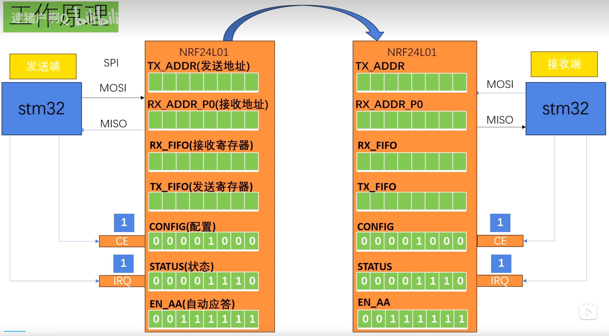

1.配置发送端的发送和接收地址


2.配置接收端的接收地址，要和发送端一致

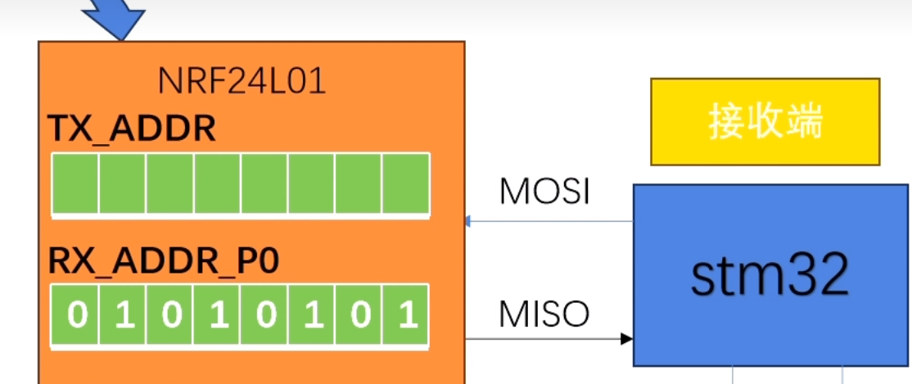

3.配置config寄存器：控制芯片是属于发送还是接收状态：

​															最后一位是0则为发送状态，1为接收状态

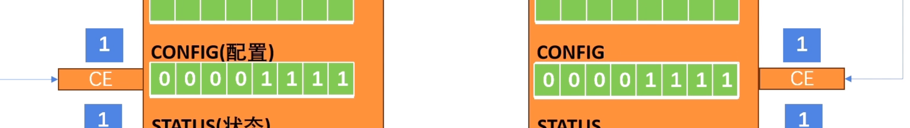

​		这里都配置成了接收状态

4.配置EN_AA自动应答

​	这里开启了通道0的自动应答模式


5.往接收寄存器发送一个数据

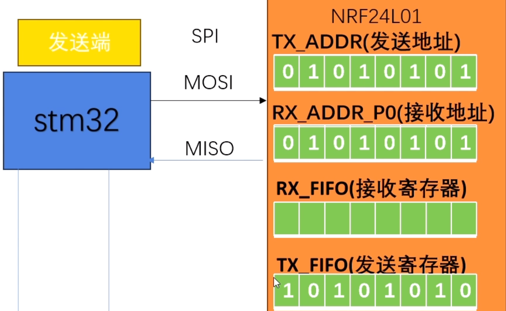

6.使用CE引脚，作用相当于笔记本的待机按键，由主机控制，0时为待机状态

​		只有在待机状态下才能改变芯片的工作模式

​		所以这一步操作：CE置0，写入CONFIG寄存器为0000 1110，即发送模式

7.置CE引脚为1，此时芯片开机，发送模式，发送数据出去。

​	同时，芯片会自动将CONFIG最后一位置1（因为自动应答开启了）

8.接收端接收到数据，此时STATUS寄存器的第1位自动置1


9.芯片进入中断，IRQ被芯片拉低，提醒MCU该来拿数据了。

10.此时，接收端会记录接收到的这个数据的地址，然后拿这个地址作为发送地址再发送一个应答信号。所以这也就是为什么发送端也要配置接收地址的原因

11.发送端接收到应答信号以后，STATUS寄存器第2位自动置1，表示接收到应答信号了


​	同时芯片会进入中断，然后IRQ被芯片拉低，告诉MCU我发送出去了也接收到应答信号了。


以上就是发送一包数据包的简单流程。


#### 3.接收地址和发送地址


##### 相关寄存器

###### 1.TX_ADDR(发送地址)


###### 2.RX_ADDR_P0(接收地址0)


###### 3.RX_ADDR_P1(接收地址1)

RX_ADDR_P2(接收地址2)

RX_ADDR_P3(接收地址3)

RX_ADDR_P4(接收地址4)

RX_ADDR_P5(接收地址5)

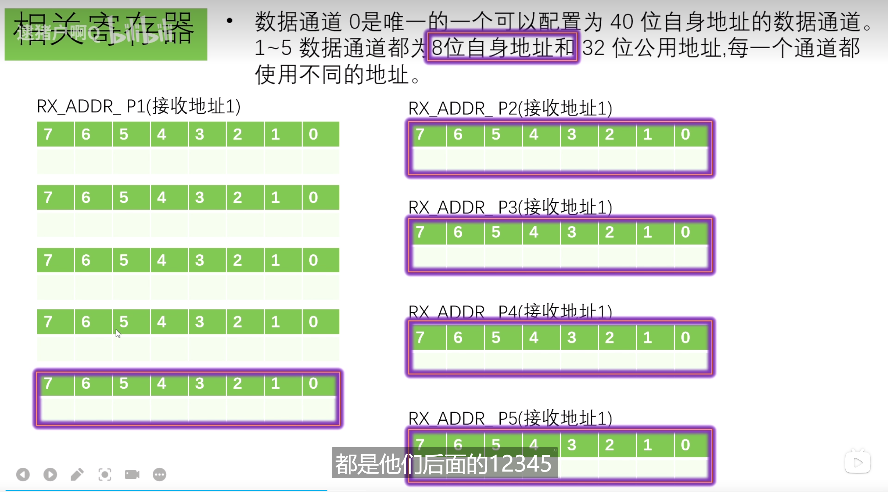

#### 4.重要寄存器


#### 5.相关寄存器


 

#### 6.重要指令


# 【1-1】STM32简介

## 1.STM32简介


## 2.ARM架构


## 3.STM32F103C8T6(本课程使用的)

### 1.简介


### 2.片上资源


​	PS：C8T6芯片不存在最后四项外设


## 3.命名规则


## 4.系统结构


​	PS：了解即可


## 5.引脚定义


## 6.启动配置


​		启动配置的作用就是指定程序开始运行的位置。一般情况下，程序都是在FLASH程序存储器里开始执行，但是在某些情况下，我们也可以让程序在别的地方开始执行，用以完成特殊的功能。

​		第一种模式就是正常启动模式。

​		第二种模式是串口下载模式。

​		第三种不常用，略。


​		最后一句话的意思：BOOT引脚的值是在上电复位后的一瞬间有效的，之后就随便了。(当第四个时钟过之后，就是PB2功能了)


## 7.最小系统电路


## 8.最小系统板实物图


# 【2-1】软件安装

## 1.安装目录


## 2.安装链接

下面是安装链接：

​	资料下载：https://jiangxiekeji.com/download.html

下面是安装教程：

​	教程链接：[[2-1\] 软件安装_哔哩哔哩_bilibili](https://www.bilibili.com/video/BV1th411z7sn?p=3&vd_source=1051d37ba7a675bf1be8e2ff97d9e892)

​	PS:STLINK驱动已经安装

​		下面是STLINK驱动安装目录：

​		D:\keli\ARM\STLink\USBDriver


# 【2-2】新建工程

## 1.32开发方式

#### 目前STM32的开发方式主要有两种方式：

​		1.基于寄存器的方式 	（同51一样）

​				这种方式最底层，最直接，效率会更高一些。

​				但是由于STM32的结构复杂，寄存器太多，所以基于寄存器的方式目前是不推荐的。

​		2.基于标准库,也就是基于库函数的方式

​				使用ST官方提供的封装好的函数，通过调用这些函数来间接地配置寄存器。由于ST对寄存器的封装比较好，所以这种方式既能满足对寄存器的配置，对开发人员也比较友好，有利于提高开发效率。是本课程使用的方式。

​		3.基于HAL库的方式

​				可以用图形化界面快速配置STM32，这个比较适合快速上手STM32的情况，但是这种方式隐藏了底层逻辑，如果你对STM32不熟悉，基本只能停留在很浅的水平。所以目前暂时不推荐HAL库，但是推荐学过标准库之后，去了解一下这个方式，毕竟这个HAL库还是比较方便的。


#### 标准库函数包

​		导入视频详情看视频：

​	[[2-2\] 新建工程_哔哩哔哩_bilibili](https://www.bilibili.com/video/BV1th411z7sn?p=4&vd_source=1051d37ba7a675bf1be8e2ff97d9e892)


## 点亮第一个LED灯

#### 接线图：STM32与STLINK


```c
//使用寄存器的方式控制灯的亮灭
#include "stm32f10x.h"                  // Device header

int main(void)
{
	RCC->APB2ENR = 0x00000010;	//打开GPIOC的时钟
	GPIOC->CRH = 0x00300000;	//端口配置寄存器
	//GPIOC->ODR = 0x00002000; 	//灯熄灭
	GPIOC->ODR = 0x00000000; 	//灯亮
	while(1);
}

```


```c
//使用库函数的方式控制灯的亮灭
#include "stm32f10x.h"                  // Device header

int main(void)
{
	RCC_APB2PeriphClockCmd(RCC_APB2Periph_GPIOC, ENABLE );	//配置寄存器
	GPIO_InitTypeDef GPIO_InitStructure;	//定义结构体:GPIO_InitTypeDef 结构体名字
	
	//配置结构体变量
	GPIO_InitStructure.GPIO_Mode = GPIO_Mode_Out_PP;
	GPIO_InitStructure.GPIO_Pin = GPIO_Pin_13;
	GPIO_InitStructure.GPIO_Speed = GPIO_Speed_50MHz;
	
	GPIO_Init(GPIOC,&GPIO_InitStructure);//配置端口模式
	
	GPIO_SetBits(GPIOC, GPIO_Pin_13);	//置13口为高电平
	
	GPIO_ResetBits(GPIOC, GPIO_Pin_13);	//置13口为低电平
	
	while(1);
}

```

## 补充知识

### 1.新建工程的启动文件选择

​	以下这些就是新建工程的启动文件：

​	


下面是启动文件的选择：


### 2.新建工程知识

#### 	1.步骤总结


####	 2.工程架构


# 【3-1】GPIO输出

## 0.GPIO程序笔记

#### 操作STM32的GPIO总共需要三个步骤：

​			1.使用RCC开启GPIO的时钟

​			2.使用GPIO_Iint函数初始化GPIO

​			3.使用输出或者输入函数控制GPIO口

```c
//使用RCC开启GPIO的时钟
RCC_APB2PeriphClockCmd(RCC_APB2Periph_GPIOA,ENABLE);

GPIO_InitTypeDef GPIO_InitStruct;	//定义结构体(可以理解为建立GPIO对象)
//配置结构体
GPIO_InitStruct.GPIO_Mode = GPIO_Mode_Out_PP;	//模式为推挽输出
GPIO_InitStruct.GPIO_Pin = GPIO_Pin_x;	//Px口
GPIO_InitStruct.GPIO_Speed = GPIO_Speed_50MHz;	//速度为50MHz

//第一个参数需要填GPIO+字母对应引脚区域
GPIO_Init(GPIOx,&GPIO_InitStruct);	//初始化GPIO口
```


#### GPIO的常用输出函数

```c
void GPIO_SetBits(GPIO_TypeDef* GPIOx, uint16_t GPIO_Pin);
//填入参数	1.GPIOx		2.GPIO_Pin
//函数功能	把指定的端口设置为高电平
```

```c
void GPIO_ResetBits(GPIO_TypeDef* GPIOx, uint16_t GPIO_Pin);
//填入参数	1.GPIOx		2.GPIO_Pin
//函数功能	把指定的端口设置为低电平
```

```c
void GPIO_WriteBit(GPIO_TypeDef* GPIOx, uint16_t GPIO_Pin, BitAction BitVal);
//填入参数	1.GPIOx		2.GPIO_Pin		3.BitVal
//函数功能	根据第三个参数的值来设置指定的端口
```

```c
void GPIO_Write(GPIO_TypeDef* GPIOx, uint16_t PortVal);
//填入参数	1.GPIOx		2.PortValue
//函数功能	可以同时对16个端口进行写入操作
```


#### GPIO常用输入函数 

```c
uint8_t GPIO_ReadInputDataBit(GPIO_TypeDef* GPIOx, uint16_t GPIO_Pin);
//填入参数	1.GPIOx		2.GPIO_Pin
//函数功能	读取输入数据寄存器某一个端口的输入值
```

```c
uint16_t GPIO_ReadInputData(GPIO_TypeDef* GPIOx);
//填入参数	1.GPIOx
//函数功能	读取整个输入数据寄存器
//返回值是unit16_t,是16为位的数据，每位代表一个端口值
```

```c
uint8_t GPIO_ReadOutputDataBit(GPIO_TypeDef* GPIOx, uint16_t GPIO_Pin);

//填入参数	1.GPIOx		2.GPIO_Pin
//函数功能	读取输出数据寄存器的某一个位
//所以原则上来说，它并不是用来读取端口的输入数据的。
//这个函数一般用于输出模式下，用来看下自己输出的是什么。
```

```c
uint16_t GPIO_ReadOutputData(GPIO_TypeDef* GPIOx);
//填入参数	1.GPIOx
//函数功能	读取整个输出数据寄存器
//所以原则上来说，它并不是用来读取端口的输入数据的。
//这个函数一般用于输出模式下，用来看下自己输出的是什么。
```


#### 其他GPIO函数

```c
void GPIO_PinLockConfig(GPIO_TypeDef* GPIOx, uint16_t GPIO_Pin);
//填入参数	1.GPIOx		2.GPIO_Pin
//函数功能：用来锁定GPIO配置的，调用这个函数，参数指定某个引脚，那这个引脚的配置就会呗锁定，防止意外更改。
```

```c
void GPIO_PinRemapConfig(uint32_t GPIO_Remap, FunctionalState NewState);
//填入参数：1.选择你要重映射的方式	2.参数新的状态
//函数功能：可以用来进行引脚重映射
```


## 1.GPIO介绍

### 1.GPIO简介


​	输出模式下如果是控制功率比较大的元器件，则需要加入驱动电路，例如电机。与此同时，输出模式还可以用以模拟通信协议，比如IIC，SPI或者某个芯片特定的协议。

​	输入模式最常见的就是按键了，另外还可以读取带数值的模块，比如光敏电阻模块，热敏电阻模块等。当然也可以模拟通信接收数据。


### 2.GPIO基本结构

#### 整体结构


##### 每个GPIO中：

​	寄存器：就是一段特殊的存储器，内核可以通过APB2总线对寄存器进行读写，这样就可以完成输出电平和读取电平的功能了。这个寄存器的每一位对应一个引脚，其中输出寄存器写1，对应引脚就会输出高电平，写0则输出低电平。输入寄存器读取1，就证明对应端口目前是高电平，读取为0则就是低电平。

​	PS：因为STM32是32位单片机，所以STM32内部的寄存器都是32位的，但这个端口只有16位，所以这个寄存器只有低16位对应的有端口，高16位是没有用到的。


​	驱动器：是用来增加信号的驱动能力的。寄存器只负责存储数据，如果要进行点灯这样的操作的话，还是需要驱动器来负责增大驱动能力。


#### GPIO位结构

下图是STM32参考手册中的GPIO位结构电路图：


## 2.GPIO模式


#### 浮空/上拉/下拉输入模式


​			前三种输入模式的电路基本是一样的，区别就是上拉电阻和下拉电阻的连接。

​	PS：浮空输入的电平是不确定的，所以在使用浮空输入时，端口一定要接上一个连续的驱动源，不能出现悬空的状态。

​	PS：VDD_FT：容忍5v的引脚，它的上边保护二极管要做一下处理，要不然这里直接接VDD 3.3v的话，外部再接入5v电压就会导致上边二极管开启，并且产生比较大的电流，这个是不太妥当的。


#### 模拟输入

​	可以说是ADC数模转换器的专属配置了，下面是其结构：


​	PS：上图画X的部分就是没用到的部分。


#### 开漏输入/推挽输出

​	电路基本一样，都是数字输出端口，可以用于输出高低电平。

​	区别就是：

​			开漏输出的高电平呈现的是高阻态，没有驱动能力。

​			推挽输出的高低电平都是具有驱动能力的。

下面是电路图：


​	此时，输出是由输出数据寄存器控制的。

​				如果P-MOS无效，就是开漏输出。

​				如果P-MOS和N-MOS都有效，就是推挽输出。

​	另外，在输出模式下，输入模式也是有效的。但是之前的电路图在输入模式下，输出都是无效的。

​		这是因为，一个端口只能有一个输出，但可以有多个输入。所以当配置成输出模式的时候，内部也可以顺便输入一下，这个是没啥影响的。


#### 复用开漏输出/复用推挽输出

​	这俩模式跟普通的开漏输出和推挽输出也差不多，只不过是复用的输出，引脚电平是由片上外设控制的。

​	PS：除了我们写程序让芯片操作的都是片上外设，比如温感光感。

​	下面是电路图：


​	同时普通的输入也是有效的，顺便接收一下电平信号。


#### 总结

​	其实在GPIO的这8种模式中，除了模拟输入这个模式会关闭数字的输入功能，在其他7个模式中，所有的输入都是有效的


## 3.外围设备介绍(LED，蜂鸣器)

#### 1.LED，蜂鸣器

​	介绍：


​	接入STM32的硬件电路图：


​		左边两图为使用STM32的GPIO口驱动LED的电路

​				左上为低电平触发，左下为高电平触发。

​		右边两图为使用STM32的GPIO口驱动蜂鸣器的电路。

​				左上为低电平触发，左下为高电平触发。


​		那么，高电平触发和低电平触发该如何选择为好呢？

​				这就得看这个IO口高低电平的驱动能力如何了。我们刚才介绍，这个GPIO在推挽输出模式下，高低电平均有比较强的驱动能力，所以在这里这两种接法均可。

​				但是在单片机的电路里，一般倾向使用第一种接法（低电平触发）因为很多单片机或者芯片，都使用了高电平弱驱动，低电平强驱动的规则，这样可以一定程度上避免高低电平打架。所以如果高电平驱动能力弱，那就不能使用第二种接法（高电平触发）了。


#### 2.面包板


​		略


# 【3-2】LED&流水灯&蜂鸣器

## 1.LED闪烁

#### 接线图：

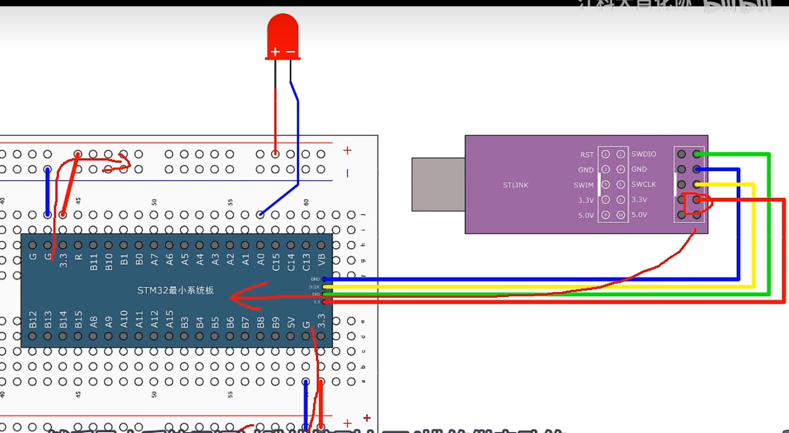

#### 程序代码：


##### 插入：GPIO常用的输出函数 

```c
void GPIO_SetBits(GPIO_TypeDef* GPIOx, uint16_t GPIO_Pin);
//填入参数	1.GPIOx		2.GPIO_Pin
//函数功能	把指定的端口设置为高电平
```

```c
void GPIO_ResetBits(GPIO_TypeDef* GPIOx, uint16_t GPIO_Pin);
//填入参数	1.GPIOx		2.GPIO_Pin
//函数功能	把指定的端口设置为低电平
```

```c
void GPIO_WriteBit(GPIO_TypeDef* GPIOx, uint16_t GPIO_Pin, BitAction BitVal);
//填入参数	1.GPIOx		2.GPIO_Pin		3.BitVal
//函数功能	根据第三个参数的值来设置指定的端口

//下面是对参数3的介绍：
/*
  * @param  BitVal: 指定要写入选定位的值。
  * 此参数可以是 BitAction 枚举值之一
  *     @arg Bit_RESET: 清除端口引脚
  *     @arg Bit_SET: 设置端口引脚
*/
```

```c
void GPIO_Write(GPIO_TypeDef* GPIOx, uint16_t PortVal);
//填入参数	1.GPIOx		2.PortValue
//函数功能	可以同时对16个端口进行写入操作
```


##### 程序实例

```c
#include "stm32f10x.h"
#include "Delay.h"
/*
	操作STM32的GPIO总共需要三个步骤：
			1.使用RCC开启GPIO的时钟
			2.使用GPIO_Iint函数初始化GPIO
			3.使用输出或者输入函数控制GPIO口
*/

int main(void)
{
    //使用RCC开启GPIO的时钟
	RCC_APB2PeriphClockCmd(RCC_APB2Periph_GPIOA,ENABLE);
	
	GPIO_InitTypeDef GPIO_InitStruct;	//定义结构体(可以理解为建立GPIO对象)
	//配置结构体
	GPIO_InitStruct.GPIO_Mode = GPIO_Mode_Out_PP;	//模式为推挽输出
	GPIO_InitStruct.GPIO_Pin = GPIO_Pin_0;	//P0口
	GPIO_InitStruct.GPIO_Speed = GPIO_Speed_50MHz;	//速度为50MHz
	
	
	GPIO_Init(GPIOA,&GPIO_InitStruct);	//初始化GPIO口
	
	//使用第一种函数：把指定的端口设置为低电平
	//GPIO_ResetBits(GPIOA,GPIO_Pin_0);
	
	//使用第二种函数：把指定的端口设置为高电平
	//GPIO_SetBits(GPIOA,GPIO_Pin_0);
	
	//使用第三种函数：
	//GPIO_WriteBit(GPIOA,GPIO_Pin_0,Bit_SET);
	//GPIO_WriteBit(GPIOA,GPIO_Pin_0,Bit_RESET);
	
	//第四种函数下个例程介绍
	
	
	while(1)
	{
		//使用WriteBit函数来输出高低电平电灯
		/*
		GPIO_WriteBit(GPIOA,GPIO_Pin_0,Bit_RESET);	//点亮LED灯
		Delay_ms(500);
		GPIO_WriteBit(GPIOA,GPIO_Pin_0,Bit_SET);	//熄灭LED灯
		Delay_ms(500);
		*/
		
		//使用SetBits和ResitBits函数来输出高低电平点灯
		/*
		GPIO_SetBits(GPIOA,GPIO_Pin_0);
		Delay_ms(500);
		GPIO_ResetBits(GPIOA,GPIO_Pin_0);
		Delay_ms(500);
		*/
		
		//若使用1和0来决定高低电平
		//则需要对1和0进行强制转换为BitAction的枚举类型
		GPIO_WriteBit(GPIOA,GPIO_Pin_0,(BitAction)0);	//点亮LED灯
		Delay_ms(500);
		GPIO_WriteBit(GPIOA,GPIO_Pin_0,(BitAction)1);	//熄灭LED灯
		Delay_ms(500);
		
	}
}

```


​	PS:

​		若GPIO的输出模式为推挽模式，无论将LED灯的正负极反接都是可以正常亮灭的，说明在推挽模式下，高低电平都是有驱动能力的。

​		若GPIO的输出模式为开漏输出模式（Out_OD），而LED不亮，说明开漏模式的高电平是没有驱动能力的。而低电平是有驱动能力的

​	一般情况下用推挽模式就行，而特殊情况才会用开漏等其他模式。

## 2.LED流水灯

#### 接线图

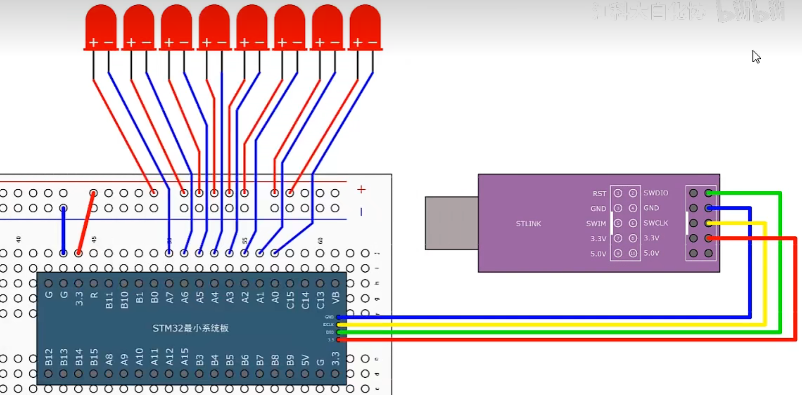


#### 程序代码

```c
#include "stm32f10x.h"                  // Device header
#include "Delay.h"

int main(void)
{
	RCC_APB2PeriphClockCmd(RCC_APB2Periph_GPIOA,ENABLE);
	
	GPIO_InitTypeDef GPIO_InitStruct;	//定义结构体(建立GPIO对象)
	//配置结构体
	GPIO_InitStruct.GPIO_Mode = GPIO_Mode_Out_PP;	//模式为推挽输出
	GPIO_InitStruct.GPIO_Pin = GPIO_Pin_All;	//所有引脚
	GPIO_InitStruct.GPIO_Speed = GPIO_Speed_50MHz;	//速度为50MHz
	
	
	GPIO_Init(GPIOA,&GPIO_InitStruct);	//初始化GPIO口
	

	
	
	while(1)
	{
		//此函数的第二个值的含义是：指定写到输出数据寄存器的值(ODR)
		//而c语言不支持使用二进制数，所以写16进制数
		//0x0001对应二进制数为 0000 0000 0000 0001
		//因为是低电平点亮，所以在前面加一个按位取反的符号
		//此时就是1111 1111 1111 1110，也就是第一个LED灯亮
		GPIO_Write(GPIOA, ~0x0001);	
		Delay_ms(500);
		GPIO_Write(GPIOA, ~0x0002);	//0000 0000 0000 0010
		Delay_ms(100);				//延时100ms
		GPIO_Write(GPIOA, ~0x0004);	//0000 0000 0000 0100
		Delay_ms(100);				//延时100ms
		GPIO_Write(GPIOA, ~0x0008);	//0000 0000 0000 1000
		Delay_ms(100);				//延时100ms
		GPIO_Write(GPIOA, ~0x0010);	//0000 0000 0001 0000
		Delay_ms(100);				//延时100ms
		GPIO_Write(GPIOA, ~0x0020);	//0000 0000 0010 0000
		Delay_ms(100);				//延时100ms
		GPIO_Write(GPIOA, ~0x0040);	//0000 0000 0100 0000
		Delay_ms(100);				//延时100ms
		GPIO_Write(GPIOA, ~0x0080);	//0000 0000 1000 0000
		Delay_ms(100);				//延时100ms
	}
}

```

代码解释：

​		1.为什么11行配置结构体当中可以通过 | 来把几个IO口连起来定义呢？

​				因为GPIO0 = 0001 ，GPIO1 = 0010 ， GPIO2 = 0100。

​				使用|运算之后：GPIO_Pin_0 | GPIO_Pin_1 | GPIO_Pin_2

​				就可以达到以下效果：	0111，即GPIO0-2都被定义了。

​				当然函数里还有GPIO_Pin_All可以使用(定义所有引脚嘛)


## 3.蜂鸣器

#### 接线图


##### PS

I/O控制口别选到A15，B3，B4这三个，因为从引脚定义图可以看到，这三个口默认是JTAG的调试端口，如果要用作普通端口的话，还需要再进行一些配置。


#### 程序代码

```c
#include "stm32f10x.h"                  // Device header
#include "Delay.h"

int main(void)
{
	RCC_APB2PeriphClockCmd(RCC_APB2Periph_GPIOB,ENABLE);
	
	GPIO_InitTypeDef GPIO_InitStruct;	//定义结构体(建立GPIO对象)
	//配置结构体
	GPIO_InitStruct.GPIO_Mode = GPIO_Mode_Out_PP;	//模式为推挽输出
	GPIO_InitStruct.GPIO_Pin = GPIO_Pin_12;	//所有引脚
	GPIO_InitStruct.GPIO_Speed = GPIO_Speed_50MHz;	//速度为50MHz
	
	GPIO_Init(GPIOB,&GPIO_InitStruct);	//初始化GPIO口

	
	while(1)
	{
		GPIO_ResetBits(GPIOB,GPIO_Pin_12);
		Delay_ms(100);
		GPIO_SetBits(GPIOB,GPIO_Pin_12);
		Delay_ms(100);
		GPIO_ResetBits(GPIOB,GPIO_Pin_12);
		Delay_ms(100);
		GPIO_SetBits(GPIOB,GPIO_Pin_12);
		Delay_ms(700);
	}
}

```

## 使用库函数的方法

​	1.打开.h文件的最后，看一下都有哪些函数，然后再右键转到定义，查看以下函数和参数的用法。这里都是英文的，看不懂借助翻译就行。

​	2.查看配套资料里的库函数用户手册，里面有所有库函数的中文解释说明，而且函数后面还有使用例子，需要用的话可以直接引用。但是这个用户手册的版本并不对应我们现在用的库函数的版本，所以有部分用法会有一些出入，但是整体上差异都不大。

​	3.百度搜索，查看别人的代码。


# 【3-3】GPIO输入

因为【3-1】小节中已经把GPIO的结构和8种输入输出模式都学习完了，所以本小节GPIO输入的部分我们直接从外部硬件设备开始学习了。


## 外围设备介绍(按键)

### 按键

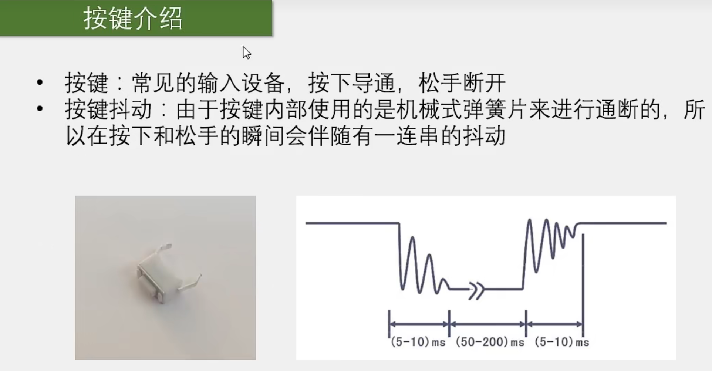

### 传感器模块


#### 按键和传感器模块的硬件电路

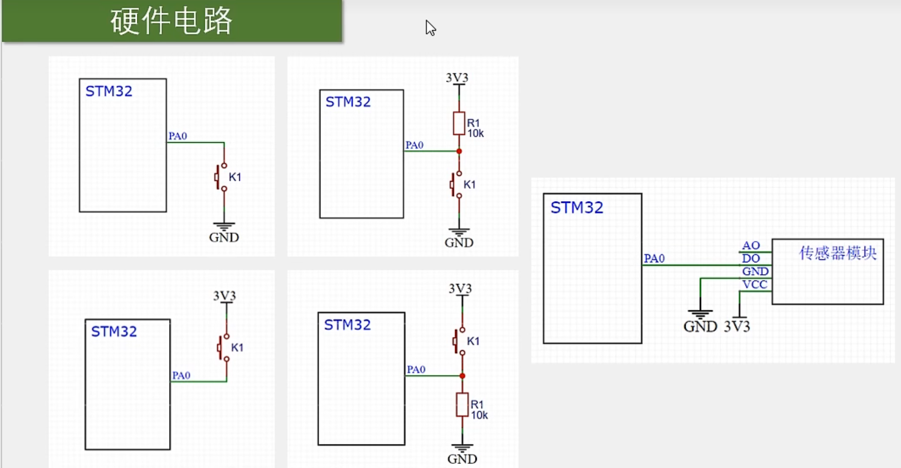

##### 按键部分：

​	上面两个是下接按键的方式，下面两个是上接按键的方式。

​		一般来说，我们的按键都是用上面两种方式，也就是下接按键的方式。这个原因跟LED的低电平触发接法类似，是电路设计的习惯和规范。

​		左上图：必须要求PA0是上拉输入的模式，否则当按键没按下时就会悬空而出现引脚电压不稳定的错误现象。如果PA0是上拉输入模式，那我们之前讲了，引脚再悬空，PA0就是高电平。所以这种方式下，按下按键引脚为低电平，松手引脚为高电平。

​		右上图：相比于左上图，上拉了一个高电平，当按键松手时，引脚由于上拉作用，自然保持为高电平。当按键按下时，引脚直接接到GND，也就是一股无穷大的力把这个引脚往下拉，所以引脚为低电平。这种状态下，引脚不会出现悬空状态，所以此时PA0引脚可以配置为浮空输入或者上拉输入：

​					如果是上拉输入，那就是内外两个上拉电阻共同作用了，这时高电平就会更强一些，对应高电平就更加稳定，当然这样的话，当引脚被强行拉到低时，损耗也就会大一些。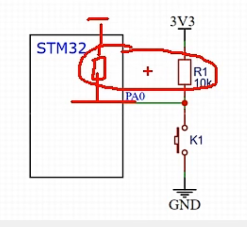

​		左下图：必须要求PA0是下拉输入的模式，当按键按下时，引脚为高电平，松手时，引脚回到默认值低电平。但一般单片机可能不一定有下拉输入的模式，所以最好还是用上面的接法，下面的作为扩展部分了解即可。


​		右下图：必须要求PA0是下拉输入模式或者浮空输入模式，分析类比左上图，此处不再赘述。


​	总结：

​				上面这两种接法按键按下时引脚是低电平，松手是高电平。

​				下面这两种接法按下按键时是高电平，松手是低电平。

​				左边这两种接法必须要求引脚是上拉或者下拉输入的模式。

​				右边这两种接法可以允许引脚是浮空输入的模式，因为引脚配置了上拉电阻和下拉电阻。

​		一般我们都用上面两种接法，下面两种接法用的比较少。


##### 传感器模块

​	AO：模拟输出，之后学ADC数模转换器的时候再用，现在不接。

​	DO：随便接一个端口，比如PA0，用于读取数字量。

​	GND:接地，即GND

​	VC接3.3V


## C语言知识点补充

#### C语言数据类型

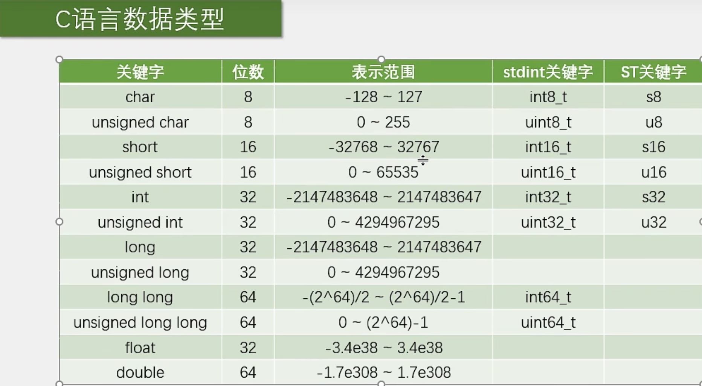

###### 注意事项

​		1.在51单片机中，int是占16位的，而在STM32中int是占32位的，如果要用16位数据，要用short来表示。这是和51单片机的不同之处，不要搞混淆了。

​		2.long和ulong型占用位数还是32位(虽然按道理是要比int型大的hhh)，如果想用64位的需要用到long long型或者ulong long 型，不过这个数实在是太大了我们用的很少。

​		3.float和double都是存小数的，而且它们都是带符号的数，没有无符号的float和double。

​		4.右边stdint和ST是两种对关键字的用typedef重命名的变量类型（typedef是用来给变量类型重命名的，下面会讲）

​				我们以后在写程序的时候，就会按照它的推荐，使用这些新的名字。

​		 5.ST关键字是老版本库函数的关键字命名规则，新版本仍然可用但不推荐使用。

#### C语言宏定义


#### C语言typedef


相当于数据类型版换名字，与宏定义差不多，下面是两者区别：

​		1.宏定义的新名字在左边，typedef的新名字在右边。

​		2.宏定义不需要分号，typedef后面必须加分号。

​		3.宏定义的任何名字都可以换，而typedef只能专门给变量类型换名字。

​	总结：宏定义的改名范围要更宽一些，只不过对于变量类型的重命名而言，使用typedef更加安全，因为宏定义只是无脑改名，不管你对不对，而typedef会对命名进行检查，如果不是变量类型的名字，那是不行的，会报错。所以给变量类型重命名我们一般用typedef。当然原来的名字还是能用的，这里的重命名只是增加了一个新名字而已。


#### C语言结构体

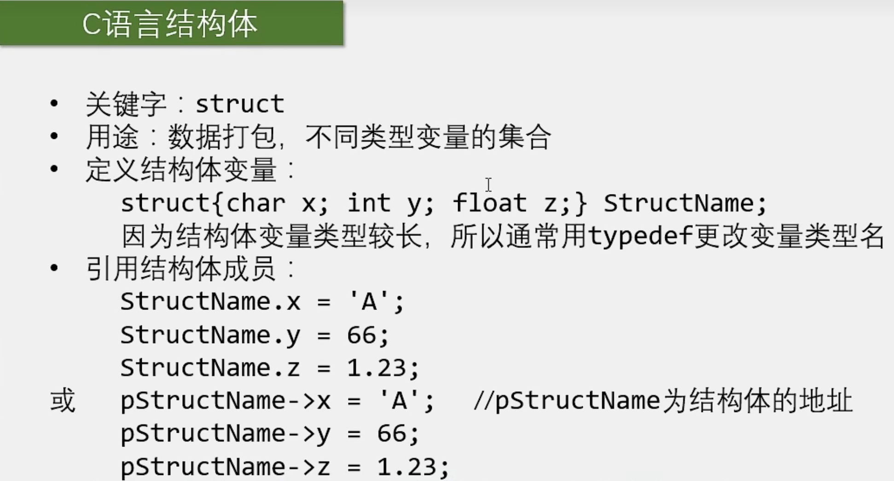

​			上面介绍的int，char等我们称作基本数据类型，

​			然后数组就是一大堆基本数据类型的集合，数组我们就可以称作组合数据类型，它是由许多基本数据类型组合而来的，数组组合的只能是相同的数据。（我原称之为：列表阉割版）

​		那么，我们如果想组合不同的数据类型该怎么办呢？

​			答：结构体

​				结构体也是一种组合数据类型，它的作用就是组合不同的数据类型。(nnd不就是列表完整版)

```c
//下面是结构体的学习示例,类比基本变量，数组类型
#include <stdio.h>

int main()
{
    //基本变量类型
    int a;
    a = 66;
    printf("a = %d\n",a);
    
    //数组类型
    int b[5];
    b[0] = 66;
    b[1] = 77;
    b[2] = 88;
    printf("b[0] = %d\n",b[0]);
    printf("b[1] = %d\n",b[1]);
    printf("b[2] = %d\n",b[2]);
    
    //结构体变量类型
    //定义一个结构体变量，名字叫c，其中包含了char型的x，int型的y和float型的z三个子项。
    struct{char x;int y;float z;} c;
    //引用结构体内部的值：
    //结构体名称.结构体子项名称   来引用结构体成员。
    c.x = 'A';
    c.y = 66;
    c.z = 1.23
    printf("c.x = %c\n",c.x);
    printf("c.y = %d\n",c.y);
    printf("c.z  = %f\n",c.z);
}
```

​										**下面是结构体的特殊用法**

```c
//结构体的特殊用法

//问题1：结构体的名字太长了。
/*
解决方法：
	使用typedef把数据类型名字缩小
*/
typedef struct
{
    char x;
    int y;
    float z;
} StructName_t;


//结构体变量类型
StructName_t c;
//引用结构体内部的值：
//结构体名称.结构体子项名称   来引用结构体成员。
c.x = 'A';
c.y = 66;
c.z = 1.23
    
printf("c.x = %c\n",c.x);
printf("c.y = %d\n",c.y);
printf("c.z  = %f\n",c.z);
```

**PS：**

结构体引用不仅可以这样：

```c
c.y = 66;
```

还可以这样：

```c
c->y = 66;
```

**为什么要加一种结构体指针的引用方式呢?**

​	这是因为，结构体是一种组合数据类型，在函数之间的数据传递中，通常用的是地址传递而不是值传递（这里是指针教程，11.23还没学）

​	既然是使用指针传递，子函数得到的就是结构体的首地址，这时候我们就可以用->这个运算符快速引用结构体的成员。


#### C语言枚举


```c
//下面是枚举的学习示例
#include <stdio.h>


//可以用typedef来达到简写的目的
typedef enum{
    MONDAY = 1,
    TUESDAY,
    WEDNESDAY
}week_t;

int main()
{

    
	//定义枚举
    /*
    enum{
        MONDAY = 1,
        TUESDAU = 2,
        WEDNESDAY = 3,
    } week;
    */
    
    
    //如果枚举里面的定义数是按顺序累加的，那么后面的=2，=3可以省略，编译器会自动填补，如下：
    /*
        enum{
        MONDAY = 1,
        TUESDAU , 
        WEDNESDAY ,
    } week;
    */
    
    
    //下面是使用typedef定义后的枚举定义
    week_t week;
    
    //引用
    week = MONDAY;	//week = 1;
    week = TUESDAY;	//week = 2;
    

}
```


# 【3-4】按键控制LED&光敏控制蜂鸣

## 按键控制LED


**按键不推荐使用外部中断，因为用外部中断不好处理按键抖动和松手检测的问题，且对于按键来说，它的输出波形也不是转瞬即逝的，所以要求不高的话可以在主程序中循环读取，如果不想用主循环读取的话，可以考虑一下定时器中断读取的方式，这样既可以做到后台读取按键值，不阻塞主程序，也可以很好的处理按键抖动和松手检测的问题。**


#### 接线图


#### 模块化编程

​	1.打开工程文件夹，再创建一个文件夹名为Hardware，用来存放硬件驱动。

​	2.回到keil，打开三个箱子按钮(工程管理),新建一个组也叫Hardware。

​	3.然后再点击魔术棒按钮(工程选项)，选择C/C++，点击三个点按钮，将Hardware目录添加。

​	4.在Hardware文件右键，添加新文件，选择c文件，起个名字叫LED，这个文件就用来封装LED的驱动程序

​	5.继续在Hardware文件里添加新的文件，LED.h

**其中：**

​	LED.c用来存放驱动程序的主体密码

​	LED.h用来存放这个驱动程序可以对外提供的函数或变量的声明


##### LED.h

```c
#ifndef __LED_H	//如果没有定义__LED_H这个字符串	
#define __LED_H	//那么就定义这个字符串

int LED_mode;

void LED_Init(void);
void LED1_ON(void);
void LED1_OFF(void);
void LED2_ON(void);
void LED2_OFF(void);
void LED1_Trun(void);
void LED2_Trun(void);
#endif	//结束if，与#idnef相对应

```


##### LED.c

```c
#include "stm32f10x.h"                  // Device header

//初始化LED
void LED_Init(void)
{
	//开启时钟,时钟是单片机的心跳
	RCC_APB2PeriphClockCmd(RCC_APB2Periph_GPIOA,ENABLE);
	//配置端口模式
	
	//定义结构体变量
	GPIO_InitTypeDef GPIO_InitStruct;
	GPIO_InitStruct.GPIO_Mode = GPIO_Mode_Out_PP;//推挽模式
	GPIO_InitStruct.GPIO_Pin = GPIO_Pin_1 | GPIO_Pin_2;
	GPIO_InitStruct.GPIO_Speed = GPIO_Speed_50MHz;
	
	//初始化GPIO
	GPIO_Init(GPIOA,&GPIO_InitStruct);
	
	//设置高电平，初始化让其熄灭状态
	GPIO_SetBits(GPIOA,GPIO_Pin_1 | GPIO_Pin_2);
	
}

//LED1灯亮
void LED1_ON(void)
{
	GPIO_ResetBits(GPIOA,GPIO_Pin_1);
}


//LED1灯灭
void LED1_OFF(void)
{
	
	GPIO_SetBits(GPIOA,GPIO_Pin_1);

}

//LED2灯亮
void LED2_ON(void)
{
	
	GPIO_ResetBits(GPIOA,GPIO_Pin_2);

}

//LED2灯灭
void LED2_OFF(void)
{
	
	GPIO_SetBits(GPIOA,GPIO_Pin_2);

}

//LED1灯切换状态
void LED1_Trun(void)
{
	if(GPIO_ReadOutputDataBit(GPIOA,GPIO_Pin_1) == 0)
	{
		GPIO_SetBits(GPIOA,GPIO_Pin_1);
	}
	else
	{
		GPIO_ResetBits(GPIOA,GPIO_Pin_1);
	}
}

//LED2灯切换状态
void LED2_Trun(void)
{
	if(GPIO_ReadOutputDataBit(GPIOA,GPIO_Pin_2) == 0)
	{
		GPIO_SetBits(GPIOA,GPIO_Pin_2);
	}
	else
	{
		GPIO_ResetBits(GPIOA,GPIO_Pin_2);
	}
}


```


##### KEY.h

```c
#ifndef __KEY_H
#define __KEY_H

void Key_Init(void);
uint8_t Key_GetNum(void);


#endif


```


##### KEY.c

```c
#include "stm32f10x.h"                  // Device header
#include "Delay.h"


void Key_Init(void)
{
	//开启时钟
	RCC_APB2PeriphClockCmd(RCC_APB2Periph_GPIOB,ENABLE);
	
	//定义结构体变量
	GPIO_InitTypeDef GPIO_InitStructrue;
	//因为我们需要读取按键，所以我们选择上拉输入模式
	GPIO_InitStructrue.GPIO_Mode = GPIO_Mode_IPU;
	GPIO_InitStructrue.GPIO_Pin = GPIO_Pin_1;
	GPIO_InitStructrue.GPIO_Speed = GPIO_Speed_50MHz;//输入模式下其实它没用
	
	//初始化GPIO口
	GPIO_Init(GPIOB,&GPIO_InitStructrue);
}


uint8_t Key_GetNum(void)
{
	uint8_t KeyNum = 0;
	
	//返回值就是输入寄存器某一位的值，0/1
	if(GPIO_ReadInputDataBit(GPIOB,GPIO_Pin_0) == 0)	//判断是否按下按键
	{
		//消除抖动
		Delay_ms(20);
		while(GPIO_ReadInputDataBit(GPIOB,GPIO_Pin_0) == 0);
		Delay_ms(20);
		KeyNum = 1;
	}
		
	if(GPIO_ReadInputDataBit(GPIOB,GPIO_Pin_11) == 0)
	{
		Delay_ms(20);
		while(GPIO_ReadInputDataBit(GPIOB,GPIO_Pin_11) == 0);
		Delay_ms(20);
		KeyNum = 2;
	}
	
	return KeyNum;
}


```


### 程序实例


#### GPIO输入函数

```c
uint8_t GPIO_ReadInputDataBit(GPIO_TypeDef* GPIOx, uint16_t GPIO_Pin);
//填入参数	1.GPIOx		2.GPIO_Pin
//函数功能	读取输入数据寄存器某一个端口的输入值
```


```c
uint16_t GPIO_ReadInputData(GPIO_TypeDef* GPIOx);
//填入参数	1.GPIOx
//函数功能	读取整个输入数据寄存器
//返回值是unit16_t,是16为位的数据，每位代表一个端口值
```


```c
uint8_t GPIO_ReadOutputDataBit(GPIO_TypeDef* GPIOx, uint16_t GPIO_Pin);

//填入参数	1.GPIOx		2.GPIO_Pin
//函数功能	读取输出数据寄存器的某一个位
//所以原则上来说，它并不是用来读取端口的输入数据的。
//这个函数一般用于输出模式下，用来看下自己输出的是什么。
```


```c
uint16_t GPIO_ReadOutputData(GPIO_TypeDef* GPIOx);
//填入参数	1.GPIOx
//函数功能	读取整个输出数据寄存器
//所以原则上来说，它并不是用来读取端口的输入数据的。
//这个函数一般用于输出模式下，用来看下自己输出的是什么。
```


#### main.c

```c
//按键1按下LED1切换亮灭
//按键2按下LED2切换亮灭
#include "stm32f10x.h"                  // Device header
#include "Delay.h"


void Key_Init(void)
{
	//开启时钟
	RCC_APB2PeriphClockCmd(RCC_APB2Periph_GPIOB,ENABLE);
	
	//定义结构体变量
	GPIO_InitTypeDef GPIO_InitStructrue;
	//因为我们需要读取按键，所以我们选择上拉输入模式
	GPIO_InitStructrue.GPIO_Mode = GPIO_Mode_IPU;
	GPIO_InitStructrue.GPIO_Pin = GPIO_Pin_1;
	GPIO_InitStructrue.GPIO_Speed = GPIO_Speed_50MHz;//输入模式下其实它没用
	
	//初始化GPIO口
	GPIO_Init(GPIOB,&GPIO_InitStructrue);
}


uint8_t Key_GetNum(void)
{
	uint8_t KeyNum = 0;
	
	//返回值就是输入寄存器某一位的值，0/1
	if(GPIO_ReadInputDataBit(GPIOB,GPIO_Pin_0) == 0)	//判断是否按下按键
	{
		//消除抖动
		Delay_ms(20);
		while(GPIO_ReadInputDataBit(GPIOB,GPIO_Pin_0) == 0);
		Delay_ms(20);
		KeyNum = 1;
	}
		
	if(GPIO_ReadInputDataBit(GPIOB,GPIO_Pin_11) == 0)
	{
		Delay_ms(20);
		while(GPIO_ReadInputDataBit(GPIOB,GPIO_Pin_11) == 0);
		Delay_ms(20);
		KeyNum = 2;
	}
	
	return KeyNum;
}

```


## 光敏控制蜂鸣器

### 接线图

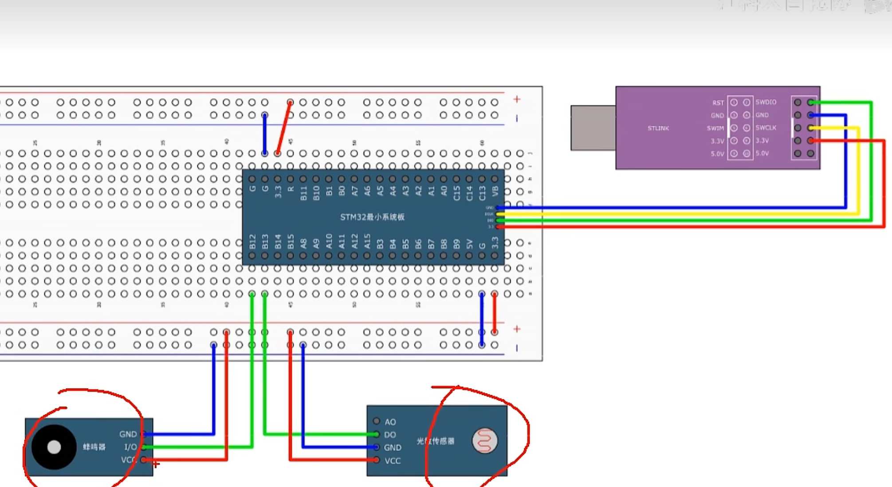


### 程序实例

**Buzzer.c**

```c
#include "stm32f10x.h"                  // Device header

void Buzzer_Init(void)
{
	RCC_APB2PeriphClockCmd(RCC_APB2Periph_GPIOB, ENABLE);
	
	GPIO_InitTypeDef GPIO_InitStructure;
	GPIO_InitStructure.GPIO_Mode = GPIO_Mode_Out_PP;
	GPIO_InitStructure.GPIO_Pin = GPIO_Pin_12;
	GPIO_InitStructure.GPIO_Speed = GPIO_Speed_50MHz;
	GPIO_Init(GPIOB, &GPIO_InitStructure);
	
	GPIO_SetBits(GPIOB, GPIO_Pin_12);
}

void Buzzer_ON(void)
{
	GPIO_ResetBits(GPIOB, GPIO_Pin_12);
}

void Buzzer_OFF(void)
{
	GPIO_SetBits(GPIOB, GPIO_Pin_12);
}

void Buzzer_Turn(void)
{
	if (GPIO_ReadOutputDataBit(GPIOB, GPIO_Pin_12) == 0)
	{
		GPIO_SetBits(GPIOB, GPIO_Pin_12);
	}
	else
	{
		GPIO_ResetBits(GPIOB, GPIO_Pin_12);
	}
}

```


**Buzzer.h**

```c
#ifndef __BUZZER_H
#define __BUZZER_H

void Buzzer_Init(void);
void Buzzer_ON(void);
void Buzzer_OFF(void);
void Buzzer_Turn(void);

#endif

```


**LightSensor.c**

```c
#include "stm32f10x.h"                  // Device header

/**
  * 函    数：光敏传感器初始化
  * 参    数：无
  * 返 回 值：无
  */
void LightSensor_Init(void)
{
	/*开启时钟*/
	RCC_APB2PeriphClockCmd(RCC_APB2Periph_GPIOB, ENABLE);		//开启GPIOB的时钟
	
	/*GPIO初始化*/
	GPIO_InitTypeDef GPIO_InitStructure;
	GPIO_InitStructure.GPIO_Mode = GPIO_Mode_IPU;
	GPIO_InitStructure.GPIO_Pin = GPIO_Pin_13;
	GPIO_InitStructure.GPIO_Speed = GPIO_Speed_50MHz;
	GPIO_Init(GPIOB, &GPIO_InitStructure);						//将PB13引脚初始化为上拉输入
}

/**
  * 函    数：获取当前光敏传感器输出的高低电平
  * 参    数：无
  * 返 回 值：光敏传感器输出的高低电平，范围：0/1
  */
uint8_t LightSensor_Get(void)
{
	return GPIO_ReadInputDataBit(GPIOB, GPIO_Pin_13);			//返回PB13输入寄存器的状态
}

```


**LightSensor.h**

```c
#ifndef __LIGHT_SENSOR_H
#define __LIGHT_SENSOR_H

void LightSensor_Init(void);
uint8_t LightSensor_Get(void);

#endif

```


**main.c**

```c
#include "stm32f10x.h"                  // Device header
#include "Delay.h"
#include "Buzzer.h"
#include "LightSensor.h"

int main(void)
{
	/*模块初始化*/
	Buzzer_Init();			//蜂鸣器初始化
	LightSensor_Init();		//光敏传感器初始化
	
	while (1)
	{
		if (LightSensor_Get() == 1)		//如果当前光敏输出1
		{
			Buzzer_ON();				//蜂鸣器开启
		}
		else							//否则
		{
			Buzzer_OFF();				//蜂鸣器关闭
		}
	}
}

```


# 【4-1】OLED调试工具


## 0.调试方式


​	其他调试方法：

​	1.电灯调试法：在某处增加电灯代码

​	2.注释调试法：注释掉新加入的代码，然后一行一行的取消注释尝试。


## 1.OLED屏幕

### 1.简介

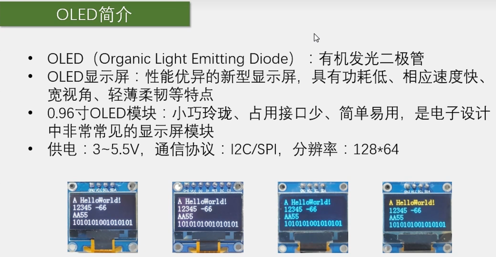


### 2.硬件电路

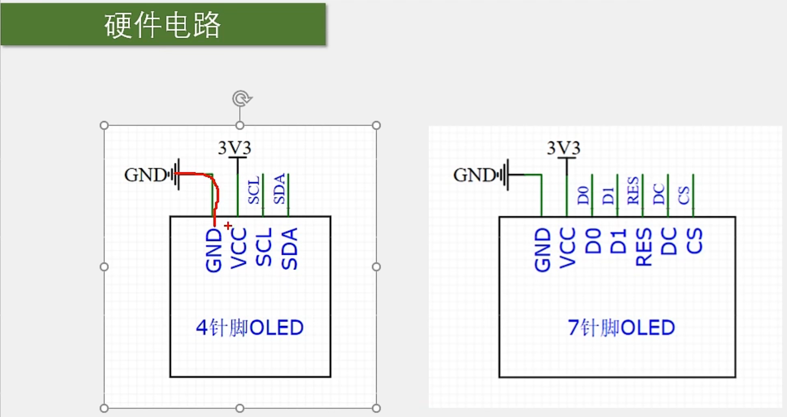

​	左边4针型OLED为I2c通信协议

​	右边7针型OLED为SPI通信协议


### 3.OLED驱动

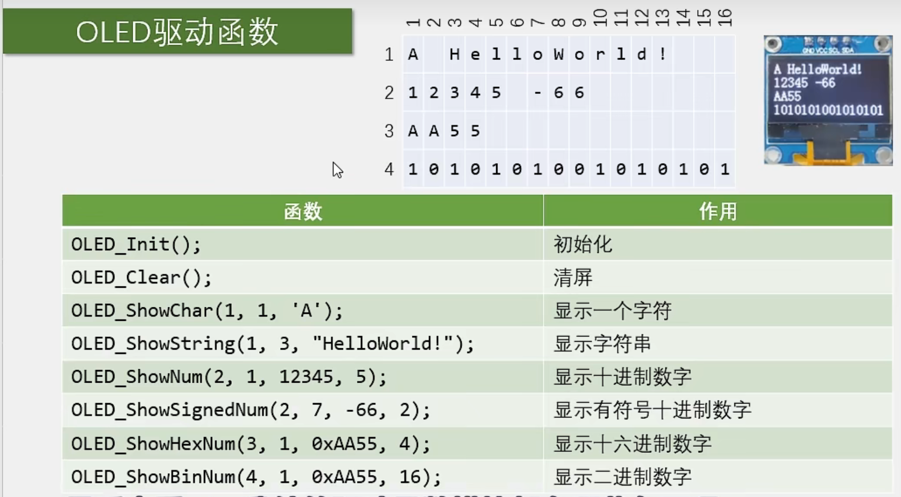


**OLED.c**

PS:第5,6行需要更改成实际接入的SDA，SCL口

```c
#include "stm32f10x.h"
#include "OLED_Font.h"

/*引脚配置*/
#define OLED_W_SCL(x)		GPIO_WriteBit(GPIOB, GPIO_Pin_8, (BitAction)(x))
#define OLED_W_SDA(x)		GPIO_WriteBit(GPIOB, GPIO_Pin_9, (BitAction)(x))

/*引脚初始化*/
void OLED_I2C_Init(void)
{
    RCC_APB2PeriphClockCmd(RCC_APB2Periph_GPIOB, ENABLE);
	
	GPIO_InitTypeDef GPIO_InitStructure;
 	GPIO_InitStructure.GPIO_Mode = GPIO_Mode_Out_OD;
	GPIO_InitStructure.GPIO_Speed = GPIO_Speed_50MHz;
	GPIO_InitStructure.GPIO_Pin = GPIO_Pin_8;
 	GPIO_Init(GPIOB, &GPIO_InitStructure);
	GPIO_InitStructure.GPIO_Pin = GPIO_Pin_9;
 	GPIO_Init(GPIOB, &GPIO_InitStructure);
	
	OLED_W_SCL(1);
	OLED_W_SDA(1);
}

/**
  * @brief  I2C开始
  * @param  无
  * @retval 无
  */
void OLED_I2C_Start(void)
{
	OLED_W_SDA(1);
	OLED_W_SCL(1);
	OLED_W_SDA(0);
	OLED_W_SCL(0);
}

/**
  * @brief  I2C停止
  * @param  无
  * @retval 无
  */
void OLED_I2C_Stop(void)
{
	OLED_W_SDA(0);
	OLED_W_SCL(1);
	OLED_W_SDA(1);
}

/**
  * @brief  I2C发送一个字节
  * @param  Byte 要发送的一个字节
  * @retval 无
  */
void OLED_I2C_SendByte(uint8_t Byte)
{
	uint8_t i;
	for (i = 0; i < 8; i++)
	{
		OLED_W_SDA(Byte & (0x80 >> i));
		OLED_W_SCL(1);
		OLED_W_SCL(0);
	}
	OLED_W_SCL(1);	//额外的一个时钟，不处理应答信号
	OLED_W_SCL(0);
}

/**
  * @brief  OLED写命令
  * @param  Command 要写入的命令
  * @retval 无
  */
void OLED_WriteCommand(uint8_t Command)
{
	OLED_I2C_Start();
	OLED_I2C_SendByte(0x78);		//从机地址
	OLED_I2C_SendByte(0x00);		//写命令
	OLED_I2C_SendByte(Command); 
	OLED_I2C_Stop();
}

/**
  * @brief  OLED写数据
  * @param  Data 要写入的数据
  * @retval 无
  */
void OLED_WriteData(uint8_t Data)
{
	OLED_I2C_Start();
	OLED_I2C_SendByte(0x78);		//从机地址
	OLED_I2C_SendByte(0x40);		//写数据
	OLED_I2C_SendByte(Data);
	OLED_I2C_Stop();
}

/**
  * @brief  OLED设置光标位置
  * @param  Y 以左上角为原点，向下方向的坐标，范围：0~7
  * @param  X 以左上角为原点，向右方向的坐标，范围：0~127
  * @retval 无
  */
void OLED_SetCursor(uint8_t Y, uint8_t X)
{
	OLED_WriteCommand(0xB0 | Y);					//设置Y位置
	OLED_WriteCommand(0x10 | ((X & 0xF0) >> 4));	//设置X位置高4位
	OLED_WriteCommand(0x00 | (X & 0x0F));			//设置X位置低4位
}

/**
  * @brief  OLED清屏
  * @param  无
  * @retval 无
  */
void OLED_Clear(void)
{  
	uint8_t i, j;
	for (j = 0; j < 8; j++)
	{
		OLED_SetCursor(j, 0);
		for(i = 0; i < 128; i++)
		{
			OLED_WriteData(0x00);
		}
	}
}

/**
  * @brief  OLED显示一个字符
  * @param  Line 行位置，范围：1~4
  * @param  Column 列位置，范围：1~16
  * @param  Char 要显示的一个字符，范围：ASCII可见字符
  * @retval 无
  */
void OLED_ShowChar(uint8_t Line, uint8_t Column, char Char)
{      	
	uint8_t i;
	OLED_SetCursor((Line - 1) * 2, (Column - 1) * 8);		//设置光标位置在上半部分
	for (i = 0; i < 8; i++)
	{
		OLED_WriteData(OLED_F8x16[Char - ' '][i]);			//显示上半部分内容
	}
	OLED_SetCursor((Line - 1) * 2 + 1, (Column - 1) * 8);	//设置光标位置在下半部分
	for (i = 0; i < 8; i++)
	{
		OLED_WriteData(OLED_F8x16[Char - ' '][i + 8]);		//显示下半部分内容
	}
}

/**
  * @brief  OLED显示字符串
  * @param  Line 起始行位置，范围：1~4
  * @param  Column 起始列位置，范围：1~16
  * @param  String 要显示的字符串，范围：ASCII可见字符
  * @retval 无
  */
void OLED_ShowString(uint8_t Line, uint8_t Column, char *String)
{
	uint8_t i;
	for (i = 0; String[i] != '\0'; i++)
	{
		OLED_ShowChar(Line, Column + i, String[i]);
	}
}

/**
  * @brief  OLED次方函数
  * @retval 返回值等于X的Y次方
  */
uint32_t OLED_Pow(uint32_t X, uint32_t Y)
{
	uint32_t Result = 1;
	while (Y--)
	{
		Result *= X;
	}
	return Result;
}

/**
  * @brief  OLED显示数字（十进制，正数）
  * @param  Line 起始行位置，范围：1~4
  * @param  Column 起始列位置，范围：1~16
  * @param  Number 要显示的数字，范围：0~4294967295
  * @param  Length 要显示数字的长度，范围：1~10
  * @retval 无
  */
void OLED_ShowNum(uint8_t Line, uint8_t Column, uint32_t Number, uint8_t Length)
{
	uint8_t i;
	for (i = 0; i < Length; i++)							
	{
		OLED_ShowChar(Line, Column + i, Number / OLED_Pow(10, Length - i - 1) % 10 + '0');
	}
}

/**
  * @brief  OLED显示数字（十进制，带符号数）
  * @param  Line 起始行位置，范围：1~4
  * @param  Column 起始列位置，范围：1~16
  * @param  Number 要显示的数字，范围：-2147483648~2147483647
  * @param  Length 要显示数字的长度，范围：1~10
  * @retval 无
  */
void OLED_ShowSignedNum(uint8_t Line, uint8_t Column, int32_t Number, uint8_t Length)
{
	uint8_t i;
	uint32_t Number1;
	if (Number >= 0)
	{
		OLED_ShowChar(Line, Column, '+');
		Number1 = Number;
	}
	else
	{
		OLED_ShowChar(Line, Column, '-');
		Number1 = -Number;
	}
	for (i = 0; i < Length; i++)							
	{
		OLED_ShowChar(Line, Column + i + 1, Number1 / OLED_Pow(10, Length - i - 1) % 10 + '0');
	}
}

/**
  * @brief  OLED显示数字（十六进制，正数）
  * @param  Line 起始行位置，范围：1~4
  * @param  Column 起始列位置，范围：1~16
  * @param  Number 要显示的数字，范围：0~0xFFFFFFFF
  * @param  Length 要显示数字的长度，范围：1~8
  * @retval 无
  */
void OLED_ShowHexNum(uint8_t Line, uint8_t Column, uint32_t Number, uint8_t Length)
{
	uint8_t i, SingleNumber;
	for (i = 0; i < Length; i++)							
	{
		SingleNumber = Number / OLED_Pow(16, Length - i - 1) % 16;
		if (SingleNumber < 10)
		{
			OLED_ShowChar(Line, Column + i, SingleNumber + '0');
		}
		else
		{
			OLED_ShowChar(Line, Column + i, SingleNumber - 10 + 'A');
		}
	}
}

/**
  * @brief  OLED显示数字（二进制，正数）
  * @param  Line 起始行位置，范围：1~4
  * @param  Column 起始列位置，范围：1~16
  * @param  Number 要显示的数字，范围：0~1111 1111 1111 1111
  * @param  Length 要显示数字的长度，范围：1~16
  * @retval 无
  */
void OLED_ShowBinNum(uint8_t Line, uint8_t Column, uint32_t Number, uint8_t Length)
{
	uint8_t i;
	for (i = 0; i < Length; i++)							
	{
		OLED_ShowChar(Line, Column + i, Number / OLED_Pow(2, Length - i - 1) % 2 + '0');
	}
}

/**
  * @brief  OLED初始化
  * @param  无
  * @retval 无
  */
void OLED_Init(void)
{
	uint32_t i, j;
	
	for (i = 0; i < 1000; i++)			//上电延时
	{
		for (j = 0; j < 1000; j++);
	}
	
	OLED_I2C_Init();			//端口初始化
	
	OLED_WriteCommand(0xAE);	//关闭显示
	
	OLED_WriteCommand(0xD5);	//设置显示时钟分频比/振荡器频率
	OLED_WriteCommand(0x80);
	
	OLED_WriteCommand(0xA8);	//设置多路复用率
	OLED_WriteCommand(0x3F);
	
	OLED_WriteCommand(0xD3);	//设置显示偏移
	OLED_WriteCommand(0x00);
	
	OLED_WriteCommand(0x40);	//设置显示开始行
	
	OLED_WriteCommand(0xA1);	//设置左右方向，0xA1正常 0xA0左右反置
	
	OLED_WriteCommand(0xC8);	//设置上下方向，0xC8正常 0xC0上下反置

	OLED_WriteCommand(0xDA);	//设置COM引脚硬件配置
	OLED_WriteCommand(0x12);
	
	OLED_WriteCommand(0x81);	//设置对比度控制
	OLED_WriteCommand(0xCF);

	OLED_WriteCommand(0xD9);	//设置预充电周期
	OLED_WriteCommand(0xF1);

	OLED_WriteCommand(0xDB);	//设置VCOMH取消选择级别
	OLED_WriteCommand(0x30);

	OLED_WriteCommand(0xA4);	//设置整个显示打开/关闭

	OLED_WriteCommand(0xA6);	//设置正常/倒转显示

	OLED_WriteCommand(0x8D);	//设置充电泵
	OLED_WriteCommand(0x14);

	OLED_WriteCommand(0xAF);	//开启显示
		
	OLED_Clear();				//OLED清屏
}

```


**OLED.h**

```c
#ifndef __OLED_H
#define __OLED_H

void OLED_Init(void);
void OLED_Clear(void);
void OLED_ShowChar(uint8_t Line, uint8_t Column, char Char);
void OLED_ShowString(uint8_t Line, uint8_t Column, char *String);
void OLED_ShowNum(uint8_t Line, uint8_t Column, uint32_t Number, uint8_t Length);
void OLED_ShowSignedNum(uint8_t Line, uint8_t Column, int32_t Number, uint8_t Length);
void OLED_ShowHexNum(uint8_t Line, uint8_t Column, uint32_t Number, uint8_t Length);
void OLED_ShowBinNum(uint8_t Line, uint8_t Column, uint32_t Number, uint8_t Length);

#endif

```


**OLED_Font.h**

```c
#ifndef __OLED_FONT_H
#define __OLED_FONT_H

/*OLED字模库，宽8像素，高16像素*/
const uint8_t OLED_F8x16[][16]=
{
	0x00,0x00,0x00,0x00,0x00,0x00,0x00,0x00,
	0x00,0x00,0x00,0x00,0x00,0x00,0x00,0x00,//  0
	
	0x00,0x00,0x00,0xF8,0x00,0x00,0x00,0x00,
	0x00,0x00,0x00,0x33,0x30,0x00,0x00,0x00,//! 1
	
	0x00,0x10,0x0C,0x06,0x10,0x0C,0x06,0x00,
	0x00,0x00,0x00,0x00,0x00,0x00,0x00,0x00,//" 2
	
	0x40,0xC0,0x78,0x40,0xC0,0x78,0x40,0x00,
	0x04,0x3F,0x04,0x04,0x3F,0x04,0x04,0x00,//# 3
	
	0x00,0x70,0x88,0xFC,0x08,0x30,0x00,0x00,
	0x00,0x18,0x20,0xFF,0x21,0x1E,0x00,0x00,//$ 4
	
	0xF0,0x08,0xF0,0x00,0xE0,0x18,0x00,0x00,
	0x00,0x21,0x1C,0x03,0x1E,0x21,0x1E,0x00,//% 5
	
	0x00,0xF0,0x08,0x88,0x70,0x00,0x00,0x00,
	0x1E,0x21,0x23,0x24,0x19,0x27,0x21,0x10,//& 6
	
	0x10,0x16,0x0E,0x00,0x00,0x00,0x00,0x00,
	0x00,0x00,0x00,0x00,0x00,0x00,0x00,0x00,//' 7
	
	0x00,0x00,0x00,0xE0,0x18,0x04,0x02,0x00,
	0x00,0x00,0x00,0x07,0x18,0x20,0x40,0x00,//( 8
	
	0x00,0x02,0x04,0x18,0xE0,0x00,0x00,0x00,
	0x00,0x40,0x20,0x18,0x07,0x00,0x00,0x00,//) 9
	
	0x40,0x40,0x80,0xF0,0x80,0x40,0x40,0x00,
	0x02,0x02,0x01,0x0F,0x01,0x02,0x02,0x00,//* 10
	
	0x00,0x00,0x00,0xF0,0x00,0x00,0x00,0x00,
	0x01,0x01,0x01,0x1F,0x01,0x01,0x01,0x00,//+ 11
	
	0x00,0x00,0x00,0x00,0x00,0x00,0x00,0x00,
	0x80,0xB0,0x70,0x00,0x00,0x00,0x00,0x00,//, 12
	
	0x00,0x00,0x00,0x00,0x00,0x00,0x00,0x00,
	0x00,0x01,0x01,0x01,0x01,0x01,0x01,0x01,//- 13
	
	0x00,0x00,0x00,0x00,0x00,0x00,0x00,0x00,
	0x00,0x30,0x30,0x00,0x00,0x00,0x00,0x00,//. 14
	
	0x00,0x00,0x00,0x00,0x80,0x60,0x18,0x04,
	0x00,0x60,0x18,0x06,0x01,0x00,0x00,0x00,/// 15
	
	0x00,0xE0,0x10,0x08,0x08,0x10,0xE0,0x00,
	0x00,0x0F,0x10,0x20,0x20,0x10,0x0F,0x00,//0 16
	
	0x00,0x10,0x10,0xF8,0x00,0x00,0x00,0x00,
	0x00,0x20,0x20,0x3F,0x20,0x20,0x00,0x00,//1 17
	
	0x00,0x70,0x08,0x08,0x08,0x88,0x70,0x00,
	0x00,0x30,0x28,0x24,0x22,0x21,0x30,0x00,//2 18
	
	0x00,0x30,0x08,0x88,0x88,0x48,0x30,0x00,
	0x00,0x18,0x20,0x20,0x20,0x11,0x0E,0x00,//3 19
	
	0x00,0x00,0xC0,0x20,0x10,0xF8,0x00,0x00,
	0x00,0x07,0x04,0x24,0x24,0x3F,0x24,0x00,//4 20
	
	0x00,0xF8,0x08,0x88,0x88,0x08,0x08,0x00,
	0x00,0x19,0x21,0x20,0x20,0x11,0x0E,0x00,//5 21
	
	0x00,0xE0,0x10,0x88,0x88,0x18,0x00,0x00,
	0x00,0x0F,0x11,0x20,0x20,0x11,0x0E,0x00,//6 22
	
	0x00,0x38,0x08,0x08,0xC8,0x38,0x08,0x00,
	0x00,0x00,0x00,0x3F,0x00,0x00,0x00,0x00,//7 23
	
	0x00,0x70,0x88,0x08,0x08,0x88,0x70,0x00,
	0x00,0x1C,0x22,0x21,0x21,0x22,0x1C,0x00,//8 24
	
	0x00,0xE0,0x10,0x08,0x08,0x10,0xE0,0x00,
	0x00,0x00,0x31,0x22,0x22,0x11,0x0F,0x00,//9 25
	
	0x00,0x00,0x00,0xC0,0xC0,0x00,0x00,0x00,
	0x00,0x00,0x00,0x30,0x30,0x00,0x00,0x00,//: 26
	
	0x00,0x00,0x00,0x80,0x00,0x00,0x00,0x00,
	0x00,0x00,0x80,0x60,0x00,0x00,0x00,0x00,//; 27
	
	0x00,0x00,0x80,0x40,0x20,0x10,0x08,0x00,
	0x00,0x01,0x02,0x04,0x08,0x10,0x20,0x00,//< 28
	
	0x40,0x40,0x40,0x40,0x40,0x40,0x40,0x00,
	0x04,0x04,0x04,0x04,0x04,0x04,0x04,0x00,//= 29
	
	0x00,0x08,0x10,0x20,0x40,0x80,0x00,0x00,
	0x00,0x20,0x10,0x08,0x04,0x02,0x01,0x00,//> 30
	
	0x00,0x70,0x48,0x08,0x08,0x08,0xF0,0x00,
	0x00,0x00,0x00,0x30,0x36,0x01,0x00,0x00,//? 31
	
	0xC0,0x30,0xC8,0x28,0xE8,0x10,0xE0,0x00,
	0x07,0x18,0x27,0x24,0x23,0x14,0x0B,0x00,//@ 32
	
	0x00,0x00,0xC0,0x38,0xE0,0x00,0x00,0x00,
	0x20,0x3C,0x23,0x02,0x02,0x27,0x38,0x20,//A 33
	
	0x08,0xF8,0x88,0x88,0x88,0x70,0x00,0x00,
	0x20,0x3F,0x20,0x20,0x20,0x11,0x0E,0x00,//B 34
	
	0xC0,0x30,0x08,0x08,0x08,0x08,0x38,0x00,
	0x07,0x18,0x20,0x20,0x20,0x10,0x08,0x00,//C 35
	
	0x08,0xF8,0x08,0x08,0x08,0x10,0xE0,0x00,
	0x20,0x3F,0x20,0x20,0x20,0x10,0x0F,0x00,//D 36
	
	0x08,0xF8,0x88,0x88,0xE8,0x08,0x10,0x00,
	0x20,0x3F,0x20,0x20,0x23,0x20,0x18,0x00,//E 37
	
	0x08,0xF8,0x88,0x88,0xE8,0x08,0x10,0x00,
	0x20,0x3F,0x20,0x00,0x03,0x00,0x00,0x00,//F 38
	
	0xC0,0x30,0x08,0x08,0x08,0x38,0x00,0x00,
	0x07,0x18,0x20,0x20,0x22,0x1E,0x02,0x00,//G 39
	
	0x08,0xF8,0x08,0x00,0x00,0x08,0xF8,0x08,
	0x20,0x3F,0x21,0x01,0x01,0x21,0x3F,0x20,//H 40
	
	0x00,0x08,0x08,0xF8,0x08,0x08,0x00,0x00,
	0x00,0x20,0x20,0x3F,0x20,0x20,0x00,0x00,//I 41
	
	0x00,0x00,0x08,0x08,0xF8,0x08,0x08,0x00,
	0xC0,0x80,0x80,0x80,0x7F,0x00,0x00,0x00,//J 42
	
	0x08,0xF8,0x88,0xC0,0x28,0x18,0x08,0x00,
	0x20,0x3F,0x20,0x01,0x26,0x38,0x20,0x00,//K 43
	
	0x08,0xF8,0x08,0x00,0x00,0x00,0x00,0x00,
	0x20,0x3F,0x20,0x20,0x20,0x20,0x30,0x00,//L 44
	
	0x08,0xF8,0xF8,0x00,0xF8,0xF8,0x08,0x00,
	0x20,0x3F,0x00,0x3F,0x00,0x3F,0x20,0x00,//M 45
	
	0x08,0xF8,0x30,0xC0,0x00,0x08,0xF8,0x08,
	0x20,0x3F,0x20,0x00,0x07,0x18,0x3F,0x00,//N 46
	
	0xE0,0x10,0x08,0x08,0x08,0x10,0xE0,0x00,
	0x0F,0x10,0x20,0x20,0x20,0x10,0x0F,0x00,//O 47
	
	0x08,0xF8,0x08,0x08,0x08,0x08,0xF0,0x00,
	0x20,0x3F,0x21,0x01,0x01,0x01,0x00,0x00,//P 48
	
	0xE0,0x10,0x08,0x08,0x08,0x10,0xE0,0x00,
	0x0F,0x18,0x24,0x24,0x38,0x50,0x4F,0x00,//Q 49
	
	0x08,0xF8,0x88,0x88,0x88,0x88,0x70,0x00,
	0x20,0x3F,0x20,0x00,0x03,0x0C,0x30,0x20,//R 50
	
	0x00,0x70,0x88,0x08,0x08,0x08,0x38,0x00,
	0x00,0x38,0x20,0x21,0x21,0x22,0x1C,0x00,//S 51
	
	0x18,0x08,0x08,0xF8,0x08,0x08,0x18,0x00,
	0x00,0x00,0x20,0x3F,0x20,0x00,0x00,0x00,//T 52
	
	0x08,0xF8,0x08,0x00,0x00,0x08,0xF8,0x08,
	0x00,0x1F,0x20,0x20,0x20,0x20,0x1F,0x00,//U 53
	
	0x08,0x78,0x88,0x00,0x00,0xC8,0x38,0x08,
	0x00,0x00,0x07,0x38,0x0E,0x01,0x00,0x00,//V 54
	
	0xF8,0x08,0x00,0xF8,0x00,0x08,0xF8,0x00,
	0x03,0x3C,0x07,0x00,0x07,0x3C,0x03,0x00,//W 55
	
	0x08,0x18,0x68,0x80,0x80,0x68,0x18,0x08,
	0x20,0x30,0x2C,0x03,0x03,0x2C,0x30,0x20,//X 56
	
	0x08,0x38,0xC8,0x00,0xC8,0x38,0x08,0x00,
	0x00,0x00,0x20,0x3F,0x20,0x00,0x00,0x00,//Y 57
	
	0x10,0x08,0x08,0x08,0xC8,0x38,0x08,0x00,
	0x20,0x38,0x26,0x21,0x20,0x20,0x18,0x00,//Z 58
	
	0x00,0x00,0x00,0xFE,0x02,0x02,0x02,0x00,
	0x00,0x00,0x00,0x7F,0x40,0x40,0x40,0x00,//[ 59
	
	0x00,0x0C,0x30,0xC0,0x00,0x00,0x00,0x00,
	0x00,0x00,0x00,0x01,0x06,0x38,0xC0,0x00,//\ 60
	
	0x00,0x02,0x02,0x02,0xFE,0x00,0x00,0x00,
	0x00,0x40,0x40,0x40,0x7F,0x00,0x00,0x00,//] 61
	
	0x00,0x00,0x04,0x02,0x02,0x02,0x04,0x00,
	0x00,0x00,0x00,0x00,0x00,0x00,0x00,0x00,//^ 62
	
	0x00,0x00,0x00,0x00,0x00,0x00,0x00,0x00,
	0x80,0x80,0x80,0x80,0x80,0x80,0x80,0x80,//_ 63
	
	0x00,0x02,0x02,0x04,0x00,0x00,0x00,0x00,
	0x00,0x00,0x00,0x00,0x00,0x00,0x00,0x00,//` 64
	
	0x00,0x00,0x80,0x80,0x80,0x80,0x00,0x00,
	0x00,0x19,0x24,0x22,0x22,0x22,0x3F,0x20,//a 65
	
	0x08,0xF8,0x00,0x80,0x80,0x00,0x00,0x00,
	0x00,0x3F,0x11,0x20,0x20,0x11,0x0E,0x00,//b 66
	
	0x00,0x00,0x00,0x80,0x80,0x80,0x00,0x00,
	0x00,0x0E,0x11,0x20,0x20,0x20,0x11,0x00,//c 67
	
	0x00,0x00,0x00,0x80,0x80,0x88,0xF8,0x00,
	0x00,0x0E,0x11,0x20,0x20,0x10,0x3F,0x20,//d 68
	
	0x00,0x00,0x80,0x80,0x80,0x80,0x00,0x00,
	0x00,0x1F,0x22,0x22,0x22,0x22,0x13,0x00,//e 69
	
	0x00,0x80,0x80,0xF0,0x88,0x88,0x88,0x18,
	0x00,0x20,0x20,0x3F,0x20,0x20,0x00,0x00,//f 70
	
	0x00,0x00,0x80,0x80,0x80,0x80,0x80,0x00,
	0x00,0x6B,0x94,0x94,0x94,0x93,0x60,0x00,//g 71
	
	0x08,0xF8,0x00,0x80,0x80,0x80,0x00,0x00,
	0x20,0x3F,0x21,0x00,0x00,0x20,0x3F,0x20,//h 72
	
	0x00,0x80,0x98,0x98,0x00,0x00,0x00,0x00,
	0x00,0x20,0x20,0x3F,0x20,0x20,0x00,0x00,//i 73
	
	0x00,0x00,0x00,0x80,0x98,0x98,0x00,0x00,
	0x00,0xC0,0x80,0x80,0x80,0x7F,0x00,0x00,//j 74
	
	0x08,0xF8,0x00,0x00,0x80,0x80,0x80,0x00,
	0x20,0x3F,0x24,0x02,0x2D,0x30,0x20,0x00,//k 75
	
	0x00,0x08,0x08,0xF8,0x00,0x00,0x00,0x00,
	0x00,0x20,0x20,0x3F,0x20,0x20,0x00,0x00,//l 76
	
	0x80,0x80,0x80,0x80,0x80,0x80,0x80,0x00,
	0x20,0x3F,0x20,0x00,0x3F,0x20,0x00,0x3F,//m 77
	
	0x80,0x80,0x00,0x80,0x80,0x80,0x00,0x00,
	0x20,0x3F,0x21,0x00,0x00,0x20,0x3F,0x20,//n 78
	
	0x00,0x00,0x80,0x80,0x80,0x80,0x00,0x00,
	0x00,0x1F,0x20,0x20,0x20,0x20,0x1F,0x00,//o 79
	
	0x80,0x80,0x00,0x80,0x80,0x00,0x00,0x00,
	0x80,0xFF,0xA1,0x20,0x20,0x11,0x0E,0x00,//p 80
	
	0x00,0x00,0x00,0x80,0x80,0x80,0x80,0x00,
	0x00,0x0E,0x11,0x20,0x20,0xA0,0xFF,0x80,//q 81
	
	0x80,0x80,0x80,0x00,0x80,0x80,0x80,0x00,
	0x20,0x20,0x3F,0x21,0x20,0x00,0x01,0x00,//r 82
	
	0x00,0x00,0x80,0x80,0x80,0x80,0x80,0x00,
	0x00,0x33,0x24,0x24,0x24,0x24,0x19,0x00,//s 83
	
	0x00,0x80,0x80,0xE0,0x80,0x80,0x00,0x00,
	0x00,0x00,0x00,0x1F,0x20,0x20,0x00,0x00,//t 84
	
	0x80,0x80,0x00,0x00,0x00,0x80,0x80,0x00,
	0x00,0x1F,0x20,0x20,0x20,0x10,0x3F,0x20,//u 85
	
	0x80,0x80,0x80,0x00,0x00,0x80,0x80,0x80,
	0x00,0x01,0x0E,0x30,0x08,0x06,0x01,0x00,//v 86
	
	0x80,0x80,0x00,0x80,0x00,0x80,0x80,0x80,
	0x0F,0x30,0x0C,0x03,0x0C,0x30,0x0F,0x00,//w 87
	
	0x00,0x80,0x80,0x00,0x80,0x80,0x80,0x00,
	0x00,0x20,0x31,0x2E,0x0E,0x31,0x20,0x00,//x 88
	
	0x80,0x80,0x80,0x00,0x00,0x80,0x80,0x80,
	0x80,0x81,0x8E,0x70,0x18,0x06,0x01,0x00,//y 89
	
	0x00,0x80,0x80,0x80,0x80,0x80,0x80,0x00,
	0x00,0x21,0x30,0x2C,0x22,0x21,0x30,0x00,//z 90
	
	0x00,0x00,0x00,0x00,0x80,0x7C,0x02,0x02,
	0x00,0x00,0x00,0x00,0x00,0x3F,0x40,0x40,//{ 91
	
	0x00,0x00,0x00,0x00,0xFF,0x00,0x00,0x00,
	0x00,0x00,0x00,0x00,0xFF,0x00,0x00,0x00,//| 92
	
	0x00,0x02,0x02,0x7C,0x80,0x00,0x00,0x00,
	0x00,0x40,0x40,0x3F,0x00,0x00,0x00,0x00,//} 93
	
	0x00,0x06,0x01,0x01,0x02,0x02,0x04,0x04,
	0x00,0x00,0x00,0x00,0x00,0x00,0x00,0x00,//~ 94
};

#endif

```


# 【4-2】OLED显示屏

## 接线图


## 程序实例

**main.c**

```c
#include "stm32f10x.h"                  // Device header
#include "Delay.h"
#include "OLED.h"

int main(void)
{
	/*模块初始化*/
	OLED_Init();		//OLED初始化
	
	/*OLED显示*/
	OLED_ShowChar(1, 1, 'A');				//1行1列显示字符A
	
	OLED_ShowString(1, 3, "HelloWorld!");	//1行3列显示字符串HelloWorld!
	
	OLED_ShowNum(2, 1, 12345, 5);			//2行1列显示十进制数字12345，长度为5
	
	OLED_ShowSignedNum(2, 7, -66, 2);		//2行7列显示有符号十进制数字-66，长度为2
	
	OLED_ShowHexNum(3, 1, 0xAA55, 4);		//3行1列显示十六进制数字0xA5A5，长度为4
	
	OLED_ShowBinNum(4, 1, 0xAA55, 16);		//4行1列显示二进制数字0xA5A5，长度为16
											//C语言无法直接写出二进制数字，故需要用十六进制表示
	
	while (1)
	{
		
	}
}

```


## Keil调试模式


1.打开工程选项(魔术棒)


2.点击Debug选项：

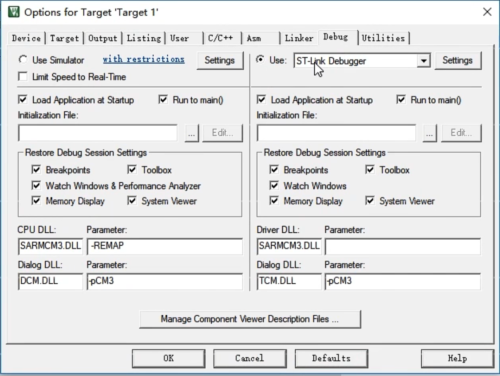


​	默认选择右侧一项，用STLINK进行硬件仿真，需要把STM32和STLINK都连接好。


​	如果你不想连接硬件，可以选择左边的使用仿真器这个选项，这样就是电脑模拟STM32的运行了。


下面展示使用硬件仿真：

​	正常编译完程序之后，点击放大镜带个d的图标进入调试模式：

​	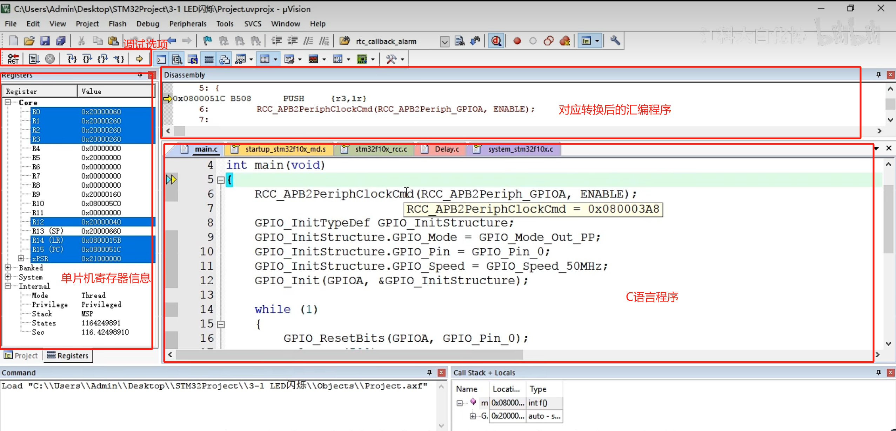


# 【5-1】EXTI外部中断

**中断系统是管理和执行中断的逻辑结构**


**外部中断是众多能产生中断的外设之一**


**配置中断函数的步骤：**

​	1.配置RCC，把涉及到的外设的时钟都打开(不打开时钟外设是没法工作滴)

​	2.配置GPIO，选择我们的端口为输入模式

​	3.配置AFIO，选择我们的这一路GPIO，连接到后面的EXTI。

​	4.配置EXTI，选择边沿触发的方式，比如上升沿，下降沿或者双边沿，还有选择触发响应方式，可以选择中断响应和事件响应。(当然我们一般都是中断响应。)

​	5.配置NVIC，给我们这个中断选择一个合适的优先级。

​	最后，通过NVIC，外部中断信号就可以进去CPU了。这样CPU才能收到中断信号，从外部中断进入到CPU里去。


**中断函数的程序编写建议：**

​	1.在中断函数里，最好不要执行耗时过长的代码，中断函数要简短迅速，别当进中断就执行一个Delay多少毫秒这样的代码，因为中断是处理突发的事情，如果你为了一个突发的事情待着中断里不出来了，那主程序就会受到严重的阻塞。

​	2.最好不要在中断函数和主函数调用相同的函数或者操作同一个硬件，尤其是硬件相关的函数，比如OLED显示函数。如果你既在主函数里调用OLED，又在中断里调用OLED，OLED就会显示错误，为什么呢？因为你想，在主程序中，OLED刚显示一半，帕，进中断了，结果中断里还是OLED显示函数，那OLED就挪到其他地方显示了。这时还没有问题，但当中断结束之后，需要继续原来的显示，这时就出问题了。


## 中断概念

#### 中断系统

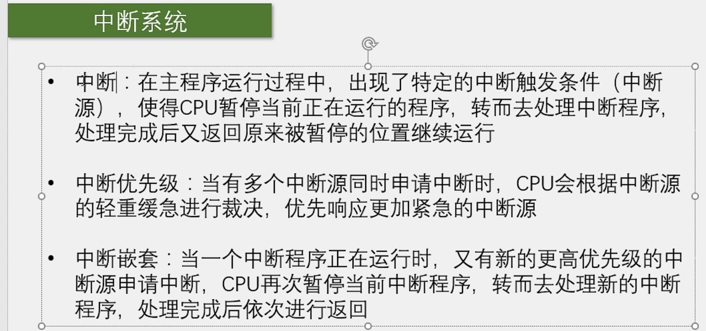

​	中断就是在正常主程序执行的某个时刻，发生了中断触发条件，比如：

​		对于外部中断来说：

​				可以是引脚发生了电平跳变。

​		对于定时器来说：

​				可以是定时的时间到了。

​		对于串口通信来说：

​				可以是接收到了数据。

​	当这些事件发生时，情况会比较紧急，所以我们希望CPU优先处理中断事件，再继续处理主程序。


**比喻理解：**

​		好比你定了一个早上的闹钟，定好了以后你就可以安心的睡觉了，时间到了以后闹钟会提醒你，这就相当于产生了一个中断信号。

​		如果你没有闹钟，那你就得不断地看时间，生怕错过了起床的时间点，那这样你就没法安心睡觉了是吧。


**中断优先级：**

​	是我们根据程序设计的需求自己设置的，中断优先级是为了在多个中断同时申请时，判断一下，应该先处理哪个。


#### 中断执行流程


​	**PS：**

​			一般中断程序都是在一个子函数里的，这个函数不需要我们调用，当中断来临时，由硬件自动调用这个函数。


#### STM32中断


​	EXTI：外部中断

​	TIM：定时器

​	ADC：模数转换器

​	 USART串口

​	SPI通信

​	I2C通信

​	RTC实时时钟


**中断向量表：**

​	中断表后的地址是干嘛的呢？这是因为我们程序中的中断函数，它的地址是由编译器来分配的，是不固定的。

​	但是我们的中断跳转，由于硬件的限制，只能跳到固定的地址执行程序，所以为了能让硬件跳转到一个不固定的中断函数里，这里就需要在内存中定义一个地址的列表，这个列表地址是固定的，中断发生后，就跳到这个固定的位置。

​	然后再在这个固定位置，由编译器，再加上一条跳转到中断函数的代码，这样中断跳转就可以跳转到任意位置了。这个中断地址的列表，就叫做中断向量表。相当于中断跳转的一个跳板。

​	不过我们用C语言编程的话，是不需要管这个中断向量表的，因为编译器都帮我们做好了，所以还是很省心的。


#### NVIC基本结构

NVIC的名字叫做**嵌套中断向量控制器**


​	在STM32中，它是用来统一分配中断优先级和管理中断的。NVIC是一个内核外设，是CPU的小助手。

​	STM32的中断非常多，如果把这些中断都接到CPU上，那CPU还得引出很多线进行适配，设计上就和那麻烦，并且如果很多中断同时申请，或者很多中断产生了拥堵，CPU也会很难处理，比较CPU主要是用来运算的，中断分配的任务就放到别的地方吧：所以NVIC就出现了。

​	

​	NVIC有很多个输入口，你有多少个中断线路，都可以接过来。比如可以接到EXTI，TIM，ADC，USART等等。


​	上图中线上画了一个斜杠上面写了个n,这个意思是：

​			一个外设可能会同时占用多个中断通道，所以这里有n条线。然后NVIC只有一个输出口，NVIC会根据每个中断的优先级分配中断的先后顺序。之后，通过右边的这一个输出口就告诉CPU，你该处理哪个中断，对于中断先后顺序分配的任务，CPU不需要知道。

​	**比喻理解：**

​			CPU是一个医生，如果医院只有医生的话，当看病的人很多时，医生就得安排一下先看谁，后看谁。如果有紧急的病人，那还得让紧急的病人最先来。这个安排先后次序的任务就很繁琐，会影响医生看病的效率。

​			所以医院就安排了一个叫号系统，来病人了统一取号，并且根据病人的等级，分配一个优先级，然后叫号系统看一下现在在排队的病人，优先叫号紧急的病人，最后叫号系统给医生输出的就是一个一个排好队的病人。医生就可以安心看病了。


#### NVIC分组

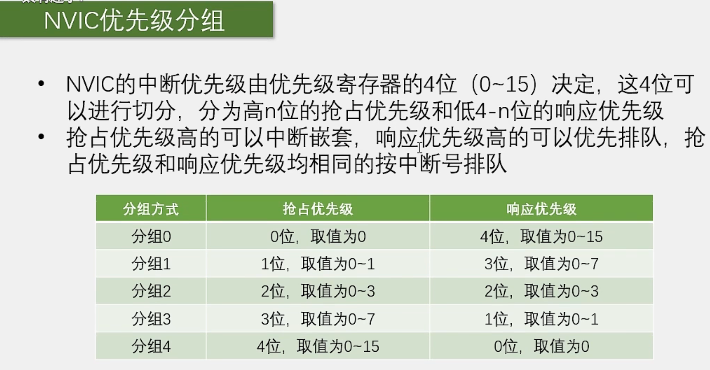


**比喻理解：**

​		接上文病人医生例子：

​		对于紧急的病人，其实有两种形式的优先。

​				一种是，上一个病人在看病，外面排队了很多病人，当上一个病人看完后，紧急的病人即使是后来的，也会最先进去看病。这种相当于插队的优先级，就叫**响应优先级**，响应优先级高的，可以插队提前看病。

​		 另外，如果这个病人更加紧急，并且此时已经有人在看病了，那他还可以不等上个人看完，直接冲到医生的屋里，让在看病的病人先靠边站，先给她看病，等他看完了，然后上一个病人再继续，上一个病人结束了，叫号系统再看看有没有人来。这种形式的优先级就是我们之前将的中断嵌套，这种决定是不是可以中断嵌套的优先级，就叫**抢占优先级**，抢占优先级高的，可以进行中断嵌套。


那我们刚才说了，每个中断有16个优先级，为了把这个优先级再区分为抢占优先级和响应优先级，就需要对这16个优先级进行分组了。


**下面是NVIC的相关函数**

```c
void NVIC_PriorityGroupConfig(uint32_t NVIC_PriorityGroup);
//函数功能：用来中断分组的，参数是中断分组的方式。
```

```c
void NVIC_Init(NVIC_InitTypeDef* NVIC_InitStruct);
//函数功能：根据结构体里的参数初始化NVIC
```


下面这两个函数用的不多

```c
void NVIC_SetVectorTable(uint32_t NVIC_VectTab, uint32_t Offset);
//函数功能：设置中断向量表
```

```c
void NVIC_SystemLPConfig(uint8_t LowPowerMode, FunctionalState NewState);
//函数功能：系统低功耗配置
```


## EXTI外部中断

**按键不推荐使用外部中断，因为用外部中断不好处理按键抖动和松手检测的问题，且对于按键来说，它的输出波形也不是转瞬即逝的，所以要求不高的话可以在主程序中循环读取，如果不想用主循环读取的话，可以考虑一下定时器中断读取的方式，这样既可以做到后台读取按键值，不阻塞主程序，也可以很好的处理按键抖动和松手检测的问题。**


### EXTI相关函数

```c
void EXTI_DeInit(void);
//函数功能：把EXTI的配置都清除，恢复成上电默认的状态。
```

```c
void EXTI_Init(EXTI_InitTypeDef* EXTI_InitStruct);
//填入参数	1.配置EXTI的结构体
//函数功能：可以根据这个结构体里的参数配置EXTI外设，即初始化EXTI
```

```c
void EXTI_StructInit(EXTI_InitTypeDef* EXTI_InitStruct);
//函数功能：可以把参数传递的结构体变量赋一个默认值
```

**以上三个函数，基本所有外设都有，就像是库函数的模板函数一样，基本每个外设都需要这些类型的函数，这些模板函数的使用方法和意思也都是一样的，会使用一个之后，再见到这种函数，就能很容易的上手。**

```c
void EXTI_GenerateSWInterrupt(uint32_t EXTI_Line);

//函数功能：这个函数是用来软件触发外部中断的，调用这个函数，参数给一个指定的中断线，就能软件触发一次这个外部中断，如果你程序中需要用到这个功能的话可以使用这个函数。当然如果你只需要外部引脚触发中断，那就不需要用这个函数了。
```


**下面四个函数，也是库函数的模板函数，很多模块都有这四个函数。**

```c
FlagStatus EXTI_GetFlagStatus(uint32_t EXTI_Line);
//函数功能：可以获取指定的标志位是否被置1了
```

```c
void EXTI_ClearFlag(uint32_t EXTI_Line);
//函数功能：可以对置1的标志位进行清除。
```

```c
ITStatus EXTI_GetITStatus(uint32_t EXTI_Line);
//函数功能：获取中断标志位是否被置1了(就是在中断函数中)
```

```c
void EXTI_ClearITPendingBit(uint32_t EXTI_Line);
//函数功能:清除中断挂起标志位(就是在中断函数中)
```

​	**总结：如果你想在主程序里查看和清除标志位，就用上面这两个函数，如果你想在中断函数里查看和清除标志位，就用下面这两个函数，其实本质上，这四个函数都是对状态寄存器的读写，上面两个和下面两个都是类似的功能，都是读写状态寄存器。**


### EXTI介绍


​		**简单来说就是引脚电平变化，申请中断。**

​	**PS：**

​		任意的GPIO口都可以当作外部中断的引脚，但相同的Pin不能同时触发中断。这个意思就是，比如PA0和PB0不能同时用，或者PA1，PB1，PC1这样的，端口GPIO_Pin一样的，只能选择一个作为中断引脚。所以你如果有多个中断引脚，要选择不同Pin的引脚，比如PA6和PA7，PA9和PB15这样的都可以。


**通道数：**

​		这些加起来总共有20个中断线路（16个Pin+4个蹭网的），这里的16个GPIO_Pin是外部中断的主要功能，后面跟着的四个东西其实是来蹭网的。为啥呢？因为这个外部中断有个功能，就是从低功耗模式的停止模式下唤醒STM32，

​		对于PVD电源电压监测，当电源从电压过低恢复时，就需要PVD借助一下外部中断退出停止模式。

​		对于RTC闹钟来说，有时候为了省电，RTC定了一个闹钟之后，STM32会进入停止模式，等到闹钟响的时候再唤醒，这也需要借助外部中断。

​		还有USB唤醒，以太网唤醒，也都是类似的作用。

​	**意思就是这四个蹭网的要唤醒就得找EXTI才能唤醒，其他中断没法唤醒**


**触发方式：**

​		中断响应：申请中断，让CPU执行中断函数。

​		事件响应：是STM32对外部中断增加的一种额外的功能。当外部中断检测到引脚电平变化时，正常的流程是选择触发中断，但在STM32中，也可以选择触发一个事件，如果选择触发事件，那外部中断的信号就不会通向CPU了，而是通向其他外设，用来触发其他外设的操作。比如触发ADC转换，触发DMA等。属于外设之间的联合工作。


### EXTI基本结构


**AFIO：**

​	EXTI模块只有16个GPIO通道，但这里每个GPIO外设都有16个引脚，如果每个引脚占用一个通道，那EXTI的16个通道显然就不够用了，所以在这里会有一个AFIO中断引脚选择的电路模块。

​	这个AFIO就是一个数据选择器，他可以在这前面3个GPIO外设的16个引脚里选择其中一个连接到后面EXTI的通道里。所以这前面说，相同的Pin不能同时触发中断，因为对于PA0，PB0，PC0这些，通过AFIO选择之后，只有其中一个能接到EXTI的通道0上，同理，PA1，PB1，PC1这些，也只能有一个，连接到通道1上


​	**下面是AFIO的函数介绍：**

```c
void GPIO_AFIODeInit(void);
//函数功能：用来复位AFIO外设的，当调用此函数时，AFIO外设的配置就会全部清除。
```


```c
void GPIO_EventOutputConfig(uint8_t GPIO_PortSource, uint8_t GPIO_PinSource);

void GPIO_EventOutputCmd(FunctionalState NewState);

//函数功能：用来配置AFIO的事件输出功能的，用的不多，了解即可。
```


```c
void GPIO_PinRemapConfig(uint32_t GPIO_Remap, FunctionalState NewState);
//填入参数：1.选择你要重映射的方式	2.参数新的状态
//函数功能：可以用来进行引脚重映射

```

```c
void GPIO_EXTILineConfig(uint8_t GPIO_PortSource, uint8_t GPIO_PinSource);
//填入参数
//函数功能：配置AFIO的数据选择器，来选择我们想要的中断引脚
```

**PS：**

​	本来20路的输入，应该有20路中断的输出接入到NVIC的，但可能ST公司觉得这20个输出太多了，比较占用NVIC的通道资源，所以就把其中外部中断9-5，和15-10，给分到一个通道里，也就是说，外部中断的9-5和15-10会触发同一个中断函数，15-10也会触发同一个中断函数。在编程的时候，我们在这两个中断函数里，需要再根据标志位来区分到底是哪个中断进来的。


### AFIO复用IO口


### EXTI内部框图

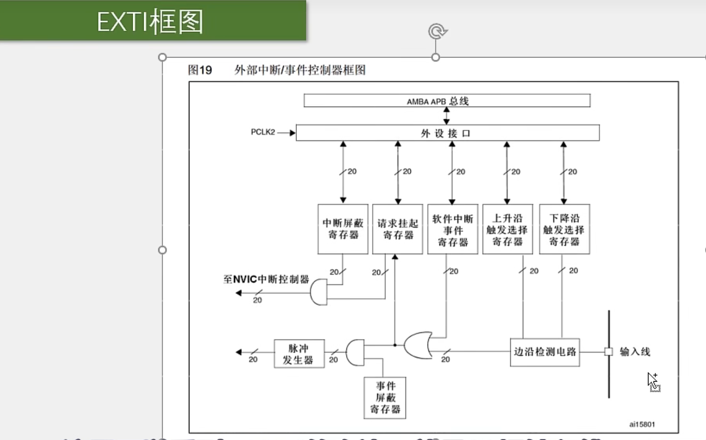


## 旋转编码器

### 介绍

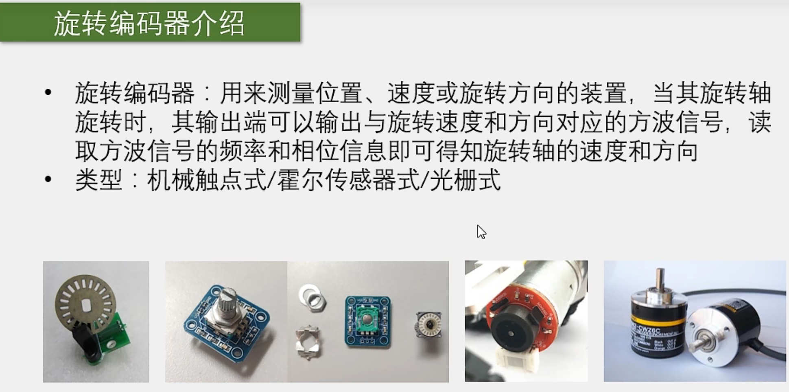

### 硬件电路


# 【5-2】红外传感&旋转编码计次

## 红外传感

**对射式红外传感器计次**


### 接线图

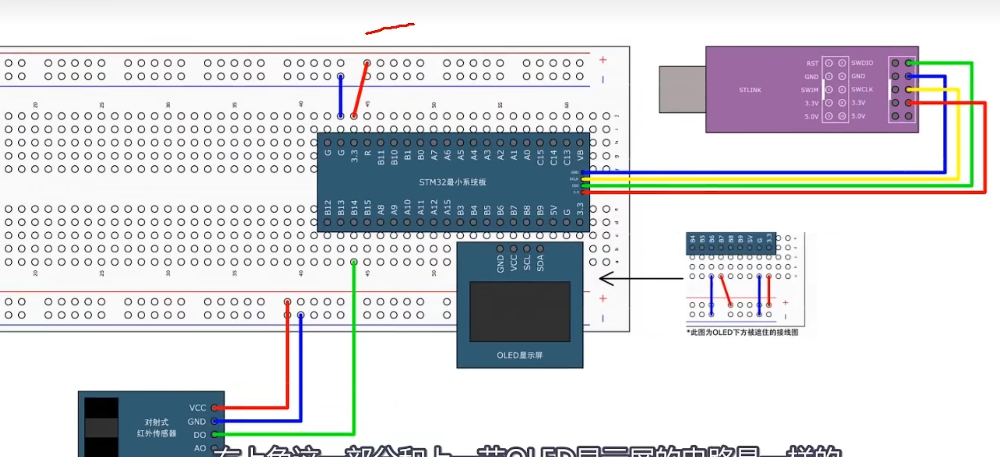

### 程序实例

**CountSensor.h**

```c
#ifndef __COUNT_SENSOR_H
#define __COUNT_SENSOR_H

void CountSensor_Init(void);
uint16_t CountSonsor_Get(void);
//中断函数不用声明，因为中断函数不需要调用，它是自动执行的

#endif 

```


**CountSensor.c**

```c
#include "stm32f10x.h"                  // Device header


uint16_t CountSonsor_Count;

void CountSensor_Init(void)
{
	//进行外部中断的配置
	//开启GPIOB的时钟	(注意GPIOB是APB2的外设)
	RCC_APB2PeriphClockCmd(RCC_APB2Periph_GPIOB,ENABLE);
	
	//开启AFIO的时钟，AFIO也是APB2的外设
	RCC_APB2PeriphClockCmd(RCC_APB2Periph_AFIO,ENABLE);
	
	//EXTI和NVIC这两个外设的时钟是一直开着的所以我们不需要自己开启。
	
	//配置GPIO：
	
	GPIO_InitTypeDef GPIO_InitStructrue;	//定义结构体
	GPIO_InitStructrue.GPIO_Mode = GPIO_Mode_IPU;	//上拉输入，默认为高电平
	GPIO_InitStructrue.GPIO_Pin = GPIO_Pin_14;
	GPIO_InitStructrue.GPIO_Speed = GPIO_Speed_50MHz;
	GPIO_Init(GPIOB,&GPIO_InitStructrue);//GPIO初始化
	
	//配置AFIO
	GPIO_EXTILineConfig(GPIO_PortSourceGPIOB,GPIO_PinSource14);
	
	EXTI_InitTypeDef EXTI_InitStruct;	//定义结构体，用于EXTI的初始化
	EXTI_InitStruct.EXTI_Line = EXTI_Line14;	//指定要配置的中断线
	EXTI_InitStruct.EXTI_LineCmd = ENABLE;	//指定选择的中断线的新状态
	EXTI_InitStruct.EXTI_Mode = EXTI_Mode_Interrupt;//中断模式
	EXTI_InitStruct.EXTI_Trigger = EXTI_Trigger_Falling;//下降沿触发
	
	//EXTI初始化
	EXTI_Init(&EXTI_InitStruct);
	
	//NVIC分组
	NVIC_PriorityGroupConfig(NVIC_PriorityGroup_2);
	
	NVIC_InitTypeDef NVIC_InitStruct;//定义结构体，用于NVIC的初始化
	NVIC_InitStruct.NVIC_IRQChannel = EXTI15_10_IRQn;//指定中断通道来开启或关闭
	NVIC_InitStruct.NVIC_IRQChannelCmd = ENABLE;//指定中断通道是使能(或者失能DISABLE)
	NVIC_InitStruct.NVIC_IRQChannelPreemptionPriority = 1;//指定抢占优先级
	NVIC_InitStruct.NVIC_IRQChannelSubPriority = 1;	//指定响应优先级
	//NVIC初始化
	NVIC_Init(&NVIC_InitStruct);
}

uint16_t CountSonsor_Get(void)
{
	return CountSonsor_Count;
}


//中断函数不用声明，因为中断函数不需要调用，它是自动执行的
void EXTI15_10_IRQHandler(void)
{
	//标志位判断
	//因为进来此中断函数的是10-15脚，不一定就是14脚，所以要进行标志位判断
	if (SET == EXTI_GetFlagStatus(EXTI_Line14))
	{
		CountSonsor_Count++;
		
		//清除标志位，以防止程序一直申请中断，一直都在中断函数中卡死
		EXTI_ClearITPendingBit(EXTI_Line14);
	}
}

```


**main.c**

```c
#include "stm32f10x.h"                  // Device header
#include "Delay.h"
#include "OLED.h"
#include "CountSensor.h"

int main(void)
{
	/*模块初始化*/
	OLED_Init();		//OLED初始化
	CountSensor_Init();
	
	OLED_ShowString(1, 1, "Count:");	//1行3列显示字符串HelloWorld!
	

	
	while (1)
	{
		OLED_ShowNum(1,7,CountSonsor_Get(),5);
	}
}

```


## 旋转编码计次


### 接线图


### 程序实例

**Encoder.h**

```c
#ifndef __ENCODER_H
#define __ENCODER_H

void Encoder_Init(void);
int16_t Encoder_Get(void);


#endif

```

**Encoder.c**

```c
#include "stm32f10x.h"                  // Device header


int16_t Encoder_Count;

void Encoder_Init(void)
{
	//进行外部中断的配置
	//开启GPIOB的时钟	(注意GPIOB是APB2的外设)
	RCC_APB2PeriphClockCmd(RCC_APB2Periph_GPIOB,ENABLE);
	
	//开启AFIO的时钟，AFIO也是APB2的外设
	RCC_APB2PeriphClockCmd(RCC_APB2Periph_AFIO,ENABLE);
	
	//EXTI和NVIC这两个外设的时钟是一直开着的所以我们不需要自己开启。
	
	//配置GPIO：
	
	GPIO_InitTypeDef GPIO_InitStructrue;	//定义结构体
	GPIO_InitStructrue.GPIO_Mode = GPIO_Mode_IPU;	//上拉输入，默认为高电平
	GPIO_InitStructrue.GPIO_Pin = GPIO_Pin_0 | GPIO_Pin_1;
	GPIO_InitStructrue.GPIO_Speed = GPIO_Speed_50MHz;
	GPIO_Init(GPIOB,&GPIO_InitStructrue);//GPIO初始化
	
	//配置AFIO
	GPIO_EXTILineConfig(GPIO_PortSourceGPIOB,GPIO_PinSource0);
	GPIO_EXTILineConfig(GPIO_PortSourceGPIOB,GPIO_PinSource1);
	
	EXTI_InitTypeDef EXTI_InitStruct;	//定义结构体，用于EXTI的初始化
	EXTI_InitStruct.EXTI_Line = EXTI_Line0 | EXTI_Line1;	//指定要配置的中断线
	EXTI_InitStruct.EXTI_LineCmd = ENABLE;	//指定选择的中断线的新状态
	EXTI_InitStruct.EXTI_Mode = EXTI_Mode_Interrupt;//中断模式
	EXTI_InitStruct.EXTI_Trigger = EXTI_Trigger_Falling;//下降沿触发
	
	//EXTI初始化
	EXTI_Init(&EXTI_InitStruct);
	
	//NVIC分组
	NVIC_PriorityGroupConfig(NVIC_PriorityGroup_2);
	
	NVIC_InitTypeDef NVIC_InitStruct;//定义结构体，用于NVIC的初始化
	NVIC_InitStruct.NVIC_IRQChannel = EXTI0_IRQn;//指定中断通道来开启或关闭
	NVIC_InitStruct.NVIC_IRQChannelCmd = ENABLE;//指定中断通道是使能(或者失能DISABLE)
	NVIC_InitStruct.NVIC_IRQChannelPreemptionPriority = 1;//指定抢占优先级
	NVIC_InitStruct.NVIC_IRQChannelSubPriority = 1;	//指定响应优先级
	//NVIC初始化
	NVIC_Init(&NVIC_InitStruct);
	
	
	NVIC_InitStruct.NVIC_IRQChannel = EXTI1_IRQn;//指定中断通道来开启或关闭
	NVIC_InitStruct.NVIC_IRQChannelCmd = ENABLE;//指定中断通道是使能(或者失能DISABLE)
	NVIC_InitStruct.NVIC_IRQChannelPreemptionPriority = 1;//指定抢占优先级
	NVIC_InitStruct.NVIC_IRQChannelSubPriority = 2;	//指定响应优先级
	//NVIC初始化
	NVIC_Init(&NVIC_InitStruct);
}


int16_t Encoder_Get(void)
{
	int16_t Temp;
	Temp = Encoder_Count;
	Encoder_Count = 0;
	return Temp;
}

void EXTI0_IRQHandler(void)
{
	//判断标志位
	if (EXTI_GetFlagStatus(EXTI_Line0) == SET)
	{
		//判断是否为反转
		if(GPIO_ReadInputDataBit(GPIOB,GPIO_Pin_1) == 0)
		{
			Encoder_Count--;
		}
		//清除标志位
		EXTI_ClearITPendingBit(EXTI_Line0);
	}
	
}

void EXTI1_IRQHandler(void)
{
	//判断标志位
	if (EXTI_GetFlagStatus(EXTI_Line1) == SET)
	{
		//判断是否为正转
		if(GPIO_ReadOutputDataBit(GPIOB,GPIO_Pin_1) == 0)
		{
			Encoder_Count++;
		}
		//清除标志位
		EXTI_ClearITPendingBit(EXTI_Line1);
	}
}

```


**main.c**

```c
#include "stm32f10x.h"                  // Device header
#include "Delay.h"
#include "OLED.h"
#include "Encoder.h"

uint16_t Num;
int main(void)
{
	/*模块初始化*/
	OLED_Init();		//OLED初始化
	Encoder_Init();
	
	/*OLED显示*/
	
	OLED_ShowString(1, 1, "Num:");	//1行3列显示字符串HelloWorld!

	
	while (1)
	{
		Num += Encoder_Get();
		OLED_ShowSignedNum(1,5,Num,5);
	}
}

```


# 【6-0】定时器

**号称：STM32中，功能最强大，结构最复杂的一个外设------定时器**

## 【6-1】记录

​	因为定时器的内容很多，所以本大节总共分为4个部分，8个小节。

**第一部分：**定时器的基本定时功能

​						定一个时间，让定时器每隔这个时间产生一个中断，来实现每隔一个固定时间执行一段程序的目的。

​						比如你要做一个时钟，秒表，或者使用一些程序算法的时候，都需要用到定时中断的这个功能。


**第二部分：**定时器输出比较的功能

​						输出比较这个模块最常见的用途就是产生PWM波形，用于驱动电机等设备。

​						在这个部分我们将会学到用STM32输出的PWM波形来驱动舵机和直流电机的例子。


**第三部分：**定时器输入捕获的功能

​					 	我们将会学习使用输入捕获这个模块来测量方波频率的例子。


**第四部分：**定时器的编码器接口

​						使用这个编码器接口，能够更加方便地读取正交编码器的输出波形。在编码电机测速中，应用也是非常广泛的


# 【6-1】TIM定时中断

## TIM

### 定时器的库函数


### 简介


​	**STM32中，定时器的基准时钟一般都是主频72MHz**

​		比如我对72MHz计72个数，那就是1MHz也就是1us的时间，如果计72000个数，那就是1kHz也就是1ms的时间。


### 定时器类型

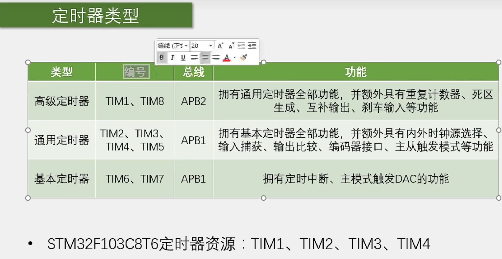

​	**不同的型号具有的定时器是不同的，你在操作这个定时器外设的时候，一定要先查一下它有没有这个外设，否则操作了不存在的外设，那样是不会起作用的**


### 基本定时器

#### 介绍

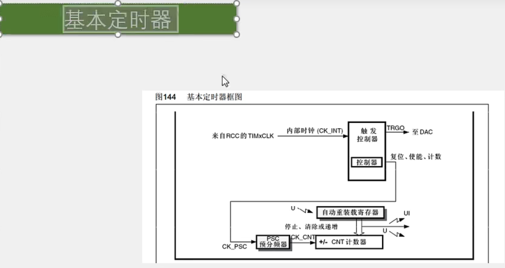

​	可以完成定时中断，主模式触发DAC的功能。

​	**预分频器：**就是对输入的基准频率提前进行以一个分频的操作。

​	**计数器：**可以对预分频后的计数时钟进行计数。计数时钟每来一个上升沿，计数器的值就+1。这个计数器也是16位的，所以里面的值可以用0-65535。

​	当自增运行至目标值时，产生中断，那就完成了定时的任务。所以现在还需要一个存储目标值的寄存器，那就是自动重装寄存器了。

​	**自动重装寄存器：**它也是16位的，它存的就是我们写入的计数目标。

​	在运行的过程中，计数值不断自增，自动重装值是固定的目标。当计数值等于自动重装值时，也就是计时时间到了。那它就会产生一个中断信号，并且清零计数器，计数器自动开始下一次的计数计时。


(TIPS:51是给定初始值让其自减，当自减完后触发中断。而32是给定某个目标值自增，当自增至目标值后触发中断重置为0再次开始计时。)

像32这种计数值等于自动重装值产生的中断我们一般把它叫做**更新中断**


这个更新中断之后，就会通往NVIC，我们再配置好NVIC的定时器通道，那定时器的更新中断就能够得到CPU的响应了。


（图中向上箭头[UI]表示产生一个中断，而向下箭头[U]表示产生一个事件，对应的事件叫做**更新事件**。更新事件不会触发中断，但是可以触发内部其他电路的工作。）


#### 主模式触发DAC的功能

**STM32定时器的一大特色，就是主从触发模式**

​	它能让内部的硬件在不受程序的控制下实现自动运行。如果能把这个主从触发模式掌握好，那在某些情景下将会极大地减轻CPU的负担。这个后面课程会详细讲解，这里简单了解一下：


**这个主模式触发DAC(数模转换)有啥用呢？**

​		在我们使用DAC的时候，可能会用DAC输出一段波形，那就需要每个一段时间来触发一次DAC，让它输出下一个电压点。

​		如果用正常的思路来实现的话，就是先设置一个定时器产生中断，每隔一段时间在中断程序中调用代码手动触发一次DAC转换，然后DAC输出。这样也是没问题的，但是这样会使主程序处于频繁被中断的状态，这会影响主程序的运行和其他中断的响应 。

​		所以定时器就设计了一个主模式，使用这个主模式可以把这个定时器的更新事件，映射到这个触发输出TRGO(Trigger Out)的位置，然后TRGO直接接到DAC的触发转换引脚上。这样，定时器的更新就不需要再通过中断来触发DAC转换了。仅需要把更新事件通过主模式映射到TRGO，然后TRGO就会直接去触发DAC了。整个过程不需要软件的参与，实现了硬件的自动化，这就是主模式的作用。


### 通用计时器

#### 介绍


下面是清晰放大图：


首先中间最核心这部分，还是**时基单元**，结构和基本定时器是一样的，由预分频器，计数器，自动重装寄存器构成。每部分的工作流程和基本定时器也是一样的。

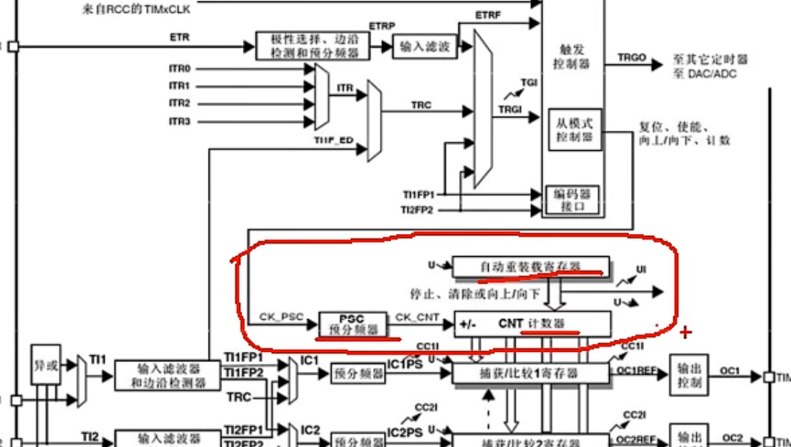

**不过，对于通用定时器而言，这个计数器的计数模式就不止向上计数这一种了** 

除了这种向上计数的模式外，通用定时器和高级定时器还支持**向下计数模式**和**中央对齐模式**。

​	**向下计数模式：**从重装值开始，向下自减，减到0之后，回到重装值同时申请中断。

​	**中央对齐模式：**从0开始，先向上自增，计到重装值，申请中断，然后再向下自减，减到0后再次申请中断。


**不过其实最常用的还是向上计数模式，其他两种模式了解即可**


##### 上部分
上部分：**内外时钟源选择和主从触发模式的结构**

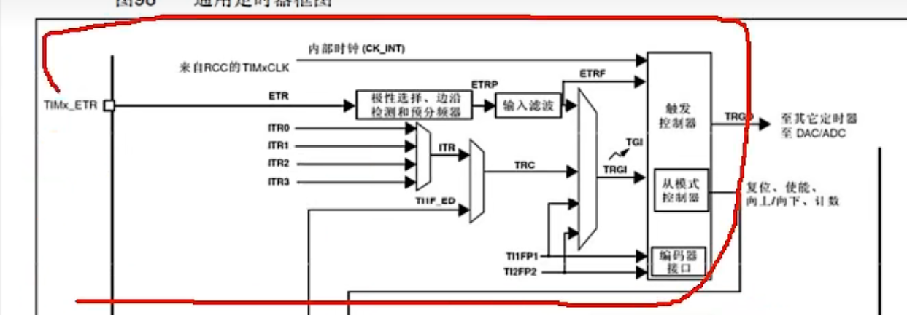


**内外时钟源选择：**对于基本定时器而言，定时只能选择内部时钟，也就是系统频率72MHz。到了通用定时器这里，时钟源不仅可以选择内部的72MHz时钟，还可以选择外部时钟，具体都有哪些呢？

​			第一个外部时钟就是来自TIMx_ETR引脚上的外部时钟

​					例如，我们可以在TIM2的ETR引脚，也就是PA0上接一个外部方波时钟，然后配置一下内部的极性选择，边沿检测和预分频器电路，再配置一下输入滤波电路 。最后，滤波后的信号兵分两路，上面一路ETRF进入触发控制器，紧跟着就可以选择作为时基单元的时钟了：

​								如果你想在ETR外部引脚提供时钟，或者想对ETR时钟进行计数，把这个定时器当作计数器来用的话，那就可以配置这一路的电路，在STM32中，这一路也叫做**外部时钟模式2**

​				除了外部ETR引脚可以提供时钟外，下面还有一路可以提供时钟，就是TRGI(Trigger In)，从名字上来看就知道它主要是用作触发输出来使用的。这个触发输入可以触发定时器的从模式(关于触发输入和从模式，后续课程再讲)本小节讲的是这个触发输入作为外部时钟来使用的情况。暂且把这个TRGI当作外部时钟的输入来看，当这个TRGI当作外部时钟来使用的时候，这一路就叫做**外部时钟模式1**。

​							那通过这一路的外部时钟都有哪些呢？往左看。

​											第一个就是ETR引脚信号。这里ETR引脚既可以通过上面这一路进来当作时钟，又可以通过下面这一路进来当作时钟。两种情况对于时钟输入而言是等价的。只不过是下面这一路输入会占用触发输入的通道而已。

​											第二个就是ITR信号，这一部分的时钟信号是来自其他定时器的，从右边可以看出，这个主模式的输出TRGO可以通向其他定时器。那通向其他定时器的时候，就接到了其他定时器的ITR引脚上来了。这个ITR0-ITR3分别来自其他4个定时器的TRGO输出。至于具体的连接方式是怎样的，参考STM32手册，下面是相关表截图：

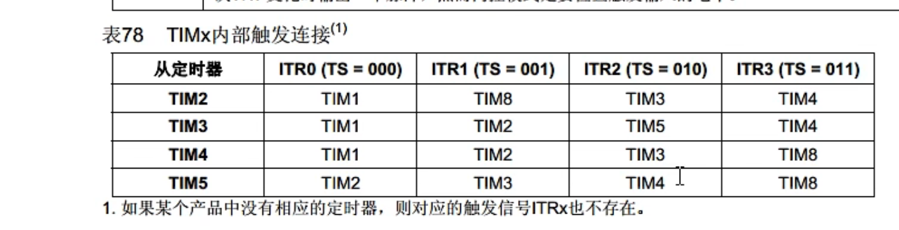

​												第三个就是TI1F_ED。这里连接的是输入捕获单元的CH1引脚：


​						也就是从CH1引脚获得时钟，然后后缀加一个ED(Edge)就是边沿的意思，也就是通过这一路输入的时钟，上升沿和下降沿均有效。

​													第四个，这个时钟还能通过TI1FP1和TI2FP2获得。其中TI1FP1连接到了CH1，TI2FP2连接到了CH2引脚的时钟。


​						最后还有**编码器接口**：可以读取正交编码器的输出波形，后续课程会讲解。


​		**总结一下外部时钟模式1：**输入可以是ETR引脚，其他定时器，CH1引脚的边沿，CH1引脚和CH2引脚。一般情况下外部时钟通过ETR引脚就可以了。


##### 下部分


右边这一块是**输出比较电路：**

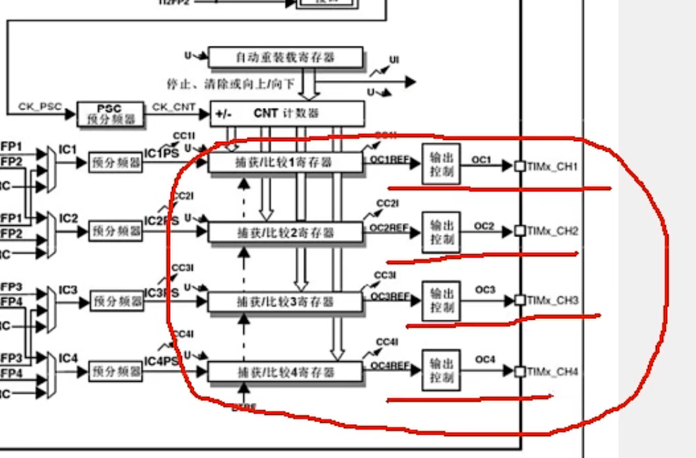


​			总共有四个通道，分别对应CH1-CH4的引脚，可以用于输出PWM波形，驱动电机。


左边这一块是**输入捕获电路：**


​				也是有四个通道，对应的也是CH1-CH4的引脚，可以用于测输入方波的频率等。


中间这个寄存器是**捕获/比较寄存器**

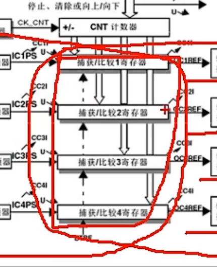


​		是输入捕获和输出比较电路共用的。


**因为输入捕获和输出比较不能同时使用，所以这里的寄存器是共用的**


### 高级计时器


#### 介绍


对比通用定时器，在高级定时器里左上的这一大部分都没有变化，主要改变的就是右边和下边这两个部分。


**第一**

​		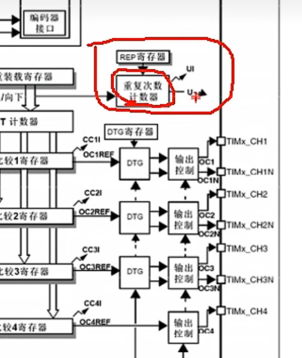

​	申请中断的地方，增加了一个重复次数计数器。有了这个计数器之后，就可以实现每隔几个计数周期才发生一次更新事件和更新中断。原来的结构是每个计数周期完成后都会发生更新，现在有个计数器在这里，可以实现每隔几个周期再更新一次。这就相当于对输出的更新信号又做了一次分频。

​					那对于高级定时器的话，我们之前计算的最大定时器的时间是59秒多，在这里就可以多乘一个65536，这样就又提升了很多的定时时间了。这个就是这个重复计数器的工作流程。


**第二**


上面这些，就是高级定时器对输出比较模块的升级了，在此不必深入了解，因此下面不做详细笔记，


## 定时中断基本结构
### 介绍

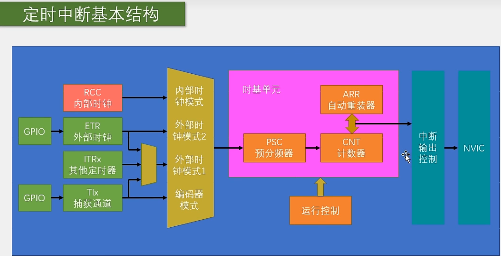

在这个图里，把其他无关的都去掉了，另外还加了一些定时器框图里没体现的东西。


其中比较重要的就是**时基单元**


下面是**时基单元运行**的一些细节问题的探究：


### 预分频器时序


​	第一行是**CK_PSC**，预分频器的输入时钟：选内部时钟的话，一般是72MHz。

​	第二行是**CNT_EN**，计数器使能：高电平计数器正常运行，低电平计数器停止运行。

​	第三行是**CK_CNT**,计数器时钟：它既是预分频器的时钟输出，也是计数器的时钟输入。

​	第四行是**更新时间(UEV)**,更新事件：当FC清零时产生一个高电平表示为更新事件。


​		开始时，计数器未使能，计数器时钟不运行，然后使能后，前半段，预分频器的系数为1，计数器的时钟等于预分频器前的时钟。后半段，预分频器系数变为2了，计数器的时钟也变为预分频器前时钟的一半了。在计数器时钟的驱动下，下面的计数器寄存器也跟随时钟的上升沿不断自增，在中间的这个位置FC之后，计数值变为0了，这里虽然没写，但是可以推断出ARR自动重装值就是FC。当计数值计到和重装值相等，并且下一个时钟来临时，计数值才会清零。同时，下面这里产生一个更新事件。**这就是一个计数周期的工作流程**


​		后面下面这三行时序描述的其实是这个预分频器寄存器的一种缓冲机制。也就是这个预分频器寄存器实际上是有两个。

​		一个是**预分频器控制寄存器**，供我们读写用的，它并不直接决定分频系数。

​		另外还有一个**缓冲寄存器(预分频缓冲器)**，或者而叫做影子寄存器。这个缓冲寄存器才是真正起作用的寄存器。比如我们在某个时刻，把预分频控制寄存器由0改为了1，如果在此时立刻改变了时钟的分频系数，那么就会导致下图红线中，在一个计数周期内，前半部分和后半部分的频率不一样。

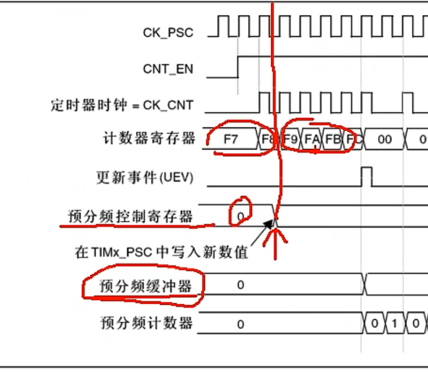

​		这里计数计到一半，计数频率突然就会改变了。这虽然一般并不会有什么问题，但是STM32的定时器比较严谨，设计了这个缓冲寄存器，这样，当我在计数计到一半的时候改变了分频值，这个变化不会立刻生效，而是会等到本次计数周期结束时，产生了更新事件，预分频器控制寄存器的值才会被传递到缓冲寄存器里面去，才会生效。


最后一行也是，预分频器内部实际上也是靠计数来分频的:

​		当预分配值为0时，计数器就一直为0，直接输出原频率。当预分频值为1时，计数器就0，1，0，1，0，1这样计数。在回到一个0的时候，输出一个脉冲，这样输出频率就是输入频率的2分频。预分频器的值和实际的分频系数之间有一个数的偏移。


那最下面就有这样的一个公式：

​	**•计数器计数频率：CK_CNT = CK_PSC / (PSC + 1)**


### 计数器时序

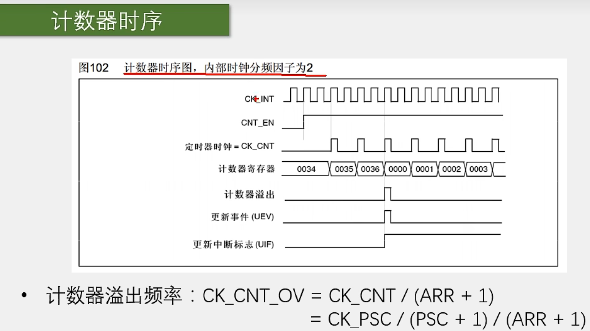

​	内部时钟分频因子为2，就是分频系数为2。

​		

​	第一行是**CK_INT**，内部时钟72MHz。

​	第二行是**CNT_EN**，时钟使能：高电平计数器正常运行，低电平计数器停止运行。

​	第三行是**CK_CNT**,计数器时钟：因为分频系数为2，所以这个频率是上面这个除以2，

​		然后计数器在这个时钟每个上升沿自增。当增到0036时，发生溢出，那计到36之后，再来一个上升沿，计数器清零，计数器溢出，产生一个更新事件脉冲。另外还会置一个更新中断标志位UIF。这个标志位只要置1了，就会去申请中断。然后中断响应后，需要在中断程序中手动清零。这就是**计数器的工作流程**。


•计数器溢出频率：CK_CNT_OV = CK_CNT / (ARR + 1)

​     = CK_PSC / (PSC + 1) / (ARR + 1)

如果想算溢出时间，那就只需要再取个倒数就行了。


PS：计数器同样也有跟预分频器一样的缓冲机制，当然这个可以自己选择是用还是不用。


### 计数器无预装时序

**就是没有缓冲寄存器的情况**


​	在这里，计数器正在进行自增计数，我们突然更改了自动加载寄存器，就是自动重装寄存器，由FF改成了36，那计数值的目标值就由FF变成了36，所以计到36之后，就直接更新，开始下一轮的计数。


### 计数器有预装时序

**就是有缓冲寄存器的情况**

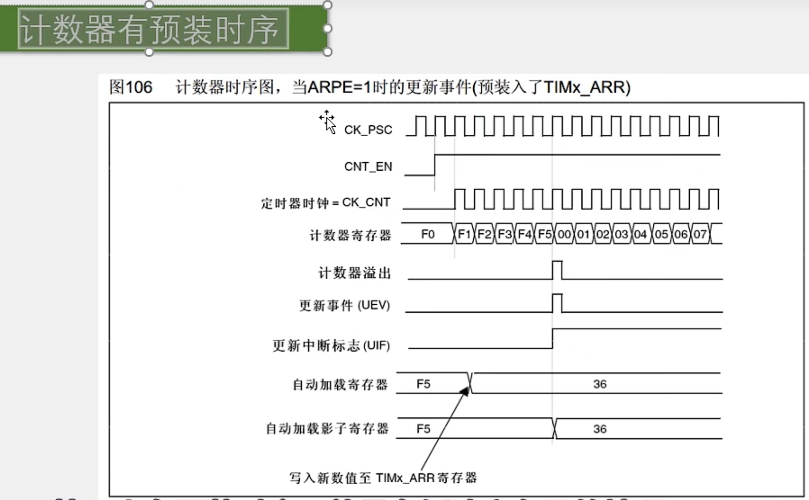

通过设置ARPE位，就可以选择是否使用预装功能。


有预装的情况：

​			在计数的中途，我们突然把计数目标由F5改成了36，可以看到下面有个影子寄存器，这个影子寄存器才是真正起作用的，它还是F5，所以现在计数的目标还是计到F5，产生更新事件。同时，要更改的36此刻才被传递到影子寄存器，在下一个计数周期，这个更改的36才有效。


**所以可以看出，引入这个影子寄存器的目的实际上是为了同步，就是让值的变化和更新事件同步发生，防止在运行途中更改造成错误。**


## RCC时钟数


这个时钟树，就是STM32中用来产生和配置时钟，并且把配置好的时钟发送到各个外设的系统。

**时钟是所有外设运行的基础，所以时钟也是最先需要配置的东西**


我们之前说过，程序中主函数之前还会执行一个SystemInit函数，这个函数就是用来配置这个时钟树的。


这个结构看起来很麻烦，但好在ST公司已经帮我们写好了配置这个时钟树的SystemInit函数


下面是对时钟树的初步了解：


以下图红线为分割，左边的都是时钟产生的电路，右边的都是时钟的分配电路。


​	中间的**SYSCLK**,就是系统时钟72MHz。

### 时钟产生电路

在时钟产生电路，有四个震荡源，分别是：

​				内部的8MHz高速RC振荡器

​				外部的4-16MHz高速石英晶体振荡器，也就是晶振，一般都接8MHz

​				外部的32.768KHz低速晶振，这个一般是给RTC提供时钟的。

​				内部的40KHz低速RC振荡器，这个可以给看门狗提供时钟。

其中，上面这两个高速晶振，是用来提供系统时钟的，我们AHB，APB2，APB1的时钟都是来源于这两个高速晶振。

​		这里内部和外部都有一个8MHz的晶振，都是可以用的，只不过是外部的石英振荡器比内部的RC振荡器更加稳定。但是如果你系统很简单并且不需要那么精确的时钟，那也是可以使用内部的RC振荡器，这样就可以省下外部晶振的电路了。

​		那在SystemInit函数里，ST是这样来配置时钟的：

​					首先它会启动内部时钟，选择内部8MHz为系统时钟，暂时以内部8MHz的时钟运行哈：

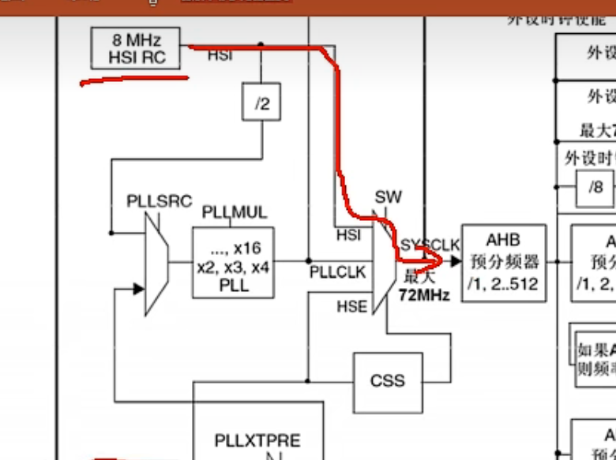

​					然后再启动外部时钟，配置外部时钟走这一路，进入PLL锁相环进行倍频，8MHz倍频9倍，得到72MHz，等到锁相环输出稳定后，选择锁相环输出为系统时钟，这样就把系统时钟由8MHz切换到了72MHz。


这是ST配置的流程。


这样分析后，可以解决实际应用的一个问题，那就是：

​		如果你的外部晶振出问题了，可能会导致一个现象，就是你会发现，你程序的时钟慢了大概10倍，比如你用定时器定一个1s的时间，结果过了大概10s才进中断。这个问题就出在这里，如果外部晶振出问题了，系统时钟就无法切换到72Mhz。那它就会以内部的8MHz运行，相比于72M，大概就慢了10倍


另外还有个**CSS(Clock Security System)**:

​		这个是时钟安全系统，它也是负责切换时钟的。它可以检测外部时钟的运行状态，一旦外部时钟失效，它就会自动把外部时钟切换回内部时钟。保证系统时钟的运行，防止系统卡死。

​			**当然其他地方也有CSS的身影**


	### 时钟分配电路


​	首先系统时钟72MHz进入AHB总线，AHB总线有个预分频器，在SystemInit里配置的分配系数为1，那AHB的时钟就是72MHz。然后进入APB1总线，这里配置的分配系数是2，所以APB1总线的时钟为72MHz/2 = 36MHz 

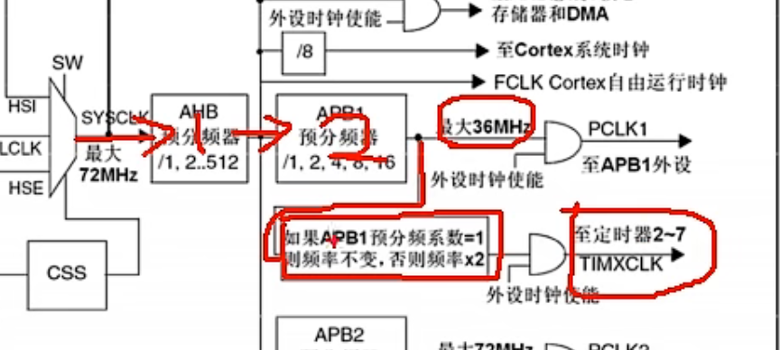

**结论：无论是高级定时器还是通用定时器还是基本定时器，它们的内部基准时钟都是72MHz**


上面这个就是我们在程序中写RCC_APB2/1PeriphClockCmd作用的地方：

​		打开时钟，就是在这里写1，让左边的时钟能够通过与门输出给外设

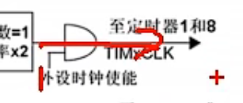

# 【6-2】定时中断&内外时钟源选择


## 定时器定时中断

### 接线图


### 程序部分

#### 定时器的初始化


照着这个步骤一步步打通就行

​	1.打开RCC定时器时钟，打开后，定时器的基准时钟和整个外设的工作时钟就都会同时打开了。

​	2.选择时基单元的时钟源

​			对于定时中断，我们就选择内部时钟源

​	3.配置时基单元，包括预分频器，自动重装器，计数模式等等（结构体配置）

​	4.配置输出中断控制，允许更新中断输出到NVIC

​	5.配置NVIC，在NVIC中打开定时器中断的通道，并分配一个优先级。

​	6.允许控制

​	整个模块配置完成后，我们还需要使能一下计数器。要不然计数器是不会运行的。当定时器使能后，计数器就会开始计数了，当计数器更新时，触发中断。

​	7.最后我们再写一个定时器的中断函数，这样这个中断函数就会每隔一段时间就能自动执行一次了。


#### 定时器的库函数

```c
void TIM_DeInit(TIM_TypeDef* TIMx);
//函数功能：恢复缺省配置
```

下面的这个函数用于时基单元

```c
void TIM_TimeBaseInit(TIM_TypeDef* TIMx, TIM_TimeBaseInitTypeDef* TIM_TimeBaseInitStruct);
//函数功能：时基单元初始化
//函数参数：1.TIMx选择某个定时器	2.结构体，包含配置的参数
//比较重要
```

```c
void TIM_TimeBaseStructInit(TIM_TimeBaseInitTypeDef* TIM_TimeBaseInitStruct);
//函数功能：可以把结构体变量赋一个默认值
```

下面这个函数用于运行控制

```c
void TIM_Cmd(TIM_TypeDef* TIMx, FunctionalState NewState);
//函数功能：使能计数器，对应图中运行控制
//函数参数：1.TIMx选择定时器	2.NewState新的状态，即是使能失能
```

下面的这个函数用于中断输出控制

```c
void TIM_ITConfig(TIM_TypeDef* TIMx, uint16_t TIM_IT, FunctionalState NewState);
//函数功能：使能中断输出信号，对应图中中断输出控制
//函数参数：1.TIMx选择定时器	2.TIM_IT选择要配置哪个中断输出	3.NEWState

//ITconfig函数：使能外设的中断输出
```


下面的6个函数对应图中时基单元的时钟选择部分，可以选择RCC内部时钟，ETR外部时钟，ITRx其他定时器，TLx捕获通道这些

```c
void TIM_InternalClockConfig(TIM_TypeDef* TIMx);
//函数功能：选择内部时钟
//函数参数：1.TIMx选择定时器
```

```c
void TIM_ITRxExternalClockConfig(TIM_TypeDef* TIMx, uint16_t TIM_InputTriggerSource);
//函数功能：选择ITRx其他定时器的时钟
//函数参数：1.TIMx选择定时器	2.InputTriggerSourse选择要接入哪个其他的定时器
```

```c
void TIM_TIxExternalClockConfig(TIM_TypeDef* TIMx, uint16_t TIM_TIxExternalCLKSource,uint16_t TIM_ICPolarity, uint16_t ICFilter);
//函数功能：TIM_TIxExternalClockConfig,选择TIx捕获通道的时钟
//函数参数：1.TImx	2.TIxExternalCLKSourse选择TIx具体的某个引脚	3.ICPolarity输入的极性	4.ICFiLter输入的滤波器
//对于外部引脚的波形，一般都会有极性选择和滤波器，这样更灵活一些
```

```c
void TIM_ETRClockMode1Config(TIM_TypeDef* TIMx, uint16_t TIM_ExtTRGPrescaler, uint16_t TIM_ExtTRGPolarity,uint16_t ExtTRGFilter);
//函数功能：选择ETR通过外部时钟模式1输入的时钟
//函数参数：1.TIMx	2.TIM_ExtTRGPrescaler外部触发预分频器	3.TIM_ExtTRGPolarity极性	4.ExtTRGFilter滤波器
```

```c
void TIM_ETRClockMode2Config(TIM_TypeDef* TIMx, uint16_t TIM_ExtTRGPrescaler, uint16_t TIM_ExtTRGPolarity, uint16_t ExtTRGFilter);
//函数功能：选择ETR通过外部时钟模式2输入的时钟
//函数参数：1.TIMx	2.TIM_ExtTRGPrescaler外部触发预分频器	3.TIM_ExtTRGPolarity极性	4.ExtTRGFilter滤波器
```

```c
void TIM_ETRConfig(TIM_TypeDef* TIMx, uint16_t TIM_ExtTRGPrescaler, uint16_t TIM_ExtTRGPolarity,uint16_t ExtTRGFilter);
//函数功能：这个不是用来选择时钟的，就是单独用来配置ETR引脚的预分频器，极性，滤波器这些参数的
```


下面再看一些相关函数，因为在初始化结构体里有很多关键的参数，比如自动重装值和预分频器值等等，这些参数可能会在初始化之后还需要更改，如果为了改某个参数还要再调用一次初始化函数就太麻烦了是吧，所以这里有一些单独的函数，可以方便地更改这些关键函数。

```c
void TIM_PrescalerConfig(TIM_TypeDef* TIMx, uint16_t Prescaler, uint16_t TIM_PSCReloadMode);
//函数功能：就是用来单独写预分频值的
//函数参数：1，TIMx	2.Prescaler要写入的预分配值	3.TIM_PSCReloadMode写入的模式
//上一小节说了预分频器有个缓冲器，写入的值是在更新事件发生之后才有效的，所以这个有个写入模式，可以选择是听从安排，在更新事件生效，或者是，在写入后，手动产生一个更新事件，让这个值立刻生效。
```

```c
void TIM_CounterModeConfig(TIM_TypeDef* TIMx, uint16_t TIM_CounterMode);
//函数功能：用来改变计数器的计数模式
//函数参数：1.TIMx	2.TIM_CounterMode选择新的计数器模式
```

```c
void TIM_ARRPreloadConfig(TIM_TypeDef* TIMx, FunctionalState NewState);
//函数功能：自动重装器预装功能配置
//有预装还是无预装，使能还是失能就行
```

```c
void TIM_SetCounter(TIM_TypeDef* TIMx, uint16_t Counter);
//函数功能：给计数器写入一个值
//如果你想手动给计数器写一个值，就可以用这个函数
```

```c
void TIM_SetAutoreload(TIM_TypeDef* TIMx, uint16_t Autoreload);
//函数功能：给自动重装器写入一个值
//如果你想给自动重装器写入一个自动重装值就用这个函数
```

```c
uint16_t TIM_GetCounter(TIM_TypeDef* TIMx);
//函数功能：获取当前计数器的值
//如果你想看当前计数器计到哪里了就可以调用这个函数，返回值就是当前的计数器的值
```

```c
uint16_t TIM_GetPrescaler(TIM_TypeDef* TIMx);
//函数功能：获取当前预分频器的值
//如果想看预分频器的值就可以调用这个函数
```


#### 代码

##### Timer.h

```c
#ifndef __TIMER__H
#define __TIMER__H

void Timer_Init(void);


#endif

```


##### Timer.c

```c
#include "stm32f10x.h"                  // Device header


//定时器的初始化
void Timer_Init(void)
{
	//RCC开启时钟
	//要使用APB1的开启时钟函数，因为TIM2是APB1总线的外设
	RCC_APB1PeriphClockCmd(RCC_APB1Periph_TIM2,ENABLE);
	
	//选择时基单元的时钟，这里选择内部时钟
	TIM_InternalClockConfig(TIM2);
	
	//配置结构体用于初始化时基单元
	TIM_TimeBaseInitTypeDef TIM_TimeBaseInitStruct;//创建结构体
	TIM_TimeBaseInitStruct.TIM_ClockDivision = TIM_CKD_DIV1;//配置滤波器分频参数，这里选择不分频由内部时钟分频
	TIM_TimeBaseInitStruct.TIM_CounterMode = TIM_CounterMode_Up;//选择计数模式，这里选择向上计数
	TIM_TimeBaseInitStruct.TIM_Period = 10000 - 1;//周期，就是ARR自动重装器的值
	TIM_TimeBaseInitStruct.TIM_Prescaler = 7200 - 1;//就是PSC预分频器的值
	//因为预分频器和计数器都有1一个数的偏差，所以这里要再减个1
	//注意PSC和ARR的取值都要在0-65535之间，不要超范围了。
	//这里我们预分频是对72M进行7200分频，得到的就是10k的计数频率，在10k的频率下，计10000个数，就是1s的时间
	//计算定时器定时时间的公式：CK_CNT_OV = CK_PSC / (PSC + 1) / (ARR + 1)，单位是频率，取倒数就是定时时间
	TIM_TimeBaseInitStruct.TIM_RepetitionCounter = 0;//就是重复计数器的值，是高级定时器才有的，这里不需要用给0就行
	//初始化时基单元
	TIM_TimeBaseInit(TIM2,&TIM_TimeBaseInitStruct); 
	
	//手动清除更新中断标志位，解决时基单元初始化时就主动产生一次事件运行了一次中断函数的问题
	TIM_ClearFlag(TIM2,TIM_FLAG_Update);
	
	//使能更新中断,这样就开启了更新中断到NVIC的通路
	TIM_ITConfig(TIM2,TIM_IT_Update,ENABLE);
	
	//初始化NVIC：
	//NVIC优先级分组
	NVIC_PriorityGroupConfig(NVIC_PriorityGroup_2);
	
	NVIC_InitTypeDef NVIC_InitStructure;//定义结构体
	NVIC_InitStructure.NVIC_IRQChannel = TIM2_IRQn;//中断通道
	NVIC_InitStructure.NVIC_IRQChannelCmd = ENABLE;//使能
	NVIC_InitStructure.NVIC_IRQChannelPreemptionPriority = 2;//抢占优先级
	NVIC_InitStructure.NVIC_IRQChannelSubPriority = 1;//响应优先级
	NVIC_Init(&NVIC_InitStructure);
	
	//启动定时器
	TIM_Cmd(TIM2,ENABLE);
	
}	
/*
//定时器函数
void TIM2_IRQHandler(void)
{
	//检查标志位
	if(TIM_GetITStatus(TIM2,TIM_IT_Update) == SET)
	{
		//清除标志位
		TIM_ClearITPendingBit(TIM2,TIM_IT_Update);
	}
}
*/

```


##### main.c

```c
#include "stm32f10x.h"                  // Device header
#include "Delay.h"
#include "OLED.h"
#include "Timer.h"

int16_t Num;

//定时器函数
void TIM2_IRQHandler(void)
{
	//检查标志位
	if(TIM_GetITStatus(TIM2,TIM_IT_Update) == SET)
	{
		Num++;
		//清除标志位
		TIM_ClearITPendingBit(TIM2,TIM_IT_Update);
	}
}


int main(void)
{
	/*模块初始化*/
	OLED_Init();		//OLED初始化
	Timer_Init();
	OLED_ShowString(1, 1, "Num");
	while (1)
	{
		OLED_ShowNum(1,5,Num,5);
		OLED_ShowNum(2,5,TIM_GetCounter(TIM2),5);//查看计数器的值
		
	}
}

```


## 定时器外部时钟

### 接线图


​	对射式红外传感器的DO脚接到了PA0引脚：

​			**PA0引脚就是TIM2的ETR引脚**


### 程序部分

#### Timer.h

```c
#ifndef __TIMER__H
#define __TIMER__H

void Timer_Init(void);
uint16_t TImer_GetCount(void);

#endif

```


#### Timer.c

```c
#include "stm32f10x.h"                  // Device header


//定时器的初始化
void Timer_Init(void)
{
	//RCC开启时钟
	//要使用APB1的开启时钟函数，因为TIM2是APB1总线的外设
	RCC_APB1PeriphClockCmd(RCC_APB1Periph_TIM2,ENABLE);
	
	//配置GPIO口，因为是用外部时钟，而外部时钟是用到PA0口连接
	RCC_APB2PeriphClockCmd(RCC_APB2Periph_GPIOA,ENABLE);//开启时钟
	
	GPIO_InitTypeDef GPIO_InitStructrue;//定义结构体
	GPIO_InitStructrue.GPIO_Mode = GPIO_Mode_IPU;
	GPIO_InitStructrue.GPIO_Pin = GPIO_Pin_0;
	GPIO_InitStructrue.GPIO_Speed = GPIO_Speed_50MHz;
	GPIO_Init(GPIOA,&GPIO_InitStructrue);
	
	
	
	//选择时基单元的时钟，这里选择外部时钟
	TIM_ETRClockMode2Config(TIM2,TIM_ExtTRGPSC_OFF,TIM_ExtTRGPolarity_NonInverted,0x00);
	
	//配置结构体用于初始化时基单元
	TIM_TimeBaseInitTypeDef TIM_TimeBaseInitStruct;//创建结构体
	TIM_TimeBaseInitStruct.TIM_ClockDivision = TIM_CKD_DIV1;//配置滤波器分频参数，这里选择不分频由内部时钟分频
	TIM_TimeBaseInitStruct.TIM_CounterMode = TIM_CounterMode_Up;//选择计数模式，这里选择向上计数
	TIM_TimeBaseInitStruct.TIM_Period = 10 - 1;//周期，就是ARR自动重装器的值
	TIM_TimeBaseInitStruct.TIM_Prescaler = 1 - 1;//就是PSC预分频器的值
	//因为预分频器和计数器都有1一个数的偏差，所以这里要再减个1
	//注意PSC和ARR的取值都要在0-65535之间，不要超范围了。
	//这里我们预分频是对72M进行7200分频，得到的就是10k的计数频率，在10k的频率下，计10000个数，就是1s的时间
	//计算定时器定时时间的公式：CK_CNT_OV = CK_PSC / (PSC + 1) / (ARR + 1)，单位是频率，取倒数就是定时时间
	TIM_TimeBaseInitStruct.TIM_RepetitionCounter = 0;//就是重复计数器的值，是高级定时器才有的，这里不需要用给0就行
	//初始化时基单元
	TIM_TimeBaseInit(TIM2,&TIM_TimeBaseInitStruct); 
	
	//手动清除更新中断标志位，解决时基单元初始化时就主动产生一次事件运行了一次中断函数的问题
	TIM_ClearFlag(TIM2,TIM_FLAG_Update);
	
	//使能更新中断,这样就开启了更新中断到NVIC的通路
	TIM_ITConfig(TIM2,TIM_IT_Update,ENABLE);
	
	//初始化NVIC：
	//NVIC优先级分组
	NVIC_PriorityGroupConfig(NVIC_PriorityGroup_2);
	
	NVIC_InitTypeDef NVIC_InitStructure;//定义结构体
	NVIC_InitStructure.NVIC_IRQChannel = TIM2_IRQn;//中断通道
	NVIC_InitStructure.NVIC_IRQChannelCmd = ENABLE;//使能
	NVIC_InitStructure.NVIC_IRQChannelPreemptionPriority = 2;//抢占优先级
	NVIC_InitStructure.NVIC_IRQChannelSubPriority = 1;//响应优先级
	NVIC_Init(&NVIC_InitStructure);
	
	//启动定时器
	TIM_Cmd(TIM2,ENABLE);
	
}	

//用于查看CNT计数的值
uint16_t TImer_GetCount(void)
{
	return TIM_GetCounter(TIM2);
}


/*
//定时器函数
void TIM2_IRQHandler(void)
{
	//检查标志位
	if(TIM_GetITStatus(TIM2,TIM_IT_Update) == SET)
	{
		//清除标志位
		TIM_ClearITPendingBit(TIM2,TIM_IT_Update);
	}
}
*/

```


#### main.c

```c
#include "stm32f10x.h"                  // Device header
#include "Delay.h"
#include "OLED.h"
#include "Timer.h"

int16_t Num;

//定时器函数
void TIM2_IRQHandler(void)
{
	//检查标志位
	if(TIM_GetITStatus(TIM2,TIM_IT_Update) == SET)
	{
		Num++;
		//清除标志位
		TIM_ClearITPendingBit(TIM2,TIM_IT_Update);
	}
}


int main(void)
{
	/*模块初始化*/
	OLED_Init();		//OLED初始化
	Timer_Init();
	OLED_ShowString(1, 1, "Num");
	OLED_ShowString(2, 1, "CNT");
	while (1)
	{
		OLED_ShowNum(1,5,Num,5);
		OLED_ShowNum(2,5,TImer_GetCount(),5);//查看计数器的值
		
	}
}

```


# 【6-3】TIM输出比较

​		**比较重要的，因为它主要是用来输出PWM波形的，而PWM波形又是驱动电机的必要条件，所以如果想用STM32做一些有电机的项目，比如智能车，机器人等，那这个输出比较功能就要好好学了**

## TIM相关函数

```c
void TIM_OC1Init(TIM_TypeDef* TIMx, TIM_OCInitTypeDef* TIM_OCInitStruct);
void TIM_OC2Init(TIM_TypeDef* TIMx, TIM_OCInitTypeDef* TIM_OCInitStruct);
void TIM_OC3Init(TIM_TypeDef* TIMx, TIM_OCInitTypeDef* TIM_OCInitStruct);
void TIM_OC4Init(TIM_TypeDef* TIMx, TIM_OCInitTypeDef* TIM_OCInitStruct);

//函数功能：配置输出比较模块。
//OC1-4，一个函数配置一个单元
//函数参数：1.TIMx	选择定时器	2.	结构体：输出比较的参数
```

```c
void TIM_OCStructInit(TIM_OCInitTypeDef* TIM_OCInitStruct);
//函数功能：用来给输出比较结构体赋一个默认值的
```

```c
void TIM_ForcedOC1Config(TIM_TypeDef* TIMx, uint16_t TIM_ForcedAction);
void TIM_ForcedOC2Config(TIM_TypeDef* TIMx, uint16_t TIM_ForcedAction);
void TIM_ForcedOC3Config(TIM_TypeDef* TIMx, uint16_t TIM_ForcedAction);
void TIM_ForcedOC4Config(TIM_TypeDef* TIMx, uint16_t TIM_ForcedAction);

//函数功能：用来配置强制输出模式的，如果你在运行中想要暂停输出波形并且强制输出高或低电平，可以用一下这个函数
```

```c
void TIM_OC1PreloadConfig(TIM_TypeDef* TIMx, uint16_t TIM_OCPreload);
void TIM_OC2PreloadConfig(TIM_TypeDef* TIMx, uint16_t TIM_OCPreload);
void TIM_OC3PreloadConfig(TIM_TypeDef* TIMx, uint16_t TIM_OCPreload);
void TIM_OC4PreloadConfig(TIM_TypeDef* TIMx, uint16_t TIM_OCPreload);

//函数功能：用来配置CCR寄存器的预装功能，这个预装功能，就是影子寄存器，之前介绍过就是立马生效还是下一更新事件生效。
```

```c
void TIM_OC1FastConfig(TIM_TypeDef* TIMx, uint16_t TIM_OCFast);
void TIM_OC2FastConfig(TIM_TypeDef* TIMx, uint16_t TIM_OCFast);
void TIM_OC3FastConfig(TIM_TypeDef* TIMx, uint16_t TIM_OCFast);
void TIM_OC4FastConfig(TIM_TypeDef* TIMx, uint16_t TIM_OCFast);
//函数功能：用来配置快速使能的，这个功能手册里，单脉冲模式，那一节有一小段介绍，用的不多，不需要掌握。
```

```c
void TIM_ClearOC1Ref(TIM_TypeDef* TIMx, uint16_t TIM_OCClear);
void TIM_ClearOC2Ref(TIM_TypeDef* TIMx, uint16_t TIM_OCClear);
void TIM_ClearOC3Ref(TIM_TypeDef* TIMx, uint16_t TIM_OCClear);
void TIM_ClearOC4Ref(TIM_TypeDef* TIMx, uint16_t TIM_OCClear);
//函数功能：外部事件时清除REF信号，也不需要掌握
```

```c
void TIM_OC1PolarityConfig(TIM_TypeDef* TIMx, uint16_t TIM_OCPolarity);
void TIM_OC1NPolarityConfig(TIM_TypeDef* TIMx, uint16_t TIM_OCNPolarity);
void TIM_OC2PolarityConfig(TIM_TypeDef* TIMx, uint16_t TIM_OCPolarity);
void TIM_OC2NPolarityConfig(TIM_TypeDef* TIMx, uint16_t TIM_OCNPolarity);
void TIM_OC3PolarityConfig(TIM_TypeDef* TIMx, uint16_t TIM_OCPolarity);
void TIM_OC3NPolarityConfig(TIM_TypeDef* TIMx, uint16_t TIM_OCNPolarity);
void TIM_OC4PolarityConfig(TIM_TypeDef* TIMx, uint16_t TIM_OCPolarity);

//这些就是用来单独设置输出比较的极性的，带个N的就是高级定时器里互补通道的配置，OC4没有互补通道，所以就没有OC4N的函数 
```

```c
void TIM_CCxCmd(TIM_TypeDef* TIMx, uint16_t TIM_Channel, uint16_t TIM_CCx);
void TIM_CCxNCmd(TIM_TypeDef* TIMx, uint16_t TIM_Channel, uint16_t TIM_CCxN);
//函数功能：用来单独修改输出使能参数的
```

```c
void TIM_SelectOCxM(TIM_TypeDef* TIMx, uint16_t TIM_Channel, uint16_t TIM_OCMode);
//函数功能：用来单独更改输出比较模式的函数
```

```c
void TIM_SetCompare1(TIM_TypeDef* TIMx, uint16_t Compare1);
void TIM_SetCompare2(TIM_TypeDef* TIMx, uint16_t Compare2);
void TIM_SetCompare3(TIM_TypeDef* TIMx, uint16_t Compare3);
void TIM_SetCompare4(TIM_TypeDef* TIMx, uint16_t Compare4);

//函数功能：用来单独更改CCR寄存器值得函数。
//这四个函数比较重要，我们在运行得时候，更改占空比，就需要用到这四个函数。
```


## 输出比较

### 介绍

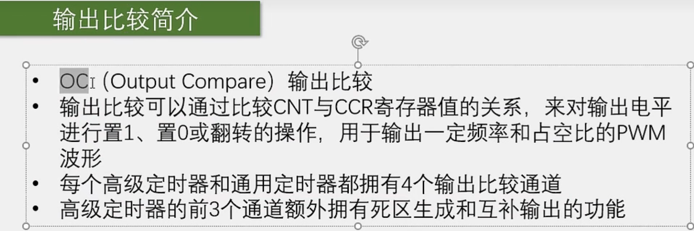

​	OC：输出比较，另外还有IC(Input Capture)意为输入捕获。还有 CC(Capture/Compare),一般表示的是输入捕获和输出比较的单元。


​	输出比较：就是用来输出PWM波形的。那什么是PWM波形呢？

### PWM波形

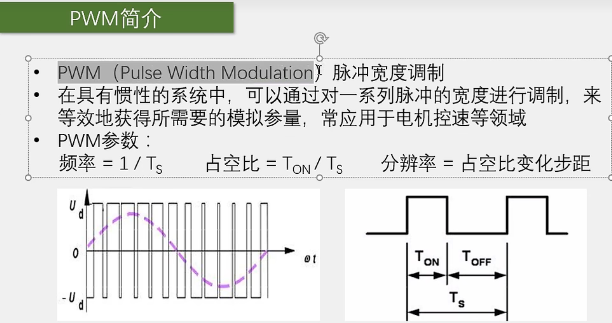

​	使用这个PWM波形，是用来等效地实现以一个模拟信号的输出。

​	例如：LED呼吸灯的效果：

​						我们让LED不断点亮、熄灭、点亮、熄灭。当这个点亮熄灭的频率足够大时，LED就不会闪烁了，而是呈现出一个中等亮度，当我们调控这个点亮和熄灭的时间比例时，就能让LED呈现出不同的亮度级别。

​		对于电机调速也是一样，我们以一个很快的频率，给电机通电、断电、通电、断电，那么电机的速度就能够维持在一个中等速度。这就是PWM的基本思想，看起来也是一个挺简单的方法是吧。


**PWM的秘诀就是：天下武功，唯快不破！**

​		只要我闪的足够快，你就是发现不了我到底是在闪着亮的还是以一个正常的平稳的亮度。


**当然，PWM的应用场景必须要是一个惯性系统**

​		就是说LED在熄灭的时候，由于余晖和人眼视觉暂留现象，LED不会立马熄灭，而是具有一定的惯性，过一小段时间才会熄灭，电机也是，当电机断电时，电机的转动不会立马停止，而是有一定的惯性，过一会才会停。**这样具有惯性的系统，才能使用PWM。**


在使用PWM时，会有几个**重要的参数**：

​	1.频率，它等于1/Ts，Ts就是由下图，代表一个高低电平变换周期的时间。周期的倒数就是频率嘛。PWM的频率越快，那它等效的模拟信号就越平稳，不过同时性能开销就越大。一般来说PWM的频率都在几十k到几十kHz，这个频率就已经足够快了。

​	2.占空比，它等于Ton/Ts，Ton是这里高电平的时间，Ts是一个周期的时间，那Ton/Ts就是高电平时间相当于整个周期时间的比例，一般用百分比来表示。比如占空比为50%，那就是高低电平时间相等的方波。**占空比越大，那等效的模拟电压就越趋近于高电平；占空比越小，那等效的模拟电压就越趋近于低电平。**这个等效关系一般来说是线性的，比如高电平是5v，低电平是0v，那50%占空比就是等效于中间电压，就是2.5v。

​	3.分辨率，它等于占空比变化步距。比如有的占空比只能是1%、2%、3%等这样的以1%的步距跳变，那它的分辨率就是1%，如果可以1.1%、1.2%、1.3%等等这样以0.1%的步距跳变，那它的分辨率就是0.1%。所以这个**分辨率就是占空比变化的精细程度。**这个分辨率需要多高，就得看你实际项目的需求了，如果你既要高频率，又要高分辨率，这就对硬件电路有比较高的要求了，不过一般要求不高的话，1%的分辨率就也已经足够使用了。


那么，定时器的输出比较模块是怎么来输出PWM波形的呢？

### 输出比较通道(通用)

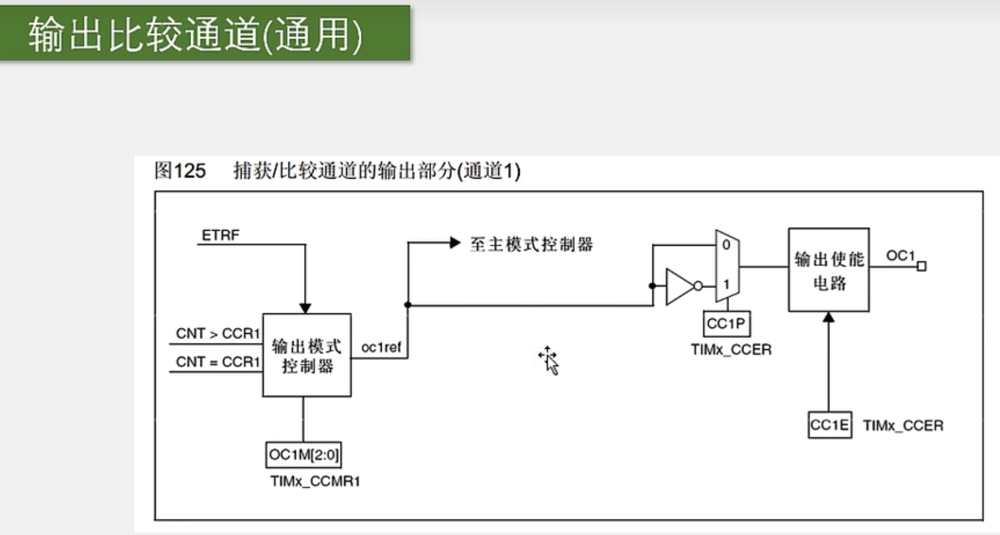

该部分电路对应通用定时器中的：


​		左边就是CNT计数器和CCR1第一路的捕获/比较寄存器，他俩进行比较，当CNT>CCR1，或者CNT=CCR1时，就会给这个输出模式控制器传一个信号，然后输出模式控制器就会改变它输出OC1REF的高低电平。(REF信号实际上就是指这里信号的高低电平，REF是reference的缩写，意思是参考信号)。

​		然后上面这里还有一个ETRF输入，这是定时器的一个小功能，一般不用，不需要了解。


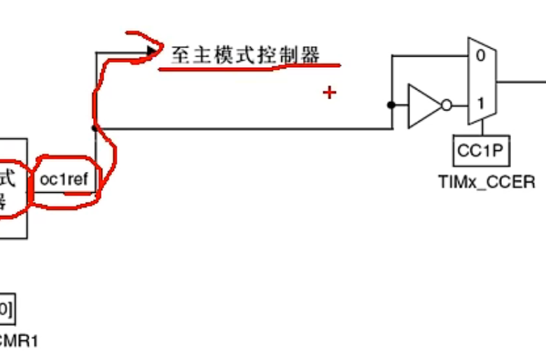

接着这个REF信号可以前往主模式控制器，你可以把这个REF映射到主模式的TRGO输出上去，不过REF的主要去向还是下面这一路：

通过下面这一路到达这里，这是一个极性选择：

​		给这个寄存器写0，信号就会往上走，就是信号电平不翻转，进来啥样，出去还是啥样。

​		给这个寄存器写1，信号就会往下走，就是信号通过一个非门取反，那输出的信号就是输入信号高低电平的反转信号。

这就是极性选择，就是选择是不是要把高低电平反转一下。


那接下来就是输出使能电路了，选择要不要输出，最后就是OC1引脚，这个引脚就是CH1通道的引脚，在引脚定义表里就可以知道具体是哪个GPIO口了。


那现在输出的通路我们就知道了，接下来我们还需要看一下这个输出模式控制器，它具体是怎么工作的，什么时候给REF高电平，什么时候给REF低电平。

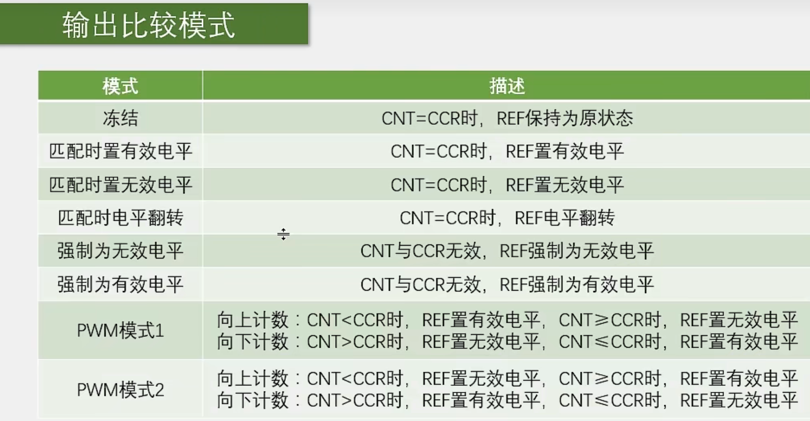

这个模式控制器输入是CNT和CCR的大小关系，输出是REF的高低电平。里面可以选择种模式来更加灵活地控制ERF输出。这个模式可以通过接在模式控制器下面地寄存器来进行配置，你需要哪个模式就可以选哪个模式。


​	模式1：冻结，描述是CNT=CCR时，REF保持为原状态，那其实这个CNT和CCR根本就没有用是吧，所以可以把它理解成CNT和CCR无效，REF保持原来的状态。这个模式也比较简单，它根本不管CNT谁大谁小，直接REF保持不变，维持上一个状态就行了。

​					这有什么用呢？比如你正在输出PWM波，突然想暂停一会儿输出，就可以设置成这个模式。一旦切换为冻结模式后，输出就暂停了，并且高低电平也维持为暂停时刻的状态，保持不变。这就是冻结模式的作用。

​	模式2-4：匹配时置有效电平，匹配时置无效电平，匹配时电平翻转。

​				这个有效电平和无效电平，一般是高级定时器里面的一个说法，是和关断，刹车这些功能配合表述的，它说的比较严谨，所以叫有效电平和无效电平，在这里为了理解方便，你可以直接认为置有效电平就是置高电平，置无效电平就是置低电平，这样就行了。

​					那这三个模式都是当CNT与CCR值相等时，执行操作。

​		模式2：CNT=CCR时，REF置有效电平，也就是高电平。

​		模式3：CNT=CCR时，REF置无效电平，也就是低电平。

​		模式4：CNT=CCR时，REF电平翻转。

这些模式就可以用做波形输出了，比如相等时电平翻转这个模式，这个可以方便地输出一个频率可调，占空比始终为50%地PWM波形。比如你设置成CCR为0，那CNT每次更新清0时，就会产生一次CNT=CCR的事件。这就会导致输出电平翻转一次，每更新两次，输出为一个周期。并且高电平和低电平的时间始终是相等的，也就是占空比始终为50%，当你改变定时器更新频率时，输出波形的频率也会随之改变。他俩的关系是：输出波形的频率=更新频率/2，因为更新两次输出才为一个周期对吧。这就是这个匹配时电平翻转的用途。


那上面这两个相等时置高电平和低电平，感觉用途并不是很大，因为它们都是一次性的，置完高或低电平后，就不管事了。所以这俩模式不适合输出连续变化的波形，如果你想定时输出一个一次性的信号，那可以考虑一下这两个模式。


然后继续看下面这里的两个模式：强制为无效电平和强制为有效电平。

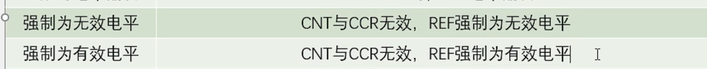

这两个模式是CNT与CCR无效，REF强制为无效电平或者强制为有效电平。这里这两个模式和冻结模式也差不多。如果你想暂停波形输出，并且在暂停期间保持低电平或者高电平，那么就可以设置这两个强制输出模式。


接下里看一下最后两个模式，PWM模式1和PWM模式2.

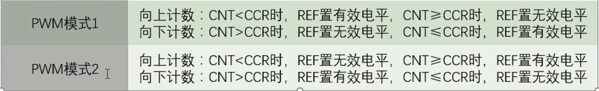

**这俩模式就非常重要了**

它们可以用于输出频率和占空比都可调的PWM波形 ，也是我们主要使用的模式。

​	在PWM模式1，这个情况比较多，一般我们都只使用向上计数，所以这里向下计数的描述我们就暂时不看了，它们之间也只有大小关系、极性这些东西不同，基本思路都是一样的。我们着重分析一个向上计数的就可以了。

​	在PWM模式2下，经过观察可以发现，它的大小比较关系和上面模式1时一样的，区别就是输出的高低电平反过来了，所以PWM模式2实际上就是PWM模式1输出的取反。改变PWM模式1和PWM模式2，就只是改变了REF电平的极性而已。


在此只使用PWM模式1的向上计数即可。

那么在这种模式下是怎么输出频率和占空比都可调的PWM波形的呢？


### PWM基本结构

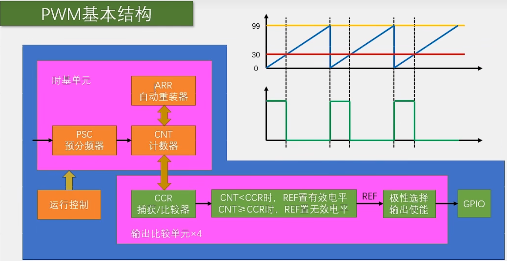

**本节课的重点内容**

下面是对该图的介绍：


首先左上角这里，是时基单元和运行控制部分，再左边是时钟源选择，这里忽略了。这些都是上一小节的内容，在这里还需要继续使用。只不过是这里更新事件的中断申请，我们不再需要了。输出PWM暂时还不需要中断。

​	配置好了时基单元，这里的CNT就可以开始不断地自增运行了。


然后看下面这里，就是输出比较单元了，总共有4路

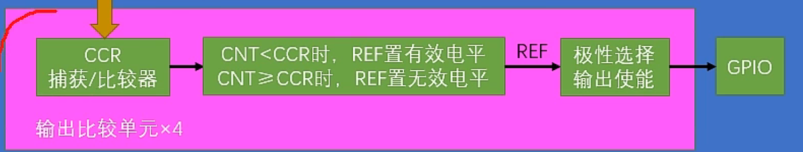

输出比较单元的最开始，是CCR捕获/比较寄存器。CCR是我们自己设定的，CNT不断自增运行，同时它俩还在不断进行比较。

后面这个就是输出模式控制器，在这里就以PWM模式1为例子来讲解：

​		这里面是PWM模式1的执行逻辑。那它是怎么输出PWM波形的呢？我们看一下右上角的这个图：


这里蓝色线是CNT的值，黄色线是ARR的值，蓝色线从0开始自增，一直增到ARR，也就是99，之后清0继续自增。在这个过程中，我们再设置一条红色线，这条红色线就是CCR，比如我们设置CCR为30，之后再执行PWM模式1的逻辑，下面这里的绿色线就是输出，可以看到，在0-30这块，CNT<CCR，所以置高电平，之后，CNT就>=CCR了，所以就变为低电平了。当CNT溢出清0后，CNT又小于CCR，所以置高电平。这样一直持续下去，REF的电平就会不断发生变化，

​		并且，它的占空比是受RCC值得调控的。**如果CCR设置高一些，输出的占空比就变大，CCR设置的低一些，输出的占空比就变小。**

​	下面这里REF，就是一个频率可调，占空比也可调的PWM波形，最后再经过极性选择，输出使能，最终通向GPIO口，这样就能完成PWM波形的输出了。


### PWM参数计算

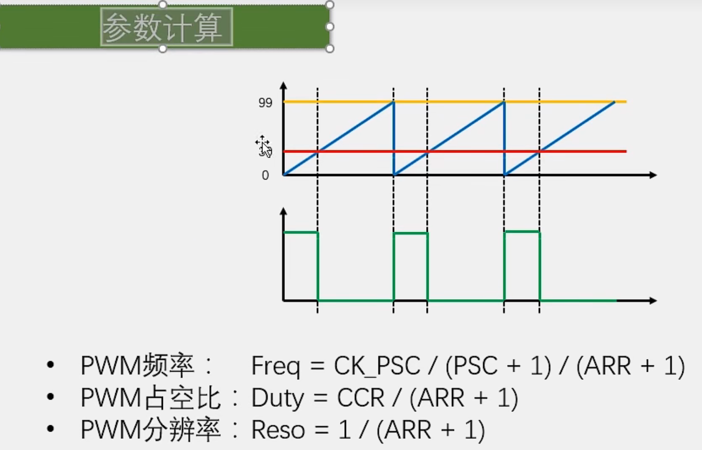

​	1.PWM频率：PWM的一个周期始终对应着计数器的一个溢出更新周期，所以PWM的频率就等于计数器的更新频率。

​	右边的式子CK_PSC/(PSC+1)/(ARR+1)就是计数器的更新频率公式。

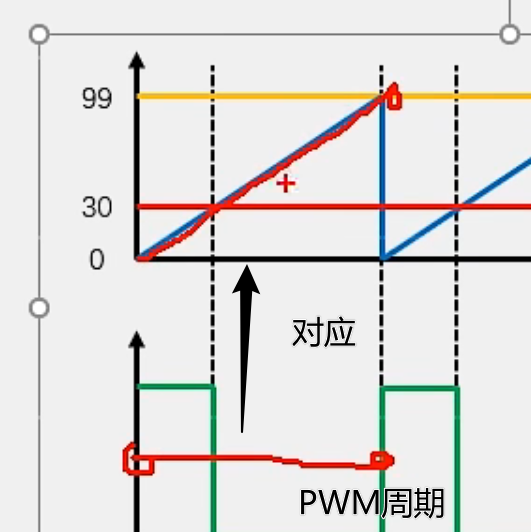

​	2.PWM占空比：Duty = CCR/（ARR+1）

​	3.PWM分辨率：Reso = 1/（ARR+1）


### 输出比较电路(高级)


​	了解即可，不需要掌握。


## PWM程序编写

#### PWM相关函数

```c
void TIM_OC1Init(TIM_TypeDef* TIMx, TIM_OCInitTypeDef* TIM_OCInitStruct);
void TIM_OC2Init(TIM_TypeDef* TIMx, TIM_OCInitTypeDef* TIM_OCInitStruct);
void TIM_OC3Init(TIM_TypeDef* TIMx, TIM_OCInitTypeDef* TIM_OCInitStruct);
void TIM_OC4Init(TIM_TypeDef* TIMx, TIM_OCInitTypeDef* TIM_OCInitStruct);

//函数功能：配置输出比较模块。
//OC1-4，一个函数配置一个单元
//函数参数：1.TIMx	选择定时器	2.	结构体：输出比较的参数
```

```c
void TIM_OCStructInit(TIM_OCInitTypeDef* TIM_OCInitStruct);
//函数功能：用来给输出比较结构体赋一个默认值的
```

```c
void TIM_ForcedOC1Config(TIM_TypeDef* TIMx, uint16_t TIM_ForcedAction);
void TIM_ForcedOC2Config(TIM_TypeDef* TIMx, uint16_t TIM_ForcedAction);
void TIM_ForcedOC3Config(TIM_TypeDef* TIMx, uint16_t TIM_ForcedAction);
void TIM_ForcedOC4Config(TIM_TypeDef* TIMx, uint16_t TIM_ForcedAction);

//函数功能：用来配置强制输出模式的，如果你在运行中想要暂停输出波形并且强制输出高或低电平，可以用一下这个函数
```

```c
void TIM_OC1PreloadConfig(TIM_TypeDef* TIMx, uint16_t TIM_OCPreload);
void TIM_OC2PreloadConfig(TIM_TypeDef* TIMx, uint16_t TIM_OCPreload);
void TIM_OC3PreloadConfig(TIM_TypeDef* TIMx, uint16_t TIM_OCPreload);
void TIM_OC4PreloadConfig(TIM_TypeDef* TIMx, uint16_t TIM_OCPreload);

//函数功能：用来配置CCR寄存器的预装功能，这个预装功能，就是影子寄存器，之前介绍过就是立马生效还是下一更新事件生效。
```

```c
void TIM_OC1FastConfig(TIM_TypeDef* TIMx, uint16_t TIM_OCFast);
void TIM_OC2FastConfig(TIM_TypeDef* TIMx, uint16_t TIM_OCFast);
void TIM_OC3FastConfig(TIM_TypeDef* TIMx, uint16_t TIM_OCFast);
void TIM_OC4FastConfig(TIM_TypeDef* TIMx, uint16_t TIM_OCFast);
//函数功能：用来配置快速使能的，这个功能手册里，单脉冲模式，那一节有一小段介绍，用的不多，不需要掌握。
```

```c
void TIM_ClearOC1Ref(TIM_TypeDef* TIMx, uint16_t TIM_OCClear);
void TIM_ClearOC2Ref(TIM_TypeDef* TIMx, uint16_t TIM_OCClear);
void TIM_ClearOC3Ref(TIM_TypeDef* TIMx, uint16_t TIM_OCClear);
void TIM_ClearOC4Ref(TIM_TypeDef* TIMx, uint16_t TIM_OCClear);
//函数功能：外部事件时清除REF信号，也不需要掌握
```

```c
void TIM_OC1PolarityConfig(TIM_TypeDef* TIMx, uint16_t TIM_OCPolarity);
void TIM_OC1NPolarityConfig(TIM_TypeDef* TIMx, uint16_t TIM_OCNPolarity);
void TIM_OC2PolarityConfig(TIM_TypeDef* TIMx, uint16_t TIM_OCPolarity);
void TIM_OC2NPolarityConfig(TIM_TypeDef* TIMx, uint16_t TIM_OCNPolarity);
void TIM_OC3PolarityConfig(TIM_TypeDef* TIMx, uint16_t TIM_OCPolarity);
void TIM_OC3NPolarityConfig(TIM_TypeDef* TIMx, uint16_t TIM_OCNPolarity);
void TIM_OC4PolarityConfig(TIM_TypeDef* TIMx, uint16_t TIM_OCPolarity);

//这些就是用来单独设置输出比较的极性的，带个N的就是高级定时器里互补通道的配置，OC4没有互补通道，所以就没有OC4N的函数 
```

```c
void TIM_CCxCmd(TIM_TypeDef* TIMx, uint16_t TIM_Channel, uint16_t TIM_CCx);
void TIM_CCxNCmd(TIM_TypeDef* TIMx, uint16_t TIM_Channel, uint16_t TIM_CCxN);
//函数功能：用来单独修改输出使能参数的
```

```c
void TIM_SelectOCxM(TIM_TypeDef* TIMx, uint16_t TIM_Channel, uint16_t TIM_OCMode);
//函数功能：用来单独更改输出比较模式的函数
```

```c
void TIM_SetCompare1(TIM_TypeDef* TIMx, uint16_t Compare1);
void TIM_SetCompare2(TIM_TypeDef* TIMx, uint16_t Compare2);
void TIM_SetCompare3(TIM_TypeDef* TIMx, uint16_t Compare3);
void TIM_SetCompare4(TIM_TypeDef* TIMx, uint16_t Compare4);

//函数功能：用来单独更改CCR寄存器值的函数。
//这四个函数比较重要，我们在运行得时候，更改占空比，就需要用到这四个函数。
```


#### PWM初始化

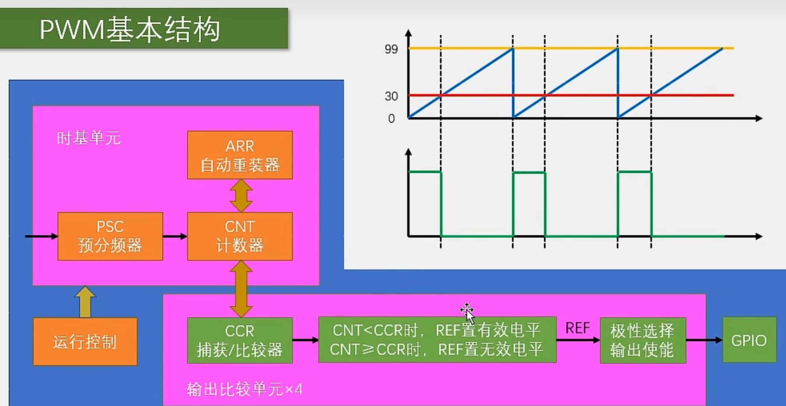

根据上面的PWM图进行PWM的初始化。

**具体步骤：**

​	1.RCC开启时钟，把我们要用的TIM外设和GPIO外设的时钟打开。

​	2.配置时基单元，包括这前面的时钟源选择。

​	3.配置输出比较单元，里面包括CCR的值，输出比较模式，极性选择，输出使能这些参数。

​	4.配置GPIO，把PWM对应的GPIO口，初始化为复用推挽输出的配置。

​	（这个PWM和GPIO的对应关系是怎样的呢？可以参考一下GPIO引脚定义表。）

​	5.运行控制，启动计数器，这样就能输出PWM了。


## 舵机

#### 介绍

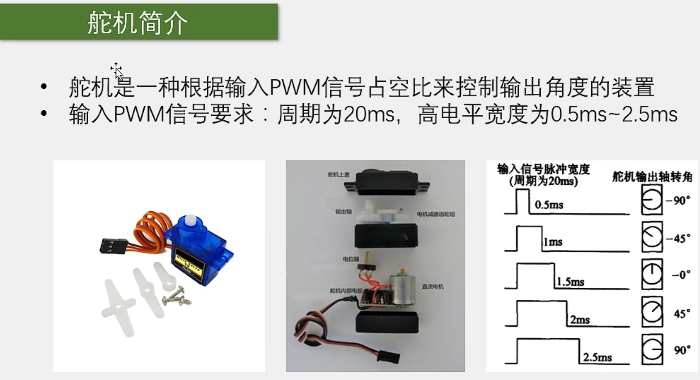

​	SG90

**输入一个PWM波形，输出轴固定在一个角度。**

这里，PWM波形其实是当作一个通信协议来使用的，跟之前提到的用PWM等效一个模拟输出，关系不大。


#### 硬件电路

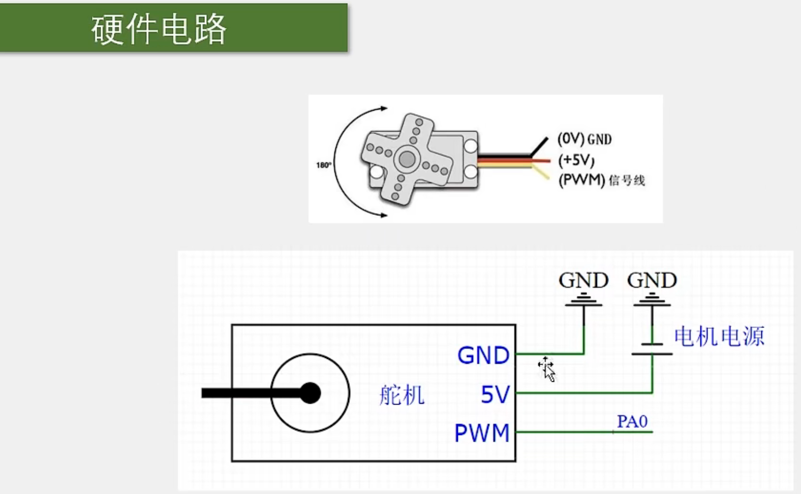


### 直流电机

#### 介绍

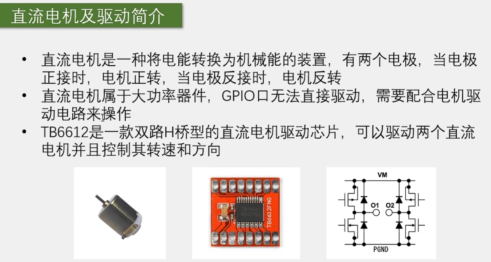

​	就是马达。


​	下面是驱动芯片TB6612的硬件电路：
#### 硬件电路


# 【6-4】流水灯&舵机电机驱动

## LED流水灯

### 接线图

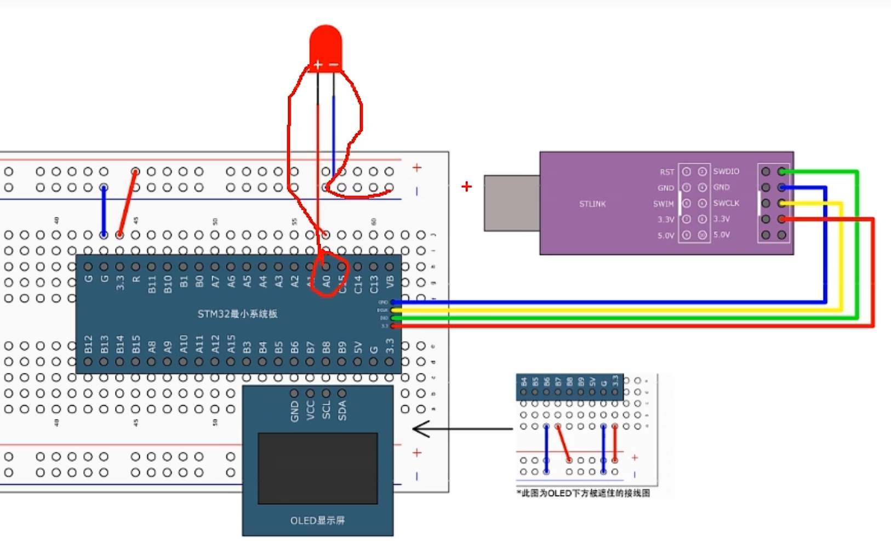


### 程序部分

**PWM.h**

```c
#ifndef __PWM_H
#define __PWM_H

void PWM_Init(void);
void PWM_SetCompare1(uint16_t Compare);
#endif

```


**PWM.c**

```c
#include "stm32f10x.h"                  // Device header

void PWM_Init(void)
{
	/*------下面是复用端口为PA15的部分-----
	//初始化AFIO：用于复用端口
	RCC_APB2PeriphClockCmd(RCC_APB2Periph_AFIO, ENABLE);		//开启AFIO的时钟
	
	//引脚重映射配置
	//将PA0的TIM2复用到PA15上
	GPIO_PinRemapConfig(GPIO_PartialRemap1_TIM2,ENABLE);
	//关闭PA15的调试端口复用功能
	GPIO_PinRemapConfig(GPIO_Remap_SWJ_JTAGDisable,ENABLE);
	注意：下面的GPIO初始化结构体中也要改为初始化PA15口
	*/
	
		/*开启时钟*/
	RCC_APB2PeriphClockCmd(RCC_APB2Periph_GPIOA, ENABLE);		//开启GPIOA的时钟
	
	/*GPIO初始化*/
	GPIO_InitTypeDef GPIO_InitStructure;
	GPIO_InitStructure.GPIO_Mode = GPIO_Mode_AF_PP;//复用推挽输出模式，引脚控制权交给了片上外设(定时器)
	GPIO_InitStructure.GPIO_Pin = GPIO_Pin_0;
	GPIO_InitStructure.GPIO_Speed = GPIO_Speed_50MHz;
	GPIO_Init(GPIOA, &GPIO_InitStructure);						//将PA1和PA2引脚初始化为推挽输出
	
	/*设置GPIO初始化后的默认电平*/
	GPIO_SetBits(GPIOA, GPIO_Pin_1 | GPIO_Pin_2);				//设置PA1和PA2引脚为高电平
	
	
	
	//RCC开启时钟
	//要使用APB1的开启时钟函数，因为TIM2是APB1总线的外设
	RCC_APB1PeriphClockCmd(RCC_APB1Periph_TIM2,ENABLE);
	
	//选择时基单元的时钟，这里选择内部时钟
	TIM_InternalClockConfig(TIM2);
	
	//配置结构体用于初始化时基单元
	TIM_TimeBaseInitTypeDef TIM_TimeBaseInitStruct;//创建结构体
	TIM_TimeBaseInitStruct.TIM_ClockDivision = TIM_CKD_DIV1;//配置滤波器分频参数，这里选择不分频由内部时钟分频
	TIM_TimeBaseInitStruct.TIM_CounterMode = TIM_CounterMode_Up;//选择计数模式，这里选择向上计数
	TIM_TimeBaseInitStruct.TIM_Period = 100 - 1;//周期，就是ARR自动重装器的值
	TIM_TimeBaseInitStruct.TIM_Prescaler = 720 - 1;//就是PSC预分频器的值
	//因为预分频器和计数器都有1一个数的偏差，所以这里要再减个1
	//注意PSC和ARR的取值都要在0-65535之间，不要超范围了。
	//这里我们预分频是对72M进行7200分频，得到的就是10k的计数频率，在10k的频率下，计10000个数，就是1s的时间
	//计算定时器定时时间的公式：CK_CNT_OV = CK_PSC / (PSC + 1) / (ARR + 1)，单位是频率，取倒数就是定时时间
	TIM_TimeBaseInitStruct.TIM_RepetitionCounter = 0;//就是重复计数器的值，是高级定时器才有的，这里不需要用给0就行
	//初始化时基单元
	TIM_TimeBaseInit(TIM2,&TIM_TimeBaseInitStruct); 
	
	TIM_OCInitTypeDef TIM_OCInitStruct;//创建结构体用于输出比较的初始化
	
	TIM_OCStructInit(&TIM_OCInitStruct);//给结构体赋初值
	//(这样不需要用到的结构体的变量也有相应的初值，就不会出错了)
	
	TIM_OCInitStruct.TIM_OCMode = TIM_OCMode_PWM1;//设置输出比较的模式
	TIM_OCInitStruct.TIM_OCPolarity = TIM_OCPolarity_High;//设置输出比较的极性
	TIM_OCInitStruct.TIM_OutputState = TIM_OutputState_Enable;//设置输出使能
	TIM_OCInitStruct.TIM_Pulse = 10;//直译：脉冲，设置CCR(比较值，CCR比较寄存器)
	
	
	//初始化输出比较单元
	TIM_OC1Init(TIM2,&TIM_OCInitStruct);
	
	//启动定时器
	TIM_Cmd(TIM2,ENABLE);
}


void PWM_SetCompare1(uint16_t Compare)
{
	TIM_SetCompare1(TIM2,Compare);
}

```

**main.c**

```c
#include "stm32f10x.h"                  // Device header
#include "Delay.h"
#include "OLED.h"
#include "PWM.h"

uint8_t i;
int main(void)
{
	OLED_Init();
	PWM_Init();
	while (1)
	{
		for(i = 0;i<=100;i++)
		{
			PWM_SetCompare1(i);
			Delay_ms(10);
		}
		for(i = 0;i<=100;i++)
		{
			PWM_SetCompare1(100 - i);
			Delay_ms(10);
		}
	}
}

```


## PWM驱动舵机

### 接线图

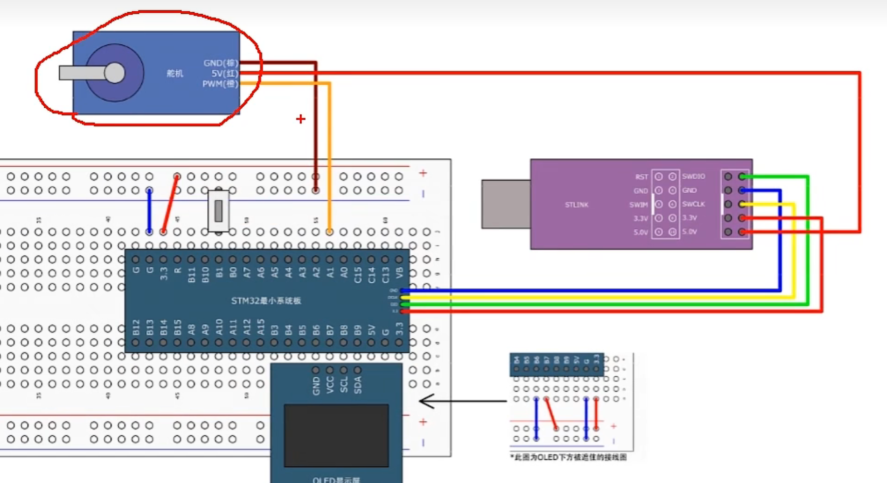


### 程序实例

**PWM.h**

```c
#ifndef __PWM_H
#define __PWM_H

void PWM_Init(void);
void PWM_SetCompare2(uint16_t Compare);
#endif

```


**PWM.c**

```c
#include "stm32f10x.h"                  // Device header

void PWM_Init(void)
{
	/*------下面是复用端口为PA15的部分-----
	//初始化AFIO：用于复用端口
	RCC_APB2PeriphClockCmd(RCC_APB2Periph_AFIO, ENABLE);		//开启AFIO的时钟
	
	//引脚重映射配置
	//将PA0的TIM2复用到PA15上
	GPIO_PinRemapConfig(GPIO_PartialRemap1_TIM2,ENABLE);
	//关闭PA15的调试端口复用功能
	GPIO_PinRemapConfig(GPIO_Remap_SWJ_JTAGDisable,ENABLE);
	注意：下面的GPIO初始化结构体中也要改为初始化PA15口
	*/
	
		/*开启时钟*/
	RCC_APB2PeriphClockCmd(RCC_APB2Periph_GPIOA, ENABLE);		//开启GPIOA的时钟
	
	/*GPIO初始化*/
	GPIO_InitTypeDef GPIO_InitStructure;
	GPIO_InitStructure.GPIO_Mode = GPIO_Mode_AF_PP;//复用推挽输出模式，引脚控制权交给了片上外设(定时器)
	GPIO_InitStructure.GPIO_Pin = GPIO_Pin_1;
	GPIO_InitStructure.GPIO_Speed = GPIO_Speed_50MHz;
	GPIO_Init(GPIOA, &GPIO_InitStructure);						//将PA1和PA2引脚初始化为推挽输出
	
	/*设置GPIO初始化后的默认电平*/
	GPIO_SetBits(GPIOA, GPIO_Pin_1);				//设置PA1和PA2引脚为高电平
	
	
	
	//RCC开启时钟
	//要使用APB1的开启时钟函数，因为TIM2是APB1总线的外设
	RCC_APB1PeriphClockCmd(RCC_APB1Periph_TIM2,ENABLE);
	
	//选择时基单元的时钟，这里选择内部时钟
	TIM_InternalClockConfig(TIM2);
	
	//配置结构体用于初始化时基单元
	TIM_TimeBaseInitTypeDef TIM_TimeBaseInitStruct;//创建结构体
	TIM_TimeBaseInitStruct.TIM_ClockDivision = TIM_CKD_DIV1;//配置滤波器分频参数，这里选择不分频由内部时钟分频
	TIM_TimeBaseInitStruct.TIM_CounterMode = TIM_CounterMode_Up;//选择计数模式，这里选择向上计数
	TIM_TimeBaseInitStruct.TIM_Period = 20000 - 1;//周期，就是ARR自动重装器的值
	TIM_TimeBaseInitStruct.TIM_Prescaler = 72 - 1;//就是PSC预分频器的值
	//因为预分频器和计数器都有1一个数的偏差，所以这里要再减个1
	//注意PSC和ARR的取值都要在0-65535之间，不要超范围了。
	//这里我们预分频是对72M进行7200分频，得到的就是10k的计数频率，在10k的频率下，计10000个数，就是1s的时间
	//计算定时器定时时间的公式：CK_CNT_OV = CK_PSC / (PSC + 1) / (ARR + 1)，单位是频率，取倒数就是定时时间
	TIM_TimeBaseInitStruct.TIM_RepetitionCounter = 0;//就是重复计数器的值，是高级定时器才有的，这里不需要用给0就行
	//初始化时基单元
	TIM_TimeBaseInit(TIM2,&TIM_TimeBaseInitStruct); 
	
	TIM_OCInitTypeDef TIM_OCInitStruct;//创建结构体用于输出比较的初始化
	
	TIM_OCStructInit(&TIM_OCInitStruct);//给结构体赋初值
	//(这样不需要用到的结构体的变量也有相应的初值，就不会出错了)
	
	TIM_OCInitStruct.TIM_OCMode = TIM_OCMode_PWM1;//设置输出比较的模式
	TIM_OCInitStruct.TIM_OCPolarity = TIM_OCPolarity_High;//设置输出比较的极性
	TIM_OCInitStruct.TIM_OutputState = TIM_OutputState_Enable;//设置输出使能
	TIM_OCInitStruct.TIM_Pulse = 0;//直译：脉冲，设置CCR(比较值，CCR比较寄存器)
	
	
	//初始化输出比较单元
	TIM_OC2Init(TIM2,&TIM_OCInitStruct);
	
	//启动定时器
	TIM_Cmd(TIM2,ENABLE);
}


void PWM_SetCompare2(uint16_t Compare)
{
	TIM_SetCompare2(TIM2,Compare);
}

```


**Servo.h**

```c
#ifndef __SERVO_H
#define __SERVO_H
void Servo_Init(void);
void Servo_SetAngle(float Angle);
#endif

```


**Servo.c**

```c
#include "stm32f10x.h"                  // Device header
#include "PWM.h"

//舵机初始化函数
void Servo_Init(void)
{
	PWM_Init();
}


//设置舵机角度函数，Angle范围0-180
void Servo_SetAngle(float Angle)
{
	PWM_SetCompare2(Angle / 180 * 2000 + 500);
}

```


**main.c**

```c
#include "stm32f10x.h"                  // Device header
#include "Delay.h"
#include "OLED.h"
#include "Servo.h"
#include "Key.h"

uint8_t KeyNum;
float Angle;
int main(void)
{
	OLED_Init();
	Servo_Init();
	Key_Init();
	OLED_ShowString(1,1,"Angle:");
	while (1)
	{
		KeyNum = Key_GetNum();
		if(KeyNum == 1)
		{
			Angle += 30;
			if(Angle > 180)
				Angle = 0;			
		}
		Servo_SetAngle(Angle);
		OLED_ShowNum(1,7,Angle,3);
	}
}

```


## PWM驱动直流电机

### 接线图

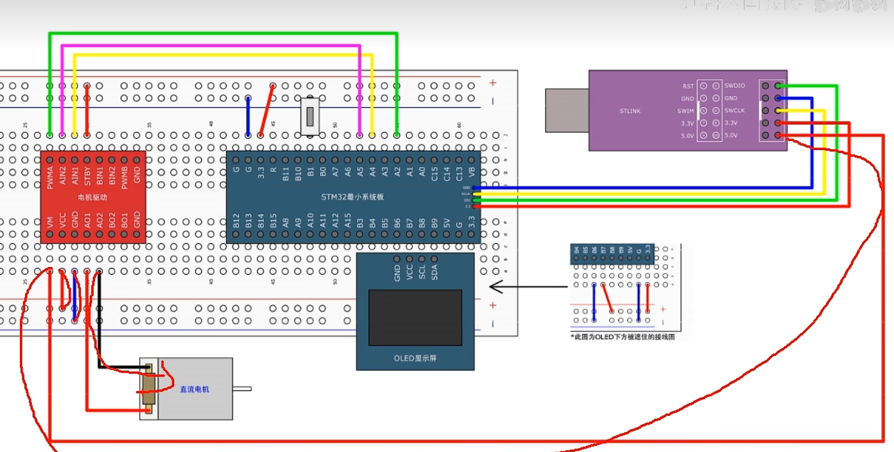


### 程序实例

**PWM.h**

```c
#ifndef __PWM_H
#define __PWM_H

void PWM_Init(void);
void PWM_SetCompare3(uint16_t Compare);
#endif

```

**PWM.c**

```c
#include "stm32f10x.h"                  // Device header

void PWM_Init(void)
{
	/*------下面是复用端口为PA15的部分-----
	//初始化AFIO：用于复用端口
	RCC_APB2PeriphClockCmd(RCC_APB2Periph_AFIO, ENABLE);		//开启AFIO的时钟
	
	//引脚重映射配置
	//将PA0的TIM2复用到PA15上
	GPIO_PinRemapConfig(GPIO_PartialRemap1_TIM2,ENABLE);
	//关闭PA15的调试端口复用功能
	GPIO_PinRemapConfig(GPIO_Remap_SWJ_JTAGDisable,ENABLE);
	注意：下面的GPIO初始化结构体中也要改为初始化PA15口
	*/
	
		/*开启时钟*/
	RCC_APB2PeriphClockCmd(RCC_APB2Periph_GPIOA, ENABLE);		//开启GPIOA的时钟
	
	/*GPIO初始化*/
	GPIO_InitTypeDef GPIO_InitStructure;
	GPIO_InitStructure.GPIO_Mode = GPIO_Mode_AF_PP;//复用推挽输出模式，引脚控制权交给了片上外设(定时器)
	GPIO_InitStructure.GPIO_Pin = GPIO_Pin_2;
	GPIO_InitStructure.GPIO_Speed = GPIO_Speed_50MHz;
	GPIO_Init(GPIOA, &GPIO_InitStructure);						//将PA1和PA2引脚初始化为推挽输出
	
	/*设置GPIO初始化后的默认电平*/
	GPIO_SetBits(GPIOA, GPIO_Pin_1 | GPIO_Pin_2);				//设置PA1和PA2引脚为高电平
	
	
	
	//RCC开启时钟
	//要使用APB1的开启时钟函数，因为TIM2是APB1总线的外设
	RCC_APB1PeriphClockCmd(RCC_APB1Periph_TIM2,ENABLE);
	
	//选择时基单元的时钟，这里选择内部时钟
	TIM_InternalClockConfig(TIM2);
	
	//配置结构体用于初始化时基单元
	TIM_TimeBaseInitTypeDef TIM_TimeBaseInitStruct;//创建结构体
	TIM_TimeBaseInitStruct.TIM_ClockDivision = TIM_CKD_DIV1;//配置滤波器分频参数，这里选择不分频由内部时钟分频
	TIM_TimeBaseInitStruct.TIM_CounterMode = TIM_CounterMode_Up;//选择计数模式，这里选择向上计数
	TIM_TimeBaseInitStruct.TIM_Period = 100 - 1;//周期，就是ARR自动重装器的值
	TIM_TimeBaseInitStruct.TIM_Prescaler = 36 - 1;//就是PSC预分频器的值
	//因为预分频器和计数器都有1一个数的偏差，所以这里要再减个1
	//注意PSC和ARR的取值都要在0-65535之间，不要超范围了。
	//这里我们预分频是对72M进行7200分频，得到的就是10k的计数频率，在10k的频率下，计10000个数，就是1s的时间
	//计算定时器定时时间的公式：CK_CNT_OV = CK_PSC / (PSC + 1) / (ARR + 1)，单位是频率，取倒数就是定时时间
	TIM_TimeBaseInitStruct.TIM_RepetitionCounter = 0;//就是重复计数器的值，是高级定时器才有的，这里不需要用给0就行
	//初始化时基单元
	TIM_TimeBaseInit(TIM2,&TIM_TimeBaseInitStruct); 
	
	TIM_OCInitTypeDef TIM_OCInitStruct;//创建结构体用于输出比较的初始化
	
	TIM_OCStructInit(&TIM_OCInitStruct);//给结构体赋初值
	//(这样不需要用到的结构体的变量也有相应的初值，就不会出错了)
	
	TIM_OCInitStruct.TIM_OCMode = TIM_OCMode_PWM1;//设置输出比较的模式
	TIM_OCInitStruct.TIM_OCPolarity = TIM_OCPolarity_High;//设置输出比较的极性
	TIM_OCInitStruct.TIM_OutputState = TIM_OutputState_Enable;//设置输出使能
	TIM_OCInitStruct.TIM_Pulse = 10;//直译：脉冲，设置CCR(比较值，CCR比较寄存器)
	
	
	//初始化输出比较单元
	TIM_OC3Init(TIM2,&TIM_OCInitStruct);
	
	//启动定时器
	TIM_Cmd(TIM2,ENABLE);
}

//设置占空比
void PWM_SetCompare3(uint16_t Compare)
{
	TIM_SetCompare3(TIM2,Compare);
}

```

**Motor.h**

```c
#ifndef __MOTOR_H
#define __MOTOR_H

void Motor_Init(void);
void Motor_SetSpeed(int8_t Speed);


#endif

```

**Motor.c**

```c
#include "stm32f10x.h"                  // Device header
#include "PWM.h"


//直流电机初始化
void Motor_Init(void)
{
		/*开启时钟*/
	RCC_APB2PeriphClockCmd(RCC_APB2Periph_GPIOA, ENABLE);		//开启GPIOA的时钟
	
	/*GPIO初始化*/
	GPIO_InitTypeDef GPIO_InitStructure;
	GPIO_InitStructure.GPIO_Mode = GPIO_Mode_Out_PP;
	GPIO_InitStructure.GPIO_Pin = GPIO_Pin_4 | GPIO_Pin_5;//用于电机方向控制
	GPIO_InitStructure.GPIO_Speed = GPIO_Speed_50MHz;
	GPIO_Init(GPIOA, &GPIO_InitStructure);						//将PA1和PA2引脚初始化为推挽输出
	
	
	
	PWM_Init();
}


void Motor_SetSpeed(int8_t Speed)
{
	if(Speed >= 0)
	{
		GPIO_SetBits(GPIOA,GPIO_Pin_4);
		GPIO_ResetBits(GPIOA,GPIO_Pin_5);
		PWM_SetCompare3(Speed);
	}
	else
	{
		GPIO_ResetBits(GPIOA,GPIO_Pin_4);
		GPIO_SetBits(GPIOA,GPIO_Pin_5);
		PWM_SetCompare3(-Speed);
	}
}

```

**main.c**

```c
#include "stm32f10x.h"                  // Device header
#include "Delay.h"
#include "OLED.h"
#include "Motor.h"
#include "Key.h"

uint8_t KeyNum;
int8_t Speed;

int main(void)
{
	OLED_Init();
	Motor_Init();
	Key_Init();
	OLED_ShowString(1,1,"Speed:");
	
	while (1)
	{
		KeyNum = Key_GetNum();
		if(KeyNum == 1)
		{
			Speed += 20;
			if(Speed > 100)
				Speed = -100;
		}
		Motor_SetSpeed(Speed);
		OLED_ShowSignedNum(1,7,Speed,3);
	}
}

```


# 【6-5】TIM输入捕获

## 概念


功能:就是输入引脚电平跳变的瞬间,把CNT的值写入到CCR中


**输入捕获和输出比较的区别**

​	输出比较,引脚是输出端口;

​	输入捕获,引脚是输入端口;


​	输出比较,是根据CNT和CCR大小关系来执行输出动作;

​	输入捕获,是接收到输入信号,执行CNT锁存到CCR的动作;


PS:

​	脉冲间隔:实际上和频率是差不多的意思

​	电平持续时间:和占空比差不多


测量这两个功能结合起来,测量频率占空比就是硬件全自动执行,软件不需要进行任何干预,也不需要进中断,需要测量的时候,直接读取CCR寄存器就行了,极大地减轻了软件的压力.


## 频率测量

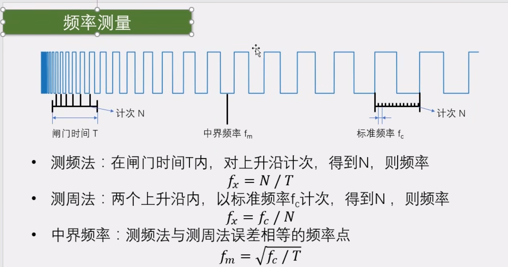


​	1.STM32只能测量数字信号的频率.如果你想测量一个正弦波,那还需要搭建一个信号预处理电路.最简单的就是用运放搭一个比较器,把正弦波转换为数字信号,然后再输入给STM32就行了.如果你测的信号电压非常高,那还需要考虑一下隔离的问题,比如用隔离放大器等元件,隔离高压端和低压端,保证安全.

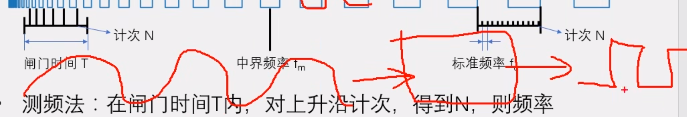


​	2.测频法和测周法都是测量频率的好方法,那么如何选择呢?

​			首先:测频法适合测量高频信号,测周法适合测量低频信号.

​		那么,多高频率算高,多低频率算低呢?

​			中界频率:测频法与测周法误差相等的频率点.

​					当待测信号频率小于中界频率时,测周法误差更小,选用测周法更合适.

​					当待测信号频率大于中界频率时,测频法误差更小,选用测频法更合适.


### 测频法

​	我们用之前学过的外设就可以实现:

​		对射式红外传感器计次,定时器外部时钟,这些代码,稍加改进就是测频法.

​				比如说:

​							对射式红外传感器计次,每来一个上升沿计次+1,那我们再用一个定时器,定1s的定时中断,在中断里,每隔1s取一下计次值,同时清0计次,为下一次做准备.这样每次读取的计次值就直接时频率.


## 测周法


### 输入捕获电路


**Part1**

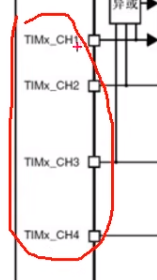

最左边,是四个通道的引脚,参考引脚定义表,就能知道这个引脚是复用在了哪个位置.


然后引脚进来.这里有个三输入的异或门.这个异或门的输入接在了通道123端口,异或门的执行逻辑:当三个输入引脚的任何一个有电平翻转时,输出引脚就产生一次电平翻转.之后输出通过数据选择器,到达输入捕获通道1


数据选择器如果选择上面一个,那输入捕获通道1的输入,就是三个引脚的异或值.如果选择下面一个,那异或门就没有用,4个通道各用各的引脚.

**异或门总结:相同出0,不同出1**

设计这个异或门,其实还是为三项无刷电机服务的.无刷电机有3个霍尔传感器检测转子的位置,可以根据转子的位置进行换相.有了这个异或门,就可以在前三个通道接上无刷电机的霍尔传感器,然后这个定时器就作为无刷电机的接口定时器,去驱动换相电路工作.


**Part2**

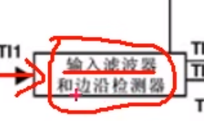

输入信号过来,来到了输入滤波器和边沿检测器.

​		输入滤波器可以对信号进行滤波,避免一些高频的毛刺信号和误触发.

​		边沿检测器,就和外部中断那里是一样的了,可以选择高电平触发或者低电平触发,当出现指定的电平跳变时,边沿检测电路就会触发后电路执行操作.


另外这里,

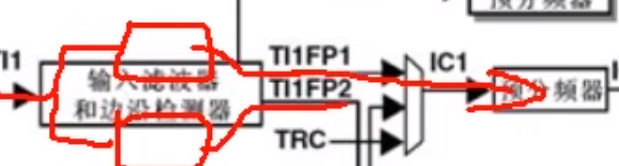

它其实是有两套滤波和边沿检测电路的,

​	第一套得到TI1FP1,输入给通道1的后续电路

​	第二套得到TI1FP2,输入给下面通道2的后续电路.


同理,下面


TI2信号进来,也经过两套滤波和极性选择

​		得到TI2FP1,输入给上面

​		和TI2FP2,输入给下面.


在这里,两个信号进来,可以选择各走各的,也可以选择交叉,让CH2引脚输入给通道1,或者CH1引脚输入给通道2.


那为什么要这样做呢??

​	第一:可以灵活切换后续捕获电路的输入

​	第二(主要):可以把一个引脚的输入,同时映射到两个捕获单元,这也是PWMI模式的经典结构:

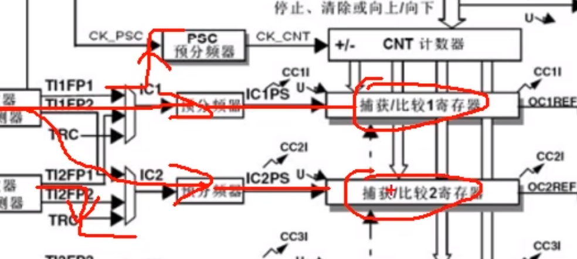


​		第一个通道,使用上升沿触发,用来捕获周期,

​		第二个通道,使用下降沿触发,用来捕获占空比

​		两个通道同时使用一个通道进行捕获,就可以同时测量频率和占空比.


另外,这里还有一个TRC信号:


也可以选择作为捕获部分的输入,这个TRC信号也是为了无刷电机的驱动的,在此仅作了解.


**Part3**

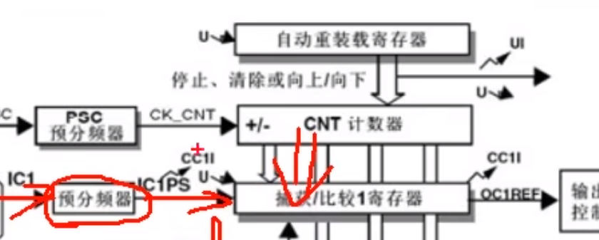

输入信号进行滤波和极性选择后,就来到了预分频器,可以选择对前面的信号进行分频.分频之后的触发信号,就可以触发捕获电路进行工作了.每来一个触发信号,CNT的值就会向CCR转运一次.这就是整个电路部分了.

​		转运的同时会发生一个捕获事件.这个事件会在状态寄存器置标志位,同时也可以产生中断如果需要在捕获的瞬间,处理一些事情的话,就可以开启这个捕获中断

电路运转例如:

​		我们可以配置上升沿触发捕获,梅来一个上升沿,CNT转运到CCR一次.又因为这个CNT计数器是由内部的标准时钟驱动的,所以CNT的舒适,其实就可以用来记录两个上升沿之间的时间间隔,这个时间间隔就是周期,再取个倒数,就是测周法的频率了.

PS:细节问题:每次捕获后,我们都要把CNT清0一下.


## 输入捕获通道电路框图

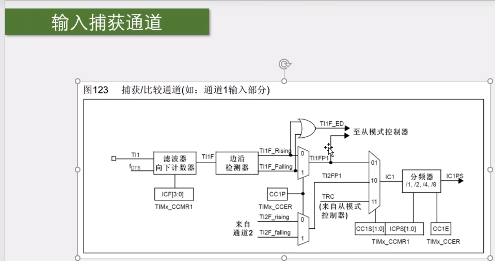


## 主从触发模式


主从触发模式:主模式,从模式以及触发源选择这三个功能的简称.

​	主模式可以将定时器内部的信号,映射到TRGO引脚,用于触发别的外设,所以这部分叫做主模式.

​	 从模式就是接收其他外设或者自身外设的一些信号,用于控制自身定时器的运行,也就是被别的信号控制,所以这部分叫从模式,

​	触发源选择,就是选择从模式的触发信号源的,可以认为他是从模式的一部分.触发源选择,选择指定的一个信号,得到TRGI,TRGI去触发从模式,从模式可以在右边绿色的列表里,选择一项操作来自动执行.


那么,如果向完成我们刚才说的任务:让TI1FP1信号自动触发CNT自动清0

​	触发源选择,就可以选择这里的TI1FP1,从模式执行的操作,就可以选择执行Reset的操作.这样,TI1FP1的信号就可以自动触发从模式,从模式自动清0CNT,实现硬件全自动测量了.


## 开启图

### 输入捕获基本结构


注意事项:

​	1.CNT计数值有上限,ARR一般设置为最大65535,那CNT最大也只能计数65535,如果信号频率太低,CNT计数值可能会溢出.

​	2.从模式的触发源选择只有TI1FP1和TI2FP2,没有TI3和TI4的信号,所以这里如果想选择从模式自动清零CNT,对于通道3和通道4,就只能开启捕获中断,在中断里手动清零了.不过这样,程序就会处于频繁中断的状态,比较消耗软件资源,这个得注意一下


### PWMI基本结构


# 【6-6】输入捕获测频率&PWMI测频率占空比

## 相关库函数

```c
void TIM_ICInit(TIM_TypeDef* TIMx, TIM_ICInitTypeDef* TIM_ICInitStruct);
//函数功能 用结构体配置输入捕获单元的函数,单一的配置一个通道
```

```c
void TIM_PWMIConfig(TIM_TypeDef* TIMx, TIM_ICInitTypeDef* TIM_ICInitStruct);
//函数功能 初始化输入捕获单元,快速配置两个通道,配置为PWMI模式
```

```c
void TIM_ICStructInit(TIM_ICInitTypeDef* TIM_ICInitStruct);
//函数功能: 可以给输入捕获结构体赋一个初始值
```

```c
void TIM_SelectInputTrigger(TIM_TypeDef* TIMx, uint16_t TIM_InputTriggerSource);
//函数功能: 选择输入触发源TRGI,即是从模式的触发源选择,调用这个函数就能选择从模式的触发源了
```

```c
void TIM_SelectOutputTrigger(TIM_TypeDef* TIMx, uint16_t TIM_TRGOSource);
//函数功能: 选择主模式的触发源
```

```c
void TIM_SelectSlaveMode(TIM_TypeDef* TIMx, uint16_t TIM_SlaveMode);
//函数功能: 选择从模式
```

```c
void TIM_SetIC1Prescaler(TIM_TypeDef* TIMx, uint16_t TIM_ICPSC);
void TIM_SetIC2Prescaler(TIM_TypeDef* TIMx, uint16_t TIM_ICPSC);
void TIM_SetIC3Prescaler(TIM_TypeDef* TIMx, uint16_t TIM_ICPSC);
void TIM_SetIC4Prescaler(TIM_TypeDef* TIMx, uint16_t TIM_ICPSC);
//函数功能: 分别单独配置通道1234的分频器
```

```c
uint16_t TIM_GetCapture1(TIM_TypeDef* TIMx);
uint16_t TIM_GetCapture2(TIM_TypeDef* TIMx);
uint16_t TIM_GetCapture3(TIM_TypeDef* TIMx);
uint16_t TIM_GetCapture4(TIM_TypeDef* TIMx);
//函数功能: 分别读取四个通道的CCR
```


# 【7-1】ADC数模转换器

你问我ADC有啥作用？

​	**ADC其实就是一个电压表，把引脚的电压值测出来，放在一个变量里。**


## ADC简介


## 逐次逼近型ADC

**STM32的ADC原理和这个是一样的**


**part1**

​	首先左边这里IN0-IN7，是8路输入通道，通过通道选择开关，选中一路输入到这个红点进行转换。下面是地址锁存和译码，就是你想选择哪个通道，就把通道号放在这三个脚上，然后给一个锁存信号，上面这里对应的通道选择开关就可以自动拨好了。

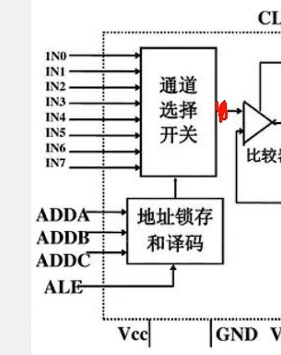

​	这部分就相当于一个可以选择模拟信号的数据选择器。

​	因为ADC转换是一个很快的过程，你给个开始信号，过几个us就转换完成了，所以说如果你想转换多路信号，那不必设计多个AD转换器，只需要一个AD转换器，然后再加一个多路选择开关，想转换哪一路，就先拨一下开关，选中对应通道，然后再开始转换就行了。

​	这就是这个输入通道选择的部分，这个ADC0809只有8个输入通道，而我们STM32内部的ADC最多是有18个输入通道的，所以对应这里，就是一个18路输入的多路开关。


**part2**

​	输入信号选好了之后，怎么才能知道这个电压对应的编码数据是多少呢？这就需要我们用逐次逼近的方法来一一比较了。

​	首先这是一个电压比较器，它可以判断两个输入信号电压的大小关系，输出

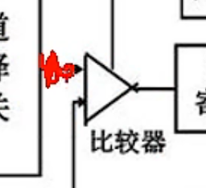

一个高低电平，指示谁大谁小，它的两个输入端，一个是待测电压，另一个是DAC的电压输出端（DAC是数模转换器，给它一个数据，它就可以输出数据对应的电压）。

​	然后进行比较，如果DAC输出的电压比待测电压大，我就调小DAC数据；如果DAC输出的电压比待测电压小，我就增大DAC数据。直到DAC输出的电压和外部通道输入的电压近似相等 ，这样DAC输入的数据就是外部电压的编码数据了。

​	这就是DAC的读数原理。


**part3**

​	为了最快找到未知电压的编码，通常我们会使用二分法进行寻找。

​	比如这里是8位的ADC，那编码就是0-255，第一次比较的时候，我们就给DAC输入255的一半进行比较，那就是128，然后看看谁大谁小，如果DAC电压大了，那第二次比较的时候就再给128的一半，64，如果还大，第三次比较的时候就给32.这次如果DAC电压小了，那第四次就给32到64中间的值，然后继续。这样依次进行下去，就能最快地找到未知电压地编码。

​	并且这个过程，如果你用二进制来表示的话，你会发现128，64，32这些数据正好是二进制每一位的位权，这个判断过程就相当于是：对二进制从高位到低位一次判断是0还是1的过程，这就是逐次逼近型名字的来源。那对于8位的ADC，从高位到低位依次判断8次就能找到未知电压的编码了；对于12位的ADC，就需要12次。


**part4**

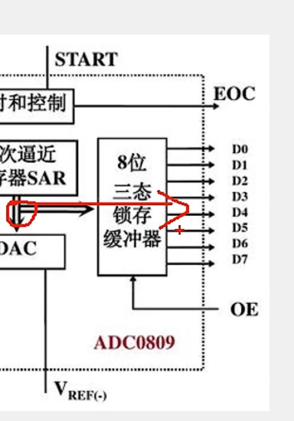

​	最后结果通过三态锁存缓冲器进行输出，8位就有8根线，12位就有12根线。

​	上面这里，EOC是End Of Convert，转换结束信号，START是开始转换，给一个输入脉冲，开始转换。CLOCK是ADC时钟，因为ADC内部是一步一步进行判断的，所以需要时钟来推动这个过程。

​	下面，VREF+和VREF-是DAC的参考电压。比如你给个数据是255，是对应5v还是3.3v呢？就由这个参考电压来决定。同时，这个DAC的参考电压也决定了ADC的输入范围，所以它也是ADC参考电压。


**part5**

​	最后左边是整个芯片电路的供电，VCC和GND，通常参考电压的正极和VCC是一样的，会接在一起；参考电压的负极和GND也是一样的，也接在一起。所以一般情况下，ADC输入电压的范围就和ADC的供电是一样的。


## STM32的ADC

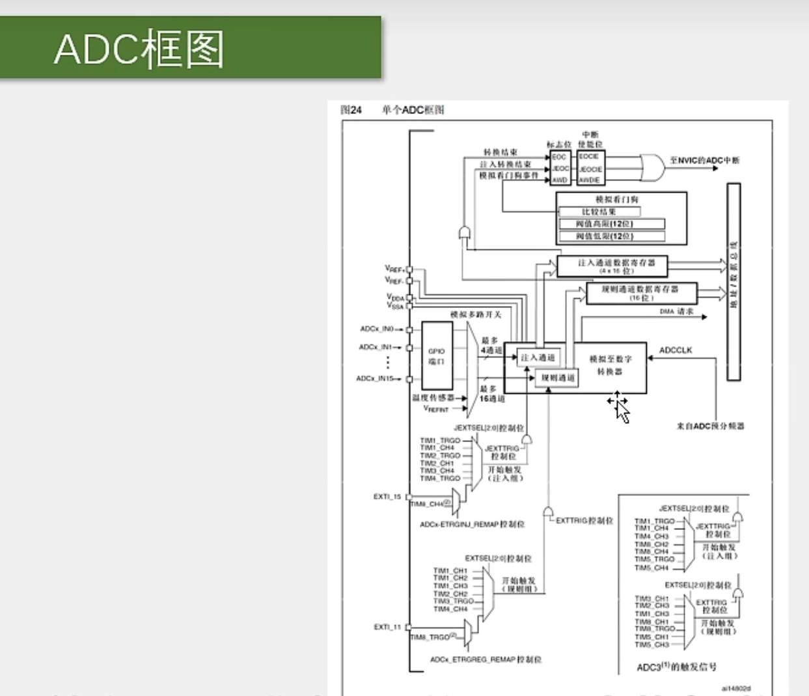

**part1**

​	左边是ADC的输入通道，包括16个GPIO口，IN0-IN15和两个内部通道，一个是内部温度传感器，另一个是VREFINT（V Reference Internal）,内部参考电压。总共是18个输入通道，然后到达红圈处，这是一个模拟多路开关。


可以指定我们想要选择的通道，右边是多路开关的输出，进入到模数转换器，这里模数转换器就是执行我们刚才讲过的逐次比较的过程，转换结果会直接放在上面的数据寄存器里。

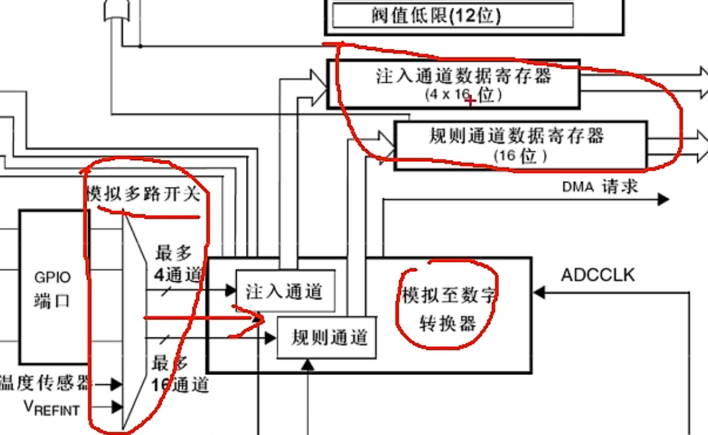

我们读取寄存器就能知道ADC转换的结果了。


**part2**

在模拟多路选择开关这里，对于普通的ADC，多路开关一般都是只选中一个的，就是选中某一个通道，开始转换，等待转换完成，取出结果，这是普通的流程。


但是这里就比较高级了，它可以同时选中多个，而且在转换的时候，还分成了两个组，规则通道组和注入通道组，其中规则组可以一次性最多选中16个通道，注入组最多可以选中4个通道。这有啥用呢？

​	举个例子，这就像你去餐厅点菜，普通的ADC是：你指定一个菜，老板给你做，然后做好了送给你。而更高级的这里就是，你指定一个菜单，这个菜单最多可以填16个菜，然后你直接递个菜单给老板，老板就按照菜单顺序依次做好，一次性给你端上来。这样的话就可以大大提高效率。当然你的菜单也可以只写一个菜哈。

​	那对于这个菜单呢，也有两种：

​			一种是规则组菜单，可以同时上16个菜，但是它有个尴尬的地方，就是这个规则组只有一个数据寄存器，就是这个桌子比较小，最多只能放一个菜，如果上16个菜，那不好意思，前15个菜都会被挤掉，你只能得到第16个菜。所以对于规则组转换来说，如果使用这个菜单的话，最好配合**DMA**来实现。（DMA是一个数据转运小帮手，它可以在每上一个菜之后，把这个菜挪到其他地方去，防止被覆盖。）

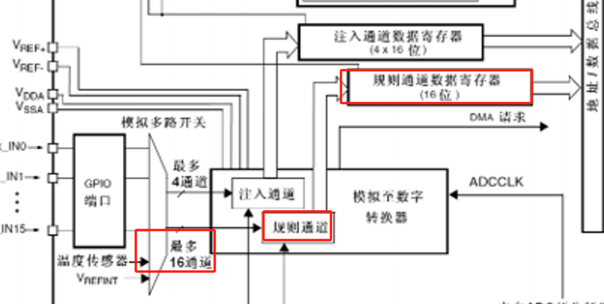

​			接着我们看注入组，它相当于是餐厅的VIP座位，在这个座位上，一次性最多可以点4个菜，并且注入组的数据寄存器有4个，是可以同时上4个菜的。对于注入组而言，就不用担心数据覆盖的问题了。

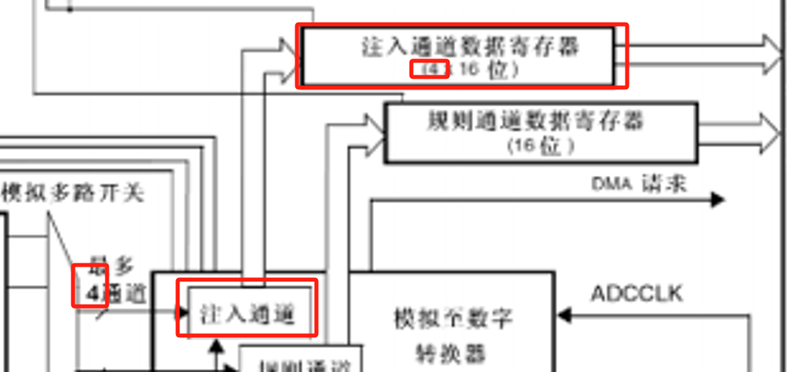


一般情况下，我们使用规则组就完全足够了。如果要使用规则组的菜单，那就再配合DMA转运数据，这样就不用担心数据覆盖的问题了。


**part3**：下面讲解模数转换器外围的一些线路

首先是左下角这里触发转换的部分，也就是ADC的START信号，开始转换


对于STM32的ADC，触发ADC开始转换的信号有两种：

​	一种是软件触发，就是在你程序中手动调用一条代码，就可以启动转换了。

​	另一种是硬件触发，就是这里的这些触发源，上面这些是注入组的触发源，下面这些是规则组的触发源。这些触发源主要是来自于定时器，有定时器的各个通道，还有TRGO定时器主模式的输出。那因为ADC经常需要过一个固定时间段转换一次。

​			比如每隔1ms转换一次，正常的思路就是，用定时器，每隔1ms申请一次中断，在中断里手动开始一次转换，这样也是可以的。但是频繁进中断对我们的程序是有一定影响的，比如你有很多中断都需要频繁进入，那肯定会影响主程序的执行。并且不同中断之间，由于优先级的不同，也会导致某些中断不能及时得到响应。如果触发ADC的中断不能及时得到响应，那我们ADC的转换频率就肯定会产生影响了。所以对于这种需要频繁进入中断，并且在中断里只完成了简单工作的情况，一般都会有硬件的支持：

​						比如下面这里，就可以给TIM3定个1ms的时间，并且把TIM3的更新事件选择为TRGO输出，然后在ADC这里，选择开始触发信号为TIM3的TRGO。这样TIM3的更新事件就能通过硬件自动触发ADC转换了。整个过程不需要进中断，节省了中断资源，这就是定时器触发的作用。当然还可以用外部时钟。


**part4**


上面两个是ADC的参考电压，决定了ADC输入电压的范围；

下面两个是ADC的供电引脚。

一般情况下，VREF+要接VDDA；VREF-要接VSSA。

在我们这个芯片上，没有VREF+和VREF-的引脚，它在内部就已经分别和VDDA和VSSA接在一起了。


**part5**

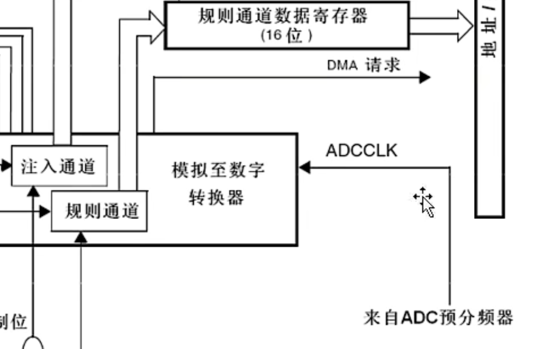

ADCCLK是ADC的时钟，相当于前面ADC里的CLOCK，是用于驱动内部逐次比较的时钟。这个ADCCLK是来自ADC预分频器，这个ADC预分频器是来源于RCC的。


继续看上面，这里是DMA（搬运小弟，防止菜被刷新下去）请求，这个就是用于触发DMA进行数据转运的。


模拟看门狗，它里面可以存一个阈值高限和阈值低限，如果启动了模拟看门狗，并且指定了看门的通道，那这个看门狗就会关注它看门的通道，一但超过这个阈值范围了，它就会乱叫，就会在上面，申请一个模拟看门狗的中断，最后通向NVIC。


然后对于规则组和注入组而言呢，他们转换之后，也会有一个EOC转换完成的信号。在这里，EOC是规则组的完成信号，JEOC是注入组完成的信号。这两个信号会在状态寄存器里置一个标志位，我们读取这个标志位，就能知道是不是转换结束了。同时这两个标志位也可以去到NVIC，申请中断。如果开启了NVIC对应的通道，它们就会触发中断。


## ADC基本结构图


可以通过是否能看懂此图来判断前文是否真正理解。


## 输入通道

刚才我们说了，左边那里有16个外部通道，那这16个外部通道都是对应的哪些GPIO口呢？？我们就可以看看下面这个表


这些就是ADC通道和引脚复用的关系。当然这个对应关系也可以通过引脚定义表看出来


## 规则组转换模式

**前情回顾：规则组**

​	规则组菜单，可以同时上16个菜，但是它有个尴尬的地方，就是这个规则组只有一个数据寄存器，就是这个桌子比较小，最多只能放一个菜，如果上16个菜，那不好意思，前15个菜都会被挤掉，你只能得到第16个菜。所以对于规则组转换来说，如果使用这个菜单的话，最好配合**DMA**来实现。（DMA是一个数据转运小帮手，它可以在每上一个菜之后，把这个菜挪到其他地方去，防止被覆盖。）


​	下面几个图的列表就是规则组里的菜单,有16个空位，分别是序列1-16，你可以在这里点菜，就是写入你要转换的通道。

### 单次转换，非扫描模式

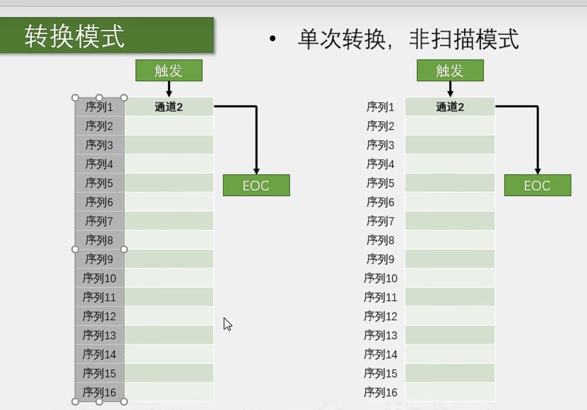

​	在非扫描模式下，这个菜单就只有第一个序列1的位置有效，这时，菜单同时选中一组的方式就退化为简单的选中一个的方式了。

​	在这里我们可以在序列1的位置指定我们想转换的通道，比如通道2，然后我们就可以触发转换，ADC就会对这个通道2进行模数转换。过一小段事件后，转换完成，转换结果放在数据寄存器里，同时给EOC标志位置1，整个转换过程就结束了。

​	我们判断这个EOC标志位，如果转换完了，那我们就可以在数据寄存器里读取结果了；如果我们想再启动一次转换，那就需要再触发一次，转换结束，置EOC标志位，读结果。

​	如果想换一个通道转换，那在转换之前，把第一个位置的通道2改成其他通道，然后再启动转换，这样就行了。


### 连续转换，非扫描模式


 	与上一次单次转换不同的是，它在一次转换结束后不会停止，而是立刻开始下一轮的转换，然后一直持续下去，这样就只需要最开始触发一次，之后就可以一直转换了。

​	这个模式的好处就是，开始转换之后不需要等待一段时间的，因为它一直都在转换，所以你就不需要手动开始转换了。也不用判断是否结束的，想要读AD值的时候，直接从数据寄存器取就是了。


### 单次转换，扫描模式


​	这个模式也是单次转换，所以每触发一次就会停下来，下次转换就得再触发才能开始。

​	然后它是扫描模式，这就会用到这个菜单列表了，你可以在这个菜单里点菜，比如第一个菜是通道2，第二个菜是通道5等等等等。这里每一个位置是通道几可以任意指定，并且也是可以重复的。

​	然后初始化结构体里还会有一个参数，就是通道数目，因为这16个位置你可以不用完，只用前几个，那你就需要再给个通道数目的参数，告诉他我有几个通道。

​	每次触发后，他就一次对你选择的这前n个位置进行AD转换，转换结果都放在数据寄存器里，这里为了防止数据被覆盖，就需要用DMA及时将数据挪走。当n个通道转换完成后，产生EOC信号，转换结束，然后再触发下一次，又开始新一轮的转换。


### 连续转换，扫描模式

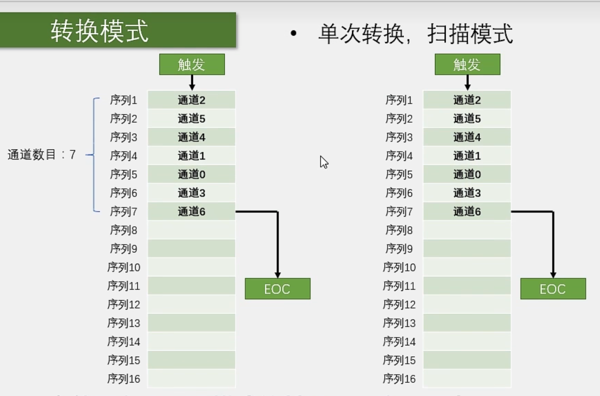

​	在上一个模式上变了一点而已

​	就是在一次转换完成后，立刻开始下一次的转换，和上面都是一个套路。


**当然，在扫描模式的情况下，还可以有一种模式，叫间断模式**

​	它的作用是，在扫描的过程中，每隔几个转换，就暂停一次，需要再次触发才能继续。了解即可。


## 触发控制

下面这个表就是规则组的触发源：

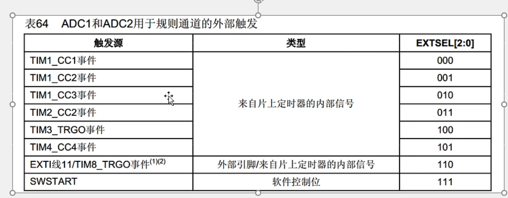		在这个表里，有来自定时器的信号，还有来自引脚(或定时器)的信号。最后是软件控制位，也就是我们之前说的软件触发。

​	这些触发信号怎么选择，可以通过设置右边这个寄存器来完成。当然使用库函数的话，直接给一个参数就可以了。这就是触发控制，再简单说一下。


## 数据对齐

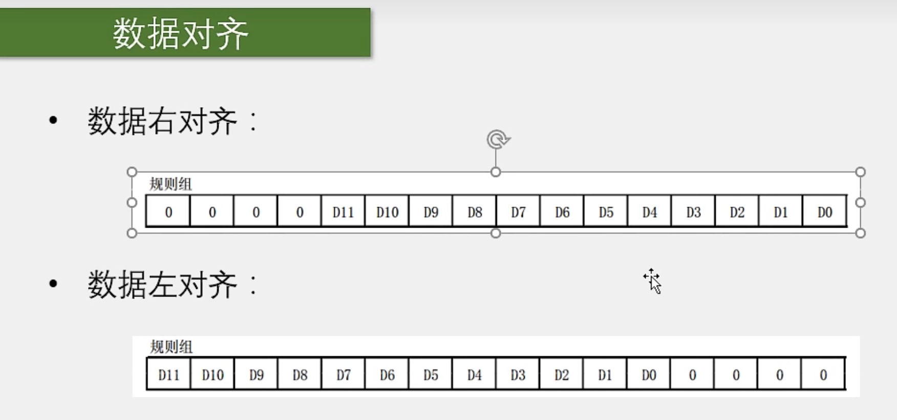

我们这个ADC是12位的，它的转换结果就是一个12位的数据。但是这个数据寄存器是16位的，所以就存在一个数据对齐的问题。

​	这里第一种是数据右对齐，就是12位的数据向右靠，高位多出来的几位就补0。

​	第二种是数据左对齐，12位的数据向左靠，低位多出来的几位补0。


**在这里我们一般使用的都是第一种右对齐，这样读取这个16位寄存器，直接就是转换结果**


左对齐之后往往数据会偏大。仅仅在不需要高分辨率的时候使用。


## 转换时间


转换时间这个参数我们一般不太敏感，因为一般AD转换都很快，如果不需要非常高速的转换频率，那这个时间一般都可以忽略的。


## 校准


不需要理解，校准是固定的，我们只需要在ADC初始化的最后，加几条代码就行了。


## 硬件电路


# 【7-2】AD单通道&多通道

## ADC相关函数

```c
void RCC_ADCCLKConfig(uint32_t RCC_PCLK2);

//函数功能：配置RTCCLK分频器的
//它可以对APB2的72MHz时钟选择2，4，6，8分频，输入到ADCCLK
```

```c
void ADC_DeInit(ADC_TypeDef* ADCx);
//函数功能：恢复缺省配置
```

```c
void ADC_Init(ADC_TypeDef* ADCx, ADC_InitTypeDef* ADC_InitStruct);
//函数功能：初始化
```

```c
void ADC_StructInit(ADC_InitTypeDef* ADC_InitStruct);
//函数功能：结构体初始化
```

```c
void ADC_Cmd(ADC_TypeDef* ADCx, FunctionalState NewState);
//函数功能：给ADC上电的，也就是开关控制
```

```c
void ADC_DMACmd(ADC_TypeDef* ADCx, FunctionalState NewState);
//函数功能：用于开启DMA输出信号的
```

```c
void ADC_ITConfig(ADC_TypeDef* ADCx, uint16_t ADC_IT, FunctionalState NewState);
//函数功能：中断输出控制
```


下面是4个用于控制校准的函数，我们在ADC初始化完成后，依次调用就行了

```c
void ADC_ResetCalibration(ADC_TypeDef* ADCx);
//复位校准
```

```c
FlagStatus ADC_GetResetCalibrationStatus(ADC_TypeDef* ADCx);
//获取复位标准状态
```

```c
void ADC_StartCalibration(ADC_TypeDef* ADCx);
//开启校准
```

```c
FlagStatus ADC_GetCalibrationStatus(ADC_TypeDef* ADCx);
//获取开启校准状态
```


```c
void ADC_SoftwareStartConvCmd(ADC_TypeDef* ADCx, FunctionalState NewState);
//ADC软件开始转换控制，用于软件触发的函数，调用一下就能软件触发转换了
```

```c
FlagStatus ADC_GetSoftwareStartConvStatus(ADC_TypeDef* ADCx);
//ADC获取软件开始转换状态，一般没啥用
//PS：不可以用这个函数来判断转换是否结束。那如何知道何时转换结束了呢？看下面这个函数：
```

```c
FlagStatus ADC_GetFlagStatus(ADC_TypeDef* ADCx, uint8_t ADC_FLAG);
//获取标志位状态，然后参数给EOC标志位，判断EOC标志位是不是置1了，如果转换结束，EOC标志位置1，然后调用这个函数，判断标志位。
```


下面是间断模式函数，需要的话可以了解一下

```c
void ADC_DiscModeChannelCountConfig(ADC_TypeDef* ADCx, uint8_t Number);
//每隔几个通道间断一次

void ADC_DiscModeCmd(ADC_TypeDef* ADCx, FunctionalState NewState);
//是不是启用间断模式
```


```c
void ADC_RegularChannelConfig(ADC_TypeDef* ADCx, uint8_t ADC_Channel, uint8_t Rank, uint8_t ADC_SampleTime);
//ADC规则组通道配置，给序列的每个位置填写指定的通道，就是填写菜单的过程
//1.ADCx	2.ADC_Channel指定通道	3.Rank序列几的位置	4.SampleTime指定通道的采样时间
```

```c
void ADC_ExternalTrigConvCmd(ADC_TypeDef* ADCx, FunctionalState NewState);
//ADC外部触发转换控制，就是是否允许外部触发转换
```

```c
uint16_t ADC_GetConversionValue(ADC_TypeDef* ADCx);
//ADC获取转换值，就是获取AD转换的数据寄存器，读取转换结果就要使用这个函数

uint32_t ADC_GetDualModeConversionValue(void);
//ADC获取双模式转换值，双ADC模式读取转换结果的函数
```

**以上是规则组的函数**


还有注入组函数，看门狗函数，温度函数等此处忽略


## AD单通道

### 接线图


**电位器：等于滑动变阻器**


### 程序实例

**AD.h**

```c
#ifndef __AD_H
#define __AD_H

void AD_Init(void);
uint16_t AD_GetValue(void);


#endif

```


**AD.c**

```c
#include "stm32f10x.h"                  // Device header


void AD_Init(void)
{
	/* AD初始化步骤：
		1.开启RCC时钟，包括ADC和GPIO的时钟（另外ADCCLK的分频器也需要配置一下）
		2.配置GPIO，把需要用的GPIO配置成模拟输入的模式
		3.配置多路开关，把左边的通道接入到右边的规则组列表里(点菜)
		4.配置ADC转换器（结构体）
		5.如果你需要模拟看门狗，那会有几个函数用来配置阈值和监测通道的
		6.如果你想开启中断，那就在中断输出控制里用ITConfig函数开启对应的中断输出，然后再在NVIC里配置中断优先级
		7.开关控制，调用一下ADC_Cmd函数，开启ADC
		配置完成。
		8.还可以对ADC进行校准，这样可以减少误差
	
		那在ADC工作的时候，如果想用软件触发转换，那会有函数可以触发；
		如果想读取转换结果，那也会有函数可以读取结果。
	*/
	
	//第一步，开启RCC时钟
	RCC_APB2PeriphClockCmd(RCC_APB2Periph_ADC1,ENABLE);	//开启ADC的RCC时钟
	RCC_APB2PeriphClockCmd(RCC_APB2Periph_GPIOA,ENABLE);//开启GPIOA的时钟
	RCC_ADCCLKConfig(RCC_PCLK2_Div6);//配置ADCCLK分频器，配置为6倍分频
	
	//第二步，配置GPIO
		/*GPIO初始化，模拟输入的引脚*/
	GPIO_InitTypeDef GPIO_InitStructure;
	GPIO_InitStructure.GPIO_Mode = GPIO_Mode_AIN;//AIN模式下，GPIO是无效的，断开GPIO，防止你GPIO口的输入输出对我模拟电压造成干扰
	GPIO_InitStructure.GPIO_Pin = GPIO_Pin_0;
	GPIO_InitStructure.GPIO_Speed = GPIO_Speed_50MHz;
	GPIO_Init(GPIOA, &GPIO_InitStructure);
	
	//第三步：配置规则组通道
	//在规则组菜单列表的第一个位置，写入通道0这个通道(序列1位置写入通道0)，采样时间55.5
	//如果还想继续填充菜单就多写几个该函数
	ADC_RegularChannelConfig(ADC1,ADC_Channel_0,1,ADC_SampleTime_55Cycles5);
	
	//第四步：结构体初始化ADC
	//先初始化ADC的结构体
	ADC_InitTypeDef ADC_InitStructrue;
	ADC_InitStructrue.ADC_ContinuousConvMode = ENABLE;//单次转换
	ADC_InitStructrue.ADC_DataAlign = ADC_DataAlign_Right ;//右对齐模式
	ADC_InitStructrue.ADC_ExternalTrigConv = ADC_ExternalTrigConv_None;//外部触发源选择：不触发，由软件触发
	ADC_InitStructrue.ADC_Mode = ADC_Mode_Independent ;	//独立模式
	ADC_InitStructrue.ADC_NbrOfChannel = 1;
	ADC_InitStructrue.ADC_ScanConvMode = DISABLE;//非扫描模式
	//再初始化ADC
	ADC_Init(ADC1,&ADC_InitStructrue);
	
	//第五步：开启ADC
	ADC_Cmd(ADC1,ENABLE);
	
	//校准ADC
	 ADC_ResetCalibration(ADC1);
	 while(ADC_GetResetCalibrationStatus(ADC1));//==SET已经省略
	 ADC_StartCalibration(ADC1);
	 while(ADC_GetCalibrationStatus(ADC1));//==SET已经省略
	 
	//1.软件触发转换
	ADC_SoftwareStartConvCmd(ADC1,ENABLE);
	
}


uint16_t AD_GetValue(void)
{
	/*获取AD值步骤：
	1.软件触发转换
	2.等待转换完成，也就是等待EOC标志位置1
	3.读取ADC数据寄存器
	*/
	

	
	//2等待转换完成
	//while(ADC_GetFlagStatus(ADC1,ADC_FLAG_EOC) == RESET);
	
	//3.读取ADC数据寄存器
	return ADC_GetConversionValue(ADC1);
	
}


```


**main.c**

```c
#include "stm32f10x.h"                  // Device header
#include "Delay.h"
#include "OLED.h"
#include "AD.h"


int main(void)
{
	/*模块初始化*/
	OLED_Init();		//OLED初始化
	
	AD_Init();
	
	OLED_ShowString(1,1,"AD:");
	OLED_ShowString(2,1,"V:");
	while (1)
	{
		Delay_ms(100);
		OLED_ShowNum(1,4,AD_GetValue(),4);
		OLED_ShowNum(2,4,((uint16_t)((float)AD_GetValue() / 4095 * 3.3 * 100) % 100 ),2);
	}
}

```


## AD多通道

### 接线图


### 程序实例


# 【9-1】USART串口协议

## 通信接口

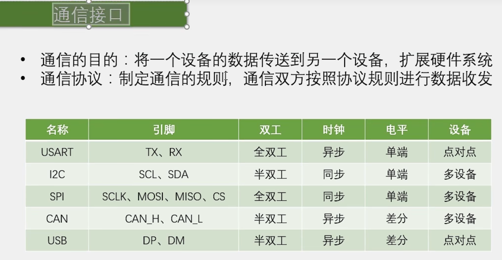

**双工**：

​	全双工：指通信双方能够同时进行双向通信。一般来说，全双工的通信都有两根通信线，比如串口，一根TX发送，一根RX接收；SPI，一根MOSI发送，一根MISO接收；发送线路和接收线路互不影响，全双工。

​	半双工： 只有一根数据线(CAN和USB两根差分线也是组合成为一根数据线的)，所以都是半双工。半双工是指双方能够通信，但不能同时通信，可以你发我，我发你，但不能你发我的同时我发你。

​	单工：指在数据只能从一个设备到另外一个设备，而不能反着来。比如把串口的RX引脚去掉，那串口就退化成单工了。


**时钟**（特性）：

​	同步：I2C和SPI都有单独的时钟线，所以他们是同步的，接收方可以在时钟信号的指引下进行采样。

​	异步：剩下的串口，CAN和USB没有时钟线，所以需要双方约定一个采样频率，并且还需要加一些帧头帧尾等，进行采样位置的对齐。这就是异步通信。


**电平**（特性）：

​	单端信号：它们引脚的高低电平都是对GND的电压差，所以单端信号通信的双方必须要共地，就是把GND接在一起。

​	差分信号：它是靠两个差分引脚的电压差来传输信号的，在通信的时候可以不需要GND，不过USB协议里也有一些地方需要单端信号，所以USB还是需要GND的。


**设备特性**：略


## 串口通信

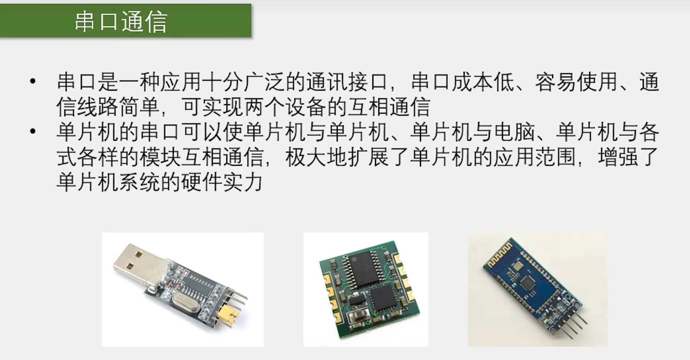


## 硬件电路


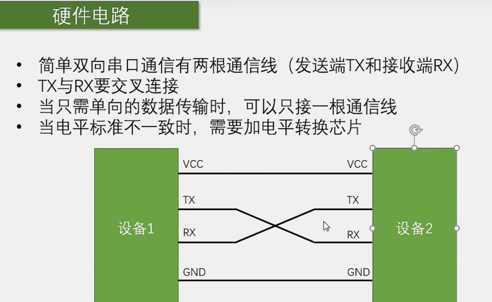

### 电平标准


## 串口参数及时序

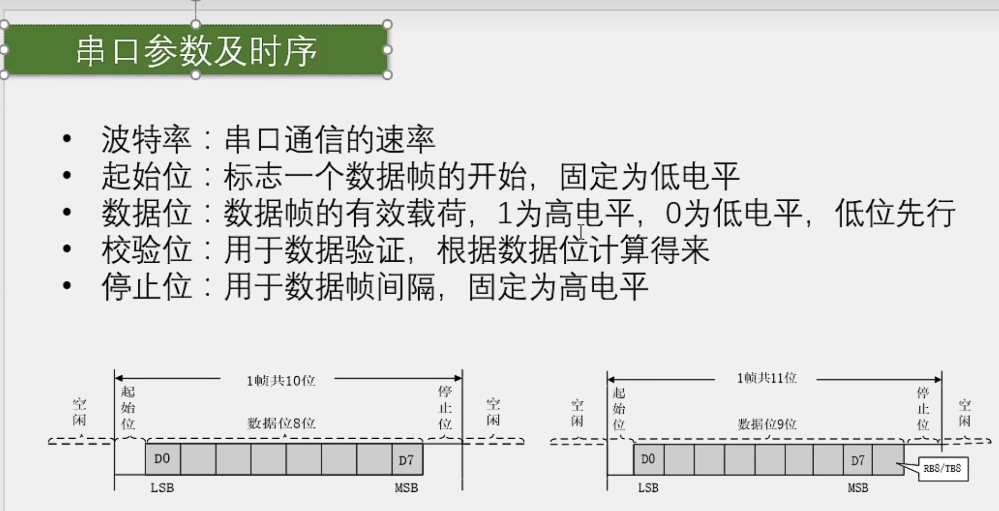


## 串口时序

下面是串口通讯的示例波形图：

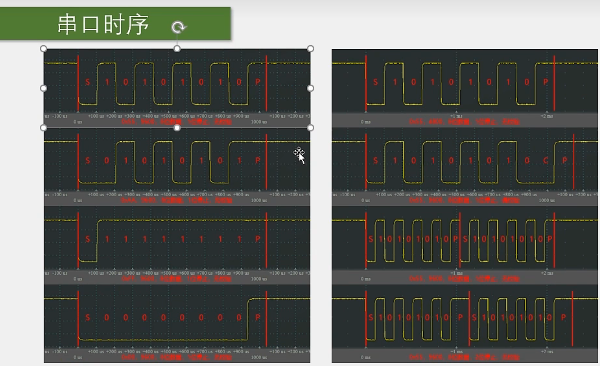


# 【9-2】USART串口外设

## USART简介

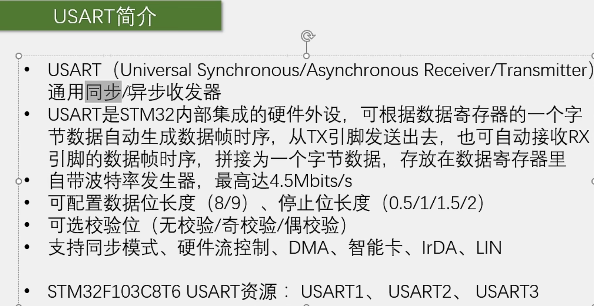

PS：

​	STM32F103C8T6的片上资源：USART1是APB2总线上的设备，USART2，3是APB1总线的设备，在开启时钟时要注意一下。


## USART框图


### 串口引脚


### USART基本结构图


**PS：**

​	这里画了几个右移的符号，就是代表这个移位寄存器是往右移的，是低位先行。当数据由数据寄存器转到移位寄存器时，会置一个TXE的标志位，我们判断这个标志位就知道是不是可以写下一个数据了。

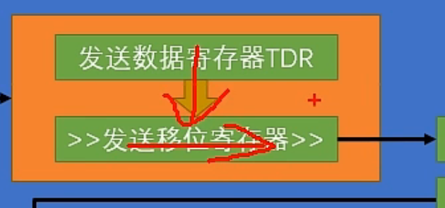

​	然后接收部分也是类似的哈：RX引脚的波形，通过GPIO输入，在数据接收器的控制下，一位一位地移入接收移位寄存器，这里画了右移的符号，也是右移的，因为是低位先行，所以要从左边开始移进来，移完一帧数据后，数据就会统一运到接收数据寄存器，在转移的同时，置一个RXNE标志位，我们检查这个标志位，就可以知道是不是接收到数据了。同时这个标志位也可以去申请中断，这样就可以在收到数据的时候，直接进入中断函数，然后快速的读取和保存数据。


**那右边其实是有四个寄存器哈，但是在软件层面，只有一个DR寄存器可以供我们读写：**

​	写入DR时，数据走上面这条路，进行发送；读取DR时，数据走下面这条路，进行接收。


## 其他细节

### 数据帧

#### 1.

​	这个图，是在程序中配置8位字长和9位字长的波形对比，这里的字长，就是我们前面所说的数据位的长度，它这里的字长是包含校验位的，是这种描述方式。

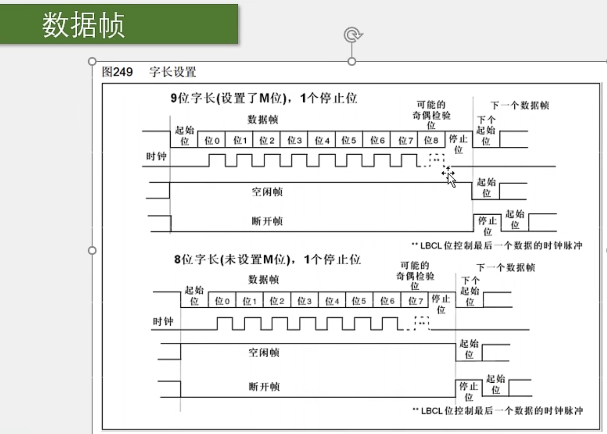


​	看下上面9位字长的波形：

​	第一条时序，很明显就是TX发送或者RX接收的数据帧格式:空闲高电平，然后起始位0，然后根据写入的数据，置0或者置1，依次发送位0-位8，加起来就是9位，最后停止位1，数据帧结束  。

​	**在这里位8，也就是第9个位置，是一个可能的奇偶校验位，通过配置寄存器就可以配置成奇校验，偶校验或者无校验。这里可以选择配置成8位有效载荷+1位校验位，也可以选择9位全都是有效载荷。不过既然你选择了9位字长，那一般都是要加上校验位的，因为8位有效载荷，正好对应一个字节嘛**

​	然后下面这个时钟，就是我们之前说的同步时钟输出的功能，可以看到，这里在每个数据位的中间，都有一个时钟上升沿，时钟的频率，和数据速率也是一样的，接收端可以在时钟上升沿进行采样，这样就可以精确定位每一位数据，这个时钟的最后一位，可以通过这个LBCL控制，要不要输出 ，另外这个时钟的极性，相位什么的，也可以通过配置寄存器配置。

​	然后下面这个空闲帧，就是从头到尾都是1；

​	还有一个断开帧，从头到尾都是0；

​	这两个数据帧，是局域网协议用的，我们串口用不着，不用管的。


下面是8位的，和9位基本一样，不作解释。


**总的来说，这里有四种选择：**

​	8位字长，有校验或者无校验；

​	9位字长，有校验或者无校验；


#### 2.

下面是不同停止位的数据帧的波形变化。

STM32的串口可以配置停止位长度为0.5，1，1.5，2这四种


最后一位就是控制停止位时长的，一般选择一位停止位就行了哈，其他的参数不太常用。


**下面展示的是USART电路上输入数据的一些策略：**

​	对于串口来说，串口的输出TX应该是比输入RX简单很多，因为输出你就定时翻转TX引脚高低电平就行了，但是输入就复杂一些：你不仅要保证，输入的采样频率和波特率一致，还要保证每一次输入采样的位置，正好要处于每一位的正中间，只有在每一位的正中间采样，这样高低电平读进来才是最可靠的，如果你采样点过于靠前或靠后，那有可能高低电平还正在翻转，电平还不稳定，或者稍有误差，数据就采样错了。

​	另外，输入最好还要对噪声有一定的判断能力，如果是噪声，最好能置个标志位提醒我一下。

​	这些就是输入数据所面临的问题，那我们来看看STM32是如何来设计输入电路的呢？？

#### 起始位侦测

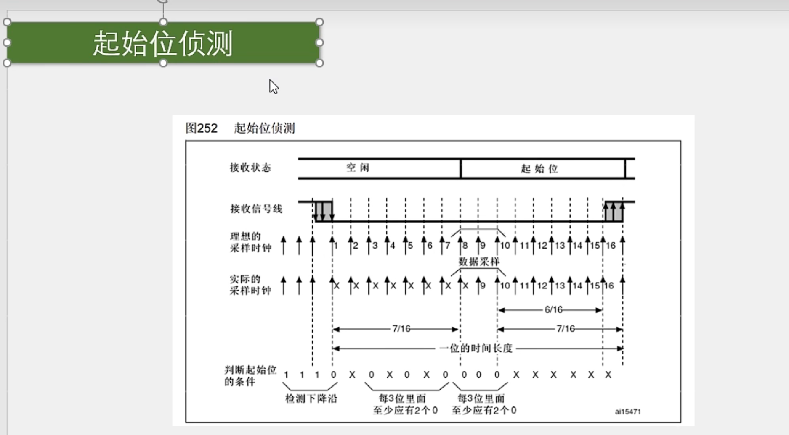

当输入电路侦测到一个数据帧的起始位后，就会以波特率的频率，连续采样一帧数据，同时，从起始位开始，采样位置就要对齐到位的正中间，只要第一位 对齐了，后面就肯定都是对齐的。

那为了实现这些功能，首先输入的这部分电路对采样时钟进行了细分，它会以波特率的16倍频率进行采样，也就是在一位的时间里，可以进行16次采样。然后它的策略是：

​			最开始，空闲状态高电平，那采样就一直是1，在某个位置，突然采到一个0，那么就说明，在这两次采样之间，出现了下降沿，如果没有任何噪声，那之后就应该是起始位了。在起始位，会进行连续16次采样，没有噪声的话，这16次采样，肯定就都是0，这没问题。但是实际电路肯定是存在一些噪音的，所以这里即使出现下降沿了，后续也要再采样几次，以防万一。

​	那根据手册描述，这个接收电路，还会在下降沿之后的第3次，5次，7次，进行一批采样；在第8次，9次，10次，再进行一批采样；且这两批采样，都要要求每3位里面至少应该有2个0；

​				如果没有噪声，那肯定都是0，满足情况

​				如果有一些轻微的噪声，导致这里3位里面，只有两个是0，另一个是1，那也算是检测到了起始位，**但是在状态寄存器里会置一个NE，噪声标志位！**就提醒你一下，数据我是收到了，但是有噪声，你悠着点用。

​				如果这3位里面只有1个0，那就不算检测到了起始位，可能前面那个下降沿是噪声导致的，这时电路就忽略前面的数据，重新开始捕捉下降沿。


​	以上就是STM32的串口在接收过程中，对噪声的处理。如果通过了这个起始位侦测，那接收状态就由空闲，变为接收起始位，同时，第8，9，10次采样的位置，就正好是起始位的正中间，之后，接收数据位时，就都在第8，9，10次进行采样，这样就能保证采样位置在位的正中间了，这就是起始位侦测和采样位置对齐的策略。


#### 数据采样


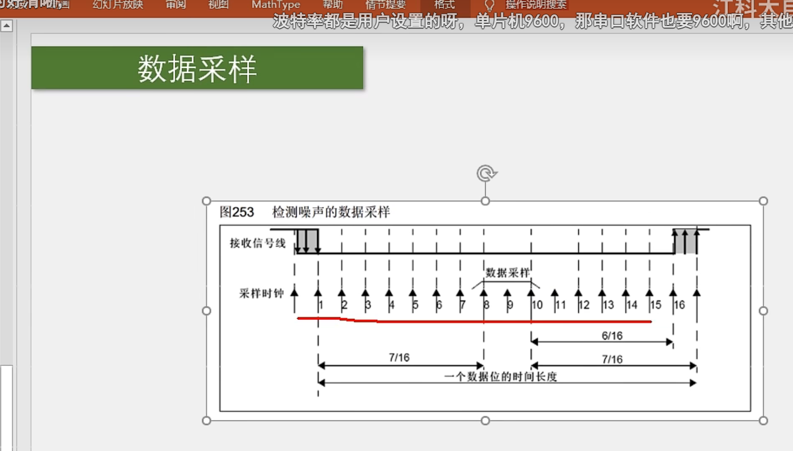

这里，从1-16，是一个数据位的时间长度，在一个数据位，有16个采样时钟，由于起始位侦测已经对齐了采样时钟，所以，这里就直接在第8，9，10次采样数据位。

​	为了保证数据的可靠性，这里是连续采样3次，

​			没有噪声的理想情况下，这三次肯定全为1或者全为0，全为1，就确认收到了1；全为0，就认为收到了0

​			如果有噪声，导致3次采样不是全为1或者全为0，那它就按照2：1的规则来，2次为1就是1，2次为0就是0，同时这种情况下噪声标志位NE也会置1，告诉你，我收到数据了，但是有噪声，你悠着点用。


以上就是检测噪声的数据采用。


#### 波特率发生器

​	波特率发生器就是分频器


了解即可，我们用库函数，需要多少波特率，直接写就行，库函数会帮我们算。


# 【9-3】串口发送&串口接收

**为啥要一起共地而不是你用你的地我用我的地？**

​	一般多个系统之间的互联，都要进行共地，这样电平才能有高低的参考，就像两个人比身高一样，他俩必须要站在同一地平面上，才能比较。如果一个人站在地球，一个人站在月球，那怎么知道谁高谁低呢？


## USART相关函数

```c
void USART_ClockInit(USART_TypeDef* USARTx, USART_ClockInitTypeDef* USART_ClockInitStruct);
void USART_ClockStructInit(USART_ClockInitTypeDef* USART_ClockInitStruct);

//函数功能：用来配置同步时钟输出的，包括时钟是不是要输出，时钟的极性相位等参数，因为参数比较多，所以是用结构体这种方式来配置的。
```

```c
void USART_DMACmd(USART_TypeDef* USARTx, uint16_t USART_DMAReq, FunctionalState NewState);

//函数功能：可以开启USART到DMA的触发通道
```

**下面这些函数比较重要哈**

```c
void USART_SendData(USART_TypeDef* USARTx, uint16_t Data);

//函数功能：发送数据
//就是写DR寄存器
```

```c
uint16_t USART_ReceiveData(USART_TypeDef* USARTx);

//函数功能：接收数据
//就是读DR寄存器
```

DR寄存器内部有4个寄存器，控制发送于接收。


## 数据模式


HEX模式：

​	只能显示一个个的16进制数，比如41，42，7A，8B；不能显示文本，比如Helloworld，和各种符号，比如！，。

如果想显示文本，那就要对一个个的数据进行编码了，这就是文本模式：

文本模式：

​	它是以原始数据编码后的形式显示，在这个模式下，每一个字节数据，通过查找字符集，编码成一个字符，比如上图展示的就是ASCLL码字符集。


## Printf

### 1.Keil5的设置

**第一步**

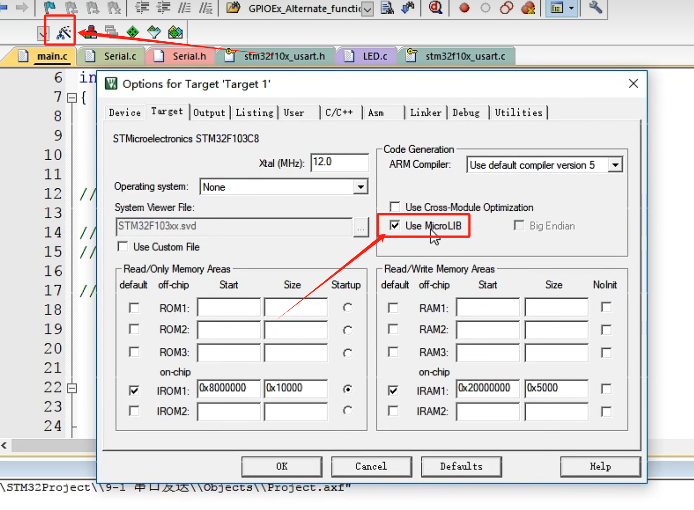

MicroLIB是Keil为嵌入式平台优化的一个精简库，我们等会要用的printf就可以用MicroLIB，所以勾上它。


**第二步**

我们还需要对printf进行重定向，将printf函数打印的东西输出到串口，因为printf函数默认是输出到屏幕，我们的单片机没有屏幕，所以要进行重定向。

步骤就是：

​		在串口模块里，最开始加上：#include<stdio.h>

​		之后，在后面，重写fputc函数：

```c
//重写fputc函数
int fputc(int ch,FILE *f)
{
	//在这里面，我们要把fputc重定向到串口
	Serial_SendByte(ch);
	return ch;
}
```

那重定向fpuc跟printf有什么关系呢？？

​		这是因为，这个fputc是printf函数的底层，printf函数在打印的时候，就是不断调用fputc函数一个个打印的，我们把fputc函数重定向到了串口，那pritnf自然就输出到串口了。


### 2.使用

在main函数里就可以直接使用pritnf函数了：


在串口助手里面即可看到对应printf输出结果：

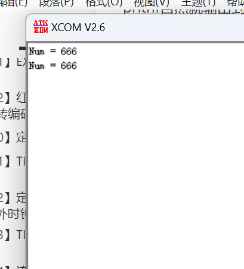


### 3.其他printf函数的移植方法

**第二种**

上面那种printf移植方法，printf只能有一个，你重定向到串口1了，那串口2再用就没有了。如果多个串口都想用printf怎么办呢？？

​	这时候就可以用sprintf！

​		sprintf可以把格式化字符输出到一个字符串里，所以：

```c
char String[100];	//定义一个字符串，长度管够
//sprintf可以把格式化字符输出到一个字符串里
sprintf(String,"Num = %d\r\n",666);	//1.打印输出的位置，后面的参数就跟printf一样了
//sprintf的理解：pritnf是格式化输出，sprintf就是光格式化不输入，而是保存到一个字符串变量里面
Serial_SendString(String);//把字符串String通过串口发送出去
```


**第三种**

sprinf，每次都得先定义字符串，再打印到字符串，再发送字符串，太麻烦了，我们要是能封装一下这个过程，就再好不过了。所以第三种方法就是sprinf。

​	由于printf这类函数比较特殊，它支持可变的参数，像我们之前写的函数，参数的个数都是固定的，可变参数这个执行起来比较复杂，如果想深入学习的话，可以百度一下c语言可变参数，学习一下。

下面是封装步骤：

​	首先在串口模块里，先添加头文件#include<stdarg.h>

​	然后在最后这里对sprintf函数进行封装：

```c
/*下面是封装sprintf函数*/
//format参数用来接收格式化字符串，三个点表示接收后面的可变参数列表
void Serial_Printf(char *format,...)
{
	char String[100];//定义一个字符串变量
	va_list arg;	//定义一个参数列表变量,va_list是一个类型名，arg是变量名
	va_start(arg,format);//从format位置开始接收参数表，放在arg里面
	vsprintf(String,format,arg);//接收字符串是String，格式化字符串是format，参数表是arg
	//在上面这里，sprintf要改成vsprintf,因为sp只能接收直接写的参数，对于这种封装格式，要用vsp
	
	va_end(arg);//释放arg
	Serial_SendString(String);//发送字符串至串口
}

```

这样，就可以直接在main里面调用了：

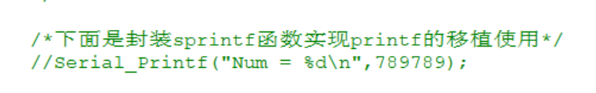

### printf的中文打印

#### 第一种

首先，在设置里面：

写上：

```c
--no-multibyte-chars
```

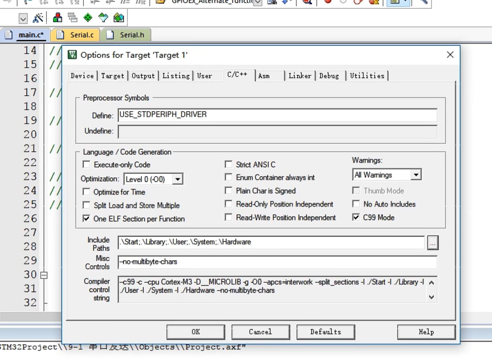

然后在串口助手里面文本编码改成UTF-8，这样就能正常打印中文了：

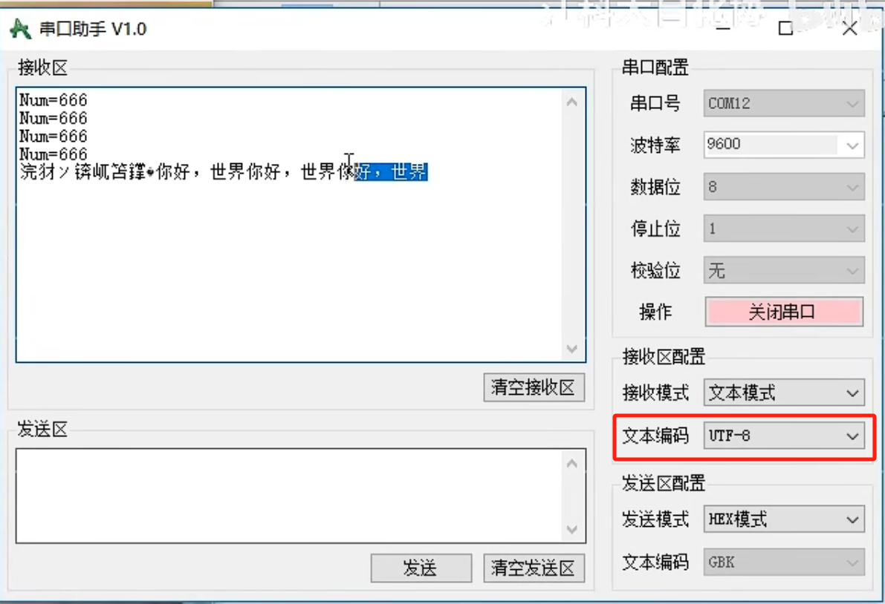

但是UTF-8可能有些软件兼容性不好，所以第二种方式就是：切换为GB2312编码。

#### 第二种

在Keil5里面将编码模式改为GB2312，这是汉字的编码方式，点击ok


同时，在串口助手里面选择GBK编码，一般windows软件默认就是GBK的编码，GBK和GB2312一样，都是中文的编码，基本都是兼容的


#### 转码软件

资料里有转编码软件，可以批量进行转码，记得关闭文件的只读。


## 串口发送

### 接线图


**为什么USB转TTL的RX和TX要接到STM32的PA9和PA10呢？**

​	我们看一下引脚图：

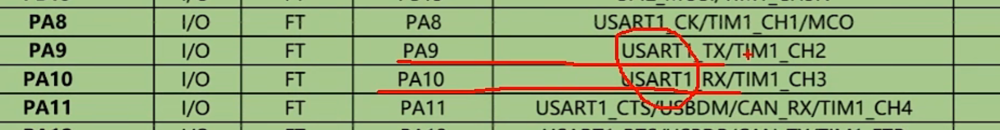

我们计划用USART1进行通信，所以就选这两个脚，如果你用USART2或者3的话，就要在这里找一下，接在USART2或者3的对应引脚上。


**再次提醒：TX和RX交叉连接！**


### 程序实例

**Serial.h**

```c
#ifndef __SERIAL_H
#define __SERIAL_H

#include <stdio.h>

void Serial_Init(void);
void Serial_SendByte(uint8_t Byte);
void Serial_SendArray(uint8_t *Array,uint16_t Length);
void Serial_SendString(char *String);
void Serial_SendNumber(uint32_t Number,int8_t Length);
void Serial_Printf(char *format,...);

#endif

```


**Serial.c**

```c
#include "stm32f10x.h" // Device header

#include <stdio.h>
#include <stdarg.h>

void Serial_Init(void)
{
/*初始化流程：
1.开启时钟，把需要用的USART和GPIO时钟打开；
2.GPIO初始化，把TX配置成复用输出，RX配置成输入；
3.配置USART，直接用一个结构体；
4.如果你只需要发送的功能，就直接开启USART，初始化就结束了；
如果你需要接收的功能，可能还需要配置中断：
那就在开启USART之前，再加上ITConfig和NCIC的代码就行了
*/

	
	
	//第一步：开启时钟
	RCC_APB2PeriphClockCmd(RCC_APB2Periph_USART1,ENABLE);//开启USART1的时钟使能
	RCC_APB2PeriphClockCmd(RCC_APB2Periph_GPIOA,ENABLE);//开启UGPIOA的时钟使能
	
	//第二步：初始化GPIO引脚
	/*GPIO初始化*/
	GPIO_InitTypeDef GPIO_InitStructure;
	GPIO_InitStructure.GPIO_Mode = GPIO_Mode_AF_PP;//复用推挽输出
	GPIO_InitStructure.GPIO_Pin = GPIO_Pin_9;
	GPIO_InitStructure.GPIO_Speed = GPIO_Speed_50MHz;
	GPIO_Init(GPIOA, &GPIO_InitStructure);	
	
	//第三步：初始化USART
	
	USART_InitTypeDef USART_InitStructure;	//定义初始化USART的结构体
	USART_InitStructure.USART_BaudRate = 9600;	//波特率
	USART_InitStructure.USART_HardwareFlowControl = USART_HardwareFlowControl_None;	//硬件流控制：不使用流控
	USART_InitStructure.USART_Mode = USART_Mode_Tx;//发送模式，如果既要接收又要发送就用|符号同时|上TX和RX
	USART_InitStructure.USART_Parity = USART_Parity_No;//奇偶校验位：不校验
	USART_InitStructure.USART_StopBits = USART_StopBits_1;//停止位长度：1位
	USART_InitStructure.USART_WordLength = USART_WordLength_8b;//字长：8位

	USART_Init(USART1,&USART_InitStructure);
	
	//第四步：开启USART
	USART_Cmd(USART1,ENABLE);
	
}


//发送一个字节函数
void Serial_SendByte(uint8_t Byte)
{
	USART_SendData(USART1,Byte);
	//获取标志位,如果数据发送完后，标志位会置1，此时才会跳出while循环
	while(USART_GetFlagStatus(USART1,USART_FLAG_TXE) == RESET);
}


//发送一个数组函数
void Serial_SendArray(uint8_t *Array,uint16_t Length)
{
	uint16_t i;
	for(i = 0; i < Length ; i++)
	{
		Serial_SendByte(*Array);
		Array++;
	}
}


//发送一个字符串函数
void Serial_SendString(char *String)	//因为字符串自带一个结束标志位，所以就不需要再传递长度参数了
{
	while(*String != '\0')
	{
		Serial_SendByte(*String);
		String++;
	}
}


//求某个数的n次方函数，需求见下一个函数的注释
uint32_t Serial_Pow(uint32_t X,uint32_t Y)
{
	uint32_t result = 1;
	while(Y--)
		result *= X;
	return result;
}


//发送一个数字函数
void Serial_SendNumber(uint32_t Number,int8_t Length)
{
	/*在函数里面：
		我们需要把Number的个位，十位，百位等等，以十进制拆分开
		然后转换成字符数字对应的数据，依次发送出去	*/
	
	//wok，拆分某(x)一位的数字，就是该数字/10^x % 10
	
	//所以我们需要先写一个求n次方函数，在前面uint32_t Serial_Pow(uint32_t X,uint32_t Y)
	
	uint8_t i;
	for(i = Length ; i > 0 ; i--)
	{
		Serial_SendByte(Number / Serial_Pow(10,i) % 10 + 0x31);//加0x30是为了对齐ASCLL码表里的数字，参考A与a的转换
	}
}


//重写fputc函数
int fputc(int ch,FILE *f)
{
	//在这里面，我们要把fputc重定向到串口
	Serial_SendByte(ch);
	return ch;
}


/*下面是封装sprintf函数*/
//format参数用来接收格式化字符串，三个点表示接收后面的可变参数列表
void Serial_Printf(char *format,...)
{
	char String[100];//定义一个字符串变量
	va_list arg;	//定义一个参数列表变量,va_list是一个类型名，arg是变量名
	va_start(arg,format);//从format位置开始接收参数表，放在arg里面
	vsprintf(String,format,arg);//接收字符串是String，格式化字符串是format，参数表是arg
	//在上面这里，sprintf要改成vsprintf,因为sp只能接收直接写的参数，对于这种封装格式，要用vsp
	
	va_end(arg);//释放arg
	Serial_SendString(String);//发送字符串至串口
}

```


**main.c**

```c
#include "stm32f10x.h"                  // Device header
#include "Delay.h"
#include "OLED.h"
#include "Serial.h"

int main(void)
{
	/*模块初始化*/
	OLED_Init();		//OLED初始化
	Serial_Init();	//初始化
	
	/*发送字节数据*/
	//Serial_SendByte(0x41);
	
	/*发送数组类型数据*/
	//uint8_t MyArray[] = {0x42,0x43,0x44,0x45};
	//Serial_SendArray(MyArray,4);
	
	
	/*发送字符串类型数据*/
	//char MyString[] = "Hellow world!";
	//Serial_SendString(MyString);
	
	/*发送数字数据*/
	//Serial_SendNumber(12345,5);

		
	//printf移植的使用
	//printf("Num = %d\r\n",666);
	
	/*下面是用sprintf实现print的移植使用
	char String[100];	//定义一个字符串，长度管够
	//sprintf可以把格式化字符输出到一个字符串里
	sprintf(String,"Num = %d\r\n",666);	//1.打印输出的位置，后面的参数就跟printf一样了
	//sprintf的理解：pritnf是格式化输出，sprintf就是光格式化不输入，而是保存到一个字符串变量里面
	Serial_SendString(String);//把字符串String通过串口发送出去
	*/
	
	/*下面是封装sprintf函数实现printf的移植使用*/
	//Serial_Printf("Num = %d\n",789789);
	
	/*下面是printf显示中文*/
	//Serial_Printf("你好，世界！");
	
	while (1)
	{
		
	}
}

```


## 串口发送+接收


对于串口接收来说，可以使用查询和中断两种方法


### 接线图

和上一个例子的一样


### 程序实例

**Seria.h**

```c
#ifndef __SERIAL_H
#define __SERIAL_H

#include <stdio.h>

void Serial_Init(void);
void Serial_SendByte(uint8_t Byte);
void Serial_SendArray(uint8_t *Array,uint16_t Length);
void Serial_SendString(char *String);
void Serial_SendNumber(uint32_t Number,int8_t Length);
void Serial_Printf(char *format,...);
uint8_t Serial_GetRxFlag(void);
uint8_t Serial_GetRxData(void);

#endif

```


**Serial.c**

```c
#include "stm32f10x.h" // Device header

#include <stdio.h>
#include <stdarg.h>


uint8_t Serial_RxFlag;
uint8_t Serial_RxData;

void Serial_Init(void)
{
	/*初始化流程：
	1.开启时钟，把需要用的USART和GPIO时钟打开；
	2.GPIO初始化，把TX配置成复用输出，RX配置成输入；
	3.配置USART，直接用一个结构体；
	4.如果你只需要发送的功能，就直接开启USART，初始化就结束了；
	如果你需要接收的功能，可能还需要配置中断：
	那就在开启USART之前，再加上ITConfig和NCIC的代码就行了
	*/

	
	
	//第一步：开启时钟
	RCC_APB2PeriphClockCmd(RCC_APB2Periph_USART1,ENABLE);//开启USART1的时钟使能
	RCC_APB2PeriphClockCmd(RCC_APB2Periph_GPIOA,ENABLE);//开启UGPIOA的时钟使能
	
	//第二步：初始化GPIO引脚
	/*GPIO初始化PA9,就是TX发送脚*/
	GPIO_InitTypeDef GPIO_InitStructure;
	GPIO_InitStructure.GPIO_Mode = GPIO_Mode_AF_PP;//复用推挽输出
	GPIO_InitStructure.GPIO_Pin = GPIO_Pin_9 ;
	GPIO_InitStructure.GPIO_Speed = GPIO_Speed_50MHz;
	GPIO_Init(GPIOA, &GPIO_InitStructure);	
	
	/*GPIO初始化PA10,就是RX接收脚*/
	GPIO_InitStructure.GPIO_Mode = GPIO_Mode_AF_PP;//上拉输入
	GPIO_InitStructure.GPIO_Pin = GPIO_Pin_10 ;
	GPIO_InitStructure.GPIO_Speed = GPIO_Speed_50MHz;
	GPIO_Init(GPIOA, &GPIO_InitStructure);	
	
	//第三步：初始化USART
	
	USART_InitTypeDef USART_InitStructure;	//定义初始化USART的结构体
	USART_InitStructure.USART_BaudRate = 9600;	//波特率
	USART_InitStructure.USART_HardwareFlowControl = USART_HardwareFlowControl_None;	//硬件流控制：不使用流控
	USART_InitStructure.USART_Mode = USART_Mode_Tx | USART_Mode_Rx;//发送且接收模式
	USART_InitStructure.USART_Parity = USART_Parity_No;//奇偶校验位：不校验
	USART_InitStructure.USART_StopBits = USART_StopBits_1;//停止位长度：1位
	USART_InitStructure.USART_WordLength = USART_WordLength_8b;//字长：8位

	USART_Init(USART1,&USART_InitStructure);
	
	//开启中断:
	
	//开启RXNE标志位到NVIC的输出
	USART_ITConfig(USART1,USART_IT_RXNE,ENABLE);//1.选择USART资源，2.选择中断标志，3.使能或失能
	
	//配置NVIC
	NVIC_PriorityGroupConfig(NVIC_PriorityGroup_2);//这里的2指先占优先级的2位
	
	//初始化NVIC的USART1通道
	NVIC_InitTypeDef NVIC_InitStructure;
	NVIC_InitStructure.NVIC_IRQChannel = USART1_IRQn;//中断通道
	NVIC_InitStructure.NVIC_IRQChannelCmd = ENABLE;
	NVIC_InitStructure.NVIC_IRQChannelPreemptionPriority = 1;//中断优先级
	NVIC_InitStructure.NVIC_IRQChannelSubPriority = 1;
	
	//初始化NVIC
	NVIC_Init(&NVIC_InitStructure);
	
	
	
	
	
	
	//第四步：开启USART
	USART_Cmd(USART1,ENABLE);
	
	/*
	对于串口接收来说，可以使用查询和中断两种方法。
	如果使用查询，那初始化就结束了
	如果使用中断，那还需要在这里开启中断，配置NVIC。
	像程序最终实现的现象，使用查询就能完成
	*/
	
	
	
}


//发送一个字节函数
void Serial_SendByte(uint8_t Byte)
{
	USART_SendData(USART1,Byte);
	//获取标志位,如果数据发送完后，标志位会置1，此时才会跳出while循环
	while(USART_GetFlagStatus(USART1,USART_FLAG_TXE) == RESET);
}


//发送一个数组函数
void Serial_SendArray(uint8_t *Array,uint16_t Length)
{
	uint16_t i;
	for(i = 0; i < Length ; i++)
	{
		Serial_SendByte(*Array);
		Array++;
	}
}


//发送一个字符串函数
void Serial_SendString(char *String)	//因为字符串自带一个结束标志位，所以就不需要再传递长度参数了
{
	while(*String != '\0')
	{
		Serial_SendByte(*String);
		String++;
	}
}


//求某个数的n次方函数，需求见下一个函数的注释
uint32_t Serial_Pow(uint32_t X,uint32_t Y)
{
	uint32_t result = 1;
	while(Y--)
		result *= X;
	return result;
}


//发送一个数字函数
void Serial_SendNumber(uint32_t Number,int8_t Length)
{
	/*在函数里面：
		我们需要把Number的个位，十位，百位等等，以十进制拆分开
		然后转换成字符数字对应的数据，依次发送出去	*/
	
	//wok，拆分某(x)一位的数字，就是该数字/10^x % 10
	
	//所以我们需要先写一个求n次方函数，在前面uint32_t Serial_Pow(uint32_t X,uint32_t Y)
	
	uint8_t i;
	for(i = Length ; i > 0 ; i--)
	{
		Serial_SendByte(Number / Serial_Pow(10,i) % 10 + 0x31);//加0x30是为了对齐ASCLL码表里的数字，参考A与a的转换
	}
}


//重写fputc函数
int fputc(int ch,FILE *f)
{
	//在这里面，我们要把fputc重定向到串口
	Serial_SendByte(ch);
	return ch;
}


/*下面是封装sprintf函数*/
//format参数用来接收格式化字符串，三个点表示接收后面的可变参数列表
void Serial_Printf(char *format,...)
{
	char String[100];//定义一个字符串变量
	va_list arg;	//定义一个参数列表变量,va_list是一个类型名，arg是变量名
	va_start(arg,format);//从format位置开始接收参数表，放在arg里面
	vsprintf(String,format,arg);//接收字符串是String，格式化字符串是format，参数表是arg
	//在上面这里，sprintf要改成vsprintf,因为sp只能接收直接写的参数，对于这种封装格式，要用vsp
	
	va_end(arg);//释放arg
	Serial_SendString(String);//发送字符串至串口
}


//获取数据标志位函数
uint8_t Serial_GetRxFlag(void)
{
	if(Serial_RxFlag == 1)
	{
		Serial_RxFlag = 0;
		return 1;
	}
	else
		return 0;
}

//获取数据函数
uint8_t Serial_GetRxData(void)
{
	return Serial_RxData;
}


//接收中断函数
void USART1_IRQHandler(void)
{
	if(USART_GetFlagStatus(USART1,USART_IT_RXNE) == SET)
	{
		USART_ClearITPendingBit(USART1,USART_IT_RXNE);	//清除标志位
		Serial_RxData = USART_ReceiveData(USART1);
		Serial_RxFlag = 1;
	}
}

```


**main.c**

```c
#include "stm32f10x.h"                  // Device header
#include "Delay.h"
#include "OLED.h"
#include "Serial.h"

int main(void)
{
	/*模块初始化*/
	OLED_Init();		//OLED初始化
	Serial_Init();	//初始化
	
	uint8_t RxData;	//用于接收数据的变量
	
	
	OLED_ShowString(1,1,"RxData:");
	
	while (1)
	{
		/*
		下面是查询接收方法的演示：
		在主函数里不断判断RXNE标志位
		如果置1了，就说明收到数据了
			那再调用ReceiveData()，读取DR寄存器，这样就行了
		
		如果程序比较简单，那查询方法是可以考虑的
		
		if(USART_GetFlagStatus(USART1,USART_FLAG_RXNE) == SET)
		{
			RxData = USART_ReceiveData(USART1);
			OLED_ShowHexNum(1,1,RxData,2);
		}
		*/
		
		//下面的内容是配置为中断接收形式的使用代码：
		if(Serial_GetRxFlag() == 1)
		{
			RxData = Serial_GetRxData();//
			OLED_ShowHexNum(1,1,RxData,2);//OLED显示
			Serial_SendByte(RxData);//回传数据
		}
		
	}
}

```


**目前这里只支持1个字节的接收，这个功能比较简单，但现在很多模块，都需要回传大量数据，这时，就需要用数据包的形式进行传输，接收部分也需要按照数据包的格式来接收，这样才能接收多字节的数据包，数据包的发送和接收也是比较常见和重要的内容，有关串口这部分进阶的内容，敬请期待下一小节网课哈哈哈，下一小节再见！**


# 【9-4】USART串口数据包

## 数据包制定

**数据包作用：**

​	把一个个单独的数据给打包起来，方便我们进行多字节的数据通信。在实际应用中，我们很可能需要把多个字节打包为一个整体进行发送。


**HEX数据包**

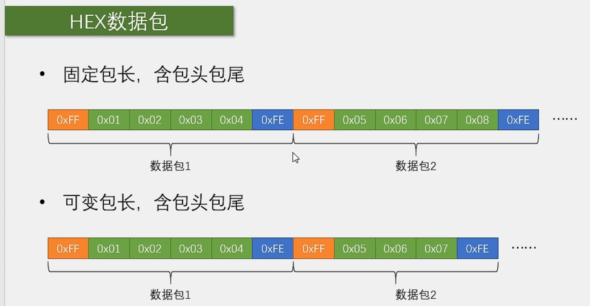

​	优点：传输最直接，解析数据非常简单，比较适合一些模块发送原始的数据。比如一些使用串口通信的陀螺仪，温湿度传感器等等

​	缺点：灵活性不足。载荷容易和包头包尾重复


**文本数据包**


​	优点：数据直观易理解，非常灵活，比较适合一些输入指令进行人机交互的场合，比如蓝牙4G模块常用的AT指令，CNC和3D打印常用的G代码，都是文本数据包的格式

​	缺点：解析效率低，比如你发送一个数100，HEX就是数字100，文本包就是三个字符“1” “0” “0”，收到之后还要把字符转换成数据，才能得到100.


**总结：**

​	我们需要根据实际场景来选择和设计数据包格式。


## 数据包收发流程

### 数据包发送


很简单：

HEX：定义数组，填充数据，然后SendByte

文本：定义字符串，SendString


### 数据包接收：状态机

**HEX数据包接收**


**文本数据包接收**

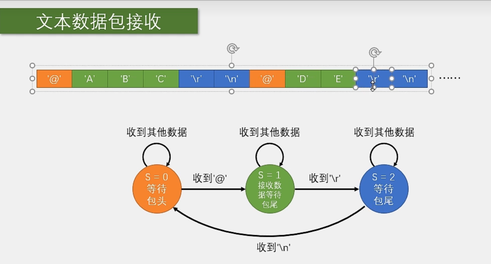


# 【9-5】串口收发HEX&文本数据包

## 串口接收HEX数据包

### 接线图


### 程序实例

**Serial.h**

```c
#ifndef __SERIAL_H
#define __SERIAL_H

#include <stdio.h>

extern uint8_t Serial_TxPacket[];
extern uint8_t Serial_RxPacket[];

void Serial_Init(void);
void Serial_SendByte(uint8_t Byte);
void Serial_SendArray(uint8_t *Array, uint16_t Length);
void Serial_SendString(char *String);
void Serial_SendNumber(uint32_t Number, uint8_t Length);
void Serial_Printf(char *format, ...);

void Serial_SendPacket(void);
uint8_t Serial_GetRxFlag(void);

#endif

```

**Serial.c**

```c
#include "stm32f10x.h"                  // Device header
#include <stdio.h>
#include <stdarg.h>

uint8_t Serial_TxPacket[4];				//定义发送数据包数组，数据包格式：FF 01 02 03 04 FE
uint8_t Serial_RxPacket[4];				//定义接收数据包数组
uint8_t Serial_RxFlag;					//定义接收数据包标志位

/**
  * 函    数：串口初始化
  * 参    数：无
  * 返 回 值：无
  */
void Serial_Init(void)
{
	/*开启时钟*/
	RCC_APB2PeriphClockCmd(RCC_APB2Periph_USART1, ENABLE);	//开启USART1的时钟
	RCC_APB2PeriphClockCmd(RCC_APB2Periph_GPIOA, ENABLE);	//开启GPIOA的时钟
	
	/*GPIO初始化*/
	GPIO_InitTypeDef GPIO_InitStructure;
	GPIO_InitStructure.GPIO_Mode = GPIO_Mode_AF_PP;
	GPIO_InitStructure.GPIO_Pin = GPIO_Pin_9;
	GPIO_InitStructure.GPIO_Speed = GPIO_Speed_50MHz;
	GPIO_Init(GPIOA, &GPIO_InitStructure);					//将PA9引脚初始化为复用推挽输出
	
	GPIO_InitStructure.GPIO_Mode = GPIO_Mode_IPU;
	GPIO_InitStructure.GPIO_Pin = GPIO_Pin_10;
	GPIO_InitStructure.GPIO_Speed = GPIO_Speed_50MHz;
	GPIO_Init(GPIOA, &GPIO_InitStructure);					//将PA10引脚初始化为上拉输入
	
	/*USART初始化*/
	USART_InitTypeDef USART_InitStructure;					//定义结构体变量
	USART_InitStructure.USART_BaudRate = 9600;				//波特率
	USART_InitStructure.USART_HardwareFlowControl = USART_HardwareFlowControl_None;	//硬件流控制，不需要
	USART_InitStructure.USART_Mode = USART_Mode_Tx | USART_Mode_Rx;	//模式，发送模式和接收模式均选择
	USART_InitStructure.USART_Parity = USART_Parity_No;		//奇偶校验，不需要
	USART_InitStructure.USART_StopBits = USART_StopBits_1;	//停止位，选择1位
	USART_InitStructure.USART_WordLength = USART_WordLength_8b;		//字长，选择8位
	USART_Init(USART1, &USART_InitStructure);				//将结构体变量交给USART_Init，配置USART1
	
	/*中断输出配置*/
	USART_ITConfig(USART1, USART_IT_RXNE, ENABLE);			//开启串口接收数据的中断
	
	/*NVIC中断分组*/
	NVIC_PriorityGroupConfig(NVIC_PriorityGroup_2);			//配置NVIC为分组2
	
	/*NVIC配置*/
	NVIC_InitTypeDef NVIC_InitStructure;					//定义结构体变量
	NVIC_InitStructure.NVIC_IRQChannel = USART1_IRQn;		//选择配置NVIC的USART1线
	NVIC_InitStructure.NVIC_IRQChannelCmd = ENABLE;			//指定NVIC线路使能
	NVIC_InitStructure.NVIC_IRQChannelPreemptionPriority = 1;		//指定NVIC线路的抢占优先级为1
	NVIC_InitStructure.NVIC_IRQChannelSubPriority = 1;		//指定NVIC线路的响应优先级为1
	NVIC_Init(&NVIC_InitStructure);							//将结构体变量交给NVIC_Init，配置NVIC外设
	
	/*USART使能*/
	USART_Cmd(USART1, ENABLE);								//使能USART1，串口开始运行
}

/**
  * 函    数：串口发送一个字节
  * 参    数：Byte 要发送的一个字节
  * 返 回 值：无
  */
void Serial_SendByte(uint8_t Byte)
{
	USART_SendData(USART1, Byte);		//将字节数据写入数据寄存器，写入后USART自动生成时序波形
	while (USART_GetFlagStatus(USART1, USART_FLAG_TXE) == RESET);	//等待发送完成
	/*下次写入数据寄存器会自动清除发送完成标志位，故此循环后，无需清除标志位*/
}

/**
  * 函    数：串口发送一个数组
  * 参    数：Array 要发送数组的首地址
  * 参    数：Length 要发送数组的长度
  * 返 回 值：无
  */
void Serial_SendArray(uint8_t *Array, uint16_t Length)
{
	uint16_t i;
	for (i = 0; i < Length; i ++)		//遍历数组
	{
		Serial_SendByte(Array[i]);		//依次调用Serial_SendByte发送每个字节数据
	}
}

/**
  * 函    数：串口发送一个字符串
  * 参    数：String 要发送字符串的首地址
  * 返 回 值：无
  */
void Serial_SendString(char *String)
{
	uint8_t i;
	for (i = 0; String[i] != '\0'; i ++)//遍历字符数组（字符串），遇到字符串结束标志位后停止
	{
		Serial_SendByte(String[i]);		//依次调用Serial_SendByte发送每个字节数据
	}
}

/**
  * 函    数：次方函数（内部使用）
  * 返 回 值：返回值等于X的Y次方
  */
uint32_t Serial_Pow(uint32_t X, uint32_t Y)
{
	uint32_t Result = 1;	//设置结果初值为1
	while (Y --)			//执行Y次
	{
		Result *= X;		//将X累乘到结果
	}
	return Result;
}

/**
  * 函    数：串口发送数字
  * 参    数：Number 要发送的数字，范围：0~4294967295
  * 参    数：Length 要发送数字的长度，范围：0~10
  * 返 回 值：无
  */
void Serial_SendNumber(uint32_t Number, uint8_t Length)
{
	uint8_t i;
	for (i = 0; i < Length; i ++)		//根据数字长度遍历数字的每一位
	{
		Serial_SendByte(Number / Serial_Pow(10, Length - i - 1) % 10 + '0');	//依次调用Serial_SendByte发送每位数字
	}
}

/**
  * 函    数：使用printf需要重定向的底层函数
  * 参    数：保持原始格式即可，无需变动
  * 返 回 值：保持原始格式即可，无需变动
  */
int fputc(int ch, FILE *f)
{
	Serial_SendByte(ch);			//将printf的底层重定向到自己的发送字节函数
	return ch;
}

/**
  * 函    数：自己封装的prinf函数
  * 参    数：format 格式化字符串
  * 参    数：... 可变的参数列表
  * 返 回 值：无
  */
void Serial_Printf(char *format, ...)
{
	char String[100];				//定义字符数组
	va_list arg;					//定义可变参数列表数据类型的变量arg
	va_start(arg, format);			//从format开始，接收参数列表到arg变量
	vsprintf(String, format, arg);	//使用vsprintf打印格式化字符串和参数列表到字符数组中
	va_end(arg);					//结束变量arg
	Serial_SendString(String);		//串口发送字符数组（字符串）
}

/**
  * 函    数：串口发送数据包
  * 参    数：无
  * 返 回 值：无
  * 说    明：调用此函数后，Serial_TxPacket数组的内容将加上包头（FF）包尾（FE）后，作为数据包发送出去
  */
void Serial_SendPacket(void)
{
	Serial_SendByte(0xFF);
	Serial_SendArray(Serial_TxPacket, 4);
	Serial_SendByte(0xFE);
}

/**
  * 函    数：获取串口接收数据包标志位
  * 参    数：无
  * 返 回 值：串口接收数据包标志位，范围：0~1，接收到数据包后，标志位置1，读取后标志位自动清零
  */
uint8_t Serial_GetRxFlag(void)
{
	if (Serial_RxFlag == 1)			//如果标志位为1
	{
		Serial_RxFlag = 0;
		return 1;					//则返回1，并自动清零标志位
	}
	return 0;						//如果标志位为0，则返回0
}

/**
  * 函    数：USART1中断函数
  * 参    数：无
  * 返 回 值：无
  * 注意事项：此函数为中断函数，无需调用，中断触发后自动执行
  *           函数名为预留的指定名称，可以从启动文件复制
  *           请确保函数名正确，不能有任何差异，否则中断函数将不能进入
  */
void USART1_IRQHandler(void)
{
	static uint8_t RxState = 0;		//定义表示当前状态机状态的静态变量
	static uint8_t pRxPacket = 0;	//定义表示当前接收数据位置的静态变量
	if (USART_GetITStatus(USART1, USART_IT_RXNE) == SET)		//判断是否是USART1的接收事件触发的中断
	{
		uint8_t RxData = USART_ReceiveData(USART1);				//读取数据寄存器，存放在接收的数据变量
		
		/*使用状态机的思路，依次处理数据包的不同部分*/
		
		/*当前状态为0，接收数据包包头*/
		if (RxState == 0)
		{
			if (RxData == 0xFF)			//如果数据确实是包头
			{
				RxState = 1;			//置下一个状态
				pRxPacket = 0;			//数据包的位置归零
			}
		}
		/*当前状态为1，接收数据包数据*/
		else if (RxState == 1)
		{
			Serial_RxPacket[pRxPacket] = RxData;	//将数据存入数据包数组的指定位置
			pRxPacket ++;				//数据包的位置自增
			if (pRxPacket >= 4)			//如果收够4个数据
			{
				RxState = 2;			//置下一个状态
			}
		}
		/*当前状态为2，接收数据包包尾*/
		else if (RxState == 2)
		{
			if (RxData == 0xFE)			//如果数据确实是包尾部
			{
				RxState = 0;			//状态归0
				Serial_RxFlag = 1;		//接收数据包标志位置1，成功接收一个数据包
			}
		}
		
		USART_ClearITPendingBit(USART1, USART_IT_RXNE);		//清除标志位
	}
}

```


**main.c**

```c
#include "stm32f10x.h"                  // Device header
#include "Delay.h"
#include "OLED.h"
#include "Serial.h"
#include "Key.h"

uint8_t KeyNum;			//定义用于接收按键键码的变量

int main(void)
{
	/*模块初始化*/
	OLED_Init();		//OLED初始化
	Key_Init();			//按键初始化
	Serial_Init();		//串口初始化
	
	/*显示静态字符串*/
	OLED_ShowString(1, 1, "TxPacket");
	OLED_ShowString(3, 1, "RxPacket");
	
	/*设置发送数据包数组的初始值，用于测试*/
	Serial_TxPacket[0] = 0x01;
	Serial_TxPacket[1] = 0x02;
	Serial_TxPacket[2] = 0x03;
	Serial_TxPacket[3] = 0x04;
	
	while (1)
	{
		KeyNum = Key_GetNum();			//获取按键键码
		if (KeyNum == 1)				//按键1按下
		{
			Serial_TxPacket[0] ++;		//测试数据自增
			Serial_TxPacket[1] ++;
			Serial_TxPacket[2] ++;
			Serial_TxPacket[3] ++;
			
			Serial_SendPacket();		//串口发送数据包Serial_TxPacket
			
			OLED_ShowHexNum(2, 1, Serial_TxPacket[0], 2);	//显示发送的数据包
			OLED_ShowHexNum(2, 4, Serial_TxPacket[1], 2);
			OLED_ShowHexNum(2, 7, Serial_TxPacket[2], 2);
			OLED_ShowHexNum(2, 10, Serial_TxPacket[3], 2);
		}
		
		if (Serial_GetRxFlag() == 1)	//如果接收到数据包
		{
			OLED_ShowHexNum(4, 1, Serial_RxPacket[0], 2);	//显示接收的数据包
			OLED_ShowHexNum(4, 4, Serial_RxPacket[1], 2);
			OLED_ShowHexNum(4, 7, Serial_RxPacket[2], 2);
			OLED_ShowHexNum(4, 10, Serial_RxPacket[3], 2);
		}
	}
}

```


## 串口接收文本数据包

### 接线图


### 程序实例


# 【9-6】FlyMcu & STLINK Utility

## FlyMcu

​	**相当于STM32版本的STC-ISP，就是给32烧录程序的**


### 串口下载流程：

​	1.硬件部分：使用CH340，接USART1，因为芯片仅适配了USART1的下载，下面是接线图：


​	2.软件部分：在Keil5里面生成Hex文件，流程和51单片机是一样的。

​	3.在Fly里面：搜索串口，找到端口号，然后默认波特率115200，然后选择HEX文件。

​	**但是在开始编程之前，我们还需要配置BOOT引脚，让STM32执行BootLoader程序，否则电机开始编程会一直卡住**：

​				1.拔掉STM32上面的跳线帽，该跳线帽是用来配置BOOT0引脚的，然后插在右边两个针脚，配置BOOT0为1，如下图：


​				2.一定要再按一下复位键，因为STM32只有在刚复位时才会读取BOOT引脚，程序运行之后，切换BOOT引脚是无效的.

​				那这样，芯片就进入BootLoader程序了。**此时STM32执行的程序就是;不断USART1的数据，刷新到主闪存。


​	4.然后就可以点击Fly里面的开始编程，这样就下载成功了，但是程序还没有执行烧录的代码，这是因为STM32还在下载模式，还需要：

​	5.拔掉BOOT0的跳线帽，换到左边两个引脚，然后按一下复位。这样就成功了。


### 引导问题

#### 串口下载原理


系统存储器里的BootLoader程序在接收来自串口的数据之后，原封不动的写到程序存储器Flash里面。而BootLoader本身就是一个程序，参考下面的比喻：

​	机器人给自己换电池，本身就需要内置一个小机器人，在需要换电池的时候就启动小机器人给大机器人换电池，换完电池之后小机器人停止运行再返回大机器人运行。

​	同理，STM32通过串口实现自我程序更新，就需要这样一个小机器人，这个小机器人就是BootLoader
