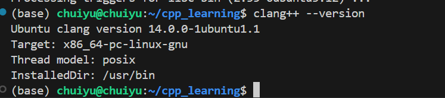

这通常会安装 Ubuntu 官方仓库里认为“稳定”的版本（比如 Ubuntu 20.04 可能是 Clang 10，22.04 可能是 Clang 14）。

```bash
sudo apt update
sudo apt install clang
```

安装完成后，检查版本：


```bash
clang++ --version
```


> [!NOTE]
> **区分宿主机与目标机：**
> 1.你现在安装的 clang++ 是 x86 架构 的编译器，生成的程序只能在你的 电脑/虚拟机 上跑。
> 2.不要 尝试用这个 clang++ 编译代码后传到 RV1106 或 Hi3519 上去运行，会报错 Exec format error。
> 
> **交叉编译：**
> 1.板子上用的仍然是厂家 SDK 提供的 arm-rockchip...-gcc 或 arm-hisiv...-gcc。
> 2.虽然 Clang 也支持交叉编译，但在嵌入式 Linux 圈子里，配置 Clang 进行交叉编译（指定 sysroot、头文件路径）比较麻烦，建议初学阶段：PC 上学 C++ 用 Clang，板子上开发用 SDK 自带的 GCC。

