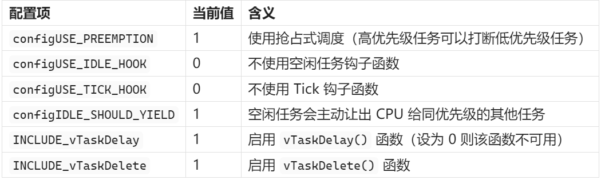
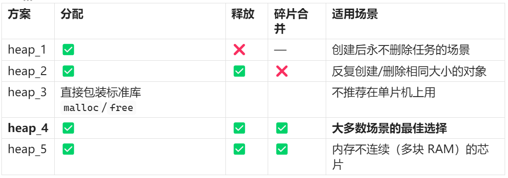
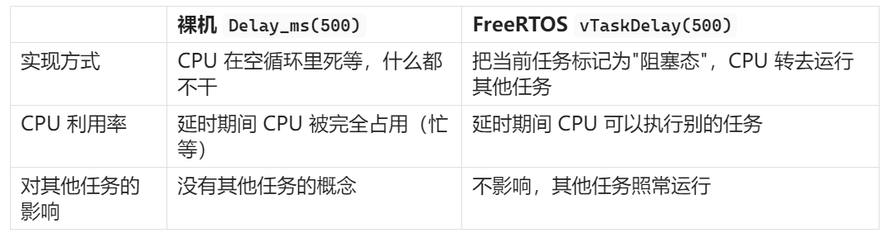
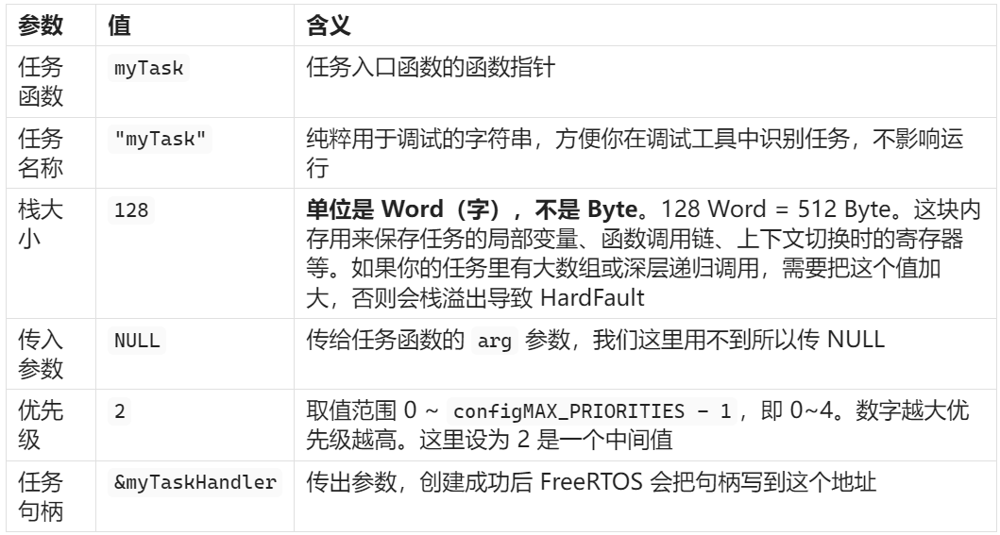

## 0.RTOS介绍

> [!NOTE]
> ### 什么是 FreeRTOS？为什么要用它？
> 在学习移植之前，先搞清楚一个最基本的问题：我们为什么需要 RTOS？
> 到目前为止，我们写的所有 STM32 程序都是"裸机"程序，结构大概长这样：
> ```c
> int main(void)
> {
>     LED_Init();
>     OLED_Init();
>     while (1)
>     {
>         // 读传感器
>         // 刷屏
>         // 控制电机
>         // ...
>     }
> }
> ```
> 所有功能都塞在一个 `while(1)` 大循环里，按顺序一个一个执行。这种方式叫**轮询（Polling）**。它的问题是：如果某个任务耗时较长（比如等待串口数据），后面的任务就得排队等着，整个系统的实时性就变差了。
> 
> RTOS（Real-Time Operating System，实时操作系统）的做法不一样：**它把程序拆成多个独立的"任务（Task）"，由内核的调度器来决定当前该运行哪个任务**。每个任务都像是在独占 CPU 一样运行自己的 `while(1)`，调度器在背后快速切换，让它们"同时"运行。
> 
> FreeRTOS 是目前最流行的嵌入式 RTOS 之一，代码开源、体积小、移植简单，非常适合 STM32 这类资源有限的单片机。
> 
> 下面，我们开始把 FreeRTOS 移植到 STM32F103 的标准库工程中。


## 1.准备资料

去到FreeRTOS官网下载源码：[FreeRTOS™ - FreeRTOS™](https://www.freertos.org/)


然后准备标准库工程模板：


即是下面这两个文件：


> [!NOTE]
> ### FreeRTOS 源码的目录结构
> 
> 在复制文件之前，先花一分钟了解一下 FreeRTOS 源码的组织方式，这样后面的操作你就知道"为什么要从那个目录里拿文件"了。
> 
> 打开下载好的源码，找到 `FreeRTOS-LTS/FreeRTOS/FreeRTOS-Kernel/`，这就是 FreeRTOS 的内核目录，里面的结构大致如下：
> ```xml
> FreeRTOS-Kernel/
> ├── include/          ← 内核头文件（FreeRTOS.h、task.h、queue.h 等）
> ├── portable/         ← 移植适配层（不同芯片/编译器的底层实现）
> │   ├── MemMang/      ← 内存管理方案（heap_1.c ~ heap_5.c）
> │   ├── RVDS/         ← 针对 Keil (RVDS/ARM Compiler) 的适配
> │   │   ├── ARM_CM3/  ← Cortex-M3 内核专用（STM32F103 就是 CM3）
> │   │   ├── ARM_CM4F/ ← Cortex-M4 内核专用
> │   │   └── ...
> │   ├── GCC/          ← 针对 GCC 编译器的适配
> │   └── ...
> ├── croutine.c        ← 协程（基本不用）
> ├── event_groups.c    ← 事件组
> ├── list.c            ← 链表（内核基础数据结构）
> ├── queue.c           ← 队列（也是信号量、互斥锁的底层实现）
> ├── stream_buffer.c   ← 流缓冲区
> ├── tasks.c           ← 任务管理（内核最核心的文件）
> └── timers.c          ← 软件定时器
> ```
> 
> 可以看到，FreeRTOS 的内核其实就分成三部分：
> 
> 这就是为什么我们接下来要在工程里新建三个文件夹：
> 
> - **inc** → 对应 `include/`，放头文件
> - **src** → 对应根目录的那些 `.c` 文件，放内核源码
> - **port** → 对应 `portable/`，放跟我们芯片和编译器相关的适配代码
> 
> 理解了这个结构，后面复制文件的时候就不是在"照搬步骤"，而是知道每个文件是从哪来的、为什么要放到那里。


首先，我们在工程模板里新建一个FreeRTOS的文件夹：

然后再在FreeRTOS中新建三个文件夹：分别是inc、port、src


然后，去到Free RTOS源码的下面的目录中：
```
FreeRTOS\FreeRTOS-LTS\FreeRTOS\FreeRTOS-Kernel\include
```
把该目录下的所有文件全部复制到inc文件夹中：


然后，再去到MemMang文件夹，复制到port文件夹下：


同样的，复制RVDS/ARM_CM3的所有文件到port文件夹：


> [!NOTE]
> ### 为什么选 RVDS/ARM_CM3？
> 
> 你可能注意到 `portable/` 目录下有很多文件夹：GCC、RVDS、IAR……这些对应的是**不同的编译器**。我们用的是 Keil，Keil 底层的编译器就是 ARM 公司的 RVDS（现在叫 ARM Compiler），所以选 `RVDS/` 目录。
> 
> 进入 `RVDS/` 之后又看到 ARM_CM0、ARM_CM3、ARM_CM4F 等子目录，这些对应的是**不同的 ARM 内核架构**。STM32F103 使用的是 Cortex-M3 内核，所以选 `ARM_CM3/`。
> 
> 这两个文件里的内容是什么？
> 
> - **port.c** — 实现了 FreeRTOS 在 Cortex-M3 上运行所需的底层操作，包括：启动第一个任务、触发上下文切换（任务之间的 CPU 切换）、配置 SysTick 定时器等。里面有不少汇编代码，因为这些操作涉及直接操纵 CPU 寄存器，C 语言做不了。
> - **portmacro.h** — 定义了一些与硬件相关的基本类型和宏，比如 `TickType_t` 用多少位、临界区怎么进出等。
> 
> 简单说：**port.c 和 portmacro.h 就是 FreeRTOS 内核与具体硬件之间的"翻译层"**。内核本身不关心你用的是什么芯片，这两个文件负责告诉内核怎么在你的芯片上完成那些底层操作。
> 
> 如果你以后换了芯片（比如 STM32F407，Cortex-M4F 内核），只需要把这两个文件换成 `ARM_CM4F/` 目录下的版本就行，内核代码完全不用动。


然后，回到FreeRTOS-Kernel文件夹，将当前文件夹下的下面几个文件复制到src文件夹当中：


然后，将STM32F103专门配套的config配置文件放到下面的目录下，因为最新版本的FreeRTOS当中并没有附带该文件了，所以这里我们手动创建一个，名称为FreeRTOSConifg.h,内容如下：
```c
/*
 * FreeRTOS V202107.00
 * Copyright (C) 2020 Amazon.com, Inc. or its affiliates.  All Rights Reserved.
 *
 * Permission is hereby granted, free of charge, to any person obtaining a copy of
 * this software and associated documentation files (the "Software"), to deal in
 * the Software without restriction, including without limitation the rights to
 * use, copy, modify, merge, publish, distribute, sublicense, and/or sell copies of
 * the Software, and to permit persons to whom the Software is furnished to do so,
 * subject to the following conditions:
 *
 * The above copyright notice and this permission notice shall be included in all
 * copies or substantial portions of the Software.
 *
 * THE SOFTWARE IS PROVIDED "AS IS", WITHOUT WARRANTY OF ANY KIND, EXPRESS OR
 * IMPLIED, INCLUDING BUT NOT LIMITED TO THE WARRANTIES OF MERCHANTABILITY, FITNESS
 * FOR A PARTICULAR PURPOSE AND NONINFRINGEMENT. IN NO EVENT SHALL THE AUTHORS OR
 * COPYRIGHT HOLDERS BE LIABLE FOR ANY CLAIM, DAMAGES OR OTHER LIABILITY, WHETHER
 * IN AN ACTION OF CONTRACT, TORT OR OTHERWISE, ARISING FROM, OUT OF OR IN
 * CONNECTION WITH THE SOFTWARE OR THE USE OR OTHER DEALINGS IN THE SOFTWARE.
 *
 * http://www.FreeRTOS.org
 * http://aws.amazon.com/freertos
 *
 * 1 tab == 4 spaces!
 */

#ifndef FREERTOS_CONFIG_H
#define FREERTOS_CONFIG_H

/*-----------------------------------------------------------
 * Application specific definitions.
 *
 * These definitions should be adjusted for your particular hardware and
 * application requirements.
 *
 * THESE PARAMETERS ARE DESCRIBED WITHIN THE 'CONFIGURATION' SECTION OF THE
 * FreeRTOS API DOCUMENTATION AVAILABLE ON THE FreeRTOS.org WEB SITE. 
 *
 * See http://www.freertos.org/a00110.html
 *----------------------------------------------------------*/

#define configUSE_PREEMPTION		1
#define configUSE_IDLE_HOOK			0
#define configUSE_TICK_HOOK			0
#define configCPU_CLOCK_HZ			( ( unsigned long ) 72000000 )	
#define configTICK_RATE_HZ			( ( TickType_t ) 1000 )
#define configMAX_PRIORITIES		( 5 )
#define configMINIMAL_STACK_SIZE	( ( unsigned short ) 128 )
#define configTOTAL_HEAP_SIZE		( ( size_t ) ( 17 * 1024 ) )
#define configMAX_TASK_NAME_LEN		( 16 )
#define configUSE_TRACE_FACILITY	0
#define configUSE_16_BIT_TICKS		0
#define configIDLE_SHOULD_YIELD		1

/* Co-routine definitions. */
#define configUSE_CO_ROUTINES 		0
#define configMAX_CO_ROUTINE_PRIORITIES ( 2 )

/* Set the following definitions to 1 to include the API function, or zero
to exclude the API function. */

#define INCLUDE_vTaskPrioritySet		1
#define INCLUDE_uxTaskPriorityGet		1
#define INCLUDE_vTaskDelete				1
#define INCLUDE_vTaskCleanUpResources	0
#define INCLUDE_vTaskSuspend			1
#define INCLUDE_vTaskDelayUntil			1
#define INCLUDE_vTaskDelay				1

/* This is the raw value as per the Cortex-M3 NVIC.  Values can be 255
(lowest) to 0 (1?) (highest). */
#define configKERNEL_INTERRUPT_PRIORITY 		255
/* !!!! configMAX_SYSCALL_INTERRUPT_PRIORITY must not be set to zero !!!!
See http://www.FreeRTOS.org/RTOS-Cortex-M3-M4.html. */
#define configMAX_SYSCALL_INTERRUPT_PRIORITY 	191 /* equivalent to 0xb0, or priority 11. */


/* This is the value being used as per the ST library which permits 16
priority values, 0 to 15.  This must correspond to the
configKERNEL_INTERRUPT_PRIORITY setting.  Here 15 corresponds to the lowest
NVIC value of 255. */
#define configLIBRARY_KERNEL_INTERRUPT_PRIORITY	15

#endif /* FREERTOS_CONFIG_H */

```


> [!NOTE]
> ### FreeRTOSConfig.h 关键配置项解读
> 
> 这个文件是整个 FreeRTOS 的"总开关"，内核的几乎所有行为都由它控制。你不需要现在就记住每一项，但下面这几个参数务必理解，因为**配错了轻则功能异常，重则直接 HardFault**：
> 
> ```c
> #define configCPU_CLOCK_HZ    ( ( unsigned long ) 72000000 )
> ```
> 
> CPU 主频，单位 Hz。STM32F103 默认跑 72MHz，所以填 72000000。这个值**必须和你实际的系统时钟一致**，否则 FreeRTOS 的时间基准会全部算错——比如你写 `vTaskDelay(500)` 想延时 500ms，实际可能变成 250ms 或 1000ms。
> 
> ```c
> #define configTICK_RATE_HZ    ( ( TickType_t ) 1000 )
> ```
> 
> 系统节拍频率，即 SysTick 中断每秒触发多少次。设为 1000 表示每 1ms 中断一次，也就是说 FreeRTOS 的时间精度是 1ms。`vTaskDelay(500)` 就是延时 500 个 Tick = 500ms。这个值设太高会增加中断开销，设太低会降低时间精度，**1000 是最常用的值**。
> 
> ```c
> #define configMAX_PRIORITIES  ( 5 )
> ```
> 
> 任务优先级的最大数量。优先级从 0（最低）到 `configMAX_PRIORITIES - 1`（最高）。设为 5 意味着你可以用 0~4 这 5 个优先级。对于入门项目来说足够了，后面根据需要可以加大。
> 
> ```c
> #define configMINIMAL_STACK_SIZE  ( ( unsigned short ) 128 )
> ```
> 
> 空闲任务（Idle Task）的栈大小，**单位是 Word（字），不是 Byte（字节）**。128 Word = 128 × 4 = 512 Byte。这是 FreeRTOS 自带的空闲任务使用的栈大小，一般不需要改。但注意：你自己用 `xTaskCreate` 创建任务时，第三个参数的栈大小也是以 Word 为单位的，这是很多初学者踩的坑。
> 
> ```c
> #define configTOTAL_HEAP_SIZE  ( ( size_t ) ( 17 * 1024 ) )
> ```
> 
> FreeRTOS 可用的总堆内存，单位是 Byte。设为 17KB。STM32F103VET6 有 64KB RAM，这里拿出 17KB 给 FreeRTOS 用来创建任务、队列等。**如果你创建任务时返回失败（返回 NULL），第一件事就是来看这个值够不够大**。但也不能设太大，得给全局变量、栈等留足空间。
> 
> 其他几个常见的：
> 
> 
> 
> 底部那三个中断优先级相关的宏（`configKERNEL_INTERRUPT_PRIORITY` 等），我们在下一章修改配置时再详细说。


## 2.工程配置


然后，把每个文件夹对应的文件都添加进去，非.c和.h类型的文件可以不需要添加进去


inc、port、src都要添加进去

> [!NOTE]
> port部分只需要加入heap4和port.c、portmacro.h
> 

> [!NOTE]
> ### 为什么选 heap_4.c？
> 
> MemMang 目录下有 5 个文件：heap_1.c 到 heap_5.c，它们是 FreeRTOS 提供的 5 种内存管理方案。为什么需要选？因为 FreeRTOS 创建任务、队列、信号量等都需要动态分配内存，而单片机上没有 Linux 那样的 `malloc`，所以 FreeRTOS 自己实现了内存分配。
> 
> 5 种方案的区别：
> 
> 
> 
> **heap_4 支持分配、释放，还能把相邻的空闲块合并起来减少碎片**，对于 STM32F103 这种只有一块连续 RAM 的芯片来说，它是最实用的选择。你以后的项目如果没有特殊需求，选 heap_4 就对了。

> [!NOTE]
> ### 为什么 port 组只添加这三个文件？
> 
> 我们从 MemMang 复制了 heap_1.c 到 heap_5.c 共 5 个文件到 port 文件夹，但加入工程时**只添加了 heap_4.c**。原因很简单：这 5 个文件都实现了同一组函数（`pvPortMalloc` 和 `vPortFree`），如果同时加入多个，链接时会报"重复定义"错误。你选了哪种方案，就只加哪个 `.c` 文件。
> 
> port.c 和 portmacro.h 则是 Cortex-M3 的硬件适配层，前面已经介绍过，是必须加入的。

	最后，在inc里加入FreeRTOS根目录的config文件：


> [!NOTE]
> 插入完以后，可以将该配置文件挪到最前面，以方便修改时快速打开
> 

下面，点击魔术棒，将引用目录添加到工程当中，如下图所示：


完成以后，点击编译，正常情况的话0错误0警告：


## 3.修改配置

> [!NOTE]
> ### 为什么需要修改配置？
> 
> 到上一步为止，FreeRTOS 的源码已经加入工程并且能编译通过了。但这不代表它能正常运行——FreeRTOS 内核要工作，必须"接管"三个关键的系统中断。这一步就是告诉编译器：这三个中断不再由标准库的默认函数处理，改由 FreeRTOS 来处理。

下面，我们在config文件中添加中断定义：

```c
#define xPortPendSVHandler PendSV_Handler
#define vPortSVCHandler SVC_Handler
#define xPortSysTickHandler SysTick_Handler
```

> [!NOTE]
> ### 这三个中断分别干什么？
> 
> 我们添加的三行宏是这样的：
> 
> 
> ```c
> #define xPortPendSVHandler    PendSV_Handler
> #define vPortSVCHandler       SVC_Handler
> #define xPortSysTickHandler   SysTick_Handler
> ```
> 
> 等号左边是 FreeRTOS 内部的函数名，右边是 STM32 标准库启动文件（`startup_stm32f10x_hd.s`）中定义的中断入口名。这三行 `#define` 的作用就是把 FreeRTOS 的函数"映射"到 STM32 的中断向量表上，让硬件触发中断时直接跳进 FreeRTOS 的代码。
> 
> 这三个中断在 FreeRTOS 中各自承担着不可替代的角色：
> 
> **SysTick_Handler — 系统心跳**
> 
> SysTick 是 Cortex-M3 内核自带的定时器，FreeRTOS 把它配置成每 1ms 中断一次（由 `configTICK_RATE_HZ = 1000` 决定）。每次中断时，FreeRTOS 会做两件事：一是把内部的 Tick 计数器加 1（这是所有延时和超时的时间基准），二是检查有没有任务因为延时到期需要被唤醒。可以说 **SysTick 就是 FreeRTOS 的"心跳"**，没有它内核就丧失了时间感知能力。
> 
> **PendSV_Handler — 任务切换的执行者**
> 
> 当调度器决定要从任务 A 切换到任务 B 时，实际的上下文切换（保存 A 的寄存器、恢复 B 的寄存器）就是在 PendSV 中断里完成的。为什么不直接在 SysTick 里切换？因为 SysTick 中断可能会打断其他更重要的中断，如果在 SysTick 里做耗时的上下文切换操作，会影响系统的实时性。**PendSV 被设置为最低优先级的中断**，它会等所有其他中断都处理完之后才执行，这样就不会干扰其他中断的响应。
> 
> **SVC_Handler — 启动第一个任务**
> 
> SVC（Supervisor Call）是一条 ARM 指令触发的异常。FreeRTOS 只在一个地方用到它：**当你调用 `vTaskStartScheduler()` 启动调度器时，内核通过 SVC 指令切换到第一个任务开始运行**。之后的任务切换全部由 PendSV 完成，SVC 就不再使用了。你可以把它理解为"发令枪"——只响一次，但没有它比赛就开始不了。
> 
> 三者的协作关系可以概括为：
> 
> ```
> vTaskStartScheduler()
>        │
>        ▼
>    SVC 中断 ──→ 启动第一个任务
>                       │
>                       ▼
>               任务正常运行中...
>                       │
>          ┌─────────────┤
>          ▼             │
>    SysTick 中断        │
>    (每1ms触发)         │
>      │                 │
>      ├─ Tick计数+1     │
>      ├─ 检查延时到期    │
>      └─ 需要切换任务？──┤
>            │ 是        │
>            ▼           │
>       触发 PendSV ─────┤
>       (等中断空闲时     │
>        执行上下文切换)  │
>            │           │
>            ▼           │
>       切换到新任务 ─────┘
> ```
> 

定义完成之后，我们还需要去原本标准库中定义的文件中将其关掉(注释掉)


> [!NOTE]
> ### 为什么要注释掉 stm32f10x_it.c 里的原有定义？
> 
> `stm32f10x_it.c` 是 STM32 标准库的中断处理文件，里面默认提供了 `SVC_Handler`、`PendSV_Handler`、`SysTick_Handler` 这三个函数的空实现（函数体是空的，什么都不做）。
> 
> 而我们刚才在 `FreeRTOSConfig.h` 中通过 `#define` 把 FreeRTOS 的函数重命名成了这三个名字。这意味着现在有两个地方都定义了同名函数——标准库定义了一个空的，FreeRTOS 定义了一个有实际功能的。链接器遇到两个同名函数就会报错：`Symbol xxx multiply defined`。
> 
> 解决方法很简单：把 `stm32f10x_it.c` 里那三个空函数注释掉，让 FreeRTOS 的版本成为唯一的定义。
> 
> 需要注意的是：`stm32f10x_it.c` 里的其他中断函数（比如 `DebugMon_Handler`）不要动，它们跟 FreeRTOS 没有冲突。

修改完成之后，再次编译，正常情况下是0错误0警告：


至此，FreeRTOS操作系统移植完成。


## 4.测试验证

> [!NOTE]
> ### 用一个最简单的任务来验证移植是否成功
> 
> 移植完成后，我们需要写一段测试代码来确认 FreeRTOS 确实在正常工作。验证的思路很简单：创建一个任务，让它每隔 500ms 翻转一次 LED。如果 LED 在闪烁，说明任务调度器在正常运行、SysTick 在正常计时、上下文切换没有问题——整个移植就是成功的。

这里，我们编写一个测试的代码来进行功能验证：
```c
#include "stm32f10x.h"                  // Device header
#include "Delay.h"
#include "LED.h"
#include "FreeRTOS.h"	//导入FreeRTOS内核头文件
#include "Task.h"	//导入Task头文件

TaskHandle_t myTaskHandler;	//创建一个Task任务句柄

//任务函数
void myTask(void *arg)
{
	while(1)
	{
		LED1_Turn();
		vTaskDelay(500);

	}
	
}
int main(void)
{
	LED_Init();
//	LED1_ON();
	xTaskCreate(myTask,"myTask",128,NULL,2,&myTaskHandler);
	vTaskStartScheduler();
	
	while (1)
	{
	}
}


```


> [!NOTE]
> ### 测试代码逐行解读
> 
> 下面拆解一下这段代码里跟 FreeRTOS 相关的部分：
> 
> ```c
> #include "FreeRTOS.h"
> #include "Task.h"
> ```
> 
> `FreeRTOS.h` 是内核的总头文件，任何用到 FreeRTOS 的地方都必须包含它，而且**必须放在其他 FreeRTOS 头文件之前**。`Task.h` 提供了任务相关的 API（`xTaskCreate`、`vTaskDelay` 等）。
> 
> ```c
> TaskHandle_t myTaskHandler;
> ```
> 
> 任务句柄，可以理解为这个任务的"身份证号"。创建任务后，FreeRTOS 会把任务的控制信息填到这个句柄里。以后如果你想删除、挂起或查询这个任务的状态，就需要通过这个句柄来操作。如果你创建完任务之后不需要再操控它，这个参数也可以传 `NULL`。
> 
> ```c
> void myTask(void *arg)
> {
>     while(1)
>     {
>         LED1_Turn();
>         vTaskDelay(500);
>     }
> }
> ```
> 
> 这是任务函数。每个 FreeRTOS 任务都必须是一个**永远不会 return 的函数**（里面有一个死循环），参数固定为 `void *arg`。
> 
> 这里重点说一下 `vTaskDelay(500)` 和裸机中的 `Delay_ms(500)` 的区别，这是理解 RTOS 最关键的地方之一：
> 
> 
> 
> 换句话说，`vTaskDelay` 不是"让 CPU 等 500ms"，而是"这个任务先休息 500ms，CPU 你去忙别的"。500ms 后 SysTick 中断发现这个任务的延时到期了，就把它重新标记为"就绪态"，调度器会在合适的时机让它继续运行。
> 
> ```c
> xTaskCreate(myTask, "myTask", 128, NULL, 2, &myTaskHandler);
> ```
> 
> 创建任务的 API，6 个参数依次是：
> 
> 
> 
> ```c
> vTaskStartScheduler();
> ```
> 
> 启动调度器。调用这个函数后，FreeRTOS 会：
> 
> 1. 自动创建一个空闲任务（Idle Task），优先级为 0（最低）
> 2. 配置 SysTick 定时器，开始产生系统节拍中断
> 3. 通过 SVC 中断切换到当前最高优先级的就绪任务开始运行
> 
> **这个函数正常情况下永远不会返回。** 因为一旦调度器启动，CPU 的控制权就交给了 FreeRTOS，它会在各个任务之间不断切换。后面的 `while(1)` 理论上永远不会执行到——它存在的意义是"以防万一"（比如堆内存不足导致调度器启动失败）。
> 
> 整个程序的执行流程如下：
> 
> ```
> main()
>   │
>   ├─ LED_Init()                    ← 硬件初始化（还是裸机环境）
>   │
>   ├─ xTaskCreate(myTask, ...)      ← 创建任务（只是登记，还没运行）
>   │
>   ├─ vTaskStartScheduler()         ← 启动调度器，从此进入 RTOS 世界
>   │     │
>   │     ├─ 创建 Idle Task
>   │     ├─ 配置 SysTick
>   │     └─ SVC 中断 → 跳转到 myTask 开始运行
>   │                    │
>   │                    ├─ LED1_Turn()
>   │                    ├─ vTaskDelay(500) → 任务阻塞，切换到 Idle Task
>   │                    │                    (500ms 后被 SysTick 唤醒)
>   │                    ├─ LED1_Turn()
>   │                    ├─ vTaskDelay(500) → 再次阻塞...
>   │                    └─ ... 如此循环
>   │
>   └─ while(1) { }                  ← 永远不会执行到这里
> ```
> 

### 1.硬件直接烧录验证
编译烧录验证，如果观察到小灯每隔500毫秒闪烁一次，则说明FreeRTOS已经成功跑通。


### 2.软件仿真验证
相关配置如下：


然后点击仿真


打开逻辑分析仪窗口：

添加PB1作为逻辑信号


完成之后，点击Close

随后，点击全速运行：


这样，就可以在逻辑分析仪上看到电平信号了：


可以看到电平每隔500ms跳变一次，说明FreeRTOS任务运行正常，移植没问题。