## 1.准备资料

去到FreeRTOS官网下载源码：[FreeRTOS™ - FreeRTOS™](https://www.freertos.org/)
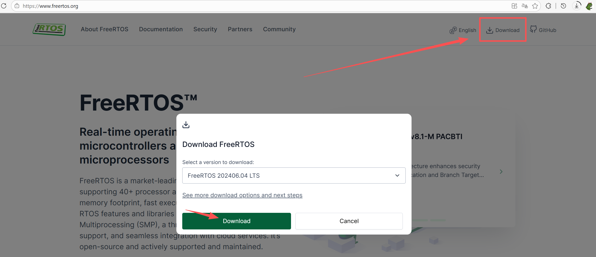

然后准备标准库工程模板：
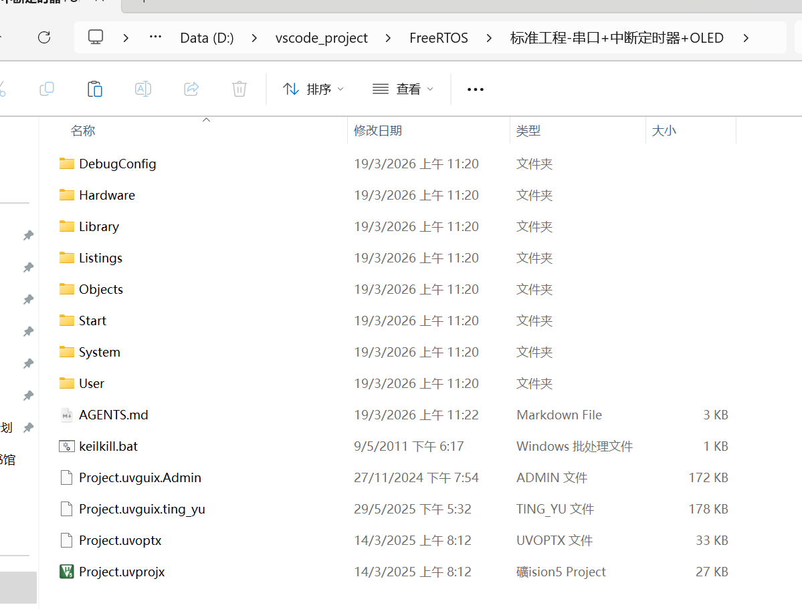

即是下面这两个文件：
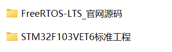
首先，我们在工程模板里新建一个FreeRTOS的文件夹：
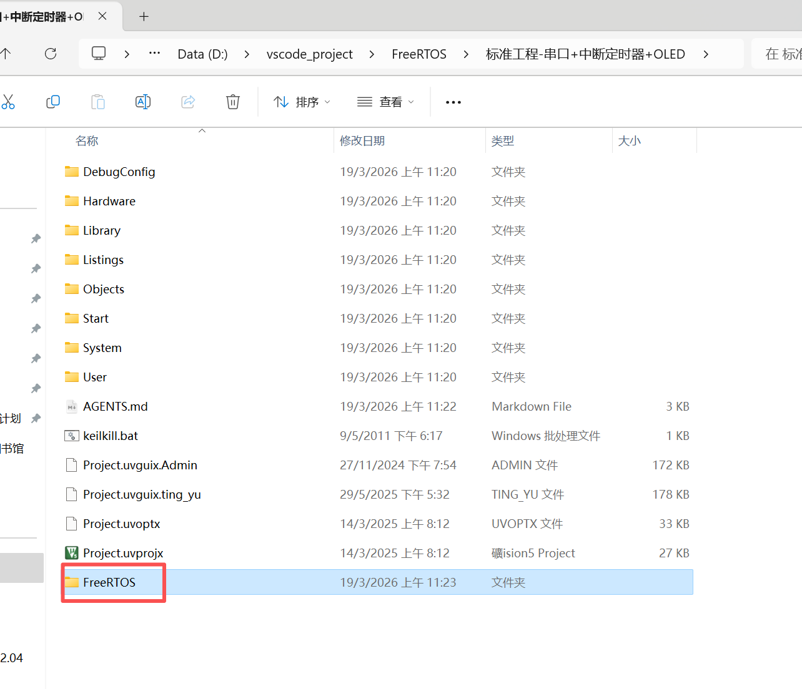
然后再在FreeRTOS中新建三个文件夹：分别是inc、port、src
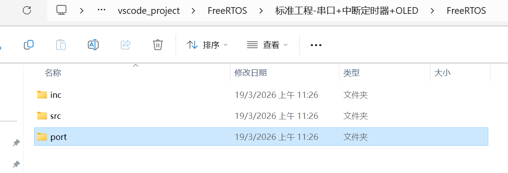

然后，去到Free RTOS源码的下面的目录中：
```
FreeRTOS\FreeRTOS-LTS\FreeRTOS\FreeRTOS-Kernel\include
```
把该目录下的所有文件全部复制到inc文件夹中：
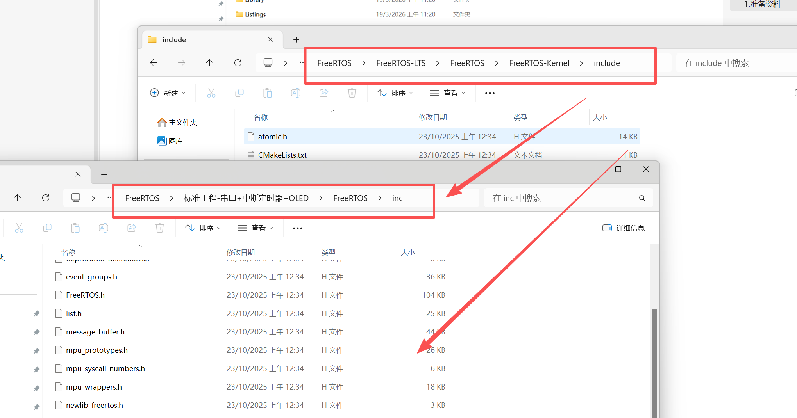

然后，再去到MemMang文件夹，复制到port文件夹下：
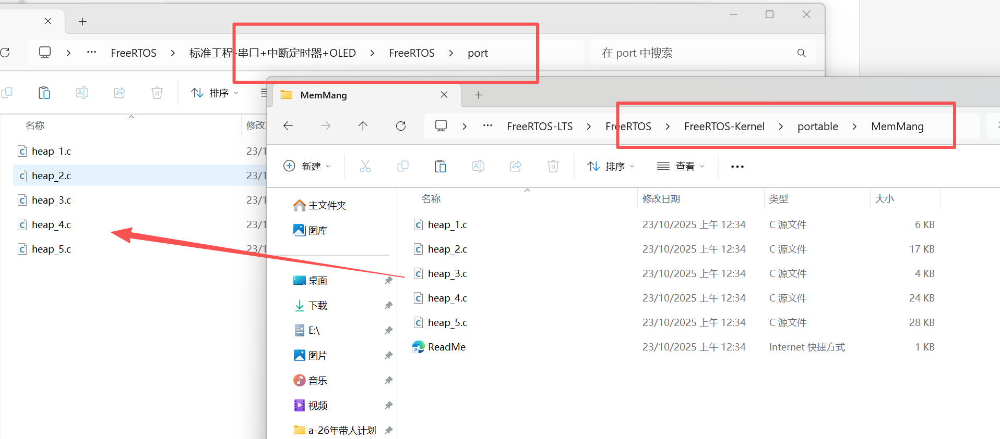

同样的，复制RVDS/ARM_CM3的所有文件到port文件夹：
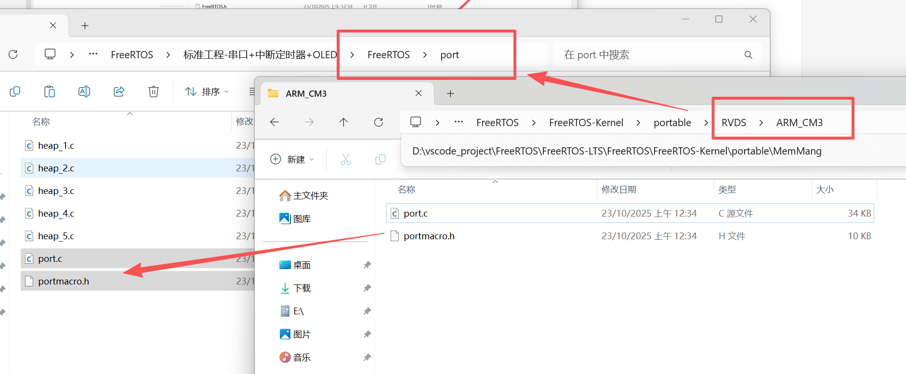

然后，回到FreeRTOS-Kernel文件夹，将当前文件夹下的下面几个文件复制到src文件夹当中：
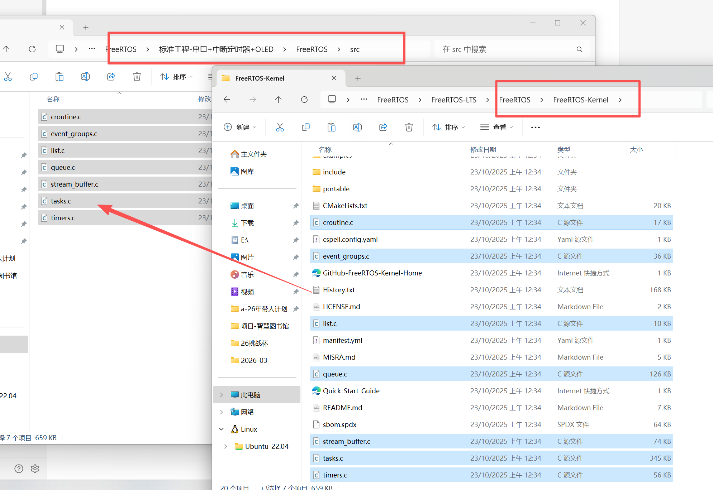

然后，将STM32F103专门配套的config配置文件放到下面的目录下，因为最新版本的FreeRTOS当中并没有附带该文件了，所以这里我们手动创建一个，名称为FreeRTOSConifg.h,内容如下：
```c
/*
 * FreeRTOS V202107.00
 * Copyright (C) 2020 Amazon.com, Inc. or its affiliates.  All Rights Reserved.
 *
 * Permission is hereby granted, free of charge, to any person obtaining a copy of
 * this software and associated documentation files (the "Software"), to deal in
 * the Software without restriction, including without limitation the rights to
 * use, copy, modify, merge, publish, distribute, sublicense, and/or sell copies of
 * the Software, and to permit persons to whom the Software is furnished to do so,
 * subject to the following conditions:
 *
 * The above copyright notice and this permission notice shall be included in all
 * copies or substantial portions of the Software.
 *
 * THE SOFTWARE IS PROVIDED "AS IS", WITHOUT WARRANTY OF ANY KIND, EXPRESS OR
 * IMPLIED, INCLUDING BUT NOT LIMITED TO THE WARRANTIES OF MERCHANTABILITY, FITNESS
 * FOR A PARTICULAR PURPOSE AND NONINFRINGEMENT. IN NO EVENT SHALL THE AUTHORS OR
 * COPYRIGHT HOLDERS BE LIABLE FOR ANY CLAIM, DAMAGES OR OTHER LIABILITY, WHETHER
 * IN AN ACTION OF CONTRACT, TORT OR OTHERWISE, ARISING FROM, OUT OF OR IN
 * CONNECTION WITH THE SOFTWARE OR THE USE OR OTHER DEALINGS IN THE SOFTWARE.
 *
 * http://www.FreeRTOS.org
 * http://aws.amazon.com/freertos
 *
 * 1 tab == 4 spaces!
 */

#ifndef FREERTOS_CONFIG_H
#define FREERTOS_CONFIG_H

/*-----------------------------------------------------------
 * Application specific definitions.
 *
 * These definitions should be adjusted for your particular hardware and
 * application requirements.
 *
 * THESE PARAMETERS ARE DESCRIBED WITHIN THE 'CONFIGURATION' SECTION OF THE
 * FreeRTOS API DOCUMENTATION AVAILABLE ON THE FreeRTOS.org WEB SITE. 
 *
 * See http://www.freertos.org/a00110.html
 *----------------------------------------------------------*/

#define configUSE_PREEMPTION		1
#define configUSE_IDLE_HOOK			0
#define configUSE_TICK_HOOK			0
#define configCPU_CLOCK_HZ			( ( unsigned long ) 72000000 )	
#define configTICK_RATE_HZ			( ( TickType_t ) 1000 )
#define configMAX_PRIORITIES		( 5 )
#define configMINIMAL_STACK_SIZE	( ( unsigned short ) 128 )
#define configTOTAL_HEAP_SIZE		( ( size_t ) ( 17 * 1024 ) )
#define configMAX_TASK_NAME_LEN		( 16 )
#define configUSE_TRACE_FACILITY	0
#define configUSE_16_BIT_TICKS		0
#define configIDLE_SHOULD_YIELD		1

/* Co-routine definitions. */
#define configUSE_CO_ROUTINES 		0
#define configMAX_CO_ROUTINE_PRIORITIES ( 2 )

/* Set the following definitions to 1 to include the API function, or zero
to exclude the API function. */

#define INCLUDE_vTaskPrioritySet		1
#define INCLUDE_uxTaskPriorityGet		1
#define INCLUDE_vTaskDelete				1
#define INCLUDE_vTaskCleanUpResources	0
#define INCLUDE_vTaskSuspend			1
#define INCLUDE_vTaskDelayUntil			1
#define INCLUDE_vTaskDelay				1

/* This is the raw value as per the Cortex-M3 NVIC.  Values can be 255
(lowest) to 0 (1?) (highest). */
#define configKERNEL_INTERRUPT_PRIORITY 		255
/* !!!! configMAX_SYSCALL_INTERRUPT_PRIORITY must not be set to zero !!!!
See http://www.FreeRTOS.org/RTOS-Cortex-M3-M4.html. */
#define configMAX_SYSCALL_INTERRUPT_PRIORITY 	191 /* equivalent to 0xb0, or priority 11. */


/* This is the value being used as per the ST library which permits 16
priority values, 0 to 15.  This must correspond to the
configKERNEL_INTERRUPT_PRIORITY setting.  Here 15 corresponds to the lowest
NVIC value of 255. */
#define configLIBRARY_KERNEL_INTERRUPT_PRIORITY	15

#endif /* FREERTOS_CONFIG_H */

```
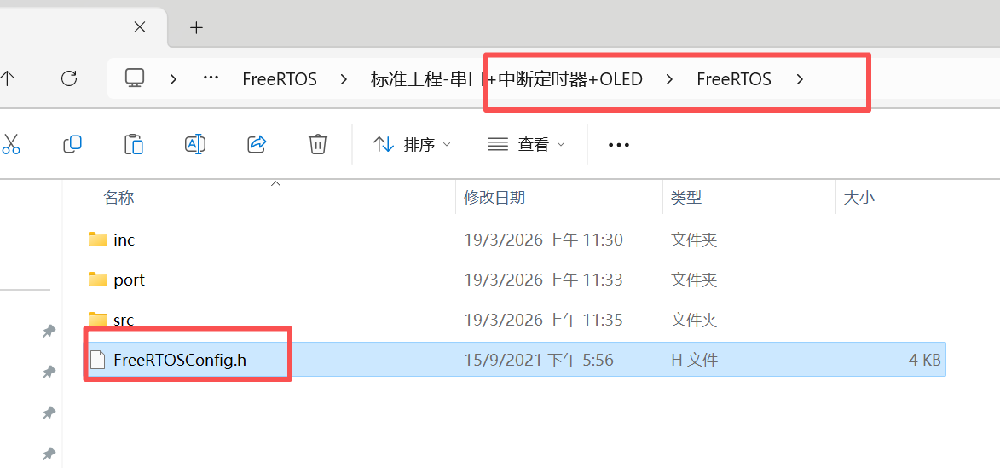

## 2.工程配置

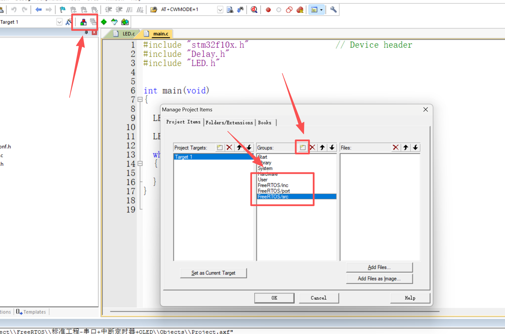

然后，把每个文件夹对应的文件都添加进去，非.c和.h类型的文件可以不需要添加进去
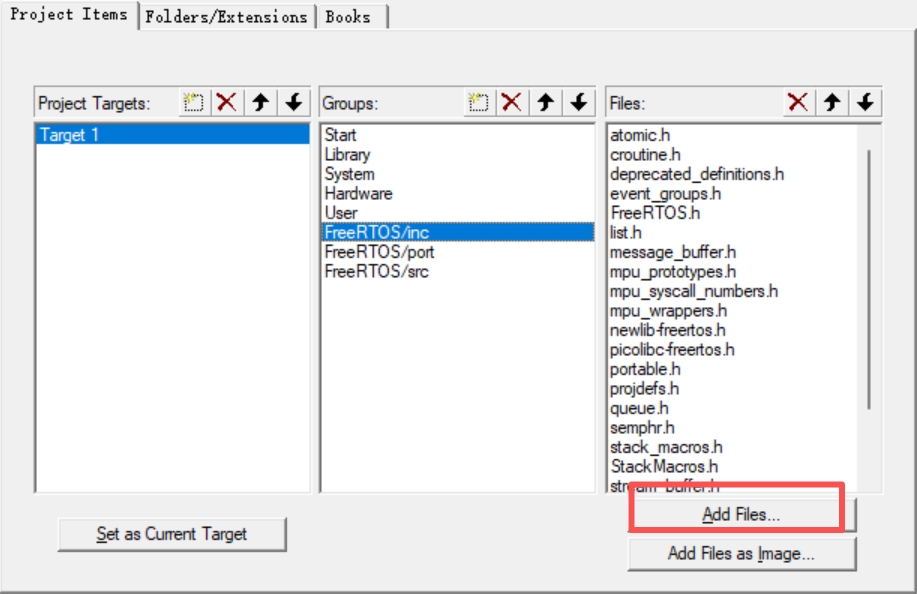
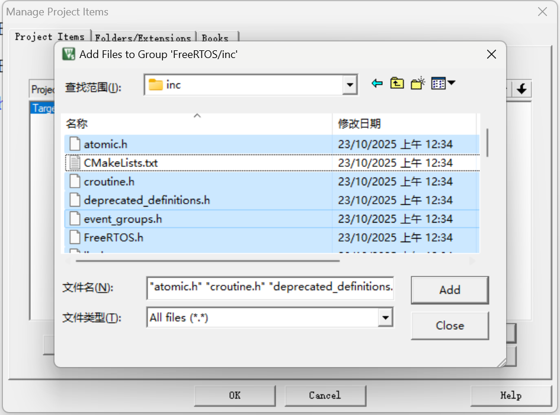

inc、port、src都要添加进去

> [!NOTE]
> port部分只需要加入heap4和port.c、portmacro.h
> 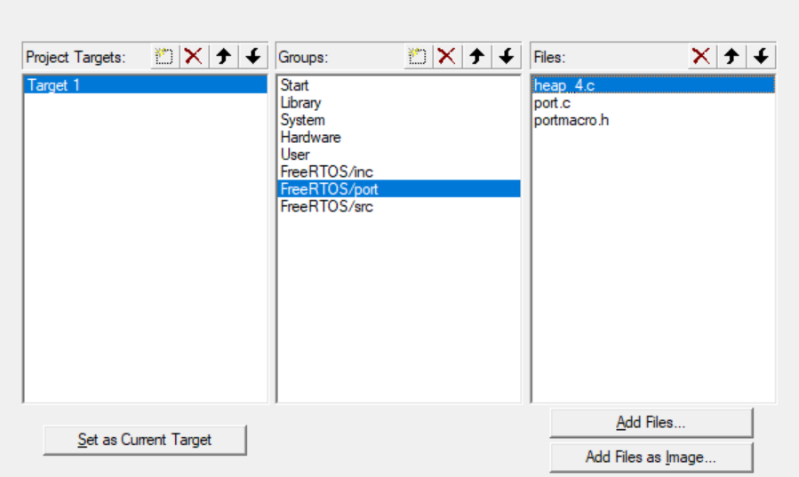

最后，在inc里加入FreeRTOS根目录的config文件：
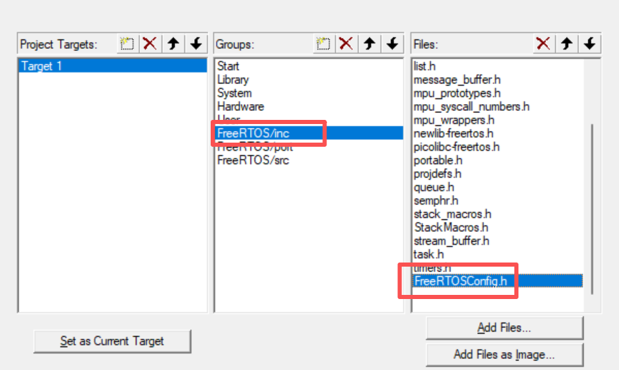

> [!NOTE]
> 插入完以后，可以将该配置文件挪到最前面，以方便修改时快速打开
> 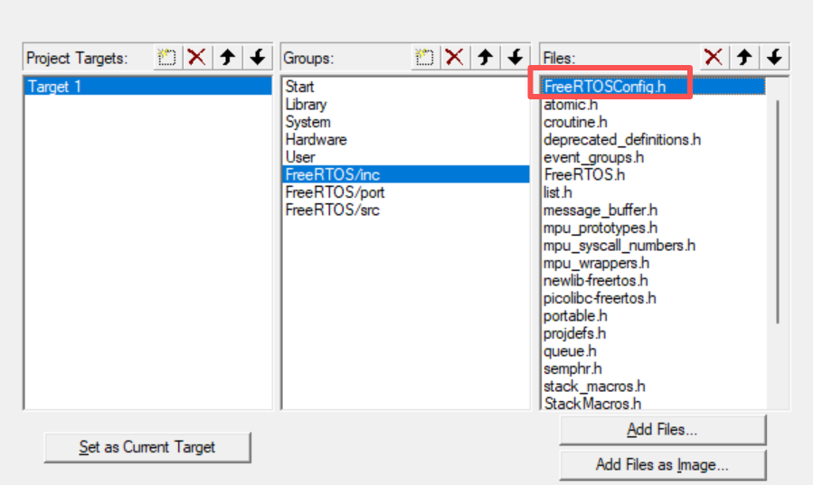

下面，点击魔术棒，将引用目录添加到工程当中，如下图所示：
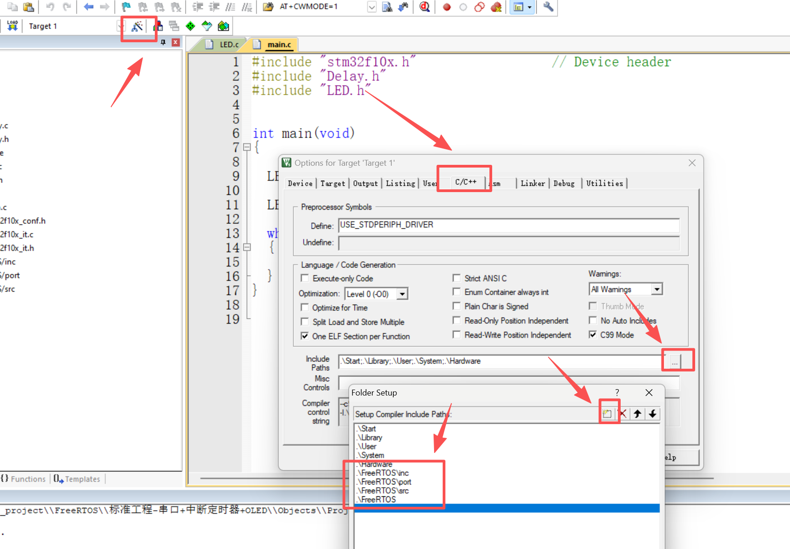

完成以后，点击编译，正常情况的话0错误0警告：
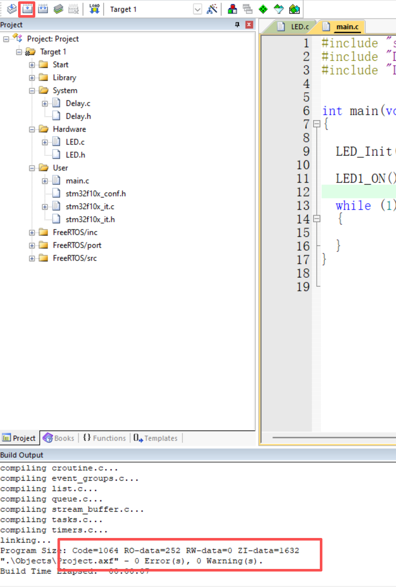

## 3.修改配置
下面，我们在config文件中添加中断定义：
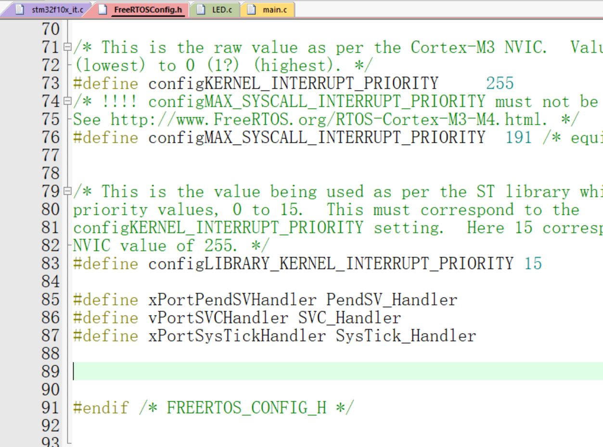
```c
#define xPortPendSVHandler PendSV_Handler
#define vPortSVCHandler SVC_Handler
#define xPortSysTickHandler SysTick_Handler
```

定义完成之后，我们还需要去原本标准库中定义的文件中将其关掉(注释掉)
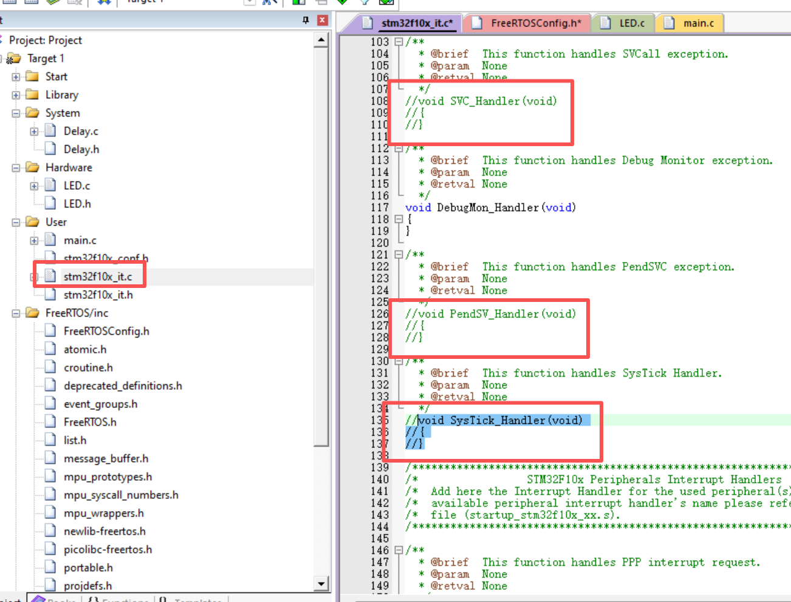

修改完成之后，再次编译，正常情况下是0错误0警告：
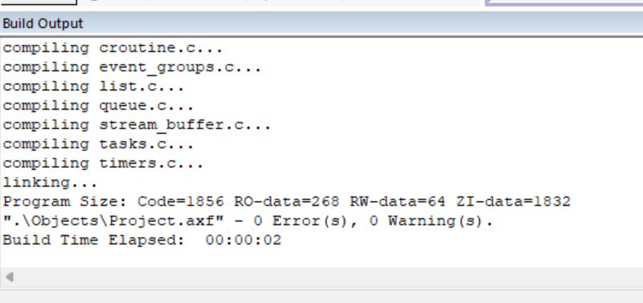

至此，FreeRTOS操作系统移植完成。


## 4.测试验证
这里，我们编写一个测试的代码来进行功能验证：
```c
#include "stm32f10x.h"                  // Device header
#include "Delay.h"
#include "LED.h"
#include "FreeRTOS.h"	//导入FreeRTOS内核头文件
#include "Task.h"	//导入Task头文件

TaskHandle_t myTaskHandler;	//创建一个Task任务句柄

//任务函数
void myTask(void *arg)
{
	while(1)
	{
		LED1_Turn();
		vTaskDelay(500);

	}
	
}
int main(void)
{
	LED_Init();
//	LED1_ON();
	xTaskCreate(myTask,"myTask",128,NULL,2,&myTaskHandler);
	vTaskStartScheduler();
	
	while (1)
	{
	}
}


```


### 1.硬件直接烧录验证
编译烧录验证，如果观察到小灯每隔500毫秒闪烁一次，则说明FreeRTOS已经成功跑通。
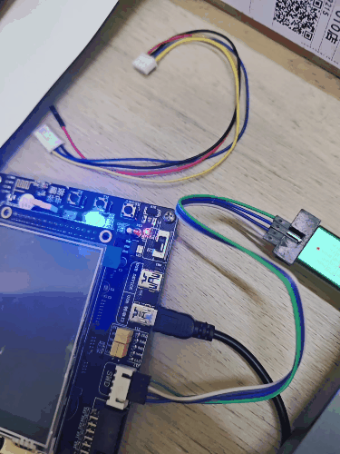

### 2.软件仿真验证
相关配置如下：
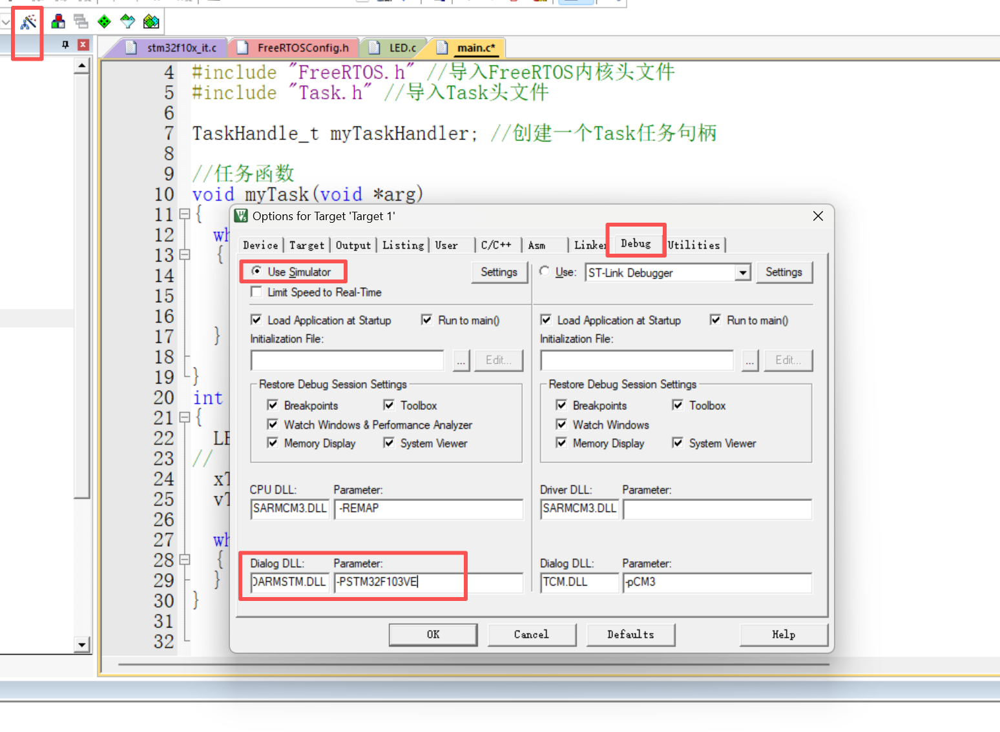

然后点击仿真
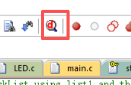

打开逻辑分析仪窗口：
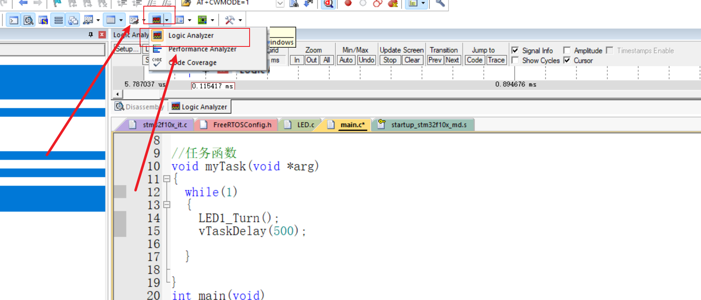
添加PB1作为逻辑信号
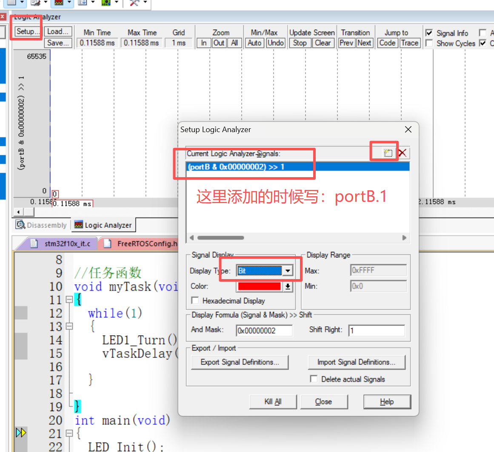

完成之后，点击Close

随后，点击全速运行：
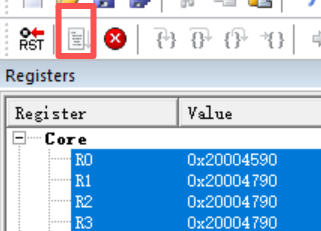

这样，就可以在逻辑分析仪上看到电平信号了：
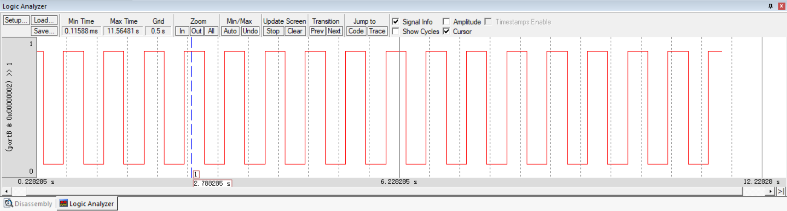

可以看到电平每隔500ms跳变一次，说明FreeRTOS任务运行正常，移植没问题。