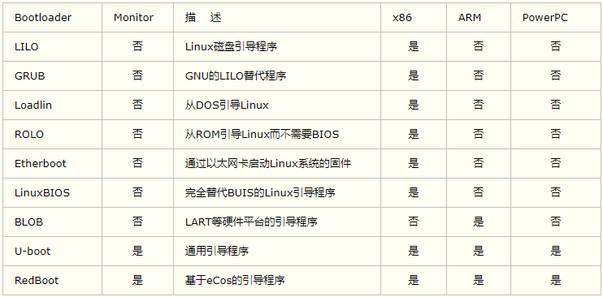
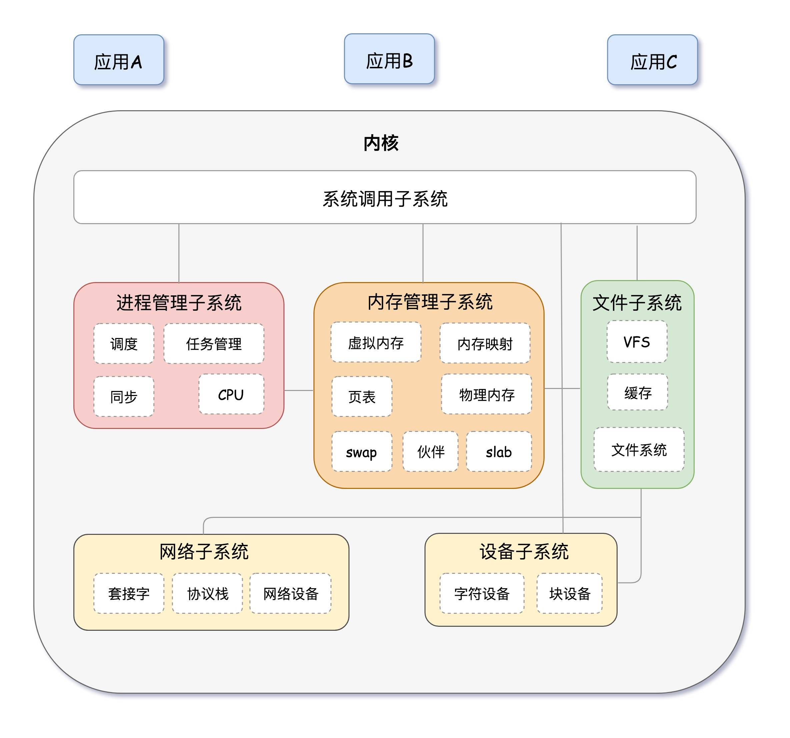

# 1.Linux系统裁剪-基础知识
# 1.Linux系统构成简单介绍

参考链接来源：[1. Linux系统构成简单介绍 — [野火]嵌入式Linux镜像构建与部署——基于LubanCat-RK系列板卡 文档](https://doc.embedfire.com/linux/rk356x/build_and_deploy/zh/latest/building_image/image_composition/image_composition.html)

一个完整的linux系统，通常包含了Uboot、kernel、设备树(Device Tree)以及根文件系统(rootfs)。

## 1.1. Uboot

U-Boot 是一个主要用于嵌入式系统的引导加载程序，可以支持多种不同的计算机系统结构，包括PPC、ARM、AVR32、MIPS、x86、68k、Nios与MicroBlaze。 这也是一套在GNU通用公共许可证之下发布的自由软件。Uboot的全称 Universal Boot Loader，是遵循GPL条款的开源项目， U-Boot的主要作用是用来启动操作系统内核，它分为两个阶段，即boot + loader， boot阶段启动系统，初始化硬件设备，建立内存空间映射图，将系统的软硬件带到一个合适的状态， loader阶段将操作系统内核文件加载至内存，之后跳转到内核所在地址运行。

另外，某些BootLoader可能含有一些高级特性，如校验操作系统镜像，从多个操作系统镜像中选择引导合适的操作系统， 或者添加网络功能，让系统自主从网上寻找合适的镜像并且进行引导等等。





## 1.2. Linux内核

Linux是一种开源电脑操作系统内核。它是一个用C语言写成，符合POSIX标准的类Unix操作系统。 Linux内核是一个用来和硬件打交道并为用户程序提供一个有限服务集的低级支撑软件。一个计算机系统是一个硬件和软件的共生体，它们互相依赖，不可分割。计算机的硬件，含有外围设备、处理器、内存、硬盘和其他的电子设备组成计算机的发动机。但是没有软件来操作和控制它，自身是不能工作的。完成这个控制工作的软件就称为操作系统，在Linux的术语中被称为“内核”，也可以称为“核心”。Linux内核的主要模块（或组件）分以下几个部分：进程管理子系统、内存管理子系统、文件子系统、网络子系统、设备子系统等。


>[!TIP]
>提问：既然内核只是提供“最基础”的服务，像地基一样，为什么我们要花这么大精力去挖地基、敲掉承重墙（裁剪）呢？
>
>内核裁剪的本质： Linux 内核虽然提供的是“基础服务”，但为了实现通用性，其源码内包含了支持全球所有硬件驱动、网络协议和文件系统的庞大库。裁剪内核并非要删除其核心功能（如内存管理或进程调度），而是要剔除其中冗余的驱动支持与调试项。 
>
> 在嵌入式开发中，裁剪内核就是为了**“化繁为简”**：通过移除硬件原理图以外的所有冗余模块，使内核从“全能大管家”变身为“专职服务员”，从而实现更小的体积占用、更快的开机响应以及更高的系统运行稳定性。


## 1.3. 设备树

设备树是一种描述硬件的数据结构，它把这些硬件设备的信息， 而这个文件，就是Device Tree（设备树），设备树包括设备树源码（Device Tree Source，DTS）文件、 设备树编译工具（Device Tree Compiler，DTC）与二进制格式设备树（Device Tree Blob，DTB）， DTS包含的头文件格式为DTSI。

设备树描述:

```bash
node1 {
   a-string-property = "A string";
   a-string-list-property = "first string", "second string";
   a-byte-data-property = [0x01 0x23 0x34 0x56];

   child-node1 {
      first-child-property;
      second-child-property = <1>;
      a-string-property = "Hello, world";
   };
};
```

Uboot和Linux不能直接识别DTS文件，而DTB可以被内核与BootLoader识别解析， 通常在制作NAND Flash、SD Card启动镜像时，通常会为DTB文件留下一部分存储区域以存储DTB， 在BootLoader启动内核时，会先读取DTB到内存，再提供给内核使用。


>[!NOTE]
>设备树（Device Tree）是 Linux 内核的“硬件配置单”。 它把硬件的寄存器地址、中断、开关状态（status）等信息从内核源码中抽离出来。就像电气箱的空开阵列，内核根据这张“配置单”来决定使能哪些外设，实现了一套内核代码适配多种硬件板卡的灵活性。


## 1.4. 根文件系统

根文件系统（rootfs）是linux在初始化时加载的第一个文件系统， 根文件系统包括根目录和真实文件系统，它包含系统引导和使其他文件系统得以挂载（mount）所必要的文件。 根文件系统包函Linux启动时所必须的目录和关键性的文件，例如Linux启动时必要的初始化文件， 它在init目录下。此外根文件系统中还包括了许多的应用程序bin目录等， 任何包括这些Linux 系统启动所必须的文件都可以成为根文件系统。

在Linux内核启动的初始阶段，首先内核会初始化一个基于内存的文件系统，如initramfs，initrd等，然后以只读的方式去加载根文件系统（load rootfs）， 读取并且运行/sbin/init初始化文件，根据/etc/inittab配置文件完成系统的初始化工作 （提示：/sbin/init是一个二进制可执行文件，为系统的初始化程序，而/etc/inittab是它的配置文件）， 在初始化的过程中，还会以读写的方式重新挂载根文件系统，在系统启动后， 根文件系统就可用于存储数据了，存在根文件系统是Linux启动时的必要条件。

我们常见的根文件系统制作工具有 buildroot、Ubuntu、Debian、yocto、busybox，这些工具的优缺点列出如下


>[!NOTE]
>1.内核 (Kernel)：是接口提供者，负责管理硬件资源并暴露系统调用，它是“被动”的。
>2.根文件系统 (Rootfs)：是接口调用者。它包含了 Shell 和各种工具程序（如 ls, cp）
>3.裁剪差异：
>     3.1.BusyBox/Buildroot 裁剪：是“工具级裁剪”，甚至会精简 ls 这种基础命令的代码。3.2Debian 裁剪：是“服务级裁剪”，侧重于关闭不需要的后台守护进程（Daemon）和移除大型应用包，以换取运行时的纯净和响应速度。

