# 2.鲁班猫系统镜像裁剪实战
# 1.Lubancat_Gen_SDK
来源链接：[3. LubanCat_Gen_SDK — [野火]嵌入式Linux镜像构建与部署——基于LubanCat-RK系列板卡 文档](https://doc.embedfire.com/linux/rk356x/build_and_deploy/zh/latest/building_image/lubancat_sdk/lubancat_gen_sdk.html)

## 1.1. 简介

LubanCat_Gen_SDK是基于瑞芯微通用Linux SDK工程的深度定制版本，适用于以Rockchip处理器为主芯片的LubanCat-RK系列板卡。

整个SDK工程，目录包含有 debian、kernel、u-boot、device、rkbin、ubuntu等目录。 每个目录或其子目录会对应一个 git 工程，提交需要在各自的目录下进行。
	
- debian11：debian11根文件系统构建脚本,搭配Kernel-5.10使用。
    
- debian12：debian12根文件系统构建脚本,搭配Kernel-6.1使用。
    
- device/rockchip： 存放各芯片板级配置，以及构建进行相关的脚本等。
    
- kernel-5.10： 存放 kernel 5.10 版本源码。
    
- kernel-6.1： 存放 kernel 6.1版本 源码。
    
- lubancat-bin： 存放鲁班猫板卡使用的二进制文件。
    
- prebuilts： 存放交叉编译工具链。
    
- rkbin： 存放 Rockchip 相关的 Binary 和工具。
    
- rockdev： 存放编译输出的镜像文件(软链接到output/firmware)。
    
- output： 存放编译过程中生成的过程文件、日志、编译出的镜像等。
    
- output-release：存放编译完成并归档后的系统镜像
    
- tools： 存放 Linux 和 Windows 操作系统环境下常用工具。
    
- u-boot：存放基于v2017.09版本进行开发的uboot代码。
    
- ubuntu20.04: Ubuntu 20.04 根文件系统构建脚本,搭配Kernel-5.10使用。
    
- ubuntu22.04: Ubuntu 22.04 根文件系统构建脚本,搭配Kernel-6.1使用。
    

## 1.2. extboot分区介绍

extboot分区系统是野火基于瑞芯微Linux_SDK框架搭建的一种LubanCat-RK系列板卡通用镜像实现方式。 可以实现一个镜像烧录到LubanCat使用同一型号处理器的所有板卡，解决了默认rkboot分区方式设备树固定，导致一个镜像只能适配一款板卡的问题， 大大降低了由于型号众多导致的后期维护的复杂性。

extboot分区使用ext4文件系统格式，在编译过程中将所有LubanCat-RK系列板卡设备树都编译并打包到分区内， 并借助SDRADC读取板卡硬件ID，来实现设备树自动切换。同时支持设备树插件，自动更新内核deb包，在线更新内核和驱动模块等功能。

还对系统镜像的分区做了调整，删减一些冗余功能，实现了对系统存储的高效利用。

>[!NOTE]
>**extboot 分区：从“专车专用”到“万能适配”。** `extboot` 本质上是一个存放内核镜像和设备树合集的“资源池”。它通过读取板卡的硬件电阻 ID，实现了**在引导阶段动态挑选设备树**的功能。 **对于开发者而言**：它极大地方便了内核和设备树的更新（无需烧录整个镜像，只需 deb 安装或文件替换），但也由于其通用性，在 `/boot` 分区内预装了大量冗余的板级描述文件。


## 1.3. SDK 开发环境搭建
LubanCat_Gen_SDK是基于Ubuntu LTS 系统开发测试的，在开发过程中，主要是用Ubuntu 20.04版本， 推荐用户使用Ubuntu20.04或Ubuntu22.04，不支持Ubuntu20.04以下版本开发。

硬件配置推荐：64位系统，硬盘空间⼤于80G。如果您进⾏多个构建，将需要更⼤的硬盘空间。

安装SDK依赖的软件包
```bash
# 安装SDK构建所需要的软件包
# 整体复制下面内容到终端中安装
sudo apt-get update && sudo apt-get install git ssh make gcc libssl-dev \
liblz4-tool expect expect-dev g++ patchelf chrpath gawk texinfo chrpath \
diffstat binfmt-support qemu-user-static live-build bison flex fakeroot \
cmake gcc-multilib g++-multilib unzip device-tree-compiler ncurses-dev \
libgucharmap-2-90-dev bzip2 expat gpgv2 cpp-aarch64-linux-gnu libgmp-dev \
libmpc-dev bc python-is-python3 python3-pip python2 u-boot-tools curl \
python3-pyelftools dpkg-dev

```

## 1.4. 安装repo
repo是google⽤Python脚本写的调⽤git的⼀个脚本，主要是⽤来下载、管理项⽬的软件仓库。
```bash
mkdir ~/bin
curl https://storage.googleapis.com/git-repo-downloads/repo > ~/bin/repo
# 如果上面的地址无法访问，可以用下面的：
# curl -sSL  'https://gerrit-googlesource.proxy.ustclug.org/git-repo/+/master/repo?format=TEXT' |base64 -d > ~/bin/repo
chmod a+x ~/bin/repo
echo PATH=~/bin:$PATH >> ~/.bashrc
source ~/.bashrc
```

执行完上面的命令后来验证repo是否安装成功能正常运行。
```bash

repo --version
#返回以下信息
#返回的信息根据Ubuntu版本的不同略有差异
<repo not installed>
repo launcher version 2.32
    (from /home/he/bin/repo)
git 2.25.1
Python 3.8.10 (default, Nov 14 2022, 12:59:47)
[GCC 9.4.0]
OS Linux 5.15.0-60-generic (#66~20.04.1-Ubuntu SMP Wed Jan 25 09:41:30 UTC 2023)
CPU x86_64 (x86_64)
Bug reports: https://bugs.chromium.org/p/gerrit/issues/entry?template=Repo+tool+issue

```


## 1.5. SDK源码获取
LubanCat_Gen_SDK的代码被划分为了若干git仓库分别进行版本管理， 可以使用repo工具对这些git仓库进行统一的下载，提交，切换分支等操作。

运行以下命令，将在当前用户的家目录下创建一个名为LubanCat_SDK的目录，用来放入SDK源码。
```bash
mkdir ~/LubanCat_SDK
```

### 1.5.1. 切换Python 3 版本

```bash
#查看当前Python版本
python -V
```

若返回的版本号为Python3版本，则无需再切换Python版本。若为Python2版本或未发现python，则可以用以下方式切换：

```bash
#查看当前系统安装的Python版本有哪些
ls /usr/bin/python*

#将python链接到python3
sudo ln -sf /usr/bin/python3 /usr/bin/python

#重新查看默认Python版本
python -V
```

此时系统默认Python版本切换为python3


### 1.5.2. Git配置
设置自己的git信息，以确保后续拉取代码时正常进行，如果不需要提交代码的话可以随意设置用户名和邮箱地址。

```bash
git config --global user.name "your name"
git config --global user.email "your mail"
```
### 1.5.3. SDK在线下载并同步
LubanCat_Gen_SDK源码可以在线获取，源码托管在Github。由于在线下载的方式要从Github拉取大量的仓库， 体积很大，对于不能快速访问Github的用户不建议使用这种方式。

```bash
cd ~/LubanCat_SDK

# 拉取LubanCat_Linux_Generic_SDK
repo init -u https://github.com/LubanCat/manifests.git -b linux -m lubancat_linux_generic.xml

#如果运行以上命令失败，提示：fatal: Cannot get https://gerrit.googlesource.com/git-repo/clone.bundle
#则可以在以上命令中添加选项 --repo-url https://mirrors.tuna.tsinghua.edu.cn/git/git-repo

.repo/repo/repo sync -c -j4
```

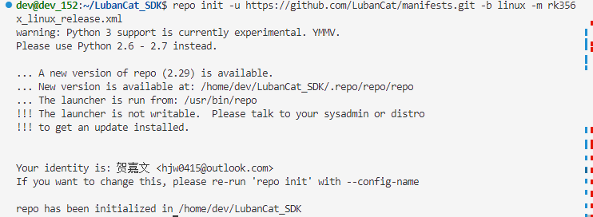
如果同步失败可以重新运行sync命令来同步
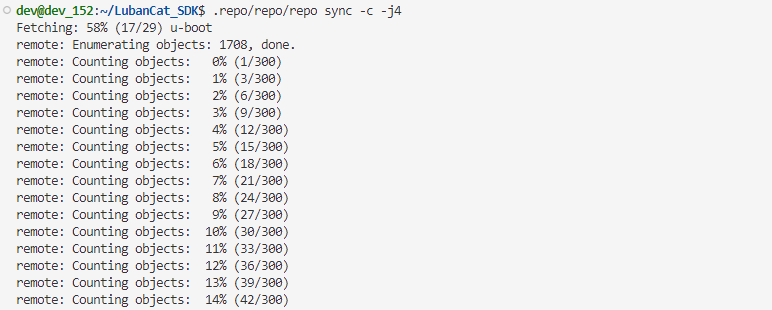

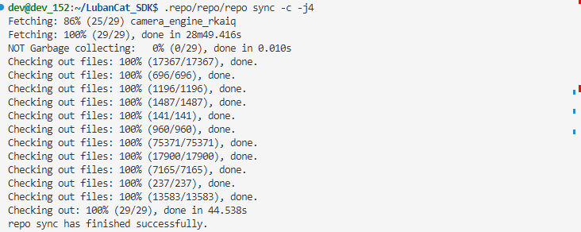


### 1.5.4. SDK离线安装下载
由于Github服务器在国外，拉取这么多的仓库需要很多时间，还可能因为网络不畅通而导致下载失败。 为此，我们将需要使用的仓库整体打包，使用网盘下载的方式，以减少连接Github导致的问题。
#### 1.5.4.1. 下载地址

访问百度网盘资源介绍页面获取SDK源码压缩包: [8-SDK源码压缩包](https://doc.embedfire.com/linux/rk356x/quick_start/zh/latest/quick_start/baidu_cloud/baidu_cloud.html#id1)

下载最新日期的LubanCat_Linux_Generic_SDK压缩包即可。


#### 1.5.4.2. 解压源码

以下过程以LubanCat_Linux_Generic_SDK进行演示，实际文件名称以自己下载的SDK为准

```bash
# 安装tar压缩工具,一般来说系统默认安装了
sudo apt install tar

# 在用户家目录创建LubanCat_SDK目录
mkdir ~/LubanCat_SDK

# 将下载的SDK源码移动到LubanCat_SDK目录下，xxx为日期
mv LubanCat_Linux_Generic_SDK_xxx.tgz ~/LubanCat_SDK

# 进入LubanCat_SDK目录
cd ~/LubanCat_SDK

# 解压SDK压缩包
tar -xzvf LubanCat_Linux_Generic_SDK_xxx.tgz

# 查看解压后的文件，可以看到解压出.repo文件夹
ls -al

# 检出各个git子仓库
# 注意：下面的命令一点要在SDK顶层文件夹中执行，且repo路径一定为.repo/repo/repo
.repo/repo/repo sync -l

# 将所有的源码仓库同步到最新版本
# 如果使用LubanCat_Linux_Gen_Full_SDK，则无需使用下面的命令更新SDK
.repo/repo/repo sync -c
```

如果.repo/repo/repo sync -c执行时提示网络连接超时，请检查并能否通畅访问github。 确认可以正常访问github的话，可以重复多次执行.repo/repo/repo sync -c命令来进行同步。 若无法访问github，可以忽略同步源码仓库到最新版本这一步骤。


解压完成后checkout到指定的提交。


一般情况下网盘保存的离线源码包已经是最新版本，如果距离离线源码包下载时间不久，可以忽略从Github在线更新这一步。

### 1.5.5. SDK更新

我们会对LubanCat_Gen_SDK不断更新，并将修改的内容实时同步到Github， 如果需要在本地LubanCat_Gen_SDK同步更新内容，则可以借助repo或git来实现。

#### 1.5.5.1. 使用repo更新整个SDK

使用repo可以将SDK整体更新到提供的最新版本。

>[!Warning]
>此操作会把各个子Git仓库更新到此SDK各组件互相匹配的最新版本，虽然单个仓库可能不是最新，但各组件匹配性好，工作稳定


首先要更新.repo/manifests，里面保存了repo的配置文件，记录了仓库的版本信息。

```bash
# 进入.repo/manifests目录
cd .repo/manifests

# 切换分支到Linux
git checkout linux

# 拉取最新的manifests
git pull

#进入SDK顶层文件夹
cd ~/LubanCat_SDK

# 同步远端仓库
.repo/repo/repo sync -c
```


#### 1.5.5.2. 使用Git更新单独的源码仓库

有时只想更新某个仓库，而不是去更新整个SDK。 或者已经对SDK的某些仓库做出了修改，使用repo同步的话就会失败。 此时就需要对单个仓库进行更新了。


为了减少SDK传输的文件大小，默认在SDK下载时只同步Git仓库指定的单次提交，默认处于无分支状态，如果要使用Git更新单独的源码仓库，则需要先将对应仓库切换到指定分支。


以下是LubanCat_Gen_SDK 常用仓库的分支说明：
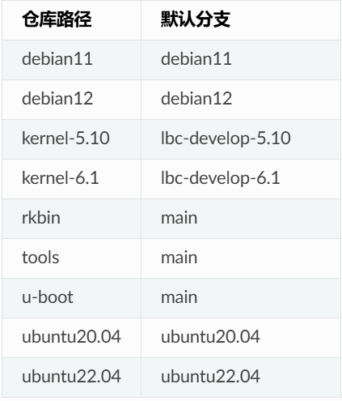


如果要更新的仓库分支在此处没有列出，可以查看 .repo/manifests/lubancat_linux/lubancat_linux_generic_release.xml 文件中各条目中的dest-branch就是要切换的分支

这里以Kernel-5.10仓库为例
```bash
# 进入kernel-5.10目录下
cd kernel-5.10

# 检出到对应仓库的默认分支
git checkout lbc-develop-5.10

# 拉取git仓库
git pull
```


# 2.构建脚本的配置文件选择


以下文档以使用rk3588主芯片的板卡为例，使用其他型号芯片的板卡操作方法类似。

在SDK顶层文件夹下，执行以下命令，以选择要构建的板卡主芯片型号和SDK的配置文件。

```bash
# 选择SDK配置文件
./build.sh chip

1. rk312x
2. rk3528
3. rk3562
4. rk3566_rk3568
5. rk3576
6. rk3588

# 输入想要构建的板卡主芯片型号的编号，并确认，这里选择rk3588。
Which would you like? [1]: 5

# 选择要构建的根文件系统配置文件
1. rockchip_defconfig
2. LubanCat_rk3588_debian_gnome_defconfig
3. LubanCat_rk3588_debian_lite_defconfig
4. LubanCat_rk3588_ubuntu_gnome_defconfig
5. LubanCat_rk3588_ubuntu_lite_defconfig
6. LubanCat_rk3588_ubuntu_xfce_defconfig
Which would you like? [1]: 2
```

>[!TIP]
>芯片型号编号和配置文件编号顺序可能发生变化，以实际为准。


如果在编译完一个主芯片的工程后需要切换编译其他的主芯片，要先用以下命令清理SDK， 防止由缓存或编译环境引起的编译错误。

```bash
# 清除整个SDK的
./build.sh cleanall

# 选择SDK配置文件
./build.sh chip
```


如果已经选择过了主芯片并且不需要切换主芯片，而是要切换同一主芯片的其他板卡或文件系统类型， 则不需要清理SDK。

```bash
# 选择SDK配置文件
./build.sh lunch

# 输入想要构建的板卡及文件系统配置文件编号，并确认，这里选择配置文件LubanCat_rk3588_debian_gnome_defconfig。
Which would you like? [0]: 2
```

也可以直接设置SDK配置文件，方法如下
```bash
# 选择构建LubanCat-RK3588系列板卡debian系统gnome桌面镜像
./build.sh LubanCat_rk3588_debian_gnome_defconfig
```

当选择完配置文件以后，会使用粉色提示字体提示当前配置文件所用的内核版本， 如果配置文件中指定的内核版本与当前使用的内核(kernel目录)版本不一致，则会自动切换内核版本。


# 3.U-boot的介绍、与编译

参考搬运链接：
1.[5. U-boot的介绍 — [野火]嵌入式Linux镜像构建与部署——基于LubanCat-RK系列板卡 文档](https://doc.embedfire.com/linux/rk356x/build_and_deploy/zh/latest/building_image/use_uboot/use_uboot.html)
2.[6. U-boot的修改与编译 — [野火]嵌入式Linux镜像构建与部署——基于LubanCat-RK系列板卡 文档](https://doc.embedfire.com/linux/rk356x/build_and_deploy/zh/latest/building_image/uboot_build/uboot_build.html)

## 3.1. U-boot简介

U-boot是从FADSROM、8xxROM、PPCBOOT逐步发展演化而来的。U-boot发展至今，已经可以实现非常多的功能， 在操作系统方面，它不仅支持嵌入式Linux系统的引导，还支持NetBSD,VxWorks, QNX, RTEMS, ARTOS, LynxOS, Android等嵌入式操作系统的引导。在CPU架构方面， U-boot支持PowerPC、MIPS、x86、ARM、NIOS、XScale等诸多常用系列的处理器。

一般来说BootLoader必须提供系统上电时的初始化代码，在系统上电时初始化相关环境后， BootLoader需要引导完整的操作系统，然后将控制器交给操作系统。 简单来说BootLoader是一段小程序，它在系统上电时执行，通过这段小程序可以将硬件 设备进行初始化，如CPU、SDRAM、Flash、串口、网络等，初始化完毕后调用操作系统内核。


## 3.2. U-boot编译(Chip)

### 3.2.1. U-boot编译介绍

在LubanCat-SDK中，自动编译脚本基本上都存放在build.sh中，这是SDK的主要功能入口


在build.sh中，U-boot的构建函数是function build_uboot() 具体内容如下

```bash
function build_uboot(){
    check_config RK_UBOOT_DEFCONFIG | return 0
    build_check_cross_compile
    prebuild_uboot

    echo "============Start building uboot============"
    echo "TARGET_UBOOT_CONFIG=$RK_UBOOT_DEFCONFIG"
    echo "========================================="

    if [ "$RK_RAMDISK_SECURITY_BOOTUP" = "true" ];then
        if [ -n "$RK_CFG_RAMBOOT" ];then
            build_ramboot
        else
            build_kernel
        fi

        if [ -n "$RK_CFG_RECOVERY" ]; then
            build_recovery
        fi
        cp -f $TOP_DIR/rockdev/boot.img $TOP_DIR/u-boot/boot.img
        cp -f $TOP_DIR/rockdev/recovery.img $TOP_DIR/u-boot/recovery.img | true
    fi

    cd u-boot
    rm -f *_loader_*.bin
    if [ "$RK_LOADER_UPDATE_SPL" = "true" ]; then
        rm -f *spl.bin
    fi

    if [ -n "$RK_UBOOT_DEFCONFIG_FRAGMENT" ]; then
        if [ -f "configs/${RK_UBOOT_DEFCONFIG}_defconfig" ]; then
            make ${RK_UBOOT_DEFCONFIG}_defconfig $RK_UBOOT_DEFCONFIG_FRAGMENT
        else
            make ${RK_UBOOT_DEFCONFIG}.config $RK_UBOOT_DEFCONFIG_FRAGMENT
        fi
        ./make.sh $UBOOT_COMPILE_COMMANDS
    elif [ -d "$TOP_DIR/prebuilts/gcc/linux-x86/arm/gcc-arm-10.3-2021.07-x86_64-arm-none-linux-gnueabihf" ]; then
        ./make.sh $RK_UBOOT_DEFCONFIG \
            $UBOOT_COMPILE_COMMANDS CROSS_COMPILE=$CROSS_COMPILE
    elif [ -d "$TOP_DIR/prebuilts/gcc/linux-x86/aarch64/gcc-arm-10.3-2021.07-x86_64-aarch64-none-linux-gnu" ]; then
        ./make.sh $RK_UBOOT_DEFCONFIG \
            $UBOOT_COMPILE_COMMANDS CROSS_COMPILE=$CROSS_COMPILE
    else
        ./make.sh $RK_UBOOT_DEFCONFIG \
            $UBOOT_COMPILE_COMMANDS
    fi

    if [ "$RK_IDBLOCK_UPDATE_SPL" = "true" ]; then
        ./make.sh --idblock --spl
    fi

    if [ "$RK_RAMDISK_SECURITY_BOOTUP" = "true" ];then
        ln -rsf $TOP_DIR/u-boot/boot.img $TOP_DIR/rockdev/
        ln -rsf $TOP_DIR/u-boot/recovery.img $TOP_DIR/rockdev/ | true
    fi

    finish_build
}
```

- check_config检查是否有 RK_UBOOT_DEFCONFIG 这个配置变量，定义了U-boot编译用到的配置文件， 这个变量定义在device/rockchip/rk356x/BoardConfig-*.mk中
    
- build_check_cross_compilep判断是否存在arm-none-linux-gnueabihf或aarch64-none-linux-gnu交叉编译工具链， 我们没有使用，这一部分可以忽略。
    
- prebuild_uboot根据BoardConfig-*.mk中的定义来设定编译参数UBOOT_COMPILE_COMMANDS
    
- 判断RK_RAMDISK_SECURITY_BOOTUP值是否为true，是否使用secure boot来对镜像进行签名认证， 我们没有定义，直接跳过
    
- cd进入u-boot目录，先清除以前生成的miniloader文件，再判断uboot前一阶段是否为SPL， 如果是的话还要清除spl文件
    
- RK_UBOOT_DEFCONFIG_FRAGMENT：由于RK版本U-boot支持配置文件的overlay功能， 这里判断是否开启了该功能，如果开启的话先将配置文件合并，我们没有使用到
    
- 判断有没有arm-none-linux-gnueabihf或aarch64-none-linux-gnu来进行编译,没有使用，可以忽略。
    
- 没有找到上面两个编译器，向./make.sh传递构建参数进行构建U-boot操作
    
- RK_IDBLOCK_UPDATE_SPL和RK_RAMDISK_SECURITY_BOOTUP都没有定义，直接跳过
    
- finish_build编译完成的一个提示函数。


### 3.2.2. U-boot编译
直接在SDK中，使用下面这条命令编译即可：
```bash
./build.sh u-boot
```
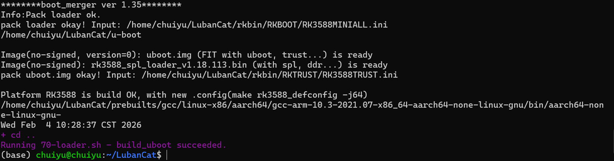


# 4.Linux内核的编译

参考搬运链接：[8. Linux内核的编译 — [野火]嵌入式Linux镜像构建与部署——基于LubanCat-RK系列板卡 文档](https://doc.embedfire.com/linux/rk356x/build_and_deploy/zh/latest/building_image/building_kernel/building_kernel.html)
## 4.1. kernel工程结构分析

学习一个软件，尤其是开源软件，首先应该从分析软件的工程结构开始。 一个好的软件有良好的工程结构，对于读者学习和理解软件的架构以及工作流程都有很好的帮助。

内核源码目录如下：

```
arch         COPYING        drivers   init     kernel       make_deb.sh  README    sound
block        CREDITS        firmware  ipc      lib          Makefile     samples   tools
build_image  crypto         fs        Kbuild   LICENSES     mm           scripts   usr
certs        Documentation  include   Kconfig  MAINTAINERS  net          security  virt
```

我们可以看到Linux内核源码目录下是有非常多的目录，且目录下也有非常多的文件， 下面我们简单分析一下这些目录的主要作用。

**arch** ：主要包含和硬件体系结构相关的代码，如arm、x86、MIPS，PPC，每种CPU平台占一个相应的目录。arch中的目录下存放的是各个平台以及各个平台的芯片对Linux内核进程调度、内存管理、 中断等的支持，以及每个具体的SoC和电路板的板级支持代码。

**block** ：在Linux中block表示块设备（以块（多个字节组成的整体，类似于扇区）为单位来整体访问），譬如说SD卡、Nand、硬盘等都是块设备，block目录下放的是一些Linux存储体系中关于块设备管理的代码。

**crypto** ：这个目录下存放的是常用加密和散列算法（如md5、AES、 SHA等），还有一些压缩和CRC校验算法。

**Documentation**：内核各部分的文档描述。

**drivers** ：设备驱动程序，里面列出了linux内核支持的所有硬件设备的驱动源代码，每个不同的驱动占用一个子目录，如char、block、 net、 mtd、 i2c等。

**fs** ：fs就是file system，里面包含Linux所支持的各种文件系统，如EXT、FAT、 NTFS、 JFFS2等。

**include** ：目录包括编译核心所需要的大部分头文件，例如与平台无关的头文件在 `include/linux` 子目录下，与cpu架构相关的头文件在include目录下对应的子目录中。

**init** ：内核初始化代码，这个目录下的代码就是linux内核启动时初始化内核的代码。

**ipc** ：ipc就是 `inter process commuication` ，进程间通信，该目录下都是linux进程间通信的代码。

**kernel** ：kernel就是Linux内核，是Linux中最核心的部分，包括进程调度、定时器等，而和平台相关的一部分代码放在arch/*/kernel目录下。

**lib** ：lib是库的意思，lib目录下存放的都是一些公用的有用的库函数，注意这里的库函数和C语言的库函数不一样的，因为在内核编程中是不能用C语言标准库函数的，所以需要使用lib中的库函数，除此之外与处理器结构相关的库函数代码被放在 `arch/*/lib/` 目录下。

**mm** ： 目录包含了所有独立于 cpu 体系结构的内存管理代码，如页式存储管理内存的分配和释放等，而与具体硬件体系结构相关的内存管理代码位于 `arch/*/mm` 目录下，例如 `arch/arm/mm/fault.c` 。

**net** ： 网络协议栈相关代码，net目录下实现各种常见的网络协议。

**scripts** ：这个目录下全部是脚本文件，这些脚本文件不是linux内核工作时使用的，而是用了配置编译linux内核的。

**security** ：内核安全模型相关的代码，例如最有名的SELINUX。

**sound** ： ALSA、 OSS音频设备的驱动核心代码和常用设备驱动。

**usr** ： 实现用于打包和压缩的cpio等。

此处仅列出一些常见的目录。

## 4.2. 内核配置选项

在不同版本的内核和不同系列的鲁班猫板卡使用的配置文件都保存在内核目录的arch/arm64/configs中， 具体使用的配置文件如下：

- Kernel 5.10.198/209：根据主芯片型号区分lubancat_linux_xxxx_defconfig，xxxx为芯片型号
    
- Kernel 6.1：根据主芯片型号区分lubancat_linux_xxxx_defconfig，xxxx为芯片型号
    
- Kernel 4.19.232：LubanCat-RK356x系列板卡都使用lubancat2_defconfig
    
- Kernel 5.10.160：LubanCat-RK3588系列板卡都使用lubancat_linux_rk3588_defconfig

### 4.2.1. 修改内核配置(LubanCat_Chip_SDK)

>[!TIP]
>本节需要输入命令的操作，需在kernel目录下进行

以下以LubanCat-2板卡为例进行说明

Linux内核的配置系统由三个部分组成，分别是：

- Makefile：分布在 Linux内核源代码顶层目录及各层目录中，定义 Linux 内核的编译规则；
    
- 配置文件：给用户提供配置选择的功能，如Kconfig文件定义了配置项， 在编译时，使用 `arch/arm64/configs/lubancat2_defconfig` 文件对配置项进行赋值；
    
- 配置工具：包括配置命令解释器（对配置脚本中使用的配置命令进行解释） 和配置用户界面（linux提供基于字符界面、基于Ncurses 图形界面以及 基于 Xwindows 图形界面的用户配置界面，各自对应于make config、make menuconfig 和 make xconfig）。
    

>[!TIP]
如果自定义配置文件， 编译时要在板卡对应的device/rockchip/rk356x/BoardConfig.mk文件中修改RK_KERNEL_DEFCONFIG的定义。

我们可以通过 `make menuconfig KCONFIG_CONFIG=arch/arm64/configs/lubancat2_defconfig ARCH=arm64` 命令来查看我们的配置，make menuconfig是一个基于文本选择的配置界面， 推荐在字符终端下使用， 而这个配置文件为 `lubancat2_defconfig` 此时就可以看到在lubancat2_defconfig的配置选择， 可以通过键盘的”上”、”下”、”左”、”右”、”回车”、”空格”、”?”、”ESC”等按键进行选择配置，具体见：

```bash
#使用图形界面配置需要额外安装 libncurses-dev
sudo apt install libncurses-dev

#执行命令
make menuconfig KCONFIG_CONFIG=arch/arm64/configs/lubancat2_defconfig ARCH=arm64
```

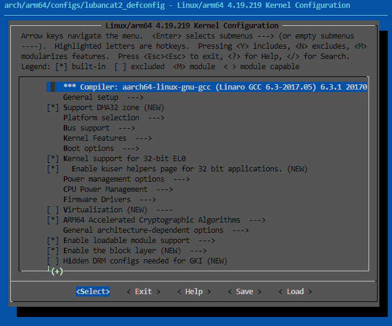

比如我们选择配置板卡的ov5648摄像头驱动： ov5648 ， 如果找不到这个配置选项在哪里，可以使用 make menuconfig 中的搜索功能， 在英文输入法状态下按下”/”则可以进行搜索，输入”ov5648”找到改配置选项的位置， 当输入错误时，可使用 Ctrl+退格键 删除输入。 具体见：
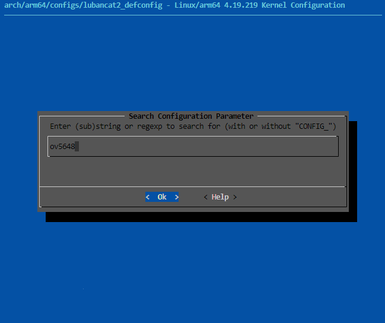
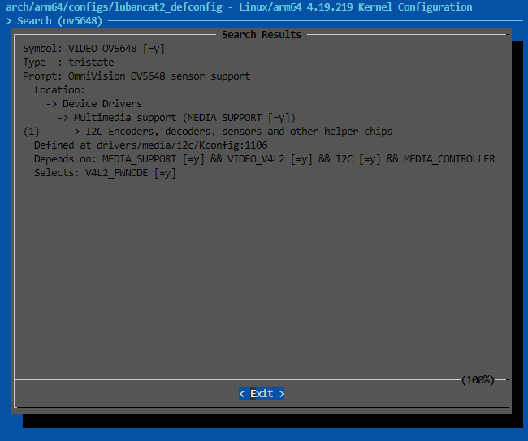

从图中可以很明显看出 `ov5648` 配置选项位于 `-> Device Drivers` 选项下的 `-> Multimedia support (MEDIA_SUPPORT [=y])` 下的 `-> I2C Encoders, decoders, sensors and other helper chips` 的选项中， 其实也可以按下 `"1"` 直接可以定位到对应的选项， 然后选中以下内容即可，具体见图：


可使用 `y、n、m` 键更改ov5648驱动的配置时， 其中y表示编译进内核中，m表示编译成模块，n表示不编译。 也可使用空格选择ov5648驱动的配置选项。

想要配置其他的驱动也是如此。

修改完成后，选择右下角Save进行保存， **注意不要保存到原路径，而是保存到.config** ，然后使用以下命令来保存defconfig文件并覆盖原来的配置文件。


```bash
# 保存defconfig文件
make savedefconfig ARCH=arm64

# 覆盖原来的配置文件
cp defconfig arch/arm64/configs/lubancat2_defconfig
```

这样保存的原因是配置文件默认是精简版本的，编译使用时会和默认的配置文件进行比较从而得到完整的配置，如果直接保存则是完整版本的，会比精简版多几千行配置，不利于观察、修改。

### 4.2.2. 修改内核配置(LubanCat_Gen_SDK)

在LubanCat_Gen_SDK中，除了使用上一小节 **修改内核配置(LubanCat_Chip_SDK)** 提供的在kernel目录下使用 `make menuconfig` 来打开配置界面的方法以外， 还新增了在SDK顶层目录中直接使用 `./build.sh kconfig` 命令来进入menuconfig配置界面，当退出配置界面后，还可以自动生成defconfig并保存到对应的配置文件中。


## 4.3. 内核裁剪(重要,非搬运内容)
现在，我们需要根据4.2章节的内容对kernel进行一个详细的裁剪，剪掉于我们的系统所不需要的任何外设。


### 4.3.1. 确定裁剪内容
首先我们需要确定需要裁剪的内容，这里的思路是：我的开发板需要执行什么程序，这个程序需要哪些软件硬件的外设，保留这部分内容，其他的不相关的内容即是可以裁剪掉的内容。

这里以AI自动跟踪项目为例，下面是AI自动跟踪的内容介绍：

#### 基于 RK3588 的码头门机抓斗智能视觉追踪系统

##### 1. 项目概述
本项目是针对**工业港口码头**场景开发的嵌入式视觉系统，旨在解决门机作业中对**抓斗（Grab Bucket）**的实时定位与自动追踪难题。系统基于高性能嵌入式平台 **Rockchip RK3588**，深度整合了 **YOLOv11-OBB 旋转目标检测**、**ByteTrack 多目标追踪**以及 **PID 云台控制**算法。

通过部署在门机前大梁上的云台相机，系统能够全天候自动识别抓斗位置、姿态，并控制云台进行平滑、稳定的实时跟踪，为港口自动化作业提供关键的视觉引导与状态监测能力。

##### 2. 应用场景与痛点解决
*   **场景**：大型港口门座式起重机（门机），相机高空俯拍。
*   **痛点**：
    *   抓斗在作业过程中存在大幅度摇摆和旋转，传统水平框（HBB）检测定位不准。
    *   工业现场环境复杂，存在遮挡干扰，容易丢失目标。
    *   嵌入式端算力受限，难以兼顾高帧率检测与低延迟控制。
*   **解决方案**：利用 YOLOv11-OBB 实现高精度旋转框检测，结合多线程 NPU 加速与 PID 闭环控制，实现“既看得准，又跟得稳”。

##### 3. 核心技术架构

###### 3.1 感知层：YOLOv11-OBB & NPU 加速
*   **旋转框检测**：针对抓斗的不规则旋转特性，采用 **YOLOv11-OBB (Oriented Bounding Box)** 模型，相比传统水平框，能更紧密地贴合抓斗边缘，显著提升定位精度。
*   **NPU 异构计算**：利用 RK3588 内置的 6TOPS NPU，通过 `rknn_api` 直接调用硬件加速。
*   **多线程并发**：设计了 **3-Worker 并行推理架构**，充分榨干 NPU 的 3 个核心，大幅提升系统吞吐量（FPS）。

###### 3.2 调度层：帧同步与乱序重排
为了解决多线程推理导致的“结果返回乱序”问题（即后采集的帧先推理完成），设计了基于 **Frame ID** 的轻量级调度器。

*   **核心逻辑**：
    1.  **帧绑定**：采集时将图像与全局递增的 `frame_id` 绑定。
    2.  **局部排序**：主线程维护一个缓冲区，对 Worker 返回的乱序结果进行重排。
    3.  **追新补空**：优先处理最新帧；若中间出现丢帧，自动触发追踪器的预测模式（Predict Only）以保持算法状态连续。

###### 3.3 追踪层：ByteTrack & 轨迹预测
*   **ByteTrack 算法**：采用关联匹配策略，有效处理抓斗被部分遮挡或短暂消失的情况，保证 ID 不跳变。
*   **OBB 适配**：实现了从旋转框（OBB）到追踪器所需格式的转换适配。
*   **轨迹平滑**：引入卡尔曼滤波（Kalman Filter）对抓斗运动轨迹进行平滑预测，减少检测抖动对控制系统的影响。

###### 3.4 控制层：自适应 PID 云台控制
*   **双环 PID**：实现了 **PTZ（云台转动）** 和 **Zoom（变焦）** 的双重 PID 闭环控制。
*   **长焦优化**：设计了**速度自适应衰减算法**。当相机处于长焦（高倍率）状态时，自动降低云台转动速度，防止画面剧烈晃动，确保远距离追踪的稳定性。
*   **VISCA 协议**：通过 TCP 网络发送 VISCA 指令，直接驱动工业级云台相机。


##### 4. 系统功能与交互
*   **Web 管理后台**：基于 `httplib` 开发，支持参数热更新（PID系数、追踪灵敏度）、系统重启及状态监控。
*   **实时预览**：支持通过 WebSocket 推送 JPEG 流，或通过 UDP 协议向上位机推送带检测框的调试视频流。
*   **配置持久化**：支持 JSON 格式的配置文件读写，方便现场部署与调试。


然后，将项目的介绍以及情况说明全部告诉大语言模型，得到我们的裁剪大纲：

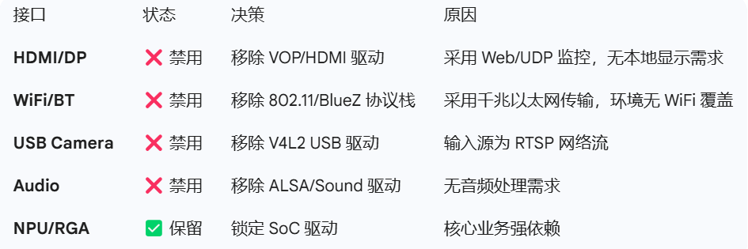


接下来，即可根据这个裁剪大纲进行裁剪。

### 4.3.2. 手动裁剪
现在，我们需要根据4.2章节的内容对kernel进行一个详细的裁剪，剪掉于我们的系统所不需要的任何外设。

但是：内核裁剪的时候，给的列表太多太杂。作为一个小白，我根本不知道，或者说解析不了哪些我需要，哪些我不需要。这太麻烦了

怎么办呢？我们这里使用AI来配合我们完成裁剪项的裁剪，对于多模态大模型，可以直接将每一页的配置项截图给大模型，让大模型替我们进行筛选，就这样一直循环往复，把近乎全部的配置项都给大模型看看，让他帮我们做决策裁剪。以下图为例：


随后，根据大模型给出的答案进行裁剪。

裁剪完成后，使用4.2.2的方法保存配置，接下来即可进入4.3进行编译。在编译过程中很可能会遇到各种库缺失、依赖报错等问题，这些问题均可以通过大语言模型进行配合解决。

## 4.4. kernel编译

>[!TIP]
本节需要输入命令的操作，需在SDK顶层文件夹下进行

在LubanCat-SDK中，自动编译脚本基本上都存放在build.sh中，这是SDK的主要功能入口

对于kernel的编译，有两种方式。一种是rk标准的boot分区，称为rkboot分区(已弃用)，另一种是野火修改的extboot分区。

rkboot分区是以二进制形式打包的，各个部分存放的地址经过了严格定义，读取文件时通过二进制文件头去判断文件的种类，目前LubanCat板卡已停止支持。

而我们修改的extboot分区，是以ext4格式存储文件的，在系统内是可读可修改的，大大增加了便利性。 我们以此为基础，为extboot分区系统增加了在线更新内核版本，修改设备树插件，切换主设备树的功能， 最终实现了一个镜像通用所有使用同一型号处理器的LubanCat板卡的功能。

直接使用build.sh即可：
```bash
./build.sh kernel
```


# 5.根文件系统的介绍、编译

参考搬运链接：[12. 根文件系统的介绍 — [野火]嵌入式Linux镜像构建与部署——基于LubanCat-RK系列板卡 文档](https://doc.embedfire.com/linux/rk356x/build_and_deploy/zh/latest/building_image/rootfs_introduce/rootfs_introduce.html)

## 5.1. 根文件系统简介

根文件系统首先是内核启动时所mount的第一个文件系统，内核代码映像文件保存在根文件系统中，而系统引导启动程序会在根文件系统挂载之后从中把一些基本的初始化脚本和服务等加载到内存中去运行。 相当于windows下的C盘，保存了系统启动后的应用程序和系统配置

## 5.2. 根文件系统目录简介

**/bin目录**

该目录下的命令可以被root与一般账号所使用，由于这些命令在挂接其它文件系统之前就可以使用，所以/bin目录必须和根文件系统在同一个分区中。 /bin目录下常用的命令有：cat、chgrp、chmod、cp、ls、sh、kill、mount、umount、mkdir等。我们之后在利用Busybox制作根文件系统时，在生成的bin目录下，可以看到一些可执行的文件，也就是可用的一些命令。

**/sbin 目录**

该目录下存放系统命令，即只有系统管理员（俗称最高权限的root）能够使用的命令，系统命令还可以存放在/usr/sbin,/usr/local/sbin目录下，/sbin目录中存放的是基本的系统命令，它们用于启动系统和修复系统等，与/bin目录相似，在挂接其他文件系统之前就可以使用/sbin，所以/sbin目录必须和根文件系统在同一个分区中。 /sbin目录下常用的命令有：shutdown、reboot、fdisk、fsck、init等，本地用户自己安装的系统命令放在/usr/local/sbin目录下。

**/dev目录**

该目录下存放的是设备与设备接口的文件，设备文件是Linux中特有的文件类型，在Linux系统下，以文件的方式访问各种设备，即通过读写某个设备文件操作某个具体硬件。比如通过”dev/ttySAC0”文件可以操作串口0，通过”/dev/mtdblock1”可以访问MTD设备的第2个分区。比较重要的文件有/dev/null, /dev/zero, /dev/tty, /dev/lp*等。

**/etc目录**

该目录下存放着系统主要的配置文件，例如人员的账号密码文件、各种服务的其实文件等。一般来说，此目录的各文件属性是可以让一般用户查阅的，但是只有root有权限修改。对于PC上的Linux系统，/etc目录下的文件和目录非常多，这些目录文件是可选的，它们依赖于系统中所拥有的应用程序，依赖于这些程序是否需要配置文件。在嵌入式系统中，这些内容可以大为精减。

**/lib目录**

该目录下存放共享库和可加载（驱动程序），共享库用于启动系统。运行根文件系统中的可执行程序，比如：/bin /sbin 目录下的程序。

**/home目录**

系统默认的用户文件夹，它是可选的，对于每个普通用户，在/home目录下都有一个以用户名命名的子目录，里面存放用户相关的配置文件。

**/root目录**

系统管理员（root）的主文件夹，即是根用户的目录，与此对应，普通用户的目录是/home下的某个子目录。

**/usr目录**

/usr目录的内容可以存在另一个分区中，在系统启动后再挂接到根文件系统中的/usr目录下。里面存放的是共享、只读的程序和数据，这表明/usr目录下的内容可以在多个主机间共享，这些主要也符合FHS标准的。/usr中的文件应该是只读的，其他主机相关的，可变的文件应该保存在其他目录下，比如/var。/usr目录在嵌入式中可以精减。

**/var目录**

与/usr目录相反，/var目录中存放可变的数据，比如spool目录（mail,news），log文件，临时文件。

**/proc目录**

这是一个空目录，常作为proc文件系统的挂接点，proc文件系统是个虚拟的文件系统，它没有实际的存储设备，里面的目录，文件都是由内核 临时生成的，用来表示系统的运行状态，也可以操作其中的文件控制系统。

**/mnt目录**

用于临时挂载某个文件系统的挂接点，通常是空目录，也可以在里面创建一引起空的子目录，比如/mnt/cdram /mnt/hda1 。用来临时挂载光盘、移动存储设备等。

**/tmp目录**

用于存放临时文件，通常是空目录，一些需要生成临时文件的程序用到的/tmp目录下，所以/tmp目录必须存在并可以访问。

对于嵌入式Linux系统的根文件系统来说，一般可能没有上面所列出的那么复杂，比如嵌入式系统通常都不是针对多用户的，所以/home这个目录在一般嵌入式Linux中可能就很少用到，而/boot这个目录则取决于你所使用的BootLoader是否能够重新获得内核映象从你的根文件系统在内核启动之前。一般说来，只有/bin，/dev，/etc，/lib，/proc，/var，/usr这些需要的，而其他都是可选的。


# 6. Debian根文件系统构建

参考搬运链接：[13. Debian根文件系统构建 — [野火]嵌入式Linux镜像构建与部署——基于LubanCat-RK系列板卡 文档](https://doc.embedfire.com/linux/rk356x/build_and_deploy/zh/latest/building_image/debian_rootfs/debian_rootfs.html#id9)

借助LubanCat-SDK我们可以方便的一键构建Debian镜像，但是Debian根文件系统的构建过程是相对独立的，不依赖SDK的其他部分。

Debian根文件系统借助live build来进行构建，live build是⼀组⽤于构建实时系统映像的脚本。 live build是⼀个⼯具套件，它使⽤⼀个配置⽬录来完全⾃动化和定制构建live镜像的所有⽅⾯。

除了live build外，我们的Debian构建仓库还有很多构建脚本，可以最大化的减少人工操作，使构建的根文件系统具有一致性。

## 6.1. Debian系统支持情况

### 6.1.1. LubanCat_Linux_Generic_SDK

根据内核版本，Kernel-5.10支持Debian 11 “Bullseye” , Kernel-6.1支持Debian 12 “Bookworm”

- lite无桌面版本
    
- gnome桌面版本(默认桌面)
    
- xfce桌面版本(默认桌面)
    

### 6.1.2. LubanCat_Linux_rk356x_SDK

仅支持Debian 10 “Buster”。

- lite无桌面版本
    
- xfce4桌面版本
    
- xfce4-full桌面版本
    

### 6.1.3. LubanCat_Linux_rk3588_SDK

仅支持Debian 11 “Bullseye”。

- lite无桌面版本
    
- gnome桌面版本(默认桌面)
    
- xfce桌面版本(无技术支持)
    
- lxde桌面版本(无技术支持)
    

### 6.1.4. Debian源码仓库说明

Debian10 [https://github.com/LubanCat/debian](https://github.com/LubanCat/debian)

- stable-4.19-rk356x和debian10为同一分支，适用于LubanCat_Linux_rk356x_SDK
    

Debian11 [https://github.com/LubanCat/debian11](https://github.com/LubanCat/debian11)

- stable-5.10-rk3588：适用于LubanCat_Linux_rk3588_SDK
    
- debian11：适用于LubanCat_Linux_Generic_SDK适用5.10内核的板卡
    

Debian12 [https://github.com/LubanCat/debian12](https://github.com/LubanCat/debian12)

- debian12：适用于LubanCat_Linux_Generic_SDK适用6.1内核的板卡
    

## 6.2. 什么是Debian

以下文档以Debian10为例进行演示，Debian11内容类似。如使用Debian11， 将相关内容或脚本中的”debian10“和”buster“替换为“debian11”和“bullseye”即可


Debian GNU/Linux(简称Debian),是目前世界最大的非商业性Linux发行版之一, 是⼀种完全⾃由开放并⼴泛⽤于各种设备的 Linux 操作系统。

Debian的特点：

- 面向用户的 Debian
    
    - Debian 是自由软件，每個人都能自由使用、修改，以及分发。
        
    - 稳定且安全。
        
    - 广泛的硬件支持。
        
    - 提供平滑的更新。
        
    - 是许多其他发行版的基础。
        
    - Debian项目是一個社区。
        
- 面向开发者的Debian
    
    - 支持多种硬件架构，包括 AMD64、i386，ARM和MIPS等
        
    - 支持物联网和嵌入式设备
        
    - 拥有大量的套件，使用deb格式
        
    - 不同的发布版本
        
    - 公开的错误跟踪系统
        

Debian官网：[https://www.debian.org/](https://www.debian.org/)

## 6.3. Debian根文件系统构建仓库

在我们发布的LubanCat-SDK中就已经包含了完整的Debian根文件系统构建项目，保存在SDK的debian目录下。

进入debian目录下，有以下文件

```bash
ls -hgG

-rwxrwxr-x  1 1.1K 3月  10 11:04 mk-base-debian.sh
-rwxrwxr-x  1 8.1K 3月  10 11:25 mk-buster-rootfs.sh
-rwxrwxr-x  1  477 3月  10 10:49 mk-image.sh
-rwxrwxr-x  1  441 12月 26 15:18 mk-rootfs.sh
drwxrwxr-x  7   67 11月 30 11:19 overlay
drwxrwxr-x  5   49 11月 30 11:19 overlay-debug
drwxrwxr-x  4   28 11月 30 11:19 overlay-firmware
drwxrwxr-x  3   19 11月 30 11:19 packages
drwxrwxr-x  5   47 11月 30 11:19 packages-patches
-rwxrwxr-x  1 3.0K 11月 30 11:19 post-build.sh
-rw-rw-r--  1 2.6K 3月  10 11:17 readme.md
drwxrwxr-x  7  164 11月 30 11:19 ubuntu-build-service
```

- mk-base-debian.sh:清理构建目录并调用live build开始构建。
    
- mk-buster-rootfs.sh：添加Rockchip overlay层。
    
- mk-image.sh：将根文件系统打包成img镜像文件
    
- overlay：Rockchip overlay层，主要是rootfs中的配置文件
    
- overlay-debug：Rockchip overlay层，主要是debug脚本和工具
    
- overlay-firmware：Rockchip overlay层，主要是wifi/bt/npu的固件
    
- packages：硬件加速包
    
- ubuntu-build-service：用于搭建构建环境的依赖文件和live build配置文件
    

目前构建脚本支持三种版本的镜像构建

- lite：无桌面,终端版
    
- xfce：使用xfce套件的桌面版
    
- xfce-full：使用xfce套件+更多推荐软件包的桌面版
    

## 6.4. Debian根文件系统构建流程

Debian根文件系统的构建主要分为三个步骤

第一步：使用live build工具构建lite-debian或xfce-debian根文件系统。使用mk-base-debian.sh脚本实现。

第二步：添加基于RK处理器进行功能增强的软件包如GPU驱动和硬件firmware等。使用mk-buster-rootfs.sh脚本实现。

第三步：将构建完成的根文件系统打包成img格式，方便烧录和下一步处理。通过mk-image.sh脚本实现，在第二步完成后自动调用。

## 6.5. 搭建构建环境

在debian目录下执行以下命令

```bash
sudo apt-get install binfmt-support qemu-user-static
sudo dpkg -i ubuntu-build-service/packages/*
sudo apt-get install -f
```

上面的命令执行过程中可能有警告或报错，这是正常现象，我们直接忽略报错即可。


## 6.6. 构建Debian根文件系统镜像

在ubuntu-build-service目录下，根据lite或xfce版本，armhf或arm64架构的不同， 已经保存了live build的一些预设文件，如软件包列表、用户名、密码、用户组、时区等配置。

我们使用mk-base-debian.sh脚本来调用live build构建相应的Debian根文件系统。

理论上生成的根文件系统已经能在我们的板卡上运行了，不过还没有添加针对板卡的配置， 如网络，显示等，只能运行核心的服务。

下面我们来看一下具体的构建过程：

### 6.6.1. 构建debian-base基础根文件系统

我们在debian目录下运行下面的命令

```bash
./mk-base-debian.sh
```

选择要构建的Debian版本,这里我们选择xfce版本，输入2并按下Enter按键，根据提示输入用户密码

```bash
---------------------------------------------------------
please enter TARGET version number:
请输入要构建的根文件系统版本:
[0] Exit Menu
[1] lite
[2] xfce
[3] xfce-full
---------------------------------------------------------
2
```

整个构建时间较长，等待命令结束以后我们看一下debian目录下的文件变化：

```bash
ls -hgG

-rw-rw-rw-  1 370M 3月  10 14:04 linaro-buster-xfce-alip-20230418.tar.gz
-rwxrwxr-x  1 1.1K 3月  10 11:04 mk-base-debian.sh
-rwxrwxr-x  1 8.1K 3月  10 11:25 mk-buster-rootfs.sh
-rwxrwxr-x  1  477 3月  10 10:49 mk-image.sh
-rwxrwxr-x  1  441 12月 26 15:18 mk-rootfs.sh
drwxrwxr-x  7   67 11月 30 11:19 overlay
drwxrwxr-x  5   49 11月 30 11:19 overlay-debug
drwxrwxr-x  4   28 11月 30 11:19 overlay-firmware
drwxrwxr-x  3   19 11月 30 11:19 packages
drwxrwxr-x  5   47 11月 30 11:19 packages-patches
-rwxrwxr-x  1 3.0K 11月 30 11:19 post-build.sh
-rw-rw-r--  1 2.6K 3月  10 11:17 readme.md
drwxrwxr-x  7  164 11月 30 11:19 ubuntu-build-service
```

新增的文件linaro-buster-xfce-alip-20230418.tar.gz就是刚刚通过live build构建的基础debian根文件系统的压缩包

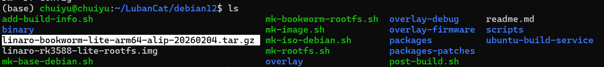

### 6.6.2. 构建完整的debian根文件系统

通过上一步骤构建的根文件系统已经可以在板卡上运行了，为了进一步优化在LubanCat上运行的效果， 我们还要添加Rockchip overlay层，里面主要是一些配置文件和固件，用于添加或覆盖根文件系统中原有的配置文件。

```bash
./mk-buster-rootfs.sh
```

>[!Warning]
>在最新版本中，运行的脚本名称为mk-bookworm-rootfs.sh，而非mk-buster-rootfs.sh


选择要构建的Debian版本,这里我们选择xfce版本，输入2并按下Enter按键，根据提示输入用户密码

```bash
---------------------------------------------------------
please enter TARGET version number:
请输入要构建的根文件系统版本:
[0] Exit Menu
[1] lite
[2] xfce
[3] xfce-full
---------------------------------------------------------
2
```

```bash
drwxr-xr-x 23  270 3月  10 14:57 binary
-rw-rw-rw-  1 370M 3月  10 14:04 linaro-buster-xfce-alip-20230418.tar.gz
-rw-rw-r--  1 1.3G 3月  10 14:11 linaro-xfce-rootfs.img
-rwxrwxr-x  1 1.1K 3月  10 11:04 mk-base-debian.sh
-rwxrwxr-x  1 8.1K 3月  10 11:25 mk-buster-rootfs.sh
-rwxrwxr-x  1  477 3月  10 10:49 mk-image.sh
-rwxrwxr-x  1  441 12月 26 15:18 mk-rootfs.sh
drwxrwxr-x  7   67 11月 30 11:19 overlay
drwxrwxr-x  5   49 11月 30 11:19 overlay-debug
drwxrwxr-x  4   28 11月 30 11:19 overlay-firmware
drwxrwxr-x  3   19 11月 30 11:19 packages
drwxrwxr-x  5   47 11月 30 11:19 packages-patches
-rwxrwxr-x  1 3.0K 11月 30 11:19 post-build.sh
-rw-rw-r--  1 2.6K 3月  10 11:17 readme.md
drwxrwxr-x  7  164 11月 30 11:19 ubuntu-build-service
```

构建完成后，在debian目录下增加了binary目录。里面存放的是解压后的根文件系统， 我们将要覆盖或添加的文件复制进去，然后通过chroot命令进行修改。

### 6.6.3. 打包debian-lite根文件系统镜像

在脚本./mk-buster-rootfs.sh的最后，自动调用了 IMAGE_VERSION=$TARGET ./mk-image.sh 脚本来打包镜像, TARGET就是我们在运行脚本时选择的Debian版本。

脚本运行完成后，我们就得到了名为linaro-xfce-rootfs.img的根文件系统镜像文件。

## 6.7. 定制Debian根文件系统
由于镜像体积的限制，我们提供的定制Debian镜像预装了一部分常用软件， 但是在用户开发时可能还需要预装更多的软件，以及对根文件系统做进一步的定制。 以下部分将对根文件系统的修改做具体说明。

### 6.7.1. 删除预装软件包(重要,非搬运内容)

对于预装软件的删除，鲁班猫官方并没有给出具体的教程，但我们的核心需求是给Debian做减法，因此下面是有关于删除软件包的教程：

**进入目录**： 

```bash
cd ubuntu-build-service
ls
```
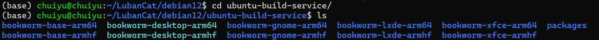

**找到软件包列表 (Package Lists)**： 
根据自己的编译的需求既然进入对应的版本包里面去，例如我这里进入的是：
```bash
cd bookworm-base-arm64/customization/package-lists/
```

>[!TIP]
>bookworm-base-arm64 既是所有版本的“地基”（公共基础），也是 Lite 版本的“本体”
>


**修改列表**： 你会发现里面有一些 `.list.chroot` 结尾的文件。打开它们，里面就是密密麻麻的软件名。

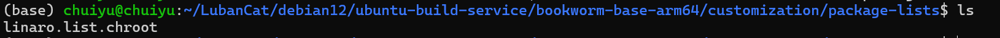

```bash
vim linaro.list.chroot
```

删！ 看到你不想要的，比如 vim (如果你只用 vi), man-db (说明书), rsyslog (日志服务), avahi-daemon (发现服务)。
注意：不要删 systemd, udev, kmod 这种系统骨架，否则开不了机。

**同样的，这一块对于裁剪内容拿捏不准的可以通过询问大语言模型解决。**


**重新烹饪**： 改完列表后，**必须重新运行** `./mk-base-debian.sh`。这时候生成的那个 `tar.gz` 压缩包，就是天生瘦身过的了。


### 6.7.2. 其他删除维度
#### 1. 维度一：清理“隐形垃圾” (Filesystem Cleaning)

Debian 默认会安装大量的文档、手册和多语言支持，这些在嵌入式设备上通常是 100% 的死重。

**操作位置**：在你的 `mk-bookworm-rootfs.sh` 打包镜像命令之前，插入这些 `rm` 命令。

##### (1) 屠杀帮助文档 (`/usr/share/doc`, `man`, `info`)

哪怕是 Lite 版，`coreutils` 等基础包也会带一大堆说明书。


```bash
# 这种操作在嵌入式里非常标准
rm -rf $TARGET_ROOTFS_DIR/usr/share/doc/*
rm -rf $TARGET_ROOTFS_DIR/usr/share/man/*
rm -rf $TARGET_ROOTFS_DIR/usr/share/info/*
# 甚至可以删掉 lintian (Debian打包检查工具残留)
rm -rf $TARGET_ROOTFS_DIR/usr/share/lintian/*
```

- **收益**：约 **50MB - 100MB**。

##### (2) 语言包大清洗 (`locales`)

默认情况下，很多软件会带上全球几十种语言的翻译文件（`.mo` 文件）。你只需要中文和英文。

```bash
# 方案 A：暴力删除非中英文目录 (简单粗暴)
# 进入 /usr/share/locale/ 目录，保留 en* 和 zh*，其他全删
find $TARGET_ROOTFS_DIR/usr/share/locale/ -maxdepth 1 -type d | grep -v -E "en|zh|locale$" | xargs rm -rf

# 方案 B (更优雅)：在构建时安装 localepurge 工具
# 配置 /etc/locale.nopurge 文件，只保留 en_US.UTF-8 和 zh_CN.UTF-8
```

- **收益**：约 **30MB - 50MB**。

##### (3) Apt 缓存清理

构建过程中下载的 `.deb` 安装包如果不清理，会被打包进镜像。

```bash
rm -rf $TARGET_ROOTFS_DIR/var/lib/apt/lists/*
rm -rf $TARGET_ROOTFS_DIR/var/cache/apt/archives/*
```

- **收益**：视安装软件数量而定，约 **20MB - 100MB**。


对于上述的三个清理部分，均是在mk-bookworm-rootfs.sh中进行的。请找到脚本的倒数第二行，也就是 EOF 和最后一行执行命令之间。
```bash
rm -rf /sha256sum*

EOF #<--- 这里的 EOF 表示退出了 chroot 环境
# ================= ✂️ 裁剪开始 (CUT HERE) ✂️ =================

echo -e "\033[47;36m [Ext] Starting Deep Cleaning... \033[0m"

# 1. 清理文档 (Docs/Man/Info)
# 注意：因为是在宿主机操作 rootfs，必须加 sudo
sudo rm -rf $TARGET_ROOTFS_DIR/usr/share/doc/*
sudo rm -rf $TARGET_ROOTFS_DIR/usr/share/man/*
sudo rm -rf $TARGET_ROOTFS_DIR/usr/share/info/*
sudo rm -rf $TARGET_ROOTFS_DIR/usr/share/lintian/*

# 2. 清理多语言包 (Locales) - 方案A：暴力删除
# 只保留 en (英文) 和 zh (中文) 开头的目录，以及 locale 自身目录
# 注意：这里 xargs 后面也要加 sudo，否则权限不足删不掉
echo -e "\033[47;36m [Ext] Cleaning unused locales... \033[0m"
sudo find $TARGET_ROOTFS_DIR/usr/share/locale/ -maxdepth 1 -type d | grep -v -E "en|zh|locale$" | xargs sudo rm -rf

# 3. 二次清理 Apt 缓存 (防止 chroot 内部清理不干净)
sudo rm -rf $TARGET_ROOTFS_DIR/var/lib/apt/lists/*
sudo rm -rf $TARGET_ROOTFS_DIR/var/cache/apt/archives/*
sudo rm -rf $TARGET_ROOTFS_DIR/var/cache/apt/*.bin

echo -e "\033[47;36m [Ext] Deep Clean Finished. \033[0m"

# ================= ✂️ 裁剪结束 (CUT END) ✂️ =================

TARGET=$TARGET SOC=$SOC ./mk-image.sh

```

>[!question] 为什么插在这里？（原理说明）
>变量作用域：
>>在 EOF 之前的内容，是发送给 sudo chroot $TARGET_ROOTFS_DIR 执行的。在那个环境里，根目录就是 /，系统不认识 $TARGET_ROOTFS_DIR 这个变量。
>在 EOF 之后，脚本回到了你的 Ubuntu 宿主机环境，此时 $TARGET_ROOTFS_DIR 指向 binary 文件夹，这时候执行删除操作才是对的。
>
>权限问题：
>>Rootfs 里的文件属于 root 用户。所以在宿主机操作时，所有的 rm 命令都必须加上 sudo。我帮你修改的代码里已经加上了 sudo。
>
>执行时机：
>>必须在所有软件安装完（apt-get install 结束）、所有设置搞定之后，才能进行清理。
>必须在 ./mk-image.sh 之前，因为 mk-image.sh 会把 $TARGET_ROOTFS_DIR 里的东西打包成 .img 文件。如果在打包后删，就白删了。

#### 2. 维度二：用户体验微调 (UX Tweaks)

这是让你的系统看起来像个“产品”而不是“半成品”的关键`。

##### (1) 串口自动登录 (Auto Login)

开发板每次开机都要输 `root` / `1234` 很烦？ **修改**：`$TARGET_ROOTFS_DIR/lib/systemd/system/serial-getty@.service`
实际上的路径是：
```bash
cd debian12/overlay/usr/lib/systemd/system
```

```Ini
# 把这一行：
ExecStart=-/sbin/agetty -o '-p -- \\u' --keep-baud 115200,38400,9600 %I $TERM
# 改成：
ExecStart=-/sbin/agetty --autologin root -o '-p -- \\u' --keep-baud 115200,38400,9600 %I $TERM
```

##### (2) 修改 Hostname 和 Issue

- **Hostname**: 别叫 `localhost` 或 `debian` 了，改成 `LubanCat-Custom`。
    
- **Issue**: 修改 `/etc/issue`，把登录前的 `Debian GNU/Linux 12` 换成你自己的 Logo 字符画。

这里不做Hostname和issue的修改操作，如需修改可自行询问ai


### 6.7.3. 添加预装软件包

对于预装软件的添加，我们建议放在mk-buster-rootfs.sh脚本中， 这样在我们做修改以后，只要重复添加Rockchip overlay层和打包img镜像的过程即可， 可以节约大量的开发时间。

比如我们想要预装git和vim到根文件系统中， 则可以在mk-buster-rootfs.sh添加以下内容

```bash
export APT_INSTALL="apt-get install -fy --allow-downgrades"
#添加的位置在 export APT_INSTALL 下一行

#添加的内容是
echo -e "\033[47;36m ---------- LubanCat -------- \033[0m"
\${APT_INSTALL} git vim
```

### 6.7.4. 添加外设firmware

如果我们使用无线网卡这样的外设，就需要向根文件系统中添加网卡的firmware， 这时直接将对应的firmware存放在overlay-firmware/目录下，按根文件系统中的路径保存。

### 6.7.5. 添加服务项及配置文件

我们希望对有些服务项的配置进行自定义，就可以在overlay/目录下添加对应的配置文件。 制作根文件系统的过程中，在添加Rockchip overlay层的时候，就会添加或替换根文件系统中原有的配置文件， 以实现对配置文件自定义的效果。

这里我们以Debian控制台登录时的banner配置为例，他的配置文件在根文件系统的/etc/update-motd.d目录下， 这里对应的是overlay/etc/update-motd.d/目录。

我们在overlay/etc/update-motd.d/中新建一个名为00-header的文件，在文件中添加以下内容：

```bash
#!/bin/sh
#

[ -r /etc/lsb-release ] && . /etc/lsb-release

printf "\n"
echo "\e[1;34m
        OO                            OO
        OOOO                        OOOO
        OOOOO                     OOOOOO
        OOOOOOO                 .OOOOOOO
        OOOOOOOOO              OOOOOOOOO
        OOOOOOOOOOO          OOOOOOOOOOO
        OOOOOOOOOOOOOOOOOOOOOOOOOOOOOOOO
        OOOOOOOOOOOOOOOOOOOOOOOOOOOOOOOO
        OOOOO\    OOOOOOOOOOOO    /OOOOO
        OOOOOOOOO    OOOOOO     OOOOOOOO
        OOOOO/    OOOOOOOOOOOOO   \OOOOO
        OOOOOOOOOOOOOOOOOOOOOOOOOOOOOOOO
        OOOOOOOOOOOOOO\￣/OOOOOOOOOOOOOO
        OOOOOOOOOOOOOOO\/OOOOOOOOOOOOOOO
        OOOOOOOOOOOOOOOOOOOOOOOOOOOOOOOO
_            _                     ____        _
| |    _   _ | |__    ____  _____  / ___| ____ | |_
| |   | | | | '_ \  / _  |  _  | |    / _  | __|
| |___| |_| | |_) | (_| | | | | |___| (_| | |_
|_____|\__._|_.__/  \__'_|_| |_| \____|\__'_| \__|
\e[0m"

if [ -z "$DISTRIB_DESCRIPTION" ] && [ -x /usr/bin/lsb_release ]; then
    # Fall back to using the very slow lsb_release utility
    DISTRIB_DESCRIPTION=$(lsb_release -s -d)
fi
printf "\n"
printf "Welcome to %s (%s %s %s)\n" "$DISTRIB_DESCRIPTION" "$(uname -o)" "$(uname -r)" "$(uname -m)"
```

这个脚本的作用是生成动态的banner。

>[!TIP]
>生成 ASCII 艺术画  
>>文字 Logo： 访问 TAAG，[http://patorjk.com/software/taag/](http://patorjk.com/software/taag/) 输入公司名称，选择你喜欢的字体（常用字体如 Slant 或 Standard），然后复制输出的字符。  
>
>>图片 Logo： 访问 [https://www.asciiart.eu/image-to-ascii](https://www.asciiart.eu/image-to-ascii) 网站，上传图片即可转为字符块。


在添加配置文件以后，我们重新构建镜像，再烧录到板卡启动，就可以达到我们想要的banner效果。

>[!TIP]
如果添加的是shell脚本，需要在创建文件后修改文件权限为775，否则在根文件系统中可能无法执行。


### 6.7.6. 重新打包根文件系统镜像

在对根文件系统的构建脚本做出修改之后，我们要重新打包debian-xfce/lite-rootfs.img镜像。

- 如果我们没有修改live build的配置文件，则不需要重复构建基础镜像部分。如果修改了配置文件，则需重新构建，要手动删除基础镜像压缩包，然后使用mk-base-debian.sh脚本构建。
    

```bash
# 删除基础镜像压缩包
rm linaro-*-alip-*.tar.gz

#构建基础镜像
mk-base-debian.sh
```

- 如果修改了mk-buster-rootfs.sh、overlay、overlay-debug、overlay-firmware、packages的内容，则需要执行
    

```bash
#构建完整的根文件系统镜像
./mk-buster-rootfs.sh
```

## 6.8. 使用LubanCat-SDK一键构建

在完成 **搭建构建环境** 以后，我们也可以直接使用一键构建命令， 就可以构建我们提供的定制根文件系统镜像了， 还可以借助SDK的镜像打包功能，将U-boot、内核等部分也一并打包成一个完整的系统镜像。

### 6.8.1. SDK配置文件说明(Gen)

LubanCat板卡的SDK配置文件在device/rockchip/.chips目录内按照处理器型号存放，以LubanCat_CPU型号_系统类型_系统版本_defconfig命名

由于LubanCat_Linux_Generic_SDK的配置系统，可以处理各模块和参数的依赖关系，此处存放的仅为最小配置文件， 完整的SDK配置文件在SDK构建时会自动生成，并保存在output/.config中


### 6.8.2. build.sh中的自动构建脚本

Debian根文件系统的一键构建功能，主要由build.sh脚本中的以下函数实现

>[!TIP]
>以下内容中对function build_debian()的描述仅适用于LubanCat_Chip_SDK。在LubanCat_Gen_SDK中编译流程基本相同，具体内容可以查看device/rockchip/common/scripts/mk-rootfs.sh

```bash
function build_debian(){
    ARCH=${RK_DEBIAN_ARCH:-${RK_ARCH}}
    case $ARCH in
        arm|armhf) ARCH=armhf ;;
        *) ARCH=arm64 ;;
    esac

    echo "=========Start building debian for $ARCH========="
    echo "RK_DEBIAN_VERSION: $RK_DEBIAN_VERSION"
    echo "RK_ROOTFS_TARGET: $RK_ROOTFS_TARGET"
    echo "RK_ROOTFS_DEBUG: $RK_ROOTFS_DEBUG"
    echo " "

    cd debian

    if [[ "$RK_DEBIAN_VERSION" == "stretch" | "$RK_DEBIAN_VERSION" == "9" ]]; then
        RELEASE='stretch'
    elif [[ "$RK_DEBIAN_VERSION" == "buster" | "$RK_DEBIAN_VERSION" == "10" ]]; then
        RELEASE='buster'
    elif [[ "$RK_DEBIAN_VERSION" == "bullseye" | "$RK_DEBIAN_VERSION" == "11" ]]; then
        RELEASE='bullseye'
    else
        echo -e "\033[36m please input the os type,stretch or buster...... \033[0m"
    fi

    if [ ! -e linaro-$RK_ROOTFS_TARGET-rootfs.img ]; then
        echo "[ No linaro-$RK_ROOTFS_TARGET-rootfs.img, Run Make Debian Scripts ]"
        if [ ! -e linaro-$RELEASE-$RK_ROOTFS_TARGET-alip-*.tar.gz ]; then
            echo "[ build linaro-$RELEASE-$RK_ROOTFS_TARGET-alip-*.tar.gz ]"
            RELEASE=$RELEASE TARGET=$RK_ROOTFS_TARGET ARCH=$ARCH ./mk-base-debian.sh
        fi

        RELEASE=$RELEASE TARGET=$RK_ROOTFS_TARGET VERSION=$RK_ROOTFS_DEBUG SOC=$RK_SOC ARCH=$ARCH ./mk-rootfs.sh
    else
        echo "[    Already Exists IMG,  Skip Make Debian Scripts    ]"
        echo "[ Delate linaro-$RK_ROOTFS_TARGET-rootfs.img To Rebuild Debian IMG ]"
    fi

    finish_build
}
```

其工作流程如下

- 使用echo命令打印相关配置信息。
    
- 判断linaro-$RK_ROOTFS_TARGET-rootfs.img是否存在( **$RK_ROOTFS_TARGET** 为配置文件中定义的是否为桌面版)，存在则跳过构建过程，不存在则运行构建命令。根文件系统构建时间很长，不希望频繁构建根文件系统或使用已经构建好的根文件系统镜像。
    
- 判断构建基础镜像是否存在，不存在则构建基础镜像，若存在则跳过基础镜像构建过程。除了首次构建外，我们一般不会去修改基础镜像。
    
- 以基础镜像为基础，添加rockchip overlay。
    
- 打包完整镜像。
    

### 6.8.3. 编译前的准备工作

在编译开始前，首先要确保SDK的配置文件与要编译的rootfs一致， 如果当前配置文件与要编译的rootfs不一致，需要先切换配置文件。

```bash
# 选择SDK配置文件 LubanCat_Chip_SDK直接指定
./build.sh BoardConfig-xxx-debian-版本.mk

# 选择SDK配置文件 LubanCat_Gen_SDK直接指定
./build.sh LubanCat_xxx_debian_版本_defconfig

# 选择SDK配置文件-按序号选择
./build.sh lunch
```

在设置正确的配置文件后，我们就可以进行下一步的构建工作了

### 6.8.4. 单独构建rootfs并打包

我们使用以下命令构建Debian根文件系统，

```bash
# 构建Debian
./build.sh debian
```

编译生成的rootfs镜像为linaro-$RK_ROOTFS_TARGET-rootfs.img，同时被软链接到rockdev/rootfs.ext4。

注意

只有不存在linaro-$RK_ROOTFS_TARGET-rootfs.img时，才会重新构建Debian根文件系统。如果修改了Debian根文件系统的配置文件或构建脚本，要先将buntu/linaro-$RK_ROOTFS_TARGET-rootfs.img手动删除后再重新构建。

构建完成后就可以将独立的分区表、boot.img、uboot.img等分区镜像打包成一个完整的镜像了。

在执行以下操作前，请确保已经事先完成了U-Boot编译、Kernel编译、以及刚刚完成的单独构建rootfs的过程。

确保无误后，执行以下命令

```bash
# 固件打包
./mkfirmware.sh

# 生成update.img
./build.sh updateimg
```

打包完成后，生成的镜像为rockdev/update.img，我们可以使用烧录工具将update.img烧录到板卡eMMC中或SD卡中。

### 6.8.6. 一键构建完整镜像

在设置正确的配置文件后,执行以下命令就可以一键完成U-Boot、Kernel和rootfs的编译，并生成update.img镜像

```bash
# 一键编译
./build.sh
```


打包完成后，生成的镜像为rockdev/update.img，我们可以使用烧录工具将update.img烧录到板卡eMMC中或SD卡中。