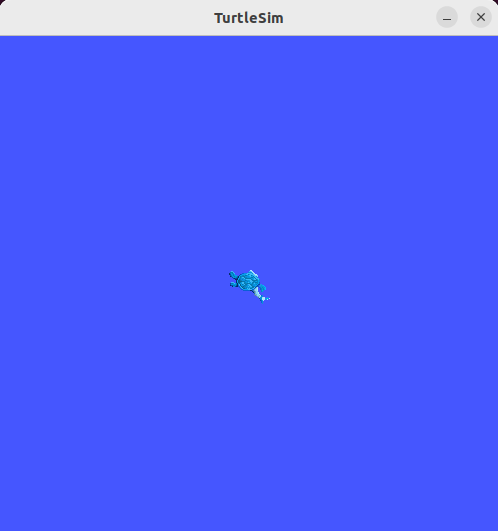
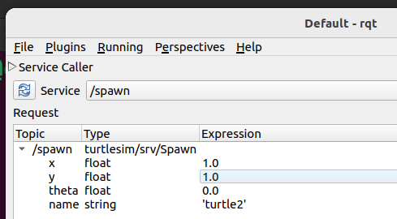
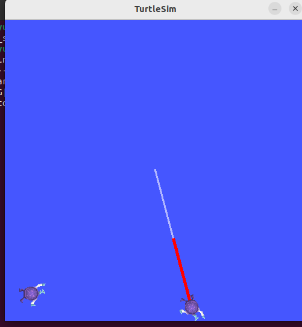

#### 2.使用turtlesim、ros2和rqt

##### 背景
Turtlesim是一个轻量级的用于学习ROS 2的模拟器。它以最基本的方式展示了ROS 2的功能，让您对以后在真实机器人或机器人模拟中要做什么有个基本的了解。

ros2工具是用户管理、检视和与ROS系统交互的方式。它支持多个命令，针对系统及其操作的不同方面。用户可以使用它来启动一个节点、设置参数、监听话题等等。ros2工具是ROS 2核心安装的一部分。

rqt 是一个用于ROS 2的图形用户界面（GUI）工具。rqt 中的所有操作都可以通过命令行完成，但是rqt 提供了一种更加用户友好的方式来操作ROS 2元素。

本教程介绍了ROS 2的核心概念，如节点（nodes）、主题（topics）和服务（services）。所有这些概念将在后续教程中详细阐述；目前，您只需设置工具并对其有所了解。


##### 1.安装turtlesim
```bash
sudo apt update

sudo apt install ros-humble-turtlesim


#检查是否安装了该软件包
ros2 pkg executables turtlesim

# 上述命令应返回turtlesim的可执行文件列表:
turtlesim draw_square
turtlesim mimic
turtlesim turtle_teleop_key
turtlesim turtlesim_node

```


##### 2.开始turtlesim
要启动turtlesim，请在终端中输入以下命令:
```bash
ros2 run turtlesim turtlesim_node
```
模拟器窗口应出现，并在中心显示一个随机的乌龟。


在终端下面的命令中，您将看到来自节点的消息：
```bash
# 节点信息
[INFO] [1760447223.878088046] [turtlesim]: Starting turtlesim with node name /turtlesim
[INFO] [1760447223.881540245] [turtlesim]: Spawning turtle [turtle1] at x=[5.544445], y=[5.544445], theta=[0.000000]

```
在那里您可以看到默认海龟的名称和它生成的坐标。

##### 3.使用turtlesim
打开一个新的终端并再次启动ROS 2。

现在您将运行一个新节点来控制第一个节点中的海龟：
```bash
ros2 run turtlesim turtle_teleop_key
```
此时，您应该已经打开了三个窗口：一个终端运行着``turtlesim_node``，一个终端运行着``turtle_teleop_key``，以及一个turtlesim窗口。调整这些窗口的位置，使您能够看到turtlesim窗口，但同时也要使运行``turtle_teleop_key``的终端处于活动状态，以便您可以控制turtlesim中的海龟。

使用键盘上的箭头键来控制海龟。它将在屏幕上移动，并使用其附加的“笔”来绘制它迄今为止所经过的路径。

您可以使用各自命令的``list``子命令查看节点及其关联的主题、服务和操作：
```bash
ros2 node list
ros2 topic list
ros2 service list
ros2 action list
```
在接下来的教程中，您将了解更多关于这些概念的内容。由于本教程的目标仅是对turtlesim进行一般概述，您将使用rqt调用一些turtlesim的服务并与``turtlesim_node``进行交互。


##### 4.安装rqt
```bash
sudo apt update

sudo apt install ~nros-humble-rqt*
```

要运行rqt：
```bash
rqt
```

##### 5.使用rqt
第一次运行rqt时，窗口将为空白。不要担心；只需在顶部的菜单栏中选择**插件** &gt; **服务** &gt; **服务调用器**。


**rqt可能需要一些时间来定位所有插件。如果你点击插件但看不到服务或任何其他选项，请关闭rqt并在终端中输入命令``rqt --force-discover``。**


请使用位于**service**下拉列表左侧的刷新按钮，以确保所有的turtlesim节点服务都可用。

点击**service**下拉列表，查看turtlesim的服务，并选择``/spawn``服务。

**5.1 尝试spawn服务
让我们使用rqt调用``/spawn``服务。从名称可以猜到，`/spawn`将在turtlesim窗口中创建另一只海龟。

通过在**表达式**列的空单引号之间双击，为新的海龟设置一个唯一的名称，比如``turtle2``。您可以看到这个表达式对应于**name**的值，并且是**string**类型的。

接下来，输入一些有效的坐标来生成新的海龟，比如``x = 1.0``和``y = 1.0``。




要生成``turtle2``，您需要点击rqt窗口右上方的**Call**按钮调用该服务。


如果服务调用成功，您应该会看到一个新的海龟（带有随机设计）在您输入的 **x** 和 **y** 坐标处生成。


如果您在rqt中刷新服务列表，您还会看到与新海龟相关的服务，例如 `/turtle2/...`，除了 `/turtle1/...`。


**5.2 尝试set_pen服务


现在让我们使用 `/set_pen` 服务为 `turtle1` 设置一个独特的画笔：


在**r**、**g**和**b**的取值范围为0至255之间时，设置了画笔``turtle1``的颜色，而**width**设置了线条的粗细。

要让``turtle1``画出明显的红色线条，将**r**的值改为255，将**width**的值改为5。更新数值后别忘了调用该服务。

如果返回到运行``turtle_teleop_key``的终端并按下箭头键，你会看到``turtle1``的画笔已经改变了。



你可能还注意到没有办法移动``turtle2``。这是因为``turtle2``没有对应的teleop节点。


##### 6. 重映射

您需要一个第二个teleop节点才能控制“turtle2”。然而，如果您尝试运行与之前相同的命令，您会注意到这个命令也控制“turtle1”。改变这种行为的方法是通过重映射“cmd_vel”话题。


在一个新的终端中，设置ROS 2环境并运行：
```bash
ros2 run turtlesim turtle_teleop_key --ros-args --remap turtle1/cmd_vel:=turtle2/cmd_vel
```
现在，当这个终端处于活动状态时，您可以移动“turtle2”，当另一个运行“turtle_teleop_key”的终端处于活动状态时，您可以移动“turtle1”。


##### 7. 关闭 turtlesim
要停止仿真，您可以在``turtlesim_node``终端中输入``Ctrl + C``，在``turtle_teleop_key``终端中输入``q``。

