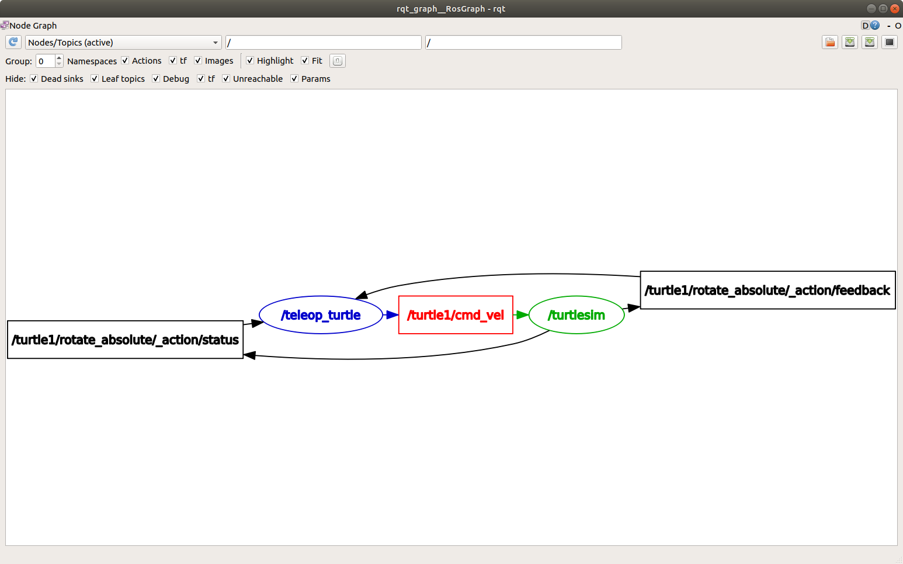
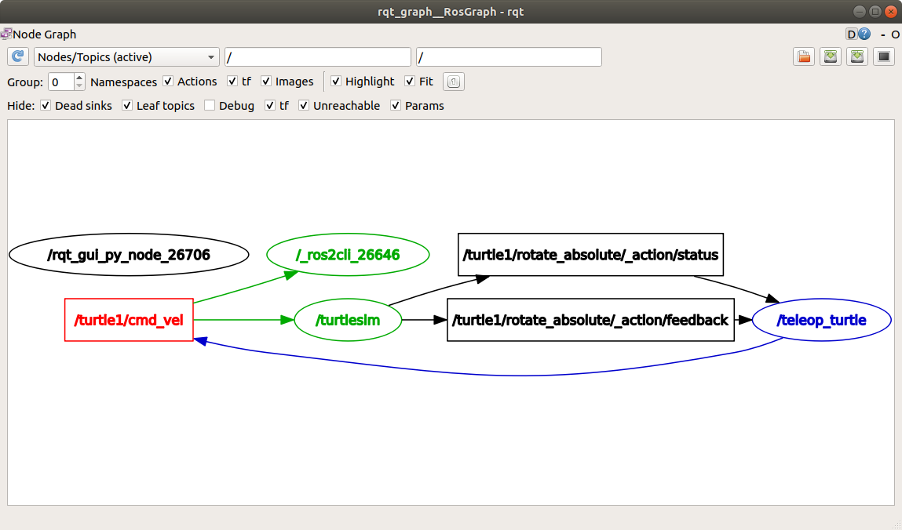
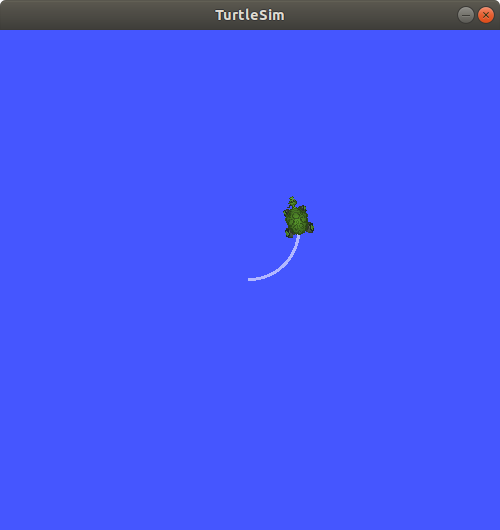
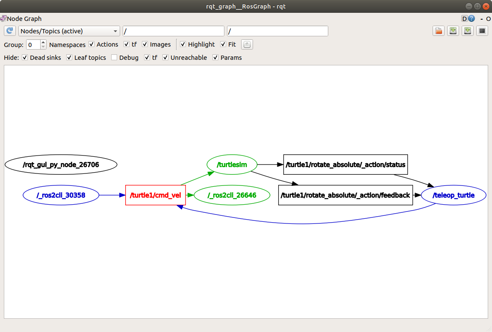
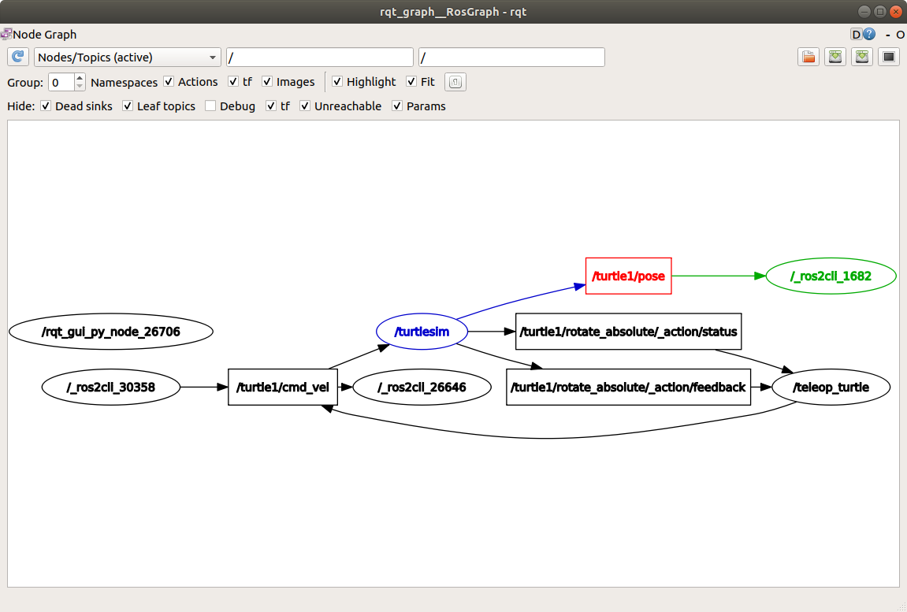

#### 4.理解话题


##### 背景
ROS 2将复杂系统分解为许多模块化节点。话题是ROS图中的重要组成部分，作为节点交换消息的总线。
一个节点可以向任意数量的主题发布数据，并同时订阅任意数量的主题。主题是数据在节点之间以及系统不同部分之间传递的主要方式之一。


##### 1.设置
到目前为止，你应该已经熟悉如何启动turtlesim。

打开一个新的终端并运行：
```bash
ros2 run turtlesim turtlesim_node
```


打开另一个终端并运行：
```bash
ros2 run turtlesim turtle_teleop_key
```


回顾一下之前的教程[[#3.理解节点]]，这些节点的名称默认情况下是``/turtlesim``和``/teleop_turtle``。

##### 2.rqt_graph
在本教程中，我们将使用``rqt_graph``来可视化节点和话题的变化，以及它们之间的连接。

在 turtlesim 教程中，介绍了如何安装 rqt 以及其包括的所有插件，包括`rqt_graph`。

要运行 rqt_graph，请打开一个新的终端并输入以下命令：
```bash
rqt_graph
```
您也可以通过打开 `rqt` 并选择 **Plugins** &gt; **Introspection** &gt; **Node Graph** 来打开 rqt_graph。

您应该能够看到上述的节点和主题，以及图形周围的两个操作（暂时忽略它们）。如果将鼠标悬停在中心的主题上，您会看到像上面图片中那样的颜色高亮显示。

该图形描述了 `/turtlesim` 节点和 `/teleop_turtle` 节点之间如何通过一个主题进行通信。`/teleop_turtle` 节点将数据（您输入的按键操作来移动乌龟）发布到 `/turtle1/cmd_vel` 主题上，而 `/turtlesim` 节点订阅该主题以接收数据。

==**在 `rqt_graph` 中，圆形代表节点（Node），普通矩形代表话题（Topic），双竖线矩形代表服务（Service）。**==


rqt_graph的突出显示功能在检查具有许多以多种不同方式连接的节点和主题的更复杂系统时非常有帮助。

rqt_graph是一个图形化内省工具。现在我们将看一些用于内省主题的命令行工具。


##### 3.ros2 topic list
在新终端中运行``ros2 topic list``命令将返回系统中当前活动的所有主题的列表：
```bash
chuiyu@chuiyu:~$ ros2 topic list 
/parameter_events 
/rosout 
/turtle1/cmd_vel 
/turtle1/color_sensor 
/turtle1/pose 
/turtle2/cmd_vel 
/turtle2/color_sensor 
/turtle2/pose
```

`ros2 topic list -t` 将返回相同的主题列表，这次在括号中附加了主题类型：
```bash
chuiyu@chuiyu:~$ ros2 topic list -t 
/parameter_events [rcl_interfaces/msg/ParameterEvent] 
/rosout [rcl_interfaces/msg/Log] 
/turtle1/cmd_vel [geometry_msgs/msg/Twist] 
/turtle1/color_sensor [turtlesim/msg/Color] 
/turtle1/pose [turtlesim/msg/Pose] 
/turtle2/cmd_vel [geometry_msgs/msg/Twist] 
/turtle2/color_sensor [turtlesim/msg/Color] 
/turtle2/pose [turtlesim/msg/Pose]
```

特别是类型属性是节点了解它们正在通过主题传输相同信息的方式。

如果你想知道在 rqt_graph 中所有这些主题的位置，在 **隐藏：** 下取消选中所有复选框：


不过现在，保留这些选项的选择以避免混淆。

##### 4.ros2 topic echo
要查看在话题上发布的数据，请使用：
```bash
ros2 topic echo <topic_name>
```


由于我们知道 `/teleop_turtle` 在 `/turtle1/cmd_vel` 话题上向 `/turtlesim` 发布数据，让我们使用 `echo` 来检查该话题：
```bash
ros2 topic echo /turtle1/cmd_vel
```


刚开始，这个命令不会返回任何数据。这是因为它正在等待 `/teleop_turtle` 发布一些东西。

返回到运行``turtle_teleop_key``的终端，并使用箭头键来移动乌龟。同时观察运行``echo``的终端，你将会看到每次移动时发布的位置数据：
```bash
linear:
  x: 2.0
  y: 0.0
  z: 0.0
angular:
  x: 0.0
  y: 0.0
  z: 0.0
  ---
```

现在返回到rqt_graph并取消选择**Debug**框。

`/_ros2cli_26646`是刚刚我们运行的`echo`命令创建的节点（数字可能不同）。现在你可以看到发布者正在通过`cmd_vel`主题发布数据，而两个订阅者正在订阅它。


##### 5.ros2 topic info
主题不仅可以是一对一的通信，还可以是一对多的、多对一的或多对多的通信。

另一种理解方式是运行：
```bash
ros2 topic info /turtle1/cmd_vel
```
将返回：
```bash
Type: geometry_msgs/msg/Twist
Publisher count: 1
Subscription count: 2
```

##### 6.ros2 interface show

节点使用消息在主题上发送数据。发布者和订阅者必须发送和接收相同类型的消息来进行通信。

在运行 `ros2 topic list -t` 后，我们可以看到之前提到的主题类型，它们告诉我们每个主题使用的消息类型。回想一下，`cmd_vel` 主题的类型是：
```bash
geometry_msgs/msg/Twist
```

这意味着在``geometry_msgs``包中有一个名为``Twist``的``msg``。

现在我们可以在此类型上运行``ros2 interface show &lt;msg type&gt;``以了解其详细信息。具体来说，消息期望的数据结构是什么样的。
```bash
ros2 interface show geometry_msgs/msg/Twist
```


对于上述消息类型，它产生以下结果：

```bash
# This expresses velocity in free space broken into its linear and angular parts.

    Vector3  linear
            float64 x
            float64 y
            float64 z
    Vector3  angular
            float64 x
            float64 y
            float64 z
```
这告诉你``/turtlesim``节点期望接收一个带有两个向量``linear``和``angular``的消息，每个向量都有三个元素。如果你回想一下我们使用``echo``命令看到``/teleop_turtle``传递给``/turtlesim``的数据，它具有相同的结构：

```bash
linear:
  x: 2.0
  y: 0.0
  z: 0.0
angular:
  x: 0.0
  y: 0.0
  z: 0.0
  ---
```

##### 7.ros2 topic pub
现在您已经有了消息结构，您可以直接从命令行发布数据到一个话题上，使用以下命令：
```bash
ros2 topic pub <topic_name> <msg_type> '<args>'
```

`'&lt;args&gt;'` 参数是您将传递给话题的实际数据，其结构正如您在前一节中了解到的。

请注意，这个参数需要以 YAML 语法输入。请输入完整的命令，如下所示：

```bash
ros2 topic pub --once /turtle1/cmd_vel geometry_msgs/msg/Twist "{linear: {x: 2.0, y: 0.0, z: 0.0}, angular: {x: 0.0, y: 0.0, z: 1.8}}"
```

`--once` 是一个可选参数，表示“发布一条消息后退出”。

您将在终端中看到以下输出：
```bash
publisher: beginning loop
publishing #1: geometry_msgs.msg.Twist(linear=geometry_msgs.msg.Vector3(x=2.0, y=0.0, z=0.0), angular=geometry_msgs.msg.Vector3(x=0.0, y=0.0, z=1.8))
```

然后您将看到乌龟移动如下：


乌龟（以及通常用于模拟乌龟的真实机器人）需要持续不断地接收命令才能保持运动。因此，要让乌龟持续移动，您可以运行以下命令：
```bash
ros2 topic pub --rate 1 /turtle1/cmd_vel geometry_msgs/msg/Twist "{linear: {x: 2.0, y: 0.0, z: 0.0}, angular: {x: 0.0, y: 0.0, z: 1.8}}"
```
这里的区别是删除了``--once``选项，并增加了``--rate 1``选项，告诉``ros2 topic pub``以1 Hz的恒定速率发布命令。


你可以刷新rqt_graph来查看图形化的情况。你会看到``ros2 topic pub ...``节点（`/_ros2cli_30358`）正在``/turtle1/cmd_vel``话题上发布消息，这些消息被``ros2 topic echo ...``节点（`/_ros2cli_26646`）和``/turtlesim``节点接收。


最后，你可以在``pose``话题上运行``echo``命令，并重新检查rqt_graph：
```bash
ros2 topic echo /turtle1/pose
```



你会看到``/turtlesim``节点也在向``pose``话题发布消息，而新的``echo``节点已经订阅了该话题。


##### 8.ros2 topic hz

作为对该过程的最后一次内省，您可以使用以下命令查看数据发布的速率：
```bash
ros2 topic hz /turtle1/pose
```
它将返回``/turtlesim``节点向``pose``主题发布数据的速率。

```bash
average rate: 59.354
  min: 0.005s max: 0.027s std dev: 0.00284s window: 58
```
回想一下，您使用``ros2 topic pub --rate 1``将``turtle1/cmd_vel``的速率设置为稳定的1 Hz。如果您使用``turtle1/cmd_vel``而不是``turtle1/pose``运行上述命令，则会看到反映该速率的平均值。


##### 总结
节点通过主题发布信息，允许任意数量的其他节点订阅和访问该信息。在本教程中，您使用rqt_graph和命令行工具检查了几个节点之间的连接。现在您应该对数据在ROS 2系统中如何传输有一个很好的了解。


