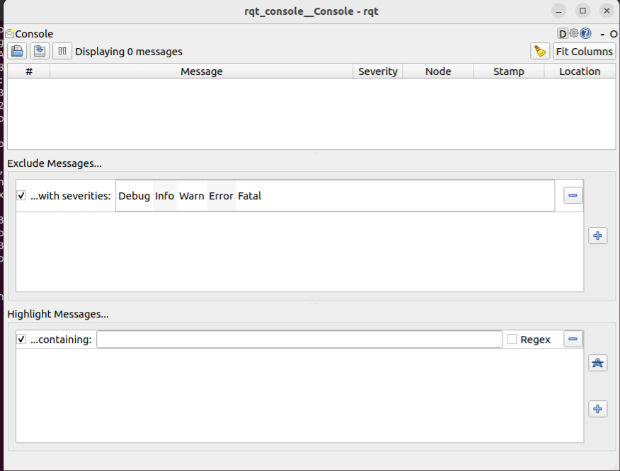
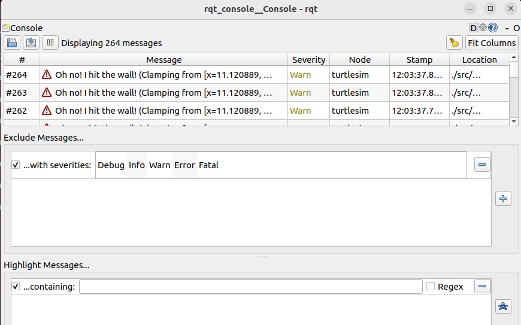

#### 8.使用rqt_console查看日志
##### 背景
`rqt_console` 是一个用于在ROS 2中检查日志消息的图形界面工具。通常，日志消息会显示在终端中。使用 `rqt_console`，您可以随时间收集这些消息，以更加仔细和有组织的方式查看它们，对它们进行过滤、保存，甚至可以重新加载保存的文件以在不同的时间进行检查。

节点使用日志来输出与事件和状态有关的消息，以各种方式进行。它们的内容通常是信息性的，为了用户的利益。


##### 1.设置
在新的终端窗口中使用以下命令启动 `rqt_console`：

```bash
ros2 run rqt_console rqt_console
```

`rqt_console` 窗口将会打开：


控制台的第一部分用于显示系统的日志消息。

在中间，您可以选择通过排除严重级别来过滤消息。您还可以使用右侧的加号按钮添加更多的排除过滤器。

底部的部分是用于突出显示包含您输入的字符串的消息。您也可以在此部分添加更多的过滤器。

现在在新终端中使用以下命令启动 `turtlesim` ：

```bash
ros2 run turtlesim turtlesim_node
```

##### 2.rqt_console上的2条消息

为了生成供``rqt_console``显示的日志消息，让乌龟撞到墙上。在新的终端中输入``ros2 topic pub``命令，如下所示：
```bash
ros2 topic pub -r 1 /turtle1/cmd_vel geometry_msgs/msg/Twist "{linear: {x: 2.0, y: 0.0, z: 0.0}, angular: {x: 0.0,y: 0.0,z: 0.0}}"
```

由于上述命令以固定速率发布主题，乌龟会持续撞墙。在``rqt_console``中，你会看到相同的消息以``Warn``严重级别一遍又一遍地显示，如下所示：


在你运行``ros2 topic pub``命令的终端中按下``Ctrl+C``，停止乌龟撞墙。


##### 3.日志记录器级别
ROS 2的记录器级别按严重程度排序：
```bash
Fatal
Error
Warn
Info
Debug
```

关于每个级别表示的确切标准并没有精确的规定，但可以安全地假设：

- `Fatal`（致命）消息表明系统将终止以试图保护自身免受损害。
    
- `Error`（错误）消息表示存在重要问题，这些问题不一定会损坏系统，但会阻止其正常运行。
    
- `Warn` 消息表示意外活动或非理想结果，可能表示更深层问题，但不会直接影响功能。
    
- `Info` 消息表示事件和状态更新，作为系统正常运行的可视验证。
    
- `Debug` 消息详细描述系统执行的每个步骤。
    

默认级别是 `Info`。只会看到默认严重级别和更严重级别的消息。

通常，只有``Debug``级别的消息被隐藏，因为它们是比``Info``级别更轻微的级别。例如，如果您将默认级别设置为``Warn``，您只会看到`Warn`、`Error`和`Fatal`严重程度的消息。

**3.1 设置默认日志记录器级别**
您可以在首次运行``/turtlesim``节点时使用重映射设置默认日志记录器级别。在终端中输入以下命令：

```bash
ros2 run turtlesim turtlesim_node --ros-args --log-level WARN
```

现在您将不会看到上次启动``turtlesim``时在控制台上出现的初始``Info``级别的消息。这是因为``Info``消息的优先级低于新的默认严重程度``Warn``。


##### 总结
如果您需要仔细检查系统的日志消息，`rqt_console`可能非常有帮助。您可能出于各种原因想要检查日志消息，通常是为了找出出错的地方以及导致该问题的事件序列。


