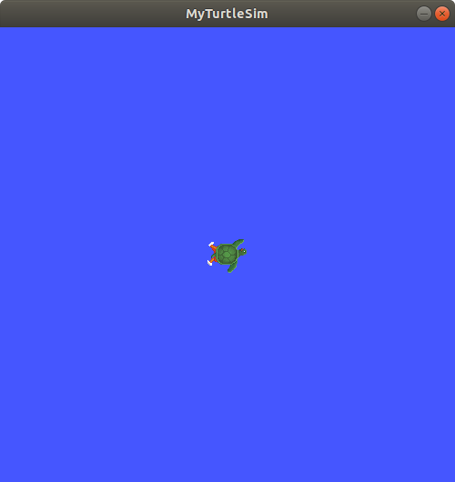

#### 2.创建一个工作空间
##### 1.背景

工作空间是包含ROS 2软件包的目录。在使用ROS 2之前，需要在您计划使用的终端中使用ROS 2安装工作空间。这样可以使ROS 2的软件包在该终端中可用于使用。

您还可以选择使用"叠加层" - 一个次要的工作空间，您可以在其中添加新的软件包，而不会干扰您正在扩展或"下层"的现有ROS 2工作空间。您的下层必须包含叠加层中所有软件包的依赖关系。叠加层中的软件包将覆盖下层中的软件包。还可以有多个层次的下层和叠加层，每个连续的叠加层都使用其父级下层的软件包。


##### 2. 配置ROS 2环境

你的主要ROS 2安装将成为本教程的基础。 （请注意，基础不一定非得是主要的ROS 2安装。）

根据您安装ROS 2的方式（源码安装或二进制安装），以及您所在的平台，您的确切源命令会有所不同：
```bash
source /opt/ros/humble/setup.bash
```

如果这些命令对您不起作用，请参考您所遵循的:doc:[安装指南](http://fishros.org/doc/ros2/humble/Installation.html)。


##### 3. 创建一个新目录

最佳实践是为每个新的工作空间创建一个新的目录。目录名称无关紧要，但是有助于表明工作空间的目的。让我们选择目录名为``ros2_ws``，表示"开发工作空间"：

```bash
mkdir -p ~/ros2_ws/src
cd ~/ros2_ws/src
```
另一个最佳实践是将工作空间中的任何包放置在``src``目录中。上述代码在``ros2_ws``内创建一个``src``目录，然后进入其中。

##### 4.克隆示例仓库

在克隆之前，请确保您仍在``ros2_ws/src``目录中。

在接下来的初学者开发者教程中，您将创建自己的软件包，但目前您将练习使用现有软件包组合一个工作空间。

如果您已经完成了[[ROS2学习日记1-CLI工具]]教程，您将熟悉 `turtlesim`，它是 [ros_tutorials](https://github.com/ros/ros_tutorials/) 中的一个软件包。

一个存储库可以有多个分支。您需要检出与您已安装的 ROS 2 发行版对应的分支。当您克隆这个存储库时，请添加 `-b` 参数，后跟该分支的名称。

在 `ros2_ws/src` 目录下运行以下命令：

```bash
git clone https://github.com/ros/ros_tutorials.git -b humble
```
现在在您的工作空间中克隆了 `ros_tutorials` 。`ros_tutorials` 仓库包含了 `turtlesim` 包，我们将在本教程的剩余部分中使用它。此仓库中的其他包没有构建，因为它们包含一个 `COLCON_IGNORE` 文件。

到目前为止，您已经在工作空间中添加了一个示例包，但它还不是一个完全功能的工作空间。您需要先解决依赖关系，然后再构建工作空间。


##### 5.解决依赖关系

在构建工作空间之前，您需要解决包的依赖关系。您可能已经拥有了所有的依赖项，但最佳实践是每次克隆时都检查依赖关系。您不希望在长时间等待后构建失败，然后才意识到您缺少依赖项。

从工作空间的根目录(`ros2_ws`)运行以下命令：

```bash
# cd if you're still in the ``src`` directory with the ``ros_tutorials`` clone
cd ..
rosdep install -i --from-path src --rosdistro humble -y
```

如果您从源代码或"fat"存档中在Linux上安装了ROS 2，则需要按照它们的安装说明使用rosdep命令。这里有 [从源代码安装的rosdep部分](http://fishros.org/doc/ros2/humble/Installation/Alternatives/Ubuntu-Development-Setup.html#linux-development-setup-install-dependencies-using-rosdep) 和 ["fat"存档的rosdep部分](http://fishros.org/doc/ros2/humble/Installation/Alternatives/Ubuntu-Install-Binary.html#linux-install-binary-install-missing-dependencies)。

如果您已经具备了所有的依赖项，控制台会返回：
```bash
#All required rosdeps installed successfully
```

软件包在package.xml文件中声明其依赖关系（您将在下一个教程中了解更多关于软件包的内容）。这个命令会遍历这些声明并安装缺失的依赖项。您可以在另一个教程（即将推出）中了解更多关于``rosdep``的信息。


##### 6.使用colcon构建工作空间

从工作空间的根目录（`ros2_ws`）开始，您可以使用以下命令构建您的软件包：
```bash
colcon build
```
控制台将返回以下消息：

```bash
Starting >>> turtlesim
Finished <<< turtlesim [5.49s]

Summary: 1 package finished [5.58s]
```

``colcon build``的其他有用参数：

- `--packages-up-to` 构建所需的包及其所有依赖项，而不是整个工作空间（节省时间）
    
- `--symlink-install` 在您调整Python脚本时，无需每次重新构建
    
- `--event-handlers console_direct+` 在构建时显示控制台输出（否则可在``log``目录中找到）

构建完成后，在工作空间根目录（`~/ros2_ws`）中输入以下命令：

```bash
ls
```

您将看到 colcon 创建了新目录：

```bash
build  install  log  src
```

``install``目录是你的工作空间的设置文件所在的位置，你可以使用它来设置你的叠加层。


##### 7.设置叠加层

在设置叠加层之前，非常重要的一点是要打开一个新的终端，与构建工作空间的终端分开。在同一个终端中设置叠加层或在设置叠加层的终端中进行构建可能会导致复杂的问题。

在新的终端中，将你的主要ROS 2环境作为“underlay”来源化，这样你就可以在其“之上”构建叠加层：
```bash
source /opt/ros/humble/setup.bash
```

进入你的工作空间的根目录：

```bash
cd ~/ros2_ws
```

在根目录中，将你的叠加层源化：

```bash
source install/local_setup.bash
```

注解
只有在源中添加覆盖层的``local_setup``才会将覆盖层中的软件包添加到您的环境中。``setup``源同时包含覆盖层和创建它的底层，使您能够同时利用两个工作区。

因此，像您刚才做的那样，先对主要的ROS 2安装进行``setup``，然后再对``ros2_ws``覆盖层的``local_setup``进行源操作，与只对``ros2_ws``的``setup``进行源操作是相同的，因为后者已经包含了底层的环境。


现在，您可以从覆盖层中运行``turtlesim``软件包：

```bash
ros2 run turtlesim turtlesim_node
```

但是，您如何确定这是运行的覆盖层中的turtlesim，而不是主安装中的turtlesim呢？

让我们在覆盖层中修改turtlesim，这样你就可以看到效果了：

- 你可以在覆盖层中单独修改和重建软件包，而不影响底层。
    
- 覆盖层优先于底层。

##### 8.修改覆盖层

你可以通过编辑turtlesim窗口的标题栏来修改overlay中的`turtlesim`。要做到这一点，找到`~/ros2_ws/src/ros_tutorials/turtlesim/src`中的`turtle_frame.cpp`文件。用你喜欢的文本编辑器打开`turtle_frame.cpp`。

在第52行，你会看到函数`setWindowTitle("TurtleSim");`。将值`"TurtleSim"`更改为`"MyTurtleSim"`，然后保存文件。

返回到之前运行`colcon build`的第一个终端，并再次运行它。

返回到第二个终端（源化了overlay的终端），然后再次运行turtlesim:

```bash
ros2 run turtlesim turtlesim_node
```



尽管您之前在此终端中激活了主要的ROS 2环境，但是"ros2_ws"环境的叠加优先于底层的内容。

为了验证您的底层仍然完整，打开一个全新的终端并只激活您的ROS 2安装。再次运行turtlesim：

```bash
ros2 run turtlesim turtlesim_node
```


您可以看到叠加中的修改实际上没有对底层产生任何影响。

##### 9.总结

在本教程中，您将ROS 2主要发行版安装为底层，并通过克隆和构建包在新的工作空间中创建一个覆盖层。覆盖层被添加到路径中，并且优先于底层，正如您通过修改后的turtlesim所看到的。

建议在处理少量包时使用覆盖层，这样您就不必将所有内容放在同一个工作空间中，并且不必在每次迭代中重新构建一个庞大的工作空间。


