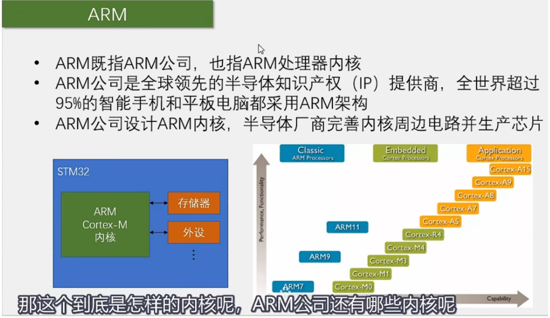
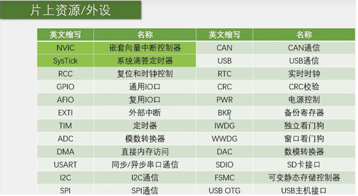
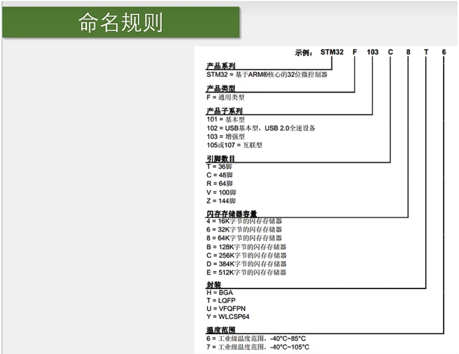
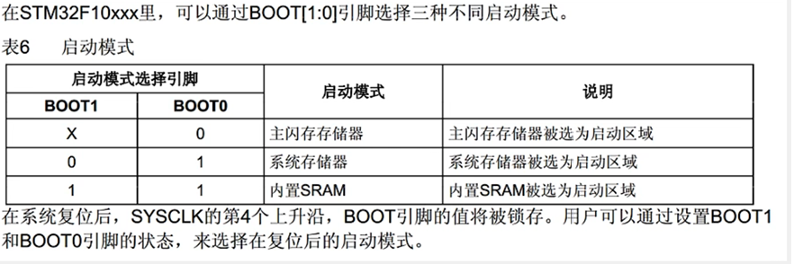
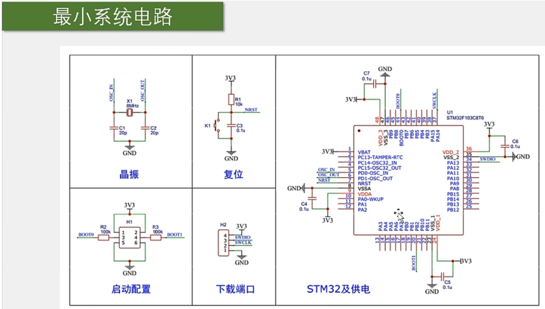
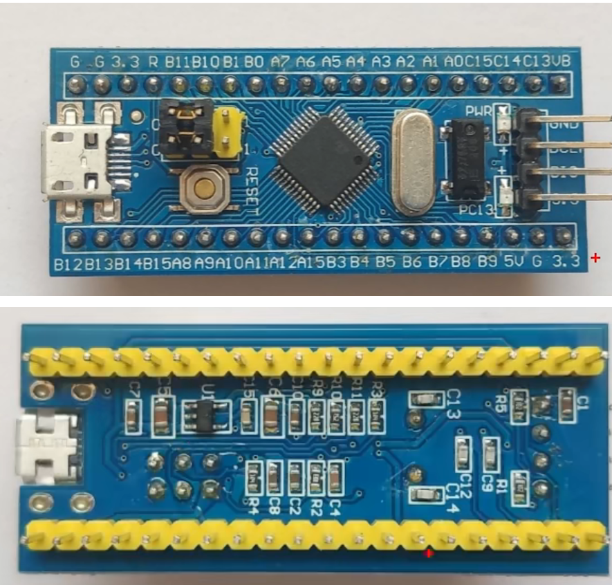

# 【1-1】STM32简介

## 1.STM32简介

## 2.ARM架构

## 3.STM32F103C8T6(本课程使用的)

### 1.简介

### 2.片上资源

​	PS：C8T6芯片不存在最后四项外设

## 3.命名规则

## 4.系统结构

​	PS：了解即可

## 5.引脚定义

## 6.启动配置

​		启动配置的作用就是指定程序开始运行的位置。一般情况下，程序都是在FLASH程序存储器里开始执行，但是在某些情况下，我们也可以让程序在别的地方开始执行，用以完成特殊的功能。

​		第一种模式就是正常启动模式。

​		第二种模式是串口下载模式。

​		第三种不常用，略。

​		最后一句话的意思：BOOT引脚的值是在上电复位后的一瞬间有效的，之后就随便了。(当第四个时钟过之后，就是PB2功能了)

## 7.最小系统电路

## 8.最小系统板实物图

