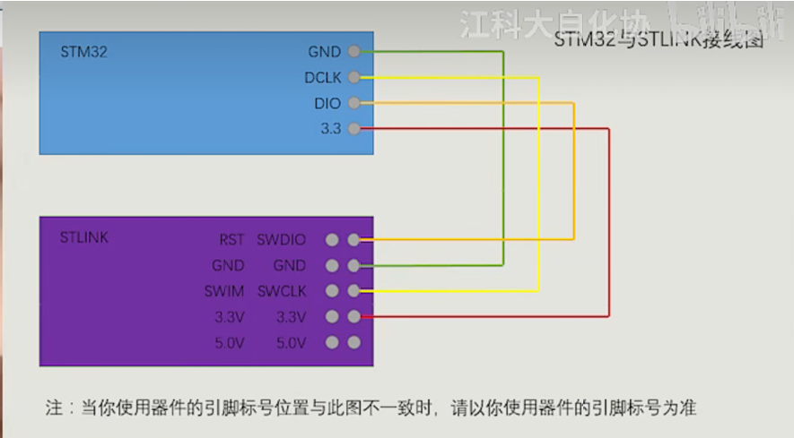
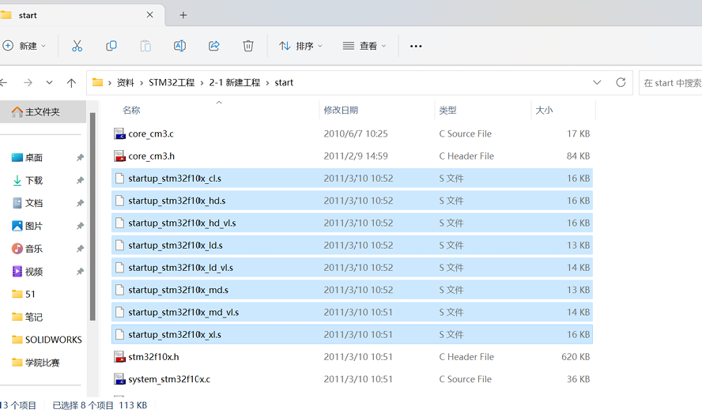

# 【2-2】新建工程

## 1.32开发方式

#### 目前STM32的开发方式主要有两种方式：

​		1.基于寄存器的方式 	（同51一样）

​				这种方式最底层，最直接，效率会更高一些。

​				但是由于STM32的结构复杂，寄存器太多，所以基于寄存器的方式目前是不推荐的。

​		2.基于标准库,也就是基于库函数的方式

​				使用ST官方提供的封装好的函数，通过调用这些函数来间接地配置寄存器。由于ST对寄存器的封装比较好，所以这种方式既能满足对寄存器的配置，对开发人员也比较友好，有利于提高开发效率。是本课程使用的方式。

​		3.基于HAL库的方式

​				可以用图形化界面快速配置STM32，这个比较适合快速上手STM32的情况，但是这种方式隐藏了底层逻辑，如果你对STM32不熟悉，基本只能停留在很浅的水平。所以目前暂时不推荐HAL库，但是推荐学过标准库之后，去了解一下这个方式，毕竟这个HAL库还是比较方便的。


#### 标准库函数包

​		导入视频详情看视频：

​	[[2-2\] 新建工程_哔哩哔哩_bilibili](https://www.bilibili.com/video/BV1th411z7sn?p=4&vd_source=1051d37ba7a675bf1be8e2ff97d9e892)


## 点亮第一个LED灯

#### 接线图：STM32与STLINK




```c
//使用寄存器的方式控制灯的亮灭
#include "stm32f10x.h"                  // Device header

int main(void)
{
	RCC->APB2ENR = 0x00000010;	//打开GPIOC的时钟
	GPIOC->CRH = 0x00300000;	//端口配置寄存器
	//GPIOC->ODR = 0x00002000; 	//灯熄灭
	GPIOC->ODR = 0x00000000; 	//灯亮
	while(1);
}

```


```c
//使用库函数的方式控制灯的亮灭
#include "stm32f10x.h"                  // Device header

int main(void)
{
	RCC_APB2PeriphClockCmd(RCC_APB2Periph_GPIOC, ENABLE );	//配置寄存器
	GPIO_InitTypeDef GPIO_InitStructure;	//定义结构体:GPIO_InitTypeDef 结构体名字
	
	//配置结构体变量
	GPIO_InitStructure.GPIO_Mode = GPIO_Mode_Out_PP;
	GPIO_InitStructure.GPIO_Pin = GPIO_Pin_13;
	GPIO_InitStructure.GPIO_Speed = GPIO_Speed_50MHz;
	
	GPIO_Init(GPIOC,&GPIO_InitStructure);//配置端口模式
	
	GPIO_SetBits(GPIOC, GPIO_Pin_13);	//置13口为高电平
	
	GPIO_ResetBits(GPIOC, GPIO_Pin_13);	//置13口为低电平
	
	while(1);
}

```

## 补充知识

### 1.新建工程的启动文件选择

​	以下这些就是新建工程的启动文件：

​	


下面是启动文件的选择：


### 2.新建工程知识

#### 	1.步骤总结


#### 2.工程架构


