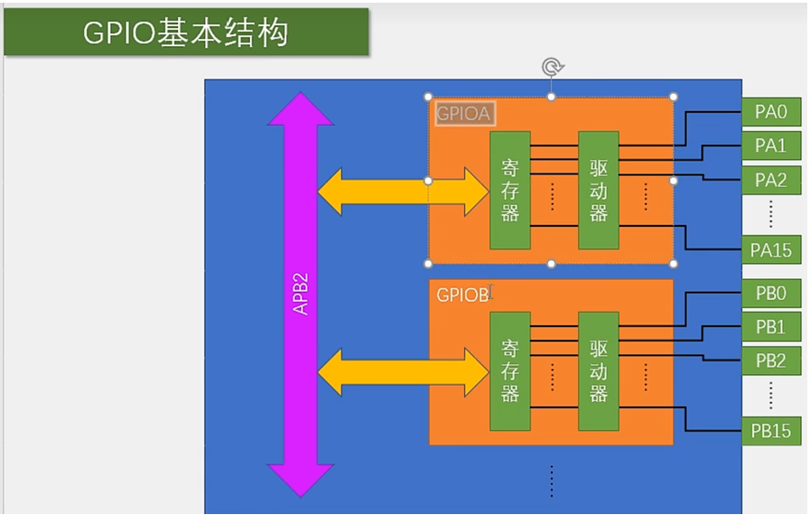
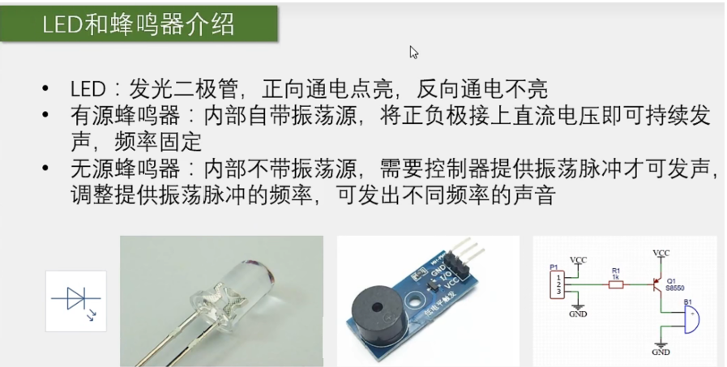
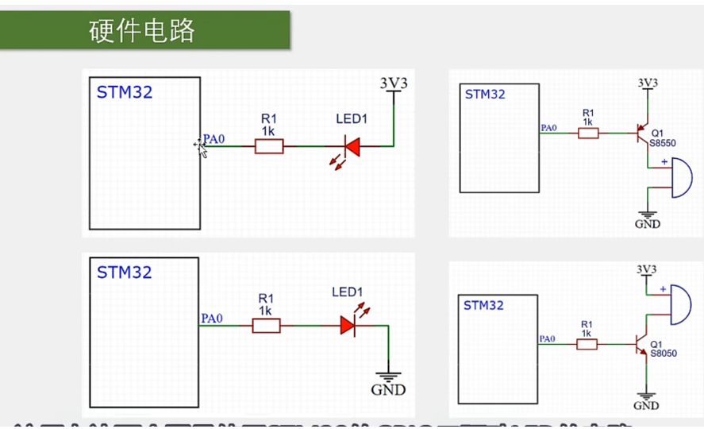
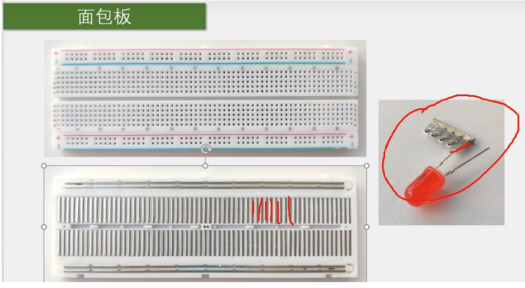

# 【3-1】GPIO输出

## 0.GPIO程序笔记

#### 操作STM32的GPIO总共需要三个步骤：

​			1.使用RCC开启GPIO的时钟

​			2.使用GPIO_Iint函数初始化GPIO

​			3.使用输出或者输入函数控制GPIO口

```c
//使用RCC开启GPIO的时钟
RCC_APB2PeriphClockCmd(RCC_APB2Periph_GPIOA,ENABLE);

GPIO_InitTypeDef GPIO_InitStruct;	//定义结构体(可以理解为建立GPIO对象)
//配置结构体
GPIO_InitStruct.GPIO_Mode = GPIO_Mode_Out_PP;	//模式为推挽输出
GPIO_InitStruct.GPIO_Pin = GPIO_Pin_x;	//Px口
GPIO_InitStruct.GPIO_Speed = GPIO_Speed_50MHz;	//速度为50MHz

//第一个参数需要填GPIO+字母对应引脚区域
GPIO_Init(GPIOx,&GPIO_InitStruct);	//初始化GPIO口
```


#### GPIO的常用输出函数

```c
void GPIO_SetBits(GPIO_TypeDef* GPIOx, uint16_t GPIO_Pin);
//填入参数	1.GPIOx		2.GPIO_Pin
//函数功能	把指定的端口设置为高电平
```

```c
void GPIO_ResetBits(GPIO_TypeDef* GPIOx, uint16_t GPIO_Pin);
//填入参数	1.GPIOx		2.GPIO_Pin
//函数功能	把指定的端口设置为低电平
```

```c
void GPIO_WriteBit(GPIO_TypeDef* GPIOx, uint16_t GPIO_Pin, BitAction BitVal);
//填入参数	1.GPIOx		2.GPIO_Pin		3.BitVal
//函数功能	根据第三个参数的值来设置指定的端口
```

```c
void GPIO_Write(GPIO_TypeDef* GPIOx, uint16_t PortVal);
//填入参数	1.GPIOx		2.PortValue
//函数功能	可以同时对16个端口进行写入操作
```


#### GPIO常用输入函数 

```c
uint8_t GPIO_ReadInputDataBit(GPIO_TypeDef* GPIOx, uint16_t GPIO_Pin);
//填入参数	1.GPIOx		2.GPIO_Pin
//函数功能	读取输入数据寄存器某一个端口的输入值
```

```c
uint16_t GPIO_ReadInputData(GPIO_TypeDef* GPIOx);
//填入参数	1.GPIOx
//函数功能	读取整个输入数据寄存器
//返回值是unit16_t,是16为位的数据，每位代表一个端口值
```

```c
uint8_t GPIO_ReadOutputDataBit(GPIO_TypeDef* GPIOx, uint16_t GPIO_Pin);

//填入参数	1.GPIOx		2.GPIO_Pin
//函数功能	读取输出数据寄存器的某一个位
//所以原则上来说，它并不是用来读取端口的输入数据的。
//这个函数一般用于输出模式下，用来看下自己输出的是什么。
```

```c
uint16_t GPIO_ReadOutputData(GPIO_TypeDef* GPIOx);
//填入参数	1.GPIOx
//函数功能	读取整个输出数据寄存器
//所以原则上来说，它并不是用来读取端口的输入数据的。
//这个函数一般用于输出模式下，用来看下自己输出的是什么。
```


#### 其他GPIO函数

```c
void GPIO_PinLockConfig(GPIO_TypeDef* GPIOx, uint16_t GPIO_Pin);
//填入参数	1.GPIOx		2.GPIO_Pin
//函数功能：用来锁定GPIO配置的，调用这个函数，参数指定某个引脚，那这个引脚的配置就会呗锁定，防止意外更改。
```

```c
void GPIO_PinRemapConfig(uint32_t GPIO_Remap, FunctionalState NewState);
//填入参数：1.选择你要重映射的方式	2.参数新的状态
//函数功能：可以用来进行引脚重映射
```


## 1.GPIO介绍

### 1.GPIO简介


​	输出模式下如果是控制功率比较大的元器件，则需要加入驱动电路，例如电机。与此同时，输出模式还可以用以模拟通信协议，比如IIC，SPI或者某个芯片特定的协议。

​	输入模式最常见的就是按键了，另外还可以读取带数值的模块，比如光敏电阻模块，热敏电阻模块等。当然也可以模拟通信接收数据。


### 2.GPIO基本结构

#### 整体结构



##### 每个GPIO中：

​	寄存器：就是一段特殊的存储器，内核可以通过APB2总线对寄存器进行读写，这样就可以完成输出电平和读取电平的功能了。这个寄存器的每一位对应一个引脚，其中输出寄存器写1，对应引脚就会输出高电平，写0则输出低电平。输入寄存器读取1，就证明对应端口目前是高电平，读取为0则就是低电平。

​	PS：因为STM32是32位单片机，所以STM32内部的寄存器都是32位的，但这个端口只有16位，所以这个寄存器只有低16位对应的有端口，高16位是没有用到的。


​	驱动器：是用来增加信号的驱动能力的。寄存器只负责存储数据，如果要进行点灯这样的操作的话，还是需要驱动器来负责增大驱动能力。


#### GPIO位结构

下图是STM32参考手册中的GPIO位结构电路图：


## 2.GPIO模式


#### 浮空/上拉/下拉输入模式


​			前三种输入模式的电路基本是一样的，区别就是上拉电阻和下拉电阻的连接。

​	PS：浮空输入的电平是不确定的，所以在使用浮空输入时，端口一定要接上一个连续的驱动源，不能出现悬空的状态。

​	PS：VDD_FT：容忍5v的引脚，它的上边保护二极管要做一下处理，要不然这里直接接VDD 3.3v的话，外部再接入5v电压就会导致上边二极管开启，并且产生比较大的电流，这个是不太妥当的。


#### 模拟输入

​	可以说是ADC数模转换器的专属配置了，下面是其结构：


​	PS：上图画X的部分就是没用到的部分。


#### 开漏输入/推挽输出

​	电路基本一样，都是数字输出端口，可以用于输出高低电平。

​	区别就是：

​			开漏输出的高电平呈现的是高阻态，没有驱动能力。

​			推挽输出的高低电平都是具有驱动能力的。

下面是电路图：


​	此时，输出是由输出数据寄存器控制的。

​				如果P-MOS无效，就是开漏输出。

​				如果P-MOS和N-MOS都有效，就是推挽输出。

​	另外，在输出模式下，输入模式也是有效的。但是之前的电路图在输入模式下，输出都是无效的。

​		这是因为，一个端口只能有一个输出，但可以有多个输入。所以当配置成输出模式的时候，内部也可以顺便输入一下，这个是没啥影响的。


#### 复用开漏输出/复用推挽输出

​	这俩模式跟普通的开漏输出和推挽输出也差不多，只不过是复用的输出，引脚电平是由片上外设控制的。

​	PS：除了我们写程序让芯片操作的都是片上外设，比如温感光感。

​	下面是电路图：


​	同时普通的输入也是有效的，顺便接收一下电平信号。


#### 总结

​	其实在GPIO的这8种模式中，除了模拟输入这个模式会关闭数字的输入功能，在其他7个模式中，所有的输入都是有效的


## 3.外围设备介绍(LED，蜂鸣器)

#### 1.LED，蜂鸣器

​	介绍：



​	接入STM32的硬件电路图：



​		左边两图为使用STM32的GPIO口驱动LED的电路

​				左上为低电平触发，左下为高电平触发。

​		右边两图为使用STM32的GPIO口驱动蜂鸣器的电路。

​				左上为低电平触发，左下为高电平触发。


​		那么，高电平触发和低电平触发该如何选择为好呢？

​				这就得看这个IO口高低电平的驱动能力如何了。我们刚才介绍，这个GPIO在推挽输出模式下，高低电平均有比较强的驱动能力，所以在这里这两种接法均可。

​				但是在单片机的电路里，一般倾向使用第一种接法（低电平触发）因为很多单片机或者芯片，都使用了高电平弱驱动，低电平强驱动的规则，这样可以一定程度上避免高低电平打架。所以如果高电平驱动能力弱，那就不能使用第二种接法（高电平触发）了。


#### 2.面包板



​		略


