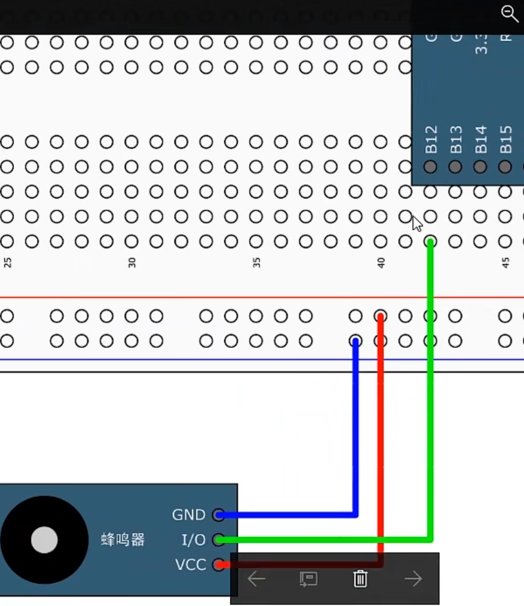

# 【3-2】LED&流水灯&蜂鸣器

## 1.LED闪烁

#### 接线图：


#### 程序代码：


##### 插入：GPIO常用的输出函数 

```c
void GPIO_SetBits(GPIO_TypeDef* GPIOx, uint16_t GPIO_Pin);
//填入参数	1.GPIOx		2.GPIO_Pin
//函数功能	把指定的端口设置为高电平
```

```c
void GPIO_ResetBits(GPIO_TypeDef* GPIOx, uint16_t GPIO_Pin);
//填入参数	1.GPIOx		2.GPIO_Pin
//函数功能	把指定的端口设置为低电平
```

```c
void GPIO_WriteBit(GPIO_TypeDef* GPIOx, uint16_t GPIO_Pin, BitAction BitVal);
//填入参数	1.GPIOx		2.GPIO_Pin		3.BitVal
//函数功能	根据第三个参数的值来设置指定的端口

//下面是对参数3的介绍：
/*
  * @param  BitVal: 指定要写入选定位的值。
  * 此参数可以是 BitAction 枚举值之一
  *     @arg Bit_RESET: 清除端口引脚
  *     @arg Bit_SET: 设置端口引脚
*/
```

```c
void GPIO_Write(GPIO_TypeDef* GPIOx, uint16_t PortVal);
//填入参数	1.GPIOx		2.PortValue
//函数功能	可以同时对16个端口进行写入操作
```


##### 程序实例

```c
#include "stm32f10x.h"
#include "Delay.h"
/*
	操作STM32的GPIO总共需要三个步骤：
			1.使用RCC开启GPIO的时钟
			2.使用GPIO_Iint函数初始化GPIO
			3.使用输出或者输入函数控制GPIO口
*/

int main(void)
{
    //使用RCC开启GPIO的时钟
	RCC_APB2PeriphClockCmd(RCC_APB2Periph_GPIOA,ENABLE);
	
	GPIO_InitTypeDef GPIO_InitStruct;	//定义结构体(可以理解为建立GPIO对象)
	//配置结构体
	GPIO_InitStruct.GPIO_Mode = GPIO_Mode_Out_PP;	//模式为推挽输出
	GPIO_InitStruct.GPIO_Pin = GPIO_Pin_0;	//P0口
	GPIO_InitStruct.GPIO_Speed = GPIO_Speed_50MHz;	//速度为50MHz
	
	
	GPIO_Init(GPIOA,&GPIO_InitStruct);	//初始化GPIO口
	
	//使用第一种函数：把指定的端口设置为低电平
	//GPIO_ResetBits(GPIOA,GPIO_Pin_0);
	
	//使用第二种函数：把指定的端口设置为高电平
	//GPIO_SetBits(GPIOA,GPIO_Pin_0);
	
	//使用第三种函数：
	//GPIO_WriteBit(GPIOA,GPIO_Pin_0,Bit_SET);
	//GPIO_WriteBit(GPIOA,GPIO_Pin_0,Bit_RESET);
	
	//第四种函数下个例程介绍
	
	
	while(1)
	{
		//使用WriteBit函数来输出高低电平电灯
		/*
		GPIO_WriteBit(GPIOA,GPIO_Pin_0,Bit_RESET);	//点亮LED灯
		Delay_ms(500);
		GPIO_WriteBit(GPIOA,GPIO_Pin_0,Bit_SET);	//熄灭LED灯
		Delay_ms(500);
		*/
		
		//使用SetBits和ResitBits函数来输出高低电平点灯
		/*
		GPIO_SetBits(GPIOA,GPIO_Pin_0);
		Delay_ms(500);
		GPIO_ResetBits(GPIOA,GPIO_Pin_0);
		Delay_ms(500);
		*/
		
		//若使用1和0来决定高低电平
		//则需要对1和0进行强制转换为BitAction的枚举类型
		GPIO_WriteBit(GPIOA,GPIO_Pin_0,(BitAction)0);	//点亮LED灯
		Delay_ms(500);
		GPIO_WriteBit(GPIOA,GPIO_Pin_0,(BitAction)1);	//熄灭LED灯
		Delay_ms(500);
		
	}
}

```


​	PS:

​		若GPIO的输出模式为推挽模式，无论将LED灯的正负极反接都是可以正常亮灭的，说明在推挽模式下，高低电平都是有驱动能力的。

​		若GPIO的输出模式为开漏输出模式（Out_OD），而LED不亮，说明开漏模式的高电平是没有驱动能力的。而低电平是有驱动能力的

​	一般情况下用推挽模式就行，而特殊情况才会用开漏等其他模式。

## 2.LED流水灯

#### 接线图


#### 程序代码

```c
#include "stm32f10x.h"                  // Device header
#include "Delay.h"

int main(void)
{
	RCC_APB2PeriphClockCmd(RCC_APB2Periph_GPIOA,ENABLE);
	
	GPIO_InitTypeDef GPIO_InitStruct;	//定义结构体(建立GPIO对象)
	//配置结构体
	GPIO_InitStruct.GPIO_Mode = GPIO_Mode_Out_PP;	//模式为推挽输出
	GPIO_InitStruct.GPIO_Pin = GPIO_Pin_All;	//所有引脚
	GPIO_InitStruct.GPIO_Speed = GPIO_Speed_50MHz;	//速度为50MHz
	
	
	GPIO_Init(GPIOA,&GPIO_InitStruct);	//初始化GPIO口
	

	
	
	while(1)
	{
		//此函数的第二个值的含义是：指定写到输出数据寄存器的值(ODR)
		//而c语言不支持使用二进制数，所以写16进制数
		//0x0001对应二进制数为 0000 0000 0000 0001
		//因为是低电平点亮，所以在前面加一个按位取反的符号
		//此时就是1111 1111 1111 1110，也就是第一个LED灯亮
		GPIO_Write(GPIOA, ~0x0001);	
		Delay_ms(500);
		GPIO_Write(GPIOA, ~0x0002);	//0000 0000 0000 0010
		Delay_ms(100);				//延时100ms
		GPIO_Write(GPIOA, ~0x0004);	//0000 0000 0000 0100
		Delay_ms(100);				//延时100ms
		GPIO_Write(GPIOA, ~0x0008);	//0000 0000 0000 1000
		Delay_ms(100);				//延时100ms
		GPIO_Write(GPIOA, ~0x0010);	//0000 0000 0001 0000
		Delay_ms(100);				//延时100ms
		GPIO_Write(GPIOA, ~0x0020);	//0000 0000 0010 0000
		Delay_ms(100);				//延时100ms
		GPIO_Write(GPIOA, ~0x0040);	//0000 0000 0100 0000
		Delay_ms(100);				//延时100ms
		GPIO_Write(GPIOA, ~0x0080);	//0000 0000 1000 0000
		Delay_ms(100);				//延时100ms
	}
}

```

代码解释：

​		1.为什么11行配置结构体当中可以通过 | 来把几个IO口连起来定义呢？

​				因为GPIO0 = 0001 ，GPIO1 = 0010 ， GPIO2 = 0100。

​				使用|运算之后：GPIO_Pin_0 | GPIO_Pin_1 | GPIO_Pin_2

​				就可以达到以下效果：	0111，即GPIO0-2都被定义了。

​				当然函数里还有GPIO_Pin_All可以使用(定义所有引脚嘛)


## 3.蜂鸣器

#### 接线图



##### PS

I/O控制口别选到A15，B3，B4这三个，因为从引脚定义图可以看到，这三个口默认是JTAG的调试端口，如果要用作普通端口的话，还需要再进行一些配置。


#### 程序代码

```c
#include "stm32f10x.h"                  // Device header
#include "Delay.h"

int main(void)
{
	RCC_APB2PeriphClockCmd(RCC_APB2Periph_GPIOB,ENABLE);
	
	GPIO_InitTypeDef GPIO_InitStruct;	//定义结构体(建立GPIO对象)
	//配置结构体
	GPIO_InitStruct.GPIO_Mode = GPIO_Mode_Out_PP;	//模式为推挽输出
	GPIO_InitStruct.GPIO_Pin = GPIO_Pin_12;	//所有引脚
	GPIO_InitStruct.GPIO_Speed = GPIO_Speed_50MHz;	//速度为50MHz
	
	GPIO_Init(GPIOB,&GPIO_InitStruct);	//初始化GPIO口

	
	while(1)
	{
		GPIO_ResetBits(GPIOB,GPIO_Pin_12);
		Delay_ms(100);
		GPIO_SetBits(GPIOB,GPIO_Pin_12);
		Delay_ms(100);
		GPIO_ResetBits(GPIOB,GPIO_Pin_12);
		Delay_ms(100);
		GPIO_SetBits(GPIOB,GPIO_Pin_12);
		Delay_ms(700);
	}
}

```

## 使用库函数的方法

​	1.打开.h文件的最后，看一下都有哪些函数，然后再右键转到定义，查看以下函数和参数的用法。这里都是英文的，看不懂借助翻译就行。

​	2.查看配套资料里的库函数用户手册，里面有所有库函数的中文解释说明，而且函数后面还有使用例子，需要用的话可以直接引用。但是这个用户手册的版本并不对应我们现在用的库函数的版本，所以有部分用法会有一些出入，但是整体上差异都不大。

​	3.百度搜索，查看别人的代码。


