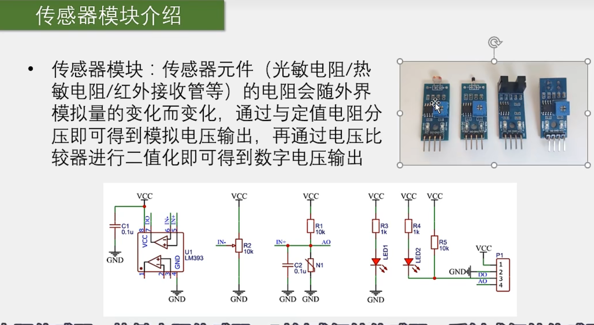
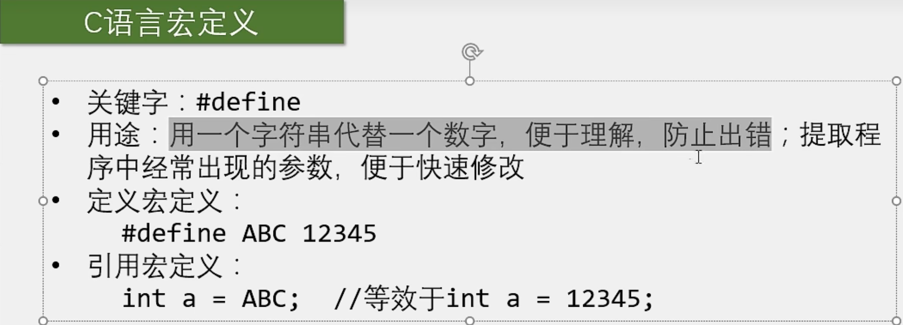

# 【3-3】GPIO输入

因为【3-1】小节中已经把GPIO的结构和8种输入输出模式都学习完了，所以本小节GPIO输入的部分我们直接从外部硬件设备开始学习了。


## 外围设备介绍(按键)

### 按键


### 传感器模块




#### 按键和传感器模块的硬件电路


##### 按键部分：

​	上面两个是下接按键的方式，下面两个是上接按键的方式。

​		一般来说，我们的按键都是用上面两种方式，也就是下接按键的方式。这个原因跟LED的低电平触发接法类似，是电路设计的习惯和规范。

​		左上图：必须要求PA0是上拉输入的模式，否则当按键没按下时就会悬空而出现引脚电压不稳定的错误现象。如果PA0是上拉输入模式，那我们之前讲了，引脚再悬空，PA0就是高电平。所以这种方式下，按下按键引脚为低电平，松手引脚为高电平。

​		右上图：相比于左上图，上拉了一个高电平，当按键松手时，引脚由于上拉作用，自然保持为高电平。当按键按下时，引脚直接接到GND，也就是一股无穷大的力把这个引脚往下拉，所以引脚为低电平。这种状态下，引脚不会出现悬空状态，所以此时PA0引脚可以配置为浮空输入或者上拉输入：

​					如果是上拉输入，那就是内外两个上拉电阻共同作用了，这时高电平就会更强一些，对应高电平就更加稳定，当然这样的话，当引脚被强行拉到低时，损耗也就会大一些。&lt;img src="./assets/image-20231122205317603.png" alt="image-20231122205317603" style="zoom:25%;" /&gt;

​		左下图：必须要求PA0是下拉输入的模式，当按键按下时，引脚为高电平，松手时，引脚回到默认值低电平。但一般单片机可能不一定有下拉输入的模式，所以最好还是用上面的接法，下面的作为扩展部分了解即可。


​		右下图：必须要求PA0是下拉输入模式或者浮空输入模式，分析类比左上图，此处不再赘述。


​	总结：

​				上面这两种接法按键按下时引脚是低电平，松手是高电平。

​				下面这两种接法按下按键时是高电平，松手是低电平。

​				左边这两种接法必须要求引脚是上拉或者下拉输入的模式。

​				右边这两种接法可以允许引脚是浮空输入的模式，因为引脚配置了上拉电阻和下拉电阻。

​		一般我们都用上面两种接法，下面两种接法用的比较少。


##### 传感器模块

​	AO：模拟输出，之后学ADC数模转换器的时候再用，现在不接。

​	DO：随便接一个端口，比如PA0，用于读取数字量。

​	GND:接地，即GND

​	VC接3.3V


## C语言知识点补充

#### C语言数据类型


###### 注意事项

​		1.在51单片机中，int是占16位的，而在STM32中int是占32位的，如果要用16位数据，要用short来表示。这是和51单片机的不同之处，不要搞混淆了。

​		2.long和ulong型占用位数还是32位(虽然按道理是要比int型大的hhh)，如果想用64位的需要用到long long型或者ulong long 型，不过这个数实在是太大了我们用的很少。

​		3.float和double都是存小数的，而且它们都是带符号的数，没有无符号的float和double。

​		4.右边stdint和ST是两种对关键字的用typedef重命名的变量类型（typedef是用来给变量类型重命名的，下面会讲）

​				我们以后在写程序的时候，就会按照它的推荐，使用这些新的名字。

​		 5.ST关键字是老版本库函数的关键字命名规则，新版本仍然可用但不推荐使用。

#### C语言宏定义



#### C语言typedef


相当于数据类型版换名字，与宏定义差不多，下面是两者区别：

​		1.宏定义的新名字在左边，typedef的新名字在右边。

​		2.宏定义不需要分号，typedef后面必须加分号。

​		3.宏定义的任何名字都可以换，而typedef只能专门给变量类型换名字。

​	总结：宏定义的改名范围要更宽一些，只不过对于变量类型的重命名而言，使用typedef更加安全，因为宏定义只是无脑改名，不管你对不对，而typedef会对命名进行检查，如果不是变量类型的名字，那是不行的，会报错。所以给变量类型重命名我们一般用typedef。当然原来的名字还是能用的，这里的重命名只是增加了一个新名字而已。


#### C语言结构体


​			上面介绍的int，char等我们称作基本数据类型，

​			然后数组就是一大堆基本数据类型的集合，数组我们就可以称作组合数据类型，它是由许多基本数据类型组合而来的，数组组合的只能是相同的数据。（我原称之为：列表阉割版）

​		那么，我们如果想组合不同的数据类型该怎么办呢？

​			答：结构体

​				结构体也是一种组合数据类型，它的作用就是组合不同的数据类型。(nnd不就是列表完整版)

```c
//下面是结构体的学习示例,类比基本变量，数组类型
#include <stdio.h>

int main()
{
    //基本变量类型
    int a;
    a = 66;
    printf("a = %d\n",a);
    
    //数组类型
    int b[5];
    b[0] = 66;
    b[1] = 77;
    b[2] = 88;
    printf("b[0] = %d\n",b[0]);
    printf("b[1] = %d\n",b[1]);
    printf("b[2] = %d\n",b[2]);
    
    //结构体变量类型
    //定义一个结构体变量，名字叫c，其中包含了char型的x，int型的y和float型的z三个子项。
    struct{char x;int y;float z;} c;
    //引用结构体内部的值：
    //结构体名称.结构体子项名称   来引用结构体成员。
    c.x = 'A';
    c.y = 66;
    c.z = 1.23
    printf("c.x = %c\n",c.x);
    printf("c.y = %d\n",c.y);
    printf("c.z  = %f\n",c.z);
}
```

​										**下面是结构体的特殊用法**

```c
//结构体的特殊用法

//问题1：结构体的名字太长了。
/*
解决方法：
	使用typedef把数据类型名字缩小
*/
typedef struct
{
    char x;
    int y;
    float z;
} StructName_t;


//结构体变量类型
StructName_t c;
//引用结构体内部的值：
//结构体名称.结构体子项名称   来引用结构体成员。
c.x = 'A';
c.y = 66;
c.z = 1.23
    
printf("c.x = %c\n",c.x);
printf("c.y = %d\n",c.y);
printf("c.z  = %f\n",c.z);
```

**PS：**

结构体引用不仅可以这样：

```c
c.y = 66;
```

还可以这样：

```c
c->y = 66;
```

**为什么要加一种结构体指针的引用方式呢?**

​	这是因为，结构体是一种组合数据类型，在函数之间的数据传递中，通常用的是地址传递而不是值传递（这里是指针教程，11.23还没学）

​	既然是使用指针传递，子函数得到的就是结构体的首地址，这时候我们就可以用-&gt;这个运算符快速引用结构体的成员。


#### C语言枚举


```c
//下面是枚举的学习示例
#include <stdio.h>


//可以用typedef来达到简写的目的
typedef enum{
    MONDAY = 1,
    TUESDAY,
    WEDNESDAY
}week_t;

int main()
{

    
	//定义枚举
    /*
    enum{
        MONDAY = 1,
        TUESDAU = 2,
        WEDNESDAY = 3,
    } week;
    */
    
    
    //如果枚举里面的定义数是按顺序累加的，那么后面的=2，=3可以省略，编译器会自动填补，如下：
    /*
        enum{
        MONDAY = 1,
        TUESDAU , 
        WEDNESDAY ,
    } week;
    */
    
    
    //下面是使用typedef定义后的枚举定义
    week_t week;
    
    //引用
    week = MONDAY;	//week = 1;
    week = TUESDAY;	//week = 2;
    

}
```


