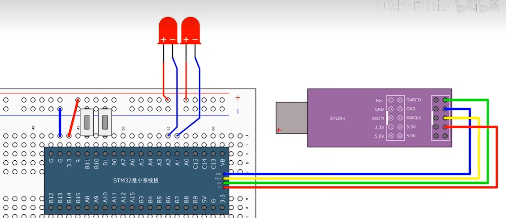

# 【3-4】按键控制LED&光敏控制蜂鸣

## 按键控制LED


**按键不推荐使用外部中断，因为用外部中断不好处理按键抖动和松手检测的问题，且对于按键来说，它的输出波形也不是转瞬即逝的，所以要求不高的话可以在主程序中循环读取，如果不想用主循环读取的话，可以考虑一下定时器中断读取的方式，这样既可以做到后台读取按键值，不阻塞主程序，也可以很好的处理按键抖动和松手检测的问题。**


#### 接线图



#### 模块化编程

​	1.打开工程文件夹，再创建一个文件夹名为Hardware，用来存放硬件驱动。

​	2.回到keil，打开三个箱子按钮(工程管理),新建一个组也叫Hardware。

​	3.然后再点击魔术棒按钮(工程选项)，选择C/C++，点击三个点按钮，将Hardware目录添加。

​	4.在Hardware文件右键，添加新文件，选择c文件，起个名字叫LED，这个文件就用来封装LED的驱动程序

​	5.继续在Hardware文件里添加新的文件，LED.h

**其中：**

​	LED.c用来存放驱动程序的主体密码

​	LED.h用来存放这个驱动程序可以对外提供的函数或变量的声明


##### LED.h

```c
#ifndef __LED_H	//如果没有定义__LED_H这个字符串	
#define __LED_H	//那么就定义这个字符串

int LED_mode;

void LED_Init(void);
void LED1_ON(void);
void LED1_OFF(void);
void LED2_ON(void);
void LED2_OFF(void);
void LED1_Trun(void);
void LED2_Trun(void);
#endif	//结束if，与#idnef相对应

```


##### LED.c

```c
#include "stm32f10x.h"                  // Device header

//初始化LED
void LED_Init(void)
{
	//开启时钟,时钟是单片机的心跳
	RCC_APB2PeriphClockCmd(RCC_APB2Periph_GPIOA,ENABLE);
	//配置端口模式
	
	//定义结构体变量
	GPIO_InitTypeDef GPIO_InitStruct;
	GPIO_InitStruct.GPIO_Mode = GPIO_Mode_Out_PP;//推挽模式
	GPIO_InitStruct.GPIO_Pin = GPIO_Pin_1 | GPIO_Pin_2;
	GPIO_InitStruct.GPIO_Speed = GPIO_Speed_50MHz;
	
	//初始化GPIO
	GPIO_Init(GPIOA,&GPIO_InitStruct);
	
	//设置高电平，初始化让其熄灭状态
	GPIO_SetBits(GPIOA,GPIO_Pin_1 | GPIO_Pin_2);
	
}

//LED1灯亮
void LED1_ON(void)
{
	GPIO_ResetBits(GPIOA,GPIO_Pin_1);
}


//LED1灯灭
void LED1_OFF(void)
{
	
	GPIO_SetBits(GPIOA,GPIO_Pin_1);

}

//LED2灯亮
void LED2_ON(void)
{
	
	GPIO_ResetBits(GPIOA,GPIO_Pin_2);

}

//LED2灯灭
void LED2_OFF(void)
{
	
	GPIO_SetBits(GPIOA,GPIO_Pin_2);

}

//LED1灯切换状态
void LED1_Trun(void)
{
	if(GPIO_ReadOutputDataBit(GPIOA,GPIO_Pin_1) == 0)
	{
		GPIO_SetBits(GPIOA,GPIO_Pin_1);
	}
	else
	{
		GPIO_ResetBits(GPIOA,GPIO_Pin_1);
	}
}

//LED2灯切换状态
void LED2_Trun(void)
{
	if(GPIO_ReadOutputDataBit(GPIOA,GPIO_Pin_2) == 0)
	{
		GPIO_SetBits(GPIOA,GPIO_Pin_2);
	}
	else
	{
		GPIO_ResetBits(GPIOA,GPIO_Pin_2);
	}
}


```


##### KEY.h

```c
#ifndef __KEY_H
#define __KEY_H

void Key_Init(void);
uint8_t Key_GetNum(void);


#endif


```


##### KEY.c

```c
#include "stm32f10x.h"                  // Device header
#include "Delay.h"


void Key_Init(void)
{
	//开启时钟
	RCC_APB2PeriphClockCmd(RCC_APB2Periph_GPIOB,ENABLE);
	
	//定义结构体变量
	GPIO_InitTypeDef GPIO_InitStructrue;
	//因为我们需要读取按键，所以我们选择上拉输入模式
	GPIO_InitStructrue.GPIO_Mode = GPIO_Mode_IPU;
	GPIO_InitStructrue.GPIO_Pin = GPIO_Pin_1;
	GPIO_InitStructrue.GPIO_Speed = GPIO_Speed_50MHz;//输入模式下其实它没用
	
	//初始化GPIO口
	GPIO_Init(GPIOB,&GPIO_InitStructrue);
}


uint8_t Key_GetNum(void)
{
	uint8_t KeyNum = 0;
	
	//返回值就是输入寄存器某一位的值，0/1
	if(GPIO_ReadInputDataBit(GPIOB,GPIO_Pin_0) == 0)	//判断是否按下按键
	{
		//消除抖动
		Delay_ms(20);
		while(GPIO_ReadInputDataBit(GPIOB,GPIO_Pin_0) == 0);
		Delay_ms(20);
		KeyNum = 1;
	}
		
	if(GPIO_ReadInputDataBit(GPIOB,GPIO_Pin_11) == 0)
	{
		Delay_ms(20);
		while(GPIO_ReadInputDataBit(GPIOB,GPIO_Pin_11) == 0);
		Delay_ms(20);
		KeyNum = 2;
	}
	
	return KeyNum;
}


```


### 程序实例


#### GPIO输入函数

```c
uint8_t GPIO_ReadInputDataBit(GPIO_TypeDef* GPIOx, uint16_t GPIO_Pin);
//填入参数	1.GPIOx		2.GPIO_Pin
//函数功能	读取输入数据寄存器某一个端口的输入值
```


```c
uint16_t GPIO_ReadInputData(GPIO_TypeDef* GPIOx);
//填入参数	1.GPIOx
//函数功能	读取整个输入数据寄存器
//返回值是unit16_t,是16为位的数据，每位代表一个端口值
```


```c
uint8_t GPIO_ReadOutputDataBit(GPIO_TypeDef* GPIOx, uint16_t GPIO_Pin);

//填入参数	1.GPIOx		2.GPIO_Pin
//函数功能	读取输出数据寄存器的某一个位
//所以原则上来说，它并不是用来读取端口的输入数据的。
//这个函数一般用于输出模式下，用来看下自己输出的是什么。
```


```c
uint16_t GPIO_ReadOutputData(GPIO_TypeDef* GPIOx);
//填入参数	1.GPIOx
//函数功能	读取整个输出数据寄存器
//所以原则上来说，它并不是用来读取端口的输入数据的。
//这个函数一般用于输出模式下，用来看下自己输出的是什么。
```


#### main.c

```c
//按键1按下LED1切换亮灭
//按键2按下LED2切换亮灭
#include "stm32f10x.h"                  // Device header
#include "Delay.h"


void Key_Init(void)
{
	//开启时钟
	RCC_APB2PeriphClockCmd(RCC_APB2Periph_GPIOB,ENABLE);
	
	//定义结构体变量
	GPIO_InitTypeDef GPIO_InitStructrue;
	//因为我们需要读取按键，所以我们选择上拉输入模式
	GPIO_InitStructrue.GPIO_Mode = GPIO_Mode_IPU;
	GPIO_InitStructrue.GPIO_Pin = GPIO_Pin_1;
	GPIO_InitStructrue.GPIO_Speed = GPIO_Speed_50MHz;//输入模式下其实它没用
	
	//初始化GPIO口
	GPIO_Init(GPIOB,&GPIO_InitStructrue);
}


uint8_t Key_GetNum(void)
{
	uint8_t KeyNum = 0;
	
	//返回值就是输入寄存器某一位的值，0/1
	if(GPIO_ReadInputDataBit(GPIOB,GPIO_Pin_0) == 0)	//判断是否按下按键
	{
		//消除抖动
		Delay_ms(20);
		while(GPIO_ReadInputDataBit(GPIOB,GPIO_Pin_0) == 0);
		Delay_ms(20);
		KeyNum = 1;
	}
		
	if(GPIO_ReadInputDataBit(GPIOB,GPIO_Pin_11) == 0)
	{
		Delay_ms(20);
		while(GPIO_ReadInputDataBit(GPIOB,GPIO_Pin_11) == 0);
		Delay_ms(20);
		KeyNum = 2;
	}
	
	return KeyNum;
}

```


## 光敏控制蜂鸣器

### 接线图


### 程序实例

**Buzzer.c**

```c
#include "stm32f10x.h"                  // Device header

void Buzzer_Init(void)
{
	RCC_APB2PeriphClockCmd(RCC_APB2Periph_GPIOB, ENABLE);
	
	GPIO_InitTypeDef GPIO_InitStructure;
	GPIO_InitStructure.GPIO_Mode = GPIO_Mode_Out_PP;
	GPIO_InitStructure.GPIO_Pin = GPIO_Pin_12;
	GPIO_InitStructure.GPIO_Speed = GPIO_Speed_50MHz;
	GPIO_Init(GPIOB, &GPIO_InitStructure);
	
	GPIO_SetBits(GPIOB, GPIO_Pin_12);
}

void Buzzer_ON(void)
{
	GPIO_ResetBits(GPIOB, GPIO_Pin_12);
}

void Buzzer_OFF(void)
{
	GPIO_SetBits(GPIOB, GPIO_Pin_12);
}

void Buzzer_Turn(void)
{
	if (GPIO_ReadOutputDataBit(GPIOB, GPIO_Pin_12) == 0)
	{
		GPIO_SetBits(GPIOB, GPIO_Pin_12);
	}
	else
	{
		GPIO_ResetBits(GPIOB, GPIO_Pin_12);
	}
}

```


**Buzzer.h**

```c
#ifndef __BUZZER_H
#define __BUZZER_H

void Buzzer_Init(void);
void Buzzer_ON(void);
void Buzzer_OFF(void);
void Buzzer_Turn(void);

#endif

```


**LightSensor.c**

```c
#include "stm32f10x.h"                  // Device header

/**
  * 函    数：光敏传感器初始化
  * 参    数：无
  * 返 回 值：无
  */
void LightSensor_Init(void)
{
	/*开启时钟*/
	RCC_APB2PeriphClockCmd(RCC_APB2Periph_GPIOB, ENABLE);		//开启GPIOB的时钟
	
	/*GPIO初始化*/
	GPIO_InitTypeDef GPIO_InitStructure;
	GPIO_InitStructure.GPIO_Mode = GPIO_Mode_IPU;
	GPIO_InitStructure.GPIO_Pin = GPIO_Pin_13;
	GPIO_InitStructure.GPIO_Speed = GPIO_Speed_50MHz;
	GPIO_Init(GPIOB, &GPIO_InitStructure);						//将PB13引脚初始化为上拉输入
}

/**
  * 函    数：获取当前光敏传感器输出的高低电平
  * 参    数：无
  * 返 回 值：光敏传感器输出的高低电平，范围：0/1
  */
uint8_t LightSensor_Get(void)
{
	return GPIO_ReadInputDataBit(GPIOB, GPIO_Pin_13);			//返回PB13输入寄存器的状态
}

```


**LightSensor.h**

```c
#ifndef __LIGHT_SENSOR_H
#define __LIGHT_SENSOR_H

void LightSensor_Init(void);
uint8_t LightSensor_Get(void);

#endif

```


**main.c**

```c
#include "stm32f10x.h"                  // Device header
#include "Delay.h"
#include "Buzzer.h"
#include "LightSensor.h"

int main(void)
{
	/*模块初始化*/
	Buzzer_Init();			//蜂鸣器初始化
	LightSensor_Init();		//光敏传感器初始化
	
	while (1)
	{
		if (LightSensor_Get() == 1)		//如果当前光敏输出1
		{
			Buzzer_ON();				//蜂鸣器开启
		}
		else							//否则
		{
			Buzzer_OFF();				//蜂鸣器关闭
		}
	}
}

```


