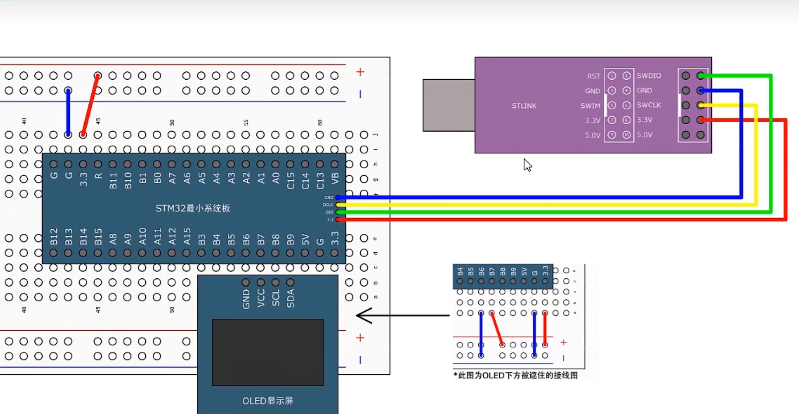

# 【4-2】OLED显示屏

## 接线图




## 程序实例

**main.c**

```c
#include "stm32f10x.h"                  // Device header
#include "Delay.h"
#include "OLED.h"

int main(void)
{
	/*模块初始化*/
	OLED_Init();		//OLED初始化
	
	/*OLED显示*/
	OLED_ShowChar(1, 1, 'A');				//1行1列显示字符A
	
	OLED_ShowString(1, 3, "HelloWorld!");	//1行3列显示字符串HelloWorld!
	
	OLED_ShowNum(2, 1, 12345, 5);			//2行1列显示十进制数字12345，长度为5
	
	OLED_ShowSignedNum(2, 7, -66, 2);		//2行7列显示有符号十进制数字-66，长度为2
	
	OLED_ShowHexNum(3, 1, 0xAA55, 4);		//3行1列显示十六进制数字0xA5A5，长度为4
	
	OLED_ShowBinNum(4, 1, 0xAA55, 16);		//4行1列显示二进制数字0xA5A5，长度为16
											//C语言无法直接写出二进制数字，故需要用十六进制表示
	
	while (1)
	{
		
	}
}

```


## Keil调试模式


1.打开工程选项(魔术棒)


2.点击Debug选项：


​	默认选择右侧一项，用STLINK进行硬件仿真，需要把STM32和STLINK都连接好。


​	如果你不想连接硬件，可以选择左边的使用仿真器这个选项，这样就是电脑模拟STM32的运行了。


下面展示使用硬件仿真：

​	正常编译完程序之后，点击放大镜带个d的图标进入调试模式：

​	


