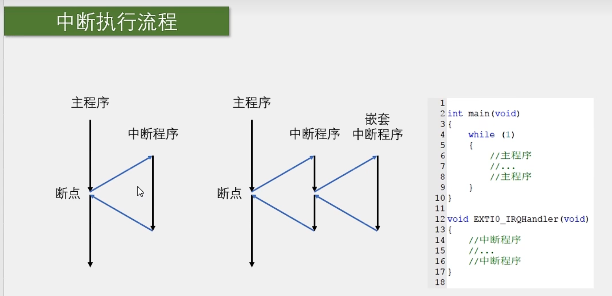
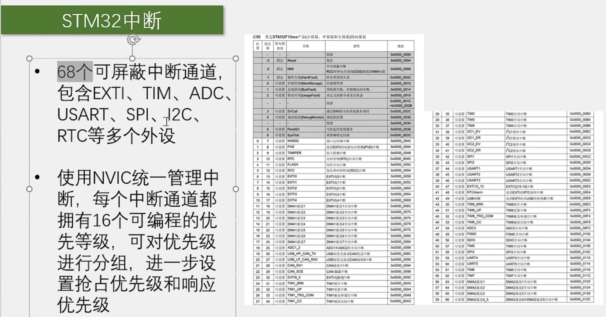
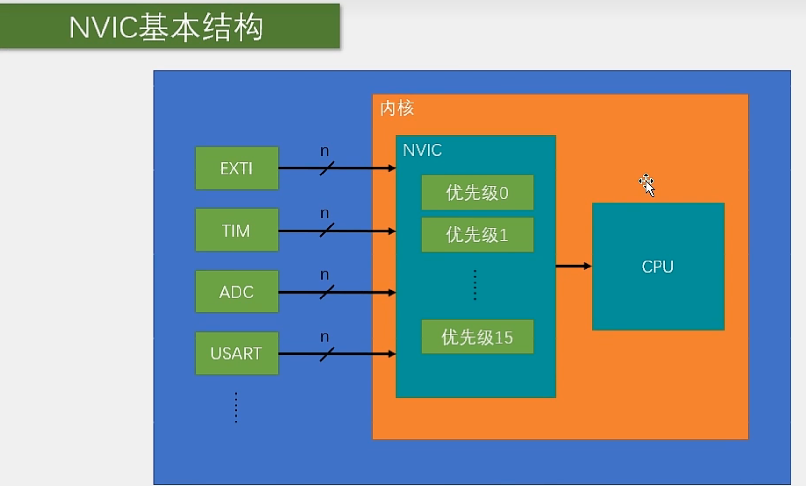
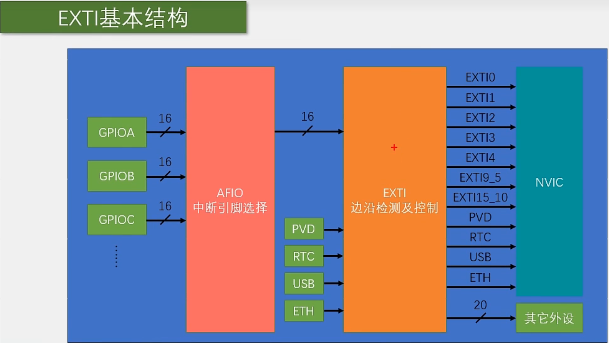
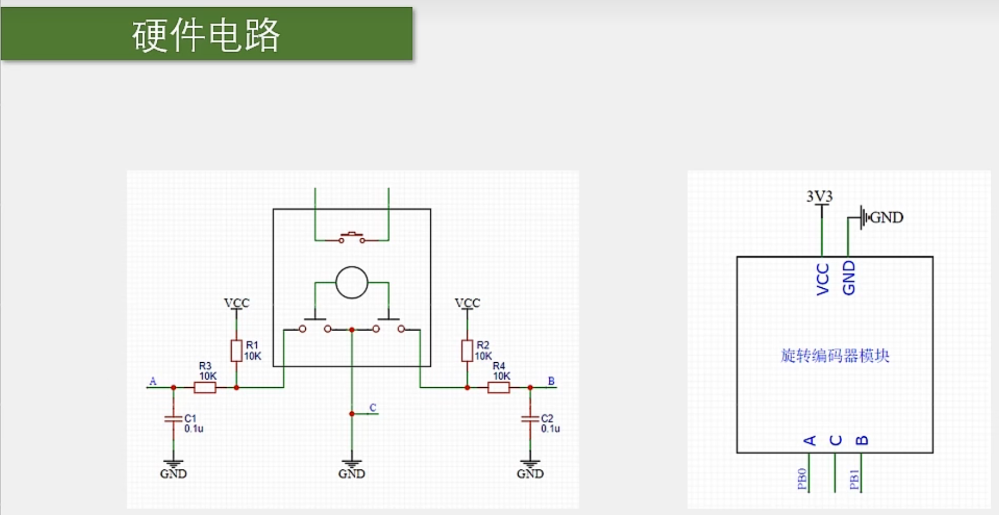

# 【5-1】EXTI外部中断

**中断系统是管理和执行中断的逻辑结构**


**外部中断是众多能产生中断的外设之一**


**配置中断函数的步骤：**

​	1.配置RCC，把涉及到的外设的时钟都打开(不打开时钟外设是没法工作滴)

​	2.配置GPIO，选择我们的端口为输入模式

​	3.配置AFIO，选择我们的这一路GPIO，连接到后面的EXTI。

​	4.配置EXTI，选择边沿触发的方式，比如上升沿，下降沿或者双边沿，还有选择触发响应方式，可以选择中断响应和事件响应。(当然我们一般都是中断响应。)

​	5.配置NVIC，给我们这个中断选择一个合适的优先级。

​	最后，通过NVIC，外部中断信号就可以进去CPU了。这样CPU才能收到中断信号，从外部中断进入到CPU里去。


**中断函数的程序编写建议：**

​	1.在中断函数里，最好不要执行耗时过长的代码，中断函数要简短迅速，别当进中断就执行一个Delay多少毫秒这样的代码，因为中断是处理突发的事情，如果你为了一个突发的事情待着中断里不出来了，那主程序就会受到严重的阻塞。

​	2.最好不要在中断函数和主函数调用相同的函数或者操作同一个硬件，尤其是硬件相关的函数，比如OLED显示函数。如果你既在主函数里调用OLED，又在中断里调用OLED，OLED就会显示错误，为什么呢？因为你想，在主程序中，OLED刚显示一半，帕，进中断了，结果中断里还是OLED显示函数，那OLED就挪到其他地方显示了。这时还没有问题，但当中断结束之后，需要继续原来的显示，这时就出问题了。


## 中断概念

#### 中断系统


​	中断就是在正常主程序执行的某个时刻，发生了中断触发条件，比如：

​		对于外部中断来说：

​				可以是引脚发生了电平跳变。

​		对于定时器来说：

​				可以是定时的时间到了。

​		对于串口通信来说：

​				可以是接收到了数据。

​	当这些事件发生时，情况会比较紧急，所以我们希望CPU优先处理中断事件，再继续处理主程序。


**比喻理解：**

​		好比你定了一个早上的闹钟，定好了以后你就可以安心的睡觉了，时间到了以后闹钟会提醒你，这就相当于产生了一个中断信号。

​		如果你没有闹钟，那你就得不断地看时间，生怕错过了起床的时间点，那这样你就没法安心睡觉了是吧。


**中断优先级：**

​	是我们根据程序设计的需求自己设置的，中断优先级是为了在多个中断同时申请时，判断一下，应该先处理哪个。


#### 中断执行流程



​	**PS：**

​			一般中断程序都是在一个子函数里的，这个函数不需要我们调用，当中断来临时，由硬件自动调用这个函数。


#### STM32中断



​	EXTI：外部中断

​	TIM：定时器

​	ADC：模数转换器

​	 USART串口

​	SPI通信

​	I2C通信

​	RTC实时时钟


**中断向量表：**

​	中断表后的地址是干嘛的呢？这是因为我们程序中的中断函数，它的地址是由编译器来分配的，是不固定的。

​	但是我们的中断跳转，由于硬件的限制，只能跳到固定的地址执行程序，所以为了能让硬件跳转到一个不固定的中断函数里，这里就需要在内存中定义一个地址的列表，这个列表地址是固定的，中断发生后，就跳到这个固定的位置。

​	然后再在这个固定位置，由编译器，再加上一条跳转到中断函数的代码，这样中断跳转就可以跳转到任意位置了。这个中断地址的列表，就叫做中断向量表。相当于中断跳转的一个跳板。

​	不过我们用C语言编程的话，是不需要管这个中断向量表的，因为编译器都帮我们做好了，所以还是很省心的。


#### NVIC基本结构

NVIC的名字叫做**嵌套中断向量控制器**




​	在STM32中，它是用来统一分配中断优先级和管理中断的。NVIC是一个内核外设，是CPU的小助手。

​	STM32的中断非常多，如果把这些中断都接到CPU上，那CPU还得引出很多线进行适配，设计上就和那麻烦，并且如果很多中断同时申请，或者很多中断产生了拥堵，CPU也会很难处理，比较CPU主要是用来运算的，中断分配的任务就放到别的地方吧：所以NVIC就出现了。

​	

​	NVIC有很多个输入口，你有多少个中断线路，都可以接过来。比如可以接到EXTI，TIM，ADC，USART等等。


​	上图中线上画了一个斜杠上面写了个n,这个意思是：

​			一个外设可能会同时占用多个中断通道，所以这里有n条线。然后NVIC只有一个输出口，NVIC会根据每个中断的优先级分配中断的先后顺序。之后，通过右边的这一个输出口就告诉CPU，你该处理哪个中断，对于中断先后顺序分配的任务，CPU不需要知道。

​	**比喻理解：**

​			CPU是一个医生，如果医院只有医生的话，当看病的人很多时，医生就得安排一下先看谁，后看谁。如果有紧急的病人，那还得让紧急的病人最先来。这个安排先后次序的任务就很繁琐，会影响医生看病的效率。

​			所以医院就安排了一个叫号系统，来病人了统一取号，并且根据病人的等级，分配一个优先级，然后叫号系统看一下现在在排队的病人，优先叫号紧急的病人，最后叫号系统给医生输出的就是一个一个排好队的病人。医生就可以安心看病了。


#### NVIC分组


**比喻理解：**

​		接上文病人医生例子：

​		对于紧急的病人，其实有两种形式的优先。

​				一种是，上一个病人在看病，外面排队了很多病人，当上一个病人看完后，紧急的病人即使是后来的，也会最先进去看病。这种相当于插队的优先级，就叫**响应优先级**，响应优先级高的，可以插队提前看病。

​		 另外，如果这个病人更加紧急，并且此时已经有人在看病了，那他还可以不等上个人看完，直接冲到医生的屋里，让在看病的病人先靠边站，先给她看病，等他看完了，然后上一个病人再继续，上一个病人结束了，叫号系统再看看有没有人来。这种形式的优先级就是我们之前将的中断嵌套，这种决定是不是可以中断嵌套的优先级，就叫**抢占优先级**，抢占优先级高的，可以进行中断嵌套。


那我们刚才说了，每个中断有16个优先级，为了把这个优先级再区分为抢占优先级和响应优先级，就需要对这16个优先级进行分组了。


**下面是NVIC的相关函数**

```c
void NVIC_PriorityGroupConfig(uint32_t NVIC_PriorityGroup);
//函数功能：用来中断分组的，参数是中断分组的方式。
```

```c
void NVIC_Init(NVIC_InitTypeDef* NVIC_InitStruct);
//函数功能：根据结构体里的参数初始化NVIC
```


下面这两个函数用的不多

```c
void NVIC_SetVectorTable(uint32_t NVIC_VectTab, uint32_t Offset);
//函数功能：设置中断向量表
```

```c
void NVIC_SystemLPConfig(uint8_t LowPowerMode, FunctionalState NewState);
//函数功能：系统低功耗配置
```


## EXTI外部中断

**按键不推荐使用外部中断，因为用外部中断不好处理按键抖动和松手检测的问题，且对于按键来说，它的输出波形也不是转瞬即逝的，所以要求不高的话可以在主程序中循环读取，如果不想用主循环读取的话，可以考虑一下定时器中断读取的方式，这样既可以做到后台读取按键值，不阻塞主程序，也可以很好的处理按键抖动和松手检测的问题。**


### EXTI相关函数

```c
void EXTI_DeInit(void);
//函数功能：把EXTI的配置都清除，恢复成上电默认的状态。
```

```c
void EXTI_Init(EXTI_InitTypeDef* EXTI_InitStruct);
//填入参数	1.配置EXTI的结构体
//函数功能：可以根据这个结构体里的参数配置EXTI外设，即初始化EXTI
```

```c
void EXTI_StructInit(EXTI_InitTypeDef* EXTI_InitStruct);
//函数功能：可以把参数传递的结构体变量赋一个默认值
```

**以上三个函数，基本所有外设都有，就像是库函数的模板函数一样，基本每个外设都需要这些类型的函数，这些模板函数的使用方法和意思也都是一样的，会使用一个之后，再见到这种函数，就能很容易的上手。**

```c
void EXTI_GenerateSWInterrupt(uint32_t EXTI_Line);

//函数功能：这个函数是用来软件触发外部中断的，调用这个函数，参数给一个指定的中断线，就能软件触发一次这个外部中断，如果你程序中需要用到这个功能的话可以使用这个函数。当然如果你只需要外部引脚触发中断，那就不需要用这个函数了。
```


**下面四个函数，也是库函数的模板函数，很多模块都有这四个函数。**

```c
FlagStatus EXTI_GetFlagStatus(uint32_t EXTI_Line);
//函数功能：可以获取指定的标志位是否被置1了
```

```c
void EXTI_ClearFlag(uint32_t EXTI_Line);
//函数功能：可以对置1的标志位进行清除。
```

```c
ITStatus EXTI_GetITStatus(uint32_t EXTI_Line);
//函数功能：获取中断标志位是否被置1了(就是在中断函数中)
```

```c
void EXTI_ClearITPendingBit(uint32_t EXTI_Line);
//函数功能:清除中断挂起标志位(就是在中断函数中)
```

​	**总结：如果你想在主程序里查看和清除标志位，就用上面这两个函数，如果你想在中断函数里查看和清除标志位，就用下面这两个函数，其实本质上，这四个函数都是对状态寄存器的读写，上面两个和下面两个都是类似的功能，都是读写状态寄存器。**


### EXTI介绍


​		**简单来说就是引脚电平变化，申请中断。**

​	**PS：**

​		任意的GPIO口都可以当作外部中断的引脚，但相同的Pin不能同时触发中断。这个意思就是，比如PA0和PB0不能同时用，或者PA1，PB1，PC1这样的，端口GPIO_Pin一样的，只能选择一个作为中断引脚。所以你如果有多个中断引脚，要选择不同Pin的引脚，比如PA6和PA7，PA9和PB15这样的都可以。


**通道数：**

​		这些加起来总共有20个中断线路（16个Pin+4个蹭网的），这里的16个GPIO_Pin是外部中断的主要功能，后面跟着的四个东西其实是来蹭网的。为啥呢？因为这个外部中断有个功能，就是从低功耗模式的停止模式下唤醒STM32，

​		对于PVD电源电压监测，当电源从电压过低恢复时，就需要PVD借助一下外部中断退出停止模式。

​		对于RTC闹钟来说，有时候为了省电，RTC定了一个闹钟之后，STM32会进入停止模式，等到闹钟响的时候再唤醒，这也需要借助外部中断。

​		还有USB唤醒，以太网唤醒，也都是类似的作用。

​	**意思就是这四个蹭网的要唤醒就得找EXTI才能唤醒，其他中断没法唤醒**


**触发方式：**

​		中断响应：申请中断，让CPU执行中断函数。

​		事件响应：是STM32对外部中断增加的一种额外的功能。当外部中断检测到引脚电平变化时，正常的流程是选择触发中断，但在STM32中，也可以选择触发一个事件，如果选择触发事件，那外部中断的信号就不会通向CPU了，而是通向其他外设，用来触发其他外设的操作。比如触发ADC转换，触发DMA等。属于外设之间的联合工作。


### EXTI基本结构




**AFIO：**

​	EXTI模块只有16个GPIO通道，但这里每个GPIO外设都有16个引脚，如果每个引脚占用一个通道，那EXTI的16个通道显然就不够用了，所以在这里会有一个AFIO中断引脚选择的电路模块。

​	这个AFIO就是一个数据选择器，他可以在这前面3个GPIO外设的16个引脚里选择其中一个连接到后面EXTI的通道里。所以这前面说，相同的Pin不能同时触发中断，因为对于PA0，PB0，PC0这些，通过AFIO选择之后，只有其中一个能接到EXTI的通道0上，同理，PA1，PB1，PC1这些，也只能有一个，连接到通道1上


​	**下面是AFIO的函数介绍：**

```c
void GPIO_AFIODeInit(void);
//函数功能：用来复位AFIO外设的，当调用此函数时，AFIO外设的配置就会全部清除。
```


```c
void GPIO_EventOutputConfig(uint8_t GPIO_PortSource, uint8_t GPIO_PinSource);

void GPIO_EventOutputCmd(FunctionalState NewState);

//函数功能：用来配置AFIO的事件输出功能的，用的不多，了解即可。
```


```c
void GPIO_PinRemapConfig(uint32_t GPIO_Remap, FunctionalState NewState);
//填入参数：1.选择你要重映射的方式	2.参数新的状态
//函数功能：可以用来进行引脚重映射

```

```c
void GPIO_EXTILineConfig(uint8_t GPIO_PortSource, uint8_t GPIO_PinSource);
//填入参数
//函数功能：配置AFIO的数据选择器，来选择我们想要的中断引脚
```

**PS：**

​	本来20路的输入，应该有20路中断的输出接入到NVIC的，但可能ST公司觉得这20个输出太多了，比较占用NVIC的通道资源，所以就把其中外部中断9-5，和15-10，给分到一个通道里，也就是说，外部中断的9-5和15-10会触发同一个中断函数，15-10也会触发同一个中断函数。在编程的时候，我们在这两个中断函数里，需要再根据标志位来区分到底是哪个中断进来的。


### AFIO复用IO口


### EXTI内部框图


## 旋转编码器

### 介绍


### 硬件电路




