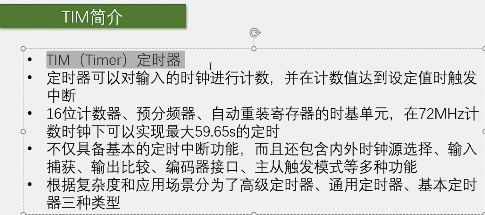
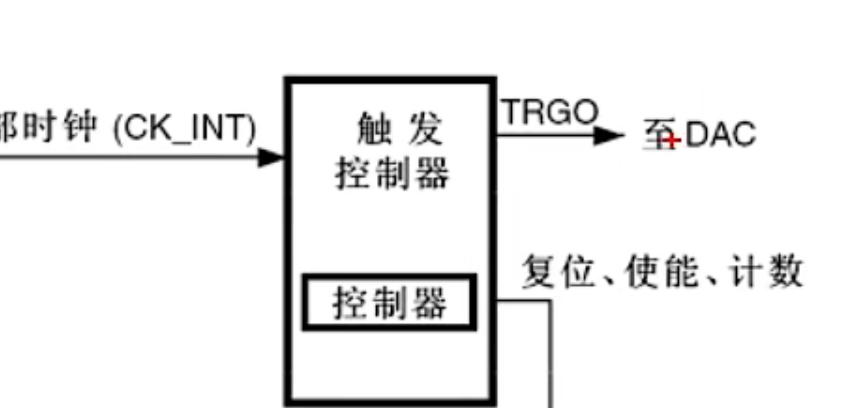
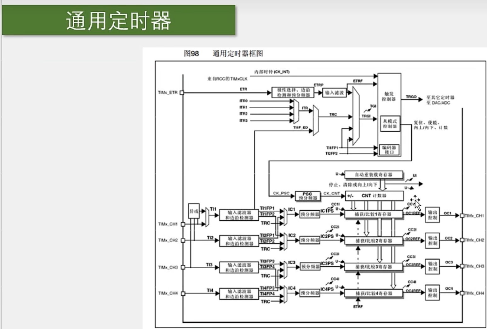
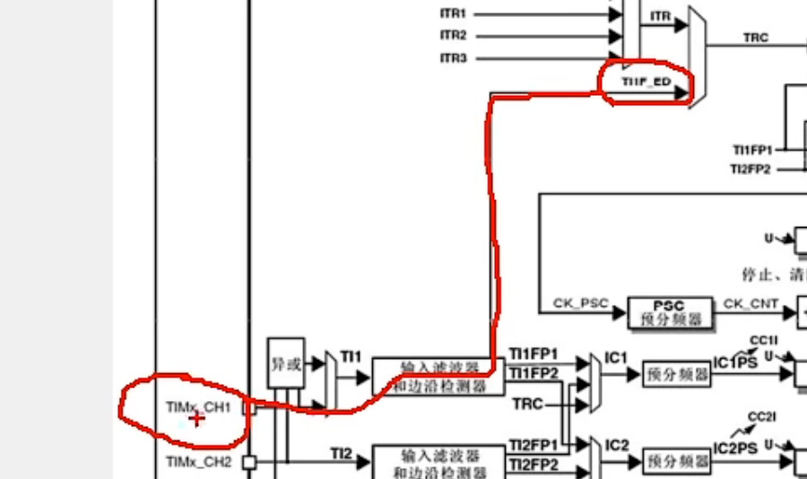
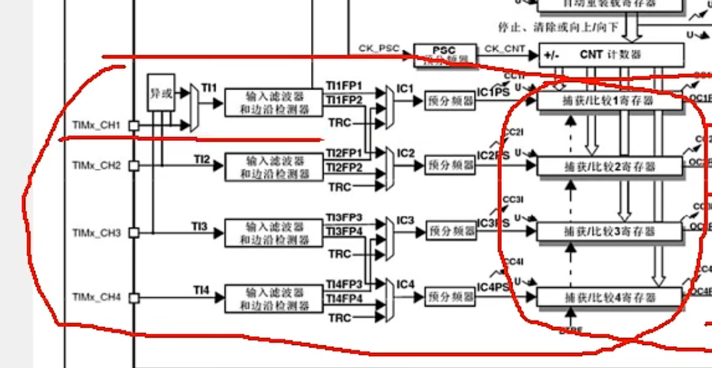
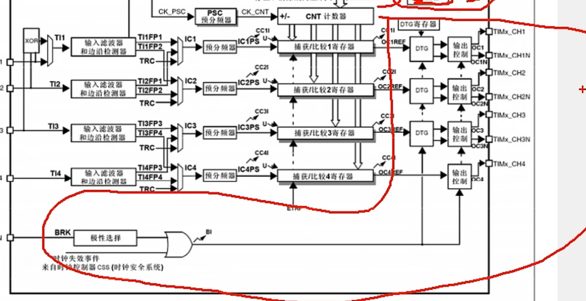
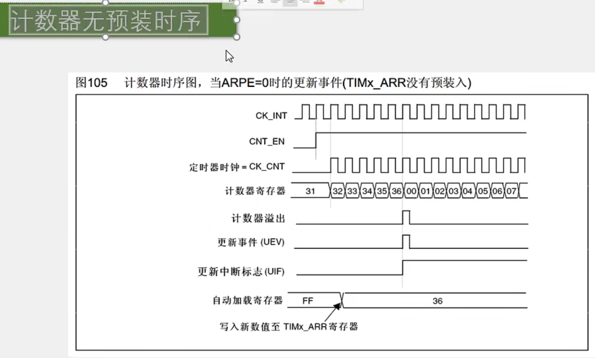
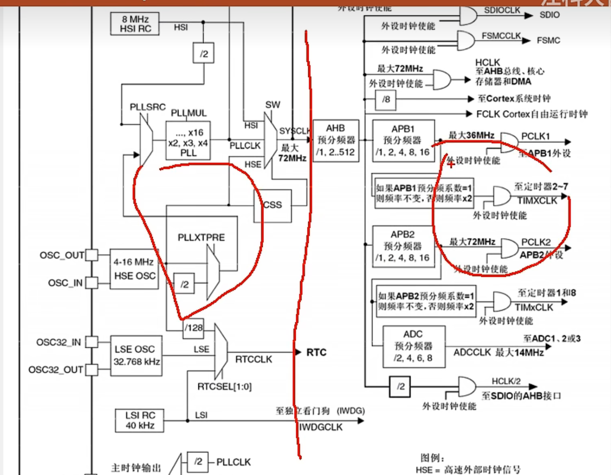
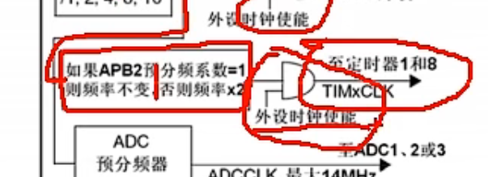

# 【6-1】TIM定时中断

## TIM

### 定时器的库函数

### 简介

​	**STM32中，定时器的基准时钟一般都是主频72MHz**

​		比如我对72MHz计72个数，那就是1MHz也就是1us的时间，如果计72000个数，那就是1kHz也就是1ms的时间。

### 定时器类型

​	**不同的型号具有的定时器是不同的，你在操作这个定时器外设的时候，一定要先查一下它有没有这个外设，否则操作了不存在的外设，那样是不会起作用的**

### 基本定时器

#### 介绍

​	可以完成定时中断，主模式触发DAC的功能。

​	**预分频器：**就是对输入的基准频率提前进行以一个分频的操作。

​	**计数器：**可以对预分频后的计数时钟进行计数。计数时钟每来一个上升沿，计数器的值就+1。这个计数器也是16位的，所以里面的值可以用0-65535。

​	当自增运行至目标值时，产生中断，那就完成了定时的任务。所以现在还需要一个存储目标值的寄存器，那就是自动重装寄存器了。

​	**自动重装寄存器：**它也是16位的，它存的就是我们写入的计数目标。

​	在运行的过程中，计数值不断自增，自动重装值是固定的目标。当计数值等于自动重装值时，也就是计时时间到了。那它就会产生一个中断信号，并且清零计数器，计数器自动开始下一次的计数计时。

(TIPS:51是给定初始值让其自减，当自减完后触发中断。而32是给定某个目标值自增，当自增至目标值后触发中断重置为0再次开始计时。)

像32这种计数值等于自动重装值产生的中断我们一般把它叫做**更新中断**

这个更新中断之后，就会通往NVIC，我们再配置好NVIC的定时器通道，那定时器的更新中断就能够得到CPU的响应了。

（图中向上箭头[UI]表示产生一个中断，而向下箭头[U]表示产生一个事件，对应的事件叫做**更新事件**。更新事件不会触发中断，但是可以触发内部其他电路的工作。）

#### 主模式触发DAC的功能

**STM32定时器的一大特色，就是主从触发模式**

​	它能让内部的硬件在不受程序的控制下实现自动运行。如果能把这个主从触发模式掌握好，那在某些情景下将会极大地减轻CPU的负担。这个后面课程会详细讲解，这里简单了解一下：

**这个主模式触发DAC(数模转换)有啥用呢？**

​		在我们使用DAC的时候，可能会用DAC输出一段波形，那就需要每个一段时间来触发一次DAC，让它输出下一个电压点。

​		如果用正常的思路来实现的话，就是先设置一个定时器产生中断，每隔一段时间在中断程序中调用代码手动触发一次DAC转换，然后DAC输出。这样也是没问题的，但是这样会使主程序处于频繁被中断的状态，这会影响主程序的运行和其他中断的响应 。

​		所以定时器就设计了一个主模式，使用这个主模式可以把这个定时器的更新事件，映射到这个触发输出TRGO(Trigger Out)的位置，然后TRGO直接接到DAC的触发转换引脚上。这样，定时器的更新就不需要再通过中断来触发DAC转换了。仅需要把更新事件通过主模式映射到TRGO，然后TRGO就会直接去触发DAC了。整个过程不需要软件的参与，实现了硬件的自动化，这就是主模式的作用。

### 通用计时器

#### 介绍

下面是清晰放大图：

首先中间最核心这部分，还是**时基单元**，结构和基本定时器是一样的，由预分频器，计数器，自动重装寄存器构成。每部分的工作流程和基本定时器也是一样的。

**不过，对于通用定时器而言，这个计数器的计数模式就不止向上计数这一种了** 

除了这种向上计数的模式外，通用定时器和高级定时器还支持**向下计数模式**和**中央对齐模式**。

​	**向下计数模式：**从重装值开始，向下自减，减到0之后，回到重装值同时申请中断。

​	**中央对齐模式：**从0开始，先向上自增，计到重装值，申请中断，然后再向下自减，减到0后再次申请中断。

**不过其实最常用的还是向上计数模式，其他两种模式了解即可**

##### 上部分
上部分：**内外时钟源选择和主从触发模式的结构**

**内外时钟源选择：**对于基本定时器而言，定时只能选择内部时钟，也就是系统频率72MHz。到了通用定时器这里，时钟源不仅可以选择内部的72MHz时钟，还可以选择外部时钟，具体都有哪些呢？

​			第一个外部时钟就是来自TIMx_ETR引脚上的外部时钟

​					例如，我们可以在TIM2的ETR引脚，也就是PA0上接一个外部方波时钟，然后配置一下内部的极性选择，边沿检测和预分频器电路，再配置一下输入滤波电路 。最后，滤波后的信号兵分两路，上面一路ETRF进入触发控制器，紧跟着就可以选择作为时基单元的时钟了：

​								如果你想在ETR外部引脚提供时钟，或者想对ETR时钟进行计数，把这个定时器当作计数器来用的话，那就可以配置这一路的电路，在STM32中，这一路也叫做**外部时钟模式2**

​				除了外部ETR引脚可以提供时钟外，下面还有一路可以提供时钟，就是TRGI(Trigger In)，从名字上来看就知道它主要是用作触发输出来使用的。这个触发输入可以触发定时器的从模式(关于触发输入和从模式，后续课程再讲)本小节讲的是这个触发输入作为外部时钟来使用的情况。暂且把这个TRGI当作外部时钟的输入来看，当这个TRGI当作外部时钟来使用的时候，这一路就叫做**外部时钟模式1**。

​							那通过这一路的外部时钟都有哪些呢？往左看。

​											第一个就是ETR引脚信号。这里ETR引脚既可以通过上面这一路进来当作时钟，又可以通过下面这一路进来当作时钟。两种情况对于时钟输入而言是等价的。只不过是下面这一路输入会占用触发输入的通道而已。

​											第二个就是ITR信号，这一部分的时钟信号是来自其他定时器的，从右边可以看出，这个主模式的输出TRGO可以通向其他定时器。那通向其他定时器的时候，就接到了其他定时器的ITR引脚上来了。这个ITR0-ITR3分别来自其他4个定时器的TRGO输出。至于具体的连接方式是怎样的，参考STM32手册，下面是相关表截图：

​												第三个就是TI1F_ED。这里连接的是输入捕获单元的CH1引脚：

​						也就是从CH1引脚获得时钟，然后后缀加一个ED(Edge)就是边沿的意思，也就是通过这一路输入的时钟，上升沿和下降沿均有效。

​													第四个，这个时钟还能通过TI1FP1和TI2FP2获得。其中TI1FP1连接到了CH1，TI2FP2连接到了CH2引脚的时钟。

​						最后还有**编码器接口**：可以读取正交编码器的输出波形，后续课程会讲解。

​		**总结一下外部时钟模式1：**输入可以是ETR引脚，其他定时器，CH1引脚的边沿，CH1引脚和CH2引脚。一般情况下外部时钟通过ETR引脚就可以了。

##### 下部分

右边这一块是**输出比较电路：**

​			总共有四个通道，分别对应CH1-CH4的引脚，可以用于输出PWM波形，驱动电机。

左边这一块是**输入捕获电路：**

​				也是有四个通道，对应的也是CH1-CH4的引脚，可以用于测输入方波的频率等。

中间这个寄存器是**捕获/比较寄存器**

​		是输入捕获和输出比较电路共用的。

**因为输入捕获和输出比较不能同时使用，所以这里的寄存器是共用的**

### 高级计时器

#### 介绍

对比通用定时器，在高级定时器里左上的这一大部分都没有变化，主要改变的就是右边和下边这两个部分。

**第一**

​		

​	申请中断的地方，增加了一个重复次数计数器。有了这个计数器之后，就可以实现每隔几个计数周期才发生一次更新事件和更新中断。原来的结构是每个计数周期完成后都会发生更新，现在有个计数器在这里，可以实现每隔几个周期再更新一次。这就相当于对输出的更新信号又做了一次分频。

​					那对于高级定时器的话，我们之前计算的最大定时器的时间是59秒多，在这里就可以多乘一个65536，这样就又提升了很多的定时时间了。这个就是这个重复计数器的工作流程。

**第二**

上面这些，就是高级定时器对输出比较模块的升级了，在此不必深入了解，因此下面不做详细笔记，

## 定时中断基本结构
### 介绍

在这个图里，把其他无关的都去掉了，另外还加了一些定时器框图里没体现的东西。

其中比较重要的就是**时基单元**

下面是**时基单元运行**的一些细节问题的探究：

### 预分频器时序

​	第一行是**CK_PSC**，预分频器的输入时钟：选内部时钟的话，一般是72MHz。

​	第二行是**CNT_EN**，计数器使能：高电平计数器正常运行，低电平计数器停止运行。

​	第三行是**CK_CNT**,计数器时钟：它既是预分频器的时钟输出，也是计数器的时钟输入。

​	第四行是**更新时间(UEV)**,更新事件：当FC清零时产生一个高电平表示为更新事件。

​		开始时，计数器未使能，计数器时钟不运行，然后使能后，前半段，预分频器的系数为1，计数器的时钟等于预分频器前的时钟。后半段，预分频器系数变为2了，计数器的时钟也变为预分频器前时钟的一半了。在计数器时钟的驱动下，下面的计数器寄存器也跟随时钟的上升沿不断自增，在中间的这个位置FC之后，计数值变为0了，这里虽然没写，但是可以推断出ARR自动重装值就是FC。当计数值计到和重装值相等，并且下一个时钟来临时，计数值才会清零。同时，下面这里产生一个更新事件。**这就是一个计数周期的工作流程**

​		后面下面这三行时序描述的其实是这个预分频器寄存器的一种缓冲机制。也就是这个预分频器寄存器实际上是有两个。

​		一个是**预分频器控制寄存器**，供我们读写用的，它并不直接决定分频系数。

​		另外还有一个**缓冲寄存器(预分频缓冲器)**，或者而叫做影子寄存器。这个缓冲寄存器才是真正起作用的寄存器。比如我们在某个时刻，把预分频控制寄存器由0改为了1，如果在此时立刻改变了时钟的分频系数，那么就会导致下图红线中，在一个计数周期内，前半部分和后半部分的频率不一样。

​		这里计数计到一半，计数频率突然就会改变了。这虽然一般并不会有什么问题，但是STM32的定时器比较严谨，设计了这个缓冲寄存器，这样，当我在计数计到一半的时候改变了分频值，这个变化不会立刻生效，而是会等到本次计数周期结束时，产生了更新事件，预分频器控制寄存器的值才会被传递到缓冲寄存器里面去，才会生效。

最后一行也是，预分频器内部实际上也是靠计数来分频的:

​		当预分配值为0时，计数器就一直为0，直接输出原频率。当预分频值为1时，计数器就0，1，0，1，0，1这样计数。在回到一个0的时候，输出一个脉冲，这样输出频率就是输入频率的2分频。预分频器的值和实际的分频系数之间有一个数的偏移。

那最下面就有这样的一个公式：

​	**•计数器计数频率：CK_CNT = CK_PSC / (PSC + 1)**

### 计数器时序

​	内部时钟分频因子为2，就是分频系数为2。

​		

​	第一行是**CK_INT**，内部时钟72MHz。

​	第二行是**CNT_EN**，时钟使能：高电平计数器正常运行，低电平计数器停止运行。

​	第三行是**CK_CNT**,计数器时钟：因为分频系数为2，所以这个频率是上面这个除以2，

​		然后计数器在这个时钟每个上升沿自增。当增到0036时，发生溢出，那计到36之后，再来一个上升沿，计数器清零，计数器溢出，产生一个更新事件脉冲。另外还会置一个更新中断标志位UIF。这个标志位只要置1了，就会去申请中断。然后中断响应后，需要在中断程序中手动清零。这就是**计数器的工作流程**。

•计数器溢出频率：CK_CNT_OV = CK_CNT / (ARR + 1)

​     = CK_PSC / (PSC + 1) / (ARR + 1)

如果想算溢出时间，那就只需要再取个倒数就行了。

PS：计数器同样也有跟预分频器一样的缓冲机制，当然这个可以自己选择是用还是不用。

### 计数器无预装时序

**就是没有缓冲寄存器的情况**

​	在这里，计数器正在进行自增计数，我们突然更改了自动加载寄存器，就是自动重装寄存器，由FF改成了36，那计数值的目标值就由FF变成了36，所以计到36之后，就直接更新，开始下一轮的计数。

### 计数器有预装时序

**就是有缓冲寄存器的情况**

通过设置ARPE位，就可以选择是否使用预装功能。

有预装的情况：

​			在计数的中途，我们突然把计数目标由F5改成了36，可以看到下面有个影子寄存器，这个影子寄存器才是真正起作用的，它还是F5，所以现在计数的目标还是计到F5，产生更新事件。同时，要更改的36此刻才被传递到影子寄存器，在下一个计数周期，这个更改的36才有效。

**所以可以看出，引入这个影子寄存器的目的实际上是为了同步，就是让值的变化和更新事件同步发生，防止在运行途中更改造成错误。**

## RCC时钟数

这个时钟树，就是STM32中用来产生和配置时钟，并且把配置好的时钟发送到各个外设的系统。

**时钟是所有外设运行的基础，所以时钟也是最先需要配置的东西**

我们之前说过，程序中主函数之前还会执行一个SystemInit函数，这个函数就是用来配置这个时钟树的。

这个结构看起来很麻烦，但好在ST公司已经帮我们写好了配置这个时钟树的SystemInit函数

下面是对时钟树的初步了解：

以下图红线为分割，左边的都是时钟产生的电路，右边的都是时钟的分配电路。

​	中间的**SYSCLK**,就是系统时钟72MHz。

### 时钟产生电路

在时钟产生电路，有四个震荡源，分别是：

​				内部的8MHz高速RC振荡器

​				外部的4-16MHz高速石英晶体振荡器，也就是晶振，一般都接8MHz

​				外部的32.768KHz低速晶振，这个一般是给RTC提供时钟的。

​				内部的40KHz低速RC振荡器，这个可以给看门狗提供时钟。

其中，上面这两个高速晶振，是用来提供系统时钟的，我们AHB，APB2，APB1的时钟都是来源于这两个高速晶振。

​		这里内部和外部都有一个8MHz的晶振，都是可以用的，只不过是外部的石英振荡器比内部的RC振荡器更加稳定。但是如果你系统很简单并且不需要那么精确的时钟，那也是可以使用内部的RC振荡器，这样就可以省下外部晶振的电路了。

​		那在SystemInit函数里，ST是这样来配置时钟的：

​					首先它会启动内部时钟，选择内部8MHz为系统时钟，暂时以内部8MHz的时钟运行哈：

&lt;img src="./assets/image-20231129203604340.png" alt="image-20231129203604340" style="zoom: 33%;" /&gt;

​					然后再启动外部时钟，配置外部时钟走这一路，进入PLL锁相环进行倍频，8MHz倍频9倍，得到72MHz，等到锁相环输出稳定后，选择锁相环输出为系统时钟，这样就把系统时钟由8MHz切换到了72MHz。

&lt;img src="./assets/image-20231129203841871.png" alt="image-20231129203841871" style="zoom:33%;" /&gt;

这是ST配置的流程。

这样分析后，可以解决实际应用的一个问题，那就是：

​		如果你的外部晶振出问题了，可能会导致一个现象，就是你会发现，你程序的时钟慢了大概10倍，比如你用定时器定一个1s的时间，结果过了大概10s才进中断。这个问题就出在这里，如果外部晶振出问题了，系统时钟就无法切换到72Mhz。那它就会以内部的8MHz运行，相比于72M，大概就慢了10倍

另外还有个**CSS(Clock Security System)**:

​		这个是时钟安全系统，它也是负责切换时钟的。它可以检测外部时钟的运行状态，一旦外部时钟失效，它就会自动把外部时钟切换回内部时钟。保证系统时钟的运行，防止系统卡死。

​			**当然其他地方也有CSS的身影**

	### 时钟分配电路

​	首先系统时钟72MHz进入AHB总线，AHB总线有个预分频器，在SystemInit里配置的分配系数为1，那AHB的时钟就是72MHz。然后进入APB1总线，这里配置的分配系数是2，所以APB1总线的时钟为72MHz/2 = 36MHz 

&lt;img src="./assets/image-20231129204847637.png" alt="image-20231129204847637" style="zoom:33%;" /&gt;

**结论：无论是高级定时器还是通用定时器还是基本定时器，它们的内部基准时钟都是72MHz**

上面这个就是我们在程序中写RCC_APB2/1PeriphClockCmd作用的地方：

​		打开时钟，就是在这里写1，让左边的时钟能够通过与门输出给外设

&lt;img src="./assets/image-20231129205453925.png" alt="image-20231129205453925" style="zoom:50%;" /&gt;

