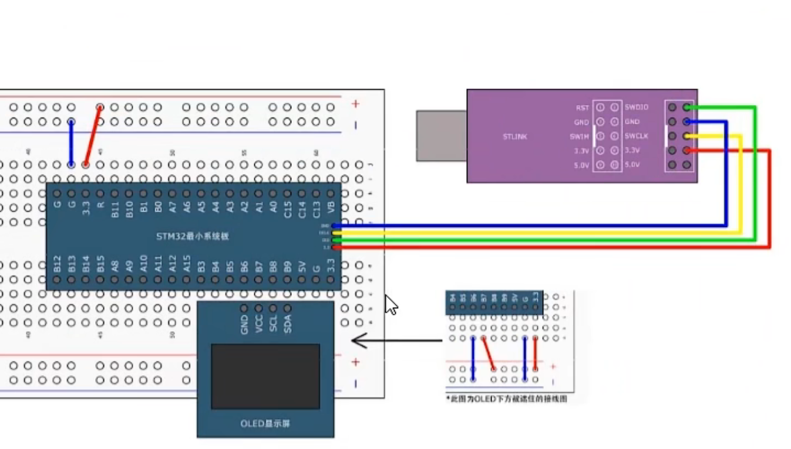
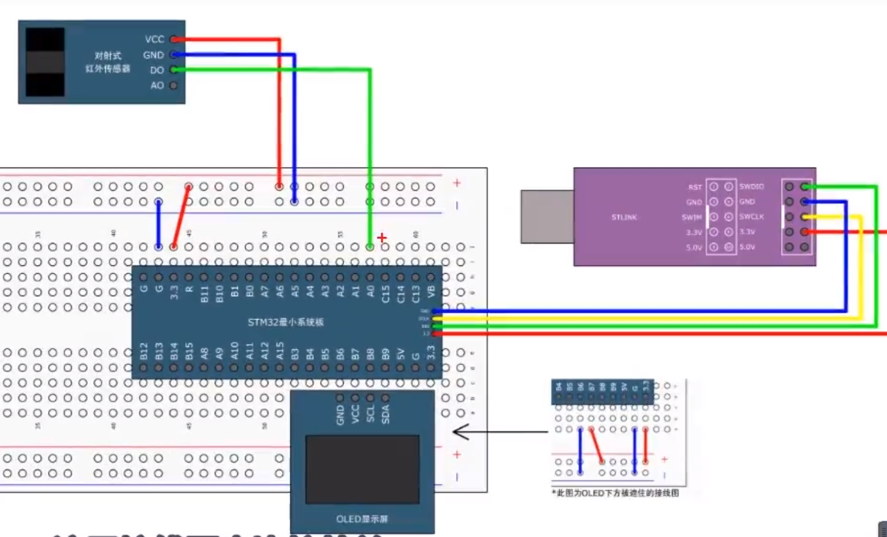

# 【6-2】定时中断&内外时钟源选择


## 定时器定时中断

### 接线图



### 程序部分

#### 定时器的初始化


照着这个步骤一步步打通就行

​	1.打开RCC定时器时钟，打开后，定时器的基准时钟和整个外设的工作时钟就都会同时打开了。

​	2.选择时基单元的时钟源

​			对于定时中断，我们就选择内部时钟源

​	3.配置时基单元，包括预分频器，自动重装器，计数模式等等（结构体配置）

​	4.配置输出中断控制，允许更新中断输出到NVIC

​	5.配置NVIC，在NVIC中打开定时器中断的通道，并分配一个优先级。

​	6.允许控制

​	整个模块配置完成后，我们还需要使能一下计数器。要不然计数器是不会运行的。当定时器使能后，计数器就会开始计数了，当计数器更新时，触发中断。

​	7.最后我们再写一个定时器的中断函数，这样这个中断函数就会每隔一段时间就能自动执行一次了。


#### 定时器的库函数

```c
void TIM_DeInit(TIM_TypeDef* TIMx);
//函数功能：恢复缺省配置
```

下面的这个函数用于时基单元

```c
void TIM_TimeBaseInit(TIM_TypeDef* TIMx, TIM_TimeBaseInitTypeDef* TIM_TimeBaseInitStruct);
//函数功能：时基单元初始化
//函数参数：1.TIMx选择某个定时器	2.结构体，包含配置的参数
//比较重要
```

```c
void TIM_TimeBaseStructInit(TIM_TimeBaseInitTypeDef* TIM_TimeBaseInitStruct);
//函数功能：可以把结构体变量赋一个默认值
```

下面这个函数用于运行控制

```c
void TIM_Cmd(TIM_TypeDef* TIMx, FunctionalState NewState);
//函数功能：使能计数器，对应图中运行控制
//函数参数：1.TIMx选择定时器	2.NewState新的状态，即是使能失能
```

下面的这个函数用于中断输出控制

```c
void TIM_ITConfig(TIM_TypeDef* TIMx, uint16_t TIM_IT, FunctionalState NewState);
//函数功能：使能中断输出信号，对应图中中断输出控制
//函数参数：1.TIMx选择定时器	2.TIM_IT选择要配置哪个中断输出	3.NEWState

//ITconfig函数：使能外设的中断输出
```


下面的6个函数对应图中时基单元的时钟选择部分，可以选择RCC内部时钟，ETR外部时钟，ITRx其他定时器，TLx捕获通道这些

```c
void TIM_InternalClockConfig(TIM_TypeDef* TIMx);
//函数功能：选择内部时钟
//函数参数：1.TIMx选择定时器
```

```c
void TIM_ITRxExternalClockConfig(TIM_TypeDef* TIMx, uint16_t TIM_InputTriggerSource);
//函数功能：选择ITRx其他定时器的时钟
//函数参数：1.TIMx选择定时器	2.InputTriggerSourse选择要接入哪个其他的定时器
```

```c
void TIM_TIxExternalClockConfig(TIM_TypeDef* TIMx, uint16_t TIM_TIxExternalCLKSource,uint16_t TIM_ICPolarity, uint16_t ICFilter);
//函数功能：TIM_TIxExternalClockConfig,选择TIx捕获通道的时钟
//函数参数：1.TImx	2.TIxExternalCLKSourse选择TIx具体的某个引脚	3.ICPolarity输入的极性	4.ICFiLter输入的滤波器
//对于外部引脚的波形，一般都会有极性选择和滤波器，这样更灵活一些
```

```c
void TIM_ETRClockMode1Config(TIM_TypeDef* TIMx, uint16_t TIM_ExtTRGPrescaler, uint16_t TIM_ExtTRGPolarity,uint16_t ExtTRGFilter);
//函数功能：选择ETR通过外部时钟模式1输入的时钟
//函数参数：1.TIMx	2.TIM_ExtTRGPrescaler外部触发预分频器	3.TIM_ExtTRGPolarity极性	4.ExtTRGFilter滤波器
```

```c
void TIM_ETRClockMode2Config(TIM_TypeDef* TIMx, uint16_t TIM_ExtTRGPrescaler, uint16_t TIM_ExtTRGPolarity, uint16_t ExtTRGFilter);
//函数功能：选择ETR通过外部时钟模式2输入的时钟
//函数参数：1.TIMx	2.TIM_ExtTRGPrescaler外部触发预分频器	3.TIM_ExtTRGPolarity极性	4.ExtTRGFilter滤波器
```

```c
void TIM_ETRConfig(TIM_TypeDef* TIMx, uint16_t TIM_ExtTRGPrescaler, uint16_t TIM_ExtTRGPolarity,uint16_t ExtTRGFilter);
//函数功能：这个不是用来选择时钟的，就是单独用来配置ETR引脚的预分频器，极性，滤波器这些参数的
```


下面再看一些相关函数，因为在初始化结构体里有很多关键的参数，比如自动重装值和预分频器值等等，这些参数可能会在初始化之后还需要更改，如果为了改某个参数还要再调用一次初始化函数就太麻烦了是吧，所以这里有一些单独的函数，可以方便地更改这些关键函数。

```c
void TIM_PrescalerConfig(TIM_TypeDef* TIMx, uint16_t Prescaler, uint16_t TIM_PSCReloadMode);
//函数功能：就是用来单独写预分频值的
//函数参数：1，TIMx	2.Prescaler要写入的预分配值	3.TIM_PSCReloadMode写入的模式
//上一小节说了预分频器有个缓冲器，写入的值是在更新事件发生之后才有效的，所以这个有个写入模式，可以选择是听从安排，在更新事件生效，或者是，在写入后，手动产生一个更新事件，让这个值立刻生效。
```

```c
void TIM_CounterModeConfig(TIM_TypeDef* TIMx, uint16_t TIM_CounterMode);
//函数功能：用来改变计数器的计数模式
//函数参数：1.TIMx	2.TIM_CounterMode选择新的计数器模式
```

```c
void TIM_ARRPreloadConfig(TIM_TypeDef* TIMx, FunctionalState NewState);
//函数功能：自动重装器预装功能配置
//有预装还是无预装，使能还是失能就行
```

```c
void TIM_SetCounter(TIM_TypeDef* TIMx, uint16_t Counter);
//函数功能：给计数器写入一个值
//如果你想手动给计数器写一个值，就可以用这个函数
```

```c
void TIM_SetAutoreload(TIM_TypeDef* TIMx, uint16_t Autoreload);
//函数功能：给自动重装器写入一个值
//如果你想给自动重装器写入一个自动重装值就用这个函数
```

```c
uint16_t TIM_GetCounter(TIM_TypeDef* TIMx);
//函数功能：获取当前计数器的值
//如果你想看当前计数器计到哪里了就可以调用这个函数，返回值就是当前的计数器的值
```

```c
uint16_t TIM_GetPrescaler(TIM_TypeDef* TIMx);
//函数功能：获取当前预分频器的值
//如果想看预分频器的值就可以调用这个函数
```


#### 代码

##### Timer.h

```c
#ifndef __TIMER__H
#define __TIMER__H

void Timer_Init(void);


#endif

```


##### Timer.c

```c
#include "stm32f10x.h"                  // Device header


//定时器的初始化
void Timer_Init(void)
{
	//RCC开启时钟
	//要使用APB1的开启时钟函数，因为TIM2是APB1总线的外设
	RCC_APB1PeriphClockCmd(RCC_APB1Periph_TIM2,ENABLE);
	
	//选择时基单元的时钟，这里选择内部时钟
	TIM_InternalClockConfig(TIM2);
	
	//配置结构体用于初始化时基单元
	TIM_TimeBaseInitTypeDef TIM_TimeBaseInitStruct;//创建结构体
	TIM_TimeBaseInitStruct.TIM_ClockDivision = TIM_CKD_DIV1;//配置滤波器分频参数，这里选择不分频由内部时钟分频
	TIM_TimeBaseInitStruct.TIM_CounterMode = TIM_CounterMode_Up;//选择计数模式，这里选择向上计数
	TIM_TimeBaseInitStruct.TIM_Period = 10000 - 1;//周期，就是ARR自动重装器的值
	TIM_TimeBaseInitStruct.TIM_Prescaler = 7200 - 1;//就是PSC预分频器的值
	//因为预分频器和计数器都有1一个数的偏差，所以这里要再减个1
	//注意PSC和ARR的取值都要在0-65535之间，不要超范围了。
	//这里我们预分频是对72M进行7200分频，得到的就是10k的计数频率，在10k的频率下，计10000个数，就是1s的时间
	//计算定时器定时时间的公式：CK_CNT_OV = CK_PSC / (PSC + 1) / (ARR + 1)，单位是频率，取倒数就是定时时间
	TIM_TimeBaseInitStruct.TIM_RepetitionCounter = 0;//就是重复计数器的值，是高级定时器才有的，这里不需要用给0就行
	//初始化时基单元
	TIM_TimeBaseInit(TIM2,&TIM_TimeBaseInitStruct); 
	
	//手动清除更新中断标志位，解决时基单元初始化时就主动产生一次事件运行了一次中断函数的问题
	TIM_ClearFlag(TIM2,TIM_FLAG_Update);
	
	//使能更新中断,这样就开启了更新中断到NVIC的通路
	TIM_ITConfig(TIM2,TIM_IT_Update,ENABLE);
	
	//初始化NVIC：
	//NVIC优先级分组
	NVIC_PriorityGroupConfig(NVIC_PriorityGroup_2);
	
	NVIC_InitTypeDef NVIC_InitStructure;//定义结构体
	NVIC_InitStructure.NVIC_IRQChannel = TIM2_IRQn;//中断通道
	NVIC_InitStructure.NVIC_IRQChannelCmd = ENABLE;//使能
	NVIC_InitStructure.NVIC_IRQChannelPreemptionPriority = 2;//抢占优先级
	NVIC_InitStructure.NVIC_IRQChannelSubPriority = 1;//响应优先级
	NVIC_Init(&NVIC_InitStructure);
	
	//启动定时器
	TIM_Cmd(TIM2,ENABLE);
	
}	
/*
//定时器函数
void TIM2_IRQHandler(void)
{
	//检查标志位
	if(TIM_GetITStatus(TIM2,TIM_IT_Update) == SET)
	{
		//清除标志位
		TIM_ClearITPendingBit(TIM2,TIM_IT_Update);
	}
}
*/

```


##### main.c

```c
#include "stm32f10x.h"                  // Device header
#include "Delay.h"
#include "OLED.h"
#include "Timer.h"

int16_t Num;

//定时器函数
void TIM2_IRQHandler(void)
{
	//检查标志位
	if(TIM_GetITStatus(TIM2,TIM_IT_Update) == SET)
	{
		Num++;
		//清除标志位
		TIM_ClearITPendingBit(TIM2,TIM_IT_Update);
	}
}


int main(void)
{
	/*模块初始化*/
	OLED_Init();		//OLED初始化
	Timer_Init();
	OLED_ShowString(1, 1, "Num");
	while (1)
	{
		OLED_ShowNum(1,5,Num,5);
		OLED_ShowNum(2,5,TIM_GetCounter(TIM2),5);//查看计数器的值
		
	}
}

```


## 定时器外部时钟

### 接线图



​	对射式红外传感器的DO脚接到了PA0引脚：

​			**PA0引脚就是TIM2的ETR引脚**


### 程序部分

#### Timer.h

```c
#ifndef __TIMER__H
#define __TIMER__H

void Timer_Init(void);
uint16_t TImer_GetCount(void);

#endif

```


#### Timer.c

```c
#include "stm32f10x.h"                  // Device header


//定时器的初始化
void Timer_Init(void)
{
	//RCC开启时钟
	//要使用APB1的开启时钟函数，因为TIM2是APB1总线的外设
	RCC_APB1PeriphClockCmd(RCC_APB1Periph_TIM2,ENABLE);
	
	//配置GPIO口，因为是用外部时钟，而外部时钟是用到PA0口连接
	RCC_APB2PeriphClockCmd(RCC_APB2Periph_GPIOA,ENABLE);//开启时钟
	
	GPIO_InitTypeDef GPIO_InitStructrue;//定义结构体
	GPIO_InitStructrue.GPIO_Mode = GPIO_Mode_IPU;
	GPIO_InitStructrue.GPIO_Pin = GPIO_Pin_0;
	GPIO_InitStructrue.GPIO_Speed = GPIO_Speed_50MHz;
	GPIO_Init(GPIOA,&GPIO_InitStructrue);
	
	
	
	//选择时基单元的时钟，这里选择外部时钟
	TIM_ETRClockMode2Config(TIM2,TIM_ExtTRGPSC_OFF,TIM_ExtTRGPolarity_NonInverted,0x00);
	
	//配置结构体用于初始化时基单元
	TIM_TimeBaseInitTypeDef TIM_TimeBaseInitStruct;//创建结构体
	TIM_TimeBaseInitStruct.TIM_ClockDivision = TIM_CKD_DIV1;//配置滤波器分频参数，这里选择不分频由内部时钟分频
	TIM_TimeBaseInitStruct.TIM_CounterMode = TIM_CounterMode_Up;//选择计数模式，这里选择向上计数
	TIM_TimeBaseInitStruct.TIM_Period = 10 - 1;//周期，就是ARR自动重装器的值
	TIM_TimeBaseInitStruct.TIM_Prescaler = 1 - 1;//就是PSC预分频器的值
	//因为预分频器和计数器都有1一个数的偏差，所以这里要再减个1
	//注意PSC和ARR的取值都要在0-65535之间，不要超范围了。
	//这里我们预分频是对72M进行7200分频，得到的就是10k的计数频率，在10k的频率下，计10000个数，就是1s的时间
	//计算定时器定时时间的公式：CK_CNT_OV = CK_PSC / (PSC + 1) / (ARR + 1)，单位是频率，取倒数就是定时时间
	TIM_TimeBaseInitStruct.TIM_RepetitionCounter = 0;//就是重复计数器的值，是高级定时器才有的，这里不需要用给0就行
	//初始化时基单元
	TIM_TimeBaseInit(TIM2,&TIM_TimeBaseInitStruct); 
	
	//手动清除更新中断标志位，解决时基单元初始化时就主动产生一次事件运行了一次中断函数的问题
	TIM_ClearFlag(TIM2,TIM_FLAG_Update);
	
	//使能更新中断,这样就开启了更新中断到NVIC的通路
	TIM_ITConfig(TIM2,TIM_IT_Update,ENABLE);
	
	//初始化NVIC：
	//NVIC优先级分组
	NVIC_PriorityGroupConfig(NVIC_PriorityGroup_2);
	
	NVIC_InitTypeDef NVIC_InitStructure;//定义结构体
	NVIC_InitStructure.NVIC_IRQChannel = TIM2_IRQn;//中断通道
	NVIC_InitStructure.NVIC_IRQChannelCmd = ENABLE;//使能
	NVIC_InitStructure.NVIC_IRQChannelPreemptionPriority = 2;//抢占优先级
	NVIC_InitStructure.NVIC_IRQChannelSubPriority = 1;//响应优先级
	NVIC_Init(&NVIC_InitStructure);
	
	//启动定时器
	TIM_Cmd(TIM2,ENABLE);
	
}	

//用于查看CNT计数的值
uint16_t TImer_GetCount(void)
{
	return TIM_GetCounter(TIM2);
}


/*
//定时器函数
void TIM2_IRQHandler(void)
{
	//检查标志位
	if(TIM_GetITStatus(TIM2,TIM_IT_Update) == SET)
	{
		//清除标志位
		TIM_ClearITPendingBit(TIM2,TIM_IT_Update);
	}
}
*/

```


#### main.c

```c
#include "stm32f10x.h"                  // Device header
#include "Delay.h"
#include "OLED.h"
#include "Timer.h"

int16_t Num;

//定时器函数
void TIM2_IRQHandler(void)
{
	//检查标志位
	if(TIM_GetITStatus(TIM2,TIM_IT_Update) == SET)
	{
		Num++;
		//清除标志位
		TIM_ClearITPendingBit(TIM2,TIM_IT_Update);
	}
}


int main(void)
{
	/*模块初始化*/
	OLED_Init();		//OLED初始化
	Timer_Init();
	OLED_ShowString(1, 1, "Num");
	OLED_ShowString(2, 1, "CNT");
	while (1)
	{
		OLED_ShowNum(1,5,Num,5);
		OLED_ShowNum(2,5,TImer_GetCount(),5);//查看计数器的值
		
	}
}

```


