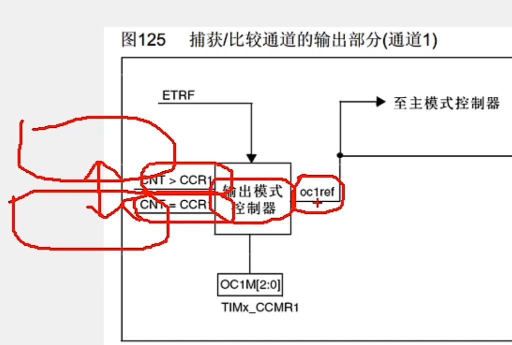
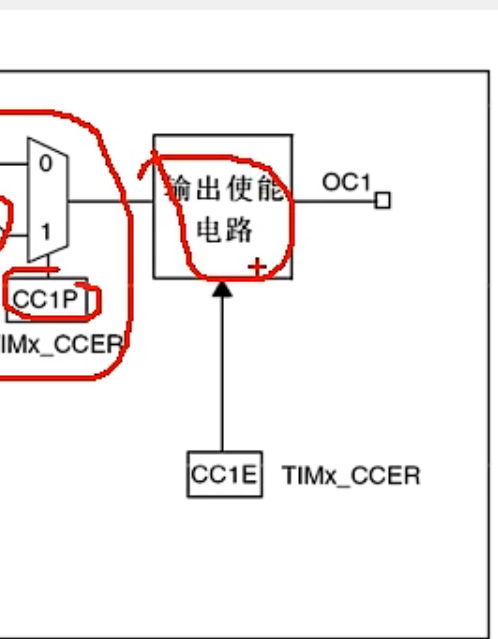
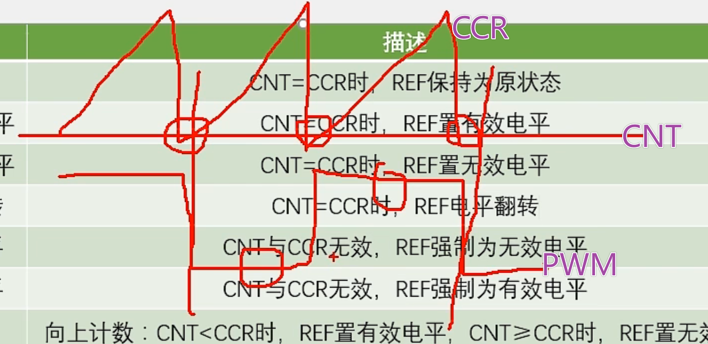
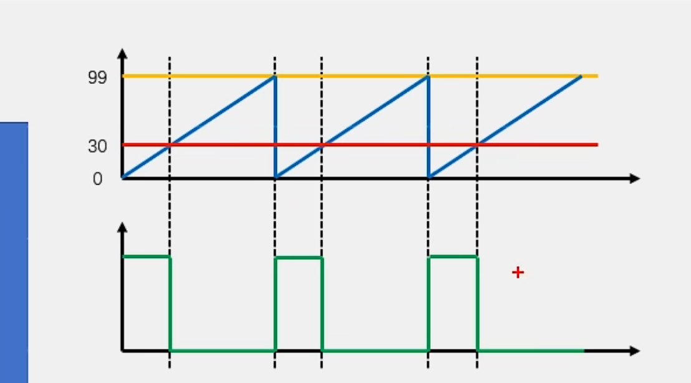
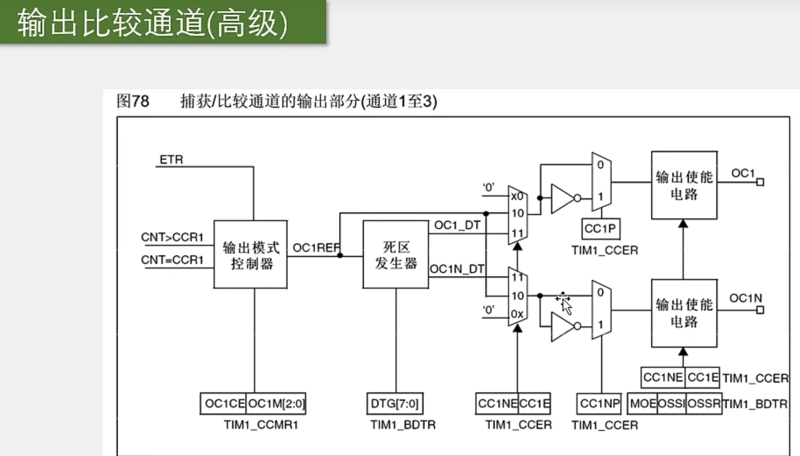
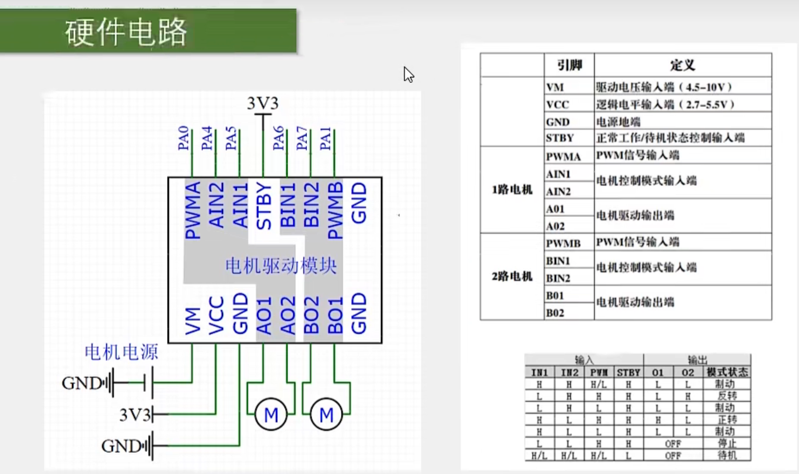

# 【6-3】TIM输出比较

​		**比较重要的，因为它主要是用来输出PWM波形的，而PWM波形又是驱动电机的必要条件，所以如果想用STM32做一些有电机的项目，比如智能车，机器人等，那这个输出比较功能就要好好学了**

## TIM相关函数

```c
void TIM_OC1Init(TIM_TypeDef* TIMx, TIM_OCInitTypeDef* TIM_OCInitStruct);
void TIM_OC2Init(TIM_TypeDef* TIMx, TIM_OCInitTypeDef* TIM_OCInitStruct);
void TIM_OC3Init(TIM_TypeDef* TIMx, TIM_OCInitTypeDef* TIM_OCInitStruct);
void TIM_OC4Init(TIM_TypeDef* TIMx, TIM_OCInitTypeDef* TIM_OCInitStruct);

//函数功能：配置输出比较模块。
//OC1-4，一个函数配置一个单元
//函数参数：1.TIMx	选择定时器	2.	结构体：输出比较的参数
```

```c
void TIM_OCStructInit(TIM_OCInitTypeDef* TIM_OCInitStruct);
//函数功能：用来给输出比较结构体赋一个默认值的
```

```c
void TIM_ForcedOC1Config(TIM_TypeDef* TIMx, uint16_t TIM_ForcedAction);
void TIM_ForcedOC2Config(TIM_TypeDef* TIMx, uint16_t TIM_ForcedAction);
void TIM_ForcedOC3Config(TIM_TypeDef* TIMx, uint16_t TIM_ForcedAction);
void TIM_ForcedOC4Config(TIM_TypeDef* TIMx, uint16_t TIM_ForcedAction);

//函数功能：用来配置强制输出模式的，如果你在运行中想要暂停输出波形并且强制输出高或低电平，可以用一下这个函数
```

```c
void TIM_OC1PreloadConfig(TIM_TypeDef* TIMx, uint16_t TIM_OCPreload);
void TIM_OC2PreloadConfig(TIM_TypeDef* TIMx, uint16_t TIM_OCPreload);
void TIM_OC3PreloadConfig(TIM_TypeDef* TIMx, uint16_t TIM_OCPreload);
void TIM_OC4PreloadConfig(TIM_TypeDef* TIMx, uint16_t TIM_OCPreload);

//函数功能：用来配置CCR寄存器的预装功能，这个预装功能，就是影子寄存器，之前介绍过就是立马生效还是下一更新事件生效。
```

```c
void TIM_OC1FastConfig(TIM_TypeDef* TIMx, uint16_t TIM_OCFast);
void TIM_OC2FastConfig(TIM_TypeDef* TIMx, uint16_t TIM_OCFast);
void TIM_OC3FastConfig(TIM_TypeDef* TIMx, uint16_t TIM_OCFast);
void TIM_OC4FastConfig(TIM_TypeDef* TIMx, uint16_t TIM_OCFast);
//函数功能：用来配置快速使能的，这个功能手册里，单脉冲模式，那一节有一小段介绍，用的不多，不需要掌握。
```

```c
void TIM_ClearOC1Ref(TIM_TypeDef* TIMx, uint16_t TIM_OCClear);
void TIM_ClearOC2Ref(TIM_TypeDef* TIMx, uint16_t TIM_OCClear);
void TIM_ClearOC3Ref(TIM_TypeDef* TIMx, uint16_t TIM_OCClear);
void TIM_ClearOC4Ref(TIM_TypeDef* TIMx, uint16_t TIM_OCClear);
//函数功能：外部事件时清除REF信号，也不需要掌握
```

```c
void TIM_OC1PolarityConfig(TIM_TypeDef* TIMx, uint16_t TIM_OCPolarity);
void TIM_OC1NPolarityConfig(TIM_TypeDef* TIMx, uint16_t TIM_OCNPolarity);
void TIM_OC2PolarityConfig(TIM_TypeDef* TIMx, uint16_t TIM_OCPolarity);
void TIM_OC2NPolarityConfig(TIM_TypeDef* TIMx, uint16_t TIM_OCNPolarity);
void TIM_OC3PolarityConfig(TIM_TypeDef* TIMx, uint16_t TIM_OCPolarity);
void TIM_OC3NPolarityConfig(TIM_TypeDef* TIMx, uint16_t TIM_OCNPolarity);
void TIM_OC4PolarityConfig(TIM_TypeDef* TIMx, uint16_t TIM_OCPolarity);

//这些就是用来单独设置输出比较的极性的，带个N的就是高级定时器里互补通道的配置，OC4没有互补通道，所以就没有OC4N的函数 
```

```c
void TIM_CCxCmd(TIM_TypeDef* TIMx, uint16_t TIM_Channel, uint16_t TIM_CCx);
void TIM_CCxNCmd(TIM_TypeDef* TIMx, uint16_t TIM_Channel, uint16_t TIM_CCxN);
//函数功能：用来单独修改输出使能参数的
```

```c
void TIM_SelectOCxM(TIM_TypeDef* TIMx, uint16_t TIM_Channel, uint16_t TIM_OCMode);
//函数功能：用来单独更改输出比较模式的函数
```

```c
void TIM_SetCompare1(TIM_TypeDef* TIMx, uint16_t Compare1);
void TIM_SetCompare2(TIM_TypeDef* TIMx, uint16_t Compare2);
void TIM_SetCompare3(TIM_TypeDef* TIMx, uint16_t Compare3);
void TIM_SetCompare4(TIM_TypeDef* TIMx, uint16_t Compare4);

//函数功能：用来单独更改CCR寄存器值得函数。
//这四个函数比较重要，我们在运行得时候，更改占空比，就需要用到这四个函数。
```


## 输出比较

### 介绍


​	OC：输出比较，另外还有IC(Input Capture)意为输入捕获。还有 CC(Capture/Compare),一般表示的是输入捕获和输出比较的单元。


​	输出比较：就是用来输出PWM波形的。那什么是PWM波形呢？

### PWM波形


​	使用这个PWM波形，是用来等效地实现以一个模拟信号的输出。

​	例如：LED呼吸灯的效果：

​						我们让LED不断点亮、熄灭、点亮、熄灭。当这个点亮熄灭的频率足够大时，LED就不会闪烁了，而是呈现出一个中等亮度，当我们调控这个点亮和熄灭的时间比例时，就能让LED呈现出不同的亮度级别。

​		对于电机调速也是一样，我们以一个很快的频率，给电机通电、断电、通电、断电，那么电机的速度就能够维持在一个中等速度。这就是PWM的基本思想，看起来也是一个挺简单的方法是吧。


**PWM的秘诀就是：天下武功，唯快不破！**

​		只要我闪的足够快，你就是发现不了我到底是在闪着亮的还是以一个正常的平稳的亮度。


**当然，PWM的应用场景必须要是一个惯性系统**

​		就是说LED在熄灭的时候，由于余晖和人眼视觉暂留现象，LED不会立马熄灭，而是具有一定的惯性，过一小段时间才会熄灭，电机也是，当电机断电时，电机的转动不会立马停止，而是有一定的惯性，过一会才会停。**这样具有惯性的系统，才能使用PWM。**


在使用PWM时，会有几个**重要的参数**：

​	1.频率，它等于1/Ts，Ts就是由下图，代表一个高低电平变换周期的时间。周期的倒数就是频率嘛。PWM的频率越快，那它等效的模拟信号就越平稳，不过同时性能开销就越大。一般来说PWM的频率都在几十k到几十kHz，这个频率就已经足够快了。

​	2.占空比，它等于Ton/Ts，Ton是这里高电平的时间，Ts是一个周期的时间，那Ton/Ts就是高电平时间相当于整个周期时间的比例，一般用百分比来表示。比如占空比为50%，那就是高低电平时间相等的方波。**占空比越大，那等效的模拟电压就越趋近于高电平；占空比越小，那等效的模拟电压就越趋近于低电平。**这个等效关系一般来说是线性的，比如高电平是5v，低电平是0v，那50%占空比就是等效于中间电压，就是2.5v。

​	3.分辨率，它等于占空比变化步距。比如有的占空比只能是1%、2%、3%等这样的以1%的步距跳变，那它的分辨率就是1%，如果可以1.1%、1.2%、1.3%等等这样以0.1%的步距跳变，那它的分辨率就是0.1%。所以这个**分辨率就是占空比变化的精细程度。**这个分辨率需要多高，就得看你实际项目的需求了，如果你既要高频率，又要高分辨率，这就对硬件电路有比较高的要求了，不过一般要求不高的话，1%的分辨率就也已经足够使用了。


那么，定时器的输出比较模块是怎么来输出PWM波形的呢？

### 输出比较通道(通用)


该部分电路对应通用定时器中的：

&lt;img src="./assets/image-20231203161317555.png" alt="image-20231203161317555" style="zoom:66%;" /&gt;




​		左边就是CNT计数器和CCR1第一路的捕获/比较寄存器，他俩进行比较，当CNT&gt;CCR1，或者CNT=CCR1时，就会给这个输出模式控制器传一个信号，然后输出模式控制器就会改变它输出OC1REF的高低电平。(REF信号实际上就是指这里信号的高低电平，REF是reference的缩写，意思是参考信号)。

​		然后上面这里还有一个ETRF输入，这是定时器的一个小功能，一般不用，不需要了解。


接着这个REF信号可以前往主模式控制器，你可以把这个REF映射到主模式的TRGO输出上去，不过REF的主要去向还是下面这一路：

通过下面这一路到达这里，这是一个极性选择：

​		给这个寄存器写0，信号就会往上走，就是信号电平不翻转，进来啥样，出去还是啥样。

​		给这个寄存器写1，信号就会往下走，就是信号通过一个非门取反，那输出的信号就是输入信号高低电平的反转信号。

这就是极性选择，就是选择是不是要把高低电平反转一下。




那接下来就是输出使能电路了，选择要不要输出，最后就是OC1引脚，这个引脚就是CH1通道的引脚，在引脚定义表里就可以知道具体是哪个GPIO口了。


那现在输出的通路我们就知道了，接下来我们还需要看一下这个输出模式控制器，它具体是怎么工作的，什么时候给REF高电平，什么时候给REF低电平。


这个模式控制器输入是CNT和CCR的大小关系，输出是REF的高低电平。里面可以选择种模式来更加灵活地控制ERF输出。这个模式可以通过接在模式控制器下面地寄存器来进行配置，你需要哪个模式就可以选哪个模式。


​	模式1：冻结，描述是CNT=CCR时，REF保持为原状态，那其实这个CNT和CCR根本就没有用是吧，所以可以把它理解成CNT和CCR无效，REF保持原来的状态。这个模式也比较简单，它根本不管CNT谁大谁小，直接REF保持不变，维持上一个状态就行了。

​					这有什么用呢？比如你正在输出PWM波，突然想暂停一会儿输出，就可以设置成这个模式。一旦切换为冻结模式后，输出就暂停了，并且高低电平也维持为暂停时刻的状态，保持不变。这就是冻结模式的作用。

​	模式2-4：匹配时置有效电平，匹配时置无效电平，匹配时电平翻转。

​				这个有效电平和无效电平，一般是高级定时器里面的一个说法，是和关断，刹车这些功能配合表述的，它说的比较严谨，所以叫有效电平和无效电平，在这里为了理解方便，你可以直接认为置有效电平就是置高电平，置无效电平就是置低电平，这样就行了。

​					那这三个模式都是当CNT与CCR值相等时，执行操作。

​		模式2：CNT=CCR时，REF置有效电平，也就是高电平。

​		模式3：CNT=CCR时，REF置无效电平，也就是低电平。

​		模式4：CNT=CCR时，REF电平翻转。

这些模式就可以用做波形输出了，比如相等时电平翻转这个模式，这个可以方便地输出一个频率可调，占空比始终为50%地PWM波形。比如你设置成CCR为0，那CNT每次更新清0时，就会产生一次CNT=CCR的事件。这就会导致输出电平翻转一次，每更新两次，输出为一个周期。并且高电平和低电平的时间始终是相等的，也就是占空比始终为50%，当你改变定时器更新频率时，输出波形的频率也会随之改变。他俩的关系是：输出波形的频率=更新频率/2，因为更新两次输出才为一个周期对吧。这就是这个匹配时电平翻转的用途。



那上面这两个相等时置高电平和低电平，感觉用途并不是很大，因为它们都是一次性的，置完高或低电平后，就不管事了。所以这俩模式不适合输出连续变化的波形，如果你想定时输出一个一次性的信号，那可以考虑一下这两个模式。


然后继续看下面这里的两个模式：强制为无效电平和强制为有效电平。


这两个模式是CNT与CCR无效，REF强制为无效电平或者强制为有效电平。这里这两个模式和冻结模式也差不多。如果你想暂停波形输出，并且在暂停期间保持低电平或者高电平，那么就可以设置这两个强制输出模式。


接下里看一下最后两个模式，PWM模式1和PWM模式2.


**这俩模式就非常重要了**

它们可以用于输出频率和占空比都可调的PWM波形 ，也是我们主要使用的模式。

​	在PWM模式1，这个情况比较多，一般我们都只使用向上计数，所以这里向下计数的描述我们就暂时不看了，它们之间也只有大小关系、极性这些东西不同，基本思路都是一样的。我们着重分析一个向上计数的就可以了。

​	在PWM模式2下，经过观察可以发现，它的大小比较关系和上面模式1时一样的，区别就是输出的高低电平反过来了，所以PWM模式2实际上就是PWM模式1输出的取反。改变PWM模式1和PWM模式2，就只是改变了REF电平的极性而已。


在此只使用PWM模式1的向上计数即可。

那么在这种模式下是怎么输出频率和占空比都可调的PWM波形的呢？


### PWM基本结构


**本节课的重点内容**

下面是对该图的介绍：


&lt;img src="./assets/image-20231203184827110.png" alt="image-20231203184827110" style="zoom:50%;" /&gt;

首先左上角这里，是时基单元和运行控制部分，再左边是时钟源选择，这里忽略了。这些都是上一小节的内容，在这里还需要继续使用。只不过是这里更新事件的中断申请，我们不再需要了。输出PWM暂时还不需要中断。

​	配置好了时基单元，这里的CNT就可以开始不断地自增运行了。


然后看下面这里，就是输出比较单元了，总共有4路


输出比较单元的最开始，是CCR捕获/比较寄存器。CCR是我们自己设定的，CNT不断自增运行，同时它俩还在不断进行比较。

后面这个就是输出模式控制器，在这里就以PWM模式1为例子来讲解：

​		这里面是PWM模式1的执行逻辑。那它是怎么输出PWM波形的呢？我们看一下右上角的这个图：



这里蓝色线是CNT的值，黄色线是ARR的值，蓝色线从0开始自增，一直增到ARR，也就是99，之后清0继续自增。在这个过程中，我们再设置一条红色线，这条红色线就是CCR，比如我们设置CCR为30，之后再执行PWM模式1的逻辑，下面这里的绿色线就是输出，可以看到，在0-30这块，CNT&lt;CCR，所以置高电平，之后，CNT就&gt;=CCR了，所以就变为低电平了。当CNT溢出清0后，CNT又小于CCR，所以置高电平。这样一直持续下去，REF的电平就会不断发生变化，

​		并且，它的占空比是受RCC值得调控的。**如果CCR设置高一些，输出的占空比就变大，CCR设置的低一些，输出的占空比就变小。**

​	下面这里REF，就是一个频率可调，占空比也可调的PWM波形，最后再经过极性选择，输出使能，最终通向GPIO口，这样就能完成PWM波形的输出了。


### PWM参数计算


​	1.PWM频率：PWM的一个周期始终对应着计数器的一个溢出更新周期，所以PWM的频率就等于计数器的更新频率。

​	右边的式子CK_PSC/(PSC+1)/(ARR+1)就是计数器的更新频率公式。

&lt;img src="./assets/image-20231204171717721.png" alt="image-20231204171717721" style="zoom:50%;" /&gt;

​	2.PWM占空比：Duty = CCR/（ARR+1）

​	3.PWM分辨率：Reso = 1/（ARR+1）


### 输出比较电路(高级)



​	了解即可，不需要掌握。


## PWM程序编写

#### PWM相关函数

```c
void TIM_OC1Init(TIM_TypeDef* TIMx, TIM_OCInitTypeDef* TIM_OCInitStruct);
void TIM_OC2Init(TIM_TypeDef* TIMx, TIM_OCInitTypeDef* TIM_OCInitStruct);
void TIM_OC3Init(TIM_TypeDef* TIMx, TIM_OCInitTypeDef* TIM_OCInitStruct);
void TIM_OC4Init(TIM_TypeDef* TIMx, TIM_OCInitTypeDef* TIM_OCInitStruct);

//函数功能：配置输出比较模块。
//OC1-4，一个函数配置一个单元
//函数参数：1.TIMx	选择定时器	2.	结构体：输出比较的参数
```

```c
void TIM_OCStructInit(TIM_OCInitTypeDef* TIM_OCInitStruct);
//函数功能：用来给输出比较结构体赋一个默认值的
```

```c
void TIM_ForcedOC1Config(TIM_TypeDef* TIMx, uint16_t TIM_ForcedAction);
void TIM_ForcedOC2Config(TIM_TypeDef* TIMx, uint16_t TIM_ForcedAction);
void TIM_ForcedOC3Config(TIM_TypeDef* TIMx, uint16_t TIM_ForcedAction);
void TIM_ForcedOC4Config(TIM_TypeDef* TIMx, uint16_t TIM_ForcedAction);

//函数功能：用来配置强制输出模式的，如果你在运行中想要暂停输出波形并且强制输出高或低电平，可以用一下这个函数
```

```c
void TIM_OC1PreloadConfig(TIM_TypeDef* TIMx, uint16_t TIM_OCPreload);
void TIM_OC2PreloadConfig(TIM_TypeDef* TIMx, uint16_t TIM_OCPreload);
void TIM_OC3PreloadConfig(TIM_TypeDef* TIMx, uint16_t TIM_OCPreload);
void TIM_OC4PreloadConfig(TIM_TypeDef* TIMx, uint16_t TIM_OCPreload);

//函数功能：用来配置CCR寄存器的预装功能，这个预装功能，就是影子寄存器，之前介绍过就是立马生效还是下一更新事件生效。
```

```c
void TIM_OC1FastConfig(TIM_TypeDef* TIMx, uint16_t TIM_OCFast);
void TIM_OC2FastConfig(TIM_TypeDef* TIMx, uint16_t TIM_OCFast);
void TIM_OC3FastConfig(TIM_TypeDef* TIMx, uint16_t TIM_OCFast);
void TIM_OC4FastConfig(TIM_TypeDef* TIMx, uint16_t TIM_OCFast);
//函数功能：用来配置快速使能的，这个功能手册里，单脉冲模式，那一节有一小段介绍，用的不多，不需要掌握。
```

```c
void TIM_ClearOC1Ref(TIM_TypeDef* TIMx, uint16_t TIM_OCClear);
void TIM_ClearOC2Ref(TIM_TypeDef* TIMx, uint16_t TIM_OCClear);
void TIM_ClearOC3Ref(TIM_TypeDef* TIMx, uint16_t TIM_OCClear);
void TIM_ClearOC4Ref(TIM_TypeDef* TIMx, uint16_t TIM_OCClear);
//函数功能：外部事件时清除REF信号，也不需要掌握
```

```c
void TIM_OC1PolarityConfig(TIM_TypeDef* TIMx, uint16_t TIM_OCPolarity);
void TIM_OC1NPolarityConfig(TIM_TypeDef* TIMx, uint16_t TIM_OCNPolarity);
void TIM_OC2PolarityConfig(TIM_TypeDef* TIMx, uint16_t TIM_OCPolarity);
void TIM_OC2NPolarityConfig(TIM_TypeDef* TIMx, uint16_t TIM_OCNPolarity);
void TIM_OC3PolarityConfig(TIM_TypeDef* TIMx, uint16_t TIM_OCPolarity);
void TIM_OC3NPolarityConfig(TIM_TypeDef* TIMx, uint16_t TIM_OCNPolarity);
void TIM_OC4PolarityConfig(TIM_TypeDef* TIMx, uint16_t TIM_OCPolarity);

//这些就是用来单独设置输出比较的极性的，带个N的就是高级定时器里互补通道的配置，OC4没有互补通道，所以就没有OC4N的函数 
```

```c
void TIM_CCxCmd(TIM_TypeDef* TIMx, uint16_t TIM_Channel, uint16_t TIM_CCx);
void TIM_CCxNCmd(TIM_TypeDef* TIMx, uint16_t TIM_Channel, uint16_t TIM_CCxN);
//函数功能：用来单独修改输出使能参数的
```

```c
void TIM_SelectOCxM(TIM_TypeDef* TIMx, uint16_t TIM_Channel, uint16_t TIM_OCMode);
//函数功能：用来单独更改输出比较模式的函数
```

```c
void TIM_SetCompare1(TIM_TypeDef* TIMx, uint16_t Compare1);
void TIM_SetCompare2(TIM_TypeDef* TIMx, uint16_t Compare2);
void TIM_SetCompare3(TIM_TypeDef* TIMx, uint16_t Compare3);
void TIM_SetCompare4(TIM_TypeDef* TIMx, uint16_t Compare4);

//函数功能：用来单独更改CCR寄存器值的函数。
//这四个函数比较重要，我们在运行得时候，更改占空比，就需要用到这四个函数。
```


#### PWM初始化


根据上面的PWM图进行PWM的初始化。

**具体步骤：**

​	1.RCC开启时钟，把我们要用的TIM外设和GPIO外设的时钟打开。

​	2.配置时基单元，包括这前面的时钟源选择。

​	3.配置输出比较单元，里面包括CCR的值，输出比较模式，极性选择，输出使能这些参数。

​	4.配置GPIO，把PWM对应的GPIO口，初始化为复用推挽输出的配置。

​	（这个PWM和GPIO的对应关系是怎样的呢？可以参考一下GPIO引脚定义表。）

​	5.运行控制，启动计数器，这样就能输出PWM了。


## 舵机

#### 介绍


​	SG90

**输入一个PWM波形，输出轴固定在一个角度。**

这里，PWM波形其实是当作一个通信协议来使用的，跟之前提到的用PWM等效一个模拟输出，关系不大。


#### 硬件电路


### 直流电机

#### 介绍


​	就是马达。


​	下面是驱动芯片TB6612的硬件电路：
#### 硬件电路




