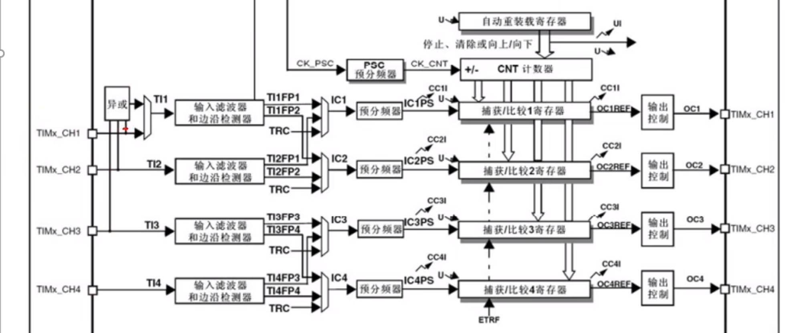
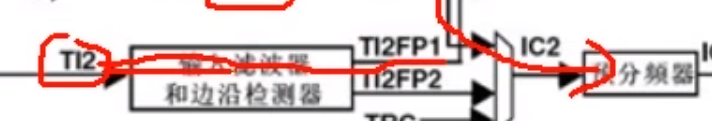
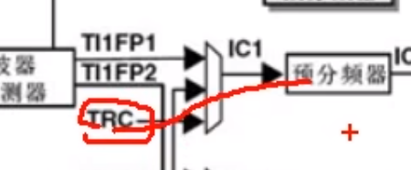
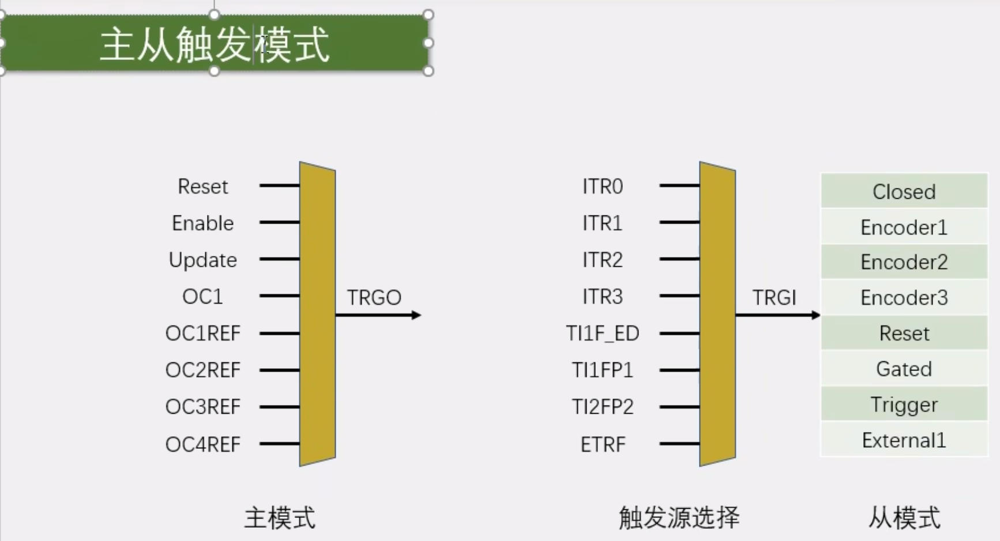
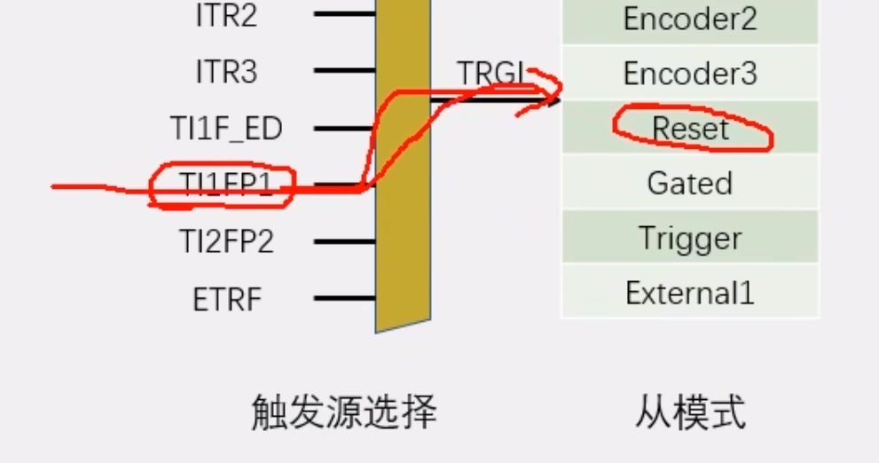
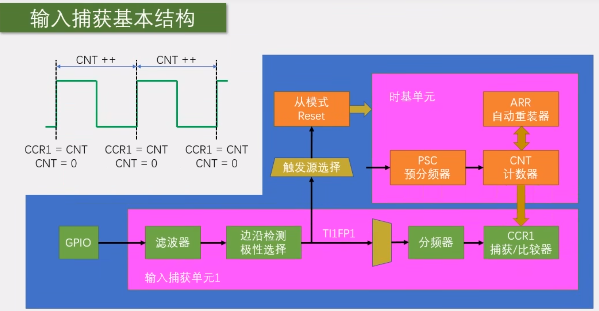
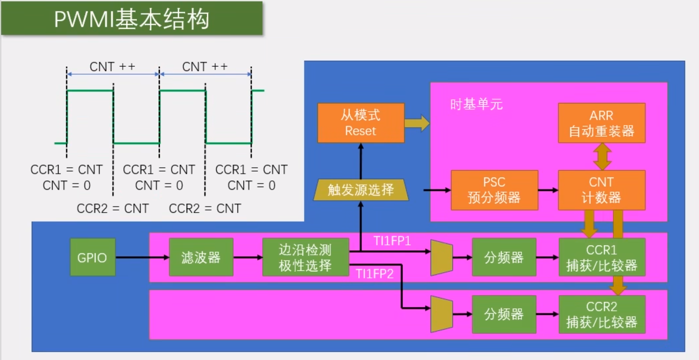

# 【6-5】TIM输入捕获

## 概念

功能:就是输入引脚电平跳变的瞬间,把CNT的值写入到CCR中

**输入捕获和输出比较的区别**

​	输出比较,引脚是输出端口;

​	输入捕获,引脚是输入端口;

​	输出比较,是根据CNT和CCR大小关系来执行输出动作;

​	输入捕获,是接收到输入信号,执行CNT锁存到CCR的动作;

PS:

​	脉冲间隔:实际上和频率是差不多的意思

​	电平持续时间:和占空比差不多

测量这两个功能结合起来,测量频率占空比就是硬件全自动执行,软件不需要进行任何干预,也不需要进中断,需要测量的时候,直接读取CCR寄存器就行了,极大地减轻了软件的压力.

## 频率测量

​	1.STM32只能测量数字信号的频率.如果你想测量一个正弦波,那还需要搭建一个信号预处理电路.最简单的就是用运放搭一个比较器,把正弦波转换为数字信号,然后再输入给STM32就行了.如果你测的信号电压非常高,那还需要考虑一下隔离的问题,比如用隔离放大器等元件,隔离高压端和低压端,保证安全.

&lt;img src="./assets/image-20240204200958525.png" alt="image-20240204200958525" style="zoom:33%;" /&gt;

​	2.测频法和测周法都是测量频率的好方法,那么如何选择呢?

​			首先:测频法适合测量高频信号,测周法适合测量低频信号.

​		那么,多高频率算高,多低频率算低呢?

​			中界频率:测频法与测周法误差相等的频率点.

​					当待测信号频率小于中界频率时,测周法误差更小,选用测周法更合适.

​					当待测信号频率大于中界频率时,测频法误差更小,选用测频法更合适.

### 测频法

​	我们用之前学过的外设就可以实现:

​		对射式红外传感器计次,定时器外部时钟,这些代码,稍加改进就是测频法.

​				比如说:

​							对射式红外传感器计次,每来一个上升沿计次+1,那我们再用一个定时器,定1s的定时中断,在中断里,每隔1s取一下计次值,同时清0计次,为下一次做准备.这样每次读取的计次值就直接时频率.

## 测周法

### 输入捕获电路

**Part1**

&lt;img src="./assets/image-20240204202636877.png" alt="image-20240204202636877" style="zoom:25%;" /&gt;

最左边,是四个通道的引脚,参考引脚定义表,就能知道这个引脚是复用在了哪个位置.

&lt;img src="./assets/image-20240204202817712.png" alt="image-20240204202817712" style="zoom:50%;" /&gt;

然后引脚进来.这里有个三输入的异或门.这个异或门的输入接在了通道123端口,异或门的执行逻辑:当三个输入引脚的任何一个有电平翻转时,输出引脚就产生一次电平翻转.之后输出通过数据选择器,到达输入捕获通道1

&lt;img src="./assets/image-20240204203030370.png" alt="image-20240204203030370" style="zoom:50%;" /&gt;

数据选择器如果选择上面一个,那输入捕获通道1的输入,就是三个引脚的异或值.如果选择下面一个,那异或门就没有用,4个通道各用各的引脚.

**异或门总结:相同出0,不同出1**

设计这个异或门,其实还是为三项无刷电机服务的.无刷电机有3个霍尔传感器检测转子的位置,可以根据转子的位置进行换相.有了这个异或门,就可以在前三个通道接上无刷电机的霍尔传感器,然后这个定时器就作为无刷电机的接口定时器,去驱动换相电路工作.

**Part2**

输入信号过来,来到了输入滤波器和边沿检测器.

​		输入滤波器可以对信号进行滤波,避免一些高频的毛刺信号和误触发.

​		边沿检测器,就和外部中断那里是一样的了,可以选择高电平触发或者低电平触发,当出现指定的电平跳变时,边沿检测电路就会触发后电路执行操作.

另外这里,

它其实是有两套滤波和边沿检测电路的,

​	第一套得到TI1FP1,输入给通道1的后续电路

​	第二套得到TI1FP2,输入给下面通道2的后续电路.

同理,下面

TI2信号进来,也经过两套滤波和极性选择

​		得到TI2FP1,输入给上面

​		和TI2FP2,输入给下面.

在这里,两个信号进来,可以选择各走各的,也可以选择交叉,让CH2引脚输入给通道1,或者CH1引脚输入给通道2.

那为什么要这样做呢??

​	第一:可以灵活切换后续捕获电路的输入

​	第二(主要):可以把一个引脚的输入,同时映射到两个捕获单元,这也是PWMI模式的经典结构:

​		第一个通道,使用上升沿触发,用来捕获周期,

​		第二个通道,使用下降沿触发,用来捕获占空比

​		两个通道同时使用一个通道进行捕获,就可以同时测量频率和占空比.

另外,这里还有一个TRC信号:

也可以选择作为捕获部分的输入,这个TRC信号也是为了无刷电机的驱动的,在此仅作了解.

**Part3**

输入信号进行滤波和极性选择后,就来到了预分频器,可以选择对前面的信号进行分频.分频之后的触发信号,就可以触发捕获电路进行工作了.每来一个触发信号,CNT的值就会向CCR转运一次.这就是整个电路部分了.

​		转运的同时会发生一个捕获事件.这个事件会在状态寄存器置标志位,同时也可以产生中断如果需要在捕获的瞬间,处理一些事情的话,就可以开启这个捕获中断

电路运转例如:

​		我们可以配置上升沿触发捕获,梅来一个上升沿,CNT转运到CCR一次.又因为这个CNT计数器是由内部的标准时钟驱动的,所以CNT的舒适,其实就可以用来记录两个上升沿之间的时间间隔,这个时间间隔就是周期,再取个倒数,就是测周法的频率了.

PS:细节问题:每次捕获后,我们都要把CNT清0一下.

## 输入捕获通道电路框图

## 主从触发模式

主从触发模式:主模式,从模式以及触发源选择这三个功能的简称.

​	主模式可以将定时器内部的信号,映射到TRGO引脚,用于触发别的外设,所以这部分叫做主模式.

​	 从模式就是接收其他外设或者自身外设的一些信号,用于控制自身定时器的运行,也就是被别的信号控制,所以这部分叫从模式,

​	触发源选择,就是选择从模式的触发信号源的,可以认为他是从模式的一部分.触发源选择,选择指定的一个信号,得到TRGI,TRGI去触发从模式,从模式可以在右边绿色的列表里,选择一项操作来自动执行.

那么,如果向完成我们刚才说的任务:让TI1FP1信号自动触发CNT自动清0

​	触发源选择,就可以选择这里的TI1FP1,从模式执行的操作,就可以选择执行Reset的操作.这样,TI1FP1的信号就可以自动触发从模式,从模式自动清0CNT,实现硬件全自动测量了.

## 开启图

### 输入捕获基本结构

注意事项:

​	1.CNT计数值有上限,ARR一般设置为最大65535,那CNT最大也只能计数65535,如果信号频率太低,CNT计数值可能会溢出.

​	2.从模式的触发源选择只有TI1FP1和TI2FP2,没有TI3和TI4的信号,所以这里如果想选择从模式自动清零CNT,对于通道3和通道4,就只能开启捕获中断,在中断里手动清零了.不过这样,程序就会处于频繁中断的状态,比较消耗软件资源,这个得注意一下

### PWMI基本结构

