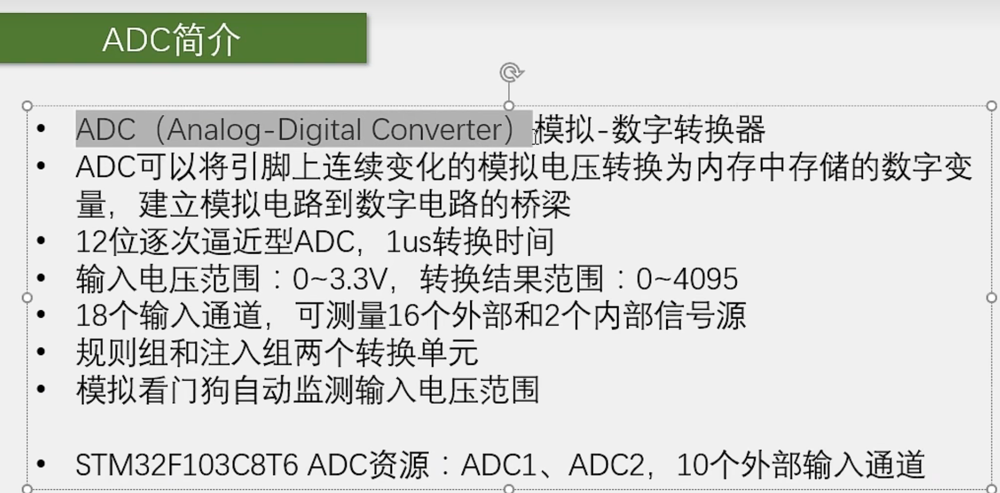
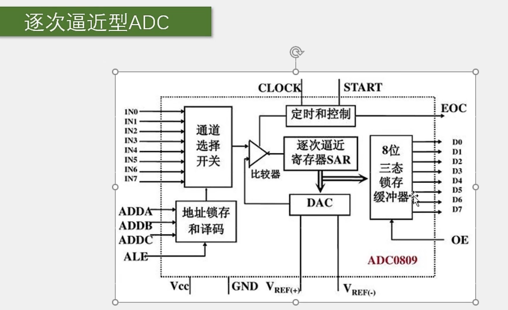
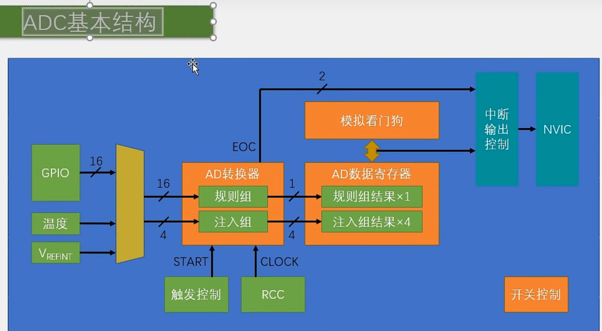
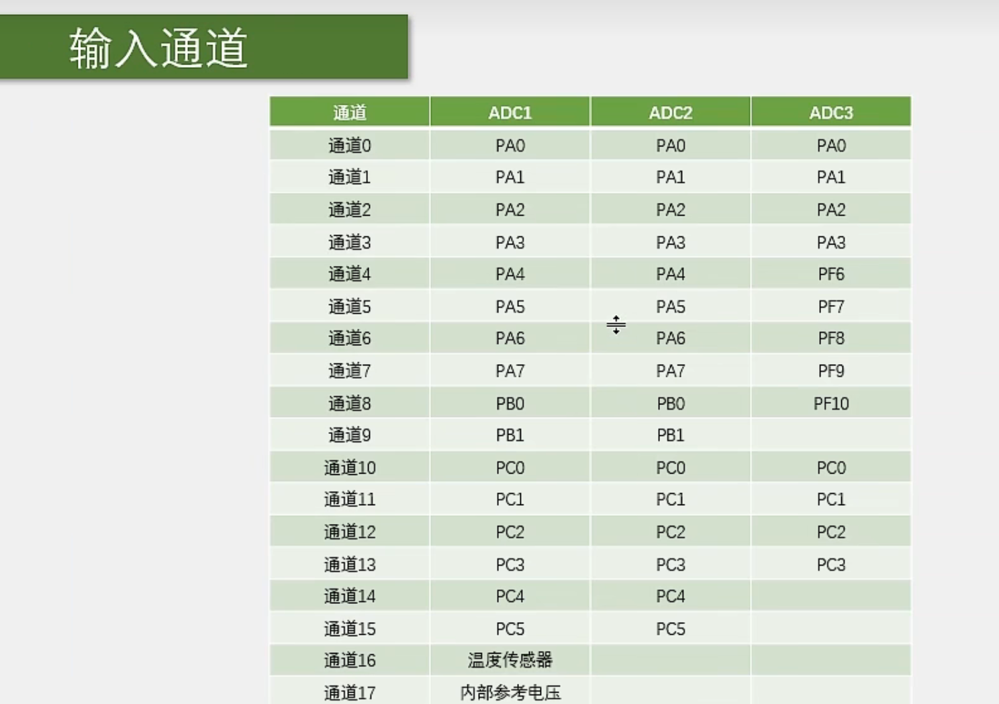
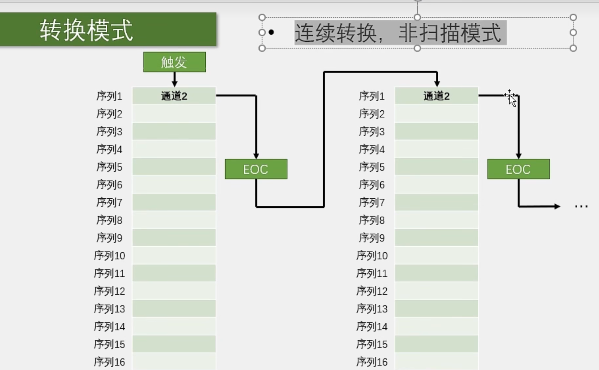
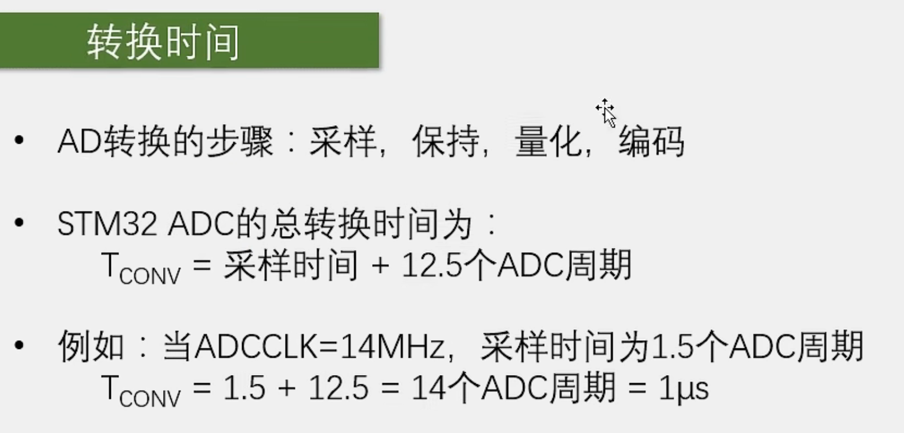
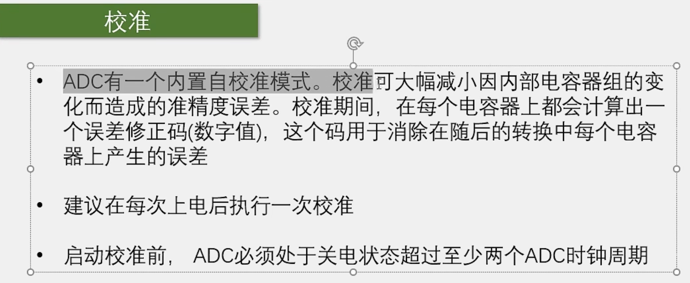
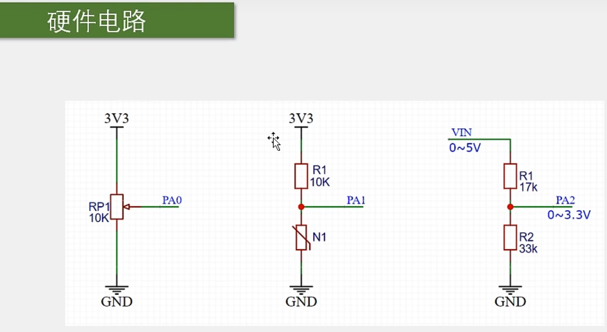

# 【7-1】ADC数模转换器

你问我ADC有啥作用？

​	**ADC其实就是一个电压表，把引脚的电压值测出来，放在一个变量里。**

## ADC简介

## 逐次逼近型ADC

**STM32的ADC原理和这个是一样的**

**part1**

​	首先左边这里IN0-IN7，是8路输入通道，通过通道选择开关，选中一路输入到这个红点进行转换。下面是地址锁存和译码，就是你想选择哪个通道，就把通道号放在这三个脚上，然后给一个锁存信号，上面这里对应的通道选择开关就可以自动拨好了。

&lt;img src="./assets/image-20231209183158289.png" alt="image-20231209183158289" style="zoom:25%;" /&gt;

​	这部分就相当于一个可以选择模拟信号的数据选择器。

​	因为ADC转换是一个很快的过程，你给个开始信号，过几个us就转换完成了，所以说如果你想转换多路信号，那不必设计多个AD转换器，只需要一个AD转换器，然后再加一个多路选择开关，想转换哪一路，就先拨一下开关，选中对应通道，然后再开始转换就行了。

​	这就是这个输入通道选择的部分，这个ADC0809只有8个输入通道，而我们STM32内部的ADC最多是有18个输入通道的，所以对应这里，就是一个18路输入的多路开关。

**part2**

​	输入信号选好了之后，怎么才能知道这个电压对应的编码数据是多少呢？这就需要我们用逐次逼近的方法来一一比较了。

​	首先这是一个电压比较器，它可以判断两个输入信号电压的大小关系，输出

&lt;img src="./assets/image-20231209183354648.png" alt="image-20231209183354648" style="zoom:33%;" /&gt;

一个高低电平，指示谁大谁小，它的两个输入端，一个是待测电压，另一个是DAC的电压输出端（DAC是数模转换器，给它一个数据，它就可以输出数据对应的电压）。

​	然后进行比较，如果DAC输出的电压比待测电压大，我就调小DAC数据；如果DAC输出的电压比待测电压小，我就增大DAC数据。直到DAC输出的电压和外部通道输入的电压近似相等 ，这样DAC输入的数据就是外部电压的编码数据了。

​	这就是DAC的读数原理。

**part3**

​	为了最快找到未知电压的编码，通常我们会使用二分法进行寻找。

​	比如这里是8位的ADC，那编码就是0-255，第一次比较的时候，我们就给DAC输入255的一半进行比较，那就是128，然后看看谁大谁小，如果DAC电压大了，那第二次比较的时候就再给128的一半，64，如果还大，第三次比较的时候就给32.这次如果DAC电压小了，那第四次就给32到64中间的值，然后继续。这样依次进行下去，就能最快地找到未知电压地编码。

​	并且这个过程，如果你用二进制来表示的话，你会发现128，64，32这些数据正好是二进制每一位的位权，这个判断过程就相当于是：对二进制从高位到低位一次判断是0还是1的过程，这就是逐次逼近型名字的来源。那对于8位的ADC，从高位到低位依次判断8次就能找到未知电压的编码了；对于12位的ADC，就需要12次。

**part4**

&lt;img src="./assets/image-20231209184642705.png" alt="image-20231209184642705" style="zoom:33%;" /&gt;

​	最后结果通过三态锁存缓冲器进行输出，8位就有8根线，12位就有12根线。

​	上面这里，EOC是End Of Convert，转换结束信号，START是开始转换，给一个输入脉冲，开始转换。CLOCK是ADC时钟，因为ADC内部是一步一步进行判断的，所以需要时钟来推动这个过程。

​	下面，VREF+和VREF-是DAC的参考电压。比如你给个数据是255，是对应5v还是3.3v呢？就由这个参考电压来决定。同时，这个DAC的参考电压也决定了ADC的输入范围，所以它也是ADC参考电压。

**part5**

​	最后左边是整个芯片电路的供电，VCC和GND，通常参考电压的正极和VCC是一样的，会接在一起；参考电压的负极和GND也是一样的，也接在一起。所以一般情况下，ADC输入电压的范围就和ADC的供电是一样的。

## STM32的ADC

**part1**

​	左边是ADC的输入通道，包括16个GPIO口，IN0-IN15和两个内部通道，一个是内部温度传感器，另一个是VREFINT（V Reference Internal）,内部参考电压。总共是18个输入通道，然后到达红圈处，这是一个模拟多路开关。

&lt;img src="./assets/image-20231209190001804.png" alt="image-20231209190001804" style="zoom:33%;" /&gt;

可以指定我们想要选择的通道，右边是多路开关的输出，进入到模数转换器，这里模数转换器就是执行我们刚才讲过的逐次比较的过程，转换结果会直接放在上面的数据寄存器里。

&lt;img src="./assets/image-20231209190219854.png" alt="image-20231209190219854" style="zoom:33%;" /&gt;

我们读取寄存器就能知道ADC转换的结果了。

**part2**

在模拟多路选择开关这里，对于普通的ADC，多路开关一般都是只选中一个的，就是选中某一个通道，开始转换，等待转换完成，取出结果，这是普通的流程。

&lt;img src="./assets/image-20231209190443060.png" alt="image-20231209190443060" style="zoom:50%;" /&gt;

但是这里就比较高级了，它可以同时选中多个，而且在转换的时候，还分成了两个组，规则通道组和注入通道组，其中规则组可以一次性最多选中16个通道，注入组最多可以选中4个通道。这有啥用呢？

​	举个例子，这就像你去餐厅点菜，普通的ADC是：你指定一个菜，老板给你做，然后做好了送给你。而更高级的这里就是，你指定一个菜单，这个菜单最多可以填16个菜，然后你直接递个菜单给老板，老板就按照菜单顺序依次做好，一次性给你端上来。这样的话就可以大大提高效率。当然你的菜单也可以只写一个菜哈。

​	那对于这个菜单呢，也有两种：

​			一种是规则组菜单，可以同时上16个菜，但是它有个尴尬的地方，就是这个规则组只有一个数据寄存器，就是这个桌子比较小，最多只能放一个菜，如果上16个菜，那不好意思，前15个菜都会被挤掉，你只能得到第16个菜。所以对于规则组转换来说，如果使用这个菜单的话，最好配合**DMA**来实现。（DMA是一个数据转运小帮手，它可以在每上一个菜之后，把这个菜挪到其他地方去，防止被覆盖。）

&lt;img src="./assets/image-20231209192051568.png" alt="image-20231209192051568" style="zoom:33%;" /&gt;

​			接着我们看注入组，它相当于是餐厅的VIP座位，在这个座位上，一次性最多可以点4个菜，并且注入组的数据寄存器有4个，是可以同时上4个菜的。对于注入组而言，就不用担心数据覆盖的问题了。

&lt;img src="./assets/image-20231209192028380.png" alt="image-20231209192028380" style="zoom:33%;" /&gt;

一般情况下，我们使用规则组就完全足够了。如果要使用规则组的菜单，那就再配合DMA转运数据，这样就不用担心数据覆盖的问题了。

**part3**：下面讲解模数转换器外围的一些线路

首先是左下角这里触发转换的部分，也就是ADC的START信号，开始转换

&lt;img src="./assets/image-20231209192332107.png" alt="image-20231209192332107" style="zoom:50%;" /&gt;

对于STM32的ADC，触发ADC开始转换的信号有两种：

​	一种是软件触发，就是在你程序中手动调用一条代码，就可以启动转换了。

​	另一种是硬件触发，就是这里的这些触发源，上面这些是注入组的触发源，下面这些是规则组的触发源。这些触发源主要是来自于定时器，有定时器的各个通道，还有TRGO定时器主模式的输出。那因为ADC经常需要过一个固定时间段转换一次。

​			比如每隔1ms转换一次，正常的思路就是，用定时器，每隔1ms申请一次中断，在中断里手动开始一次转换，这样也是可以的。但是频繁进中断对我们的程序是有一定影响的，比如你有很多中断都需要频繁进入，那肯定会影响主程序的执行。并且不同中断之间，由于优先级的不同，也会导致某些中断不能及时得到响应。如果触发ADC的中断不能及时得到响应，那我们ADC的转换频率就肯定会产生影响了。所以对于这种需要频繁进入中断，并且在中断里只完成了简单工作的情况，一般都会有硬件的支持：

​						比如下面这里，就可以给TIM3定个1ms的时间，并且把TIM3的更新事件选择为TRGO输出，然后在ADC这里，选择开始触发信号为TIM3的TRGO。这样TIM3的更新事件就能通过硬件自动触发ADC转换了。整个过程不需要进中断，节省了中断资源，这就是定时器触发的作用。当然还可以用外部时钟。

**part4**

&lt;img src="./assets/image-20231209194036135.png" alt="image-20231209194036135" style="zoom:50%;" /&gt;

上面两个是ADC的参考电压，决定了ADC输入电压的范围；

下面两个是ADC的供电引脚。

一般情况下，VREF+要接VDDA；VREF-要接VSSA。

在我们这个芯片上，没有VREF+和VREF-的引脚，它在内部就已经分别和VDDA和VSSA接在一起了。

**part5**

&lt;img src="./assets/image-20231209194404118.png" alt="image-20231209194404118" style="zoom:33%;" /&gt;

ADCCLK是ADC的时钟，相当于前面ADC里的CLOCK，是用于驱动内部逐次比较的时钟。这个ADCCLK是来自ADC预分频器，这个ADC预分频器是来源于RCC的。

继续看上面，这里是DMA（搬运小弟，防止菜被刷新下去）请求，这个就是用于触发DMA进行数据转运的。

&lt;img src="./assets/image-20231209194812876.png" alt="image-20231209194812876" style="zoom:50%;" /&gt;

模拟看门狗，它里面可以存一个阈值高限和阈值低限，如果启动了模拟看门狗，并且指定了看门的通道，那这个看门狗就会关注它看门的通道，一但超过这个阈值范围了，它就会乱叫，就会在上面，申请一个模拟看门狗的中断，最后通向NVIC。

然后对于规则组和注入组而言呢，他们转换之后，也会有一个EOC转换完成的信号。在这里，EOC是规则组的完成信号，JEOC是注入组完成的信号。这两个信号会在状态寄存器里置一个标志位，我们读取这个标志位，就能知道是不是转换结束了。同时这两个标志位也可以去到NVIC，申请中断。如果开启了NVIC对应的通道，它们就会触发中断。

## ADC基本结构图

可以通过是否能看懂此图来判断前文是否真正理解。

## 输入通道

刚才我们说了，左边那里有16个外部通道，那这16个外部通道都是对应的哪些GPIO口呢？？我们就可以看看下面这个表

这些就是ADC通道和引脚复用的关系。当然这个对应关系也可以通过引脚定义表看出来

## 规则组转换模式

**前情回顾：规则组**

​	规则组菜单，可以同时上16个菜，但是它有个尴尬的地方，就是这个规则组只有一个数据寄存器，就是这个桌子比较小，最多只能放一个菜，如果上16个菜，那不好意思，前15个菜都会被挤掉，你只能得到第16个菜。所以对于规则组转换来说，如果使用这个菜单的话，最好配合**DMA**来实现。（DMA是一个数据转运小帮手，它可以在每上一个菜之后，把这个菜挪到其他地方去，防止被覆盖。）

​	下面几个图的列表就是规则组里的菜单,有16个空位，分别是序列1-16，你可以在这里点菜，就是写入你要转换的通道。

### 单次转换，非扫描模式

​	在非扫描模式下，这个菜单就只有第一个序列1的位置有效，这时，菜单同时选中一组的方式就退化为简单的选中一个的方式了。

​	在这里我们可以在序列1的位置指定我们想转换的通道，比如通道2，然后我们就可以触发转换，ADC就会对这个通道2进行模数转换。过一小段事件后，转换完成，转换结果放在数据寄存器里，同时给EOC标志位置1，整个转换过程就结束了。

​	我们判断这个EOC标志位，如果转换完了，那我们就可以在数据寄存器里读取结果了；如果我们想再启动一次转换，那就需要再触发一次，转换结束，置EOC标志位，读结果。

​	如果想换一个通道转换，那在转换之前，把第一个位置的通道2改成其他通道，然后再启动转换，这样就行了。

### 连续转换，非扫描模式

 	与上一次单次转换不同的是，它在一次转换结束后不会停止，而是立刻开始下一轮的转换，然后一直持续下去，这样就只需要最开始触发一次，之后就可以一直转换了。

​	这个模式的好处就是，开始转换之后不需要等待一段时间的，因为它一直都在转换，所以你就不需要手动开始转换了。也不用判断是否结束的，想要读AD值的时候，直接从数据寄存器取就是了。

### 单次转换，扫描模式

​	这个模式也是单次转换，所以每触发一次就会停下来，下次转换就得再触发才能开始。

​	然后它是扫描模式，这就会用到这个菜单列表了，你可以在这个菜单里点菜，比如第一个菜是通道2，第二个菜是通道5等等等等。这里每一个位置是通道几可以任意指定，并且也是可以重复的。

​	然后初始化结构体里还会有一个参数，就是通道数目，因为这16个位置你可以不用完，只用前几个，那你就需要再给个通道数目的参数，告诉他我有几个通道。

​	每次触发后，他就一次对你选择的这前n个位置进行AD转换，转换结果都放在数据寄存器里，这里为了防止数据被覆盖，就需要用DMA及时将数据挪走。当n个通道转换完成后，产生EOC信号，转换结束，然后再触发下一次，又开始新一轮的转换。

### 连续转换，扫描模式

​	在上一个模式上变了一点而已

​	就是在一次转换完成后，立刻开始下一次的转换，和上面都是一个套路。

**当然，在扫描模式的情况下，还可以有一种模式，叫间断模式**

​	它的作用是，在扫描的过程中，每隔几个转换，就暂停一次，需要再次触发才能继续。了解即可。

## 触发控制

下面这个表就是规则组的触发源：

		在这个表里，有来自定时器的信号，还有来自引脚(或定时器)的信号。最后是软件控制位，也就是我们之前说的软件触发。

​	这些触发信号怎么选择，可以通过设置右边这个寄存器来完成。当然使用库函数的话，直接给一个参数就可以了。这就是触发控制，再简单说一下。

## 数据对齐

我们这个ADC是12位的，它的转换结果就是一个12位的数据。但是这个数据寄存器是16位的，所以就存在一个数据对齐的问题。

​	这里第一种是数据右对齐，就是12位的数据向右靠，高位多出来的几位就补0。

​	第二种是数据左对齐，12位的数据向左靠，低位多出来的几位补0。

**在这里我们一般使用的都是第一种右对齐，这样读取这个16位寄存器，直接就是转换结果**

左对齐之后往往数据会偏大。仅仅在不需要高分辨率的时候使用。

## 转换时间

转换时间这个参数我们一般不太敏感，因为一般AD转换都很快，如果不需要非常高速的转换频率，那这个时间一般都可以忽略的。

## 校准

不需要理解，校准是固定的，我们只需要在ADC初始化的最后，加几条代码就行了。

## 硬件电路

