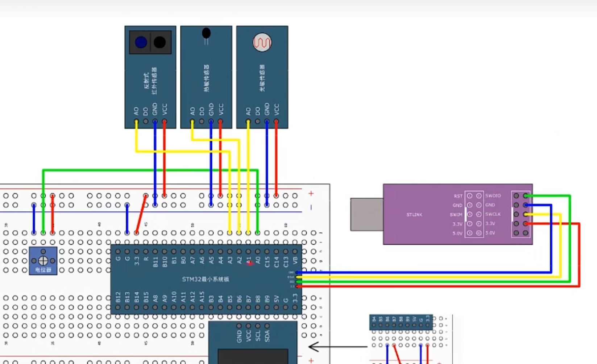

# 【7-2】AD单通道&多通道

## ADC相关函数

```c
void RCC_ADCCLKConfig(uint32_t RCC_PCLK2);

//函数功能：配置RTCCLK分频器的
//它可以对APB2的72MHz时钟选择2，4，6，8分频，输入到ADCCLK
```

```c
void ADC_DeInit(ADC_TypeDef* ADCx);
//函数功能：恢复缺省配置
```

```c
void ADC_Init(ADC_TypeDef* ADCx, ADC_InitTypeDef* ADC_InitStruct);
//函数功能：初始化
```

```c
void ADC_StructInit(ADC_InitTypeDef* ADC_InitStruct);
//函数功能：结构体初始化
```

```c
void ADC_Cmd(ADC_TypeDef* ADCx, FunctionalState NewState);
//函数功能：给ADC上电的，也就是开关控制
```

```c
void ADC_DMACmd(ADC_TypeDef* ADCx, FunctionalState NewState);
//函数功能：用于开启DMA输出信号的
```

```c
void ADC_ITConfig(ADC_TypeDef* ADCx, uint16_t ADC_IT, FunctionalState NewState);
//函数功能：中断输出控制
```


下面是4个用于控制校准的函数，我们在ADC初始化完成后，依次调用就行了

```c
void ADC_ResetCalibration(ADC_TypeDef* ADCx);
//复位校准
```

```c
FlagStatus ADC_GetResetCalibrationStatus(ADC_TypeDef* ADCx);
//获取复位标准状态
```

```c
void ADC_StartCalibration(ADC_TypeDef* ADCx);
//开启校准
```

```c
FlagStatus ADC_GetCalibrationStatus(ADC_TypeDef* ADCx);
//获取开启校准状态
```


```c
void ADC_SoftwareStartConvCmd(ADC_TypeDef* ADCx, FunctionalState NewState);
//ADC软件开始转换控制，用于软件触发的函数，调用一下就能软件触发转换了
```

```c
FlagStatus ADC_GetSoftwareStartConvStatus(ADC_TypeDef* ADCx);
//ADC获取软件开始转换状态，一般没啥用
//PS：不可以用这个函数来判断转换是否结束。那如何知道何时转换结束了呢？看下面这个函数：
```

```c
FlagStatus ADC_GetFlagStatus(ADC_TypeDef* ADCx, uint8_t ADC_FLAG);
//获取标志位状态，然后参数给EOC标志位，判断EOC标志位是不是置1了，如果转换结束，EOC标志位置1，然后调用这个函数，判断标志位。
```


下面是间断模式函数，需要的话可以了解一下

```c
void ADC_DiscModeChannelCountConfig(ADC_TypeDef* ADCx, uint8_t Number);
//每隔几个通道间断一次

void ADC_DiscModeCmd(ADC_TypeDef* ADCx, FunctionalState NewState);
//是不是启用间断模式
```


```c
void ADC_RegularChannelConfig(ADC_TypeDef* ADCx, uint8_t ADC_Channel, uint8_t Rank, uint8_t ADC_SampleTime);
//ADC规则组通道配置，给序列的每个位置填写指定的通道，就是填写菜单的过程
//1.ADCx	2.ADC_Channel指定通道	3.Rank序列几的位置	4.SampleTime指定通道的采样时间
```

```c
void ADC_ExternalTrigConvCmd(ADC_TypeDef* ADCx, FunctionalState NewState);
//ADC外部触发转换控制，就是是否允许外部触发转换
```

```c
uint16_t ADC_GetConversionValue(ADC_TypeDef* ADCx);
//ADC获取转换值，就是获取AD转换的数据寄存器，读取转换结果就要使用这个函数

uint32_t ADC_GetDualModeConversionValue(void);
//ADC获取双模式转换值，双ADC模式读取转换结果的函数
```

**以上是规则组的函数**


还有注入组函数，看门狗函数，温度函数等此处忽略


## AD单通道

### 接线图


**电位器：等于滑动变阻器**


### 程序实例

**AD.h**

```c
#ifndef __AD_H
#define __AD_H

void AD_Init(void);
uint16_t AD_GetValue(void);


#endif

```


**AD.c**

```c
#include "stm32f10x.h"                  // Device header


void AD_Init(void)
{
	/* AD初始化步骤：
		1.开启RCC时钟，包括ADC和GPIO的时钟（另外ADCCLK的分频器也需要配置一下）
		2.配置GPIO，把需要用的GPIO配置成模拟输入的模式
		3.配置多路开关，把左边的通道接入到右边的规则组列表里(点菜)
		4.配置ADC转换器（结构体）
		5.如果你需要模拟看门狗，那会有几个函数用来配置阈值和监测通道的
		6.如果你想开启中断，那就在中断输出控制里用ITConfig函数开启对应的中断输出，然后再在NVIC里配置中断优先级
		7.开关控制，调用一下ADC_Cmd函数，开启ADC
		配置完成。
		8.还可以对ADC进行校准，这样可以减少误差
	
		那在ADC工作的时候，如果想用软件触发转换，那会有函数可以触发；
		如果想读取转换结果，那也会有函数可以读取结果。
	*/
	
	//第一步，开启RCC时钟
	RCC_APB2PeriphClockCmd(RCC_APB2Periph_ADC1,ENABLE);	//开启ADC的RCC时钟
	RCC_APB2PeriphClockCmd(RCC_APB2Periph_GPIOA,ENABLE);//开启GPIOA的时钟
	RCC_ADCCLKConfig(RCC_PCLK2_Div6);//配置ADCCLK分频器，配置为6倍分频
	
	//第二步，配置GPIO
		/*GPIO初始化，模拟输入的引脚*/
	GPIO_InitTypeDef GPIO_InitStructure;
	GPIO_InitStructure.GPIO_Mode = GPIO_Mode_AIN;//AIN模式下，GPIO是无效的，断开GPIO，防止你GPIO口的输入输出对我模拟电压造成干扰
	GPIO_InitStructure.GPIO_Pin = GPIO_Pin_0;
	GPIO_InitStructure.GPIO_Speed = GPIO_Speed_50MHz;
	GPIO_Init(GPIOA, &GPIO_InitStructure);
	
	//第三步：配置规则组通道
	//在规则组菜单列表的第一个位置，写入通道0这个通道(序列1位置写入通道0)，采样时间55.5
	//如果还想继续填充菜单就多写几个该函数
	ADC_RegularChannelConfig(ADC1,ADC_Channel_0,1,ADC_SampleTime_55Cycles5);
	
	//第四步：结构体初始化ADC
	//先初始化ADC的结构体
	ADC_InitTypeDef ADC_InitStructrue;
	ADC_InitStructrue.ADC_ContinuousConvMode = ENABLE;//单次转换
	ADC_InitStructrue.ADC_DataAlign = ADC_DataAlign_Right ;//右对齐模式
	ADC_InitStructrue.ADC_ExternalTrigConv = ADC_ExternalTrigConv_None;//外部触发源选择：不触发，由软件触发
	ADC_InitStructrue.ADC_Mode = ADC_Mode_Independent ;	//独立模式
	ADC_InitStructrue.ADC_NbrOfChannel = 1;
	ADC_InitStructrue.ADC_ScanConvMode = DISABLE;//非扫描模式
	//再初始化ADC
	ADC_Init(ADC1,&ADC_InitStructrue);
	
	//第五步：开启ADC
	ADC_Cmd(ADC1,ENABLE);
	
	//校准ADC
	 ADC_ResetCalibration(ADC1);
	 while(ADC_GetResetCalibrationStatus(ADC1));//==SET已经省略
	 ADC_StartCalibration(ADC1);
	 while(ADC_GetCalibrationStatus(ADC1));//==SET已经省略
	 
	//1.软件触发转换
	ADC_SoftwareStartConvCmd(ADC1,ENABLE);
	
}


uint16_t AD_GetValue(void)
{
	/*获取AD值步骤：
	1.软件触发转换
	2.等待转换完成，也就是等待EOC标志位置1
	3.读取ADC数据寄存器
	*/
	

	
	//2等待转换完成
	//while(ADC_GetFlagStatus(ADC1,ADC_FLAG_EOC) == RESET);
	
	//3.读取ADC数据寄存器
	return ADC_GetConversionValue(ADC1);
	
}


```


**main.c**

```c
#include "stm32f10x.h"                  // Device header
#include "Delay.h"
#include "OLED.h"
#include "AD.h"


int main(void)
{
	/*模块初始化*/
	OLED_Init();		//OLED初始化
	
	AD_Init();
	
	OLED_ShowString(1,1,"AD:");
	OLED_ShowString(2,1,"V:");
	while (1)
	{
		Delay_ms(100);
		OLED_ShowNum(1,4,AD_GetValue(),4);
		OLED_ShowNum(2,4,((uint16_t)((float)AD_GetValue() / 4095 * 3.3 * 100) % 100 ),2);
	}
}

```


## AD多通道

### 接线图




### 程序实例


