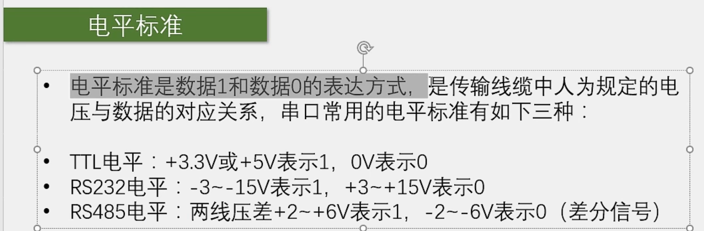

# 【9-1】USART串口协议

## 通信接口

**双工**：

​	全双工：指通信双方能够同时进行双向通信。一般来说，全双工的通信都有两根通信线，比如串口，一根TX发送，一根RX接收；SPI，一根MOSI发送，一根MISO接收；发送线路和接收线路互不影响，全双工。

​	半双工： 只有一根数据线(CAN和USB两根差分线也是组合成为一根数据线的)，所以都是半双工。半双工是指双方能够通信，但不能同时通信，可以你发我，我发你，但不能你发我的同时我发你。

​	单工：指在数据只能从一个设备到另外一个设备，而不能反着来。比如把串口的RX引脚去掉，那串口就退化成单工了。

**时钟**（特性）：

​	同步：I2C和SPI都有单独的时钟线，所以他们是同步的，接收方可以在时钟信号的指引下进行采样。

​	异步：剩下的串口，CAN和USB没有时钟线，所以需要双方约定一个采样频率，并且还需要加一些帧头帧尾等，进行采样位置的对齐。这就是异步通信。

**电平**（特性）：

​	单端信号：它们引脚的高低电平都是对GND的电压差，所以单端信号通信的双方必须要共地，就是把GND接在一起。

​	差分信号：它是靠两个差分引脚的电压差来传输信号的，在通信的时候可以不需要GND，不过USB协议里也有一些地方需要单端信号，所以USB还是需要GND的。

**设备特性**：略

## 串口通信

## 硬件电路

### 电平标准

## 串口参数及时序

## 串口时序

下面是串口通讯的示例波形图：

