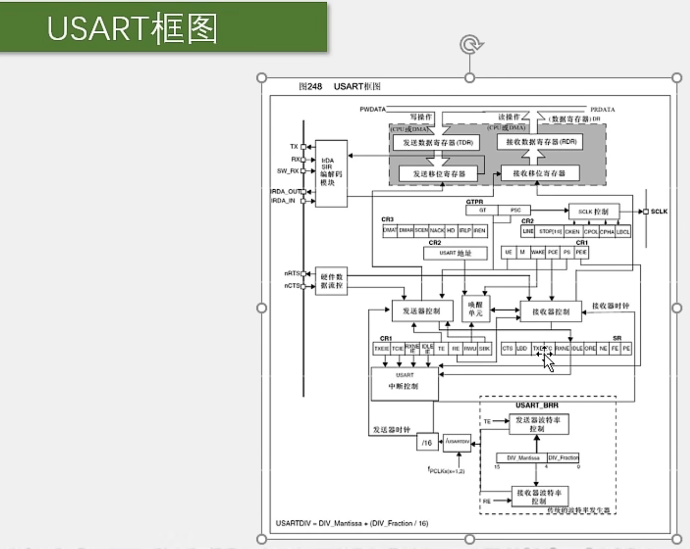
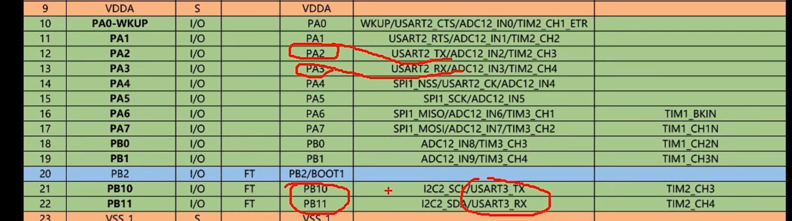
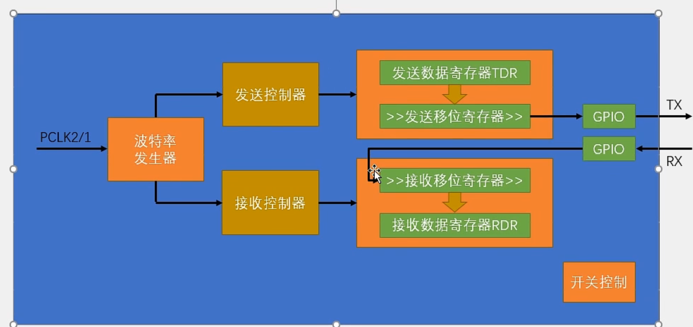
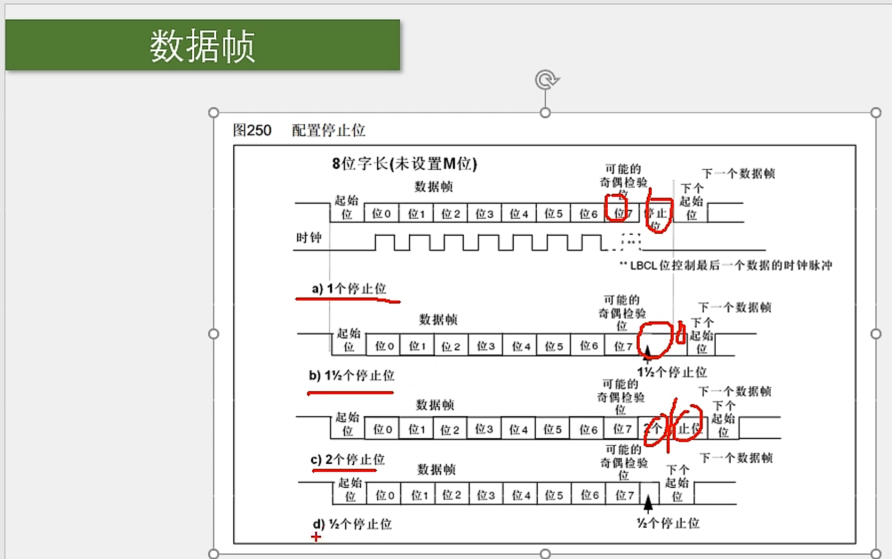
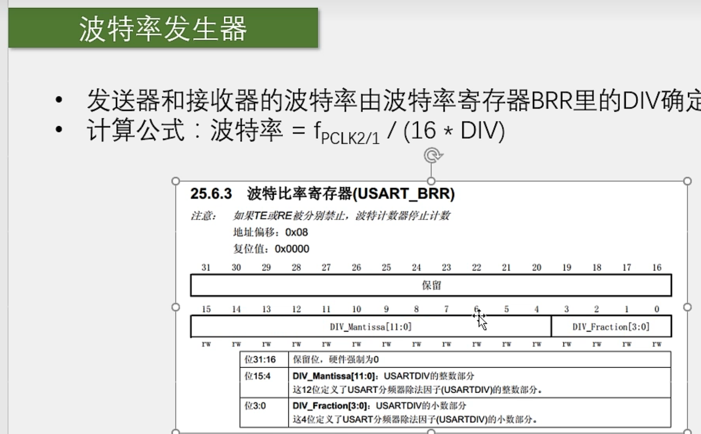

# 【9-2】USART串口外设

## USART简介

PS：

​	STM32F103C8T6的片上资源：USART1是APB2总线上的设备，USART2，3是APB1总线的设备，在开启时钟时要注意一下。

## USART框图

### 串口引脚

### USART基本结构图

**PS：**

​	这里画了几个右移的符号，就是代表这个移位寄存器是往右移的，是低位先行。当数据由数据寄存器转到移位寄存器时，会置一个TXE的标志位，我们判断这个标志位就知道是不是可以写下一个数据了。

&lt;img src="./assets/image-20231214162940498.png" alt="image-20231214162940498" style="zoom:33%;" /&gt;

​	然后接收部分也是类似的哈：RX引脚的波形，通过GPIO输入，在数据接收器的控制下，一位一位地移入接收移位寄存器，这里画了右移的符号，也是右移的，因为是低位先行，所以要从左边开始移进来，移完一帧数据后，数据就会统一运到接收数据寄存器，在转移的同时，置一个RXNE标志位，我们检查这个标志位，就可以知道是不是接收到数据了。同时这个标志位也可以去申请中断，这样就可以在收到数据的时候，直接进入中断函数，然后快速的读取和保存数据。

&lt;img src="./assets/image-20231214162951547.png" alt="image-20231214162951547" style="zoom:33%;" /&gt;

**那右边其实是有四个寄存器哈，但是在软件层面，只有一个DR寄存器可以供我们读写：**

​	写入DR时，数据走上面这条路，进行发送；读取DR时，数据走下面这条路，进行接收。

&lt;img src="./assets/image-20231214163302209.png" alt="image-20231214163302209" style="zoom:50%;" /&gt;

## 其他细节

### 数据帧

#### 1.

​	这个图，是在程序中配置8位字长和9位字长的波形对比，这里的字长，就是我们前面所说的数据位的长度，它这里的字长是包含校验位的，是这种描述方式。

​	看下上面9位字长的波形：

​	第一条时序，很明显就是TX发送或者RX接收的数据帧格式:空闲高电平，然后起始位0，然后根据写入的数据，置0或者置1，依次发送位0-位8，加起来就是9位，最后停止位1，数据帧结束  。

​	**在这里位8，也就是第9个位置，是一个可能的奇偶校验位，通过配置寄存器就可以配置成奇校验，偶校验或者无校验。这里可以选择配置成8位有效载荷+1位校验位，也可以选择9位全都是有效载荷。不过既然你选择了9位字长，那一般都是要加上校验位的，因为8位有效载荷，正好对应一个字节嘛**

​	然后下面这个时钟，就是我们之前说的同步时钟输出的功能，可以看到，这里在每个数据位的中间，都有一个时钟上升沿，时钟的频率，和数据速率也是一样的，接收端可以在时钟上升沿进行采样，这样就可以精确定位每一位数据，这个时钟的最后一位，可以通过这个LBCL控制，要不要输出 ，另外这个时钟的极性，相位什么的，也可以通过配置寄存器配置。

​	然后下面这个空闲帧，就是从头到尾都是1；

​	还有一个断开帧，从头到尾都是0；

​	这两个数据帧，是局域网协议用的，我们串口用不着，不用管的。

下面是8位的，和9位基本一样，不作解释。

**总的来说，这里有四种选择：**

​	8位字长，有校验或者无校验；

​	9位字长，有校验或者无校验；

#### 2.

下面是不同停止位的数据帧的波形变化。

STM32的串口可以配置停止位长度为0.5，1，1.5，2这四种

最后一位就是控制停止位时长的，一般选择一位停止位就行了哈，其他的参数不太常用。

**下面展示的是USART电路上输入数据的一些策略：**

​	对于串口来说，串口的输出TX应该是比输入RX简单很多，因为输出你就定时翻转TX引脚高低电平就行了，但是输入就复杂一些：你不仅要保证，输入的采样频率和波特率一致，还要保证每一次输入采样的位置，正好要处于每一位的正中间，只有在每一位的正中间采样，这样高低电平读进来才是最可靠的，如果你采样点过于靠前或靠后，那有可能高低电平还正在翻转，电平还不稳定，或者稍有误差，数据就采样错了。

​	另外，输入最好还要对噪声有一定的判断能力，如果是噪声，最好能置个标志位提醒我一下。

​	这些就是输入数据所面临的问题，那我们来看看STM32是如何来设计输入电路的呢？？

#### 起始位侦测

当输入电路侦测到一个数据帧的起始位后，就会以波特率的频率，连续采样一帧数据，同时，从起始位开始，采样位置就要对齐到位的正中间，只要第一位 对齐了，后面就肯定都是对齐的。

那为了实现这些功能，首先输入的这部分电路对采样时钟进行了细分，它会以波特率的16倍频率进行采样，也就是在一位的时间里，可以进行16次采样。然后它的策略是：

​			最开始，空闲状态高电平，那采样就一直是1，在某个位置，突然采到一个0，那么就说明，在这两次采样之间，出现了下降沿，如果没有任何噪声，那之后就应该是起始位了。在起始位，会进行连续16次采样，没有噪声的话，这16次采样，肯定就都是0，这没问题。但是实际电路肯定是存在一些噪音的，所以这里即使出现下降沿了，后续也要再采样几次，以防万一。

​	那根据手册描述，这个接收电路，还会在下降沿之后的第3次，5次，7次，进行一批采样；在第8次，9次，10次，再进行一批采样；且这两批采样，都要要求每3位里面至少应该有2个0；

​				如果没有噪声，那肯定都是0，满足情况

​				如果有一些轻微的噪声，导致这里3位里面，只有两个是0，另一个是1，那也算是检测到了起始位，**但是在状态寄存器里会置一个NE，噪声标志位！**就提醒你一下，数据我是收到了，但是有噪声，你悠着点用。

​				如果这3位里面只有1个0，那就不算检测到了起始位，可能前面那个下降沿是噪声导致的，这时电路就忽略前面的数据，重新开始捕捉下降沿。

​	以上就是STM32的串口在接收过程中，对噪声的处理。如果通过了这个起始位侦测，那接收状态就由空闲，变为接收起始位，同时，第8，9，10次采样的位置，就正好是起始位的正中间，之后，接收数据位时，就都在第8，9，10次进行采样，这样就能保证采样位置在位的正中间了，这就是起始位侦测和采样位置对齐的策略。

#### 数据采样

这里，从1-16，是一个数据位的时间长度，在一个数据位，有16个采样时钟，由于起始位侦测已经对齐了采样时钟，所以，这里就直接在第8，9，10次采样数据位。

​	为了保证数据的可靠性，这里是连续采样3次，

​			没有噪声的理想情况下，这三次肯定全为1或者全为0，全为1，就确认收到了1；全为0，就认为收到了0

​			如果有噪声，导致3次采样不是全为1或者全为0，那它就按照2：1的规则来，2次为1就是1，2次为0就是0，同时这种情况下噪声标志位NE也会置1，告诉你，我收到数据了，但是有噪声，你悠着点用。

以上就是检测噪声的数据采用。

#### 波特率发生器

​	波特率发生器就是分频器

了解即可，我们用库函数，需要多少波特率，直接写就行，库函数会帮我们算。

