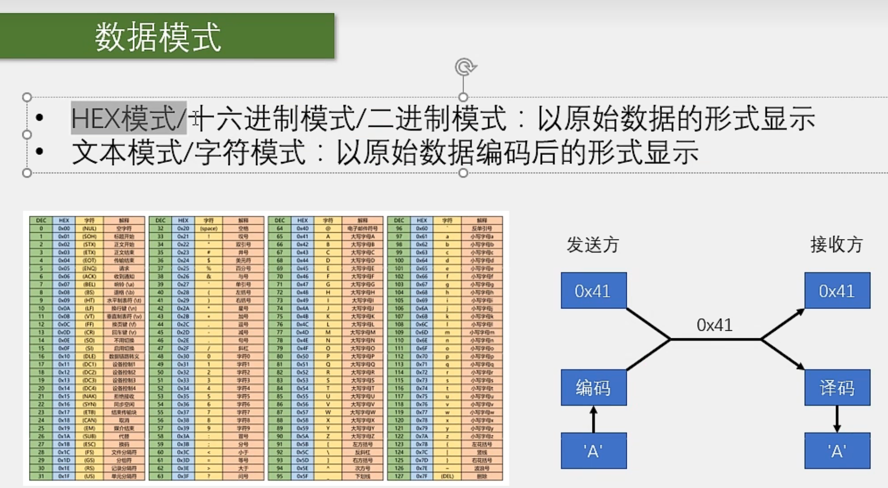
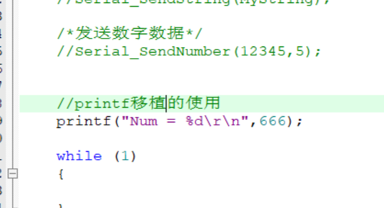
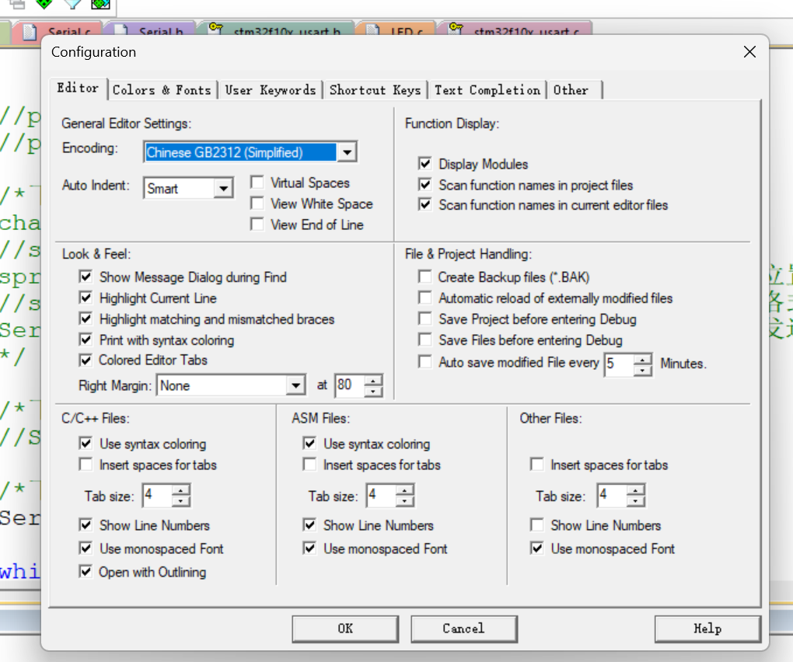
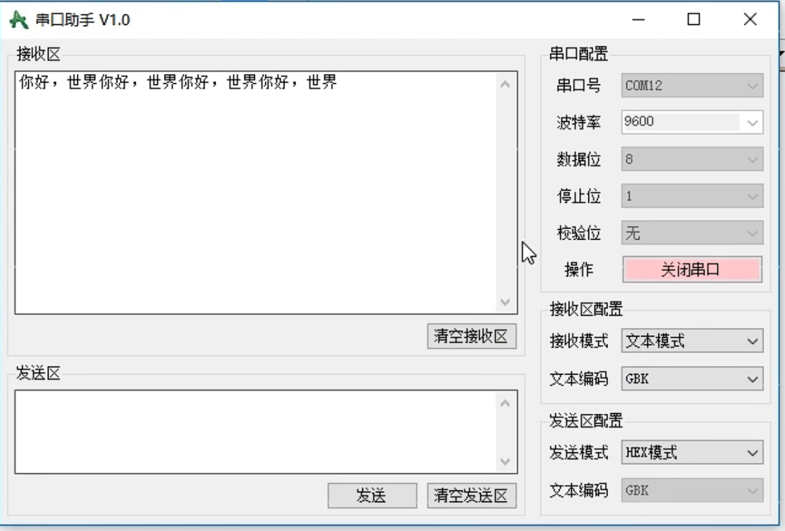
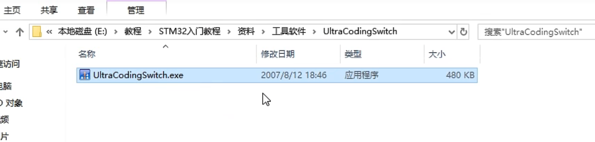
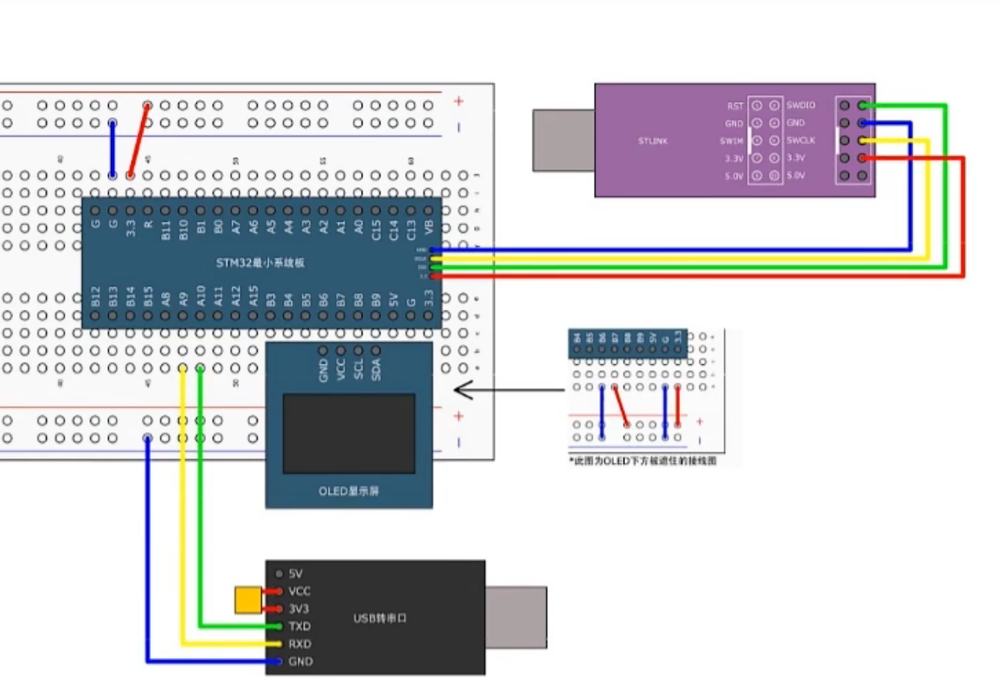

# 【9-3】串口发送&串口接收

**为啥要一起共地而不是你用你的地我用我的地？**

​	一般多个系统之间的互联，都要进行共地，这样电平才能有高低的参考，就像两个人比身高一样，他俩必须要站在同一地平面上，才能比较。如果一个人站在地球，一个人站在月球，那怎么知道谁高谁低呢？


## USART相关函数

```c
void USART_ClockInit(USART_TypeDef* USARTx, USART_ClockInitTypeDef* USART_ClockInitStruct);
void USART_ClockStructInit(USART_ClockInitTypeDef* USART_ClockInitStruct);

//函数功能：用来配置同步时钟输出的，包括时钟是不是要输出，时钟的极性相位等参数，因为参数比较多，所以是用结构体这种方式来配置的。
```

```c
void USART_DMACmd(USART_TypeDef* USARTx, uint16_t USART_DMAReq, FunctionalState NewState);

//函数功能：可以开启USART到DMA的触发通道
```

**下面这些函数比较重要哈**

```c
void USART_SendData(USART_TypeDef* USARTx, uint16_t Data);

//函数功能：发送数据
//就是写DR寄存器
```

```c
uint16_t USART_ReceiveData(USART_TypeDef* USARTx);

//函数功能：接收数据
//就是读DR寄存器
```

DR寄存器内部有4个寄存器，控制发送于接收。


## 数据模式



HEX模式：

​	只能显示一个个的16进制数，比如41，42，7A，8B；不能显示文本，比如Helloworld，和各种符号，比如！，。

如果想显示文本，那就要对一个个的数据进行编码了，这就是文本模式：

文本模式：

​	它是以原始数据编码后的形式显示，在这个模式下，每一个字节数据，通过查找字符集，编码成一个字符，比如上图展示的就是ASCLL码字符集。


## Printf

### 1.Keil5的设置

**第一步**


MicroLIB是Keil为嵌入式平台优化的一个精简库，我们等会要用的printf就可以用MicroLIB，所以勾上它。


**第二步**

我们还需要对printf进行重定向，将printf函数打印的东西输出到串口，因为printf函数默认是输出到屏幕，我们的单片机没有屏幕，所以要进行重定向。

步骤就是：

​		在串口模块里，最开始加上：#include&lt;stdio.h&gt;

​		之后，在后面，重写fputc函数：

```c
//重写fputc函数
int fputc(int ch,FILE *f)
{
	//在这里面，我们要把fputc重定向到串口
	Serial_SendByte(ch);
	return ch;
}
```

那重定向fpuc跟printf有什么关系呢？？

​		这是因为，这个fputc是printf函数的底层，printf函数在打印的时候，就是不断调用fputc函数一个个打印的，我们把fputc函数重定向到了串口，那pritnf自然就输出到串口了。


### 2.使用

在main函数里就可以直接使用pritnf函数了：



在串口助手里面即可看到对应printf输出结果：


### 3.其他printf函数的移植方法

**第二种**

上面那种printf移植方法，printf只能有一个，你重定向到串口1了，那串口2再用就没有了。如果多个串口都想用printf怎么办呢？？

​	这时候就可以用sprintf！

​		sprintf可以把格式化字符输出到一个字符串里，所以：

```c
char String[100];	//定义一个字符串，长度管够
//sprintf可以把格式化字符输出到一个字符串里
sprintf(String,"Num = %d\r\n",666);	//1.打印输出的位置，后面的参数就跟printf一样了
//sprintf的理解：pritnf是格式化输出，sprintf就是光格式化不输入，而是保存到一个字符串变量里面
Serial_SendString(String);//把字符串String通过串口发送出去
```


**第三种**

sprinf，每次都得先定义字符串，再打印到字符串，再发送字符串，太麻烦了，我们要是能封装一下这个过程，就再好不过了。所以第三种方法就是sprinf。

​	由于printf这类函数比较特殊，它支持可变的参数，像我们之前写的函数，参数的个数都是固定的，可变参数这个执行起来比较复杂，如果想深入学习的话，可以百度一下c语言可变参数，学习一下。

下面是封装步骤：

​	首先在串口模块里，先添加头文件#include&lt;stdarg.h&gt;

​	然后在最后这里对sprintf函数进行封装：

```c
/*下面是封装sprintf函数*/
//format参数用来接收格式化字符串，三个点表示接收后面的可变参数列表
void Serial_Printf(char *format,...)
{
	char String[100];//定义一个字符串变量
	va_list arg;	//定义一个参数列表变量,va_list是一个类型名，arg是变量名
	va_start(arg,format);//从format位置开始接收参数表，放在arg里面
	vsprintf(String,format,arg);//接收字符串是String，格式化字符串是format，参数表是arg
	//在上面这里，sprintf要改成vsprintf,因为sp只能接收直接写的参数，对于这种封装格式，要用vsp
	
	va_end(arg);//释放arg
	Serial_SendString(String);//发送字符串至串口
}

```

这样，就可以直接在main里面调用了：


### printf的中文打印

#### 第一种

首先，在设置里面：

写上：

```c
--no-multibyte-chars
```


然后在串口助手里面文本编码改成UTF-8，这样就能正常打印中文了：


但是UTF-8可能有些软件兼容性不好，所以第二种方式就是：切换为GB2312编码。

#### 第二种

在Keil5里面将编码模式改为GB2312，这是汉字的编码方式，点击ok




同时，在串口助手里面选择GBK编码，一般windows软件默认就是GBK的编码，GBK和GB2312一样，都是中文的编码，基本都是兼容的




#### 转码软件

资料里有转编码软件，可以批量进行转码，记得关闭文件的只读。




## 串口发送

### 接线图



**为什么USB转TTL的RX和TX要接到STM32的PA9和PA10呢？**

​	我们看一下引脚图：


我们计划用USART1进行通信，所以就选这两个脚，如果你用USART2或者3的话，就要在这里找一下，接在USART2或者3的对应引脚上。


**再次提醒：TX和RX交叉连接！**


### 程序实例

**Serial.h**

```c
#ifndef __SERIAL_H
#define __SERIAL_H

#include <stdio.h>

void Serial_Init(void);
void Serial_SendByte(uint8_t Byte);
void Serial_SendArray(uint8_t *Array,uint16_t Length);
void Serial_SendString(char *String);
void Serial_SendNumber(uint32_t Number,int8_t Length);
void Serial_Printf(char *format,...);

#endif

```


**Serial.c**

```c
#include "stm32f10x.h" // Device header

#include <stdio.h>
#include <stdarg.h>

void Serial_Init(void)
{
/*初始化流程：
1.开启时钟，把需要用的USART和GPIO时钟打开；
2.GPIO初始化，把TX配置成复用输出，RX配置成输入；
3.配置USART，直接用一个结构体；
4.如果你只需要发送的功能，就直接开启USART，初始化就结束了；
如果你需要接收的功能，可能还需要配置中断：
那就在开启USART之前，再加上ITConfig和NCIC的代码就行了
*/

	
	
	//第一步：开启时钟
	RCC_APB2PeriphClockCmd(RCC_APB2Periph_USART1,ENABLE);//开启USART1的时钟使能
	RCC_APB2PeriphClockCmd(RCC_APB2Periph_GPIOA,ENABLE);//开启UGPIOA的时钟使能
	
	//第二步：初始化GPIO引脚
	/*GPIO初始化*/
	GPIO_InitTypeDef GPIO_InitStructure;
	GPIO_InitStructure.GPIO_Mode = GPIO_Mode_AF_PP;//复用推挽输出
	GPIO_InitStructure.GPIO_Pin = GPIO_Pin_9;
	GPIO_InitStructure.GPIO_Speed = GPIO_Speed_50MHz;
	GPIO_Init(GPIOA, &GPIO_InitStructure);	
	
	//第三步：初始化USART
	
	USART_InitTypeDef USART_InitStructure;	//定义初始化USART的结构体
	USART_InitStructure.USART_BaudRate = 9600;	//波特率
	USART_InitStructure.USART_HardwareFlowControl = USART_HardwareFlowControl_None;	//硬件流控制：不使用流控
	USART_InitStructure.USART_Mode = USART_Mode_Tx;//发送模式，如果既要接收又要发送就用|符号同时|上TX和RX
	USART_InitStructure.USART_Parity = USART_Parity_No;//奇偶校验位：不校验
	USART_InitStructure.USART_StopBits = USART_StopBits_1;//停止位长度：1位
	USART_InitStructure.USART_WordLength = USART_WordLength_8b;//字长：8位

	USART_Init(USART1,&USART_InitStructure);
	
	//第四步：开启USART
	USART_Cmd(USART1,ENABLE);
	
}


//发送一个字节函数
void Serial_SendByte(uint8_t Byte)
{
	USART_SendData(USART1,Byte);
	//获取标志位,如果数据发送完后，标志位会置1，此时才会跳出while循环
	while(USART_GetFlagStatus(USART1,USART_FLAG_TXE) == RESET);
}


//发送一个数组函数
void Serial_SendArray(uint8_t *Array,uint16_t Length)
{
	uint16_t i;
	for(i = 0; i < Length ; i++)
	{
		Serial_SendByte(*Array);
		Array++;
	}
}


//发送一个字符串函数
void Serial_SendString(char *String)	//因为字符串自带一个结束标志位，所以就不需要再传递长度参数了
{
	while(*String != '\0')
	{
		Serial_SendByte(*String);
		String++;
	}
}


//求某个数的n次方函数，需求见下一个函数的注释
uint32_t Serial_Pow(uint32_t X,uint32_t Y)
{
	uint32_t result = 1;
	while(Y--)
		result *= X;
	return result;
}


//发送一个数字函数
void Serial_SendNumber(uint32_t Number,int8_t Length)
{
	/*在函数里面：
		我们需要把Number的个位，十位，百位等等，以十进制拆分开
		然后转换成字符数字对应的数据，依次发送出去	*/
	
	//wok，拆分某(x)一位的数字，就是该数字/10^x % 10
	
	//所以我们需要先写一个求n次方函数，在前面uint32_t Serial_Pow(uint32_t X,uint32_t Y)
	
	uint8_t i;
	for(i = Length ; i > 0 ; i--)
	{
		Serial_SendByte(Number / Serial_Pow(10,i) % 10 + 0x31);//加0x30是为了对齐ASCLL码表里的数字，参考A与a的转换
	}
}


//重写fputc函数
int fputc(int ch,FILE *f)
{
	//在这里面，我们要把fputc重定向到串口
	Serial_SendByte(ch);
	return ch;
}


/*下面是封装sprintf函数*/
//format参数用来接收格式化字符串，三个点表示接收后面的可变参数列表
void Serial_Printf(char *format,...)
{
	char String[100];//定义一个字符串变量
	va_list arg;	//定义一个参数列表变量,va_list是一个类型名，arg是变量名
	va_start(arg,format);//从format位置开始接收参数表，放在arg里面
	vsprintf(String,format,arg);//接收字符串是String，格式化字符串是format，参数表是arg
	//在上面这里，sprintf要改成vsprintf,因为sp只能接收直接写的参数，对于这种封装格式，要用vsp
	
	va_end(arg);//释放arg
	Serial_SendString(String);//发送字符串至串口
}

```


**main.c**

```c
#include "stm32f10x.h"                  // Device header
#include "Delay.h"
#include "OLED.h"
#include "Serial.h"

int main(void)
{
	/*模块初始化*/
	OLED_Init();		//OLED初始化
	Serial_Init();	//初始化
	
	/*发送字节数据*/
	//Serial_SendByte(0x41);
	
	/*发送数组类型数据*/
	//uint8_t MyArray[] = {0x42,0x43,0x44,0x45};
	//Serial_SendArray(MyArray,4);
	
	
	/*发送字符串类型数据*/
	//char MyString[] = "Hellow world!";
	//Serial_SendString(MyString);
	
	/*发送数字数据*/
	//Serial_SendNumber(12345,5);

		
	//printf移植的使用
	//printf("Num = %d\r\n",666);
	
	/*下面是用sprintf实现print的移植使用
	char String[100];	//定义一个字符串，长度管够
	//sprintf可以把格式化字符输出到一个字符串里
	sprintf(String,"Num = %d\r\n",666);	//1.打印输出的位置，后面的参数就跟printf一样了
	//sprintf的理解：pritnf是格式化输出，sprintf就是光格式化不输入，而是保存到一个字符串变量里面
	Serial_SendString(String);//把字符串String通过串口发送出去
	*/
	
	/*下面是封装sprintf函数实现printf的移植使用*/
	//Serial_Printf("Num = %d\n",789789);
	
	/*下面是printf显示中文*/
	//Serial_Printf("你好，世界！");
	
	while (1)
	{
		
	}
}

```


## 串口发送+接收


对于串口接收来说，可以使用查询和中断两种方法


### 接线图

和上一个例子的一样


### 程序实例

**Seria.h**

```c
#ifndef __SERIAL_H
#define __SERIAL_H

#include <stdio.h>

void Serial_Init(void);
void Serial_SendByte(uint8_t Byte);
void Serial_SendArray(uint8_t *Array,uint16_t Length);
void Serial_SendString(char *String);
void Serial_SendNumber(uint32_t Number,int8_t Length);
void Serial_Printf(char *format,...);
uint8_t Serial_GetRxFlag(void);
uint8_t Serial_GetRxData(void);

#endif

```


**Serial.c**

```c
#include "stm32f10x.h" // Device header

#include <stdio.h>
#include <stdarg.h>


uint8_t Serial_RxFlag;
uint8_t Serial_RxData;

void Serial_Init(void)
{
	/*初始化流程：
	1.开启时钟，把需要用的USART和GPIO时钟打开；
	2.GPIO初始化，把TX配置成复用输出，RX配置成输入；
	3.配置USART，直接用一个结构体；
	4.如果你只需要发送的功能，就直接开启USART，初始化就结束了；
	如果你需要接收的功能，可能还需要配置中断：
	那就在开启USART之前，再加上ITConfig和NCIC的代码就行了
	*/

	
	
	//第一步：开启时钟
	RCC_APB2PeriphClockCmd(RCC_APB2Periph_USART1,ENABLE);//开启USART1的时钟使能
	RCC_APB2PeriphClockCmd(RCC_APB2Periph_GPIOA,ENABLE);//开启UGPIOA的时钟使能
	
	//第二步：初始化GPIO引脚
	/*GPIO初始化PA9,就是TX发送脚*/
	GPIO_InitTypeDef GPIO_InitStructure;
	GPIO_InitStructure.GPIO_Mode = GPIO_Mode_AF_PP;//复用推挽输出
	GPIO_InitStructure.GPIO_Pin = GPIO_Pin_9 ;
	GPIO_InitStructure.GPIO_Speed = GPIO_Speed_50MHz;
	GPIO_Init(GPIOA, &GPIO_InitStructure);	
	
	/*GPIO初始化PA10,就是RX接收脚*/
	GPIO_InitStructure.GPIO_Mode = GPIO_Mode_AF_PP;//上拉输入
	GPIO_InitStructure.GPIO_Pin = GPIO_Pin_10 ;
	GPIO_InitStructure.GPIO_Speed = GPIO_Speed_50MHz;
	GPIO_Init(GPIOA, &GPIO_InitStructure);	
	
	//第三步：初始化USART
	
	USART_InitTypeDef USART_InitStructure;	//定义初始化USART的结构体
	USART_InitStructure.USART_BaudRate = 9600;	//波特率
	USART_InitStructure.USART_HardwareFlowControl = USART_HardwareFlowControl_None;	//硬件流控制：不使用流控
	USART_InitStructure.USART_Mode = USART_Mode_Tx | USART_Mode_Rx;//发送且接收模式
	USART_InitStructure.USART_Parity = USART_Parity_No;//奇偶校验位：不校验
	USART_InitStructure.USART_StopBits = USART_StopBits_1;//停止位长度：1位
	USART_InitStructure.USART_WordLength = USART_WordLength_8b;//字长：8位

	USART_Init(USART1,&USART_InitStructure);
	
	//开启中断:
	
	//开启RXNE标志位到NVIC的输出
	USART_ITConfig(USART1,USART_IT_RXNE,ENABLE);//1.选择USART资源，2.选择中断标志，3.使能或失能
	
	//配置NVIC
	NVIC_PriorityGroupConfig(NVIC_PriorityGroup_2);//这里的2指先占优先级的2位
	
	//初始化NVIC的USART1通道
	NVIC_InitTypeDef NVIC_InitStructure;
	NVIC_InitStructure.NVIC_IRQChannel = USART1_IRQn;//中断通道
	NVIC_InitStructure.NVIC_IRQChannelCmd = ENABLE;
	NVIC_InitStructure.NVIC_IRQChannelPreemptionPriority = 1;//中断优先级
	NVIC_InitStructure.NVIC_IRQChannelSubPriority = 1;
	
	//初始化NVIC
	NVIC_Init(&NVIC_InitStructure);
	
	
	
	
	
	
	//第四步：开启USART
	USART_Cmd(USART1,ENABLE);
	
	/*
	对于串口接收来说，可以使用查询和中断两种方法。
	如果使用查询，那初始化就结束了
	如果使用中断，那还需要在这里开启中断，配置NVIC。
	像程序最终实现的现象，使用查询就能完成
	*/
	
	
	
}


//发送一个字节函数
void Serial_SendByte(uint8_t Byte)
{
	USART_SendData(USART1,Byte);
	//获取标志位,如果数据发送完后，标志位会置1，此时才会跳出while循环
	while(USART_GetFlagStatus(USART1,USART_FLAG_TXE) == RESET);
}


//发送一个数组函数
void Serial_SendArray(uint8_t *Array,uint16_t Length)
{
	uint16_t i;
	for(i = 0; i < Length ; i++)
	{
		Serial_SendByte(*Array);
		Array++;
	}
}


//发送一个字符串函数
void Serial_SendString(char *String)	//因为字符串自带一个结束标志位，所以就不需要再传递长度参数了
{
	while(*String != '\0')
	{
		Serial_SendByte(*String);
		String++;
	}
}


//求某个数的n次方函数，需求见下一个函数的注释
uint32_t Serial_Pow(uint32_t X,uint32_t Y)
{
	uint32_t result = 1;
	while(Y--)
		result *= X;
	return result;
}


//发送一个数字函数
void Serial_SendNumber(uint32_t Number,int8_t Length)
{
	/*在函数里面：
		我们需要把Number的个位，十位，百位等等，以十进制拆分开
		然后转换成字符数字对应的数据，依次发送出去	*/
	
	//wok，拆分某(x)一位的数字，就是该数字/10^x % 10
	
	//所以我们需要先写一个求n次方函数，在前面uint32_t Serial_Pow(uint32_t X,uint32_t Y)
	
	uint8_t i;
	for(i = Length ; i > 0 ; i--)
	{
		Serial_SendByte(Number / Serial_Pow(10,i) % 10 + 0x31);//加0x30是为了对齐ASCLL码表里的数字，参考A与a的转换
	}
}


//重写fputc函数
int fputc(int ch,FILE *f)
{
	//在这里面，我们要把fputc重定向到串口
	Serial_SendByte(ch);
	return ch;
}


/*下面是封装sprintf函数*/
//format参数用来接收格式化字符串，三个点表示接收后面的可变参数列表
void Serial_Printf(char *format,...)
{
	char String[100];//定义一个字符串变量
	va_list arg;	//定义一个参数列表变量,va_list是一个类型名，arg是变量名
	va_start(arg,format);//从format位置开始接收参数表，放在arg里面
	vsprintf(String,format,arg);//接收字符串是String，格式化字符串是format，参数表是arg
	//在上面这里，sprintf要改成vsprintf,因为sp只能接收直接写的参数，对于这种封装格式，要用vsp
	
	va_end(arg);//释放arg
	Serial_SendString(String);//发送字符串至串口
}


//获取数据标志位函数
uint8_t Serial_GetRxFlag(void)
{
	if(Serial_RxFlag == 1)
	{
		Serial_RxFlag = 0;
		return 1;
	}
	else
		return 0;
}

//获取数据函数
uint8_t Serial_GetRxData(void)
{
	return Serial_RxData;
}


//接收中断函数
void USART1_IRQHandler(void)
{
	if(USART_GetFlagStatus(USART1,USART_IT_RXNE) == SET)
	{
		USART_ClearITPendingBit(USART1,USART_IT_RXNE);	//清除标志位
		Serial_RxData = USART_ReceiveData(USART1);
		Serial_RxFlag = 1;
	}
}

```


**main.c**

```c
#include "stm32f10x.h"                  // Device header
#include "Delay.h"
#include "OLED.h"
#include "Serial.h"

int main(void)
{
	/*模块初始化*/
	OLED_Init();		//OLED初始化
	Serial_Init();	//初始化
	
	uint8_t RxData;	//用于接收数据的变量
	
	
	OLED_ShowString(1,1,"RxData:");
	
	while (1)
	{
		/*
		下面是查询接收方法的演示：
		在主函数里不断判断RXNE标志位
		如果置1了，就说明收到数据了
			那再调用ReceiveData()，读取DR寄存器，这样就行了
		
		如果程序比较简单，那查询方法是可以考虑的
		
		if(USART_GetFlagStatus(USART1,USART_FLAG_RXNE) == SET)
		{
			RxData = USART_ReceiveData(USART1);
			OLED_ShowHexNum(1,1,RxData,2);
		}
		*/
		
		//下面的内容是配置为中断接收形式的使用代码：
		if(Serial_GetRxFlag() == 1)
		{
			RxData = Serial_GetRxData();//
			OLED_ShowHexNum(1,1,RxData,2);//OLED显示
			Serial_SendByte(RxData);//回传数据
		}
		
	}
}

```


**目前这里只支持1个字节的接收，这个功能比较简单，但现在很多模块，都需要回传大量数据，这时，就需要用数据包的形式进行传输，接收部分也需要按照数据包的格式来接收，这样才能接收多字节的数据包，数据包的发送和接收也是比较常见和重要的内容，有关串口这部分进阶的内容，敬请期待下一小节网课哈哈哈，下一小节再见！**


