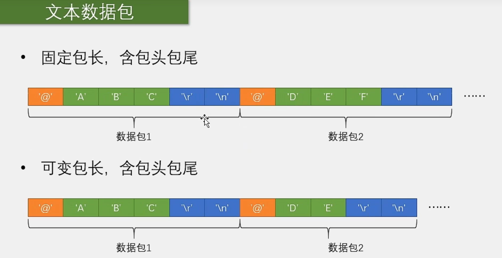

# 【9-4】USART串口数据包

## 数据包制定

**数据包作用：**

​	把一个个单独的数据给打包起来，方便我们进行多字节的数据通信。在实际应用中，我们很可能需要把多个字节打包为一个整体进行发送。

**HEX数据包**

​	优点：传输最直接，解析数据非常简单，比较适合一些模块发送原始的数据。比如一些使用串口通信的陀螺仪，温湿度传感器等等

​	缺点：灵活性不足。载荷容易和包头包尾重复

**文本数据包**

​	优点：数据直观易理解，非常灵活，比较适合一些输入指令进行人机交互的场合，比如蓝牙4G模块常用的AT指令，CNC和3D打印常用的G代码，都是文本数据包的格式

​	缺点：解析效率低，比如你发送一个数100，HEX就是数字100，文本包就是三个字符“1” “0” “0”，收到之后还要把字符转换成数据，才能得到100.

**总结：**

​	我们需要根据实际场景来选择和设计数据包格式。

## 数据包收发流程

### 数据包发送

很简单：

HEX：定义数组，填充数据，然后SendByte

文本：定义字符串，SendString

### 数据包接收：状态机

**HEX数据包接收**

**文本数据包接收**

