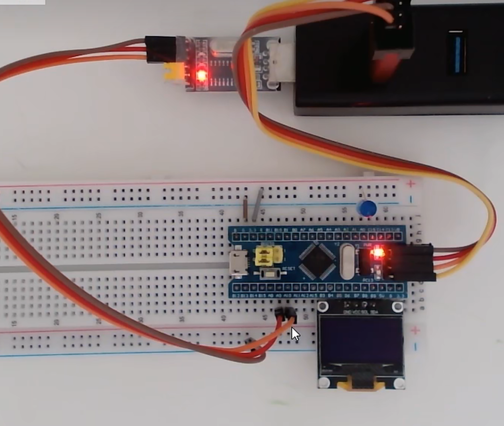

# 【9-6】FlyMcu & STLINK Utility

## FlyMcu

​	**相当于STM32版本的STC-ISP，就是给32烧录程序的**

### 串口下载流程：

​	1.硬件部分：使用CH340，接USART1，因为芯片仅适配了USART1的下载，下面是接线图：

​	2.软件部分：在Keil5里面生成Hex文件，流程和51单片机是一样的。

​	3.在Fly里面：搜索串口，找到端口号，然后默认波特率115200，然后选择HEX文件。

​	**但是在开始编程之前，我们还需要配置BOOT引脚，让STM32执行BootLoader程序，否则电机开始编程会一直卡住**：

​				1.拔掉STM32上面的跳线帽，该跳线帽是用来配置BOOT0引脚的，然后插在右边两个针脚，配置BOOT0为1，如下图：

&lt;img src="./assets/1703659233988.png" alt="1703659233988" style="zoom:50%;" /&gt;

​				2.一定要再按一下复位键，因为STM32只有在刚复位时才会读取BOOT引脚，程序运行之后，切换BOOT引脚是无效的.

​				那这样，芯片就进入BootLoader程序了。**此时STM32执行的程序就是;不断USART1的数据，刷新到主闪存。

​	4.然后就可以点击Fly里面的开始编程，这样就下载成功了，但是程序还没有执行烧录的代码，这是因为STM32还在下载模式，还需要：

​	5.拔掉BOOT0的跳线帽，换到左边两个引脚，然后按一下复位。这样就成功了。

### 引导问题

#### 串口下载原理

系统存储器里的BootLoader程序在接收来自串口的数据之后，原封不动的写到程序存储器Flash里面。而BootLoader本身就是一个程序，参考下面的比喻：

​	机器人给自己换电池，本身就需要内置一个小机器人，在需要换电池的时候就启动小机器人给大机器人换电池，换完电池之后小机器人停止运行再返回大机器人运行。

​	同理，STM32通过串口实现自我程序更新，就需要这样一个小机器人，这个小机器人就是BootLoader
