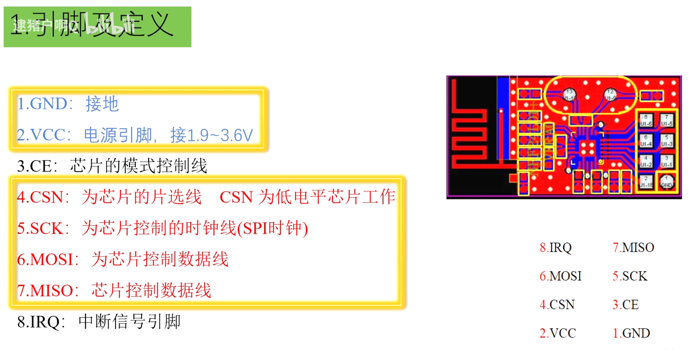
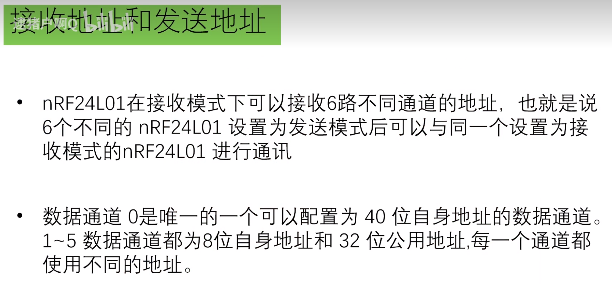
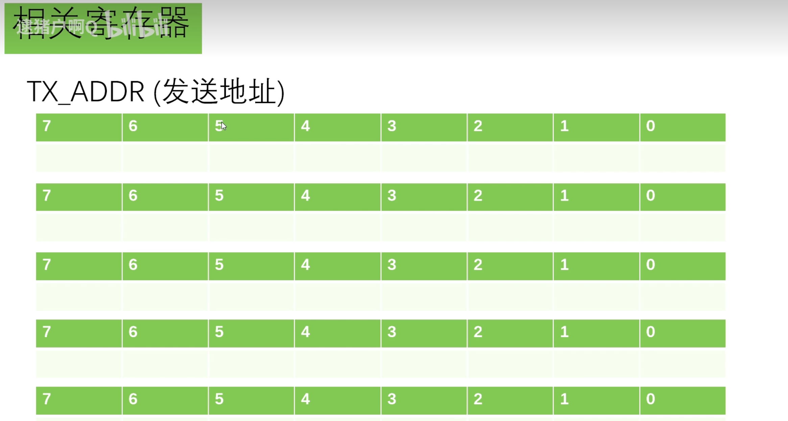
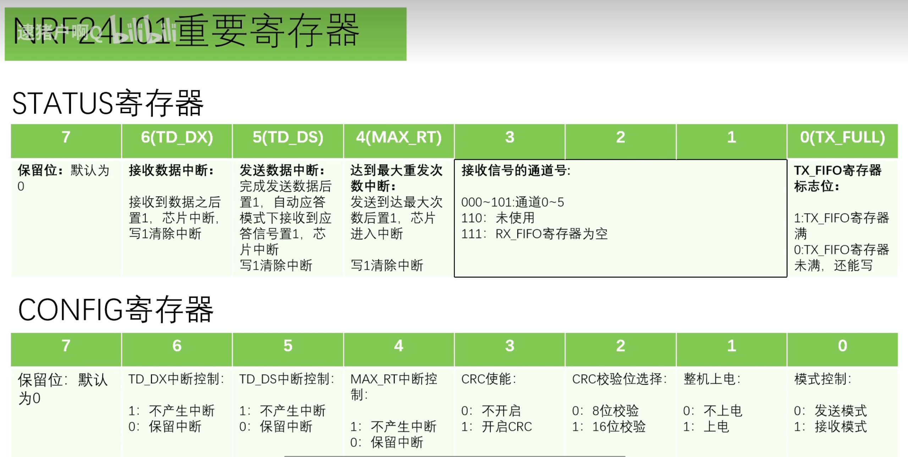
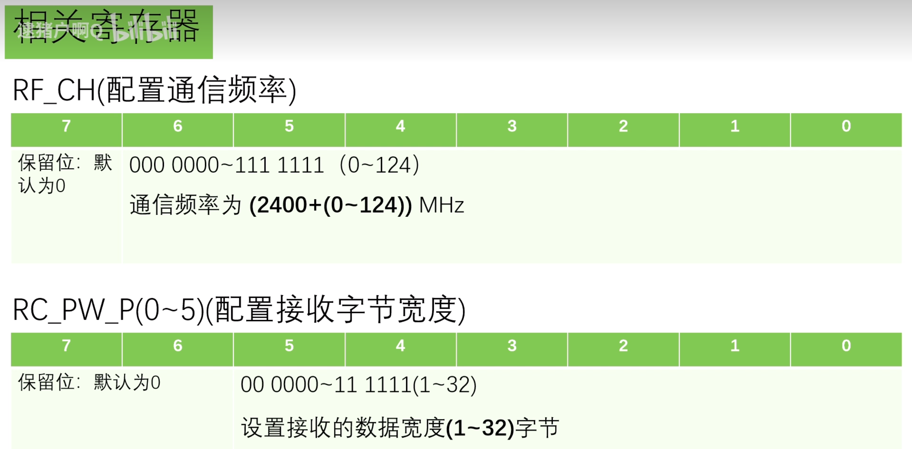
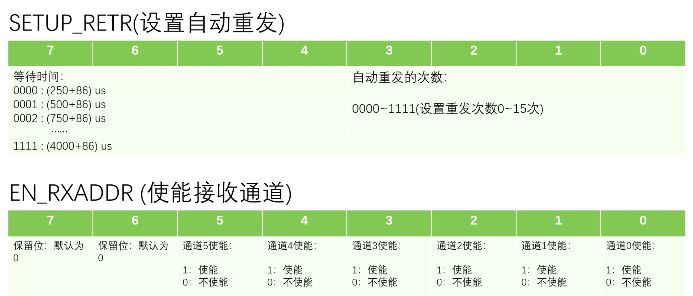
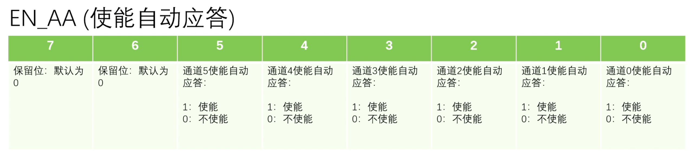
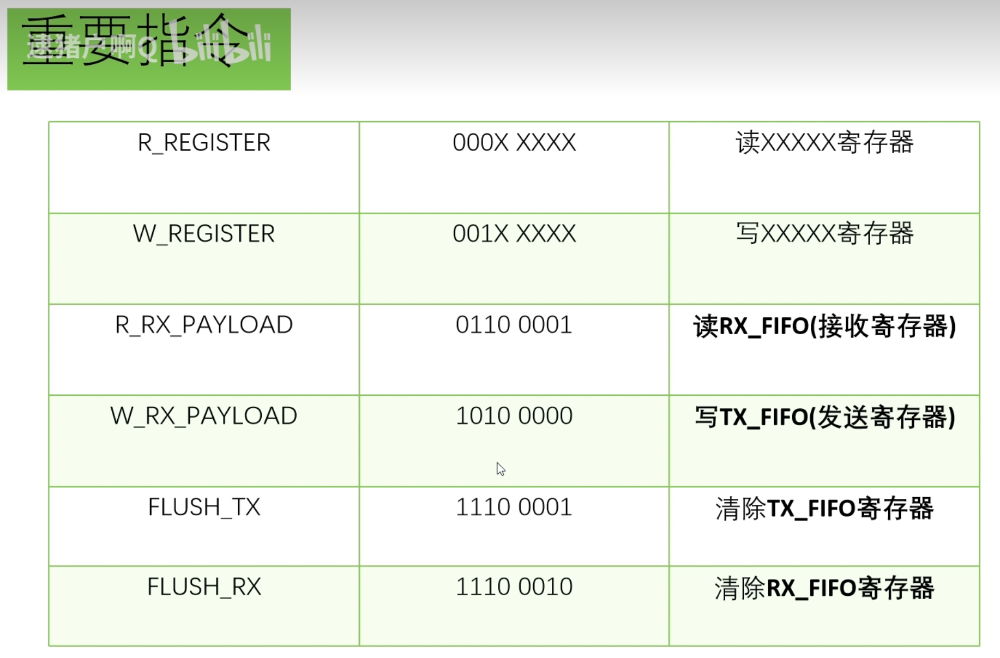

# 【番外】其他模块驱动学习

## 1.NRF24L01

#### 1.引脚定义

#### 2.工作原理

1.配置发送端的发送和接收地址

&lt;img src="./assets/image-20240430202806168.png" alt="image-20240430202806168" style="zoom:20%;" /&gt;

2.配置接收端的接收地址，要和发送端一致

&lt;img src="./assets/image-20240430202843400.png" alt="image-20240430202843400" style="zoom:25%;" /&gt;

3.配置config寄存器：控制芯片是属于发送还是接收状态：

​															最后一位是0则为发送状态，1为接收状态

&lt;img src="./assets/image-20240430203003099.png" alt="image-20240430203003099" style="zoom:25%;" /&gt;

​		这里都配置成了接收状态

4.配置EN_AA自动应答

​	这里开启了通道0的自动应答模式

&lt;img src="./assets/image-20240430203059867.png" alt="image-20240430203059867" style="zoom:25%;" /&gt;

5.往接收寄存器发送一个数据

&lt;img src="./assets/image-20240430203150393.png" alt="image-20240430203150393" style="zoom:25%;" /&gt;

6.使用CE引脚，作用相当于笔记本的待机按键，由主机控制，0时为待机状态

​		只有在待机状态下才能改变芯片的工作模式

​		所以这一步操作：CE置0，写入CONFIG寄存器为0000 1110，即发送模式

7.置CE引脚为1，此时芯片开机，发送模式，发送数据出去。

​	同时，芯片会自动将CONFIG最后一位置1（因为自动应答开启了）

8.接收端接收到数据，此时STATUS寄存器的第1位自动置1

&lt;img src="./assets/image-20240430203547774.png" alt="image-20240430203547774" style="zoom:25%;" /&gt;

9.芯片进入中断，IRQ被芯片拉低，提醒MCU该来拿数据了。

10.此时，接收端会记录接收到的这个数据的地址，然后拿这个地址作为发送地址再发送一个应答信号。所以这也就是为什么发送端也要配置接收地址的原因

11.发送端接收到应答信号以后，STATUS寄存器第2位自动置1，表示接收到应答信号了

&lt;img src="./assets/image-20240430203859477.png" alt="image-20240430203859477" style="zoom:25%;" /&gt;

​	同时芯片会进入中断，然后IRQ被芯片拉低，告诉MCU我发送出去了也接收到应答信号了。

以上就是发送一包数据包的简单流程。

#### 3.接收地址和发送地址

##### 相关寄存器

###### 1.TX_ADDR(发送地址)

###### 2.RX_ADDR_P0(接收地址0)

###### 3.RX_ADDR_P1(接收地址1)

RX_ADDR_P2(接收地址2)

RX_ADDR_P3(接收地址3)

RX_ADDR_P4(接收地址4)

RX_ADDR_P5(接收地址5)

#### 4.重要寄存器

#### 5.相关寄存器

 

#### 6.重要指令

