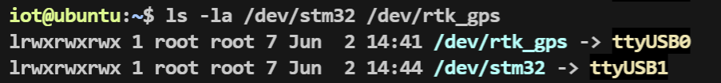

# 校园智巡 — 近一周进度汇报

> **汇报时间**：2026 年 6 月 2 日  
> **覆盖周期**：2026.05.26 — 2026.06.02

---

## 一、本周完成工作

### 1. USB 串口设备固定绑定方案落地

**问题背景**：Xavier NX 同时连接 STM32 下层控制板和 UM982 RTK GPS 模块，两者均使用 CH340 芯片（VID/PID 完全一致且无唯一序列号），系统分配的 `/dev/ttyUSB0`、`/dev/ttyUSB1` 编号在重启或拔插后会随机互换，导致程序打开错误的串口。

**解决方案**：通过 udev 规则，利用物理 USB 端口路径（`KERNELS` 属性）为每个设备创建固定符号链接：

- STM32 下层板 → `/dev/stm32`（端口路径 `1-2.4`）
- RTK GPS (UM982) → `/dev/rtk_gps`（端口路径 `1-2.2`）

udev 规则文件 `/etc/udev/rules.d/99-usb-serial.rules`：

```bash
# STM32 下层板 (插在 USB 口 1-2.4)
SUBSYSTEM=="tty", KERNELS=="1-2.4", ATTRS{idVendor}=="1a86", ATTRS{idProduct}=="7523", SYMLINK+="stm32", MODE="0666"

# RTK GPS UM982 (插在 USB 口 1-2.2)
SUBSYSTEM=="tty", KERNELS=="1-2.2", ATTRS{idVendor}=="1a86", ATTRS{idProduct}=="7523", SYMLINK+="rtk_gps", MODE="0666"
```

**成果**：ROS2 launch 文件中统一使用 `/dev/stm32` 和 `/dev/rtk_gps`，彻底消除串口漂移问题。规则持久化存储，重启自动生效。已编写完整操作文档并归档。



---

### 2. ROS2 跨设备 DDS 组播通信配置

**目标**：在 Windows 侧 WSL2 的 RViz2 中实时显示远端 Jetson Xavier NX 上 ROS2 发布的话题（LiDAR 点云、TF、地图等），实现开发调试可视化。

**网络拓扑**：

```
Windows 11 (WSL2 Ubuntu 22.04, eth2: 192.168.3.182)
        │
    WiFi 局域网 192.168.3.0/24
        │
Jetson Xavier NX (wlan0: 192.168.3.214)
  └── Docker 容器 (--network=host, ROS2 Humble)
```

**关键配置项**：

|配置项|设定值|说明|
|---|---|---|
|`ROS_DOMAIN_ID`|6（两侧统一）|发现端口 = 7400 + 250 × 6 = 8900|
|`ROS_LOCALHOST_ONLY`|0（两侧统一）|允许跨设备发现|
|Windows 防火墙|放行 UDP 7400-65535 入站|解决组播包被拦截的问题|
|Docker 网络模式|`--network=host`|容器共享宿主机网络栈|

**成果**：WSL2 RViz2 可正常订阅并可视化 Jetson 发布的全部 ROS2 话题，开发调试效率显著提升。已编写完整配置指南并归档，包含抓包验证方法和常见问题排查流程。

---

### 3. Nav Console Web 控制台开发与部署

**定位**：基于 React + 高德地图 + rosbridge WebSocket 的远程导航控制台，在局域网内通过浏览器即可对机器人进行监控和操控。

**系统架构**：

```
上位机浏览器 (Nav Console)  ←— WebSocket :9090 —→  Xavier NX (rosbridge + Nav2)
```

**已实现功能**：

|功能模块|说明|
|---|---|
|高德地图集成|地图显示、WGS84→GCJ02 自动坐标转换|
|机器人状态显示|订阅里程计 `/odometry/filtered`、GPS `/gps/fix`|
|航点规划与发送|地图点击生成目标点，发布至 `/goal_pose`|
|手动遥控|通过 `/cmd_vel` 发送速度指令|
|局部代价地图|实时叠加显示 `/local_costmap/costmap`|
|导航状态监控|订阅 Nav2 action status|

**部署方案**：

- 开发模式：`npm run dev`，Vite HMR 热更新
- 生产模式：`npm run build` → scp 至 Xavier NX → nginx 静态托管（端口 8080），机器人上电后局域网任意设备可访问
- rosbridge 配置为 systemd 服务，开机自启

**代码仓库**：`https://github.com/ana52070/carplannning-web`

**成果**：控制台已完成开发，可在局域网内通过浏览器远程监控机器人状态、规划航点并发送导航目标。已编写完整的部署手册并归档。

---

## 二、本周工作量汇总

|工作项|产出|
|---|---|
|USB 设备固定绑定|udev 规则 + 操作文档|
|DDS 跨设备通信|完整配置方案 + 排查指南|
|Nav Console 控制台|React Web 应用 + nginx 部署 + rosbridge systemd 服务|
|技术文档归档|3 篇完整指南文档（已录入 wiki）|

---

## 三、当前系统整体状态

|子系统|状态|
|---|---|
|硬件平台（Xavier NX + Docker ROS2 Humble）|✅ 就绪|
|UM982 RTK GPS 驱动|✅ 已部署，CPU 占用已优化至 ~10%|
|Livox Mid-360 LiDAR 驱动|✅ 已部署|
|USB 设备绑定（STM32 + RTK）|✅ 已固定|
|跨设备 RViz2 可视化|✅ 已打通|
|Nav Console Web 控制台|✅ 已完成开发与部署|
|rosbridge WebSocket 服务|✅ 开机自启|
|Nav2 导航栈集成|🔧 基础框架就绪，待实际路测调参|
|底盘电机闭环控制|🔧 STM32 串口通信已通，待联调|
|坐标系统对齐（GPS→map frame）|⚠️ Nav Console 的 sendGoal 为占位实现，需对接 navsat_transform|

---

## 四、下一步计划

### 近期（1-2 周）

1. **Nav2 实车路测与调参**：在校园实际环境中进行导航测试，调整 Nav2 的 planner/controller 参数（速度限制、障碍物膨胀半径、路径平滑等），确保机器人能在校园道路上稳定自主行驶。
    
2. **坐标系统对齐**：对接 `robot_localization` 的 `navsat_transform` 节点，将 GPS WGS84 坐标正确转换为 Nav2 使用的 map frame 局部坐标，替换 Nav Console 中当前的占位 sendGoal 逻辑。
    
3. **底盘联调**：完成 STM32 下层控制板与 Nav2 的 `/cmd_vel` → 电机转速闭环联调，验证差速驱动的线速度/角速度响应精度。
    

### 中期（3-4 周）

4. **多航点巡航功能**：在 Nav Console 中实现多航点顺序导航，支持任务队列的创建、暂停、恢复。
    
5. **LiDAR 局部避障优化**：结合 Livox Mid-360 点云数据优化局部代价地图的障碍物检测，测试动态避障效果。
    
6. **系统稳定性与异常恢复**：完善各节点的异常处理和自动重连机制，确保长时间运行的可靠性。
    

---

_文档生成时间：2026-06-02_