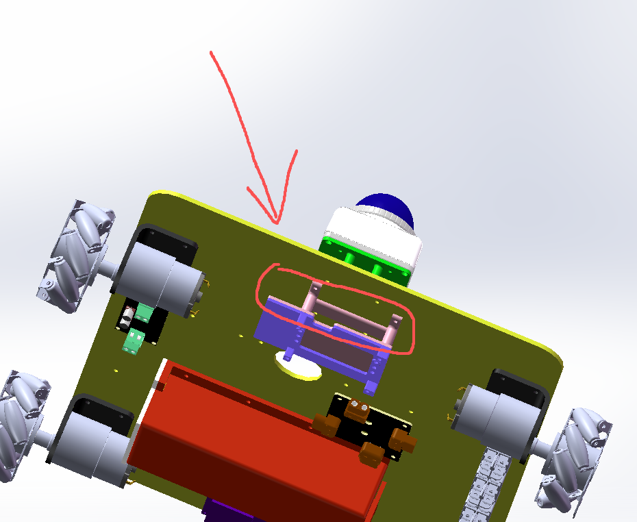
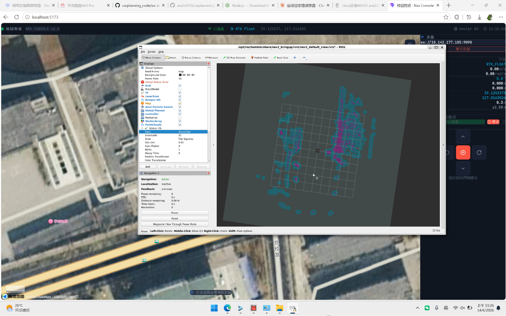
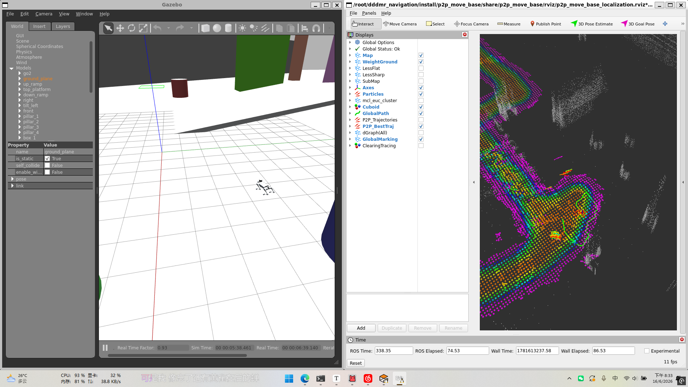
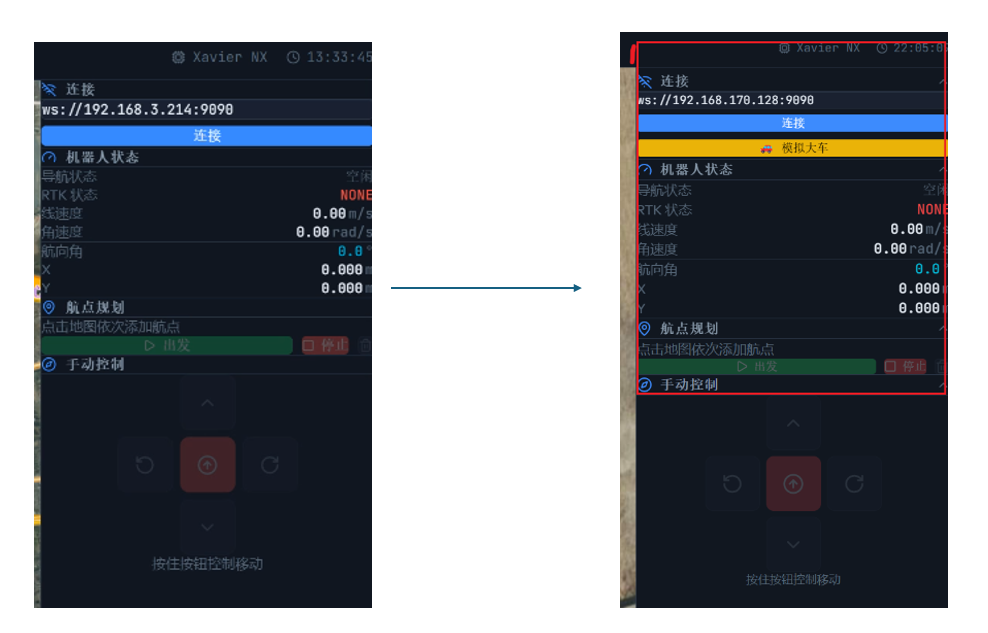
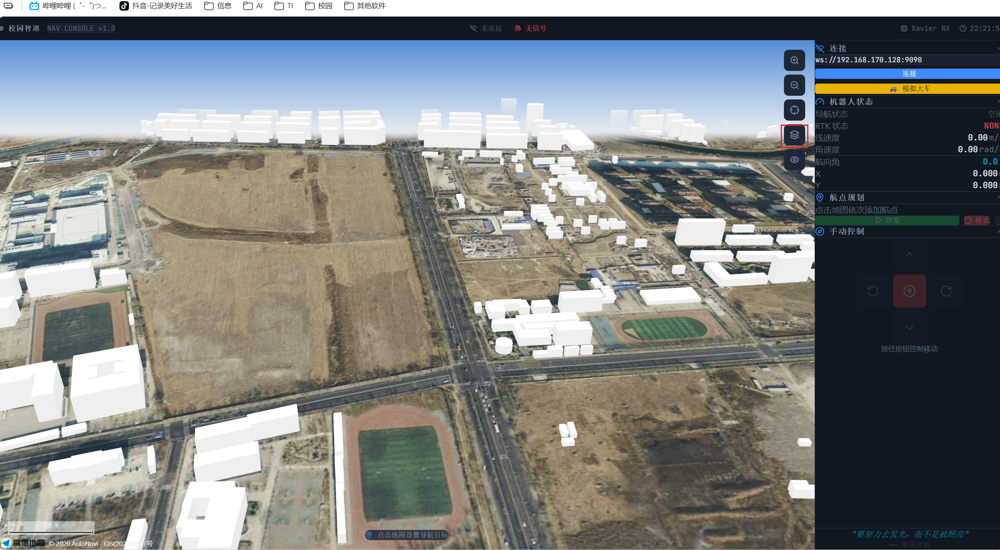
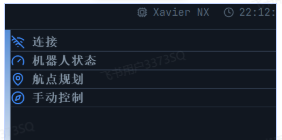
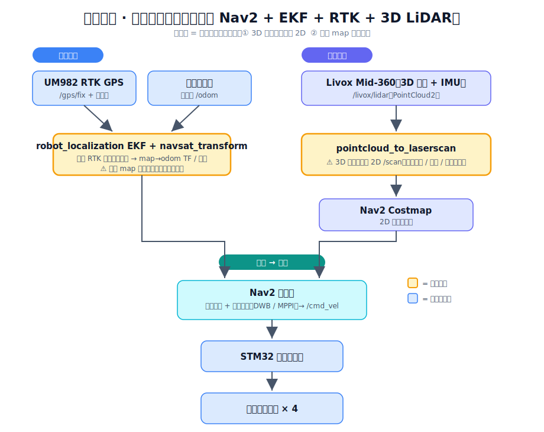
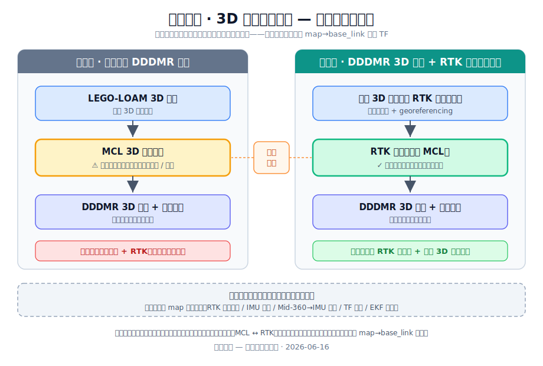

# 校园智巡 — 近一周进度汇报

> **汇报时间**：2026 年 6 月 16 日
> **覆盖周期**：2026.06.03 — 2026.06.16

---

## 一、本周完成工作

### 1. 新增「ROS 下层板连接件」3D 打印件（散热隔离）

**问题背景**：原结构将 Livox Mid-360 雷达与 ROS 下层控制板贴合放置。Mid-360 工作时发热量大，热量直接传导至下层板，触发其高温温控保护，导致下层板停止工作、小车失控。

**解决方案**：设计并 3D 打印了一个连接件，将 Mid-360 与下层板在结构上隔开，使两者不再直接接触，切断了热传导路径。

**成果**：下层板不再因雷达发热而触发温控，运行稳定性问题得到根本解决。




---

### 2. ROS 上层与下层控制对齐

本周打通了上层 ROS 与下层控制板之间的控制一致性，为后续 Nav2 精确控制打基础。

- **（1）下层板运动方向与编码器对齐**：修改下层板代码与接线，校正小车前 / 后 / 左 / 右的运动方向顺序，使编码器测值正确、与实际运动一致。
- **（2）里程计参数标定**：修正小车的轮距、轮轴等机械参数，使上层 ROS 里程计输出与真实运动对齐，保证后续 Nav2 控制中位姿估计准确。


---

### 3. 实车测试

完成首轮整车联调测试，结果如下：

| 测试项 | 结果 |
| --- | --- |
| 小车与 Web 网页端连接 | ✅ 基本连通 |
| 手动遥控控制 | ✅ 正常 |
| map 地图定位 | ⚠️ **严重漂移**，初步推测为 EKF 卡尔曼滤波融合环节存在问题（待进一步确诊） |

> 说明：map 漂移的具体根因（EKF 调参 / 传感器外参 / IMU 质量 / TF 对齐 / RTK 原始数据）尚未定位，下周将优先排查，详见第二节技术路线讨论。





==见：演示视频1：实车测试==


---

### 4. 技术路线调研：引入开源项目 DDDMR

针对当前「手动魔改 Nav2 + EKF + RTK + 3D LiDAR」方案在 3D 感知与规划上的局限，本周调研并初步试用了开源 3D 导航项目 **DDDMR（3D Mobile Robot Navigation）**。

- 开源项目地址：<https://github.com/dfl-rlab/dddmr_navigation>
- **进展**：搭建完成 DDDMR 仿真环境，成功跑起四足机器狗仿真 demo，但仍存在部分问题，后续继续完善与排查。
- 关于是否切换到该方案，详见第二节专门讨论。




==见：演示视频2：DDDMR仿真测试==

---

### 5. 购置深度相机

采购了一台深度相机，计划用于加强 3D 感知 / 视觉方向的突破，可与 DDDMR 的感知 / 语义分割模块（集成 YOLO11）配合使用。

目前已经发货


---

### 6. Web 端优化==（王帅）==

- 优化 Nav Console 上位机 UI。




- 新增楼块图（建筑物轮廓图层），提升地图可读性与定位参考。



- 新增按键“纯净UI”点击后可显示纯净板视图并且找到小车当前位置。新增功能，整理右侧功能区块，可点击隐藏。



==见：演示视频3：web优化==


---

## 二、技术路线讨论：是否引入 DDDMR

本周对「是否将主线从魔改 Nav2 切换到 DDDMR」进行了较深入的讨论与论证。以下记录推演历程，供老师参考决策。

### 2.1 起因：现方案的核心痛点

现方案使用 Nav2，需将 Mid-360 的 3D 点云**降维投影为 2D 激光扫描**再喂给导航栈。这一步是有损的——障碍感知被压扁到平面，台阶、低矮障碍、立体结构信息丢失；且实车测试出现 map 严重漂移。当前方案的数据流与两处痛点如下图所示：



由此产生了引入原生 3D 导航框架 DDDMR 的想法。

### 2.2 对 DDDMR 的认识：它与本项目的范式冲突

调研后发现，DDDMR 与本项目当前定位在设计哲学上是**相反**的：

| 维度 | 本项目现方案 | DDDMR 原生 |
| --- | --- | --- |
| 地图 | **无需预先建图** | **必须先用 LEGO-LOAM 建好 3D 点云地图** |
| 定位 | RTK 厘米级全局定位 | **MCL 3D 点云匹配**（蒙特卡洛定位） |
| 设计目标场景 | 室外开阔、卫星可见 | **GPS-denied（无卫星）、室内多层 / 坡道 / 立体结构** |

也就是说，DDDMR 的定位不依赖 GPS，而是依赖「在预建 3D 地图中做点云匹配」。

### 2.3 关键风险：MCL 在本项目室外场景可能是短板

DDDMR 的 MCL 定位需要环境有足够几何特征来对齐点云。而本项目场景是**校园室外开阔硬化路面**——点云稀疏、特征少，MCL 容易无法收敛或漂移；这恰恰是 RTK 最擅长、最该使用的场景。因此「直接用 DDDMR 的 MCL 取代 RTK」在本项目场景下风险较高。

### 2.4 核心洞察：定位层本质上只是产出一个 TF

进一步分析发现：导航栈中「定位」这一层，本质上只是产出一个 `map → base_link` 的坐标变换（机器人在地图中的位姿）。下游的 3D 规划器**不关心这个位姿来自 MCL 还是 RTK**，只要能稳定提供即可。

这意味着：**可以把 DDDMR 的 MCL 模块摘掉，用 RTK 来产出这个 TF**，从而既拿到 DDDMR 的原生 3D 规划能力，又规避 MCL 在开阔地的弱点、保留本项目 RTK 的核心优势。

### 2.5 明确诉求：要的是「规划层」的 3D，而不仅是「感知层」

讨论中厘清了一点——所谓「想要 3D」其实是两件事：
- **3D 感知 / 局部避障**：障碍物不再被压扁（这部分其实在现有 Nav2 上用 `spatio_temporal_voxel_layer` 体素层也能解决）；
- **3D 全局路径规划**：在三维空间结构中规划路径（上下坡、立体场景）。

本项目的真实诉求是**后者——三维空间的路径规划**。而 DDDMR 的 3D 全局规划器是在预建 3D 点云地图上规划的，因此「预先建一张 3D 地图」这一步无法绕开。

---

## 三、两个候选方案（待定夺）

基于上述讨论，整理出两条可行路线，各有取舍，请老师定夺。两方案的「建图层」与「规划层」完全相同，**唯一差异在定位层**（MCL ↔ RTK），如下图所示：



### 方案一：全面采用 DDDMR 原生路线

```
LEGO-LOAM 3D 建图  →  MCL 3D 点云定位  →  DDDMR 3D 全局 + 局部规划
```

- **优点**：框架原生闭环，改动最小；直接获得完整 3D 导航与多层 / 坡道 / 立体结构能力；可充分利用新购深度相机做语义感知。
- **代价 / 风险**：
  - 放弃「无图 + RTK」定位，项目核心定位需重写；
  - **MCL 在校园室外开阔路面特征稀疏，存在定位不收敛 / 漂移风险**（RTK 本擅长的场景反被舍弃）；
  - DDDMR 为小型实验室研究项目，社区与文档相对薄弱，调试成本较高。

### 方案二：DDDMR 3D 建图与规划 + RTK 替换 MCL 定位（混合魔改）

```
预先用 LEGO-LOAM 建一张与 RTK 坐标对齐的 3D 地图（一次性）
   →  RTK 产出 map→base_link（替代 MCL）
   →  DDDMR 3D 全局 + 局部规划
```

- **核心思想**：定位层只是产出 TF，由 RTK 来产出即可；以此绕开 MCL 在开阔地的弱点，同时保留本项目 RTK 厘米级定位的护城河，并获得真正的 3D 规划能力。
- **优点**：
  - 保留 RTK 全局定位优势，室外稳健；
  - 满足「三维空间路径规划」的核心诉求；
  - 仍可复用深度相机与 3D 感知。
- **代价 / 风险**：
  - 不再是「无图」，定位变为「预建 3D 地图 + RTK 定位 + 3D 规划」（属户外自动驾驶常见架构，但项目定位表述需调整）；
  - 需将 DDDMR 的 MCL 模块摘除、自行编写 RTK→map 节点，并保证**预建 3D 地图坐标系与 RTK 世界坐标对齐**（地图配准 / georeferencing），集成有一定工作量。

> **共同前提**：无论选择哪条路线，当前 map 漂移的根因排查都需优先完成——若漂移源于外参 / IMU / TF / RTK 原始数据，问题会同样带入新方案，需先确诊。

---

## 四、当前系统整体状态

| 子系统                                  | 状态                              |
| ------------------------------------ | ------------------------------- |
| 硬件平台（Xavier NX + Docker ROS2 Humble） | ✅ 就绪                            |
| UM982 RTK GPS 驱动                     | ✅ 已部署                           |
| Livox Mid-360 LiDAR 驱动               | ✅ 已部署                           |
| Mid-360 / 下层板散热隔离                    | ✅ 已加 3D 打印连接件解决                 |
| 上下层控制对齐（方向 / 编码器 / 里程计参数）            | ✅ 已对齐                           |
| Web 网页端连接与手动控制                       | ✅ 实车验证通过                        |
| Nav Console Web 控制台（UI + 楼块图）        | ✅ 已优化                           |
| 深度相机                                 | ✅ 已购置，待接入                       |
| map 定位（EKF 融合）                       | ⚠️ 实车严重漂移，根因待确诊                 |
| 主线导航技术路线                             | 🔧 在「魔改 Nav2」与「DDDMR + RTK」之间评估 |
| DDDMR 仿真环境                           | 🔧 demo 已跑通，存在问题待排查             |

---

## 五、下一步计划

1. **确诊 map 漂移根因**：逐层排查 RTK 原始数据抖动、IMU 静止噪声、Mid-360→IMU 外参、TF 对齐与 EKF 协方差，定位是融合问题还是传感器 / 标定问题（无论是否换方案都需完成）。
2. **推进技术路线决策**：与老师确认方案一 / 方案二取向；优先验证 DDDMR 在**真实室外开阔场地**的定位与规划可行性，作为去 / 留的判定依据。
3. **继续排查 DDDMR 仿真问题**，完善四足 demo，并尝试切换为差速底盘模型。
4. **深度相机接入**：完成驱动与话题验证，为 3D 感知 / 语义避障做准备。

---

_文档生成时间：2026-06-16_
