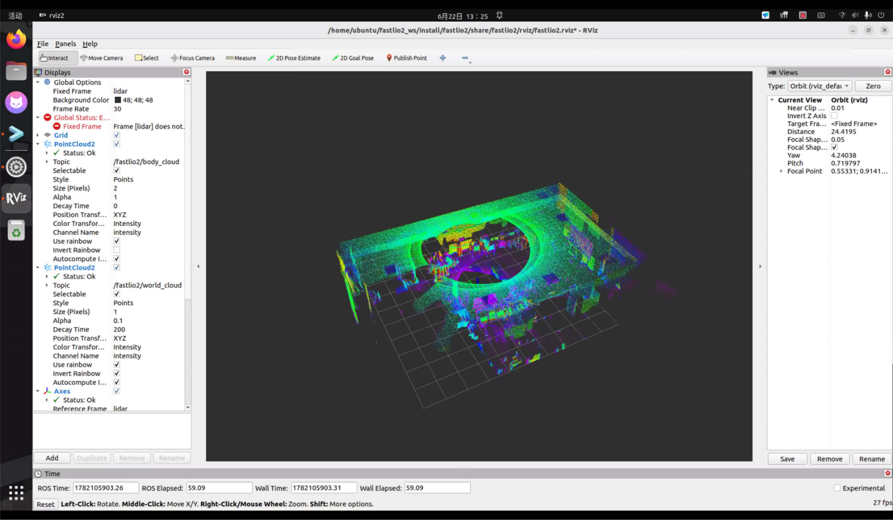
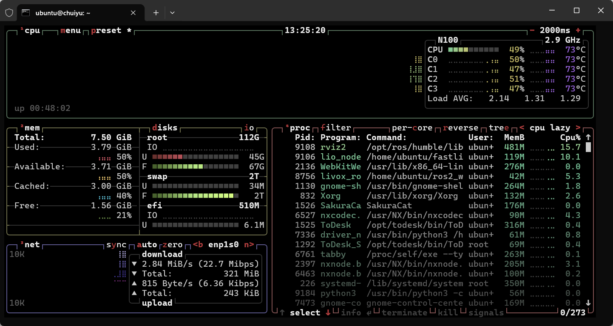
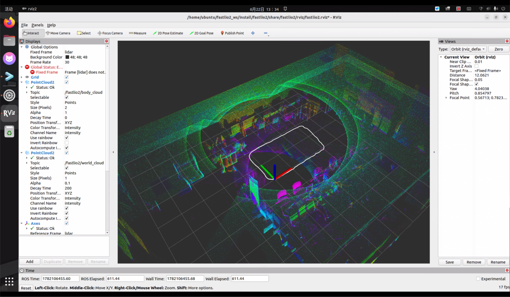
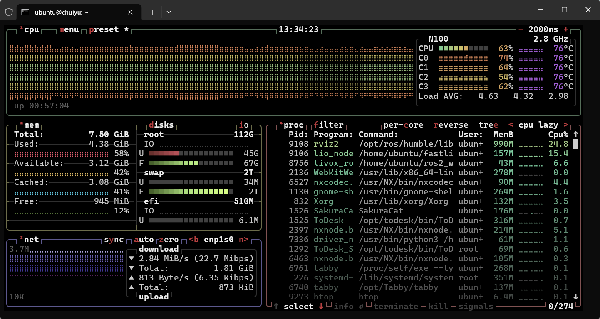

# FASTLIO2_ROS2 实战使用指南

> **针对项目**：校园智巡 v2（N100 + Livox Mid-360 + UM982 RTK + Nav2 无图导航）  
> **前提**：FASTLIO2_ROS2 已在 N100 上编译通过，rosbag 回放已跑通

---

## 第一步：理解 liangheming 版本的配置结构

liangheming 的 FASTLIO2_ROS2 配置文件路径：

```bash
# 查看核心配置文件
cat ~/fastlio2_ws/install/fastlio2/share/fastlio2/config/lio.yaml

# 查看 launch 文件
cat ~/fastlio2_ws/install/fastlio2/share/fastlio2/launch/lio_launch.py
```

你需要关注两件事：

1. `lio.yaml` 中的 LiDAR 类型、IMU 参数、外参、话题名
2. `lio_launch.py` 中的话题 remap 和 TF 发布行为

先把原始配置看一遍，然后再改。

---

## 第二步：修改 FASTLIO2 配置适配你的硬件

### 2.1 编辑配置文件

建议不要直接改 install 目录下的文件，而是在源码中改完重新 build：

```bash
cd ~/fastlio2_ws/src/FASTLIO2_ROS2/fastlio2/config/
cp lio.yaml lio.yaml.bak    # 备份原始配置
vim lio.yaml
```

需要修改的关键参数：

```yaml
# ============ LiDAR 配置 ============
# liangheming 版本默认应该已经适配 Mid-360
# 确认以下值：
lidar_type: 1              # 1 = Livox 自定义消息
scan_line: 4               # Mid-360 扫描线数
blind: 0.5                 # 忽略 0.5m 内的点（防止打到车体）

# ============ 降采样 ============
filter_size_surf: 0.3      # 先用默认值，后续根据 CPU 占用调整
filter_size_map: 0.3       # 地图体素大小

# ============ IMU 参数（关键！）============
# 你的底盘 IMU 是低成本 MEMS，噪声比默认值大
# 需要放大协方差，让 FAST-LIO2 "信任" IMU 的程度降低
acc_cov: 0.5               # 加速度计噪声（默认可能是 0.1，底盘 IMU 建议放大）
gyr_cov: 0.5               # 陀螺仪噪声（同理放大）
b_acc_cov: 0.001           # 加速度计零偏随机游走
b_gyr_cov: 0.001           # 陀螺仪零偏随机游走

# ============ LiDAR-IMU 外参 ============
# IMU 在底盘中心 (base_link 原点)
# LiDAR 在底盘前方 0.14m，高 0.12m
# 这里是 IMU → LiDAR 的变换
extrinsic_T: [0.14, 0.0, 0.12]
extrinsic_R: [1, 0, 0,
              0, 1, 0,
              0, 0, 1]
# 注意：旋转矩阵取决于 IMU 和 LiDAR 的坐标系定义
# Mid-360 的坐标系：X前 Y左 Z上
# 如果底盘 IMU 也是 X前 Y左 Z上，则旋转为单位矩阵
# 如果不确定，先用单位矩阵跑，看直线行驶时轨迹是否弯曲来判断

# ============ 地图管理 ============
cube_side_length: 200       # 200m 局部地图，校园场景足够
max_iteration: 3            # iterated EKF 迭代次数，3 次通常够
```

### 2.2 确认话题名映射

查看 launch 文件中话题名是否与你的传感器匹配：

```bash
cat ~/fastlio2_ws/src/FASTLIO2_ROS2/fastlio2/launch/lio_launch.py
```

需要确保：

- LiDAR 点云话题指向 `/livox/lidar`（你的 livox_ros_driver2 发布的话题）
- IMU 话题指向 `/imu/data_raw`（你的底盘发布的话题）

如果 launch 文件中的话题名与实际不同，有两种改法：

**方法 A：在 launch 文件中 remap（推荐）**

```python
# 在 launch 文件的 Node 定义中添加 remappings
Node(
    package='fastlio2',
    executable='lio_node',
    name='lio_node',
    namespace='fastlio2',
    remappings=[
        ('/livox/lidar', '/livox/lidar'),       # 确认一致
        ('/imu/data_raw', '/imu/data_raw'),     # 确认一致
    ],
    # ...
)
```

**方法 B：直接在 yaml 中改话题名**（如果 yaml 里有话题配置项的话）

### 2.3 关键：禁止 FAST-LIO2 发布 TF

在你的架构中，TF 树由 EKF 统一管理。FAST-LIO2 不能发布 TF，否则会和 EKF 冲突。

检查 launch 文件或配置文件中是否有 `publish_tf` 类似参数，确保设为 `false`。如果 liangheming 的版本没有这个开关，你可能需要在源码中注释掉 TF 广播。

查找方法：

```bash
cd ~/fastlio2_ws/src/FASTLIO2_ROS2
grep -rn "tf" fastlio2/src/ --include="*.cpp" | grep -i "broadcast\|transform\|sendTransform"
```

### 2.4 重新编译

改完配置后：

```bash
cd ~/fastlio2_ws
colcon build --symlink-install --cmake-args -DCMAKE_BUILD_TYPE=Release
source install/setup.bash
```

用了 `--symlink-install` 后，后续修改 yaml/launch 不需要重新编译。

---

## 第三步：验证 FAST-LIO2 单独工作

在接入 EKF 之前，先单独验证 FAST-LIO2 输出是否正确。

### 3.1 实车测试流程

```bash
# 终端 1：启动底盘驱动（提供 /imu/data_raw）
ros2 launch <你的底盘启动命令>

# 终端 2：启动 Livox Mid-360
ros2 launch livox_ros_driver2 msg_MID360_launch.py

# 终端 3：启动 FAST-LIO2
source ~/fastlio2_ws/install/setup.bash
ros2 launch fastlio2 lio_launch.py

# 终端 4：观察输出
ros2 topic list | grep -E "lio|odom|cloud"
ros2 topic hz /fastlio2/lio_odom    # 确认 10Hz 左右
ros2 topic echo /fastlio2/lio_odom --field pose.pose.position --once
```

注意：liangheming 的版本使用了 namespace `fastlio2`，所以话题名可能是 `/fastlio2/lio_odom` 而不是 `/lio_odom`，需要确认。




```
ubuntu@chuiyu:~$ ros2 topic list | grep -E "lio|odom|cloud"
/fastlio2/body_cloud
/fastlio2/lio_odom
/fastlio2/lio_path
/fastlio2/world_cloud
/odom
ubuntu@chuiyu:~$ ros2 topic hz /fastlio2/lio_odom
WARNING: topic [/fastlio2/lio_odom] does not appear to be published yet
average rate: 9.955
        min: 0.093s max: 0.108s std dev: 0.00513s window: 12
average rate: 9.971
        min: 0.093s max: 0.109s std dev: 0.00486s window: 23
average rate: 9.985
        min: 0.090s max: 0.112s std dev: 0.00587s window: 34
^Cubuntu@chuiyu:~ros2 topic echo /fastlio2/lio_odom --field pose.pose.position --oncece
x: 0.004496618635243248
y: -0.030676632983533215
z: -0.0008063519423287689
---
ubuntu@chuiyu:~$ 
```

### 3.2 验证项目清单

用手推车缓慢移动测试以下场景：

|测试|操作|预期结果|问题排查|
|---|---|---|---|
|静止稳定性|车不动，观察 30 秒|位姿不漂移，xyz 变化 < 1cm|如果漂移，检查 IMU 噪声参数是否太小|
|直线前进|推车直走 5m|RViz 轨迹为直线|如果弯曲，外参旋转矩阵有问题|
|原地旋转|原地转 360°|回到起点位姿基本一致|如果有角度偏差，检查 gyro 参数|
|往返|走出去再走回来|回到起点误差 < 10cm|大于 10cm 说明匹配退化|

### 3.3 在 RViz2 中观察

FAST-LIO2 的 launch 文件通常会自带 RViz2 配置。如果没有，手动添加：

- **PointCloud2**：订阅 `/fastlio2/cloud_registered`（配准后点云）
- **Odometry**：订阅 `/fastlio2/lio_odom`（显示位姿箭头）
- **Path**：如果有路径话题，也加上
- **Fixed Frame**：设为 FAST-LIO2 的 odom frame（通常是 `odom` 或 `camera_init`）






---

## 第四步：接入 EKF 融合

验证 FAST-LIO2 单独工作正常后，接入你的 EKF 融合框架。

### 4.1 修改 ekf.yaml

```yaml
frequency: 10.0
two_d_mode: true
sensor_timeout: 0.5

# odom_frame 和 base_link_frame 需要与你的 TF 树一致
odom_frame: odom
base_link_frame: base_link
world_frame: odom
map_frame: map

# --- odom0: FAST-LIO2 LiDAR 里程计 ---
# 注意话题名可能带 namespace
odom0: /fastlio2/lio_odom
odom0_config: [false, false, false,    # 不融合绝对位置（交给 GPS）
               false, false, false,    # 不融合姿态角
               true,  true,  false,    # 融合 vx, vy
               false, false, true,     # 融合 vyaw
               false, false, false]

# FAST-LIO2 的里程计 frame 可能与你的不一致
# 需要确认 /fastlio2/lio_odom 中的 header.frame_id 和 child_frame_id
# 如果 frame_id 不是 "odom"，需要设置：
odom0_differential: false

# --- odom1: GPS 绝对位置 ---
odom1: /odometry/gps
odom1_config: [true,  true,  false,    # x, y
               false, false, true,     # yaw (双天线)
               false, false, false,
               false, false, false,
               false, false, false]
```

### 4.2 frame_id 对齐（最容易出问题的地方）

这是集成中最关键也最容易踩坑的部分。运行以下命令检查 FAST-LIO2 输出的 frame：

```bash
ros2 topic echo /fastlio2/lio_odom --field header.frame_id --once
ros2 topic echo /fastlio2/lio_odom --field child_frame_id --once
```

liangheming 版本可能输出的是 `camera_init` → `body` 这样的 frame 名称。但你的 EKF 期望的是 `odom` → `base_link`。

**解决方案：在 launch 中重映射 frame**

有几种处理方法：

1. **在 FAST-LIO2 的 yaml 中改 frame 名**（如果有这个配置项）
2. **写一个 relay 节点转换 frame_id**（类似你之前给轮式里程计做的 covariance_relay）
3. **在 EKF 中设置 `odom0_differential: true`**，这样 EKF 只看增量不看绝对 frame

推荐方案 3，最简单：

```yaml
odom0: /fastlio2/lio_odom
odom0_differential: true     # EKF 只取增量，不关心 frame 名
odom0_config: [false, false, false,
               false, false, false,
               true,  true,  false,    # vx, vy
               false, false, true,     # vyaw
               false, false, false]
```

### 4.3 协方差检查

检查 FAST-LIO2 输出的协方差矩阵是否合理：

```bash
ros2 topic echo /fastlio2/lio_odom --field pose.covariance --once
ros2 topic echo /fastlio2/lio_odom --field twist.covariance --once
```

如果协方差全零（和你底盘的轮式里程计一样），EKF 会认为 FAST-LIO2 "无限精确"，GPS 修正完全失效。这种情况下你需要像 v1 一样写一个 relay 节点注入合理的协方差：

```python
# lio_odom_relay.py（仅在协方差全零时需要）
import rclpy
from rclpy.node import Node
from nav_msgs.msg import Odometry

class LioOdomRelay(Node):
    def __init__(self):
        super().__init__('lio_odom_relay')
        self.sub = self.create_subscription(Odometry, '/fastlio2/lio_odom', self.cb, 10)
        self.pub = self.create_publisher(Odometry, '/lio_odom/relay', 10)

    def cb(self, msg):
        # 注入合理的协方差
        # FAST-LIO2 位置精度约 1cm，速度精度约 1cm/s
        # 位姿协方差
        msg.pose.covariance[0]  = 0.001    # x  (1cm² = 0.0001, 保守给 0.001)
        msg.pose.covariance[7]  = 0.001    # y
        msg.pose.covariance[14] = 0.01     # z  (不太关心)
        msg.pose.covariance[21] = 0.01     # roll
        msg.pose.covariance[28] = 0.01     # pitch
        msg.pose.covariance[35] = 0.0003   # yaw (0.1°² ≈ 0.0003)
        # 速度协方差
        msg.twist.covariance[0]  = 0.001   # vx
        msg.twist.covariance[7]  = 0.001   # vy
        msg.twist.covariance[35] = 0.001   # vyaw
        self.pub.publish(msg)

def main():
    rclpy.init()
    rclpy.spin(LioOdomRelay())

if __name__ == '__main__':
    main()
```

如果用了 relay，EKF 的 odom0 改为 `/lio_odom/relay`。

---

## 第五步：完整系统联调

### 5.1 启动顺序

按你文档中定义的时序：

```bash
# === 终端 1：底盘 + 传感器 ===
ros2 launch <底盘驱动>       # /odom, /imu/data_raw, /cmd_vel

# === 终端 2：Livox ===
ros2 launch livox_ros_driver2 msg_MID360_launch.py

# === 终端 3：GPS ===
ros2 launch <um982驱动>      # /gps/fix

# === 终端 4：FAST-LIO2（等 LiDAR 和 IMU 都有数据后再启动）===
# 先确认数据在发
ros2 topic hz /livox/lidar
ros2 topic hz /imu/data_raw
# 都有输出后启动
ros2 launch fastlio2 lio_launch.py

# === 终端 5：EKF + navsat（等 FAST-LIO2 稳定输出后）===
ros2 launch <ekf + navsat>

# === 终端 6：Nav2 ===
ros2 launch <nav2>
```

### 5.2 运行时诊断

```bash
# 检查所有关键话题频率
ros2 topic hz /fastlio2/lio_odom      # 应该 ~10Hz
ros2 topic hz /odometry/gps           # 应该 5-20Hz
ros2 topic hz /odometry/filtered      # EKF 输出，应该 ~10Hz

# 检查 TF 树是否完整
ros2 run tf2_tools view_frames
# 生成的 PDF 中应该看到：map → odom → base_link 完整链

# 检查 EKF 是否在融合两个源
ros2 topic echo /diagnostics | grep -A5 "ekf"
```

### 5.3 常见问题排查

|现象|可能原因|排查方法|
|---|---|---|
|FAST-LIO2 启动后无输出|IMU 话题名不匹配|`ros2 topic list` 检查实际话题名|
|输出但位姿全零|LiDAR 点云格式不对|检查是否用的 CustomMsg 而非 PointCloud2|
|直线走轨迹弯曲|LiDAR-IMU 外参旋转错误|调整 `extrinsic_R`|
|EKF 报 "Sensor timeout"|frame_id 不匹配|检查 FAST-LIO2 输出的 frame|
|GPS 修正无效|LIO 协方差全零|用 relay 注入协方差|
|CPU 占用过高|降采样太细|增大 `filter_size_surf` 到 0.5|

---

## 第六步：建图（PGO 模块）

虽然你的导航是 mapless 的，但用 PGO 建一张校园地图仍然有用：

- 答辩展示用
- 验证 FAST-LIO2 建图精度
- 未来切换到 map-based 导航时直接可用

### 6.1 建图流程

```bash
# 启动 PGO 节点（已包含 LIO 功能）
ros2 launch pgo pgo_launch.py

# 另一个终端播放 bag 或实车跑一圈
ros2 bag play <your_bag>
# 或者手动推车绕校园走一圈

# 建图完成后保存
ros2 service call /pgo/save_maps interface/srv/SaveMaps \
  "{file_path: '/home/ubuntu/maps/campus', save_patches: true}"
```

保存后会得到：

- `campus.pcd` — 全局点云地图
- `campus/` 目录 — 分块子图（patches），用于后续 HBA 优化

### 6.2 查看地图

```bash
# 安装 PCL 工具（如果没装）
sudo apt install pcl-tools

# 可视化点云地图
pcl_viewer /home/ubuntu/maps/campus.pcd
```

### 6.3 地图优化（可选）

如果地图有明显的重影（回环位置没对齐），用 HBA 优化：

```bash
ros2 launch hba hba_launch.py

ros2 service call /hba/refine_map interface/srv/RefineMap \
  "{maps_path: '/home/ubuntu/maps/campus'}"
```

### 6.4 在线重定位（未来可用）

如果未来想切换到 map-based 导航，可以用 localizer 模块加载已有地图做重定位：

```bash
ros2 launch localizer localizer_launch.py

# 加载地图并设置初始位姿
ros2 service call /localizer/relocalize interface/srv/Relocalize \
  "{pcd_path: '/home/ubuntu/maps/campus.pcd', x: 0.0, y: 0.0, z: 0.0, yaw: 0.0, pitch: 0.0, roll: 0.0}"
```

---

## 第七步：10Hz IMU 风险与应对

你的底盘 IMU 只有 10Hz，这是 FAST-LIO2 的已知风险点。

### 7.1 为什么 10Hz 有问题

两帧 LiDAR（100ms 间隔）之间只有 1 个 IMU 样本：

- 运动去畸变精度差（100ms 内假设匀速）
- EKF 预测步精度差
- 快速转弯时可能发散

### 7.2 判断方法

低速直线行驶：10Hz 大概率够用（车速 0.26m/s，100ms 移动 2.6cm，去畸变误差可接受）。

快速转弯：如果原地旋转时里程计明显跳动或发散，说明 10Hz 不够。

### 7.3 备选方案

如果实测 10Hz 确实不够：

**方案 A：外接高频 IMU**

```
BNO055 (USB, 100Hz) → /imu/data_raw_hq
底盘 IMU → /imu/data_raw_chassis (保留给底盘驱动用，不给 FAST-LIO2)
```

FAST-LIO2 订阅 `/imu/data_raw_hq`，EKF 不需要单独的 IMU 输入。

**方案 B：换用 KISS-ICP**

完全不需要 IMU，纯 LiDAR 里程计。精度略低但对 10Hz IMU 问题免疫：

```bash
sudo apt install ros-humble-kiss-icp
ros2 launch kiss_icp odometry.launch.py topic:=/livox/lidar
```

**方案 C：Mid-360 内置 IMU**

Livox Mid-360 自带一个 IMU（通过 livox_ros_driver2 发布），频率可以到 200Hz。如果 livox_ros_driver2 配置正确，这个 IMU 的话题应该已经在发布了：

```bash
ros2 topic list | grep imu
# 可能看到 /livox/imu 之类的话题
ros2 topic hz /livox/imu
```

如果存在且频率 >= 100Hz，这是最优解——用 Mid-360 内置 IMU 替代底盘 IMU 给 FAST-LIO2：

```yaml
# FAST-LIO2 订阅 Mid-360 内置 IMU
# launch 中 remap:
# /imu/data_raw → /livox/imu
```

此时外参也要改：LiDAR 和 IMU 在同一个设备上，平移几乎为零，旋转也是已知的（查 Mid-360 手册）。

**强烈建议先查 Mid-360 内置 IMU**，这是零成本的最优解。

---

## 快速参考：你最终的话题拓扑

```
/livox/lidar (PointCloud2, 10Hz)
  ├──→ FAST-LIO2 → /fastlio2/lio_odom (Odometry, 10Hz)
  │                    └──→ (relay 注入协方差, 如需要) → /lio_odom/relay
  │                              └──→ EKF odom0
  └──→ STVL → local/global costmap → Nav2

/livox/imu 或 /imu/data_raw (Imu, 10-200Hz)
  └──→ FAST-LIO2 (内部紧耦合)

/gps/fix (NavSatFix, 5-20Hz)
  └──→ navsat_transform → /odometry/gps
                              └──→ EKF odom1

EKF 输出:
  /odometry/filtered (10Hz)
  TF: map → odom → base_link
```