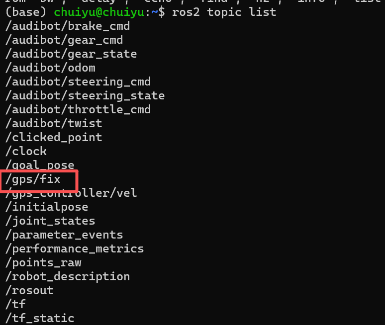
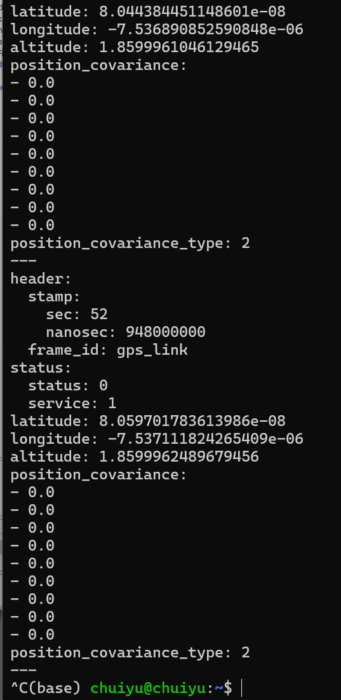
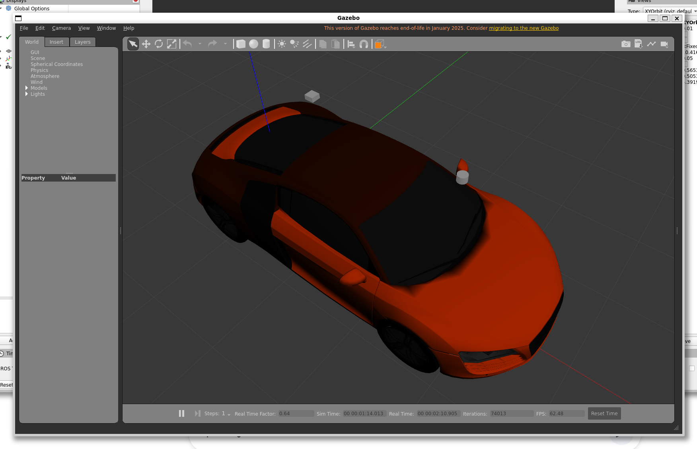

# 2.第一阶段 车辆与物理环境
## 获取阿克曼模型  

### 环境搭建
```bash
mkdir -p ~/liosam_ws/src

git clone -b ros2 https://github.com/robustify/audibot.git

sudo apt install ros-humble-example-interfaces

colcon build

source install/setup.bash

```

### 打开gazebo测试例程
```bash
source /usr/share/gazebo/setup.sh #防止出现gazebo渲染断言报错

source install/setup.bash

#执行例程脚本
ros2 launch audibot_gazebo single_vehicle_example.launch.py

```


```bash
#新开bash2

#转弯控制(实测几乎没效果)
ros2 topic pub -1 /audibot/steering_cmd std_msgs/msg/Float64 "{data: 0.5}"

#踩油门(可以观察到小车前进了)
ros2 topic pub -1 /audibot/throttle_cmd std_msgs/msg/Float64 "{data: 0.8}"


```


#### 修改UDRF

**添加激光雷达插件**

装上 SLAM 必须的传感器

修改
/home/chuiyu/carplaning/liosam_ws/src/audibot/audibot_description/urdf/audibot.urdf.xacro
文件

完整文件修改为下面的代码：
```xml
<?xml version="1.0"?>

<robot name="audibot" xmlns:xacro="http://www.ros.org/wiki/xacro">

  

  <xacro:property name="half_front_track_width" value="0.819" />

  <xacro:property name="half_rear_track_width" value="0.8" />

  <xacro:property name="half_wheelbase" value="1.326" />

  

  <xacro:property name="wheel_radius" value="0.36" />

  <xacro:property name="wheel_thickness" value="0.25" />

  <xacro:property name="wheel_mass" value="40.0" />

  

  <xacro:property name="body_mass" value="1620.0" />

  <xacro:property name="body_width" value="${2*half_rear_track_width}" />

  <xacro:property name="body_depth" value="${2*half_wheelbase + 0.8}" />

  <xacro:property name="body_length" value="0.6" />

  

  <xacro:arg name="pub_tf" default="true" />

  <xacro:arg name="robot_name" default="" />

  <xacro:arg name="blue" default="false" />

  

  <gazebo>

    <!-- Simulated vehicle interface -->

    <plugin name="audibot_interface_plugin" filename="libaudibot_interface_plugin.so" >

      <robot_name>$(arg robot_name)</robot_name>

      <pub_tf>$(arg pub_tf)</pub_tf>

      <tf_freq>100.0</tf_freq>

      <ros>

        <namespace>$(arg robot_name)</namespace>

      </ros>

    </plugin>

  

    <!-- Publish current joint angles -->

    <plugin name="joint_state_publisher" filename="libgazebo_ros_joint_state_publisher.so">

        <joint_name>steer_fl_joint</joint_name>

        <joint_name>steer_fr_joint</joint_name>

        <joint_name>wheel_fl_joint</joint_name>

        <joint_name>wheel_fr_joint</joint_name>

        <joint_name>wheel_rl_joint</joint_name>

        <joint_name>wheel_rr_joint</joint_name>

        <update_rate>100</update_rate>

        <ros>

          <namespace>$(arg robot_name)</namespace>

        </ros>

    </plugin>

  </gazebo>

  

  <xacro:macro name="rear_wheel" params="name x y z flip" >

    <link name="wheel_${name}" >

      <visual>

        <origin xyz="0 0 0" rpy="1.57079632679 ${flip * 3.1415926535} 0" />

        <geometry>

          <mesh filename="file://$(find audibot_description)/meshes/wheel.dae" scale="1 1 1" />

        </geometry>

      </visual>

  

      <collision>

        <geometry>

          <cylinder radius="${wheel_radius}" length="${wheel_thickness}" />

        </geometry>

      </collision>

  

      <inertial>

        <origin xyz="0 0 0" rpy="0 0 0"/>

        <mass value="${wheel_mass}"/>

        <inertia ixx="${wheel_mass/12*(3*wheel_radius*wheel_radius + wheel_thickness*wheel_thickness)}" ixy="0" ixz="0" iyy="${wheel_mass/12*(3*wheel_radius*wheel_radius + wheel_thickness*wheel_thickness)}" iyz="0" izz="${wheel_mass/2 * wheel_radius*wheel_radius}"/>

      </inertial>

  

    </link>

    <joint name="wheel_${name}_joint" type="continuous" >

      <parent link="base_link" />

      <child link="wheel_${name}" />

      <origin xyz="${x} ${y} ${z}" rpy="-1.57079632679 0 0" />

      <axis xyz="0 0 1" />

      <limit effort="-1.0" velocity="-1.0" />

    </joint>

  </xacro:macro>

  

  <xacro:macro name="front_wheel" params="name x y z flip" >

    <link name="wheel_${name}" >

      <visual>

        <origin xyz="0 0 0" rpy="1.57079632679 ${flip * pi} 0" />

        <geometry>

          <mesh filename="file://$(find audibot_description)/meshes/wheel.dae" scale="1 1 1" />

        </geometry>

      </visual>

  

      <collision>

        <geometry>

          <cylinder radius="${wheel_radius}" length="${wheel_thickness}" />

        </geometry>

      </collision>

  

      <inertial>

        <origin xyz="0 0 0" rpy="0 0 0"/>

        <mass value="${wheel_mass}"/>

        <inertia ixx="${wheel_mass/12*(3*wheel_radius*wheel_radius + wheel_thickness*wheel_thickness)}" ixy="0" ixz="0" iyy="${wheel_mass/12*(3*wheel_radius*wheel_radius + wheel_thickness*wheel_thickness)}" iyz="0" izz="${wheel_mass/2 * wheel_radius*wheel_radius}"/>

      </inertial>

    </link>

  

    <link name="steer_${name}" >

      <inertial>

        <origin xyz="-0.013054 -0.0295 0" rpy="0 0 0"/>

        <mass value="20.0"/>

        <inertia ixx="2" ixy="0" ixz="0" iyy="2" iyz="0" izz="2"/>

      </inertial>

    </link>

  

    <joint name="steer_${name}_joint" type="revolute" >

      <parent link="base_link" />

      <child link="steer_${name}" />

      <origin xyz="${x} ${y} ${z}" rpy="0 0 0" />

      <axis xyz="0 0 1" />

      <limit upper="0.6" lower="-0.6" effort="-1.0" velocity="-1.0" />

    </joint>

  

    <joint name="wheel_${name}_joint" type="continuous" >

      <parent link="steer_${name}" />

      <child link="wheel_${name}" />

      <origin xyz="0 0 0" rpy="-1.57079632679 0 0" />

      <axis xyz="0 0 1" />

      <limit effort="-1.0" velocity="-1.0" />

    </joint>

  </xacro:macro>

  

  <link name="base_footprint">

  </link>

  

  <link name="base_link">

    <visual>

      <origin xyz="0.035 0 0.025" rpy="0 0 0" />

      <geometry>

        <xacro:if value="$(arg blue)" >

          <mesh filename="file://$(find audibot_description)/meshes/blue_body.dae" scale="1 1 1" />

        </xacro:if>

        <xacro:unless value="$(arg blue)" >

          <mesh filename="file://$(find audibot_description)/meshes/orange_body.dae" scale="1 1 1" />

        </xacro:unless>

      </geometry>

    </visual>

    <collision>

      <origin xyz="0.035 0 0.025" rpy="0 0 0" />

      <geometry>

        <mesh filename="file://$(find audibot_description)/meshes/body_collision.stl" scale="1 1 1" />

      </geometry>

    </collision>

    <inertial>

      <origin xyz="0 0 0" rpy="0 0 0"/>

      <mass value="${body_mass}"/>

      <inertia ixx="${body_mass/12 * (body_width*body_width + body_length*body_length)}" ixy="0" ixz="0" iyy="${body_mass/12 * (body_length*body_length + body_depth*body_depth)}" iyz="0" izz="${body_mass/12 * (body_width*body_width + body_depth*body_depth)}"/>

    </inertial>

  </link>

  

  <joint name="base_link_joint" type="fixed">

    <origin xyz="${half_wheelbase} 0 ${wheel_radius}" rpy="0 0 0"/>

    <parent link="base_footprint"/>

    <child link="base_link"/>

  </joint>

  

  <xacro:rear_wheel name="rl" x="${-half_wheelbase}" y="${half_rear_track_width}" z="0" flip="1" />

  <xacro:rear_wheel name="rr" x="${-half_wheelbase}" y="${-half_rear_track_width}" z="0" flip="0" />

  <xacro:front_wheel name="fl" x="${half_wheelbase}" y="${half_front_track_width}" z="0" flip="1" />

  <xacro:front_wheel name="fr" x="${half_wheelbase}" y="${-half_front_track_width}" z="0" flip="0" />

  

  <xacro:property name="wheel_friction" value="1.75" />

  

  <gazebo reference="base_link" >

    <mu1>0.5</mu1>

    <mu2>0.5</mu2>

  </gazebo>

  

  <gazebo reference="wheel_fl" >

    <mu1>${wheel_friction}</mu1>

    <mu2>${wheel_friction}</mu2>

  </gazebo>

  

  <gazebo reference="wheel_fr" >

    <mu1>${wheel_friction}</mu1>

    <mu2>${wheel_friction}</mu2>

  </gazebo>

  

  <gazebo reference="wheel_rl" >

    <mu1>${wheel_friction}</mu1>

    <mu2>${wheel_friction}</mu2>

  </gazebo>

  

  <gazebo reference="wheel_rr" >

    <mu1>${wheel_friction}</mu1>

    <mu2>${wheel_friction}</mu2>

  </gazebo>

  

  <!-- 自定义雷达link -->

  <link name="lidar_link">

    <inertial>

      <mass value="0.1" />

      <origin xyz="0 0 0" />

      <inertia ixx="0.01" ixy="0.0" ixz="0.0" iyy="0.01" iyz="0.0" izz="0.01" />

    </inertial>

    <visual>

      <geometry><cylinder radius="0.05" length="0.07"/></geometry>

      <material name="black"><color rgba="0 0 0 1"/></material>

    </visual>

    <collision>

      <geometry><cylinder radius="0.05" length="0.07"/></geometry>

    </collision>

  </link>

  

  <joint name="lidar_joint" type="fixed">

    <parent link="base_link"/>

    <child link="lidar_link"/>

    <origin xyz="1.2 0 1.4" rpy="0 0 0"/>

  </joint>

  

  <link name="imu_link">

    <inertial>

      <mass value="0.01" />

      <inertia ixx="0.001" ixy="0" ixz="0" iyy="0.001" iyz="0" izz="0.001" />

    </inertial>

  </link>

  <joint name="imu_joint" type="fixed">

    <parent link="base_link"/>

    <child link="imu_link"/>

    <origin xyz="0 0 0" rpy="0 0 0"/>

  </joint>

  

  <gazebo reference="lidar_link">

    <sensor name="lidar" type="ray">

      <always_on>true</always_on>

      <!-- 关闭激光线特效 -->

      <visualize>false</visualize>

      <update_rate>10</update_rate>

      <ray>

        <scan>

          <horizontal>

            <samples>1800</samples>

            <min_angle>-3.1415926</min_angle>

            <max_angle>3.1415926</max_angle>

          </horizontal>

          <vertical>

            <samples>32</samples>

            <min_angle>-0.26</min_angle>

            <max_angle>0.26</max_angle>

          </vertical>

        </scan>

        <range>

          <min>0.3</min>

          <max>100.0</max>

        </range>

      </ray>

      <plugin name="lidar_plugin" filename="libgazebo_ros_ray_sensor.so">

        <ros>

          <remapping>~/out:=/points_raw</remapping>

        </ros>

        <output_type>sensor_msgs/PointCloud2</output_type>

        <frame_name>lidar_link</frame_name>

      </plugin>

    </sensor>

  </gazebo>

  

  <gazebo reference="imu_link">

    <plugin name="imu_plugin" filename="libgazebo_ros_imu_sensor.so">

      <ros>

        <remapping>~/out:=/imu_raw</remapping>

      </ros>

    </plugin>

  </gazebo>

  

</robot>

```


#### 编译测试
```bash
colcon build

source install/setup.bash


ros2 launch audibot_gazebo single_vehicle_example.launch.py


```


```bash
#新开bash2

#查看是否有雷达数据输出
ros2 topic hz /points_raw

^Cchuiyu@chuiyu:~$ ros2 topic hz /points_raw                               
average rate: 6.219                                                        
        min: 0.157s max: 0.168s std dev: 0.00335s window: 8                
average rate: 6.139                                                        
        min: 0.157s max: 0.175s std dev: 0.00484s window: 15               
average rate: 6.093                                                        
        min: 0.157s max: 0.178s std dev: 0.00558s window: 21               
average rate: 6.068                                                        
        min: 0.153s max: 0.185s std dev: 0.00683s window: 27               
average rate: 6.055                                                        
        min: 0.153s max: 0.185s std dev: 0.00738s window: 33               
average rate: 6.036                                                        
        min: 0.153s max: 0.194s std dev: 0.00832s window: 39               
average rate: 6.018                                                        
        min: 0.153s max: 0.194s std dev: 0.00800s window: 45               
average rate: 6.031                                                        
        min: 0.153s max: 0.194s std dev: 0.00771s window: 52               
average rate: 6.039                                                        
        min: 0.153s max: 0.194s std dev: 0.00748s window: 59               
average rate: 6.050                                                        
        min: 0.153s max: 0.194s std dev: 0.00725s window: 66    

```

观看gazebo当中有一个激光雷达


**添加GPS插件**

同样的修改：
/home/chuiyu/carplaning/liosam_ws/src/audibot/audibot_description/urdf/audibot.urdf.xacro

```xml
<link name="gps_link">
    <inertial>
      <mass value="0.01" />
      <inertia ixx="0.001" ixy="0" ixz="0" iyy="0.001" iyz="0" izz="0.001" />
    </inertial>
    <visual>
      <geometry><box size="0.1 0.1 0.05"/></geometry>
      <material name="white"><color rgba="1 1 1 1"/></material>
    </visual>
  </link>

  <joint name="gps_joint" type="fixed">
    <parent link="base_link"/>
    <child link="gps_link"/>
    <origin xyz="-0.5 0 1.5" rpy="0 0 0"/> 
  </joint>

  <gazebo reference="gps_link">
    <sensor name="gps_sensor" type="gps">
      <always_on>true</always_on>
      <update_rate>10.0</update_rate>
      <plugin name="gps_controller" filename="libgazebo_ros_gps_sensor.so">
        <ros>
          <remapping>~/out:=/gps/fix</remapping>
        </ros>
        <frame_name>gps_link</frame_name>
        <referenceLatitude>1.3521</referenceLatitude>
        <referenceLongitude>103.8198</referenceLongitude>
        <referenceHeading>0</referenceHeading>
        <referenceAltitude>10</referenceAltitude>
        <offset>0 0 0</offset>
        <drift>0.0001 0.0001 0.0001</drift>
        <gaussianNoise>0.0001 0.0001 0.0001</gaussianNoise>
        <velocityDrift>0 0 0</velocityDrift>
        <velocityGaussianNoise>0.0001 0.0001 0.0001</velocityGaussianNoise>
      </plugin>
    </sensor>
  </gazebo>
```


修改了 URDF 文件后，必须重新编译才能生效，否则 Gazebo 加载的还是旧模型。


```bash
cd ~/liosam_ws
colcon build --symlink-install
source install/setup.bash
```


还是用之前的命令把车拉起来：

```bash
ros2 launch audibot_gazebo single_vehicle_example.launch.py
```


**检查话题是否存在：**

```
ros2 topic list
```




**预期结果**：列表中应该出现 `/gps/fix`。

**检查是否有数据输出：**

```
ros2 topic echo /gps/fix
```


**预期结果**： 你应该看到类似下面的数据不断刷屏：

- `latitude`: 1.3521... (我们在代码里设的新加坡纬度)
    
- `longitude`: 103.8198... (新加坡经度)
    
- `altitude`: 10.0...
    
- **关键点**：看 `position_covariance`，这 9 个数应该非常小（比如 1e-08 级别），这代表你要的 **RTK 高精度** 模拟成功了。
    




**检查 TF 变换 (LIO-SAM 必需)：** LIO-SAM 需要知道 GPS 天线相对于车体中心的具体位置。

```
ros2 run tf2_ros tf2_echo base_link gps_link
```

**预期结果**： 应该显示 `At time ...`，然后是 `Translation: [-0.500, 0.000, 1.500]` (这就是我们在 XML 里写的 origin xyz)。





### 创建世界环境

```bash
cd /home/chuiyu/carplaning/liosam_ws/src/audibot/audibot_gazebo

mkdir worlds

cd worlds

touch slam_test.world

code .

```

```xml
<?xml version="1.0" ?>
<sdf version="1.6">
  <world name="default">
    
    <!-- Gazebo ROS 插件 -->
    <plugin name="gazebo_ros_state" filename="libgazebo_ros_state.so">
      <ros>
        <namespace>/</namespace>
      </ros>
      <update_rate>10.0</update_rate>
    </plugin>

    <!-- 光照 -->
    <light name='sun' type='directional'>
      <cast_shadows>1</cast_shadows>
      <pose>0 0 10 0 -0 0</pose>
      <diffuse>0.8 0.8 0.8 1</diffuse>
      <specular>0.2 0.2 0.2 1</specular>
      <attenuation>
        <range>1000</range>
        <constant>0.9</constant>
        <linear>0.01</linear>
        <quadratic>0.001</quadratic>
      </attenuation>
      <direction>-0.5 0.1 -0.9</direction>
    </light>

    <!-- 地面 -->
    <model name='ground_plane'>
      <static>1</static>
      <link name='link'>
        <collision name='collision'>
          <geometry>
            <plane>
              <normal>0 0 1</normal>
              <size>100 100</size>
            </plane>
          </geometry>
          <surface>
            <friction>
              <ode>
                <mu>100</mu>
                <mu2>50</mu2>
              </ode>
            </friction>
          </surface>
        </collision>
        <visual name='visual'>
          <cast_shadows>0</cast_shadows>
          <geometry>
            <plane>
              <normal>0 0 1</normal>
              <size>100 100</size>
            </plane>
          </geometry>
          <material>
            <script>
              <uri>file://media/materials/scripts/gazebo.material</uri>
              <name>Gazebo/Grey</name>
            </script>
          </material>
        </visual>
      </link>
    </model>

    <!-- 物理引擎设置 -->
    <physics type="ode">
      <max_step_size>0.001</max_step_size>
      <real_time_factor>1</real_time_factor>
      <real_time_update_rate>1000</real_time_update_rate>
    </physics>

    <!-- ========== 外围墙体 ========== -->
    <!-- 北墙 -->
    <model name='wall_north'>
      <static>true</static>
      <pose>0 20 1.5 0 0 0</pose>
      <link name='link'>
        <collision name='collision'>
          <geometry><box><size>40 0.5 3</size></box></geometry>
        </collision>
        <visual name='visual'>
          <geometry><box><size>40 0.5 3</size></box></geometry>
          <material><script><uri>file://media/materials/scripts/gazebo.material</uri><name>Gazebo/Bricks</name></script></material>
        </visual>
      </link>
    </model>

    <!-- 南墙 -->
    <model name='wall_south'>
      <static>true</static>
      <pose>0 -20 1.5 0 0 0</pose>
      <link name='link'>
        <collision name='collision'>
          <geometry><box><size>40 0.5 3</size></box></geometry>
        </collision>
        <visual name='visual'>
          <geometry><box><size>40 0.5 3</size></box></geometry>
          <material><script><uri>file://media/materials/scripts/gazebo.material</uri><name>Gazebo/Bricks</name></script></material>
        </visual>
      </link>
    </model>

    <!-- 东墙 -->
    <model name='wall_east'>
      <static>true</static>
      <pose>20 0 1.5 0 0 0</pose>
      <link name='link'>
        <collision name='collision'>
          <geometry><box><size>0.5 40 3</size></box></geometry>
        </collision>
        <visual name='visual'>
          <geometry><box><size>0.5 40 3</size></box></geometry>
          <material><script><uri>file://media/materials/scripts/gazebo.material</uri><name>Gazebo/Bricks</name></script></material>
        </visual>
      </link>
    </model>

    <!-- 西墙 -->
    <model name='wall_west'>
      <static>true</static>
      <pose>-20 0 1.5 0 0 0</pose>
      <link name='link'>
        <collision name='collision'>
          <geometry><box><size>0.5 40 3</size></box></geometry>
        </collision>
        <visual name='visual'>
          <geometry><box><size>0.5 40 3</size></box></geometry>
          <material><script><uri>file://media/materials/scripts/gazebo.material</uri><name>Gazebo/Bricks</name></script></material>
        </visual>
      </link>
    </model>

    <!-- ========== 内部房间分隔墙 ========== -->
    <!-- 中央走廊左墙 -->
    <model name='corridor_wall_left'>
      <static>true</static>
      <pose>-5 0 1.5 0 0 0</pose>
      <link name='link'>
        <collision name='collision'>
          <geometry><box><size>0.3 30 3</size></box></geometry>
        </collision>
        <visual name='visual'>
          <geometry><box><size>0.3 30 3</size></box></geometry>
          <material><script><uri>file://media/materials/scripts/gazebo.material</uri><name>Gazebo/Wood</name></script></material>
        </visual>
      </link>
    </model>

    <!-- 中央走廊右墙 -->
    <model name='corridor_wall_right'>
      <static>true</static>
      <pose>5 0 1.5 0 0 0</pose>
      <link name='link'>
        <collision name='collision'>
          <geometry><box><size>0.3 30 3</size></box></geometry>
        </collision>
        <visual name='visual'>
          <geometry><box><size>0.3 30 3</size></box></geometry>
          <material><script><uri>file://media/materials/scripts/gazebo.material</uri><name>Gazebo/Wood</name></script></material>
        </visual>
      </link>
    </model>

    <!-- 横向分隔墙1 -->
    <model name='divider_wall_1'>
      <static>true</static>
      <pose>-12.5 10 1.5 0 0 0</pose>
      <link name='link'>
        <collision name='collision'>
          <geometry><box><size>15 0.3 3</size></box></geometry>
        </collision>
        <visual name='visual'>
          <geometry><box><size>15 0.3 3</size></box></geometry>
          <material><script><uri>file://media/materials/scripts/gazebo.material</uri><name>Gazebo/Wood</name></script></material>
        </visual>
      </link>
    </model>

    <!-- 横向分隔墙2 -->
    <model name='divider_wall_2'>
      <static>true</static>
      <pose>12.5 -10 1.5 0 0 0</pose>
      <link name='link'>
        <collision name='collision'>
          <geometry><box><size>15 0.3 3</size></box></geometry>
        </collision>
        <visual name='visual'>
          <geometry><box><size>15 0.3 3</size></box></geometry>
          <material><script><uri>file://media/materials/scripts/gazebo.material</uri><name>Gazebo/Wood</name></script></material>
        </visual>
      </link>
    </model>

    <!-- ========== 圆柱障碍物 ========== -->
    <model name='cylinder_1'>
      <static>true</static>
      <pose>-10 15 1 0 0 0</pose>
      <link name='link'>
        <collision name='collision'>
          <geometry><cylinder><radius>0.5</radius><length>2</length></cylinder></geometry>
        </collision>
        <visual name='visual'>
          <geometry><cylinder><radius>0.5</radius><length>2</length></cylinder></geometry>
          <material><script><name>Gazebo/Red</name></script></material>
        </visual>
      </link>
    </model>

    <model name='cylinder_2'>
      <static>true</static>
      <pose>10 15 1 0 0 0</pose>
      <link name='link'>
        <collision name='collision'>
          <geometry><cylinder><radius>0.5</radius><length>2</length></cylinder></geometry>
        </collision>
        <visual name='visual'>
          <geometry><cylinder><radius>0.5</radius><length>2</length></cylinder></geometry>
          <material><script><name>Gazebo/Blue</name></script></material>
        </visual>
      </link>
    </model>

    <model name='cylinder_3'>
      <static>true</static>
      <pose>-10 -15 1 0 0 0</pose>
      <link name='link'>
        <collision name='collision'>
          <geometry><cylinder><radius>0.5</radius><length>2</length></cylinder></geometry>
        </collision>
        <visual name='visual'>
          <geometry><cylinder><radius>0.5</radius><length>2</length></cylinder></geometry>
          <material><script><name>Gazebo/Green</name></script></material>
        </visual>
      </link>
    </model>

    <model name='cylinder_4'>
      <static>true</static>
      <pose>10 -15 1 0 0 0</pose>
      <link name='link'>
        <collision name='collision'>
          <geometry><cylinder><radius>0.5</radius><length>2</length></cylinder></geometry>
        </collision>
        <visual name='visual'>
          <geometry><cylinder><radius>0.5</radius><length>2</length></cylinder></geometry>
          <material><script><name>Gazebo/Yellow</name></script></material>
        </visual>
      </link>
    </model>

    <!-- ========== 方形箱子障碍物 ========== -->
    <model name='box_1'>
      <static>true</static>
      <pose>-15 5 0.5 0 0 0.5</pose>
      <link name='link'>
        <collision name='collision'>
          <geometry><box><size>1 1 1</size></box></geometry>
        </collision>
        <visual name='visual'>
          <geometry><box><size>1 1 1</size></box></geometry>
          <material><script><uri>file://media/materials/scripts/gazebo.material</uri><name>Gazebo/WoodPallet</name></script></material>
        </visual>
      </link>
    </model>

    <model name='box_2'>
      <static>true</static>
      <pose>15 5 0.75 0 0 -0.3</pose>
      <link name='link'>
        <collision name='collision'>
          <geometry><box><size>1.5 1.5 1.5</size></box></geometry>
        </collision>
        <visual name='visual'>
          <geometry><box><size>1.5 1.5 1.5</size></box></geometry>
          <material><script><uri>file://media/materials/scripts/gazebo.material</uri><name>Gazebo/WoodPallet</name></script></material>
        </visual>
      </link>
    </model>

    <model name='box_3'>
      <static>true</static>
      <pose>-15 -5 0.6 0 0 0.8</pose>
      <link name='link'>
        <collision name='collision'>
          <geometry><box><size>1.2 1.2 1.2</size></box></geometry>
        </collision>
        <visual name='visual'>
          <geometry><box><size>1.2 1.2 1.2</size></box></geometry>
          <material><script><uri>file://media/materials/scripts/gazebo.material</uri><name>Gazebo/WoodPallet</name></script></material>
        </visual>
      </link>
    </model>

    <model name='box_4'>
      <static>true</static>
      <pose>15 -5 0.4 0 0 -0.6</pose>
      <link name='link'>
        <collision name='collision'>
          <geometry><box><size>0.8 0.8 0.8</size></box></geometry>
        </collision>
        <visual name='visual'>
          <geometry><box><size>0.8 0.8 0.8</size></box></geometry>
          <material><script><uri>file://media/materials/scripts/gazebo.material</uri><name>Gazebo/WoodPallet</name></script></material>
        </visual>
      </link>
    </model>

    <!-- 走廊中的小障碍物 -->
    <model name='obstacle_small_1'>
      <static>true</static>
      <pose>0 8 0.3 0 0 0</pose>
      <link name='link'>
        <collision name='collision'>
          <geometry><box><size>0.6 0.6 0.6</size></box></geometry>
        </collision>
        <visual name='visual'>
          <geometry><box><size>0.6 0.6 0.6</size></box></geometry>
          <material><script><uri>file://media/materials/scripts/gazebo.material</uri><name>Gazebo/Orange</name></script></material>
        </visual>
      </link>
    </model>

    <model name='obstacle_small_2'>
      <static>true</static>
      <pose>0 -8 0.3 0 0 0</pose>
      <link name='link'>
        <collision name='collision'>
          <geometry><box><size>0.6 0.6 0.6</size></box></geometry>
        </collision>
        <visual name='visual'>
          <geometry><box><size>0.6 0.6 0.6</size></box></geometry>
          <material><script><uri>file://media/materials/scripts/gazebo.material</uri><name>Gazebo/Orange</name></script></material>
        </visual>
      </link>
    </model>

    <!-- ========== 高度变化的平台 ========== -->
    <model name='platform_1'>
      <static>true</static>
      <pose>-12 -12 0.15 0 0 0</pose>
      <link name='link'>
        <collision name='collision'>
          <geometry><box><size>4 4 0.3</size></box></geometry>
        </collision>
        <visual name='visual'>
          <geometry><box><size>4 4 0.3</size></box></geometry>
          <material><script><uri>file://media/materials/scripts/gazebo.material</uri><name>Gazebo/Grey</name></script></material>
        </visual>
      </link>
    </model>

    <model name='platform_2'>
      <static>true</static>
      <pose>12 12 0.25 0 0 0</pose>
      <link name='link'>
        <collision name='collision'>
          <geometry><box><size>5 5 0.5</size></box></geometry>
        </collision>
        <visual name='visual'>
          <geometry><box><size>5 5 0.5</size></box></geometry>
          <material><script><uri>file://media/materials/scripts/gazebo.material</uri><name>Gazebo/Grey</name></script></material>
        </visual>
      </link>
    </model>

    <!-- ========== L型墙角 ========== -->
    <model name='corner_wall_1'>
      <static>true</static>
      <pose>-8 -8 1 0 0 0</pose>
      <link name='link'>
        <collision name='collision'>
          <geometry><box><size>0.3 4 2</size></box></geometry>
        </collision>
        <visual name='visual'>
          <geometry><box><size>0.3 4 2</size></box></geometry>
          <material><script><uri>file://media/materials/scripts/gazebo.material</uri><name>Gazebo/CeilingTiled</name></script></material>
        </visual>
      </link>
    </model>

    <model name='corner_wall_2'>
      <static>true</static>
      <pose>-6 -10 1 0 0 0</pose>
      <link name='link'>
        <collision name='collision'>
          <geometry><box><size>4 0.3 2</size></box></geometry>
        </collision>
        <visual name='visual'>
          <geometry><box><size>4 0.3 2</size></box></geometry>
          <material><script><uri>file://media/materials/scripts/gazebo.material</uri><name>Gazebo/CeilingTiled</name></script></material>
        </visual>
      </link>
    </model>

  </world>
</sdf>
```


```bash
cd /home/chuiyu/carplaning/liosam_ws/src/audibot/audibot_gazebo/

cd launch 

touch slam_sim.launch.py

code .


```


```python
import os

from ament_index_python.packages import get_package_share_directory

from launch import LaunchDescription

from launch.actions import IncludeLaunchDescription

from launch.launch_description_sources import PythonLaunchDescriptionSource

from launch_ros.actions import Node

import xacro

  

def generate_launch_description():

    pkg_audibot_gazebo = get_package_share_directory('audibot_gazebo')

    pkg_audibot_description = get_package_share_directory('audibot_description')

    pkg_gazebo_ros = get_package_share_directory('gazebo_ros')

  

    # 1. 设置世界文件路径

    world_file_name = 'slam_test.world'

    world_path = os.path.join(pkg_audibot_gazebo, 'worlds', world_file_name)

  

    # 2. 解析 URDF

    xacro_file = os.path.join(pkg_audibot_description, 'urdf', 'audibot.urdf.xacro')

    doc = xacro.process_file(xacro_file)

    robot_desc = doc.toxml()

  

    # 3. 使用 gazebo.launch.py 启动完整的 Gazebo（包含server和client）

    gazebo = IncludeLaunchDescription(

        PythonLaunchDescriptionSource(

            os.path.join(pkg_gazebo_ros, 'launch', 'gazebo.launch.py')

        ),

        launch_arguments={

            'world': world_path,

            'verbose': 'true'

        }.items(),

    )

  

    # 4. Robot State Publisher 节点

    robot_state_publisher = Node(

        package='robot_state_publisher',

        executable='robot_state_publisher',

        name='robot_state_publisher',

        output='screen',

        parameters=[{

            'use_sim_time': True,

            'robot_description': robot_desc

        }]

    )

  

    # 5. Spawn Robot

    spawn_robot = Node(

        package='gazebo_ros',

        executable='spawn_entity.py',

        arguments=[

            '-topic', 'robot_description',

            '-entity', 'audibot',

            '-x', '0', '-y', '0', '-z', '0.5'

        ],

        output='screen'

    )

  

    return LaunchDescription([

        gazebo,

        robot_state_publisher,

        spawn_robot

    ])

```

编译并运行

因为我们添加了新文件，虽然理论上 Python 脚本不需要编译，但为了让 ROS 2 的索引系统（`ament_index`）找到新添加的 `worlds` 文件夹，最好重新编译一次。


```bash
cd /home/chuiyu/carplaning/liosam_ws
colcon build --symlink-install
source install/setup.bash
```

验收标准
Gazebo 启动后，你应该能看到：

Audibot 小车 停在中间。

四周有 砖墙。

附近有灰色的 圆柱体。

车顶有你之前加的 白色 GPS 盒子 和 黑色圆柱 LiDAR。

