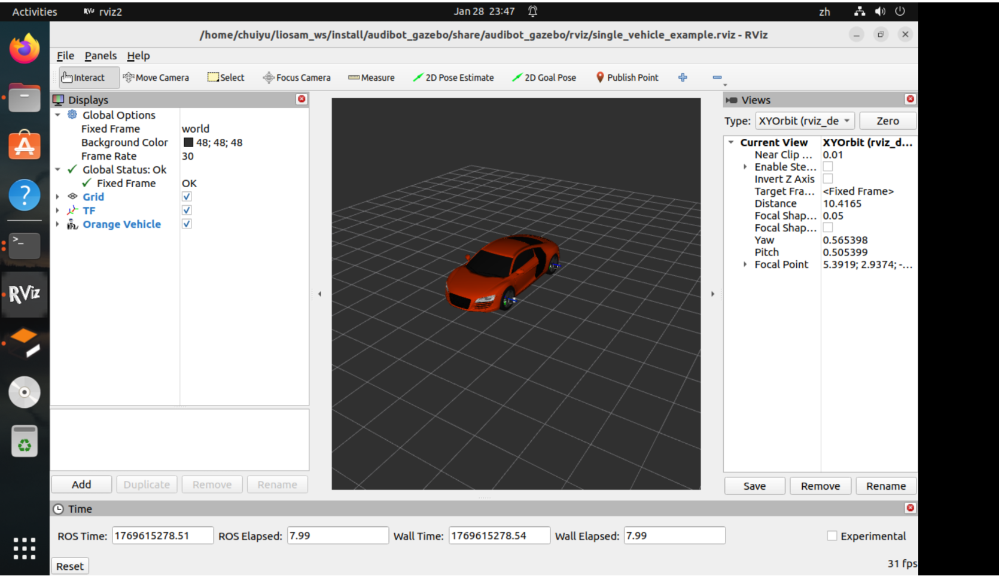
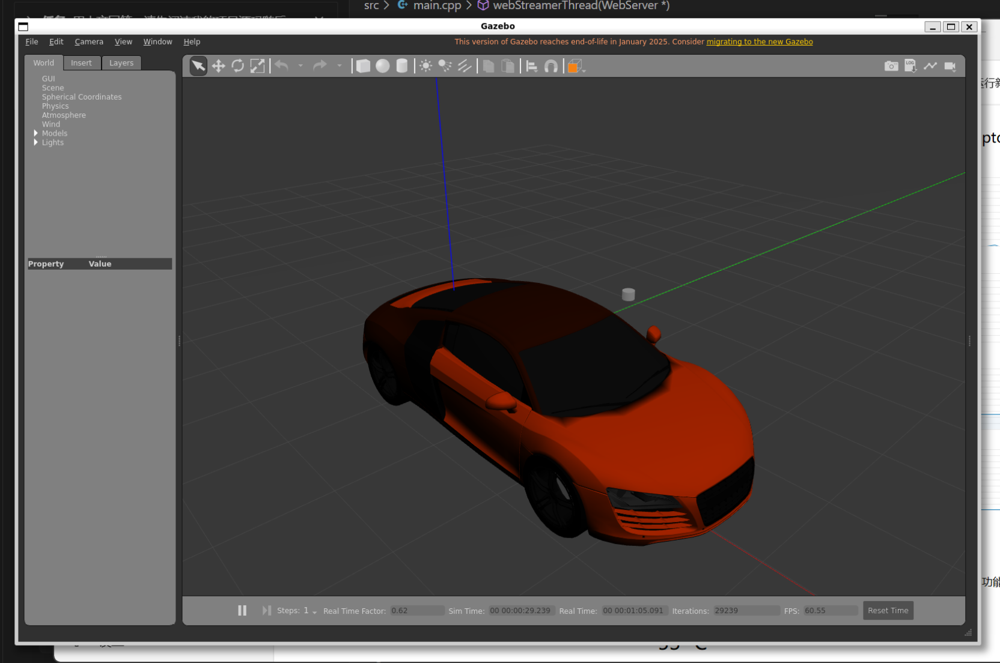

# 2.第一阶段 车辆与物理环境
## 获取阿克曼模型  

### 环境搭建
```bash
mkdir -p ~/liosam_ws/src

git clone -b ros2 https://github.com/robustify/audibot.git

sudo apt install ros-humble-example-interfaces

colcon build

source install/setup.bash

```

### 打开gazebo测试例程
```bash
source /usr/share/gazebo/setup.sh #防止出现gazebo渲染断言报错

source install/setup.bash

#执行例程脚本
ros2 launch audibot_gazebo single_vehicle_example.launch.py

```


```bash
#新开bash2

#转弯控制(实测几乎没效果)
ros2 topic pub -1 /audibot/steering_cmd std_msgs/msg/Float64 "{data: 0.5}"

#踩油门(可以观察到小车前进了)
ros2 topic pub -1 /audibot/throttle_cmd std_msgs/msg/Float64 "{data: 0.8}"


```





#### 修改UDRF
装上 SLAM 必须的传感器

修改
~/liosam_ws/src/audibot/audibot_description/urdf/audibot.urdf.xacro
文件

完整文件修改为下面的代码：
```xml
<?xml version="1.0"?>

<robot name="audibot" xmlns:xacro="http://www.ros.org/wiki/xacro">

  

  <xacro:property name="half_front_track_width" value="0.819" />

  <xacro:property name="half_rear_track_width" value="0.8" />

  <xacro:property name="half_wheelbase" value="1.326" />

  

  <xacro:property name="wheel_radius" value="0.36" />

  <xacro:property name="wheel_thickness" value="0.25" />

  <xacro:property name="wheel_mass" value="40.0" />

  

  <xacro:property name="body_mass" value="1620.0" />

  <xacro:property name="body_width" value="${2*half_rear_track_width}" />

  <xacro:property name="body_depth" value="${2*half_wheelbase + 0.8}" />

  <xacro:property name="body_length" value="0.6" />

  

  <xacro:arg name="pub_tf" default="true" />

  <xacro:arg name="robot_name" default="" />

  <xacro:arg name="blue" default="false" />

  

  <gazebo>

    <!-- Simulated vehicle interface -->

    <plugin name="audibot_interface_plugin" filename="libaudibot_interface_plugin.so" >

      <robot_name>$(arg robot_name)</robot_name>

      <pub_tf>$(arg pub_tf)</pub_tf>

      <tf_freq>100.0</tf_freq>

      <ros>

        <namespace>$(arg robot_name)</namespace>

      </ros>

    </plugin>

  

    <!-- Publish current joint angles -->

    <plugin name="joint_state_publisher" filename="libgazebo_ros_joint_state_publisher.so">

        <joint_name>steer_fl_joint</joint_name>

        <joint_name>steer_fr_joint</joint_name>

        <joint_name>wheel_fl_joint</joint_name>

        <joint_name>wheel_fr_joint</joint_name>

        <joint_name>wheel_rl_joint</joint_name>

        <joint_name>wheel_rr_joint</joint_name>

        <update_rate>100</update_rate>

        <ros>

          <namespace>$(arg robot_name)</namespace>

        </ros>

    </plugin>

  </gazebo>

  

  <xacro:macro name="rear_wheel" params="name x y z flip" >

    <link name="wheel_${name}" >

      <visual>

        <origin xyz="0 0 0" rpy="1.57079632679 ${flip * 3.1415926535} 0" />

        <geometry>

          <mesh filename="file://$(find audibot_description)/meshes/wheel.dae" scale="1 1 1" />

        </geometry>

      </visual>

  

      <collision>

        <geometry>

          <cylinder radius="${wheel_radius}" length="${wheel_thickness}" />

        </geometry>

      </collision>

  

      <inertial>

        <origin xyz="0 0 0" rpy="0 0 0"/>

        <mass value="${wheel_mass}"/>

        <inertia ixx="${wheel_mass/12*(3*wheel_radius*wheel_radius + wheel_thickness*wheel_thickness)}" ixy="0" ixz="0" iyy="${wheel_mass/12*(3*wheel_radius*wheel_radius + wheel_thickness*wheel_thickness)}" iyz="0" izz="${wheel_mass/2 * wheel_radius*wheel_radius}"/>

      </inertial>

  

    </link>

    <joint name="wheel_${name}_joint" type="continuous" >

      <parent link="base_link" />

      <child link="wheel_${name}" />

      <origin xyz="${x} ${y} ${z}" rpy="-1.57079632679 0 0" />

      <axis xyz="0 0 1" />

      <limit effort="-1.0" velocity="-1.0" />

    </joint>

  </xacro:macro>

  

  <xacro:macro name="front_wheel" params="name x y z flip" >

    <link name="wheel_${name}" >

      <visual>

        <origin xyz="0 0 0" rpy="1.57079632679 ${flip * pi} 0" />

        <geometry>

          <mesh filename="file://$(find audibot_description)/meshes/wheel.dae" scale="1 1 1" />

        </geometry>

      </visual>

  

      <collision>

        <geometry>

          <cylinder radius="${wheel_radius}" length="${wheel_thickness}" />

        </geometry>

      </collision>

  

      <inertial>

        <origin xyz="0 0 0" rpy="0 0 0"/>

        <mass value="${wheel_mass}"/>

        <inertia ixx="${wheel_mass/12*(3*wheel_radius*wheel_radius + wheel_thickness*wheel_thickness)}" ixy="0" ixz="0" iyy="${wheel_mass/12*(3*wheel_radius*wheel_radius + wheel_thickness*wheel_thickness)}" iyz="0" izz="${wheel_mass/2 * wheel_radius*wheel_radius}"/>

      </inertial>

    </link>

  

    <link name="steer_${name}" >

      <inertial>

        <origin xyz="-0.013054 -0.0295 0" rpy="0 0 0"/>

        <mass value="20.0"/>

        <inertia ixx="2" ixy="0" ixz="0" iyy="2" iyz="0" izz="2"/>

      </inertial>

    </link>

  

    <joint name="steer_${name}_joint" type="revolute" >

      <parent link="base_link" />

      <child link="steer_${name}" />

      <origin xyz="${x} ${y} ${z}" rpy="0 0 0" />

      <axis xyz="0 0 1" />

      <limit upper="0.6" lower="-0.6" effort="-1.0" velocity="-1.0" />

    </joint>

  

    <joint name="wheel_${name}_joint" type="continuous" >

      <parent link="steer_${name}" />

      <child link="wheel_${name}" />

      <origin xyz="0 0 0" rpy="-1.57079632679 0 0" />

      <axis xyz="0 0 1" />

      <limit effort="-1.0" velocity="-1.0" />

    </joint>

  </xacro:macro>

  

  <link name="base_footprint">

  </link>

  

  <link name="base_link">

    <visual>

      <origin xyz="0.035 0 0.025" rpy="0 0 0" />

      <geometry>

        <xacro:if value="$(arg blue)" >

          <mesh filename="file://$(find audibot_description)/meshes/blue_body.dae" scale="1 1 1" />

        </xacro:if>

        <xacro:unless value="$(arg blue)" >

          <mesh filename="file://$(find audibot_description)/meshes/orange_body.dae" scale="1 1 1" />

        </xacro:unless>

      </geometry>

    </visual>

    <collision>

      <origin xyz="0.035 0 0.025" rpy="0 0 0" />

      <geometry>

        <mesh filename="file://$(find audibot_description)/meshes/body_collision.stl" scale="1 1 1" />

      </geometry>

    </collision>

    <inertial>

      <origin xyz="0 0 0" rpy="0 0 0"/>

      <mass value="${body_mass}"/>

      <inertia ixx="${body_mass/12 * (body_width*body_width + body_length*body_length)}" ixy="0" ixz="0" iyy="${body_mass/12 * (body_length*body_length + body_depth*body_depth)}" iyz="0" izz="${body_mass/12 * (body_width*body_width + body_depth*body_depth)}"/>

    </inertial>

  </link>

  

  <joint name="base_link_joint" type="fixed">

    <origin xyz="${half_wheelbase} 0 ${wheel_radius}" rpy="0 0 0"/>

    <parent link="base_footprint"/>

    <child link="base_link"/>

  </joint>

  

  <xacro:rear_wheel name="rl" x="${-half_wheelbase}" y="${half_rear_track_width}" z="0" flip="1" />

  <xacro:rear_wheel name="rr" x="${-half_wheelbase}" y="${-half_rear_track_width}" z="0" flip="0" />

  <xacro:front_wheel name="fl" x="${half_wheelbase}" y="${half_front_track_width}" z="0" flip="1" />

  <xacro:front_wheel name="fr" x="${half_wheelbase}" y="${-half_front_track_width}" z="0" flip="0" />

  

  <xacro:property name="wheel_friction" value="1.75" />

  

  <gazebo reference="base_link" >

    <mu1>0.5</mu1>

    <mu2>0.5</mu2>

  </gazebo>

  

  <gazebo reference="wheel_fl" >

    <mu1>${wheel_friction}</mu1>

    <mu2>${wheel_friction}</mu2>

  </gazebo>

  

  <gazebo reference="wheel_fr" >

    <mu1>${wheel_friction}</mu1>

    <mu2>${wheel_friction}</mu2>

  </gazebo>

  

  <gazebo reference="wheel_rl" >

    <mu1>${wheel_friction}</mu1>

    <mu2>${wheel_friction}</mu2>

  </gazebo>

  

  <gazebo reference="wheel_rr" >

    <mu1>${wheel_friction}</mu1>

    <mu2>${wheel_friction}</mu2>

  </gazebo>

  

  <!-- 自定义雷达link -->

  <link name="lidar_link">

    <inertial>

      <mass value="0.1" />

      <origin xyz="0 0 0" />

      <inertia ixx="0.01" ixy="0.0" ixz="0.0" iyy="0.01" iyz="0.0" izz="0.01" />

    </inertial>

    <visual>

      <geometry><cylinder radius="0.05" length="0.07"/></geometry>

      <material name="black"><color rgba="0 0 0 1"/></material>

    </visual>

    <collision>

      <geometry><cylinder radius="0.05" length="0.07"/></geometry>

    </collision>

  </link>

  

  <joint name="lidar_joint" type="fixed">

    <parent link="base_link"/>

    <child link="lidar_link"/>

    <origin xyz="1.2 0 1.4" rpy="0 0 0"/>

  </joint>

  

  <link name="imu_link">

    <inertial>

      <mass value="0.01" />

      <inertia ixx="0.001" ixy="0" ixz="0" iyy="0.001" iyz="0" izz="0.001" />

    </inertial>

  </link>

  <joint name="imu_joint" type="fixed">

    <parent link="base_link"/>

    <child link="imu_link"/>

    <origin xyz="0 0 0" rpy="0 0 0"/>

  </joint>

  

  <gazebo reference="lidar_link">

    <sensor name="lidar" type="ray">

      <always_on>true</always_on>

      <!-- 关闭激光线特效 -->

      <visualize>false</visualize>

      <update_rate>10</update_rate>

      <ray>

        <scan>

          <horizontal>

            <samples>1800</samples>

            <min_angle>-3.1415926</min_angle>

            <max_angle>3.1415926</max_angle>

          </horizontal>

          <vertical>

            <samples>32</samples>

            <min_angle>-0.26</min_angle>

            <max_angle>0.26</max_angle>

          </vertical>

        </scan>

        <range>

          <min>0.3</min>

          <max>100.0</max>

        </range>

      </ray>

      <plugin name="lidar_plugin" filename="libgazebo_ros_ray_sensor.so">

        <ros>

          <remapping>~/out:=/points_raw</remapping>

        </ros>

        <output_type>sensor_msgs/PointCloud2</output_type>

        <frame_name>lidar_link</frame_name>

      </plugin>

    </sensor>

  </gazebo>

  

  <gazebo reference="imu_link">

    <plugin name="imu_plugin" filename="libgazebo_ros_imu_sensor.so">

      <ros>

        <remapping>~/out:=/imu_raw</remapping>

      </ros>

    </plugin>

  </gazebo>

  

</robot>

```


#### 编译测试
```bash
colcon build

source install/setup.bash


ros2 launch audibot_gazebo single_vehicle_example.launch.py


```


```bash
#新开bash2

#查看是否有雷达数据输出
ros2 topic hz /points_raw

^Cchuiyu@chuiyu:~$ ros2 topic hz /points_raw                               
average rate: 6.219                                                        
        min: 0.157s max: 0.168s std dev: 0.00335s window: 8                
average rate: 6.139                                                        
        min: 0.157s max: 0.175s std dev: 0.00484s window: 15               
average rate: 6.093                                                        
        min: 0.157s max: 0.178s std dev: 0.00558s window: 21               
average rate: 6.068                                                        
        min: 0.153s max: 0.185s std dev: 0.00683s window: 27               
average rate: 6.055                                                        
        min: 0.153s max: 0.185s std dev: 0.00738s window: 33               
average rate: 6.036                                                        
        min: 0.153s max: 0.194s std dev: 0.00832s window: 39               
average rate: 6.018                                                        
        min: 0.153s max: 0.194s std dev: 0.00800s window: 45               
average rate: 6.031                                                        
        min: 0.153s max: 0.194s std dev: 0.00771s window: 52               
average rate: 6.039                                                        
        min: 0.153s max: 0.194s std dev: 0.00748s window: 59               
average rate: 6.050                                                        
        min: 0.153s max: 0.194s std dev: 0.00725s window: 66    

```

观看gazebo当中有一个激光雷达


