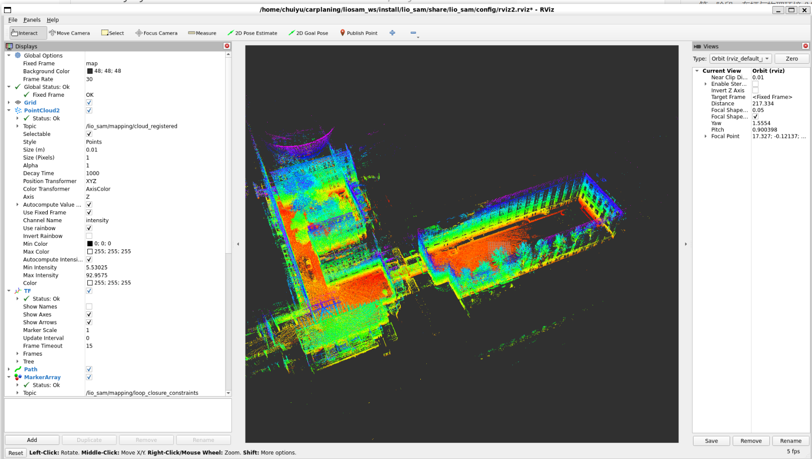

# 3.第二阶段 LIO-SAM 适配
## LIO-SAM环境搭建

### GTSAM 编译
```bash
cd ~
mkdir -p carplaning/3rdparty
git clone https://github.com/borglab/gtsam.git 
cd gtsam 
mkdir build && cd build
cmake -DGTSAM_BUILD_WITH_MARCH_NATIVE=OFF .. 
make -j$(nproc) 
sudo make install

```


### LIO-SAM 编译
```bash

cd ~/carplaning/liosam_ws/src

sudo apt-get install ros-humble-perception-pcl \
                     ros-humble-pcl-msgs \
                     ros-humble-vision-opencv \
                     ros-humble-xacro \
                     ros-humble-geographic-msgs
                     

git clone -b ros2 https://github.com/TixiaoShan/LIO-SAM.git

#新版本的GTSAM 全面转向了 C++ 标准库的 std::shared_ptr,所以需要修改一下源码进行适配
cd ~/carplaning/liosam_ws/src/LIO-SAM/src/ sed -i 's/boost::shared_ptr/std::shared_ptr/g' imuPreintegration.cpp

#编译lio-sam
colcon build --symlink-install --packages-select lio_sam

#这里遇到编译报错就询问ai进行解决，直到编译成功

```


### LIO-SAM 测试
```bash
#运行一键脚本,界面如下图
ros2 launch lio_sam run.launch.py

```


### LIO-SAM 仿真测试

(1)下载数据集
        github的README中有下载链接，下载walking dataset数据集
(2)转换格式
        下载的数据集是ROS1的.bag格式，需要进行转换，执行如下命令
rosbags-convert --src [ROS1格式数据集文件] --dst [ROS2格式数据集路径]

因为不同的数据集的话题可能会与默认的topic不同，这里根据数据集的话题进行修改。
        （1）修改params.yaml文件
 ```yaml
 /**:
  ros__parameters:
 
    # # Topics
    # pointCloudTopic: "/points_raw"                   # Point cloud data
    # imuTopic: "/imu_correct"                        # IMU data
    # odomTopic: "/gx5/nav/odom"                    # IMU pre-preintegration odometry, same frequency as IMU
    # gpsTopic: "/gx5/gps/fix"                    # GPS odometry topic from navsat, see module_navsat.launch file
 
    # # Frames
    # lidarFrame: "velodyne"
    # baselinkFrame: "base_link"
    # odometryFrame: "wgs84_odom_link"
    # mapFrame: "map"
 
    # Topics
    pointCloudTopic: "points_raw"               # Point cloud data
    imuTopic: "imu_raw"                         # IMU data
    odomTopic: "odometry/imu"                   # IMU pre-preintegration odometry, same frequency as IMU
    gpsTopic: "odometry/gpsz"                   # GPS odometry topic from navsat, see module_navsat.launch file
 
    # Frames
    lidarFrame: ""velodyne"
    baselinkFrame: "base_link"
    odometryFrame: "odom"
    mapFrame: "map"
    # GPS Settings
    useImuHeadingInitialization: false           # if using GPS data, set to "true"
    useGpsElevation: false                       # if GPS elevation is bad, set to "false"
    gpsCovThreshold: 2.0                         # m^2, threshold for using GPS data
    poseCovThreshold: 25.0                       # m^2, threshold for using GPS data
    # Export settings
    savePCD: true                               # https://github.com/TixiaoShan/LIO-SAM/issues/3
    savePCDDirectory: "/workspace/CAR/LIO-SAM_ws/pcd"         # in your home folder, starts and ends with "/". Warning: the code deletes "LOAM" folder then recreates it. See "mapOptimization" for implementation
    # Sensor Settings
    sensor: velodyne                               # lidar sensor type, either 'velodyne', 'ouster' or 'livox'
    N_SCAN: 16                                   # number of lidar channels (i.e., Velodyne/Ouster: 16, 32, 64, 128, Livox Horizon: 6)
    Horizon_SCAN: 1800                            # lidar horizontal resolution (Velodyne:1800, Ouster:512,1024,2048, Livox Horizon: 4000)
    downsampleRate: 1                            # default: 1. Downsample your data if too many
    # points. i.e., 16 = 64 / 4, 16 = 16 / 1
    lidarMinRange: 1.0                           # default: 1.0, minimum lidar range to be used
    lidarMaxRange: 1000.0                        # default: 1000.0, maximum lidar range to be used
    # IMU Settings
    imuAccNoise: 3.9939570888238808e-03
    imuGyrNoise: 1.5636343949698187e-03
    imuAccBiasN: 6.4356659353532566e-05
    imuGyrBiasN: 3.5640318696367613e-05
    imuGravity: 9.80511
    imuRPYWeight: 0.01
    extrinsicTrans:  [ 0.0,  0.0,  0.0 ]
    extrinsicRot:    [-1.0,  0.0,  0.0,
                       0.0,  1.0,  0.0,
                       0.0,  0.0, -1.0 ]
    # extrinsicRPY: [ 0.0,  1.0,  0.0,
    #                -1.0,  0.0,  0.0,
    #                 0.0,  0.0,  1.0 ]
    extrinsicRPY: [ 0.0,  -1.0,  0.0,
                   1.0,  0.0,  0.0,
                    0.0,  0.0,  1.0 ]
    # LOAM feature threshold
    edgeThreshold: 1.0
    surfThreshold: 0.1
    edgeFeatureMinValidNum: 10
    surfFeatureMinValidNum: 100
    # voxel filter paprams
    odometrySurfLeafSize: 0.4                     # default: 0.4 - outdoor, 0.2 - indoor
    mappingCornerLeafSize: 0.2                    # default: 0.2 - outdoor, 0.1 - indoor
    mappingSurfLeafSize: 0.4                      # default: 0.4 - outdoor, 0.2 - indoor
    # robot motion constraint (in case you are using a 2D robot)
    z_tollerance: 1000.0                          # meters
    rotation_tollerance: 1000.0                   # radians
    # CPU Params
    numberOfCores: 4                              # number of cores for mapping optimization
    mappingProcessInterval: 0.15                  # seconds, regulate mapping frequency
    # Surrounding map
    surroundingkeyframeAddingDistThreshold: 1.0   # meters, regulate keyframe adding threshold
    surroundingkeyframeAddingAngleThreshold: 0.2  # radians, regulate keyframe adding threshold
    surroundingKeyframeDensity: 2.0               # meters, downsample surrounding keyframe poses   
    surroundingKeyframeSearchRadius: 50.0         # meters, within n meters scan-to-map optimization
    # (when loop closure disabled)
    # Loop closure
    loopClosureEnableFlag: true
    loopClosureFrequency: 1.0                     # Hz, regulate loop closure constraint add frequency
    surroundingKeyframeSize: 50                   # submap size (when loop closure enabled)
    historyKeyframeSearchRadius: 15.0             # meters, key frame that is within n meters from
    # current pose will be considerd for loop closure
    historyKeyframeSearchTimeDiff: 30.0           # seconds, key frame that is n seconds older will be
    # considered for loop closure
    historyKeyframeSearchNum: 25                  # number of hostory key frames will be fused into a
    # submap for loop closure
    historyKeyframeFitnessScore: 0.3              # icp threshold, the smaller the better alignment
    # Visualization
    globalMapVisualizationSearchRadius: 1000.0    # meters, global map visualization radius
    globalMapVisualizationPoseDensity: 10.0       # meters, global map visualization keyframe density
    globalMapVisualizationLeafSize: 1.0           # meters, global map visualization cloud density
 
 ```

```bash

source install/setup.bash
ros2 launch lio_sam run.launch.py

```

```bash
ros2 bag play [三中准备的ROS2的数据集文件夹路径]
```





