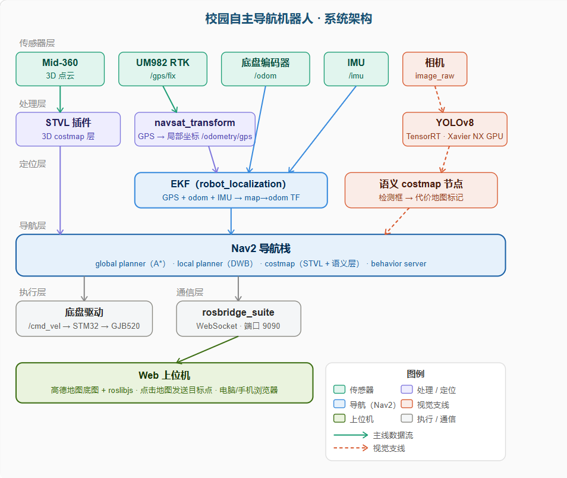

# 基于 RTK 的校园自主导航机器人

## 功能模块任务拆分文档

> 版本：v1.0 · 2026年4月 · 本文档供项目成员任务认领使用

### 硬件/软件清单

|硬件/软件|型号|状态|
|---|---|---|
|计算平台|Jetson Xavier NX|✅ 运行中|
|激光雷达|Livox Mid-360|✅ 驱动就绪|
|定位模块|UM982 RTK 双天线|✅ 驱动就绪（CPU待优化）|
|底盘|四轮差速 + GJB520 × 4|✅ 驱动就绪|
|主控|STM32 + yahboomcar驱动|✅ 运行中|
|导航栈|ROS2 Humble + Nav2|⏳ 待接入|

---

## 0. 项目总体架构

本项目目标：在校园室外硬化路面环境中，输入一个 RTK 坐标，机器人自主规划路径、实时避障并到达目标位置。

整体分为三条并行开发线：

- **主线**：Nav2 无图导航（核心功能，其他模块依赖此模块跑通）
- **支线A**：Web 上位机（地图可视化 + 手机/电脑操控界面）
- **支线B**：视觉语义避障（YOLO 识别行人/车辆，增强 costmap）

**当前优先级：** `1.2 UM982优化` → `1.1 STVL接入` → `1.3 EKF调参` → `1.4 联调` → 支线并行




---

## 1. 主线：Nav2 无图导航

### 1.1 Mid-360 3D点云接入 Nav2

仿真阶段用 2D 激光雷达是为了简化验证，实物阶段使用 Mid-360 的 3D 点云直接接入 Nav2，采用 `spatio_temporal_voxel_layer` 作为 costmap 层，可感知不同高度的障碍物（台阶、低矮障碍物等）。

**技术路线**

- 安装配置 `spatio_temporal_voxel_layer`（stvl）插件
- 修改 `nav2_params.yaml`，将 local/global costmap 的 `obstacle_layer` 替换为 stvl
- 配置点云话题订阅：`/livox/lidar` → stvl
- 调整体素分辨率、清除时间等参数，在 Rviz 中验证 costmap 生成正确
- 测试静态障碍物、移动障碍物的感知效果

**关键参数**

```yaml
# nav2_params.yaml 修改示例
local_costmap:
  local_costmap:
    ros__parameters:
      plugins: ["stvl_layer", "inflation_layer"]
      stvl_layer:
        plugin: "spatio_temporal_voxel_layer/SpatioTemporalVoxelLayer"
        enabled: true
        voxel_decay: 15.0        # 体素保留时间（秒）
        decay_model: 0           # 0=线性衰减
        voxel_size: 0.05         # 体素分辨率（米）
        track_unknown_space: true
        observation_sources: livox_pointcloud
        livox_pointcloud:
          topic: /livox/lidar
          data_type: PointCloud2
          marking: true
          clearing: true
          min_obstacle_height: 0.1
          max_obstacle_height: 2.0
```

> ⚠️ **注意：** Xavier NX 当前 CPU 已约 90%，stvl 比 2D laserscan 方案更耗资源。务必先关闭 Rviz 在车上运行，改用远程电脑连接查看。

|子任务|主要工作内容|难度|
|---|---|---|
|安装 stvl 依赖并编译|`sudo apt install ros-humble-spatio-temporal-voxel-layer`，验证编译通过|入门|
|修改 nav2_params.yaml|将两个 costmap 的插件替换为 stvl，配置点云话题和体素参数|中等|
|静态障碍物测试|在 Rviz 中确认 costmap 能正确标记静态障碍物|入门|
|动态障碍物测试|行人走过时 costmap 能标记并在离开后清除|中等|

---

### 1.2 UM982 CPU 占用排查与优化

当前 `um982_node` 占用 63% CPU 不合理（正常应低于 10%），需在接入 Nav2 前解决，否则系统无法稳定运行。

**排查方向**

- 检查串口读取方式：是否使用忙等待（`while True` 轮询）而非中断/select 机制
- 检查解析频率：UM982 输出频率是否过高（建议 GPS 10Hz，航向 10Hz 即可）
- 检查是否有不必要的话题发布（每帧都序列化发布会增加 CPU 开销）

**排查命令**

```bash
# 查看 um982_node 的线程占用
top -H -p $(pgrep -f um982_node)

# 查看串口实际接收频率
ros2 topic hz /gps/fix
ros2 topic hz /imu/data

# 查看节点发布的所有话题
ros2 node info /um982_node
```

|子任务|主要工作内容|难度|
|---|---|---|
|排查 CPU 异常原因|用 top/perf 定位热点，判断是串口读取还是解析逻辑问题|中等|
|优化串口读取|改为 select/epoll 非阻塞读取，避免忙等待|较难|
|降低不必要发布频率|GPS 位置 10Hz、航向 10Hz，IMU 可保留 100Hz|入门|

---

### 1.3 EKF + RTK 定位融合调参

仿真阶段已验证 EKF 融合框架，实物阶段需要针对真实传感器噪声进行调参，使定位输出平滑稳定。

**技术路线**

- 确认 UM982 输出话题格式与 `navsat_transform` 兼容（NavSatFix + 航向角）
- 在空旷场地静止放置，观察 `/odometry/filtered` 的位置抖动范围
- 调整 `ekf.yaml` 中各传感器的过程噪声协方差（Q矩阵）
- 直线行驶 50 米，对比 RTK 原始轨迹和 EKF 融合轨迹，验证融合效果
- GPS 信号遮挡测试（在高楼旁/树荫下），观察定位漂移情况

|子任务|主要工作内容|难度|
|---|---|---|
|话题格式验证|确认 UM982 驱动输出的 NavSatFix 格式正确，航向角话题可用|入门|
|静止抖动测试|记录静止时 `/odometry/filtered` 的 x/y 抖动，应 < 0.3m|入门|
|EKF 协方差调参|根据实测噪声调整 Q/R 矩阵，使输出平滑|较难|
|遮挡场景测试|记录 RTK Fix/Float 切换时的定位连续性|中等|

---

### 1.4 Nav2 整体联调

所有子模块就绪后，进行 Nav2 全栈联调，验证端到端导航效果。

**验收标准**

- 在校园空旷路面，输入 50 米外的 RTK 坐标，小车能自主导航到达，误差 < 1 米
- 路径上放置纸箱，小车能检测到并绕行
- 行人横穿路径时，小车能减速等待或绕行
- 关闭 Rviz 后，系统 CPU 占用 < 80%，运行稳定

|子任务|主要工作内容|难度|
|---|---|---|
|编写 hardware bringup launch|整合所有真实硬件节点的启动文件，替换仿真版本|中等|
|空旷场地端到端测试|输入 RTK 坐标，验证能否到达目标点|中等|
|障碍物绕行测试|静态/动态障碍物场景测试|中等|
|长距离稳定性测试|连续运行 30 分钟，记录 CPU/内存/定位漂移|入门|

---

## 2. 支线A：Web 上位机

开发一个网页端上位机，同时支持电脑浏览器和手机浏览器访问。集成高德地图作为背景，通过 rosbridge 与 ROS2 通信，实现地图可视化和导航控制。

### 2.1 系统架构

```
Xavier NX（ROS2）
    ↓  rosbridge_suite（WebSocket，端口 9090）
    ↓
浏览器（电脑/手机）
    ├── 高德地图 JS SDK（显示卫星地图底图）
    ├── roslibjs（订阅 /odometry/filtered，实时显示小车位置）
    ├── 点击地图 → 转换为 RTK 坐标 → 发布到 /goal_pose
    └── 订阅 /scan 或 /livox/lidar → 显示障碍物
```

### 2.2 技术路线

**后端（ROS2 侧）**

- 安装 rosbridge_suite：`ros2 launch rosbridge_server rosbridge_websocket_launch.xml`
- 确认 Xavier NX 和客户端设备在同一局域网（或配置内网穿透）
- 编写坐标转换节点：将高德地图经纬度坐标转换为 Nav2 的 map 坐标系目标点

**前端（Web 侧）**

- 使用高德地图 JS API 2.0 显示卫星底图
- 引入 roslibjs 库，通过 WebSocket 连接 rosbridge
- 订阅 `/odometry/filtered`，在地图上实时更新小车位置标记
- 用户点击地图位置 → 发布 `geometry_msgs/PoseStamped` 到 `/goal_pose`
- 订阅 `/livox/lidar` 或 costmap 话题，在地图上叠加显示障碍物

**关键代码片段**

```javascript
// 连接 rosbridge
const ros = new ROSLIB.Ros({ url: 'ws://192.168.x.x:9090' });

// 订阅小车位置
const odomSub = new ROSLIB.Topic({
  ros, name: '/odometry/filtered',
  messageType: 'nav_msgs/Odometry'
});
odomSub.subscribe(msg => {
  const x = msg.pose.pose.position.x;
  const y = msg.pose.pose.position.y;
  // 转换为经纬度后更新地图标记
});

// 发布导航目标
const goalPub = new ROSLIB.Topic({
  ros, name: '/goal_pose',
  messageType: 'geometry_msgs/PoseStamped'
});
// 用户点击地图时调用
goalPub.publish({ header: {...}, pose: { position: {x, y, z:0}, orientation: {w:1} } });
```

|子任务|主要工作内容|难度|
|---|---|---|
|部署 rosbridge_suite|在 Xavier NX 安装并启动 rosbridge，验证 WebSocket 连通|入门|
|高德地图基础页面|创建 HTML 页面，集成高德地图卫星底图，申请 API Key|入门|
|roslibjs 接入|在页面中连接 rosbridge，订阅话题并在控制台打印验证|入门|
|小车位置实时显示|将 `/odometry/filtered` 的坐标转换为经纬度，在地图上显示标记|中等|
|点击地图发送目标点|点击地图获取经纬度，转为 map 坐标系，发布到 `/goal_pose`|中等|
|坐标系转换节点|编写 ROS2 节点，处理 Web 端发来的经纬度并转为导航目标|较难|
|手机端适配|CSS 响应式布局，确保手机浏览器正常使用|入门|
|障碍物/costmap 可视化|在地图上叠加显示障碍物或 costmap 数据（可选进阶）|较难|

---

## 3. 支线B：YOLO 语义避障

利用 Xavier NX 的 GPU，运行 YOLO 目标检测模型识别行人、车辆等动态障碍物，将检测结果以代价地图的形式叠加到 Nav2 的 costmap 中，增强动态避障能力。

### 3.1 系统架构

```
相机图像 (/camera/image_raw)
    ↓
YOLO 检测节点（TensorRT 加速）
    ↓  检测框 + 类别 + 置信度
语义 costmap 节点
    ↓  将检测到的障碍物投影到 costmap
Nav2 costmap（叠加语义层）
    ↓
规划器绕行动态障碍物
```

### 3.2 技术路线

**阶段一：YOLO 部署**

- 选用 YOLOv8n（nano 版本，适合 Xavier NX 实时推理）
- 使用 TensorRT 将模型转换为 `.engine` 格式，推理速度提升 3-5 倍
- 发布检测结果话题：类别、置信度、2D 边界框

**阶段二：深度融合**

- 用 Mid-360 点云或双目相机获取障碍物深度，将 2D 检测框投影到 3D 空间
- 计算障碍物在 map 坐标系中的位置和大小

**阶段三：costmap 集成**

- 编写自定义 costmap 插件，订阅检测结果并在对应位置标记代价值
- 对行人标记更高代价（更大安全距离），对静态障碍物正常标记
- 实现时间衰减：目标离开后，对应 costmap 区域逐渐清除

```bash
# Xavier NX 上运行 TensorRT 加速的 YOLOv8
pip install ultralytics

# 导出 TensorRT engine
yolo export model=yolov8n.pt format=engine device=0

# 推理测试（验证帧率）
yolo predict model=yolov8n.engine source=0 show=true
```

> 📌 **Xavier NX GPU 性能参考：** YOLOv8n TensorRT 推理约 30-60 FPS，YOLOv8s 约 15-30 FPS。建议先用 nano 版本验证流程，再考虑换更大的模型。

|子任务|主要工作内容|难度|
|---|---|---|
|相机驱动接入|确认相机话题 `/camera/image_raw` 正常发布|入门|
|YOLOv8 基础运行|在 Xavier NX 上安装 ultralytics，跑通 CPU 推理|入门|
|TensorRT 加速|导出 `.engine` 文件，验证 GPU 推理帧率 > 20FPS|中等|
|封装为 ROS2 节点|检测结果发布为 `vision_msgs/Detection2DArray` 话题|中等|
|3D 位置估计|结合点云获取障碍物深度，投影到 map 坐标系|较难|
|自定义 costmap 插件|编写 nav2_costmap_2d 插件，将检测结果写入代价地图|较难|
|联调测试|行人走过时，costmap 能标记并引导小车绕行|中等|

---

## 4. 新成员推荐上手路径

建议大一同学按以下顺序推进，避免在环境配置上卡太久：

### Week 1-2：环境熟悉

- 在自己电脑上安装 Ubuntu 22.04 + ROS2 Humble（虚拟机也可）
- 完成 ROS2 官方 beginner tutorials，理解话题/节点/launch 的基本概念
- clone 项目仓库（simulation 分支），在本地跑通仿真导航

### Week 3-4：认领子任务

- 根据兴趣选择一个模块（导航调参 / Web前端 / YOLO视觉）
- 阅读对应模块的技术路线，搭建本地开发环境
- 先完成第一个「入门」难度的子任务，验证链路通畅

### Week 5+：迭代开发

- 每周同步进展，遇到问题及时提出
- 优先保证 1.1 主线跑通，支线模块可以并行推进

> 💡 **给新成员的建议：** ROS2 学习曲线陡峭，前两周不要急于上手硬件。先把仿真跑通，理解数据流向，再动真实硬件事半功倍。