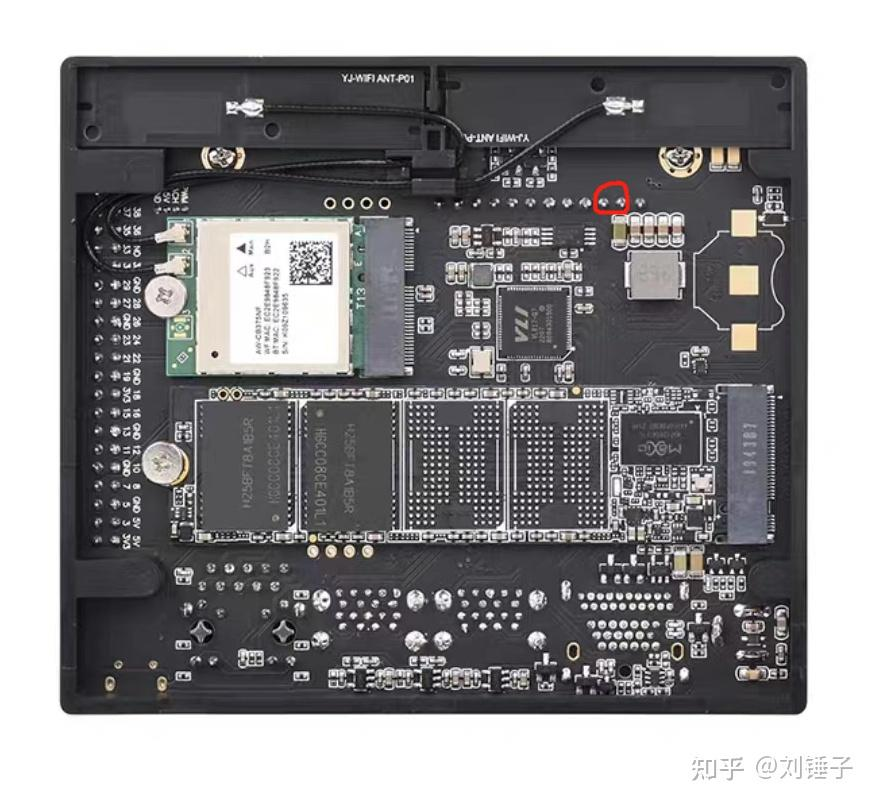
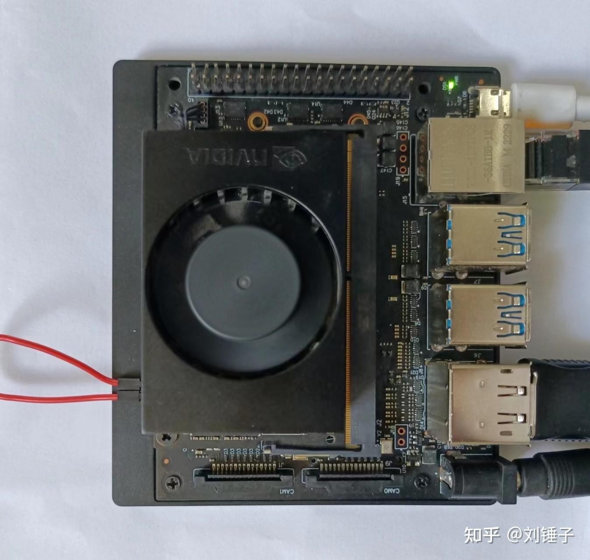
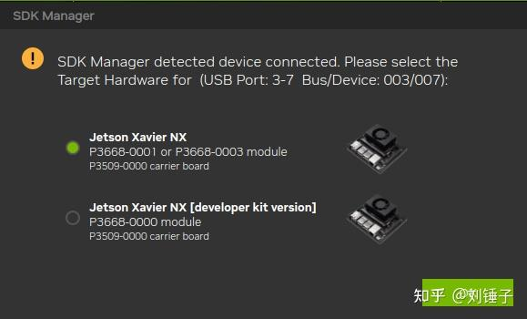
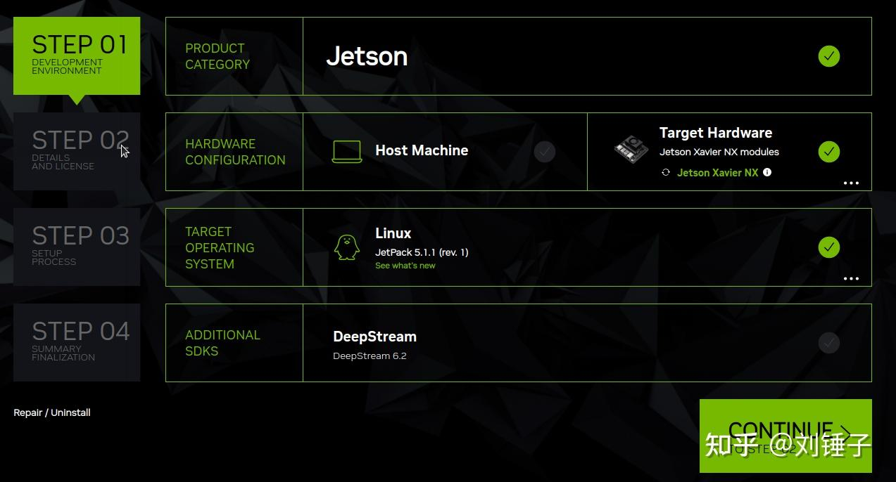
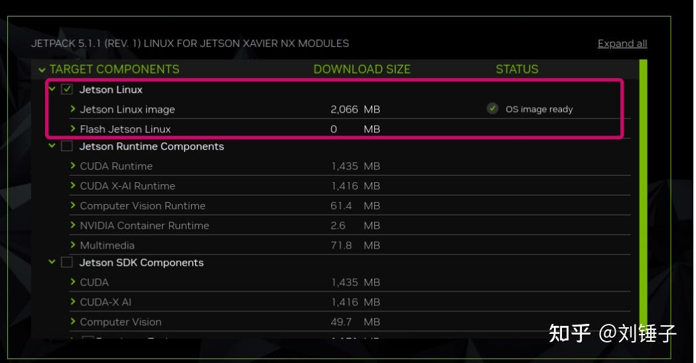
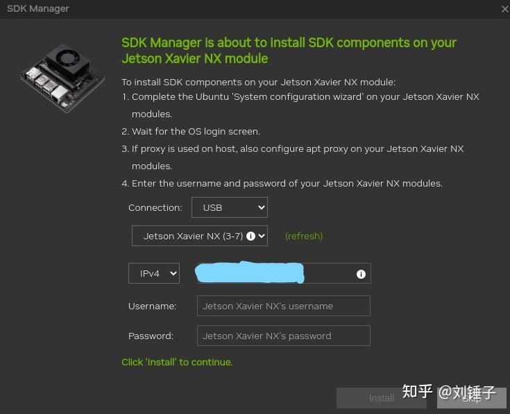
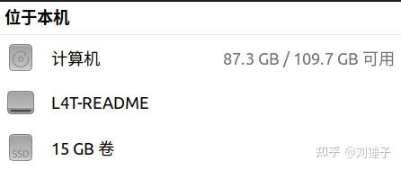
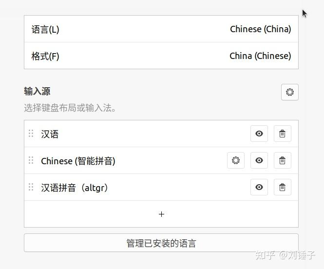

> **转载说明**
>
> - 原文标题：Jetson Xavier Nx烧录刷机安装Ubuntu20.04系统及后续配置  
> - 原文作者：刘锤子  
> - 原文链接：<https://zhuanlan.zhihu.com/p/635654880>  
> - 说明：按你的要求，这篇内容以**转载整理**方式收录进 Wiki，正文主线基本保留，图片已保存到本仓库本地资源目录，避免后续外链失效。

这篇文章主要讲 3 件事：

1. 怎么给 **Jetson Xavier NX（eMMC 版本）** 刷入 **JetPack 5 / Ubuntu 20.04**。
2. 刷机过程中几个很容易踩坑的点，比如上位机系统版本、刷机模式、网络连接方式。
3. 刷完以后，怎么把系统迁移到 SSD / NVMe，解决 eMMC 16G 空间不够的问题。

## 1. 背景说明

Jetson Xavier NX 到手时，很多板子默认还是 **JetPack 4.3 ~ 4.6**，对应的通常是 **ARM 架构的 Ubuntu 18.04**。但实际开发里，Ubuntu 20.04 的使用场景已经更多，所以原文提供了一套升级到 **JetPack 5 / Ubuntu 20.04** 的办法。

另外，国内常见的 NX 板子很多是 **eMMC 版本**，而不是 SD 卡版本。eMMC 版板载空间只有 **16G**，所以这篇文章除了刷机，还补了一段 **系统扩容** 的做法。

## 2. 准备工作

eMMC 版本的 NX 需要在上位机安装 NVIDIA 官方的 **SDK Manager**：

- SDK Manager：<https://developer.nvidia.com/sdk-manager>

为了让板子进入 recovery 模式，原文提到需要准备：

- 一根杜邦线，用来连接板子的 **GND** 与 **REC** 引脚
- 一根 USB 线，用来连接烧录上位机和 NX
- 刷机过程中需要先卸下板载硬盘

GND 与 REC 引脚位置如下：



实物连接示意如下：



原文额外强调了一点：**建议直接用双系统，不建议用虚拟机刷机。**

还有一个关键限制：

- **Ubuntu 20.04 上位机** 才能给 NX 刷 **JetPack 5**
- **Ubuntu 18.04 上位机** 才能刷 **JetPack 4**

这个版本对应关系很关键，弄错了后面基本都会卡住。

## 3. 用 SDK Manager 开始刷机

打开 SDK Manager，没有账号就先注册一个。原文建议优先使用 **Gmail** 注册登录，其他邮箱可能会报错。

### STEP 1：连接 NX 板子

连接好以后，SDK Manager 会自动识别开发板，直接选择 NX 即可。



然后选择 JetPack 版本。因为这里不是用虚拟机刷机，所以只勾选原文中展示的必要部分即可。



### STEP 2：选择需要下载和烧录的内容

原文这里的建议非常明确：

- **eMMC 版本只刷最基础的系统部分**
- 不要把其余组件全勾上

原因也很直接：**16G eMMC 空间不够，完整安装容易失败。**



### STEP 3：开始下载安装流程

下载完成后进入安装阶段，这里会弹出配置窗口。原文要求：

- 选择 **Manual Setup**
- 底部保持 **EMMC/SD Card (default)**
- 然后设置主机名和密码，再继续安装

后续 Ubuntu 会自动完成安装，不会再重复走名称、密码、磁盘分配那一套初始化流程。

还有一个很容易忽略的条件：

> 安装阶段要保证上位机和 NX 板子处在同一个网络里，可以直接走网线，否则容易报错。

原文给出的报错示意如下：



### STEP 4：完成下载与安装

当所有下载和刷写完成后，界面会跳到类似下图的状态，此时系统已经安装到 NX 上。


原文这里有个很重要的提醒：

- **不要立刻拔掉 USB 烧录线**
- JetPack 4 / Ubuntu 18.04 系列作者测试可以拔线
- 但 **JetPack 5 / Ubuntu 20.04 系列不要拔线**
- recovery 短接线这时候可以拔掉

之后接上 HDMI 显示器，可以看到系统初始化并重启。等出现熟悉的 Ubuntu 首次安装界面，完成语言等初始化配置后，才可以拔掉 USB 烧录线。

## 4. 刷完后先扩容

原文建议：**刷完系统以后先别装别的，优先做扩容。**

原因是 NX 的 eMMC 已经装了 Ubuntu 20.04，剩余空间不多，后面开发会非常难受。国内很多代理商会给板子配 **128G SSD**，这时候可以把之前卸下来的硬盘重新格式化并装回去，为后续系统迁移做准备。


原文给出的扩容方式是用 `jetsonhacks/rootOnNVMe`，命令只有几步。

先克隆仓库：

```bash
git clone https://github.com/jetsonhacks/rootOnNVMe.git
```

进入目录：

```bash
cd rootOnNVMe
```

复制根文件系统到 SSD：

```bash
./copy-rootfs-ssd.sh
```

再执行服务配置脚本，并按原文说明重启：

```bash
./setup-service.sh
```

仓库地址：<https://github.com/jetsonhacks/rootOnNVMe>

迁移完成后，系统就可以从 SSD / NVMe 启动，空间也会跟着扩出来。



### 4.1 实测补充：新 NVMe 没有分区时，直接迁移可能失败

你这边实测踩到了一个很关键的坑：**如果 NVMe 是新盘，还没有做任何分区，直接跑 `copy-rootfs-ssd.sh` 可能会失败。**

现象通常是这样：

- 前面的 `mount` 就已经报错
- NVMe 挂载后还是空的
- `service` 没装上
- 最终系统没有成功迁移到 NVMe

本质上就是：**目标盘还没有可用分区和文件系统，脚本自然没法把根文件系统复制进去。**

这种情况下，可以手动做一遍：先分区、再格式化、再挂载、再用 `rsync` 同步根文件系统，最后再执行 `setup-service.sh`。

#### 第一步：分区并格式化 NVMe

```bash
# 1. 分区 + 格式化
sudo parted /dev/nvme0n1 mklabel gpt
sudo parted /dev/nvme0n1 mkpart primary ext4 0% 100%
sudo mkfs.ext4 /dev/nvme0n1p1
```

#### 第二步：挂载并复制根文件系统

```bash
# 2. 挂载并复制根文件系统
sudo mount /dev/nvme0n1p1 /mnt
sudo rsync -axHAWX --numeric-ids --info=progress2 --exclude={"/dev/","/proc/","/sys/","/tmp/","/run/","/mnt/","/media/","/lost+found"} / /mnt/
```

#### 第三步：确认复制成功

```bash
ls /mnt/etc /mnt/usr /mnt/bin
```

`rsync` 会跑几分钟，等它执行完成，并且确认 `/mnt` 下已经有完整的系统目录后，再继续执行：

```bash
cd ~/rootOnNVMe
./setup-service.sh
sudo reboot
```

这段补充很重要，尤其适合下面这种场景：

- 刚换的新 NVMe
- 盘里还是空白状态
- 没有现成分区
- 原教程里的自动脚本一步没走通

如果你后面再折腾别的 Jetson 板子，碰到“脚本跑了但盘里还是空的”这种情况，优先先检查：

```bash
lsblk
sudo fdisk -l
```

先确认目标盘是不是已经真的有分区、有文件系统，再继续迁移，不然很容易白跑一遍。

## 5. 后续基础配置

### 5.1 中文语言与中文输入法

如果重启后发现系统界面不是中文，原文建议直接到系统设置里安装中文语言包和中文输入法。

在 Ubuntu 20.04 下，不需要再额外折腾谷歌拼音、ibus 之类的旧方案，直接在系统设置里添加 **中文拼音** 即可。



### 5.2 VS Code 版本兼容性

原文补充说：**JetPack 5.1.1 不支持最新版本的 VS Code**，作者自测 **1.50** 版本可用。

下载链接如下：

- VS Code 1.50.0（ARM64）：<https://update.code.visualstudio.com/1.50.0/linux-deb-arm64/stable>

### 5.3 无线网异常

原文还提到一个常见问题：

- 系统刷好并正常运行后，可能出现 **无线网图标不显示 / 无法正常连接 Wi‑Fi** 的情况

可尝试的办法包括：

- 重新插拔网卡
- 重启系统
- 如果都不行，试试外接 USB 无线网卡

## 6. 原文总结

原文整体思路很清楚，核心就两句：

- **先用正确版本的 Ubuntu 上位机，通过 SDK Manager 只刷必要系统部分**
- **刷完先做 SSD / NVMe 迁移扩容，再开始后续开发环境配置**

如果过程顺利，作者的原话是：**“不出意外的话，半天之内一定能装好系统！”**

## 资料来源

- 知乎专栏原文：<https://zhuanlan.zhihu.com/p/635654880>
- NVIDIA SDK Manager：<https://developer.nvidia.com/sdk-manager>
- rootOnNVMe：<https://github.com/jetsonhacks/rootOnNVMe>
- VS Code 1.50.0 ARM64：<https://update.code.visualstudio.com/1.50.0/linux-deb-arm64/stable>
