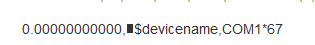
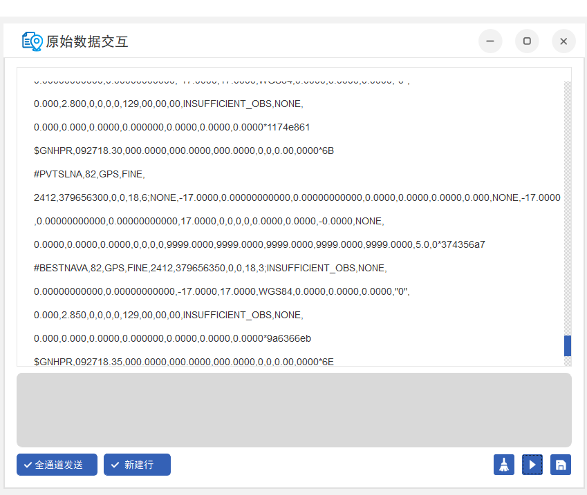
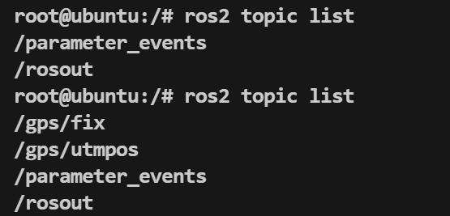
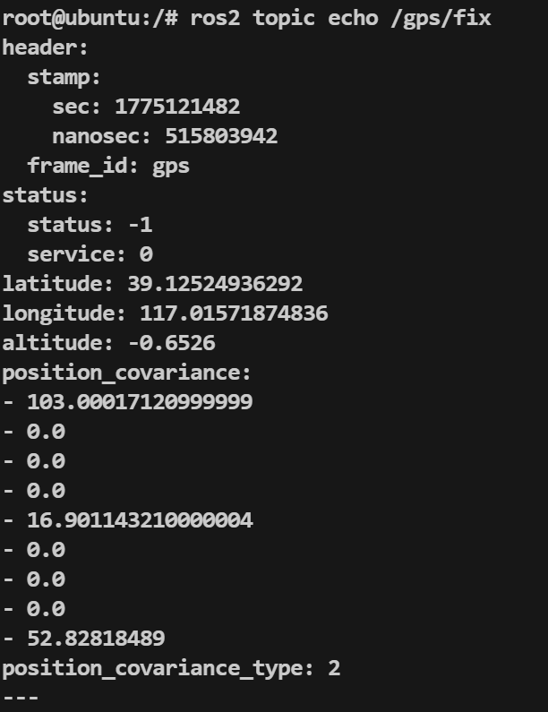

---

## 一、概述

本文档记录了在 Jetson Xavier NX 平台上，通过 Docker 容器（ROS 2 Humble）部署 Unicore UM982 双天线 RTK GPS 模块的 ROS2 驱动的完整过程，包括硬件连接、UM982 串口输出配置、驱动安装与调试、遇到的问题及解决方案。

UM982 配置完成后，驱动会发布以下 ROS2 话题：

- `/gps/fix`（`sensor_msgs/NavSatFix`）：经纬度、海拔、协方差
- `/gps/utmpos`（`nav_msgs/Odometry`）：UTM 坐标、速度、航向四元数

该数据后续将接入 Nav2 GPS Waypoint Follower 实现室外自主导航。

---

## 二、硬件环境

|项目|说明|
|---|---|
|开发板|Jetson Xavier NX（JetPack，rootOnNVMe）|
|GPS 模块|Unicore UM982 集成模块（内置 USB 转串口，免外接转换器）|
|固件版本|R4.10 Build13495|
|连接方式|USB 线直连开发板，映射为 `/dev/ttyUSB0`|
|天线|UM982 双天线（主天线 + 副天线，支持双天线测向）|

---

## 三、软件环境

| 项目        | 说明                                                                      |
| --------- | ----------------------------------------------------------------------- |
| 宿主机系统     | Ubuntu 20.04（Jetson Xavier NX 原生）                                       |
| Docker 容器 | `ros2_humble_22`，基于 Ubuntu 22.04，`--runtime nvidia`                     |
| ROS 2 版本  | Humble Hawksbill                                                        |
| Python 版本 | 3.10                                                                    |
| 驱动仓库      | [ironoa/um982_ros2_driver](https://github.com/ironoa/um982_ros2_driver) |

### 3.1 目录映射关系

|宿主机路径|容器内路径|
|---|---|
|`/home/iot/ros2_ws/workspace/rtk_um982/`|`/ros2_ws/workspace/rtk_um982/`|

### 3.2 Docker 容器说明

容器内运行原生 Ubuntu 22.04，可直接使用 `apt install ros-humble-*` 安装任意 ROS 2 官方包，无需从源码编译。GPU 通过 `--runtime nvidia` 挂载宿主机 CUDA 库，无需在容器内额外安装 CUDA 栈。

进入容器：

```bash
docker exec -it ros2_humble_22 bash
```

---

## 四、UM982 串口输出配置（Windows UPrecise）

> **重要**：UM982 默认不会输出驱动所需的 PVTSLN / GNHPR / BESTNAV 语句，必须先完成此配置步骤。配置通过 `saveconfig` 写入 flash 后永久生效，只需配置一次。

### 4.1 确认 UM982 的 COM 口

UM982 有 COM1 / COM2 / COM3 三个逻辑串口。按下 UM982 的 RST 复位键后，在串口终端中观察输出的 `$devicename` 消息，即可确定当前 USB 连接的是哪个 COM 口：

```
$devicename,COM1*67
```

上面的输出表示当前连接的是 **COM1**。



> **踩坑记录**：最初参照驱动仓库 README 使用了 `COM3`，命令虽然返回 OK，但数据实际从 COM3 引脚输出，而 USB 连接的是 COM1，导致串口端什么数据都收不到。**必须确认实际连接的 COM 口编号。**

### 4.2 使用 UPrecise 配置

1. 将 UM982 通过 USB 连接到 Windows 电脑
2. 打开 UPrecise 软件（[下载地址](https://en.unicore.com/products/uprecise.html)），连接对应串口
3. 在命令窗口依次发送以下命令：

```
PVTSLNA COM1 0.05
GPHPR COM1 0.05
BESTNAVA COM1 0.05
saveconfig
```

各命令说明：

|命令|作用|频率|
|---|---|---|
|`PVTSLNA COM1 0.05`|输出 PVT 定位信息（经纬高、标准差）|20Hz|
|`GPHPR COM1 0.05`|输出航向 / 俯仰 / 横滚角及定位质量|20Hz|
|`BESTNAVA COM1 0.05`|输出最佳导航解（速度、方向）|20Hz|
|`saveconfig`|将当前配置写入非易失存储|—|

> **注意**：上述命令中的 `COM1` 需替换为你实际确认的 COM 口编号。

### 4.3 验证配置成功

配置完成后，串口中应能看到三种消息交替输出：

```
#PVTSLNA,95,GPS,...          ← PVT定位信息
$GNHPR,091003.05,...         ← 航向/姿态信息
#BESTNAVA,84,GPS,...         ← 最佳导航解
$GNGGA,091004.00,...         ← 标准NMEA GGA（每秒1次）
```

室内环境下，数据字段会全为零或显示 `INSUFFICIENT_OBS`，这是正常的——没有卫星信号。到室外有开阔天空的环境下，经纬度字段会被真实定位数据填充。



---

## 五、ROS2 驱动安装

### 5.1 克隆驱动仓库

在 Docker 容器内操作：

```bash
cd /ros2_ws/workspace/rtk_um982/src
git clone https://github.com/ironoa/um982_ros2_driver.git
```

> **注意**：该驱动原始基于 ROS 2 Jazzy 开发，但因为是纯 Python 包，在 Humble 下可直接编译使用，无需修改。

### 5.2 安装 Python 依赖

```bash
pip install pyproj pyserial
```

> 如果提示需要 `--break-system-packages`，加上该参数即可。

### 5.3 代码修复：UTF-8 解码错误

UM982 在上电或复位时，可能通过串口发送包含非 UTF-8 字节的二进制数据，导致驱动的 `readline().decode('utf-8')` 抛出异常崩溃。

**修改文件**：`um982_ros2_driver/um982.py` 中的 `read_frame` 方法

修改前：

```python
def read_frame(self):
    frame = self.ser.readline().decode('utf-8')
```

修改后：

```python
def read_frame(self):
    frame = self.ser.readline().decode('utf-8', errors='ignore')
```

添加 `errors='ignore'` 参数后，遇到无法解码的字节会静默跳过，不会导致程序崩溃。

> **关于文件权限**：如果在宿主机通过 VS Code Remote SSH 编辑该文件时遇到 `EACCES: permission denied` 错误，是因为文件被 Docker 容器以 root 身份创建。在宿主机执行以下命令解决：
> 
> ```bash
> sudo chmod -R 777 /home/iot/ros2_ws/workspace/rtk_um982/src/um982_ros2_driver/
> ```

### 5.4 编译驱动

```bash
cd /ros2_ws/workspace/rtk_um982
colcon build --packages-select um982_ros2_driver
source install/setup.bash
```

---

## 六、运行与验证

### 6.1 启动驱动节点

```bash
cd /ros2_ws/workspace/rtk_um982
source install/setup.bash
ros2 launch um982_ros2_driver um982_ros2_driver.launch.py port:=/dev/ttyUSB0 baud:=115200
```

### 6.2 启动参数说明

|参数|默认值|说明|
|---|---|---|
|`port`|`/dev/ttyUSB0`|UM982 对应的串口设备|
|`baud`|`921600`|串口波特率（我们使用 `115200`）|
|`frame_id`|`gps`|GPS 消息的 frame_id|
|`child_frame_id`|`base_link`|里程计消息的子坐标系|
|`publish_rate`|`20.0`|发布频率（Hz）|
|`invert_heading`|`False`|是否反转航向角|

### 6.3 查看话题数据

打开另一个终端进入容器：

```bash
docker exec -it ros2_humble_22 bash
ros2 topic list
```

应能看到：

```
/gps/fix
/gps/utmpos
/parameter_events
/rosout
```


查看 GPS 定位数据：

```bash
ros2 topic echo /gps/fix
```

室内测试输出示例（已获得粗略定位，但精度较低）：

```yaml
header:
  frame_id: gps
status:
  status: -1        # STATUS_NO_FIX，室内信号差
latitude: 39.12524936292
longitude: 117.01571874836
altitude: -0.6526
position_covariance:
- 103.0              # 纬度方差，较大表示精度低
- 0.0
- 0.0
- 0.0
- 16.9               # 经度方差
- 0.0
- 0.0
- 0.0
- 52.8               # 高程方差
position_covariance_type: 2   # DIAGONAL_KNOWN
```

### 6.4 定位状态（status 字段）含义

|status 值|含义|对应 quality|
|---|---|---|
|`-1`|`STATUS_NO_FIX` — 无有效定位|0|
|`0`|`STATUS_FIX` — 单点定位|1, 2, 5 等|
|`1`|`STATUS_SBAS_FIX` — SBAS 增强|9|
|`2`|`STATUS_GBAS_FIX` — RTK 固定解|4|

---

## 七、踩坑记录

### 7.1 驱动仓库 404

最初尝试克隆的仓库 `tyleralford/unicore-um982-ros2-driver` 已不存在（返回 404）。替代方案为 `ironoa/um982_ros2_driver`。

验证方法：

```bash
curl -s -o /dev/null -w "%{http_code}" https://github.com/xxx/xxx
```

### 7.2 Git clone 弹出认证提示

即使仓库是 public 的，如果系统配置了 Git credential helper 且缓存了错误的凭据，clone 时会弹出用户名密码提示并失败。解决方法：

```bash
GIT_TERMINAL_PROMPT=0 git clone https://github.com/ironoa/um982_ros2_driver.git
```

如果仍然失败，说明仓库不存在或为 private。

### 7.3 COM 口配错导致无数据

UM982 有 COM1/COM2/COM3 三个逻辑串口。配置输出语句时指定的 COM 口必须与实际 USB 连接的 COM 口一致，否则命令虽然返回 OK，但数据会从另一个物理引脚输出，USB 端什么都收不到。

**确认方法**：按下 UM982 RST 键，观察串口输出的 `$devicename,COMx` 消息。

### 7.4 UTF-8 解码崩溃

UM982 上电时可能发送非 UTF-8 二进制数据，导致驱动 `readline().decode('utf-8')` 抛出异常。解决方案见第五节 5.3。

### 7.5 串口被占用

串口设备（`/dev/ttyUSB0`）同一时间只能被一个程序打开。如果之前用 `picocom` 或其他工具连接过串口且未正确退出，驱动启动时会报错。

排查方法：

```bash
ps aux | grep -E "picocom|minicom|ttyUSB"
```

有残留进程则 `kill` 掉。`picocom` 的正确退出方式是 `Ctrl+A` 再按 `X`。

### 7.6 室内无法定位

室内环境下 UM982 无法接收到足够的卫星信号，PVTSLN 中的经纬度为全零，BESTNAV 显示 `INSUFFICIENT_OBS`。这是硬件物理限制，不是软件问题。需要到室外开阔环境测试。

冷启动首次定位通常需要 30 秒至 1 分钟。

### 7.7 文件权限问题

Docker 容器以 root 运行，创建的文件在宿主机上属于 root。通过 VS Code Remote SSH（以普通用户 `iot` 登录）编辑这些文件时会遇到权限拒绝。

解决方案：

```bash
sudo chmod -R 777 /home/iot/ros2_ws/workspace/rtk_um982/src/um982_ros2_driver/
```

---

## 八、提示

已经将原仓库fork，并且根据上述修改说明进行修改，提交至仓库：
[ana52070/um982_ros2_humble_driver: Driver for UNICORECOMM UM882/UM980 GPS](https://github.com/ana52070/um982_ros2_humble_driver)


---

## 九、参考资料

- 驱动仓库：[https://github.com/ironoa/um982_ros2_driver](https://github.com/ironoa/um982_ros2_driver)
- UM982 产品页：[https://en.unicore.com/products/dual-antenna-gnss-um982/](https://en.unicore.com/products/dual-antenna-gnss-um982/)
- UPrecise 下载：[https://en.unicore.com/products/uprecise.html](https://en.unicore.com/products/uprecise.html)
- 上游 Python 驱动：[https://github.com/sunshineharry/UM982Driver](https://github.com/sunshineharry/UM982Driver)