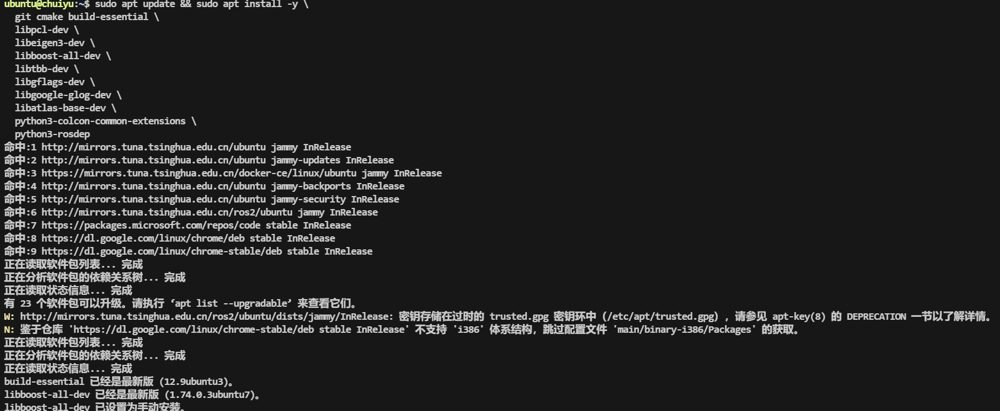

# FASTLIO2_ROS2 完整部署教程

> **环境前提**：Ubuntu 22.04 原生系统 + ROS2 Humble (desktop-full) 已安装  
> **目标雷达**：Livox Mid-360  
> **项目地址**：https://github.com/liangheming/FASTLIO2_ROS2

---

## 0. 系统基础依赖

先把后续编译需要的基础库全部装好，避免中途缺包：

```bash
sudo apt update && sudo apt install -y \
  git cmake build-essential \
  libpcl-dev \
  libeigen3-dev \
  libboost-all-dev \
  libtbb-dev \
  libgflags-dev \
  libgoogle-glog-dev \
  libatlas-base-dev \
  python3-colcon-common-extensions \
  python3-rosdep
```

确认 ROS2 环境可用：

```bash
source /opt/ros/humble/setup.bash
```

---

## 1. 编译安装 Sophus

FASTLIO2_ROS2 依赖 Sophus 李群库。注意必须 checkout 到 `1.22.10` 版本，并且禁用 fmt 依赖（否则编译项目时会报错）：

```bash
cd ~/Downloads
git clone https://github.com/strasdat/Sophus.git
cd Sophus
git checkout 1.22.10

mkdir build && cd build
cmake .. -DSOPHUS_USE_BASIC_LOGGING=ON
make -j$(nproc)
sudo make install
```

**关键说明**：`-DSOPHUS_USE_BASIC_LOGGING=ON` 会去除对 fmt 库的依赖。如果不加这个选项，后续编译 FASTLIO2 时会出现 fmt 相关的链接错误。

---

## 2. 编译安装 GTSAM

GTSAM 是位姿图优化（PGO）模块的核心依赖。在 Ubuntu 22.04 上建议使用 4.2a9 版本，并启用系统 Eigen：

```bash
cd ~/Downloads
git clone https://github.com/borglab/gtsam.git
cd gtsam
git checkout 4.2a9

mkdir build && cd build
cmake .. \
  -DGTSAM_BUILD_EXAMPLES_ALWAYS=OFF \
  -DGTSAM_BUILD_TESTS=OFF \
  -DGTSAM_WITH_TBB=OFF \
  -DGTSAM_USE_SYSTEM_EIGEN=ON \
  -DGTSAM_BUILD_WITH_MARCH_NATIVE=OFF
make -j$(nproc)
sudo make install
```

> **为什么 `-DGTSAM_USE_SYSTEM_EIGEN=ON`？**  
> Ubuntu 22.04 系统自带 Eigen 3.4，如果不加此选项，GTSAM 会使用自带的 Eigen，可能导致和 PCL/其他库的 Eigen 版本冲突，出现诡异的段错误。

> **为什么 `-DGTSAM_WITH_TBB=OFF`？**  
> TBB 在某些环境下会引入线程调度问题，对 SLAM 这类对线程模型敏感的应用来说，关掉更稳定。如果你确认需要 TBB 加速，可以改为 ON。

安装完成后刷新动态库缓存：

```bash
sudo ldconfig
```

---

## 3. 编译安装 Livox-SDK2

Livox Mid-360 使用的是 SDK2（不是旧的 Livox-SDK）：

```bash
cd ~/Downloads
git clone https://github.com/Livox-SDK/Livox-SDK2.git
cd Livox-SDK2

mkdir build && cd build
cmake .. && make -j$(nproc)
sudo make install
```

---

## 4. 编译安装 livox_ros_driver2

livox_ros_driver2 是 Livox 雷达的 ROS2 驱动，它有自己的构建脚本，需要单独编译：

```bash
cd ~/Downloads
mkdir -p ws_livox/src
git clone https://github.com/Livox-SDK/livox_ros_driver2.git ws_livox/src/livox_ros_driver2

cd ws_livox/src/livox_ros_driver2
# 确保 ROS2 环境已 source
source /opt/ros/humble/setup.bash
./build.sh humble
```

编译成功后，source 这个工作空间（后续编译 FASTLIO2 也需要它）：

```bash
source ~/Downloads/ws_livox/install/setup.bash
```

**建议**：将此行加入你的 `~/.bashrc`，这样每次打开终端都会自动加载：

```bash
echo "source ~/Downloads/ws_livox/install/setup.bash" >> ~/.bashrc
```

### 配置 Mid-360 连接参数

livox_ros_driver2 的 Mid-360 配置文件位于：

```
ws_livox/src/livox_ros_driver2/config/MID360_config.json
```

你需要根据实际情况修改其中的 IP 地址：

```json
{
  "lidar_summary_info": {
    "lidar_type": 8
  },
  "MID360": {
    "lidar_net_info": {
      "cmd_data_port": 56100,
      "push_msg_port": 56200,
      "point_data_port": 56300,
      "imu_data_port": 56400,
      "log_data_port": 56500
    },
    "host_net_info": {
      "cmd_data_ip": "192.168.1.5",
      "cmd_data_port": 56101,
      "push_msg_ip": "0.0.0.0",
      "push_msg_port": 56201,
      "point_data_ip": "0.0.0.0",
      "point_data_port": 56301,
      "imu_data_ip": "0.0.0.0",
      "imu_data_port": 56401,
      "log_data_ip": "",
      "log_data_port": 56501
    }
  },
  "lidar_configs": [
    {
      "ip": "192.168.1.1xx",
      "pcl_data_type": 1,
      "pattern_mode": 0,
      "extrinsic_parameter": {
        "roll": 0.0,
        "pitch": 0.0,
        "yaw": 0.0,
        "x": 0,
        "y": 0,
        "z": 0
      }
    }
  ]
}
```

- `"ip"` 字段改为你的 Mid-360 雷达实际 IP（出厂默认通常是 `192.168.1.1xx` 格式，具体看雷达标签）
- `"cmd_data_ip"` 改为你电脑的 IP 地址（在同一网段）

---

## 5. 编译 FASTLIO2_ROS2

### 5.1 创建工作空间并克隆代码

```bash
mkdir -p ~/fastlio2_ws/src
cd ~/fastlio2_ws/src
git clone https://github.com/liangheming/FASTLIO2_ROS2.git
```

克隆后的目录结构如下：

```
~/fastlio2_ws/src/FASTLIO2_ROS2/
├── fastlio2/       # 核心 LIO 节点
├── pgo/            # 回环检测 + 位姿图优化
├── localizer/      # 在线重定位
├── hba/            # 一致性地图优化 (BA/HBA)
├── interface/      # 自定义 srv/msg 定义
└── README.md
```

### 5.2 编译

```bash
cd ~/fastlio2_ws

# 确保所有依赖都已 source
source /opt/ros/humble/setup.bash
source ~/Downloads/ws_livox/install/setup.bash

# 编译整个工作空间
colcon build --symlink-install --cmake-args -DCMAKE_BUILD_TYPE=Release
```

> **说明**：
> 
> - `--symlink-install` 使得修改 launch/config 文件不需要重新编译
> - `-DCMAKE_BUILD_TYPE=Release` 开启 -O3 优化，对实时性很关键
> - 如果编译内存不够（比如 8GB 内存），可以用 `colcon build --parallel-workers 2` 限制并行数

编译成功后 source 工作空间：

```bash
source ~/fastlio2_ws/install/setup.bash
```

同样建议加入 `~/.bashrc`：

```bash
echo "source ~/fastlio2_ws/install/setup.bash" >> ~/.bashrc
```

### 5.3 常见编译错误及解决

**错误 1：找不到 Sophus**

```
Could not find a package configuration file provided by "Sophus"
```

原因：Sophus 未正确安装，或 cmake 找不到。检查 `/usr/local/lib/cmake/Sophus/` 是否存在。

**错误 2：fmt 相关报错**

```
error: 'fmt' has not been declared
```

原因：Sophus 编译时没有加 `-DSOPHUS_USE_BASIC_LOGGING=ON`。重新编译 Sophus 即可。

**错误 3：GTSAM Eigen 冲突**

```
static assertion failed: YOU_MIXED_DIFFERENT_NUMERIC_TYPES
```

原因：GTSAM 自带 Eigen 与系统 Eigen 版本冲突。重新编译 GTSAM 并加 `-DGTSAM_USE_SYSTEM_EIGEN=ON`。

**错误 4：找不到 livox_ros_driver2 消息类型**

```
Could not find a package configuration file provided by "livox_ros_driver2"
```

原因：livox_ros_driver2 的 install 空间没有被 source。执行 `source ~/Downloads/ws_livox/install/setup.bash` 后重新编译。

---

## 6. 运行测试

### 6.1 使用数据集测试（推荐先跑通这步）

作者提供了百度网盘数据集：

```
链接: https://pan.baidu.com/s/1rTTUlVwxi1ZNo7ZmcpEZ7A?pwd=t6yb
提取码: t6yb
```

下载后使用 rosbag 播放：

```bash
# 终端 1：启动 LIO 节点
source ~/fastlio2_ws/install/setup.bash
ros2 launch fastlio2 lio_launch.py

# 终端 2：播放数据集
ros2 bag play your_bag_file
```

在 RViz2 中查看建图效果：

```bash
# 终端 3（可选，如果 launch 文件没有自动启动 rviz）
rviz2
```

在 RViz2 中添加以下显示项：

- `PointCloud2` 话题：查看实时点云
- `Path` 话题：查看轨迹
- `TF`：查看坐标系关系

### 6.2 使用实际 Mid-360 雷达

```bash
# 终端 1：启动 Livox 驱动
source ~/Downloads/ws_livox/install/setup.bash
ros2 launch livox_ros_driver2 msg_MID360_launch.py

# 终端 2：启动 LIO 节点
source ~/fastlio2_ws/install/setup.bash
ros2 launch fastlio2 lio_launch.py
```

---

## 7. 进阶功能

### 7.1 回环检测 + PGO（位姿图优化）

```bash
# 启动回环优化节点（包含了 LIO）
ros2 launch pgo pgo_launch.py

# 播放数据或连接雷达
ros2 bag play your_bag_file
```

建图完成后保存地图：

```bash
ros2 service call /pgo/save_maps interface/srv/SaveMaps \
  "{file_path: '/home/$USER/maps', save_patches: true}"
```

> **注意**：如果后续要使用 HBA 一致性地图优化，`save_patches` 必须设为 `true`。

### 7.2 在线重定位

```bash
# 启动重定位节点
ros2 launch localizer localizer_launch.py

# 调用重定位服务，加载已有地图并设置初始位姿
ros2 service call /localizer/relocalize interface/srv/Relocalize \
  "{pcd_path: '/home/$USER/maps/your_map.pcd', x: 0.0, y: 0.0, z: 0.0, yaw: 0.0, pitch: 0.0, roll: 0.0}"

# 检查重定位是否成功
ros2 service call /localizer/relocalize_check interface/srv/IsValid "{code: 0}"
```

### 7.3 一致性地图优化（HBA）

```bash
# 启动 HBA 节点
ros2 launch hba hba_launch.py

# 调用优化服务（maps_path 是之前保存地图的目录）
ros2 service call /hba/refine_map interface/srv/RefineMap \
  "{maps_path: '/home/$USER/maps'}"
```

---

## 8. 性能优化建议

作者在 README 中提到，该项目的 timerCB、subscriber、service 回调运行在同一线程上，在性能不足时会互相阻塞。如果你遇到延迟或丢帧问题，可以考虑：

1. **使用 MultiThreadedExecutor**：将耗时的 timerCB 放到独立线程中执行
2. **降低点云密度**：在 config 中调整降采样参数
3. **确保编译使用 Release 模式**：`-DCMAKE_BUILD_TYPE=Release`
4. **关闭不必要的 RViz 显示**：大量点云渲染会抢占 CPU

---

## 完整的 ~/.bashrc 追加内容

```bash
# ROS2 Humble
source /opt/ros/humble/setup.bash

# Livox ROS Driver 2
source ~/Downloads/ws_livox/install/setup.bash

# FASTLIO2 ROS2 工作空间
source ~/fastlio2_ws/install/setup.bash
```

---

## 依赖关系速查

|依赖|版本/分支|安装方式|用途|
|---|---|---|---|
|PCL|系统自带|`apt install libpcl-dev`|点云处理|
|Eigen3|系统自带 (3.4)|`apt install libeigen3-dev`|矩阵运算|
|Sophus|1.22.10|源码编译|李群/李代数|
|GTSAM|4.2a9|源码编译|因子图优化|
|Livox-SDK2|main|源码编译|Mid-360 底层通信|
|livox_ros_driver2|main|源码编译 (build.sh)|Mid-360 ROS2 驱动|
|Boost|系统自带|`apt install libboost-all-dev`|GTSAM 依赖|
|TBB|系统自带|`apt install libtbb-dev`|可选并行加速|