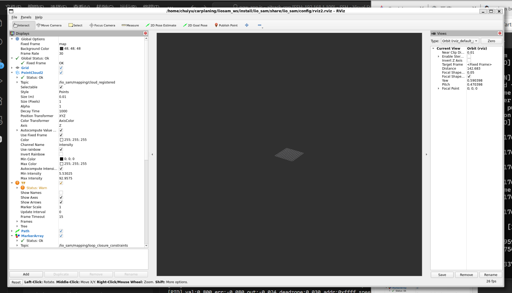
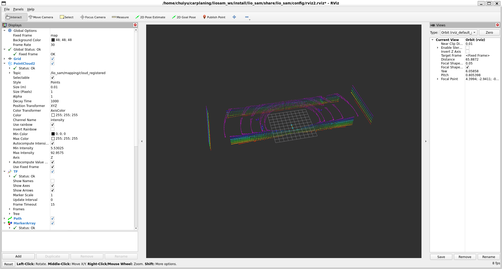

# 3.第二阶段 LIO-SAM 适配
## LIO-SAM环境搭建

### GTSAM 编译
```bash
cd ~
mkdir -p carplaning/3rdparty
git clone https://github.com/borglab/gtsam.git 
cd gtsam 
mkdir build && cd build
cmake -DGTSAM_BUILD_WITH_MARCH_NATIVE=OFF .. 
make -j$(nproc) 
sudo make install

```


### LIO-SAM 编译
```bash

cd ~/carplaning/liosam_ws/src

sudo apt-get install ros-humble-perception-pcl \
                     ros-humble-pcl-msgs \
                     ros-humble-vision-opencv \
                     ros-humble-xacro \
                     ros-humble-geographic-msgs
                     

git clone -b ros2 https://github.com/TixiaoShan/LIO-SAM.git

#新版本的GTSAM 全面转向了 C++ 标准库的 std::shared_ptr,所以需要修改一下源码进行适配
cd ~/carplaning/liosam_ws/src/LIO-SAM/src/ sed -i 's/boost::shared_ptr/std::shared_ptr/g' imuPreintegration.cpp

#编译lio-sam
colcon build --symlink-install --packages-select lio_sam

#这里遇到编译报错就询问ai进行解决，直到编译成功

```


### LIO-SAM 测试
```bash
#运行一键脚本,界面如下图
ros2 launch lio_sam run.launch.py

```




### LIO-SAM 仿真测试

(1)下载数据集
        github的README中有下载链接，下载walking dataset数据集
(2)转换格式
        下载的数据集是ROS1的.bag格式，需要进行转换，执行如下命令
rosbags-convert --src [ROS1格式数据集文件] --dst [ROS2格式数据集路径]

因为不同的数据集的话题可能会与默认的topic不同，这里根据数据集的话题进行修改。
        （1）修改params.yaml文件
 ```yaml
 /**:
  ros__parameters:
 
    # # Topics
    # pointCloudTopic: "/points_raw"                   # Point cloud data
    # imuTopic: "/imu_correct"                        # IMU data
    # odomTopic: "/gx5/nav/odom"                    # IMU pre-preintegration odometry, same frequency as IMU
    # gpsTopic: "/gx5/gps/fix"                    # GPS odometry topic from navsat, see module_navsat.launch file
 
    # # Frames
    # lidarFrame: "velodyne"
    # baselinkFrame: "base_link"
    # odometryFrame: "wgs84_odom_link"
    # mapFrame: "map"
 
    # Topics
    pointCloudTopic: "points_raw"               # Point cloud data
    imuTopic: "imu_raw"                         # IMU data
    odomTopic: "odometry/imu"                   # IMU pre-preintegration odometry, same frequency as IMU
    gpsTopic: "odometry/gpsz"                   # GPS odometry topic from navsat, see module_navsat.launch file
 
    # Frames
    lidarFrame: ""velodyne"
    baselinkFrame: "base_link"
    odometryFrame: "odom"
    mapFrame: "map"
    # GPS Settings
    useImuHeadingInitialization: false           # if using GPS data, set to "true"
    useGpsElevation: false                       # if GPS elevation is bad, set to "false"
    gpsCovThreshold: 2.0                         # m^2, threshold for using GPS data
    poseCovThreshold: 25.0                       # m^2, threshold for using GPS data
    # Export settings
    savePCD: true                               # https://github.com/TixiaoShan/LIO-SAM/issues/3
    savePCDDirectory: "/workspace/CAR/LIO-SAM_ws/pcd"         # in your home folder, starts and ends with "/". Warning: the code deletes "LOAM" folder then recreates it. See "mapOptimization" for implementation
    # Sensor Settings
    sensor: velodyne                               # lidar sensor type, either 'velodyne', 'ouster' or 'livox'
    N_SCAN: 16                                   # number of lidar channels (i.e., Velodyne/Ouster: 16, 32, 64, 128, Livox Horizon: 6)
    Horizon_SCAN: 1800                            # lidar horizontal resolution (Velodyne:1800, Ouster:512,1024,2048, Livox Horizon: 4000)
    downsampleRate: 1                            # default: 1. Downsample your data if too many
    # points. i.e., 16 = 64 / 4, 16 = 16 / 1
    lidarMinRange: 1.0                           # default: 1.0, minimum lidar range to be used
    lidarMaxRange: 1000.0                        # default: 1000.0, maximum lidar range to be used
    # IMU Settings
    imuAccNoise: 3.9939570888238808e-03
    imuGyrNoise: 1.5636343949698187e-03
    imuAccBiasN: 6.4356659353532566e-05
    imuGyrBiasN: 3.5640318696367613e-05
    imuGravity: 9.80511
    imuRPYWeight: 0.01
    extrinsicTrans:  [ 0.0,  0.0,  0.0 ]
    extrinsicRot:    [-1.0,  0.0,  0.0,
                       0.0,  1.0,  0.0,
                       0.0,  0.0, -1.0 ]
    # extrinsicRPY: [ 0.0,  1.0,  0.0,
    #                -1.0,  0.0,  0.0,
    #                 0.0,  0.0,  1.0 ]
    extrinsicRPY: [ 0.0,  -1.0,  0.0,
                   1.0,  0.0,  0.0,
                    0.0,  0.0,  1.0 ]
    # LOAM feature threshold
    edgeThreshold: 1.0
    surfThreshold: 0.1
    edgeFeatureMinValidNum: 10
    surfFeatureMinValidNum: 100
    # voxel filter paprams
    odometrySurfLeafSize: 0.4                     # default: 0.4 - outdoor, 0.2 - indoor
    mappingCornerLeafSize: 0.2                    # default: 0.2 - outdoor, 0.1 - indoor
    mappingSurfLeafSize: 0.4                      # default: 0.4 - outdoor, 0.2 - indoor
    # robot motion constraint (in case you are using a 2D robot)
    z_tollerance: 1000.0                          # meters
    rotation_tollerance: 1000.0                   # radians
    # CPU Params
    numberOfCores: 4                              # number of cores for mapping optimization
    mappingProcessInterval: 0.15                  # seconds, regulate mapping frequency
    # Surrounding map
    surroundingkeyframeAddingDistThreshold: 1.0   # meters, regulate keyframe adding threshold
    surroundingkeyframeAddingAngleThreshold: 0.2  # radians, regulate keyframe adding threshold
    surroundingKeyframeDensity: 2.0               # meters, downsample surrounding keyframe poses   
    surroundingKeyframeSearchRadius: 50.0         # meters, within n meters scan-to-map optimization
    # (when loop closure disabled)
    # Loop closure
    loopClosureEnableFlag: true
    loopClosureFrequency: 1.0                     # Hz, regulate loop closure constraint add frequency
    surroundingKeyframeSize: 50                   # submap size (when loop closure enabled)
    historyKeyframeSearchRadius: 15.0             # meters, key frame that is within n meters from
    # current pose will be considerd for loop closure
    historyKeyframeSearchTimeDiff: 30.0           # seconds, key frame that is n seconds older will be
    # considered for loop closure
    historyKeyframeSearchNum: 25                  # number of hostory key frames will be fused into a
    # submap for loop closure
    historyKeyframeFitnessScore: 0.3              # icp threshold, the smaller the better alignment
    # Visualization
    globalMapVisualizationSearchRadius: 1000.0    # meters, global map visualization radius
    globalMapVisualizationPoseDensity: 10.0       # meters, global map visualization keyframe density
    globalMapVisualizationLeafSize: 1.0           # meters, global map visualization cloud density
 
 ```

```bash

source install/setup.bash
ros2 launch lio_sam run.launch.py

```

```bash
ros2 bag play [三中准备的ROS2的数据集文件夹路径]
```


## 配置 IMU 外参（extrinsicRot / extrinsicTrans）
这是让 LIO-SAM 跑通你自定义仿真车的关键。你的 URDF 里 IMU 挂在 `base_link` 原点（`origin xyz="0 0 0"`），LiDAR 挂在 `xyz="1.2 0 1.4"` 的位置。这个相对关系需要准确填进 `params.yaml`，否则点云拼接会漂移。

具体要做的事是：

1. **确认外参数值** —— 从你的 URDF 直接读出来，LiDAR 相对 IMU 的平移是 `[1.2, 0, 1.4]`，旋转是单位阵（两者姿态一致，都没有旋转偏移）。
2. **修改 params.yaml** —— 把 `extrinsicTrans` 和 `extrinsicRot` 填对。
3. **对齐话题名** —— 你的仿真输出是 `/points_raw` 和 `/imu_raw`，需要确认 `params.yaml` 里的话题配置与之匹配。
4. **跑一圈验证** —— 开车绕场地走一圈，在 Rviz 里看点云地图有没有重影或漂移，以此判断外参是否正确。

```bash
code ~/carplaning/liosam_ws/src/LIO-SAM/config/params.yaml
```


**第一处：话题名对齐**

你的仿真输出话题是 `/points_raw` 和 `/imu_raw`，所以：

yaml

```yaml
pointCloudTopic: "points_raw"
imuTopic: "imu_raw"
gpsTopic: "gps/fix"
```

---

**第二处：雷达参数对齐**

你在 URDF 里配的是 32线、水平1800采样：

yaml

```yaml
sensor: velodyne
N_SCAN: 32
Horizon_SCAN: 1800
```

---

**第三处：外参（最关键）**

从你的 URDF 直接读出来：

- IMU 在 `base_link` 原点：`xyz="0 0 0"`
- LiDAR 在：`xyz="1.2 0 1.4"`，没有旋转偏移

所以 LiDAR 相对于 IMU 的平移就是 `[1.2, 0.0, 1.4]`，旋转是单位矩阵：

yaml

```yaml
extrinsicTrans: [1.2, 0.0, 1.4]

extrinsicRot: [1.0, 0.0, 0.0,
               0.0, 1.0, 0.0,
               0.0, 0.0, 1.0]

extrinsicRPY: [1.0, 0.0, 0.0,
               0.0, 1.0, 0.0,
               0.0, 0.0, 1.0]
```

---

**第四处：坐标帧名**

yaml

```yaml
lidarFrame: "lidar_link"
baselinkFrame: "base_link"
odometryFrame: "odom"
mapFrame: "map"
```

---

**第五处：开启 GPS**

yaml

```yaml
useImuHeadingInitialization: true
useGpsElevation: false
gpsCovThreshold: 2.0
poseCovThreshold: 25.0
```

---

修改完之后，先同时启动仿真和 LIO-SAM，然后用键盘控制车慢慢开一圈，在 Rviz 里观察 `/lio_sam/mapping/cloud_registered` 这个话题，点云地图应该是清晰无重影的。如果出现漂移，基本就是外参没对上，到时候再排查。


修改完后的完整params.yaml：

```yaml

/**:

  ros__parameters:

  

    use_sim_time: true

  

    # Topics

    pointCloudTopic: "/points"                   # Point cloud data

    imuTopic: "/imu/data"                        # IMU data

    odomTopic: "odometry/imu"                    # IMU pre-preintegration odometry, same frequency as IMU

    gpsTopic: "odometry/gpsz"                    # GPS odometry topic from navsat, see module_navsat.launch file

  

    # Frames

    lidarFrame: "lidar_link"

    baselinkFrame: "base_link"

    odometryFrame: "odom"

    mapFrame: "map"

  

    # GPS Settings

    useImuHeadingInitialization: false           # if using GPS data, set to "true"

    useGpsElevation: false                       # if GPS elevation is bad, set to "false"

    gpsCovThreshold: 2.0                         # m^2, threshold for using GPS data

    poseCovThreshold: 25.0                       # m^2, threshold for using GPS data

  

    # Export settings

    savePCD: true                                # https://github.com/TixiaoShan/LIO-SAM/issues/3

    savePCDDirectory: "/LIO-SAM/src/maps/"         # in your home folder, starts and ends with "/". Warning: the code deletes "LOAM" folder then recreates it. See "mapOptimization" for implementation

  

    # Sensor Settings

    sensor: velodyne                             # lidar sensor type, either 'velodyne', 'ouster' or 'livox'

    N_SCAN: 64                                   # number of lidar channels (i.e., Velodyne/Ouster: 16, 32, 64, 128, Livox Horizon: 6)

    Horizon_SCAN: 1800                           # lidar horizontal resolution (Velodyne:1800, Ouster:512,1024,2048, Livox Horizon: 4000)

    downsampleRate: 1                            # default: 1. Downsample your data if too many

    # points. i.e., 16 = 64 / 4, 16 = 16 / 1

    lidarMinRange: 1.0                           # default: 1.0, minimum lidar range to be used

    lidarMaxRange: 1000.0                        # default: 1000.0, maximum lidar range to be used

  

    # IMU Settings

    imuAccNoise: 3.9939570888238808e-03

    imuGyrNoise: 1.5636343949698187e-03

    imuAccBiasN: 6.4356659353532566e-05

    imuGyrBiasN: 3.5640318696367613e-05

  

    imuGravity: 9.80511

    imuRPYWeight: 0.01

  

    extrinsicTrans:  [ 0.0,  0.0,  0.0 ]

    extrinsicRot:    [ 1.0,  0.0,  0.0,

                       0.0,  -1.0,  0.0,

                       0.0,  0.0, -1.0 ]

    extrinsicRPY: [ 1.0,  0.0,  0.0,

                    0.0,  -1.0,  0.0,

                    0.0,  0.0,  -1.0 ]

  

    # LOAM feature threshold

    edgeThreshold: 1.0

    surfThreshold: 0.1

    edgeFeatureMinValidNum: 10

    surfFeatureMinValidNum: 100

  

    # voxel filter paprams

    odometrySurfLeafSize: 0.4                     # default: 0.4 - outdoor, 0.2 - indoor

    mappingCornerLeafSize: 0.2                    # default: 0.2 - outdoor, 0.1 - indoor

    mappingSurfLeafSize: 0.4                      # default: 0.4 - outdoor, 0.2 - indoor

  

    # robot motion constraint (in case you are using a 2D robot)

    z_tollerance: 1000.0                          # meters

    rotation_tollerance: 1000.0                   # radians

  

    # CPU Params

    numberOfCores: 4                              # number of cores for mapping optimization

    mappingProcessInterval: 0.15                  # seconds, regulate mapping frequency

  

    # Surrounding map

    surroundingkeyframeAddingDistThreshold: 1.0   # meters, regulate keyframe adding threshold

    surroundingkeyframeAddingAngleThreshold: 0.2  # radians, regulate keyframe adding threshold

    surroundingKeyframeDensity: 2.0               # meters, downsample surrounding keyframe poses  

    surroundingKeyframeSearchRadius: 50.0         # meters, within n meters scan-to-map optimization

    # (when loop closure disabled)

  

    # Loop closure

    loopClosureEnableFlag: true

    loopClosureFrequency: 1.0                     # Hz, regulate loop closure constraint add frequency

    surroundingKeyframeSize: 50                   # submap size (when loop closure enabled)

    historyKeyframeSearchRadius: 15.0             # meters, key frame that is within n meters from

    # current pose will be considerd for loop closure

    historyKeyframeSearchTimeDiff: 30.0           # seconds, key frame that is n seconds older will be

    # considered for loop closure

    historyKeyframeSearchNum: 25                  # number of hostory key frames will be fused into a

    # submap for loop closure

    historyKeyframeFitnessScore: 0.3              # icp threshold, the smaller the better alignment

  

    # Visualization

    globalMapVisualizationSearchRadius: 1000.0    # meters, global map visualization radius

    globalMapVisualizationPoseDensity: 10.0       # meters, global map visualization keyframe density

    globalMapVisualizationLeafSize: 1.0           # meters, global map visualization cloud density

```
改动了以下几处，用注释标明了原因：

- `pointCloudTopic` → `points_raw`，对应 URDF 里雷达插件的 remapping
- `imuTopic` → `imu_raw`，同上
- `gpsTopic` → `gps/fix`，对应 GPS 插件的 remapping
- `useImuHeadingInitialization` → `true`，因为开了 GPS
- `N_SCAN` → `32`，对应 URDF 里 `<samples>32</samples>`
- `extrinsicTrans` → `[1.2, 0.0, 1.4]`，从 URDF 直接读出
- `extrinsicRot` / `extrinsicRPY` → 单位矩阵，两个传感器姿态一致无旋转偏移
- voxel filter 的三个参数调小了，你的场景是封闭室内，精细一点效果更好


同时，实测IMU没有数据，在这里修改一下xacro：
```bash
code /home/chuiyu/carplaning/liosam_ws/src/audibot/audibot_description/urdf/audibot.urdf.xacro
```

```xml

<?xml version="1.0"?>

<robot name="audibot" xmlns:xacro="http://www.ros.org/wiki/xacro">

  

  <xacro:property name="half_front_track_width" value="0.819" />

  <xacro:property name="half_rear_track_width" value="0.8" />

  <xacro:property name="half_wheelbase" value="1.326" />

  

  <xacro:property name="wheel_radius" value="0.36" />

  <xacro:property name="wheel_thickness" value="0.25" />

  <xacro:property name="wheel_mass" value="40.0" />

  

  <xacro:property name="body_mass" value="1620.0" />

  <xacro:property name="body_width" value="${2*half_rear_track_width}" />

  <xacro:property name="body_depth" value="${2*half_wheelbase + 0.8}" />

  <xacro:property name="body_length" value="0.6" />

  

  <xacro:arg name="pub_tf" default="true" />

  <xacro:arg name="robot_name" default="" />

  <xacro:arg name="blue" default="false" />

  

  <gazebo>

    <!-- Simulated vehicle interface -->

    <plugin name="audibot_interface_plugin" filename="libaudibot_interface_plugin.so" >

      <robot_name>$(arg robot_name)</robot_name>

      <pub_tf>$(arg pub_tf)</pub_tf>

      <tf_freq>100.0</tf_freq>

      <ros>

        <namespace>$(arg robot_name)</namespace>

      </ros>

    </plugin>

  

    <!-- Publish current joint angles -->

    <plugin name="joint_state_publisher" filename="libgazebo_ros_joint_state_publisher.so">

        <joint_name>steer_fl_joint</joint_name>

        <joint_name>steer_fr_joint</joint_name>

        <joint_name>wheel_fl_joint</joint_name>

        <joint_name>wheel_fr_joint</joint_name>

        <joint_name>wheel_rl_joint</joint_name>

        <joint_name>wheel_rr_joint</joint_name>

        <update_rate>100</update_rate>

        <ros>

          <namespace>$(arg robot_name)</namespace>

        </ros>

    </plugin>

  </gazebo>

  

  <xacro:macro name="rear_wheel" params="name x y z flip" >

    <link name="wheel_${name}" >

      <visual>

        <origin xyz="0 0 0" rpy="1.57079632679 ${flip * 3.1415926535} 0" />

        <geometry>

          <mesh filename="file://$(find audibot_description)/meshes/wheel.dae" scale="1 1 1" />

        </geometry>

      </visual>

  

      <collision>

        <geometry>

          <cylinder radius="${wheel_radius}" length="${wheel_thickness}" />

        </geometry>

      </collision>

  

      <inertial>

        <origin xyz="0 0 0" rpy="0 0 0"/>

        <mass value="${wheel_mass}"/>

        <inertia ixx="${wheel_mass/12*(3*wheel_radius*wheel_radius + wheel_thickness*wheel_thickness)}" ixy="0" ixz="0" iyy="${wheel_mass/12*(3*wheel_radius*wheel_radius + wheel_thickness*wheel_thickness)}" iyz="0" izz="${wheel_mass/2 * wheel_radius*wheel_radius}"/>

      </inertial>

  

    </link>

    <joint name="wheel_${name}_joint" type="continuous" >

      <parent link="base_link" />

      <child link="wheel_${name}" />

      <origin xyz="${x} ${y} ${z}" rpy="-1.57079632679 0 0" />

      <axis xyz="0 0 1" />

      <limit effort="-1.0" velocity="-1.0" />

    </joint>

  </xacro:macro>

  

  <xacro:macro name="front_wheel" params="name x y z flip" >

    <link name="wheel_${name}" >

      <visual>

        <origin xyz="0 0 0" rpy="1.57079632679 ${flip * pi} 0" />

        <geometry>

          <mesh filename="file://$(find audibot_description)/meshes/wheel.dae" scale="1 1 1" />

        </geometry>

      </visual>

  

      <collision>

        <geometry>

          <cylinder radius="${wheel_radius}" length="${wheel_thickness}" />

        </geometry>

      </collision>

  

      <inertial>

        <origin xyz="0 0 0" rpy="0 0 0"/>

        <mass value="${wheel_mass}"/>

        <inertia ixx="${wheel_mass/12*(3*wheel_radius*wheel_radius + wheel_thickness*wheel_thickness)}" ixy="0" ixz="0" iyy="${wheel_mass/12*(3*wheel_radius*wheel_radius + wheel_thickness*wheel_thickness)}" iyz="0" izz="${wheel_mass/2 * wheel_radius*wheel_radius}"/>

      </inertial>

    </link>

  

    <link name="steer_${name}" >

      <inertial>

        <origin xyz="-0.013054 -0.0295 0" rpy="0 0 0"/>

        <mass value="20.0"/>

        <inertia ixx="2" ixy="0" ixz="0" iyy="2" iyz="0" izz="2"/>

      </inertial>

    </link>

  

    <joint name="steer_${name}_joint" type="revolute" >

      <parent link="base_link" />

      <child link="steer_${name}" />

      <origin xyz="${x} ${y} ${z}" rpy="0 0 0" />

      <axis xyz="0 0 1" />

      <limit upper="0.6" lower="-0.6" effort="-1.0" velocity="-1.0" />

    </joint>

  

    <joint name="wheel_${name}_joint" type="continuous" >

      <parent link="steer_${name}" />

      <child link="wheel_${name}" />

      <origin xyz="0 0 0" rpy="-1.57079632679 0 0" />

      <axis xyz="0 0 1" />

      <limit effort="-1.0" velocity="-1.0" />

    </joint>

  </xacro:macro>

  

  <link name="base_footprint">

  </link>

  

  <link name="base_link">

    <visual>

      <origin xyz="0.035 0 0.025" rpy="0 0 0" />

      <geometry>

        <xacro:if value="$(arg blue)" >

          <mesh filename="file://$(find audibot_description)/meshes/blue_body.dae" scale="1 1 1" />

        </xacro:if>

        <xacro:unless value="$(arg blue)" >

          <mesh filename="file://$(find audibot_description)/meshes/orange_body.dae" scale="1 1 1" />

        </xacro:unless>

      </geometry>

    </visual>

    <collision>

      <origin xyz="0.035 0 0.025" rpy="0 0 0" />

      <geometry>

        <mesh filename="file://$(find audibot_description)/meshes/body_collision.stl" scale="1 1 1" />

      </geometry>

    </collision>

    <inertial>

      <origin xyz="0 0 0" rpy="0 0 0"/>

      <mass value="${body_mass}"/>

      <inertia ixx="${body_mass/12 * (body_width*body_width + body_length*body_length)}" ixy="0" ixz="0" iyy="${body_mass/12 * (body_length*body_length + body_depth*body_depth)}" iyz="0" izz="${body_mass/12 * (body_width*body_width + body_depth*body_depth)}"/>

    </inertial>

  </link>

  

  <joint name="base_link_joint" type="fixed">

    <origin xyz="${half_wheelbase} 0 ${wheel_radius}" rpy="0 0 0"/>

    <parent link="base_footprint"/>

    <child link="base_link"/>

  </joint>

  

  <xacro:rear_wheel name="rl" x="${-half_wheelbase}" y="${half_rear_track_width}" z="0" flip="1" />

  <xacro:rear_wheel name="rr" x="${-half_wheelbase}" y="${-half_rear_track_width}" z="0" flip="0" />

  <xacro:front_wheel name="fl" x="${half_wheelbase}" y="${half_front_track_width}" z="0" flip="1" />

  <xacro:front_wheel name="fr" x="${half_wheelbase}" y="${-half_front_track_width}" z="0" flip="0" />

  

  <xacro:property name="wheel_friction" value="1.75" />

  

  <gazebo reference="base_link" >

    <mu1>0.5</mu1>

    <mu2>0.5</mu2>

  </gazebo>

  

  <gazebo reference="wheel_fl" >

    <mu1>${wheel_friction}</mu1>

    <mu2>${wheel_friction}</mu2>

  </gazebo>

  

  <gazebo reference="wheel_fr" >

    <mu1>${wheel_friction}</mu1>

    <mu2>${wheel_friction}</mu2>

  </gazebo>

  

  <gazebo reference="wheel_rl" >

    <mu1>${wheel_friction}</mu1>

    <mu2>${wheel_friction}</mu2>

  </gazebo>

  

  <gazebo reference="wheel_rr" >

    <mu1>${wheel_friction}</mu1>

    <mu2>${wheel_friction}</mu2>

  </gazebo>

  

  <!-- 激光雷达 link -->

  <link name="lidar_link">

    <inertial>

      <mass value="0.1" />

      <origin xyz="0 0 0" />

      <inertia ixx="0.01" ixy="0.0" ixz="0.0" iyy="0.01" iyz="0.0" izz="0.01" />

    </inertial>

    <visual>

      <geometry><cylinder radius="0.05" length="0.07"/></geometry>

      <material name="black"><color rgba="0 0 0 1"/></material>

    </visual>

    <collision>

      <geometry><cylinder radius="0.05" length="0.07"/></geometry>

    </collision>

  </link>

  

  <joint name="lidar_joint" type="fixed">

    <parent link="base_link"/>

    <child link="lidar_link"/>

    <origin xyz="1.2 0 1.4" rpy="0 0 0"/>

  </joint>

  

  <!-- IMU link -->

  <link name="imu_link">

    <inertial>

      <mass value="0.01" />

      <inertia ixx="0.001" ixy="0" ixz="0" iyy="0.001" iyz="0" izz="0.001" />

    </inertial>

  </link>

  <joint name="imu_joint" type="fixed">

    <parent link="base_link"/>

    <child link="imu_link"/>

    <origin xyz="0 0 0" rpy="0 0 0"/>

  </joint>

  

  <!-- 激光雷达插件 -->

  <gazebo reference="lidar_link">

    <sensor name="lidar" type="ray">

      <always_on>true</always_on>

      <visualize>false</visualize>

      <update_rate>10</update_rate>

      <ray>

        <scan>

          <horizontal>

            <samples>1800</samples>

            <min_angle>-3.1415926</min_angle>

            <max_angle>3.1415926</max_angle>

          </horizontal>

          <vertical>

            <samples>32</samples>

            <min_angle>-0.26</min_angle>

            <max_angle>0.26</max_angle>

          </vertical>

        </scan>

        <range>

          <min>0.3</min>

          <max>100.0</max>

        </range>

      </ray>

      <plugin name="lidar_plugin" filename="libgazebo_ros_ray_sensor.so">

        <ros>

          <remapping>~/out:=/points_raw</remapping>

        </ros>

        <output_type>sensor_msgs/PointCloud2</output_type>

        <frame_name>lidar_link</frame_name>

      </plugin>

    </sensor>

  </gazebo>

  

  <!-- IMU 插件：必须套在 sensor type="imu" 里，否则不会产生数据 -->

  <gazebo reference="imu_link">

    <sensor name="imu_sensor" type="imu">

      <always_on>true</always_on>

      <update_rate>200</update_rate>

      <imu>

        <noise>

          <type>gaussian</type>

          <rate>

            <mean>0.0</mean>

            <stddev>0.0002</stddev>

          </rate>

          <accel>

            <mean>0.0</mean>

            <stddev>0.017</stddev>

          </accel>

        </noise>

      </imu>

      <plugin name="imu_plugin" filename="libgazebo_ros_imu_sensor.so">

        <ros>

          <remapping>~/out:=/imu_raw</remapping>

        </ros>

        <initial_orientation_as_reference>false</initial_orientation_as_reference>

      </plugin>

    </sensor>

  </gazebo>

  

  <!-- GPS link -->

  <link name="gps_link">

    <inertial>

      <mass value="0.01" />

      <inertia ixx="0.001" ixy="0" ixz="0" iyy="0.001" iyz="0" izz="0.001" />

    </inertial>

    <visual>

      <geometry><box size="0.1 0.1 0.05"/></geometry>

      <material name="white"><color rgba="1 1 1 1"/></material>

    </visual>

  </link>

  

  <joint name="gps_joint" type="fixed">

    <parent link="base_link"/>

    <child link="gps_link"/>

    <origin xyz="-0.5 0 1.5" rpy="0 0 0"/>

  </joint>

  

  <!-- GPS 插件 -->

  <gazebo reference="gps_link">

    <sensor name="gps_sensor" type="gps">

      <always_on>true</always_on>

      <update_rate>10.0</update_rate>

      <plugin name="gps_controller" filename="libgazebo_ros_gps_sensor.so">

        <ros>

          <remapping>~/out:=/gps/fix</remapping>

        </ros>

        <frame_name>gps_link</frame_name>

        <referenceLatitude>1.3521</referenceLatitude>

        <referenceLongitude>103.8198</referenceLongitude>

        <referenceHeading>0</referenceHeading>

        <referenceAltitude>10</referenceAltitude>

        <offset>0 0 0</offset>

        <drift>0.0001 0.0001 0.0001</drift>

        <gaussianNoise>0.0001 0.0001 0.0001</gaussianNoise>

        <velocityDrift>0 0 0</velocityDrift>

        <velocityGaussianNoise>0.0001 0.0001 0.0001</velocityGaussianNoise>

      </plugin>

    </sensor>

  </gazebo>

  

</robot>


```


在测试时遇到的问题解决：
**PCD 保存路径不存在**

直接创建这个目录：

bash

```bash
mkdir -p ~/LIO-SAM/src/maps
```


**问题二（核心问题）：TF 树断开**

报错 `lidar_link and base_link are not part of the same tree` 的原因是：LIO-SAM 启动了**自己的** `robot_state_publisher`，用的是它自带的 `robot.urdf.xacro`，这个 URDF 里的 TF 树和 Gazebo 发布的不一致，两棵树打架了。

需要修改 LIO-SAM 的 launch 文件，把它自带的 `robot_state_publisher` 禁掉，因为 Gazebo 那边已经在发布 TF 了：

bash

```bash
code ~/carplaning/liosam_ws/src/LIO-SAM/launch/run.launch.py
```

找到 `robot_state_publisher` 相关的节点定义，在它前面加 `#` 注释掉，类似这样：

python

```python
# Node(
#     package='robot_state_publisher',
#     executable='robot_state_publisher',
#     ...
# ),
```

修改后的完整代码：
```python
import os

from ament_index_python.packages import get_package_share_directory

from launch import LaunchDescription

from launch.actions import DeclareLaunchArgument

from launch.substitutions import LaunchConfiguration, Command

from launch_ros.actions import Node

  
  

def generate_launch_description():

  

    share_dir = get_package_share_directory('lio_sam')

    parameter_file = LaunchConfiguration('params_file')

    xacro_path = os.path.join(share_dir, 'config', 'robot.urdf.xacro')

    rviz_config_file = os.path.join(share_dir, 'config', 'rviz2.rviz')

  

    params_declare = DeclareLaunchArgument(

        'params_file',

        default_value=os.path.join(

            share_dir, 'config', 'params.yaml'),

        description='FPath to the ROS2 parameters file to use.')

  

    print("urdf_file_name : {}".format(xacro_path))

  

    return LaunchDescription([

        params_declare,

        Node(

            package='tf2_ros',

            executable='static_transform_publisher',

            arguments='0.0 0.0 0.0 0.0 0.0 0.0 map odom'.split(' '),

            parameters=[parameter_file],

            output='screen'

            ),

        # Node(

        #     package='robot_state_publisher',

        #     executable='robot_state_publisher',

        #     name='robot_state_publisher',

        #     output='screen',

        #     parameters=[{

        #         'robot_description': Command(['xacro', ' ', xacro_path])

        #     }]

        # ),

        Node(

            package='lio_sam',

            executable='lio_sam_imuPreintegration',

            name='lio_sam_imuPreintegration',

            parameters=[parameter_file],

            remappings=[('/imu/data', '/imu_raw')],

            output='screen'

        ),

        Node(

            package='lio_sam',

            executable='lio_sam_imageProjection',

            name='lio_sam_imageProjection',

            parameters=[parameter_file],

            remappings=[('/imu/data', '/imu_raw'), ('/points', '/points_raw')],

            output='screen'

        ),

        Node(

            package='lio_sam',

            executable='lio_sam_featureExtraction',

            name='lio_sam_featureExtraction',

            parameters=[parameter_file],

            output='screen'

        ),

        Node(

            package='lio_sam',

            executable='lio_sam_mapOptimization',

            name='lio_sam_mapOptimization',

            parameters=[parameter_file],

            output='screen'

        ),

        Node(

            package='rviz2',

            executable='rviz2',

            name='rviz2',

            arguments=['-d', rviz_config_file],

            output='screen'

        )

    ])
```


**问题三：Large velocity 警告**
==这个在上面就已经修改，这里无需再次修改==
这是 IMU 坐标系和 LIO-SAM 期望的不一致导致的。Gazebo 的 IMU 默认输出是 ENU 坐标系，但 LIO-SAM 期望 ROS 标准的坐标系。把 `params.yaml` 里的外参旋转矩阵改一下：

```yaml
extrinsicRot: [1.0,  0.0,  0.0,
               0.0, -1.0,  0.0,
               0.0,  0.0, -1.0]

extrinsicRPY: [1.0,  0.0,  0.0,
               0.0, -1.0,  0.0,
               0.0,  0.0, -1.0]
```

**问题四：静态变换把两棵树桥接起来**

打开文件：

```bash
code ~/carplaning/liosam_ws/src/audibot/audibot_gazebo/launch/slam_sim.launch.py
```

在 `return LaunchDescription([` 前面加入这个节点定义：

```python
# 桥接 LIO-SAM 的 odom 和 Gazebo 的 world，否则 TF 树断开
bridge_tf = Node(
    package='tf2_ros',
    executable='static_transform_publisher',
    name='odom_world_bridge',
    arguments=['0', '0', '0', '0', '0', '0', 'odom', 'world']
)
```

然后把 `return LaunchDescription` 里也加上：

```python
return LaunchDescription([
    gazebo,
    robot_state_publisher,
    spawn_robot,
    bridge_tf,   # 新加这一行
])
```

重新编译：

```bash
cd ~/carplaning/liosam_ws
colcon build --symlink-install
source install/setup.bash
```


### 仿真LIO-SAM测试

**终端1：启动仿真**

```bash
cd ~/carplaning/liosam_ws
source install/setup.bash
ros2 launch audibot_gazebo slam_sim.launch.py
```

等 Gazebo 完全加载好再继续。

---

**终端2：启动 LIO-SAM**

```bash
cd ~/carplaning/liosam_ws
source install/setup.bash
ros2 launch lio_sam run.launch.py
```

---

**终端3：开启油门中间层**

```bash
cd ~/carplaning/liosam_ws
source install/setup.bash
ros2 launch audibot_gazebo cmd_vel_control.launch.py robot_name:=audibot
```


**终端4：键盘控制节点**

```bash
cd ~/carplaning/liosam_ws
source install/setup.bash
ros2 run teleop_twist_keyboard teleop_twist_keyboard --ros-args -r cmd_vel:=/audibot/cmd_vel
```

预期效果如下图：





