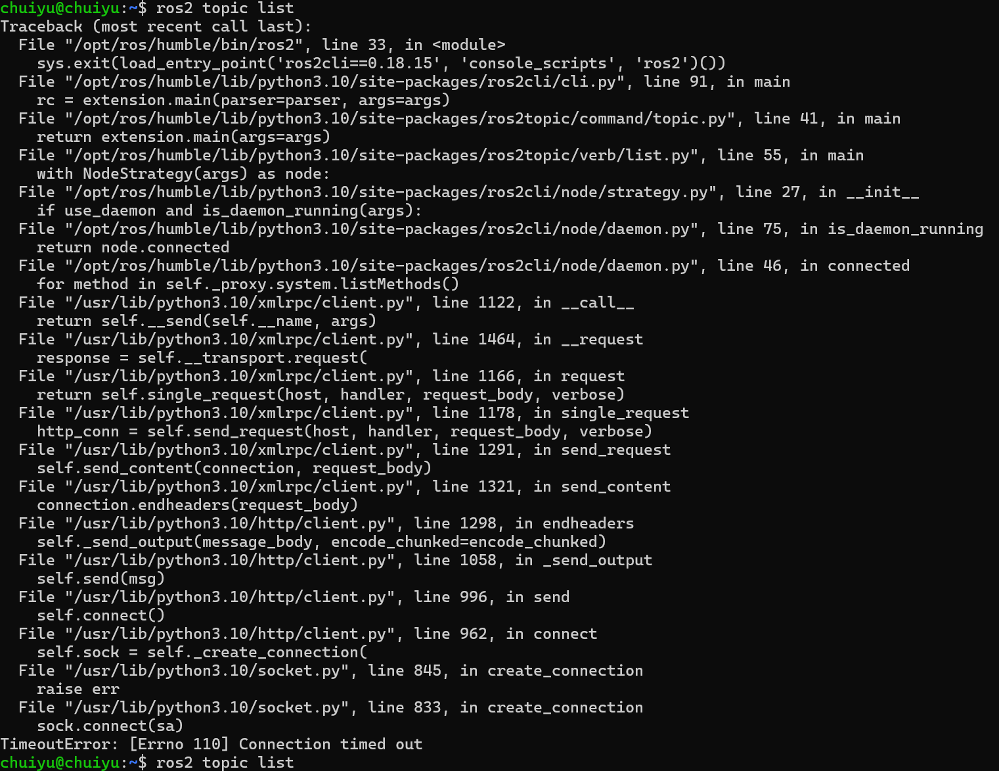

# 1.WSL2环境下ROS2 topic list 无反应

## 现象




## 解决
[wsl2 ROS2 出现ros2 topic list错误（超时Connection timed out/没有topic）节点通讯错误| wsl_ros2 daemon start-CSDN博客](https://blog.csdn.net/m0_72983004/article/details/148566437)

2026-2-27补充：
`ros2 daemon status` 命令用于检查 ROS 2 的守护进程是否正在运行。当你看到上述错误时，这通常意味着客户端尝试通过 XML-RPC 与守护进程通信时遇到了问题，连接被对方重置了。

这里有几个可能的解决步骤：

1. **检查守护进程是否确实在运行**：  
    确保你已经在你的系统上启动了 `ros2 daemon`。你可以使用 `ps` 命令或 `systemctl`（如果你是在使用支持它的系统上）来检查。
    
    例如，使用 `ps` 命令：
    
    ```bash
    ps aux | grep ros2_daemon
    ```
    
    或者使用 `systemctl`（如果适用）：
    
    ```bash
    systemctl status ros2-daemon.service
    ```
    
2. **重新启动守护进程**：  
    如果守护进程没有运行，尝试启动它：
    
    ```bash
    ros2 daemon start
    ```
    
    然后再次检查状态：
    
    ```bash
    ros2 daemon status
    ```
    
3. **检查防火墙和网络设置**：  
    确保没有任何防火墙或网络策略阻止了对守护进程端口的访问。ROS 2 守护进程默认使用 XML-RPC，通常是在 11311 端口上。
    