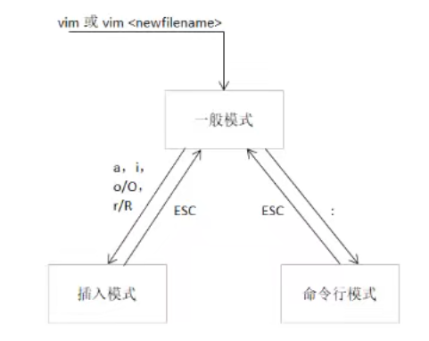

# 11.使用编辑器

## gedit编辑器

简单易懂，依赖图形界面，相当于windows的文本编辑器

```
gedit 123.txt
```


## vi/vim编辑器

为什么要学习vi/vim编辑器？

不需要依赖图形界面


### vi/vim的区别

vim是vi的升级版本

vi只能按u撤销一次，但vim可以无限撤销

vi只能运行类unix系统，vim还可以windows，mac

vim可高亮代码

vim可加插件


### vi/vim使用

#### 安装

```
sudo apt install vim
```


#### vi/vim的三种模式

一般模式

插入模式（编辑模式）

命令行模式


模式切换：




打开vi编辑器

```
vi
vi 文件名
```


进入/退出插入模式快捷键


## Vocode

在Ubuntu自带的软件中心可以找到VS Code软件，通过搜索“vscode”即可安装， 但目前Ubunut采用Snap软件市场来安装软件，暂时还没有国内的镜像下载源，所以下载可能需要花比较长的时间。

我们推荐直接在Ubuntu下使用浏览器在VS Code官网下载deb包进行安装，顺便学习deb包的安装方法。

VS Code官网地址：[https://code.visualstudio.com](https://code.visualstudio.com/)

VS Code 的安装步骤如下：

1. 到官网找到下载的选项，可看到Linux平台下分deb和rpm安装包， Debian和Ubuntu系统都是用deb包，如下图所示。

	

	下载后可以在浏览器中打开下载目录，默认的目录一般为用户家目录下的“/home/下载”。

	

	找到下载好的deb包，直接双击即可安装。(实测双击无反应，最后使用的命令行安装)

	

	

	如果想体验命令行安装deb包，可以使用以下命令：

	```
	sudo dpkg -i 安装包的名字
	```

	使用命令行安装过程如下图所示。

	

	安装完成后会有应用图标生成，双击打开即可，也可以通过终端打开，在终端下VS Code的打开命令为“code”：

	```
	# 在终端中执行行下列命令：
	code
	```

	### 添加插件

	1.中文

	2.C++


