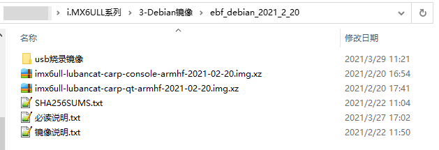

# 17.烧录Debian镜像至SD卡

目开发板出厂时板载的eMMC或NAND存储器已经默认烧录了carp-qt版本的镜像，可以启动后直接按后续教程使用。 但为了熟悉完整的开发流程以及方便学习时的各前种试验折腾，我们推荐烧录SD卡镜像，把系统安装至SD卡上运行。 特别是对于使用NAND FLASH（容量512MB）版本的用户，容量较小的存储器不方便安装各种软件进行学习。 制作好SD卡启动镜像后，按自己需要随时选择从SD卡启动或者从eMMC或NAND启动做以后教程步骤都可以。

## 简单烧录步骤

下面是烧录镜像至SD卡的简要说明：

- 准备Micro SD卡，推荐使用闪迪class 10的SD卡，容量2GB以上就完全足够。
- 准备读卡器，用于在电脑上读写SD卡。
- 电脑环境，Windows和Ubuntu系统均可。
- 下载Etcher软件，用于烧录镜像至SD卡，下载地址：https://www.balena.io/etcher ， 根据自己的电脑系统下载对应版本即可。
- 下载野火最新的Debian镜像：[6ULL总资料页中](https://doc.embedfire.com/products/link/zh/latest/linux/ebf_i.mx6ull.html) 的云盘Debian文件夹 使用其中的 **imx6ull-lubancat-carp-qt-armhf-202x-xx-xx.img.xz** 镜像文件，即最新的 `qt-app` 版本。
- 在电脑上使用Etcher软件把镜像文件通过读卡器烧录至SD卡。
- 把开发板控制启动模式的BOOT拨码开关设置成SD卡启动模式，即 `2-5-8` 档位至ON档。
- 给开发板接入烧录好的SD卡，启动运行。


## Etcher工具简介

Etcher是一款简易好用的镜像烧录工具，主要用于刻录镜像到USB设备，包括SD卡和U盘， 支持ios、img、zip、raw、sdcard等多种镜像格式。它的用户界面清爽美观，操作简单， 在软件自动识别到USB设备后，点击几次鼠标就能完成镜像的烧录。

同时Etcher是一个跨平台工具，支持 Mac、Windows 和 Linux ， 国内外开发者常用它将树莓派SD卡启动镜像烧录到SD卡中。


### 下载安装Etcher工具

打开Etcher官网地址: https://www.balena.io/etcher/ , 在官网首页有Etcher工具的下载链接，用户可以根据自己的操作系统类型，来下载对应版本的软件安装包。


下载完成后，直接安装软件即可。

### 烧录Debian镜像

1、下载野火最新发布的Debian系统镜像：

镜像发布地址:

```
https://doc.embedfire.com/lubancat/os_release_note/zh/latest/board/nxp/imx6ull/index.html#imx6ull
```

SOURCEFORGE:

| `1`  | `https://sourceforge.net/projects/ebf-debian-firmware/files/ ` |
| ---- | ------------------------------------------------------------ |
|      |                                                              |

2、打开安装好的Etcher工具，软件界面如下图所示:


3、选择要烧录的镜像，野火提供的Debian镜像两个不同版本，如下图所示:



- console版本： Debian的纯净版固件，没有带桌面环境和野火的QT App。（解压后约340M）
- carp-qt版本: 具有QT App功能的Debian固件,系统启动后会进入QT App的界面。
- 必读说明.txt:烧录前必读文件。
- 镜像说明.txt:文件有固件的使用说明以及版本改动的记录。
- SHA256SUMS.txt:记录各个固件的sha256校验值。

4、选择好Debian镜像后，继续选择要烧录的SD卡，然后点击“flash”按钮开始进行烧录。


烧录过程会显示镜像的烧录进度，如下图


5、等到软件出现出现如下界面时，表示镜像已经成功烧录完毕。


6、开发板插入烧录好Debian镜像的SD卡，调整拨码开关为SD卡启动方式，然后注意使用SD卡时开发板右下角的J2竖排针不要盖有跳帽需断开（此为WIFI模块供电，核心板只引出一路SDIO，SD卡和WIFI不能同时用）

注意:开发板第一次从SD卡启动时，系统会自动进行SD卡扩容， 以保证充分利用SD卡存储空间。扩容完毕后，系统自动重启生效。

系统启动以后，输入用户密码登录即可：

普通用户:

```
账户:debian
密码:temppwd
```

ROOT用户

```
账户:root
密码:root
```

