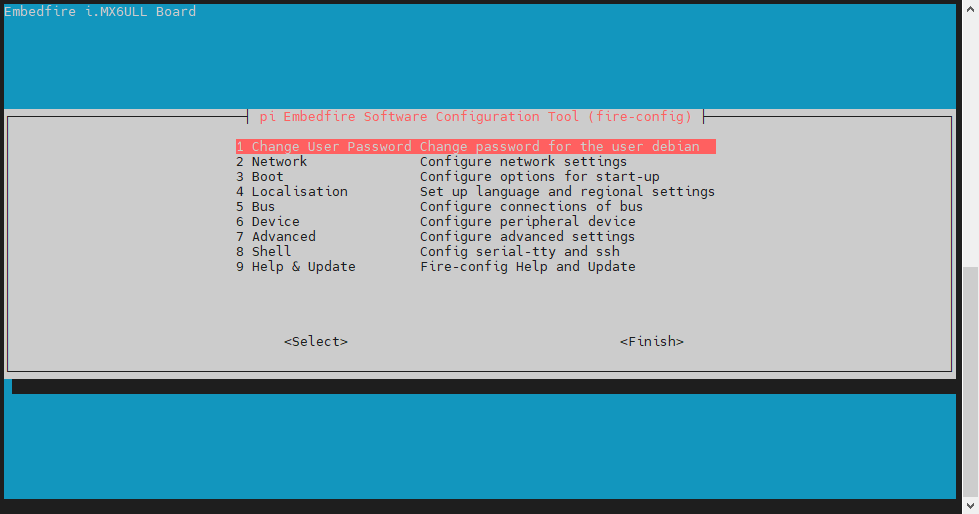

# 18.fire-config工具简介

**注意:该工具专用于野火新发布的Debian系统镜像,不适合用于野火旧版本镜像和其他任何的Linux系统上，望知悉!**

fire-config是野火IMX-6ULL开发板自带的一个系统配置工具， 通过串口终端或远程终端可以方便地使用它来进行系统功能的使能或禁止。

## 使用方法

在登录系统以后，如果要使用fire-config工具，只需要运行以下命令

```
sudo fire-config

注意:由于该工具会改变一系列不属于当前用户的文件，sudo是必须要加的。
```

执行指令后，在终端的显示界面如下:


串口终端界面



ssh远程终端界面

## 菜单选择和移动

在该菜单中，使用up和down箭头键可以在不同的选项中切换，被选中的一项将会高亮显示， 使用right箭头键将跳出“选项”，并跳转到<Select>和<Finish>按钮。按下left将使您返回选项。 <Select>按钮表示该项被选中，<Finish>按钮表示已完成全部配置项。


由于无板子暂时不看......

链接：
[9. fire-config工具简介 — [野火\]嵌入式Linux基础与应用开发实战指南——基于i.MX6ULL开发板 文档](https://doc.embedfire.com/linux/imx6/linux_base/zh/latest/linux_basis/fire-config_brief/fire-config_brief.html)


