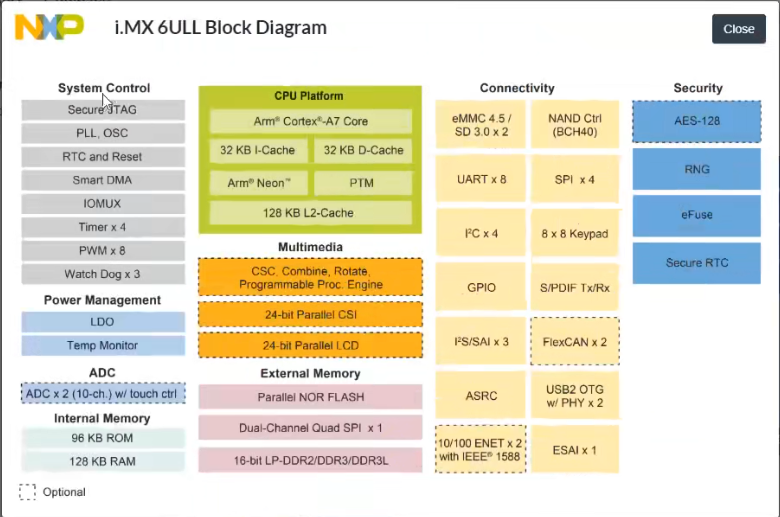
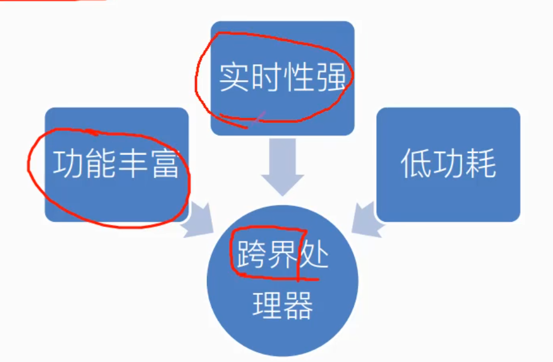

# 3.i.MX系列芯片简介

##### ARM体系架构

###### 几个概念解析

指令集是指CPU硬件与软件之间的接口描述。

​	RISC(精简指令集)：8051\X86

​	CISC(复杂指令集)：ARM、RISC-V

架构：主要指某一个处理器所使用的具体指令集。

处理器/内核：指令集是实物化。

芯片，多指soc，由内核+其它模块组成

###### ARM授权方式

指令集/架构授权

内核授权

使用授权

###### Cortex A7 内核简介

基于ARM V7架构，侧重于性能与功耗平衡

常用于big.LITTLE架构（大核+小核架构）

##### i.MX RT简介

