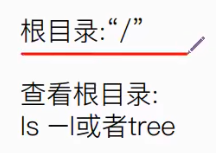
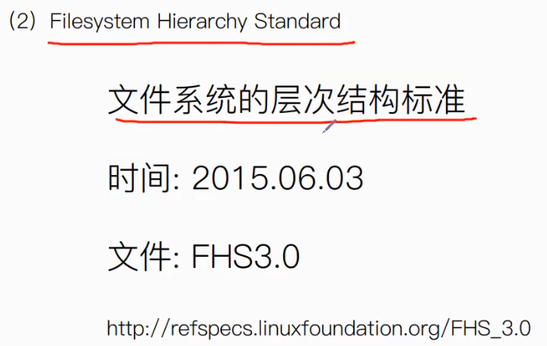
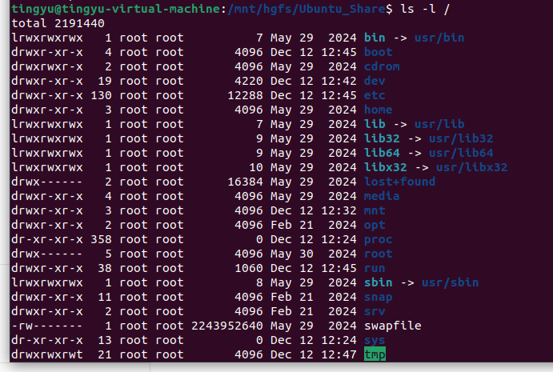
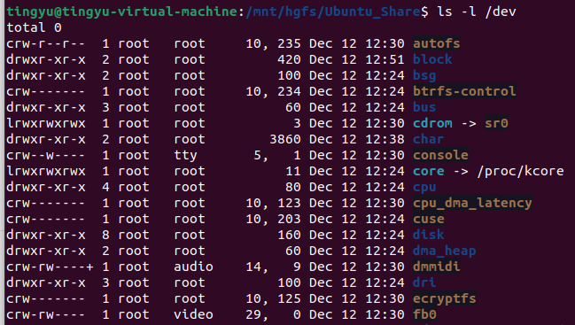
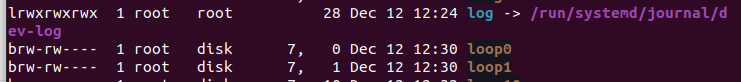

# 6.Linux文件目录


##### 1.Linux目录层次标准

（1）Linux目录文件认识：


结构：树形


（2）结构层次标准




##### 2.各个文件的用途：

bin.:存放二进制文件，包括命令行的函数的驱动文件等，例如ls、bash。

boot:bootloader 启动文件，

​			grub：启动程序，相当于嵌入式中的uboot

cdrom：挂载cd镜像，但逐渐被淘汰

dev：device 设备，跟设备相关的文件，操控外设就是操控dev下的文件来实现的

etc：系统配置文件，应用程序配置文件

home：普通用户的主目录

lib:存放lib库，bin目录中的库文件

lib64： 跟lib库作用相似，lib针对32位操作系统，lib64针对64位

media：媒体，多媒体设备挂在media下面，例如U盘目录会放到media下

mnt:mount简写，挂载。跟media相似，设备挂载等

opt:option，可选的，经常用来做软件测试，相当于草稿文件存放的地方

proc:存放一些程序相关的信息，里面有很多数字命名的文件夹，数字就是该应用程序的代号，其它杂乱信息有CPU信息等

root：系统管理员的主目录

run:运行的意思，存放系统运行以来的一些信息

sbin：跟bin类似，但是sbin里的文件只有root用户才能执行的（sudo）

snap：Ubuntu系统新型的软件管理工具

srv：存放网络服务相关信息

sys：存放硬件操作的接口

tmp：Templar暂时的，临时存储的内容，例如中间文件

usr：存放系统大部分的软件

var：易变的文件


##### 3.文件类型介绍


```Linux
ls -l /
//查看根目录下子目录的详细情况
```



左边第一列代表文件的类型。

bin目录，字符d表示目录文件

swapfire，字符-代表它是一个普通文件

sbin，指向一个目录，字符l表示链接文件



设备文件：

autofs：字符c表示设备文件



loop0：字符b表示快设备文件

##### 4.路径介绍：绝对相对


